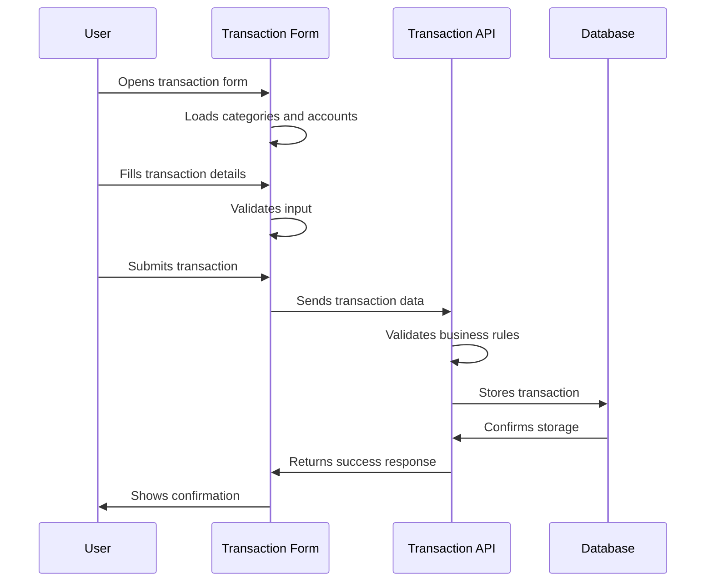
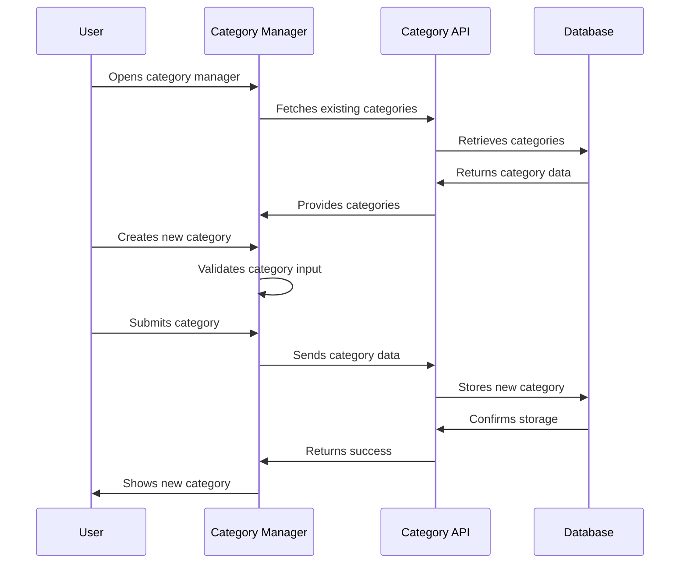
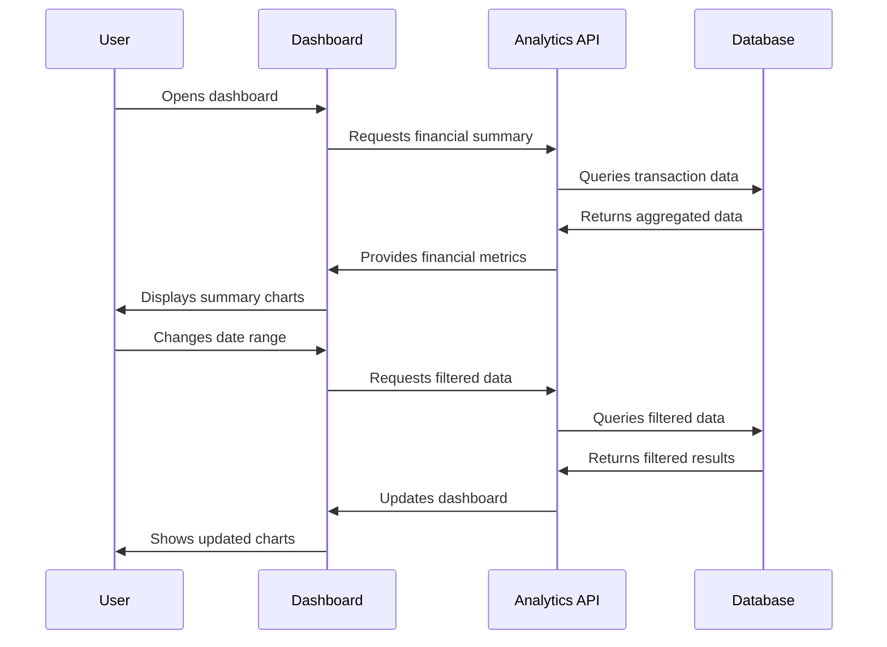

# User Stories - Ideation Approach

## Personal Finance Management System

### Context

This document outlines the user stories for implementing the personal finance management system using the ideation methodology. The system addresses the core opportunity of helping individuals take control of their personal finances through systematic tracking, categorization, and insights.

---

## **Opportunity Refinement**

### **Problem Statement**
Individuals struggle to effectively manage their personal finances due to scattered financial information, lack of systematic tracking, and difficulty in understanding spending patterns.

### **Target Audience**
- **Primary**: Working professionals and freelancers seeking better financial control
- **Secondary**: Families managing household finances and recurring bills
- **Tertiary**: Individuals looking to understand and improve spending habits

### **Solution Approach**
A web-based personal finance management system with transaction tracking, budgeting, goal setting, and financial analytics, built with modern architecture principles for reliability and scalability.

---

## **Capability Mapping**

### **Epic 1: Transaction Management (Core Capability)**
**Description**: Core system for recording, categorizing, and managing all financial transactions with support for complex scenarios.

**Business Value**: Foundation for all financial analysis and planning activities.

**User Stories**:
- **User Story 2.1**: Basic Transaction Creation
- **User Story 2.2**: Transaction Categories
- **User Story 2.3**: Transaction Frequency
- **User Story 2.4**: Transaction Composition
- **User Story 2.5**: Bank Account Integration

### **Epic 2: Financial Analytics & Reporting**
**Description**: Comprehensive financial insights through data visualization, trend analysis, and customizable reports.

**Business Value**: Enables informed financial decision-making and goal achievement.

**User Stories**:
- **User Story 3.1**: Transaction Overview
- **User Story 3.2**: Category Analysis
- **User Story 3.3**: Interactive Dashboard

### **Epic 3: User Management & Security**
**Description**: Secure user authentication, profile management, and data protection.

**Business Value**: Builds user trust and enables multi-user support.

**User Stories**:
- **User Story 1.1**: Basic User Setup
- **User Story 1.2**: User Profile Management
- **User Story 1.3**: Secure Access

---

## **Feature Details & Use Cases**

### **User Story 2.1: Basic Transaction Creation**
**Goal**: Implement complete transaction module with basic CRUD operations using mock user

**Capability**: Transaction Management
**Feature**: Basic Transaction Operations

**Main User Activity Use Case**:

**Activity Variations Table**:

| Activity | Core Variation | Minor Variations | Implementation Priority |
|----------|----------------|------------------|------------------------|
| **Create Transaction** | Basic income/expense entry | • Transaction composition • Recurring setup • Attachment upload | Must (Core) |
| **Edit Transaction** | Modify existing transaction | • Bulk editing • History tracking • Approval workflow | Must (Core) |
| **Delete Transaction** | Remove transaction with confirmation | • Soft delete • Archive option • Bulk deletion | Must (Core) |
| **View Transactions** | List with basic filtering | • Advanced filtering • Sorting options • Pagination • Search functionality | Must (Core) |

**Development Stories**:
- **DS-1**: Project Foundation Setup
- **DS-2**: Transaction Database Schema
- **DS-3**: Transaction Value Objects
- **DS-4**: Transaction Repository Layer
- **DS-5**: Mock User Service (Simple)
- **DS-6**: Transaction Service Implementation
- **DS-7**: Transaction Controller and DTOs

**User Story Deliverables**:
- [ ] Create income transactions (positive amounts)
- [ ] Create expense transactions (negative amounts)
- [ ] Set transaction date and description
- [ ] Choose from predefined categories
- [ ] Validate transaction data with helpful errors
- [ ] Store transaction in database reliably
- [ ] View transaction list with filtering and sorting
- [ ] Edit existing transactions through interface
- [ ] Delete transactions with confirmation
- [ ] Interface works on mobile and desktop
- [ ] Form validation provides helpful error messages
- [ ] Loading states and optimistic updates

---

### **User Story 2.2: Transaction Categories**
**Goal**: Implement category management system for organizing transactions

**Capability**: Transaction Management
**Feature**: Transaction Categorization

**Main User Activity Use Case**:

**Activity Variations Table**:

| Activity | Core Variation | Minor Variations | Implementation Priority |
|----------|----------------|------------------|------------------------|
| **Create Category** | Basic category with name and color | • Hierarchical categories • Category icons • Category rules | Should (Week 3) |
| **Edit Category** | Modify name and color | • Bulk editing • Category merging • Usage statistics | Should (Week 3) |
| **Delete Category** | Remove unused category | • Safe deletion checks • Category reassignment • Archive option | Should (Week 3) |
| **Assign Categories** | Link category to transaction | • Auto-categorization • Smart suggestions • Bulk assignment | Should (Week 3) |

**Development Stories**:
- **DS-8**: Category Service Implementation
- **DS-9**: Category Controller and DTOs

**User Story Deliverables**:
- [ ] View list of available categories with names and colors
- [ ] Create custom categories with name and color
- [ ] Assign categories to transactions
- [ ] Edit existing category names and colors
- [ ] Delete unused categories safely
- [ ] Hierarchical category support
- [ ] Default categories seeder
- [ ] Category validation and error handling

---

### **User Story 3.1: Transaction Overview**
**Goal**: Implement basic reporting and transaction overview functionality

**Capability**: Financial Analytics & Reporting
**Feature**: Transaction Overview

**Main User Activity Use Case**:

**Activity Variations Table**:

| Activity | Core Variation | Minor Variations | Implementation Priority |
|----------|----------------|------------------|------------------------|
| **View Financial Summary** | Basic income/expense totals | • Net worth tracking • Cash flow analysis • Budget vs actual | Must (Week 4) |
| **Filter Reports** | Date range selection | • Category filtering • Account filtering • Custom date ranges | Must (Week 4) |
| **Export Data** | CSV download | • PDF reports • Email summaries • API access | Should (Week 4) |
| **Interactive Charts** | Basic bar/line charts | • Drill-down capabilities • Chart customization • Real-time updates | Should (Week 4) |

**Development Stories**:
- **DS-19**: Transaction Query Service
- **DS-20**: Transaction Aggregation Service
- **DS-21**: Transaction Overview Controller

**User Story Deliverables**:
- [ ] View total income and expenses for a period
- [ ] See net income/expense calculations
- [ ] Filter transactions by date range
- [ ] Filter by transaction type (income/expense)
- [ ] Sort transactions by date, amount, or category
- [ ] Date range aggregation calculations
- [ ] Optimized database queries
- [ ] Input validation and error handling

---

## **Implementation Phases**

### **Phase 1: Foundation & Core Transactions (Week 1-2)**
**Goal**: Set up project structure and implement core transaction functionality

**Focus**: Basic CRUD operations, simple categorization, essential validation
**Simplifications**: Mock user, basic categories, simple forms
**Deliverables**: Working transaction system with basic UI

**User Stories to Complete**:
- **User Story 2.1**: Basic Transaction Creation (Backend & Frontend)

### **Phase 2: Advanced Features (Week 3)**
**Goal**: Implement advanced transaction features and category management

**Focus**: Recurring transactions, composition, category management
**Simplifications**: Basic recurrence patterns, simple composition rules
**Deliverables**: Complete transaction management system

**User Stories to Complete**:
- **User Story 2.2**: Transaction Categories
- **User Story 2.3**: Transaction Frequency
- **User Story 2.4**: Transaction Composition
- **User Story 2.5**: Bank Account Integration

### **Phase 3: Reporting & Analytics (Week 4)**
**Goal**: Implement basic reporting and transaction overview functionality

**Focus**: Financial summaries, category analysis, basic charts
**Simplifications**: Basic reporting, simple charts, essential exports
**Deliverables**: Complete reporting system with interactive dashboards

**User Stories to Complete**:
- **User Story 3.1**: Transaction Overview
- **User Story 3.2**: Category Analysis
- **User Story 3.3**: Interactive Dashboard

### **Phase 4: User Authentication & Security (Week 5)**
**Goal**: Implement real user authentication and profile management

**Focus**: User registration, authentication, profile management
**Simplifications**: Basic RBAC, essential security measures
**Deliverables**: Multi-user system with security

**User Stories to Complete**:
- **User Story 1.1**: Basic User Setup
- **User Story 1.2**: User Profile Management
- **User Story 1.3**: Secure Access

### **Phase 5: Integration & Testing (Week 6)**
**Goal**: Complete system integration and comprehensive testing

**Focus**: End-to-end testing, performance optimization, security validation
**Simplifications**: Focus on core functionality reliability
**Deliverables**: Production-ready system

**User Stories to Complete**:
- **User Story 4.1**: End-to-End Workflows

---

## **Success Criteria**

### **Functional Requirements**
- Mock user can create and manage transactions
- All basic CRUD operations work correctly
- Recurring transactions generate automatically
- Transaction composition works with mathematical expressions
- Bank accounts can be created and linked to transactions
- Basic reporting provides accurate summaries
- Category analysis shows meaningful insights

### **Technical Requirements**
- All features are covered by integration tests
- API is well-documented and consistent
- Database queries are optimized
- Error handling is comprehensive
- Code follows DDD principles
- Type safety is maintained throughout

### **Quality Requirements**
- Code coverage > 80%
- All endpoints return proper HTTP status codes
- Validation errors are user-friendly
- Performance meets requirements (< 500ms response time)
- Database transactions are atomic

### **Business Value Requirements**
- Users can complete financial management tasks successfully
- System provides actionable financial insights
- Users feel confident managing their finances
- Application meets user expectations for reliability

---

## **Key Dependencies**

- **Database**: PostgreSQL with TypeORM
- **Validation**: class-validator
- **Testing**: Jest with supertest
- **Documentation**: Swagger/OpenAPI
- **Scheduling**: node-cron for recurring transactions

---

## **Next Steps After Milestone 1**

1. **User Authentication**: Implement real user authentication and profile management
2. **Budget Module**: Add budget planning and tracking
3. **Goal Module**: Implement financial goal setting
4. **Notification Module**: Add alerts and reminders
5. **Mobile App**: Create React Native mobile application
6. **Advanced Analytics**: Implement detailed financial insights

---

## **Notes**

- **Mock User**: Single hardcoded user for development until Week 5
- **DDD Principles**: Strict adherence to domain boundaries
- **Testing**: Integration tests for all user stories
- **Documentation**: API documentation for all endpoints
- **Performance**: Monitor and optimize database queries
- **Development Order**: Transactions first, then reporting, then authentication
- **Business Focus**: Every feature delivers clear user value and outcomes
- **Ideation Approach**: Following opportunity → capability → feature → activity → variation mapping

This plan provides a clear roadmap for implementing the first milestone with specific user stories assigned to each phase, ensuring systematic development and proper testing throughout the process, while maintaining focus on business value and user outcomes following the ideation methodology.
