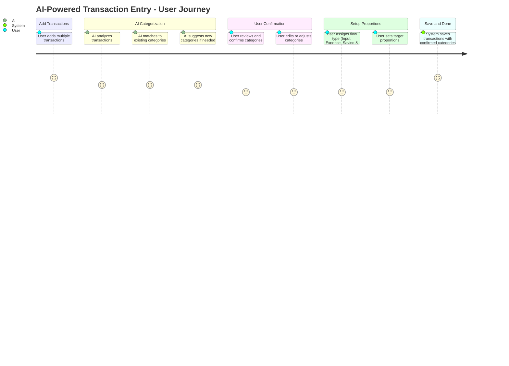

# Main User Journey - Ideation Approach

## **Opportunity Context**
Individuals struggle to effectively manage their personal finances due to scattered financial information, lack of systematic tracking, and difficulty in understanding spending patterns.

## **Core Capability**
Transaction Management - Enable users to record, categorize, and manage all financial activities systematically.

## **Main User Journey: AI-Powered Transaction Entry**

## **Journey Analysis**

### **Opportunity Alignment**
This journey directly addresses the core problem of scattered financial information by providing a systematic approach to transaction entry and categorization.

### **Capability Delivery**
- **Transaction Management**: Core transaction creation and categorization
- **Financial Analytics**: Flow type classification and proportion tracking
- **User Experience**: AI assistance and user confirmation workflow

### **Variation Considerations**
- **Core Variation**: Basic transaction entry with AI categorization
- **Minor Variations**: 
  - Bulk transaction import
  - Manual category override
  - Advanced flow type configurations
  - Historical pattern learning

### **Implementation Priority**
- **Must Have**: Basic transaction entry and AI categorization
- **Should Have**: Flow type assignment and proportion tracking
- **Could Have**: Advanced AI learning and bulk operations

## **Success Metrics**
- Users can complete transaction entry in under 2 minutes
- AI categorization accuracy > 90%
- User satisfaction with categorization > 4.5/5
- Reduction in manual category assignment by 70%

## **Next Steps**
1. Validate journey with potential users
2. Implement core transaction entry functionality
3. Add basic AI categorization
4. Iterate based on user feedback
