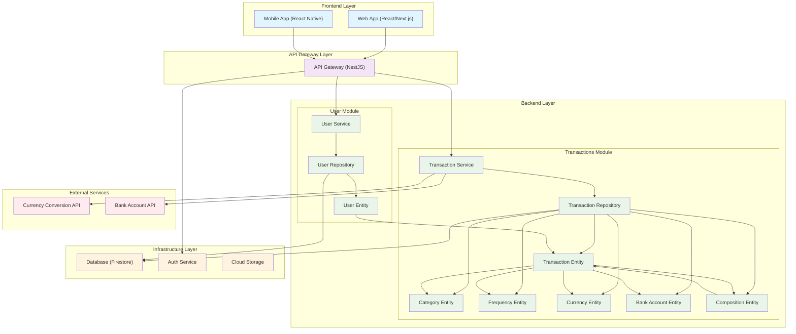

```mermaid
graph TB
    %% Frontend Layer
    subgraph "Frontend Layer"
        Web["Web App (React/Next.js)"]
        Mobile["Mobile App (React Native)"]
    end

    %% API Gateway Layer
    subgraph "API Gateway Layer"
        Gateway["API Gateway (NestJS)"]
    end

    %% Backend Layer
    subgraph "Backend Layer"
        subgraph "User Module"
            UserEntity["User Entity"]
            UserService["User Service"]
            UserRepository["User Repository"]
        end

        subgraph "Transactions Module"
            TransactionEntity["Transaction Entity"]
            CategoryEntity["Category Entity"]
            FrequencyEntity["Frequency Entity"]
            CurrencyEntity["Currency Entity"]
            BankAccountEntity["Bank Account Entity"]
            CompositionEntity["Composition Entity"]

            TransactionService["Transaction Service"]
            TransactionRepository["Transaction Repository"]
        end
    end

    %% Infrastructure Layer
    subgraph "Infrastructure Layer"
        Database["Database (Firestore)"]
        AuthService["Auth Service"]
        Storage["Cloud Storage"]
    end

    %% External Services
    subgraph "External Services"
        CurrencyAPI["Currency Conversion API"]
        BankAPI["Bank Account API"]
    end

    %% Connections
    Web --> Gateway
    Mobile --> Gateway

    Gateway --> UserService
    Gateway --> TransactionService

    UserService --> UserRepository
    TransactionService --> TransactionRepository

    UserRepository --> UserEntity
    TransactionRepository --> TransactionEntity
    TransactionRepository --> CategoryEntity
    TransactionRepository --> FrequencyEntity
    TransactionRepository --> CurrencyEntity
    TransactionRepository --> BankAccountEntity
    TransactionRepository --> CompositionEntity

    UserRepository --> Database
    TransactionRepository --> Database

    TransactionService --> CurrencyAPI
    TransactionService --> BankAPI

    Gateway --> AuthService

    %% Domain Relationships
    UserEntity --> TransactionEntity
    TransactionEntity --> CategoryEntity
    TransactionEntity --> FrequencyEntity
    TransactionEntity --> CurrencyEntity
    TransactionEntity --> BankAccountEntity
    TransactionEntity --> CompositionEntity

    CompositionEntity --> TransactionEntity

    %% Styling
    classDef frontend fill:#e1f5fe
    classDef gateway fill:#f3e5f5
    classDef backend fill:#e8f5e8
    classDef infrastructure fill:#fff3e0
    classDef external fill:#ffebee

    class Web,Mobile frontend
    class Gateway gateway
    class UserEntity,UserService,UserRepository,TransactionEntity,CategoryEntity,FrequencyEntity,CurrencyEntity,BankAccountEntity,CompositionEntity,TransactionService,TransactionRepository backend
    class Database,AuthService,Storage infrastructure
    class CurrencyAPI,BankAPI external
```
