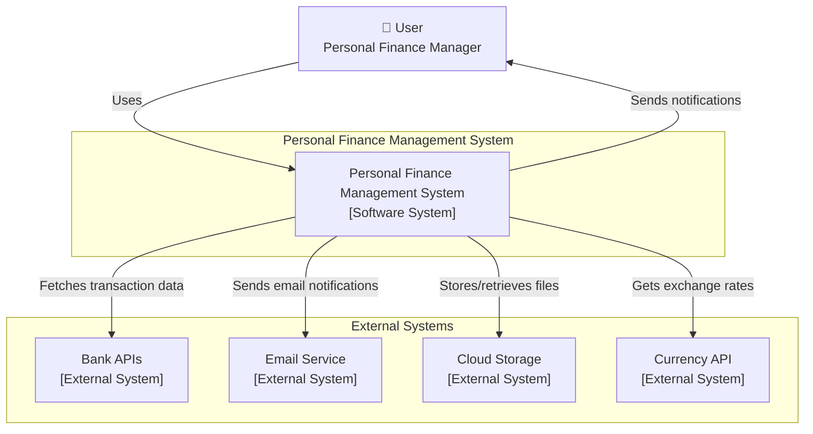

```mermaid
graph TB
    User["👤 User<br/>Personal Finance Manager"]

    subgraph PFMS["Personal Finance Management System"]
        PFMS_System["Personal Finance Management System<br/>[Software System]"]
    end

    User -->|"Uses"| PFMS_System
    PFMS_System -->|"Sends notifications"| User

    subgraph External["External Systems"]
        BankAPI["Bank APIs<br/>[External System]"]
        EmailService["Email Service<br/>[External System]"]
        CloudStorage["Cloud Storage<br/>[External System]"]
        CurrencyAPI["Currency API<br/>[External System]"]
    end

    PFMS_System -->|"Fetches transaction data"| BankAPI
    PFMS_System -->|"Sends email notifications"| EmailService
    PFMS_System -->|"Stores/retrieves files"| CloudStorage
    PFMS_System -->|"Gets exchange rates"| CurrencyAPI
```
