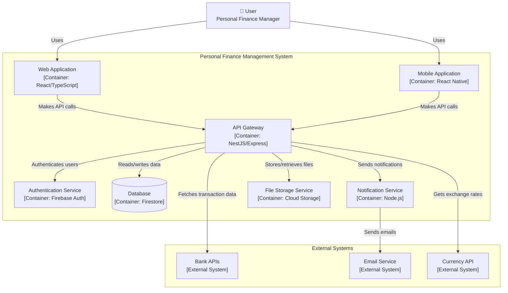

```mermaid
graph TB
    User["👤 User<br/>Personal Finance Manager"]

    subgraph PFMS["Personal Finance Management System"]
        WebApp["Web Application<br/>[Container: React/TypeScript]"]
        MobileApp["Mobile Application<br/>[Container: React Native]"]
        API["API Gateway<br/>[Container: NestJS/Express]"]
        AuthService["Authentication Service<br/>[Container: Firebase Auth]"]
        Database[("Database<br/>[Container: Firestore]")]
        NotificationService["Notification Service<br/>[Container: Node.js]"]
        FileStorage["File Storage Service<br/>[Container: Cloud Storage]"]
    end

    User -->|"Uses"| WebApp
    User -->|"Uses"| MobileApp

    WebApp -->|"Makes API calls"| API
    MobileApp -->|"Makes API calls"| API

    API -->|"Authenticates users"| AuthService
    API -->|"Reads/writes data"| Database
    API -->|"Sends notifications"| NotificationService
    API -->|"Stores/retrieves files"| FileStorage

    subgraph External["External Systems"]
        BankAPI["Bank APIs<br/>[External System]"]
        EmailService["Email Service<br/>[External System]"]
        CurrencyAPI["Currency API<br/>[External System]"]
    end

    API -->|"Fetches transaction data"| BankAPI
    NotificationService -->|"Sends emails"| EmailService
    API -->|"Gets exchange rates"| CurrencyAPI
```
