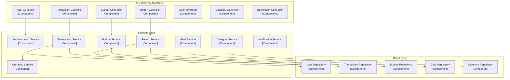

```mermaid
graph TB
    subgraph API["API Gateway Container"]
        AuthController["Auth Controller<br/>[Component]"]
        TransactionController["Transaction Controller<br/>[Component]"]
        BudgetController["Budget Controller<br/>[Component]"]
        GoalController["Goal Controller<br/>[Component]"]
        CategoryController["Category Controller<br/>[Component]"]
        ReportController["Report Controller<br/>[Component]"]
        NotificationController["Notification Controller<br/>[Component]"]
    end

    subgraph Services["Services Layer"]
        AuthService["Authentication Service<br/>[Component]"]
        TransactionService["Transaction Service<br/>[Component]"]
        BudgetService["Budget Service<br/>[Component]"]
        GoalService["Goal Service<br/>[Component]"]
        CategoryService["Category Service<br/>[Component]"]
        ReportService["Report Service<br/>[Component]"]
        NotificationService["Notification Service<br/>[Component]"]
        CurrencyService["Currency Service<br/>[Component]"]
    end

    subgraph Data["Data Layer"]
        UserRepository["User Repository<br/>[Component]"]
        TransactionRepository["Transaction Repository<br/>[Component]"]
        BudgetRepository["Budget Repository<br/>[Component]"]
        GoalRepository["Goal Repository<br/>[Component]"]
        CategoryRepository["Category Repository<br/>[Component]"]
    end

    AuthController --> AuthService
    TransactionController --> TransactionService
    BudgetController --> BudgetService
    GoalController --> GoalService
    CategoryController --> CategoryService
    ReportController --> ReportService
    NotificationController --> NotificationService

    AuthService --> UserRepository
    TransactionService --> TransactionRepository
    BudgetService --> BudgetRepository
    GoalService --> GoalRepository
    CategoryService --> CategoryRepository
    TransactionService --> CurrencyService
    ReportService --> TransactionRepository
    ReportService --> BudgetRepository
```
