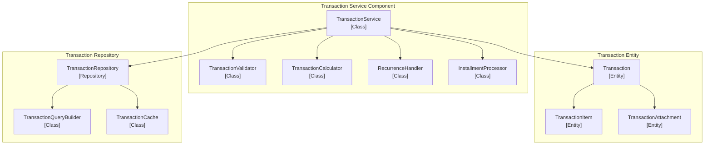

Focusing on transactions

```mermaid
graph TB
    subgraph TransactionService["Transaction Service Component"]
        TS["TransactionService<br/>[Class]"]
        TV["TransactionValidator<br/>[Class]"]
        TC["TransactionCalculator<br/>[Class]"]
        RH["RecurrenceHandler<br/>[Class]"]
        IP["InstallmentProcessor<br/>[Class]"]
    end

    subgraph TransactionEntity["Transaction Entity"]
        T["Transaction<br/>[Entity]"]
        TI["TransactionItem<br/>[Entity]"]
        TA["TransactionAttachment<br/>[Entity]"]
    end

    subgraph TransactionRepository["Transaction Repository"]
        TR["TransactionRepository<br/>[Repository]"]
        TQB["TransactionQueryBuilder<br/>[Class]"]
        TCache["TransactionCache<br/>[Class]"]
    end

    TS --> TV
    TS --> TC
    TS --> RH
    TS --> IP

    TS --> TR
    TR --> TQB
    TR --> TCache

    TS --> T
    T --> TI
    T --> TA
```
