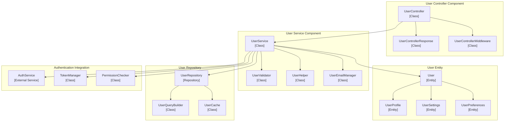

For user modules

```mermaid
graph TB
    subgraph UserController["User Controller Component"]
        UC["UserController<br/>[Class]"]
        UCR["UserControllerResponse<br/>[Class]"]
        UCM["UserControllerMiddleware<br/>[Class]"]
    end

    subgraph UserService["User Service Component"]
        US["UserService<br/>[Class]"]
        UV["UserValidator<br/>[Class]"]
        UH["UserHelper<br/>[Class]"]
        UEM["UserEmailManager<br/>[Class]"]
    end

    subgraph UserEntity["User Entity"]
        U["User<br/>[Entity]"]
        UP["UserProfile<br/>[Entity]"]
        USettings["UserSettings<br/>[Entity]"]
        UPreferences["UserPreferences<br/>[Entity]"]
    end

    subgraph UserRepository["User Repository"]
        UR["UserRepository<br/>[Repository]"]
        UQB["UserQueryBuilder<br/>[Class]"]
        UCache["UserCache<br/>[Class]"]
    end

    subgraph AuthIntegration["Authentication Integration"]
        AuthService["AuthService<br/>[External Service]"]
        TokenManager["TokenManager<br/>[Class]"]
        PermissionChecker["PermissionChecker<br/>[Class]"]
    end

    UC --> US
    UC --> UCR
    UC --> UCM

    US --> UV
    US --> UH
    US --> UEM

    US --> UR
    UR --> UQB
    UR --> UCache

    US --> U
    U --> UP
    U --> USettings
    U --> UPreferences

    US --> AuthService
    US --> TokenManager
    US --> PermissionChecker
```
