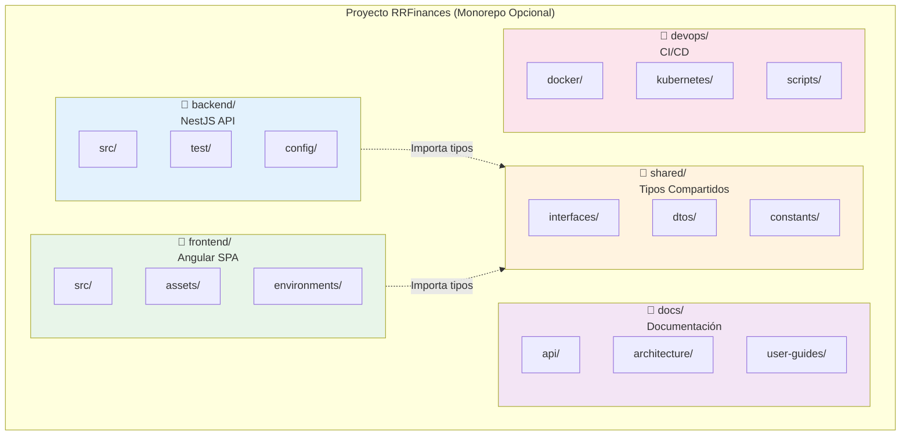
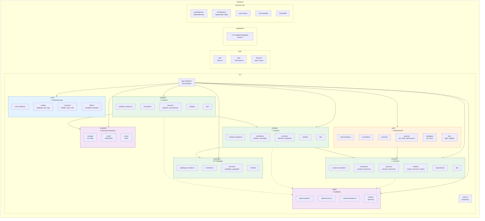
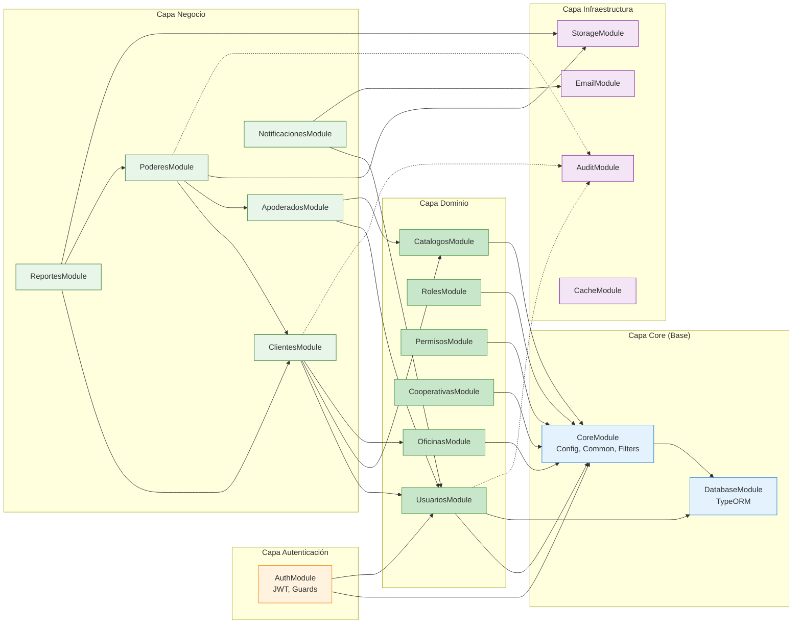
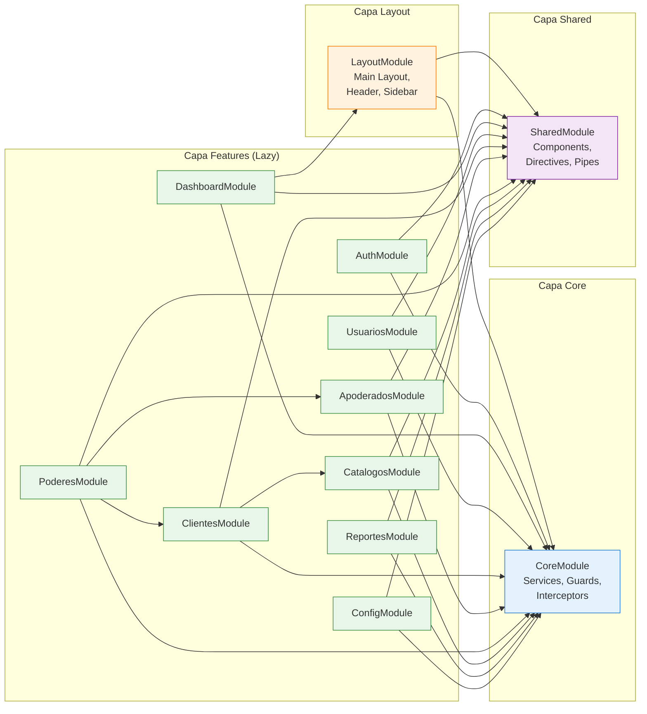

# Diagrama de Paquetes y Módulos - Estructura del Proyecto

## 1. Vista General de la Organización del Proyecto



## 2. Estructura Detallada del Backend (NestJS)



## 3. Estructura Detallada del Frontend (Angular)

```mermaid
graph TB
    subgraph Frontend["frontend/"]
        subgraph SrcDir["src/"]
            MainTs["main.ts<br/>Bootstrap"]
            IndexHtml["index.html"]
            StylesScss["styles.scss"]
            
            subgraph AppDir["app/"]
                AppComponent["app.component.ts<br/>Root"]
                AppModule["app.module.ts"]
                AppRouting["app-routing.module.ts"]
                
                subgraph CoreDir["core/<br/>🔧 Singleton Services"]
                    CoreModule["core.module.ts"]
                    CoreServices["services/<br/>auth, storage,<br/>notification, loading"]
                    CoreGuards["guards/<br/>auth, role, permission"]
                    CoreInterceptors["interceptors/<br/>auth, error, loading"]
                    CoreModels["models/<br/>user, auth-response"]
                end
                
                subgraph SharedDir["shared/<br/>🔄 Componentes Reutilizables"]
                    SharedModule["shared.module.ts"]
                    SharedComponents["components/<br/>button, card, table,<br/>modal, pagination"]
                    SharedDirectives["directives/<br/>has-role, has-permission"]
                    SharedPipes["pipes/<br/>truncate, safe, date-ago"]
                    SharedModels["models/"]
                end
                
                subgraph LayoutDir["layout/<br/>🖼️ Layout"]
                    LayoutModule["layout.module.ts"]
                    MainLayout["main-layout/"]
                    Header["header/"]
                    Sidebar["sidebar/"]
                    Footer["footer/"]
                end
                
                subgraph FeaturesDir["features/<br/>💼 Módulos de Negocio (Lazy)"]
                    subgraph AuthFeature["auth/<br/>🔐"]
                        AuthFModule["auth.module.ts"]
                        AuthLogin["login/"]
                        AuthForgot["forgot-password/"]
                    end
                    
                    subgraph DashboardFeature["dashboard/<br/>📊"]
                        DashboardModule["dashboard.module.ts"]
                        DashboardComp["dashboard.component.ts"]
                    end
                    
                    subgraph UsuariosFeature["usuarios/<br/>👤"]
                        UsuariosFModule["usuarios.module.ts"]
                        UsuariosServices["services/"]
                        UsuariosComponents["components/<br/>list, form, detail"]
                        UsuariosModels["models/"]
                    end
                    
                    subgraph ClientesFeature["clientes/<br/>👥"]
                        ClientesFModule["clientes.module.ts"]
                        ClientesServices["services/"]
                        ClientesComponents["components/<br/>list, buscar,<br/>form, detail"]
                    end
                    
                    subgraph PoderesFeature["poderes/<br/>📜"]
                        PoderesFModule["poderes.module.ts"]
                        PoderesServices["services/"]
                        PoderesComponents["components/<br/>list, form, detail"]
                    end
                    
                    subgraph CatalogosFeature["catalogos/<br/>📋"]
                        CatalogosFModule["catalogos.module.ts"]
                        CatalogosServices["services/"]
                        CatalogosComponents["components/"]
                    end
                    
                    subgraph ReportesFeature["reportes/<br/>📈"]
                        ReportesFModule["reportes.module.ts"]
                        ReportesServices["services/"]
                        ReportesComponents["components/"]
                    end
                end
                
                subgraph StateDir["state/<br/>📦 State Management (Opcional)"]
                    AuthState["auth/<br/>state, actions"]
                    CatalogosState["catalogos/<br/>state, actions"]
                    UIState["ui/<br/>state, actions"]
                end
            end
        end
        
        subgraph AssetsDir["assets/"]
            Images["images/"]
            Icons["icons/"]
            I18n["i18n/<br/>es.json, en.json"]
            Fonts["fonts/"]
        end
        
        subgraph EnvironmentsDir["environments/"]
            EnvDev["environment.ts"]
            EnvProd["environment.prod.ts"]
            EnvStaging["environment.staging.ts"]
        end
        
        subgraph StylesDir["styles/<br/>Estilos Globales"]
            Variables["_variables.scss"]
            Mixins["_mixins.scss"]
            Typography["_typography.scss"]
            BaseStyles["_base.scss"]
        end
        
        subgraph RootFilesF["Archivos raíz"]
            PackageJsonF["package.json"]
            AngularJson["angular.json"]
            TsConfigF["tsconfig.json"]
            TsConfigApp["tsconfig.app.json"]
        end
    end
    
    AppModule --> CoreDir
    AppModule --> SharedDir
    AppModule --> LayoutDir
    AppModule --> FeaturesDir
    
    FeaturesDir --> SharedDir
    FeaturesDir --> CoreDir
    FeaturesDir --> StateDir
    
    LayoutDir --> SharedDir

    classDef coreStyleF fill:#e3f2fd,stroke:#1976d2
    classDef sharedStyleF fill:#f3e5f5,stroke:#7b1fa2
    classDef layoutStyleF fill:#fff3e0,stroke:#f57c00
    classDef featureStyleF fill:#e8f5e9,stroke:#388e3c
    
    class CoreDir coreStyleF
    class SharedDir sharedStyleF
    class LayoutDir layoutStyleF
    class FeaturesDir,AuthFeature,DashboardFeature,UsuariosFeature,ClientesFeature,PoderesFeature,CatalogosFeature,ReportesFeature featureStyleF
```



## 4. Dependencias entre Módulos Backend



## 5. Dependencias entre Módulos Frontend



## 6. Árbol Completo de Directorios

### Backend (NestJS)

```
backend/
├── src/
│   ├── main.ts                          # Bootstrap de la aplicación
│   ├── app.module.ts                    # Módulo raíz
│   │
│   ├── core/                            # Módulo core (infraestructura)
│   │   ├── core.module.ts
│   │   ├── config/
│   │   │   ├── database.config.ts
│   │   │   ├── jwt.config.ts
│   │   │   ├── app.config.ts
│   │   │   └── validation.schema.ts
│   │   ├── common/
│   │   │   ├── entities/
│   │   │   │   ├── base.entity.ts       # Campos comunes (id, fecha_creacion, etc.)
│   │   │   │   └── base-tenant.entity.ts
│   │   │   ├── dto/
│   │   │   │   ├── pagination.dto.ts
│   │   │   │   ├── response.dto.ts
│   │   │   │   └── soft-delete.dto.ts
│   │   │   ├── decorators/
│   │   │   │   ├── roles.decorator.ts
│   │   │   │   ├── permissions.decorator.ts
│   │   │   │   ├── current-user.decorator.ts
│   │   │   │   └── api-paginated-response.decorator.ts
│   │   │   └── utils/
│   │   │       ├── crypto.util.ts
│   │   │       ├── date.util.ts
│   │   │       └── string.util.ts
│   │   └── filters/
│   │       ├── http-exception.filter.ts
│   │       └── all-exceptions.filter.ts
│   │
│   ├── auth/                            # Módulo de autenticación
│   │   ├── auth.module.ts
│   │   ├── controllers/
│   │   │   └── auth.controller.ts
│   │   ├── services/
│   │   │   └── auth.service.ts
│   │   ├── strategies/
│   │   │   ├── jwt.strategy.ts
│   │   │   └── local.strategy.ts
│   │   ├── guards/
│   │   │   ├── jwt-auth.guard.ts
│   │   │   ├── local-auth.guard.ts
│   │   │   ├── roles.guard.ts
│   │   │   └── permissions.guard.ts
│   │   └── dto/
│   │       ├── login.dto.ts
│   │       ├── refresh-token.dto.ts
│   │       └── auth-response.dto.ts
│   │
│   ├── usuarios/                        # Módulo de usuarios
│   │   ├── usuarios.module.ts
│   │   ├── controllers/
│   │   │   ├── usuarios.controller.ts
│   │   │   └── personas.controller.ts
│   │   ├── services/
│   │   │   ├── usuarios.service.ts
│   │   │   └── personas.service.ts
│   │   ├── entities/
│   │   │   ├── usuario.entity.ts
│   │   │   ├── persona.entity.ts
│   │   │   └── sesion.entity.ts
│   │   ├── repositories/
│   │   │   ├── usuarios.repository.ts
│   │   │   └── personas.repository.ts
│   │   └── dto/
│   │       ├── create-usuario.dto.ts
│   │       ├── update-usuario.dto.ts
│   │       ├── create-persona.dto.ts
│   │       └── cambiar-password.dto.ts
│   │
│   ├── roles/                           # Módulo de roles
│   │   ├── roles.module.ts
│   │   ├── controllers/
│   │   │   └── roles.controller.ts
│   │   ├── services/
│   │   │   └── roles.service.ts
│   │   ├── entities/
│   │   │   ├── rol.entity.ts
│   │   │   └── usuario-rol.entity.ts
│   │   └── dto/
│   │       ├── create-rol.dto.ts
│   │       └── asignar-rol.dto.ts
│   │
│   ├── permisos/                        # Módulo de permisos
│   │   ├── permisos.module.ts
│   │   ├── controllers/
│   │   ├── services/
│   │   ├── entities/
│   │   └── dto/
│   │
│   ├── cooperativas/                    # Módulo de cooperativas
│   │   ├── cooperativas.module.ts
│   │   ├── controllers/
│   │   │   ├── cooperativas.controller.ts
│   │   │   └── configuraciones.controller.ts
│   │   ├── services/
│   │   ├── entities/
│   │   └── dto/
│   │
│   ├── oficinas/                        # Módulo de oficinas
│   │   ├── oficinas.module.ts
│   │   ├── controllers/
│   │   ├── services/
│   │   ├── entities/
│   │   └── dto/
│   │
│   ├── catalogos/                       # Módulo de catálogos
│   │   ├── catalogos.module.ts
│   │   ├── controllers/
│   │   │   ├── catalogos.controller.ts
│   │   │   └── geografia.controller.ts
│   │   ├── services/
│   │   │   ├── catalogos.service.ts
│   │   │   └── geografia.service.ts
│   │   ├── entities/
│   │   │   ├── catalogo.entity.ts
│   │   │   ├── catalogo-registro.entity.ts
│   │   │   ├── provincia.entity.ts
│   │   │   ├── canton.entity.ts
│   │   │   └── parroquia.entity.ts
│   │   └── dto/
│   │
│   ├── clientes/                        # Módulo de clientes
│   │   ├── clientes.module.ts
│   │   ├── controllers/
│   │   │   ├── clientes.controller.ts
│   │   │   └── mensajes.controller.ts
│   │   ├── services/
│   │   │   ├── clientes.service.ts
│   │   │   ├── busqueda.service.ts
│   │   │   └── mensajes.service.ts
│   │   ├── entities/
│   │   │   ├── cliente.entity.ts
│   │   │   ├── cliente-mensaje.entity.ts
│   │   │   └── cliente-mensaje-vis.entity.ts
│   │   ├── repositories/
│   │   │   └── clientes.repository.ts
│   │   └── dto/
│   │       ├── create-cliente.dto.ts
│   │       ├── update-cliente.dto.ts
│   │       ├── busqueda-cliente.dto.ts
│   │       └── create-mensaje.dto.ts
│   │
│   ├── apoderados/                      # Módulo de apoderados
│   │   ├── apoderados.module.ts
│   │   ├── controllers/
│   │   ├── services/
│   │   ├── entities/
│   │   └── dto/
│   │
│   ├── poderes/                         # Módulo de poderes
│   │   ├── poderes.module.ts
│   │   ├── controllers/
│   │   │   └── poderes.controller.ts
│   │   ├── services/
│   │   │   ├── poderes.service.ts
│   │   │   └── documentos.service.ts
│   │   ├── entities/
│   │   │   └── poder.entity.ts
│   │   └── dto/
│   │       ├── create-poder.dto.ts
│   │       └── revocar-poder.dto.ts
│   │
│   ├── reportes/                        # Módulo de reportes
│   │   ├── reportes.module.ts
│   │   ├── controllers/
│   │   ├── services/
│   │   │   ├── reportes.service.ts
│   │   │   ├── excel.service.ts
│   │   │   ├── csv.service.ts
│   │   │   └── pdf.service.ts
│   │   ├── processors/
│   │   │   └── export.processor.ts
│   │   ├── entities/
│   │   │   └── job-exportacion.entity.ts
│   │   └── dto/
│   │
│   ├── notificaciones/                  # Módulo de notificaciones
│   │   ├── notificaciones.module.ts
│   │   ├── controllers/
│   │   ├── services/
│   │   ├── entities/
│   │   └── dto/
│   │
│   ├── audit/                           # Módulo de auditoría
│   │   ├── audit.module.ts
│   │   ├── services/
│   │   │   └── audit.service.ts
│   │   ├── interceptors/
│   │   │   └── audit.interceptor.ts
│   │   ├── entities/
│   │   │   └── audit-log.entity.ts
│   │   └── dto/
│   │
│   └── external/                        # Servicios externos
│       ├── storage/
│       │   ├── storage.module.ts
│       │   └── storage.service.ts
│       ├── email/
│       │   ├── email.module.ts
│       │   └── email.service.ts
│       └── cache/
│           ├── cache.module.ts
│           └── cache.service.ts
│
├── test/                                # Tests
│   ├── unit/
│   │   ├── auth/
│   │   ├── usuarios/
│   │   └── clientes/
│   ├── e2e/
│   │   ├── auth.e2e-spec.ts
│   │   ├── clientes.e2e-spec.ts
│   │   └── poderes.e2e-spec.ts
│   └── fixtures/
│       ├── usuarios.fixture.ts
│       └── clientes.fixture.ts
│
├── migrations/                          # Migraciones de base de datos
│   ├── 1234567890123-CreateUsuarios.ts
│   ├── 1234567890124-CreateClientes.ts
│   └── 1234567890125-CreatePoderes.ts
│
├── config/                              # Configuraciones adicionales
│   └── ormconfig.ts
│
├── scripts/                             # Scripts utilitarios
│   ├── seed.ts
│   └── generate-keys.ts
│
├── .env.example                         # Ejemplo de variables de entorno
├── .eslintrc.js                         # Configuración ESLint
├── .prettierrc                          # Configuración Prettier
├── nest-cli.json                        # Configuración Nest CLI
├── package.json                         # Dependencias
├── tsconfig.json                        # Configuración TypeScript
├── tsconfig.build.json
├── Dockerfile                           # Docker para producción
├── docker-compose.yml                   # Docker para desarrollo
└── README.md
```

### Frontend (Angular)

```
frontend/
├── src/
│   ├── main.ts                          # Bootstrap
│   ├── index.html                       # HTML principal
│   ├── styles.scss                      # Estilos globales
│   ├── polyfills.ts                     # Polyfills
│   │
│   ├── app/
│   │   ├── app.component.ts             # Componente raíz
│   │   ├── app.component.html
│   │   ├── app.component.scss
│   │   ├── app.module.ts                # Módulo raíz
│   │   ├── app-routing.module.ts        # Routing raíz
│   │   │
│   │   ├── core/                        # Core module (singleton)
│   │   │   ├── core.module.ts
│   │   │   ├── services/
│   │   │   │   ├── auth.service.ts
│   │   │   │   ├── storage.service.ts
│   │   │   │   ├── notification.service.ts
│   │   │   │   ├── loading.service.ts
│   │   │   │   └── error-handler.service.ts
│   │   │   ├── guards/
│   │   │   │   ├── auth.guard.ts
│   │   │   │   ├── role.guard.ts
│   │   │   │   └── permission.guard.ts
│   │   │   ├── interceptors/
│   │   │   │   ├── auth.interceptor.ts
│   │   │   │   ├── error.interceptor.ts
│   │   │   │   └── loading.interceptor.ts
│   │   │   └── models/
│   │   │       ├── user.model.ts
│   │   │       ├── auth-response.model.ts
│   │   │       └── api-response.model.ts
│   │   │
│   │   ├── shared/                      # Shared module
│   │   │   ├── shared.module.ts
│   │   │   ├── components/
│   │   │   │   ├── button/
│   │   │   │   │   ├── button.component.ts
│   │   │   │   │   ├── button.component.html
│   │   │   │   │   └── button.component.scss
│   │   │   │   ├── card/
│   │   │   │   ├── modal/
│   │   │   │   ├── table/
│   │   │   │   ├── pagination/
│   │   │   │   ├── search-input/
│   │   │   │   ├── file-upload/
│   │   │   │   └── confirm-dialog/
│   │   │   ├── directives/
│   │   │   │   ├── has-role.directive.ts
│   │   │   │   ├── has-permission.directive.ts
│   │   │   │   └── auto-focus.directive.ts
│   │   │   ├── pipes/
│   │   │   │   ├── truncate.pipe.ts
│   │   │   │   ├── safe.pipe.ts
│   │   │   │   └── date-ago.pipe.ts
│   │   │   └── models/
│   │   │       ├── table-column.model.ts
│   │   │       └── pagination.model.ts
│   │   │
│   │   ├── layout/                      # Layout components
│   │   │   ├── layout.module.ts
│   │   │   ├── main-layout/
│   │   │   │   ├── main-layout.component.ts
│   │   │   │   ├── main-layout.component.html
│   │   │   │   └── main-layout.component.scss
│   │   │   ├── header/
│   │   │   │   ├── header.component.ts
│   │   │   │   ├── header.component.html
│   │   │   │   └── header.component.scss
│   │   │   ├── sidebar/
│   │   │   │   ├── sidebar.component.ts
│   │   │   │   ├── sidebar.component.html
│   │   │   │   └── sidebar.component.scss
│   │   │   └── footer/
│   │   │       ├── footer.component.ts
│   │   │       ├── footer.component.html
│   │   │       └── footer.component.scss
│   │   │
│   │   └── features/                    # Feature modules (lazy loaded)
│   │       │
│   │       ├── auth/
│   │       │   ├── auth.module.ts
│   │       │   ├── auth-routing.module.ts
│   │       │   ├── login/
│   │       │   │   ├── login.component.ts
│   │       │   │   ├── login.component.html
│   │       │   │   └── login.component.scss
│   │       │   ├── forgot-password/
│   │       │   └── reset-password/
│   │       │
│   │       ├── dashboard/
│   │       │   ├── dashboard.module.ts
│   │       │   ├── dashboard-routing.module.ts
│   │       │   ├── dashboard.component.ts
│   │       │   ├── dashboard.component.html
│   │       │   └── dashboard.component.scss
│   │       │
│   │       ├── usuarios/
│   │       │   ├── usuarios.module.ts
│   │       │   ├── usuarios-routing.module.ts
│   │       │   ├── services/
│   │       │   │   ├── usuarios.service.ts
│   │       │   │   └── usuarios.facade.ts
│   │       │   ├── components/
│   │       │   │   ├── usuarios-list/
│   │       │   │   ├── usuario-form/
│   │       │   │   └── usuario-detalle/
│   │       │   └── models/
│   │       │       └── usuario.model.ts
│   │       │
│   │       ├── clientes/
│   │       │   ├── clientes.module.ts
│   │       │   ├── clientes-routing.module.ts
│   │       │   ├── services/
│   │       │   │   ├── clientes.service.ts
│   │       │   │   └── clientes.facade.ts
│   │       │   ├── components/
│   │       │   │   ├── clientes-list/
│   │       │   │   ├── clientes-buscar/
│   │       │   │   ├── cliente-form/
│   │       │   │   ├── cliente-detalle/
│   │       │   │   └── cliente-mensajes/
│   │       │   └── models/
│   │       │       └── cliente.model.ts
│   │       │
│   │       ├── apoderados/
│   │       │   └── [estructura similar]
│   │       │
│   │       ├── poderes/
│   │       │   └── [estructura similar]
│   │       │
│   │       ├── catalogos/
│   │       │   └── [estructura similar]
│   │       │
│   │       ├── reportes/
│   │       │   └── [estructura similar]
│   │       │
│   │       └── configuracion/
│   │           └── [estructura similar]
│   │
│   ├── assets/                          # Assets estáticos
│   │   ├── images/
│   │   │   ├── logo.png
│   │   │   └── background.jpg
│   │   ├── icons/
│   │   │   └── favicon.ico
│   │   ├── i18n/
│   │   │   ├── es.json
│   │   │   └── en.json
│   │   └── fonts/
│   │       └── custom-font.woff2
│   │
│   ├── environments/                    # Configuración por ambiente
│   │   ├── environment.ts
│   │   ├── environment.prod.ts
│   │   └── environment.staging.ts
│   │
│   └── styles/                          # Estilos globales organizados
│       ├── _variables.scss              # Variables (colores, tamaños)
│       ├── _mixins.scss                 # Mixins reutilizables
│       ├── _typography.scss             # Tipografía
│       ├── _base.scss                   # Estilos base
│       └── _utilities.scss              # Clases utilitarias
│
├── .editorconfig                        # Configuración editor
├── .eslintrc.json                       # Configuración ESLint
├── .prettierrc                          # Configuración Prettier
├── angular.json                         # Configuración Angular
├── package.json                         # Dependencias
├── tsconfig.json                        # TypeScript config
├── tsconfig.app.json                    # TypeScript para app
├── tsconfig.spec.json                   # TypeScript para tests
├── karma.conf.js                        # Configuración Karma (tests)
├── Dockerfile                           # Docker para producción
└── README.md
```

## 7. Convenciones de Nombres

### Backend (NestJS)
- **Archivos**: `kebab-case.extension.ts` (ej: `clientes.service.ts`)
- **Clases**: `PascalCase` (ej: `ClientesService`, `CreateClienteDto`)
- **Interfaces**: `PascalCase` con prefijo `I` (ej: `ICliente`, `IAuthResponse`)
- **Enums**: `PascalCase` (ej: `EstadoCliente`, `TipoUsuario`)
- **Constantes**: `UPPER_SNAKE_CASE` (ej: `MAX_FILE_SIZE`, `JWT_SECRET`)
- **Funciones/Métodos**: `camelCase` (ej: `createCliente`, `findAll`)
- **Variables**: `camelCase` (ej: `clienteData`, `userId`)

### Frontend (Angular)
- **Archivos componentes**: `kebab-case.component.ts` (ej: `clientes-list.component.ts`)
- **Archivos servicios**: `kebab-case.service.ts` (ej: `clientes.service.ts`)
- **Clases**: `PascalCase` (ej: `ClientesListComponent`, `ClientesService`)
- **Interfaces**: `PascalCase` (ej: `Cliente`, `AuthResponse`)
- **Enums**: `PascalCase` (ej: `EstadoCliente`)
- **Constantes**: `UPPER_SNAKE_CASE` (ej: `API_URL`, `DEFAULT_PAGE_SIZE`)
- **Funciones/Métodos**: `camelCase` (ej: `loadClientes`, `onSubmit`)
- **Variables**: `camelCase` (ej: `clientes$`, `isLoading`)
- **Observables**: sufijo `$` (ej: `clientes$`, `user$`)

## 8. Principios de Organización

### Modularidad
- Cada feature en su propio módulo
- Dependencias claras y unidireccionales
- Core module es singleton
- Shared module sin dependencias de negocio

### Separación de Responsabilidades
- **Controllers**: Manejo de HTTP requests/responses
- **Services**: Lógica de negocio
- **Repositories**: Acceso a datos
- **DTOs**: Validación y transformación de datos
- **Entities**: Modelo de dominio

### DRY (Don't Repeat Yourself)
- Código común en `core/common`
- Componentes reutilizables en `shared`
- Utilidades y helpers centralizados

### Escalabilidad
- Feature modules lazy loaded
- Estructura permite agregar nuevos módulos sin afectar existentes
- Fácil de dividir en microservicios si es necesario

### Testabilidad
- Tests junto al código que prueban
- Fixtures y mocks centralizados
- Inyección de dependencias facilita mocking
