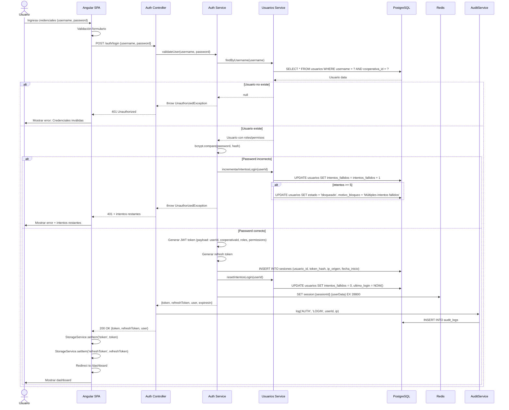
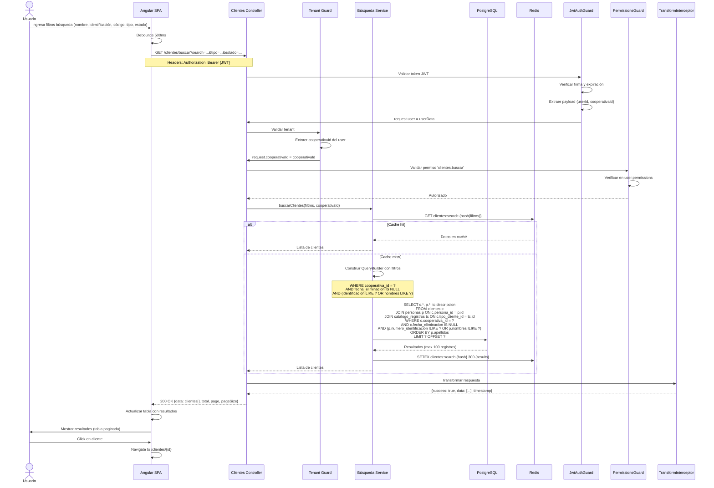
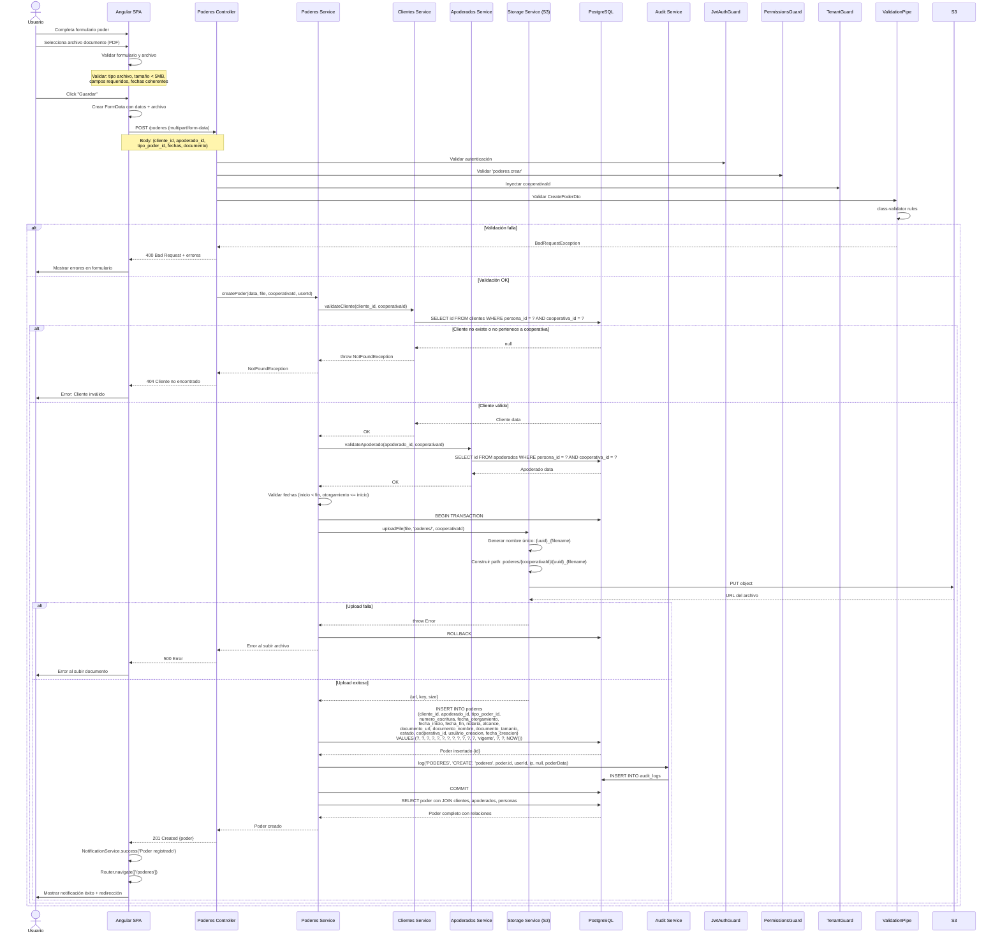
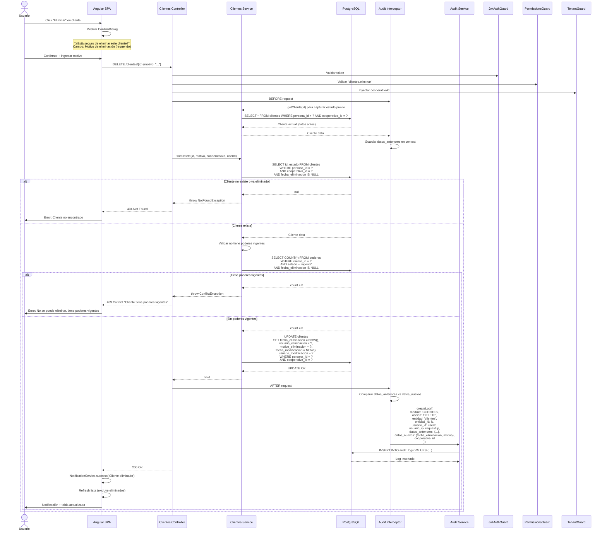
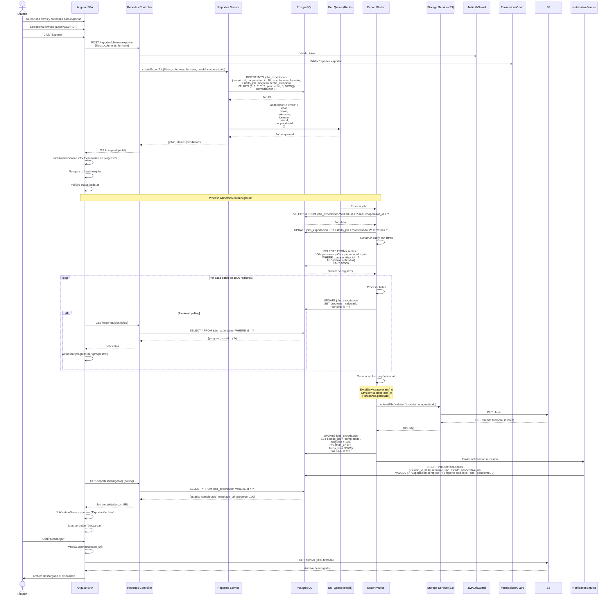
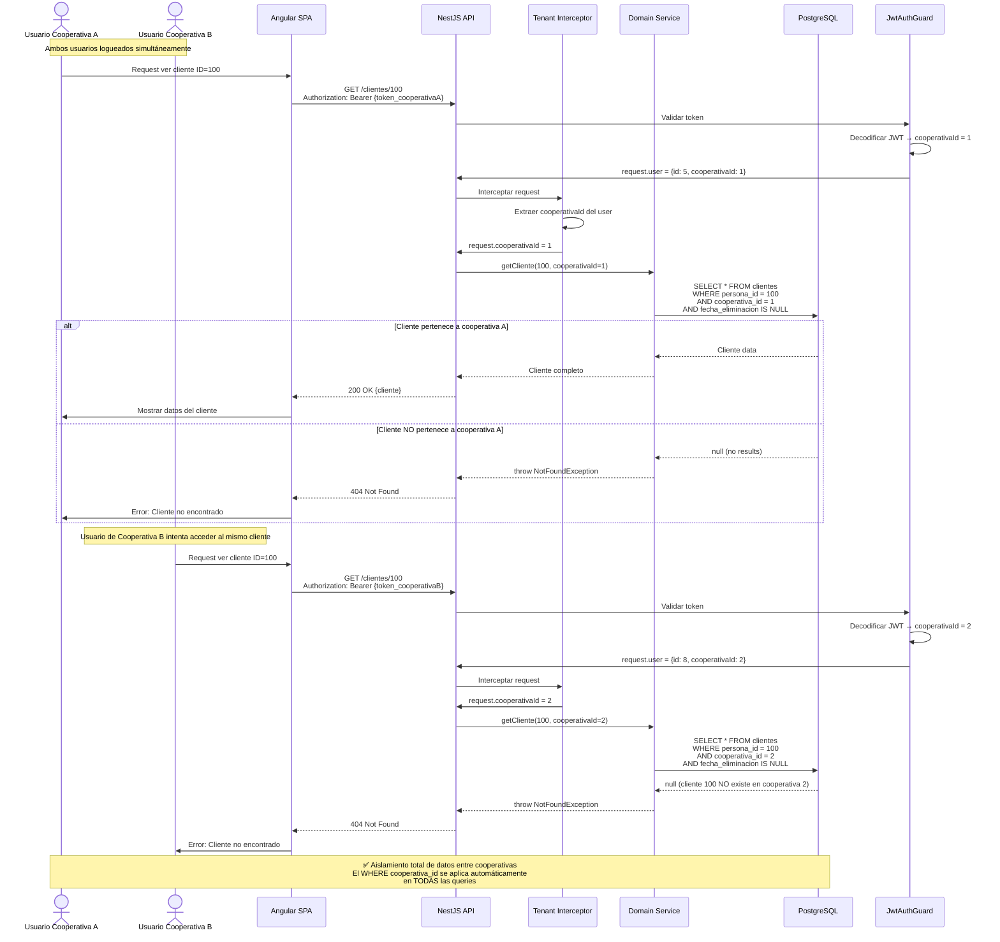
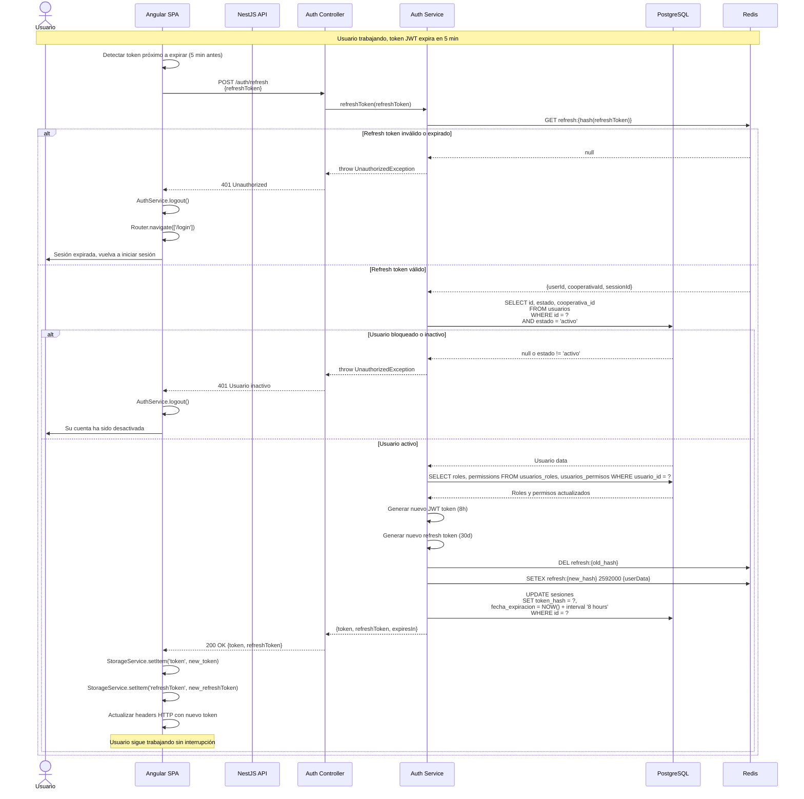

# Diagramas de Secuencia - Flujos Críticos

## 1. Flujo de Autenticación y Login

## 2. Flujo de Búsqueda Avanzada de Clientes (Multi-tenant)

## 3. Flujo de Registro de Poder con Documento

## 4. Flujo de Soft Delete con Auditoría

## 5. Flujo de Exportación Asíncrona (Jobs)

## 6. Flujo de Validación Multi-tenant en Operaciones

## 7. Flujo de Refresh Token

## Notas sobre Flujos

### Seguridad Multi-tenant
- Todas las queries incluyen `WHERE cooperativa_id = ?`
- El `cooperativaId` se extrae del JWT, nunca del request body/query
- TenantInterceptor lo inyecta automáticamente en el contexto
- Imposible acceder a datos de otra cooperativa

### Auditoría Automática
- AuditInterceptor captura todas las operaciones POST/PUT/PATCH/DELETE
- Registra estado antes/después de cada operación
- Include usuario, IP, timestamp, metadata
- Búsqueda y reporting de cambios históricos

### Soft Delete
- No se eliminan registros físicamente
- Se marca con `fecha_eliminacion`, `usuario_eliminacion`, `motivo_eliminacion`
- Queries automáticamente filtran registros eliminados
- Posible recuperación desde panel admin

### Performance
- Cache en Redis para búsquedas frecuentes (TTL 5 min)
- Paginación obligatoria (max 100 registros por página)
- Exports asíncronos para grandes volúmenes
- Índices compuestos en (cooperativa_id, campo_busqueda)

### Manejo de Errores
- Validación en múltiples capas (Frontend, DTOs, Business logic)
- Errores descriptivos con códigos HTTP apropiados
- Rollback de transacciones en caso de error
- Logging de errores para debugging
