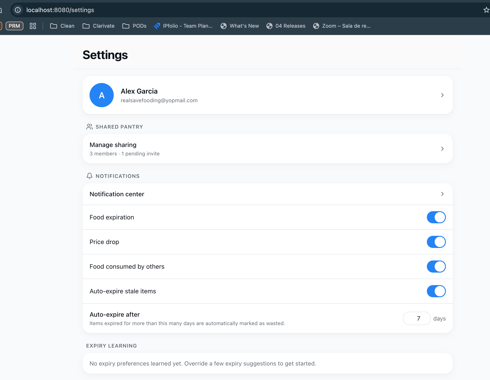

## Prompt 1: Specs from refined ticket
/speckit-specify docs/tickets/extendedMVP/EXT-007-expiry-learning.md

## Prompt 2: Plan
/speckit-plan (with spec.md as context)

## Prompt 3: Tasks
/speckit-tasks (with plan.md as context)

## Prompt 4: Implement
/speckit-implement (with tasks.md as context)

## Prompt 5: Converge
Run /speckit-converge to confirm the implementation satisfies the spec/plan with no drift.
/speckit-converge (It detected errors in tasks.md)
**Findings:**
| ID | Gap Type | Severity | Source | Evidence | Remaining Work |
|----|----------|----------|--------|----------|----------------|
| F1 | contradicts | MEDIUM | US1/AC2 vs FR-004 | `ExpirationService.applyLearning` (service.ts:157–169) applies `averageDelta` as soon as any preference exists (sampleCount=1+), contradicting US1/AC2 which requires baseline-only until ≥3 overrides. FR-004 and data-model.md pseudocode support the current code; US1/AC2 contradicts them. | Resolve the conflict: gate date adjustment on `sampleCount >= 3`, or amend US1/AC2 to align with FR-004 |
| F2 | missing | HIGH | T002 / FR-007–009 | Migration file `20260629224428_add_user_category_expiry_preference/migration.sql` exists but has not been applied — `UserCategoryExpiryPreference` table is absent from the DB, causing runtime errors on all preference endpoints and the enhanced `estimateForItem` | Apply the pending migration once the DB is reachable |

## Prompt 6: Issue found after manual test
When I open the settings page (http://localhost:8080/settings) I see this prisma Error in the console output: 
~~~text
[Nest] 80330  - 07/03/2026, 10:43:36 PM   ERROR [ExceptionsHandler] PrismaClientKnownRequestError: 
Invalid `this.prisma.notificationPreference.upsert()` invocation in
/Users/jesus.ramirez/dev/projects/personal/JRG-AI4Devs-finalproject/back/src/modules/notifications/notification-preferences.service.ts:31:65

  28 async getPreferences(userId: string): Promise<NotificationPreferenceResponse> {
  29   await this.assertUserExists(userId);
  30 
→ 31   const preference = await this.prisma.notificationPreference.upsert(
Unique constraint failed on the fields: (`userId`)
    at Xn.handleRequestError (/Users/jesus.ramirez/dev/projects/personal/JRG-AI4Devs-finalproject/back/node_modules/@prisma/client/runtime/library.js:121:7459)
    at Xn.handleAndLogRequestError (/Users/jesus.ramirez/dev/projects/personal/JRG-AI4Devs-finalproject/back/node_modules/@prisma/client/runtime/library.js:121:6784)
    at Xn.request (/Users/jesus.ramirez/dev/projects/personal/JRG-AI4Devs-finalproject/back/node_modules/@prisma/client/runtime/library.js:121:6491)
    at async l (/Users/jesus.ramirez/dev/projects/personal/JRG-AI4Devs-finalproject/back/node_modules/@prisma/client/runtime/library.js:130:9812)
    at async NotificationPreferencesService.getPreferences (/Users/jesus.ramirez/dev/projects/personal/JRG-AI4Devs-finalproject/back/src/modules/notifications/notification-preferences.service.ts:31:24)
    at async /Users/jesus.ramirez/dev/projects/personal/JRG-AI4Devs-finalproject/back/node_modules/@nestjs/core/router/router-execution-context.js:46:28
    at async /Users/jesus.ramirez/dev/projects/personal/JRG-AI4Devs-finalproject/back/node_modules/@nestjs/core/router/router-proxy.js:9:17 {
  code: 'P2002',
  meta: {
    modelName: 'NotificationPreference',
    target: [
      'userId'
    ]
  },
  clientVersion: '6.11.1'
~~~

Help me to fix it and create the needed test to do not happen again.

## Working example:
