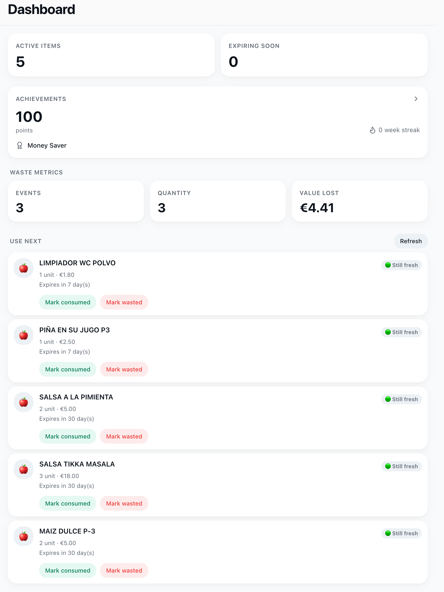
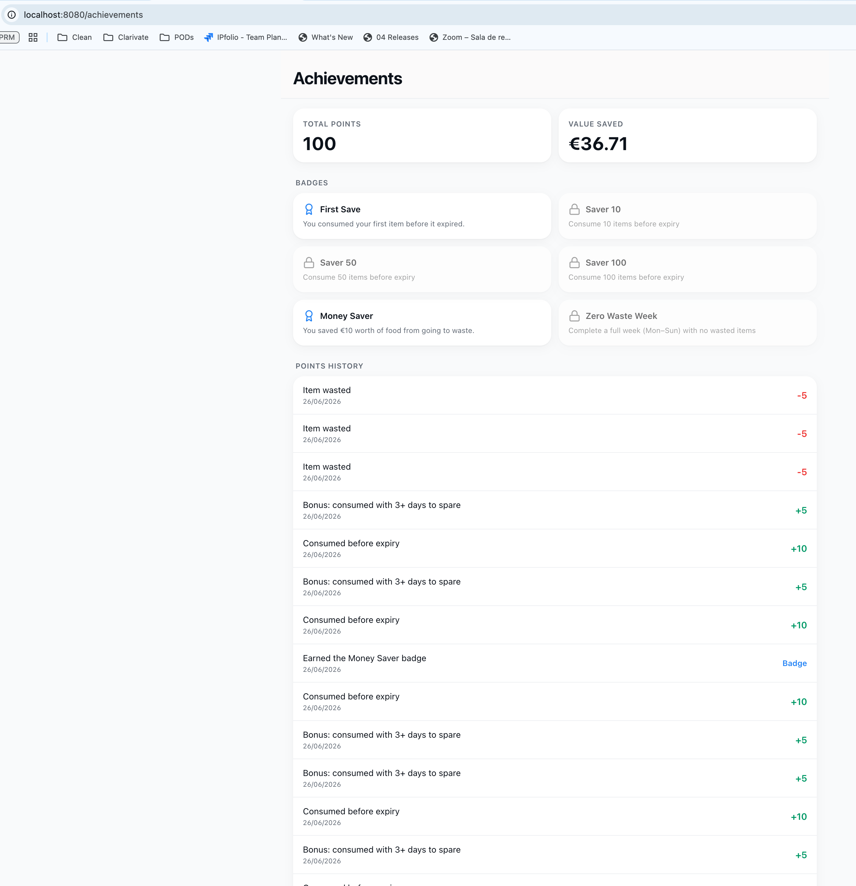

## Prompt 1: Specs from refined ticket
/speckit-specify docs/tickets/extendedMVP/EXT-010-consumption-automation.md

## Prompt 2: Plan
/speckit-plan (with spec.md as context)

## Prompt 3: Tasks
/speckit-tasks (with plan.md as context)

## Prompt 4: Implement
/speckit-implement (with tasks.md as context)

## Prompt 5: Converge
Run /speckit-converge to confirm the implementation satisfies the spec/plan with no drift.
/speckit-converge (It detected errors in tasks.md)

**Note: No further /speckit-implement pass is needed for this feature's specified scope.**

## Working examples:

