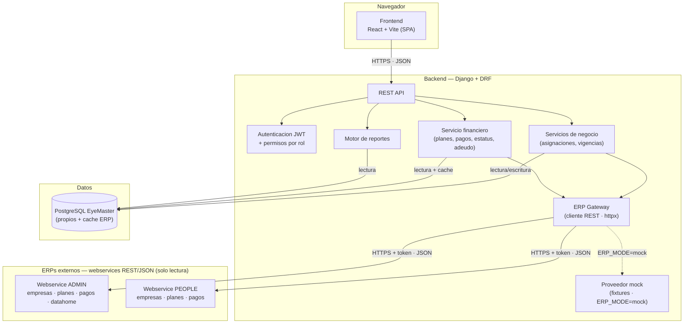
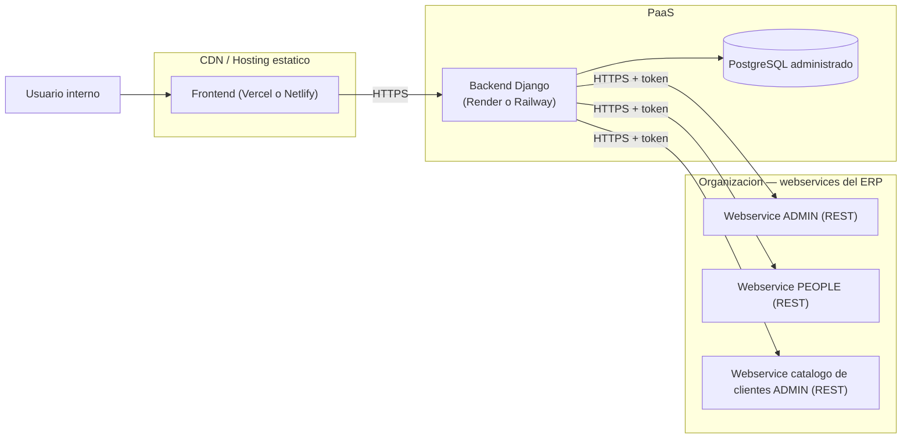
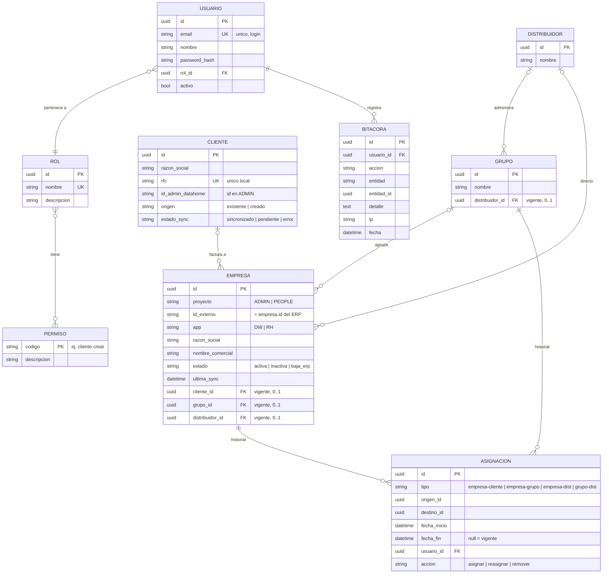
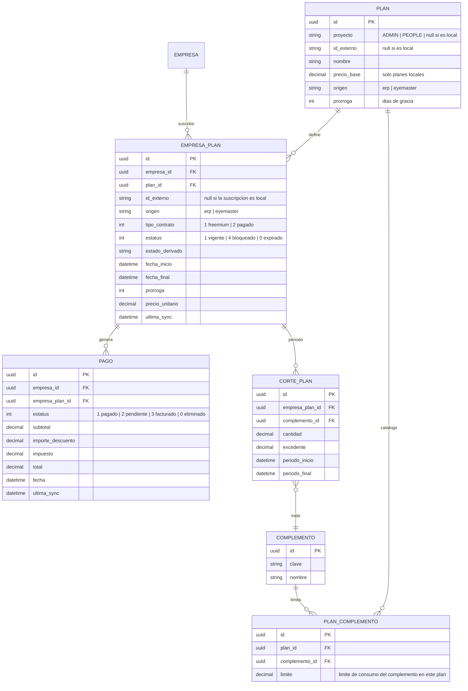

# EyeMaster V2

> **📝 Nota de trazabilidad**: Este documento fue entregado inicialmente como documentación técnica pura (Entrega 1, plantilla oficial del Máster) y desde entonces se implementó una versión funcional completa (backend Django + frontend React), conducida mediante OpenSpec. La versión original de esta Entrega 1 se conserva íntegra en [`readme.md.bkp`](./readme.md.bkp) para trazabilidad.
>
> **📚 Documentación detallada**: Para el análisis funcional ampliado (glosario, 8 módulos, reglas de negocio numeradas, ítems abiertos) ver [`documentacion-funcional.md`](./documentacion-funcional.md). Para instalar y correr el proyecto, [`docs/getting-started.md`](./docs/getting-started.md). Para desplegarlo, [`docs/deployment.md`](./docs/deployment.md). Para el roadmap de implementación y su seguimiento vía OpenSpec, [`docs/plan-implementacion.md`](./docs/plan-implementacion.md).
>
> **🖼️ Evidencia visual**: Capturas de pantalla de la aplicación funcionando en [`capturas/README.md`](./capturas/README.md).

## Índice

0. [Ficha del proyecto](#0-ficha-del-proyecto)
1. [Descripción general del producto](#1-descripción-general-del-producto)
2. [Arquitectura del sistema](#2-arquitectura-del-sistema)
3. [Modelo de datos](#3-modelo-de-datos)
4. [Especificación de la API](#4-especificación-de-la-api)
5. [Historias de usuario](#5-historias-de-usuario)
6. [Tickets de trabajo](#6-tickets-de-trabajo)
7. [Pull requests](#7-pull-requests)

---

## 0. Ficha del proyecto

### **0.1. Tu nombre completo:**
Jairo Alberto Sánchez Suárez

### **0.2. Nombre del proyecto:**
**EyeMaster V2**

### **0.3. Descripción breve del proyecto:**
Sistema administrativo interno que **centraliza** la operación comercial y financiera de empresas registradas en dos ERPs externos (**ADMIN** y **PEOPLE**). EyeMaster no reemplaza a los ERPs: los lee en tiempo real a través de sus **webservices REST** (solo lectura), gestiona localmente relaciones comerciales (cliente facturable, grupo y distribuidor) con trazabilidad histórica, y expone un módulo de reportes que combina ambas fuentes. Además, EyeMaster ahora puede **crear planes propios** (catálogo + complementos con límite de consumo) y asignarlos a las empresas, coexistiendo con los planes sincronizados desde el ERP.

### **0.4. URL del proyecto:**
No hay una URL pública desplegada (herramienta interna, sin infraestructura cloud provisionada aún — ver `docs/deployment.md`). El proyecto corre localmente contra `ERP_MODE=mock`, que simula los webservices del ERP sin requerir red externa. Ver [`docs/getting-started.md`](./docs/getting-started.md) para levantarlo.

### **0.5. URL o archivo comprimido del repositorio**
https://github.com/jairosanchez90/AI4Devs-finalproject.git

---

## 1. Descripción general del producto

### **1.1. Objetivo:**

#### **Propósito del producto**
Ofrecer una única fuente de verdad para la operación comercial y financiera de empresas que hoy viven repartidas en dos ERPs independientes (ADMIN y PEOPLE).

#### **Qué valor aporta**
Responde, en un solo lugar y con trazabilidad histórica, preguntas que hoy requieren conciliación manual:
- *¿Qué empresas maneja este distribuidor?*
- *¿A qué cliente se le factura esta empresa?*
- *¿Cuánto debe el grupo X, el distribuidor Y, la empresa Z?*
- *¿Qué empresas están por vencer? ¿Cuáles están bloqueadas?*
- *¿Cuáles son los ingresos mensuales por proyecto y suite comercial?*

#### **Qué soluciona**
- La operación comercial se gestiona hoy de forma informal, repartida entre dos ERPs sin punto de cruce.
- No existe forma de calcular adeudo agregado por cliente/grupo/distribuidor sin reconciliar manualmente ambos sistemas.
- No hay trazabilidad histórica de qué distribuidor o grupo manejó una empresa en una fecha pasada.

#### **Para quién**
- **Usuarios primarios**: gerencia comercial (vista consolidada), administración (gestión diaria).
- **Usuarios secundarios**: ejecutivos (consultas y reportes).
- No es un producto orientado al usuario final externo.

### **1.2. Características y funcionalidades principales:**

| Bloque | Funcionalidad |
|---|---|
| **Acceso y seguridad** | Autenticación JWT con refresco automático, control de roles y permisos configurable desde el sistema, bitácora de auditoría de acciones sensibles (append-only). |
| **Clientes** | Registro validado contra el catálogo `datahome` de ADMIN (busca por RFC; crea si no existe vía el webservice REST del catálogo de clientes); reintento si el servicio no responde. |
| **Empresas** | Búsqueda en tiempo real y "recuperación" de empresas desde los webservices REST de ADMIN o PEOPLE (solo lectura); EyeMaster nunca las crea. |
| **Estructura comercial** | Asignación de cliente, grupo y distribuidor a cada empresa, con vigencia (`desde/hasta`), validaciones de exclusividad, y herencia de distribuidor desde el grupo. |
| **Planes y suscripciones** | Consulta del catálogo de planes sincronizados del ERP, plan activo por empresa y su estatus operativo (vigente, vencido, bloqueado). **Nuevo**: EyeMaster también **crea planes propios** (nombre, precio base, N complementos con límite de consumo) y los asigna a empresas como suscripción local. |
| **Pagos y adeudo** | Consulta de pagos por empresa y cálculo de adeudo agregable por cliente, grupo o distribuidor. |
| **Reportes** | Motor de reportes flexible (`medida × dimensiones × filtros × fecha_de_corte`) más un catálogo de reportes predefinidos. |
| **Auditoría** | Bitácora consultable, append-only. |

**Lo que NO hace (delimitación explícita).**

- No crea empresas en los ERPs.
- No genera cargos ni facturas basadas en los planes del ERP.
- No escribe en ADMIN ni PEOPLE (única excepción: registro de cliente vía el webservice de catálogo de clientes de ADMIN, hacia `datahome`).
- No procesa pagos en línea.

### **1.3. Diseño y experiencia de usuario:**

Existe una SPA de React funcional, construida sobre la documentación de esta entrega (ver `docs/plan-implementacion.md` para el roadmap de implementación). Identidad visual: marca azul marino, superficies siempre claras (sin modo oscuro), barra lateral fija que se convierte en menú tipo *drawer* en móvil (<900px), y secciones en tarjeta para cada módulo.

Set completo de capturas con descripción: [`capturas/README.md`](./capturas/README.md). Pantallas representativas:

**Login**


**Panel de inicio**


**Detalle de empresa — asignación comercial, planes y pagos**


**Motor de reportes**


**Roles y permisos**


El resto de las pantallas (búsqueda/listado de empresas, clientes, grupos/distribuidores, catálogo de planes, usuarios, bitácora de auditoría) están en [`capturas/README.md`](./capturas/README.md).

**Video demostrativo:** pendiente — no se grabó para esta entrega.

### **1.4. Instrucciones de instalación:**

Guía completa en [`docs/getting-started.md`](./docs/getting-started.md). Versión corta:

```bash
# 1. Variables de entorno
cp .env.example .env

# 2. Backend
cd backend
python3 -m venv .venv
./.venv/bin/pip install -r requirements-dev.txt
./.venv/bin/python manage.py migrate
./.venv/bin/python manage.py runserver

# 3. Frontend (en otra terminal)
cd frontend
npm install
cp .env.example .env
npm run dev
```

Por defecto `ERP_MODE=mock`: todos los datos del ERP (empresas, planes, pagos, catálogo de clientes) vienen de fixtures locales, sin necesidad de red externa.

**Stack utilizado:**

| Componente | Tecnología |
|---|---|
| Backend | Django + Django REST Framework, `djangorestframework-simplejwt`, `httpx` (cliente REST para los webservices del ERP) |
| Frontend | React + Vite (SPA desacoplada) |
| Base de datos | PostgreSQL (propia de EyeMaster) |
| Integraciones | Webservices **REST/JSON** de ADMIN y PEOPLE (empresas, planes, pagos) + webservice de catálogo de clientes de ADMIN. Solo lectura, autenticados por token. **Simulados** por un proveedor mock interno (`ERP_MODE=mock`) hasta que existan los webservices reales. |

---

## 2. Arquitectura del sistema

### **2.1. Diagrama de arquitectura:**



**Patrón.** Arquitectura desacoplada híbrida que combina un **patrón de capa de consolidación (data hub)** con una **SPA + REST API** sin estado. Todo el acceso al ERP se media por un único **ERP Gateway** con dos implementaciones intercambiables — un cliente REST real y un proveedor mock que devuelve fixtures — seleccionadas por la configuración `ERP_MODE`.

**Justificación.** La organización ya tiene dos ERPs en producción que no pueden modificarse en su flujo de facturación. EyeMaster necesita:

1. **Leer y combinar** ambos sin riesgo de corromperlos → llamadas de **webservice de solo lectura** + caché local.
2. **Gestionar localmente** información que ningún ERP almacena (relaciones cliente-grupo-distribuidor con historial).
3. **Servir consultas rápidas** sobre datos agregados → caché financiera con `ultima_sync`.
4. **Habilitar reportes consolidados** → motor flexible sobre un modelo estrella.

**Principales beneficios.**

| Beneficio | Detalle |
|---|---|
| Aislamiento del ERP | EyeMaster no tiene credenciales de base de datos hacia los ERPs; solo consume sus webservices de lectura (más el único endpoint de escritura del catálogo de clientes). Un bug no puede corromper ADMIN ni PEOPLE porque esa superficie simplemente no existe. |
| Evolución independiente | Frontend y backend se despliegan por separado; el equipo puede iterar la UI sin tocar la API. |
| Reportes consolidados | El modelo estrella permite cruzar ambos ERPs con dimensiones uniformes (Proyecto, App, Tiempo, Cliente, Grupo, Distribuidor). |
| Trazabilidad temporal | Las asignaciones con vigencia (`fecha_inicio`/`fecha_fin`) habilitan consultas "a una fecha" sin estructura adicional. |
| Bajo acoplamiento con el ERP | Solo depende de tablas existentes; un cambio de esquema del ERP afecta a EyeMaster en un único punto: el `ERPFinanceService`. |

**Trade-offs y déficits.**

| Trade-off | Detalle |
|---|---|
| Latencia y frescura | La caché local sirve consultas rápidas pero introduce un desfase respecto al ERP (definir el `ultima_sync` aceptable es una decisión pendiente). |
| Doble fuente de verdad temporal | Si la caché falla, la información puede quedar desactualizada; mitigado mostrando siempre `ultima_sync` y permitiendo refresco bajo demanda. |
| Dependencia de disponibilidad del ERP | Pasar de lectura directa a webservices hace que EyeMaster dependa de que el webservice del ERP esté arriba y responda a tiempo; mitigado con caché local, timeouts/reintentos en el gateway, y un **circuit breaker** por ERP que degrada con gracia. |
| Identidad compuesta | Con dos ERPs donde los IDs pueden colisionar, cada referencia a empresa requiere `(proyecto, id_externo)`, no solo el id externo. |
| No es la fuente de verdad financiera del ERP | EyeMaster lee la facturación del ERP pero no la origina; cualquier discrepancia se resuelve a favor del ERP. Los planes creados en EyeMaster (`origen=eyemaster`) sí son responsabilidad propia. |

### **2.2. Descripción de componentes principales:**

| Componente | Tecnología | Responsabilidad |
|---|---|---|
| **Frontend (SPA)** | React + Vite | Interfaz de usuario; consume la REST API con JWT. |
| **REST API** | Django REST Framework | Expone endpoints; orquesta servicios; aplica permisos. |
| **Autenticación y permisos** | `djangorestframework-simplejwt` + auth de Django | Emite JWT, refresca automáticamente al expirar, valida permisos por código (RBAC propio sobre el motor de Django). |
| **Servicio de negocio** | Django (services) | Validaciones de asignación, herencia, vigencias y bitácora. |
| **Servicio financiero (`ERPFinanceService` + catálogo local de planes)** | Django (services) + ERP Gateway | Lee `plan`, `empresa_plan`, `pago`, `corte_plan` de los webservices del ERP y mantiene la caché local; además permite **crear planes propios** y asignarlos a empresas. |
| **Motor de reportes** | Django + SQL | Motor flexible que resuelve `medida × dimensiones × filtros × fecha_de_corte` sobre el modelo estrella, resolviendo nombres legibles en batch (nunca expone IDs crudos). |
| **ERP Gateway** | `httpx` (REST) | Único punto de integración con los ERPs. Dos implementaciones detrás de una interfaz: **real** (HTTPS + token a los webservices de ADMIN/PEOPLE, con circuit breaker) y **mock** (devuelve fixtures JSON), seleccionadas por `ERP_MODE`. También realiza la búsqueda/creación de cliente en `datahome`. |
| **PostgreSQL EyeMaster** | PostgreSQL | Almacena datos propios (usuarios, asignaciones, bitácora) y la caché financiera (`cache_plan`, `cache_pago`...). |
| **ADMIN / PEOPLE (webservices)** | REST/JSON externo | Sistemas fuente expuestos como webservices REST de **solo lectura** (empresas, planes, suscripciones, pagos, cortes). Actualmente simulados por el proveedor mock. |
| **Webservice de catálogo de clientes de ADMIN** | REST/JSON | Único punto donde EyeMaster escribe hacia un sistema externo (búsqueda/registro de cliente en `datahome`). |

### **2.3. Descripción de alto nivel del proyecto y estructura de ficheros**

Implementado, siguiendo la estructura planeada (apps de Django por dominio, servicios transversales fuera de las apps, según el principio de *bounded context* de `documentacion-funcional.md`):

```
AI4Devs-finalproject/
├── backend/
│   ├── apps/
│   │   ├── accounts/        # Usuarios, roles, permisos
│   │   ├── clientes/        # Catalogo de clientes (via webservice ERP)
│   │   ├── empresas/        # Recuperacion y espejos
│   │   ├── comercial/       # Grupos, distribuidores, asignaciones
│   │   ├── financiero/      # Cache financiera, catalogo local de planes, servicios adeudo/estatus
│   │   ├── reportes/        # Motor flexible + catalogo
│   │   └── auditoria/       # Bitacora
│   ├── core/                # Settings, urls, health check
│   ├── services/
│   │   └── erp/             # ERP Gateway: interfaz + implementacion real (REST) + mock
│   │       ├── gateway.py   # Interfaz ERPGateway + fabrica get_erp_gateway()
│   │       ├── rest.py      # Cliente real (httpx) hacia webservices ADMIN/PEOPLE, circuit breaker
│   │       ├── mock.py      # Proveedor mock -> lee fixtures/
│   │       ├── fixtures/    # Respuestas simuladas del ERP (JSON) usadas si ERP_MODE=mock
│   │       └── CONTRACT.md  # Contrato REST provisional que implementan el mock y el cliente real
│   ├── tests/                # Suite pytest, refleja la estructura de apps/
│   └── manage.py
├── frontend/
│   ├── src/
│   │   ├── pages/            # Un archivo por pantalla (login, empresas, clientes, reportes, ...)
│   │   ├── components/       # Button, Select, Table, Badge, AppLayout, PasswordInput
│   │   ├── auth/              # AuthContext, RequireAuth
│   │   ├── services/          # Un wrapper de cliente HTTP por app del backend
│   │   └── App.tsx
│   └── vite.config.ts
├── docs/
│   ├── plan-implementacion.md   # Roadmap de implementacion, seguimiento de changes OpenSpec
│   ├── getting-started.md       # Como correr el proyecto localmente
│   └── deployment.md            # Runbook de despliegue y huecos conocidos
├── openspec/                    # Changes/specs de OpenSpec que condujeron la implementacion
├── capturas/                    # Capturas de pantalla referenciadas desde este documento
├── readme.md                    # Este documento
├── readme.md.bkp                # Version original de la Entrega 1 (plantilla del Master)
├── documentacion-funcional.md   # Analisis funcional ampliado
├── prompts.md                   # Historial de prompts usados con Claude
└── reglas_cobranza.md           # Reglas de facturacion verificadas contra el codigo fuente del ERP
```

Patrón aplicado: **apps de Django por dominio** (no por capa técnica), siguiendo el principio de *bounded context* de DDD ligero. Los servicios transversales (`ERPFinanceService`, `AsignacionService`, `EstatusPlanService`) viven fuera de las apps para evitar acoplamiento circular.

### **2.4. Infraestructura y despliegue**

No hay infraestructura cloud provisionada todavía (sin cuentas de Render/Railway/Vercel para este proyecto). El runbook completo, con el checklist exacto para cuando existan, está en [`docs/deployment.md`](./docs/deployment.md). Infraestructura planeada:



> Mientras no existan los webservices reales del ERP, `ERP_MODE=mock` hace que el backend sirva los datos del ERP desde fixtures locales, así que no se requiere conectividad a `ORG` para correr y demostrar EyeMaster.

**Proceso de despliegue planeado:**

1. **Backend.** Imagen Docker construida en CI desde `backend/Dockerfile`; desplegada en Render o Railway con variables de entorno (`SECRET_KEY`, `DATABASE_URL`, `ERP_MODE`, `ADMIN_API_URL`, `PEOPLE_API_URL`, sus tokens, `CORS_ALLOWED_ORIGINS`). Con `ERP_MODE=mock` no se requieren las URLs/tokens del ERP.
2. **Frontend.** Build estático (`npm run build`) en Vercel o Netlify; `VITE_API_URL` apunta al backend.
3. **Migraciones.** `python manage.py migrate` en cada despliegue del backend.
4. **Caché financiera.** Job programado (Celery beat o equivalente del PaaS) que invoca la sincronización con la periodicidad acordada (pendiente, ver `documentacion-funcional.md` PD-10).
5. **Secretos.** Gestionados como variables de entorno del PaaS; nunca en el repositorio.

### **2.5. Seguridad**

Prácticas implementadas y por qué:

| Práctica | Implementación | Ejemplo |
|---|---|---|
| **Autenticación JWT con refresco automático** | Tokens firmados, vida corta (15 min) + refresh (7 días). El cliente HTTP del frontend refresca en silencio ante un 401 y reintenta una vez. | Login → `POST /api/auth/login` devuelve `access` y `refresh`; el frontend incluye `Authorization: Bearer <jwt>` en cada request. |
| **Control de acceso por rol (RBAC)** | Cada endpoint valida un permiso por código. Los permisos por rol son configurables desde el sistema (pantalla "Roles y permisos"). | El endpoint `POST /api/clientes` requiere el permiso `cliente.crear`; sin él, responde `403`. |
| **Hash de contraseñas** | Mecanismo de Django (PBKDF2 por defecto). | Las contraseñas nunca se almacenan ni se registran en texto plano. |
| **Integración de solo lectura con los ERPs** | EyeMaster solo consume los endpoints de lectura de los ERPs (más el único endpoint de escritura del catálogo de clientes) con un token acotado; no tiene credenciales de base de datos. | Aunque un bug intentara escribir en el ERP, no existe superficie escribible que alcanzar — la única llamada que muta algo es el registro de cliente. |
| **Circuit breaker por ERP** | Tras un número configurable de fallas consecutivas, el gateway corta las llamadas a ese ERP durante un enfriamiento, en vez de repetir el ciclo completo de timeout+reintentos en cada request. | Si ADMIN cae, las siguientes peticiones fallan rápido con `ERPUnavailableError` sin intentar la red, hasta que el enfriamiento expira. |
| **Bitácora append-only** | Tabla `Bitacora` sin `UPDATE` ni `DELETE` permitidos a nivel de aplicación. | Login, registro de cliente, asignaciones y cambios de permisos quedan trazados; solo administradores pueden consultarla. |
| **Validación de RFC y duplicados** | El registro de cliente verifica el RFC localmente antes de invocar el webservice del ERP. | Evita propagar duplicados a `datahome`. |
| **Mensajes de error sin fuga de información** | Credenciales inválidas devuelven un `401` genérico. | No indica si el problema es el usuario o la contraseña. |
| **CORS configurado** | Solo el dominio del frontend autorizado (`django-cors-headers`). | Bloquea peticiones desde otros orígenes. |
| **Secretos fuera del código** | Variables de entorno; nunca en el repositorio. | `DATABASE_URL`, tokens de los webservices del ERP, llaves JWT viven en el PaaS. |
| **Restricción única parcial en BD** | Garantía a nivel de motor de que una asignación vigente es única. | Aunque dos sesiones concurrentes intenten asignar el mismo grupo, PostgreSQL rechaza la segunda. |

### **2.6. Tests**

Implementados para el backend y frontend actuales (`docs/getting-started.md` §4 tiene los comandos exactos):

| Nivel | Herramienta | Foco | Estado |
|---|---|---|---|
| Unitario + integración backend | `pytest` + `pytest-django` | Validaciones, herencia, cálculo de adeudo, apertura/cierre de vigencia, endpoints REST, ciclo de auth, registro búsqueda-o-creación de cliente, motor de reportes | ✅ 142 tests pasando |
| Unitario frontend | Vitest + React Testing Library | Guard de rutas / flujo de autenticación | ✅ pasando |
| Contrato ERP | Tests contra el proveedor mock (`services/erp/fixtures`) | El ERP Gateway parsea las respuestas de ADMIN/PEOPLE de forma consistente entre `mock` y `real` | ✅ pasando |
| E2E | Playwright | Flujos críticos: login, recuperar empresa, asignar grupo, consultar reporte | ⬜ diferido — ver `docs/deployment.md` "Huecos conocidos" (sin binarios de navegador en este entorno de desarrollo) |
| Cobertura de componentes frontend | Vitest + RTL | Selectores, badges de estatus, formularios más allá del guard de auth | ⬜ parcial — solo el guard de autenticación tiene cobertura hoy |

---

## 3. Modelo de datos

### **3.1. Diagrama del modelo de datos:**

#### Datos propios — estructura comercial



#### Caché del ERP — modelo financiero (poblada de solo lectura desde los webservices del ERP; `Plan`/`EmpresaPlan` también aceptan origen `eyemaster`)



### **3.2. Descripción de entidades principales:**

**USUARIO** — usuarios internos del sistema.

| Atributo | Tipo | Restricciones | Descripción |
|---|---|---|---|
| `id` | UUID | PK | Identificador único. |
| `email` | string | UNIQUE, NOT NULL | Se usa como login. |
| `nombre` | string | NOT NULL | Nombre del usuario. |
| `password_hash` | string | NOT NULL | Hash de Django (PBKDF2). |
| `rol_id` | UUID | FK → ROL, NOT NULL | Rol asignado. |
| `activo` | bool | NOT NULL, default true | Si es falso, no puede iniciar sesión. |

**ROL / PERMISO** — modelo RBAC propio. Relación N:M entre `ROL` y `PERMISO`. Permisos identificados por código (`cliente.crear`, `empresa.asignar_grupo`, `financiero.crear_plan`...).

**CLIENTE** — catálogo local de clientes facturables.

| Atributo | Tipo | Restricciones | Descripción |
|---|---|---|---|
| `id` | UUID | PK | |
| `rfc` | string | UNIQUE, NOT NULL | RFC mexicano, único en EyeMaster. |
| `razon_social` | string | NOT NULL | |
| `id_admin_datahome` | string | NULL si pendiente | Identificador en `datahome` (ADMIN). |
| `origen` | enum | `existente \| creado` | Si se vinculó a uno existente o se creó vía el webservice del ERP. |
| `estado_sync` | enum | `sincronizado \| pendiente \| error` | Estado de sincronización con ADMIN. |

**EMPRESA** — espejo local de empresas que viven en los ERPs.

| Atributo | Tipo | Restricciones | Descripción |
|---|---|---|---|
| `id` | UUID | PK | |
| `proyecto` | enum | NOT NULL | `ADMIN` o `PEOPLE`. |
| `id_externo` | string | NOT NULL | `empresa.id` del ERP correspondiente. |
| `app` | enum | | `DW` (Datawork) o `RH` (RH-Cloud). Dimensión de reportes. |
| `razon_social` | string | NOT NULL | Espejo del ERP. |
| `nombre_comercial` | string | | Espejo del ERP. |
| `estado` | enum | NOT NULL | `activa \| inactiva \| baja_erp`. |
| `ultima_sync` | datetime | NOT NULL | Última vez que se refrescó desde el ERP. |
| `cliente_id` | UUID | FK → CLIENTE, NULL | Cliente vigente (0..1). |
| `grupo_id` | UUID | FK → GRUPO, NULL | Grupo vigente (0..1). |
| `distribuidor_id` | UUID | FK → DISTRIBUIDOR, NULL | Distribuidor vigente (0..1). |

**Restricción de identidad:** `UNIQUE (proyecto, id_externo)`. Los IDs del ERP pueden colisionar entre ADMIN y PEOPLE; la combinación los desambigua.

**GRUPO** — agrupa empresas comercialmente. Tiene `distribuidor_id` vigente (0..1).

**DISTRIBUIDOR** — gestor de cuenta comercial. Maneja empresas directamente o vía grupos.

**ASIGNACION** — relación acotada en el tiempo entre dos entidades. Es la entidad central del historial.

| Atributo | Tipo | Restricciones | Descripción |
|---|---|---|---|
| `id` | UUID | PK | |
| `tipo` | enum | NOT NULL | `empresa-cliente \| empresa-grupo \| empresa-dist \| grupo-dist`. |
| `origen_id` | UUID | NOT NULL | Entidad origen (empresa o grupo). |
| `destino_id` | UUID | NOT NULL | Entidad destino. |
| `fecha_inicio` | datetime | NOT NULL | |
| `fecha_fin` | datetime | NULL | `NULL` = vigente. |
| `usuario_id` | UUID | FK → USUARIO, NOT NULL | Quién hizo el cambio. |
| `accion` | enum | NOT NULL | `asignar \| reasignar \| remover`. |

**Restricción crítica:** índice único parcial en `(origen_id, tipo) WHERE fecha_fin IS NULL`. Garantiza, a nivel de motor, que solo existe una asignación vigente por (entidad, tipo). Evita condiciones de carrera entre sesiones concurrentes — **verificado con un test de concurrencia** que fuerza la violación directamente contra la base de datos.

**BITACORA** — registro append-only de acciones sensibles.

**PLAN (catálogo)** — catálogo de planes. Puede venir del ERP (`origen=erp`, con `proyecto`/`id_externo`) o crearse en EyeMaster (`origen=eyemaster`, con `precio_base` propio y `proyecto`/`id_externo` nulos).

**PLAN_COMPLEMENTO** — catálogo de complementos de un plan local, cada uno con su **límite de consumo**. Solo aplica a planes `origen=eyemaster`.

**EMPRESA_PLAN (suscripción)** — suscripción de una empresa a un plan. Puede ser sincronizada del ERP (`origen=erp`, con `id_externo`) o creada directamente en EyeMaster (`origen=eyemaster`, `id_externo` nulo). Una misma empresa puede tener suscripciones de ambos orígenes simultáneamente.

| Atributo | Tipo | Restricciones | Descripción |
|---|---|---|---|
| `origen` | enum | NOT NULL | `erp \| eyemaster`. |
| `estatus` | int | NOT NULL | `1` vigente, `4` bloqueado, `0` expirado. |
| `estado_derivado` | enum | | Calculado: vigente/vencido/bloqueado a partir de estatus + fecha_final + días de gracia. |
| `fecha_final` | datetime | NOT NULL | Fin del periodo. |
| `prorroga` | int | NOT NULL, default 0 | Días de gracia restantes. |
| `tipo_contrato` | int | NOT NULL | `1` freemium / `2` pagado. |
| `ultima_sync` | datetime | NOT NULL | |

**PAGO (caché)** — cargo generado en el ERP, a nivel de empresa.

| Atributo | Tipo | Restricciones | Descripción |
|---|---|---|---|
| `estatus` | int | NOT NULL | `1` pagado, `2` pendiente, `3` facturado, `0` eliminado. |
| `subtotal` | decimal | NOT NULL | Neto, sin IVA. |
| `importe_descuento` | decimal | NOT NULL, default 0 | |
| `impuesto` | decimal | NOT NULL | IVA 16%, calculado sobre el subtotal. |
| `total` | decimal | NOT NULL | `subtotal − descuento + impuesto`. Fuente de verdad del ERP. |
| `ultima_sync` | datetime | NOT NULL | |

> Las cuatro columnas de importe se almacenan **desglosadas**; nunca se calculan al vuelo. El **adeudo de una empresa** = `Σ pago.total WHERE estatus = 2 AND empresa_id = X`, IVA incluido.

---

## 4. Especificación de la API

Tres endpoints representativos documentados en formato **OpenAPI 3.0**. La API completa (≈ 35 endpoints) está detallada en `documentacion-funcional.md` §8.

```yaml
openapi: 3.0.3
info:
  title: EyeMaster V2 API
  version: 0.2.0
  description: API REST interna de EyeMaster. Autenticacion JWT en todos los endpoints (excepto login/refresh).

servers:
  - url: http://localhost:8000/api
    description: Desarrollo local (ERP_MODE=mock)

security:
  - bearerAuth: []

components:
  securitySchemes:
    bearerAuth:
      type: http
      scheme: bearer
      bearerFormat: JWT

paths:

  /clientes/:
    post:
      summary: Registro de cliente (busqueda o creacion en ADMIN)
      description: |
        Busca el RFC en el catalogo `datahome` de ADMIN via su webservice REST.
        - Si existe -> se vincula localmente (`origen=existente`).
        - Si no existe -> se crea en ADMIN y se vincula (`origen=creado`).
        - Si ADMIN no responde -> se guarda localmente con `estado_sync=pendiente`.
      requestBody:
        required: true
        content:
          application/json:
            schema:
              type: object
              required: [rfc, razon_social]
              properties:
                rfc: { type: string, example: "XAXX010101000" }
                razon_social: { type: string, example: "Comercializadora Demo SA de CV" }
      responses:
        "201":
          description: Creado o vinculado exitosamente
          content:
            application/json:
              schema:
                type: object
                properties:
                  id: { type: integer }
                  rfc: { type: string }
                  razon_social: { type: string }
                  id_admin_catalogo_clientes: { type: string }
                  origen: { type: string, enum: [existente, creado] }
                  estado_sync: { type: string, enum: [sincronizado] }
        "202":
          description: ADMIN no respondio; cliente guardado como pendiente
        "409":
          description: RFC ya registrado en EyeMaster

  /empresas/{id}/grupo:
    put:
      summary: Asignar grupo a una empresa
      description: |
        Asigna un grupo vigente a la empresa.
        - Si ya pertenece a otro grupo vigente -> se cierra la vigencia anterior y se abre una nueva.
        - Cada asignacion cierra la vigencia previa y abre una nueva (nunca se borra fisicamente).
      parameters:
        - in: path
          name: id
          required: true
          schema: { type: integer }
      requestBody:
        required: true
        content:
          application/json:
            schema:
              type: object
              required: [grupo_id]
              properties:
                grupo_id: { type: integer }
      responses:
        "200":
          description: Asignacion creada
        "404":
          description: Empresa o grupo no encontrado
        "409":
          description: Conflicto de validacion (ej. empresa dada de baja en el ERP)

  /reportes/consulta:
    post:
      summary: Consulta flexible del motor de reportes
      description: |
        Motor flexible: `medida x dimensiones x filtros x fecha_de_corte`.
        Las consultas "a una fecha" reconstruyen las asignaciones vigentes en ese momento.
        Cada fila incluye tambien "<dimension>_nombre" resuelto (nunca solo el id crudo).
      requestBody:
        required: true
        content:
          application/json:
            schema:
              type: object
              required: [medida, dimensiones]
              properties:
                medida:
                  type: string
                  enum: [adeudo, pagado]
                dimensiones:
                  type: array
                  items:
                    type: string
                    enum: [cliente, grupo, distribuidor, empresa]
                filtros:
                  type: object
                  additionalProperties: true
                a_fecha:
                  type: string
                  format: date
            example:
              medida: adeudo
              dimensiones: [distribuidor, empresa]
              filtros: { proyecto: ADMIN, adeudo_min: 0.01 }
              a_fecha: "2026-06-30"
      responses:
        "200":
          description: Resultado de la consulta
          content:
            application/json:
              example:
                medida: adeudo
                total: "152340.50"
                filas:
                  - distribuidor: 3
                    distribuidor_nombre: "Distribuidor Norte"
                    empresa: 12
                    empresa_nombre: "Empresa A"
                    adeudo: "12500.00"
        "400":
          description: Combinacion invalida de medida x dimension, o filtros malformados
```

---

## 5. Historias de usuario

### Historia de usuario 1 — HU-02 — Registro de cliente con búsqueda o creación en ADMIN

**Como** operador administrativo,
**quiero** registrar un cliente buscando primero en ADMIN por RFC,
**para** evitar duplicados y mantener consistencia entre EyeMaster y el ERP.

**Criterios de aceptación (Gherkin).**

```gherkin
Feature: Registro validado de cliente contra ADMIN

  Scenario: El RFC existe en ADMIN
    Given un RFC valido que ya existe en datahome
    When el operador envia POST /api/clientes/
    Then se vincula al cliente existente
    And la respuesta es 201 con origen="existente" y estado_sync="sincronizado"

  Scenario: El RFC no existe en ADMIN
    Given un RFC valido que NO existe en datahome
    When el operador envia POST /api/clientes/
    Then el cliente se crea en ADMIN via su webservice de catalogo de clientes
    And la respuesta es 201 con origen="creado" y estado_sync="sincronizado"

  Scenario: ADMIN no responde
    Given un RFC valido
    And el webservice de catalogo de clientes de ADMIN esta caido
    When el operador envia POST /api/clientes/
    Then se guarda localmente con estado_sync="pendiente"
    And la respuesta es 202

  Scenario: RFC duplicado localmente
    Given un RFC ya registrado en EyeMaster
    When el operador envia POST /api/clientes/
    Then la respuesta es 409
```

**Prioridad:** Must-have.
**Notas:** todo registro exitoso queda en la bitácora de auditoría (acción sensible).

---

### Historia de usuario 2 — HU-05 — Asignación a grupo y/o distribuidor con validaciones

**Como** operador administrativo,
**quiero** asignar una empresa a un grupo y/o distribuidor con validaciones,
**para** mantener una estructura comercial coherente y trazable.

**Criterios de aceptación (Gherkin).**

```gherkin
Feature: Asignacion con vigencia y herencia

  Scenario: Asignar grupo cuando la empresa esta libre
    Given la empresa NO tiene grupo vigente
    When el operador envia PUT /api/empresas/{id}/grupo con un grupo valido
    Then se crea una asignacion vigente
    And la respuesta es 200

  Scenario: Reasignar a otro grupo
    Given la empresa pertenece a un grupo vigente
    When el operador envia PUT con otro grupo
    Then la asignacion anterior se cierra (fecha_fin=ahora)
    And se crea una nueva (fecha_inicio=ahora, fecha_fin=null)
    And la asignacion anterior nunca se borra fisicamente

  Scenario: Heredar distribuidor del grupo
    Given el grupo tiene un distribuidor vigente
    When la empresa se asigna a ese grupo
    Then la empresa hereda automaticamente el distribuidor del grupo

  Scenario: Conflicto al asignar distribuidor directo
    Given la empresa pertenece a un grupo
    When el operador intenta asignar un distribuidor distinto al del grupo
    Then la respuesta es 409 con mensaje "distribuidor heredado del grupo"
```

**Prioridad:** Must-have.

---

### Historia de usuario 3 — HU-11 — Motor de reportes (consultas flexibles y catálogo)

**Como** ejecutivo,
**quiero** generar reportes flexibles y predefinidos sobre empresas, planes, pagos y adeudo,
**para** responder cualquier pregunta de operación comercial sin reconciliar manualmente entre los dos ERPs.

**Criterios de aceptación.**

- La UI permite elegir **medida**, una o más **dimensiones**, **filtros** opcionales, y una **fecha de corte** (`a_fecha`).
- Las consultas "a una fecha" usan el estado de las **asignaciones** vigentes en ese momento (no el estado actual).
- Los agregados por **cliente, grupo y distribuidor** se calculan a partir de las empresas actualmente vinculadas a ellos.
- Cada fila del resultado incluye el **nombre resuelto** de cada dimensión, nunca solo el ID.
- El catálogo predefinido incluye al menos: *cliente/grupo/distribuidor → empresas y adeudo*, *¿qué empresas me deben?*.
- **Alcance de esta entrega**: medidas `adeudo` y `pagado`; medidas adicionales (`ingreso_neto`, `conteo_planes`, `consumo`, `excedente`) quedan como ítem abierto — ver `docs/plan-implementacion.md`.

**Prioridad:** Must-have.

---

## 6. Tickets de trabajo

### Ticket 1 — Backend — `TK-08-02` `AdeudoService`: cálculo de adeudo por empresa y agregaciones

**Tipo:** Backend
**Historia relacionada:** HU-10, HU-11
**Capa:** Servicios de negocio
**Estimación:** 5 puntos
**Estado:** ✅ Implementado (`backend/apps/financiero/adeudo_service.py`)

**Descripción.**
Construir el servicio que calcula el adeudo de una empresa (consulta directa a la caché de `Pago`) y las agregaciones por cliente, grupo y distribuidor. El servicio debe usar las relaciones **vigentes** entre empresas y sus contrapartes comerciales para sumar correctamente.

**Objetivos / criterios de aceptación.**

- Función `adeudo_por_empresa(empresa_id)` → `Decimal` que retorna `Σ pago.total WHERE estatus = 2 AND empresa_id = X` (con IVA).
- Función `adeudo_por_cliente(cliente_id)` → suma del adeudo de las empresas con `cliente_id` vigente en EyeMaster.
- Funciones análogas `adeudo_por_grupo` y `adeudo_por_distribuidor` (esta última incluye empresas directas + heredadas vía grupo).
- Resultado redondeado a 2 decimales (MXN).
- Variante "a una fecha": acepta un parámetro opcional `a_fecha` y, si se provee, usa las asignaciones vigentes en esa fecha en vez de las actuales.

**Tareas técnicas.**

1. Definir la interfaz pública del servicio en `backend/apps/financiero/adeudo_service.py`.
2. Implementar la consulta de `Pago` con índice en `(empresa_id, estatus)` para performance.
3. Implementar la resolución de empresas por cliente/grupo/distribuidor reutilizando el módulo de asignaciones (`apps/comercial`).
4. Implementar la variante "a una fecha" usando la tabla `Assignment` (filtrando `fecha_inicio ≤ a_fecha AND (fecha_fin IS NULL OR fecha_fin > a_fecha)`).
5. Exponer los endpoints `/api/empresas/{id}/adeudo`, `/api/clientes/{id}/adeudo`, `/api/grupos/{id}/adeudo`, `/api/distribuidores/{id}/adeudo`.
6. Tests unitarios cubriendo: empresa sin pagos → 0; empresa con pagos en distintos estatus; agregación cruzando dos ERPs; agregación "a una fecha" con cambio de distribuidor.

**Dependencias.**
- Modelos de caché (`TK-07-02`) deben existir.
- Módulo de asignaciones (`TK-05-02`) debe estar implementado.

**Notas técnicas.**
- El IVA ya está incluido en `pago.total`; no debe sumarse de nuevo.
- Se usa `Decimal`, **no** `float`, para evitar errores de redondeo.

**Definición de terminado.**
- ✅ Tests pasan en CI (142 tests de backend).
- ✅ Endpoints documentados.
- Performance: consulta de adeudo para un distribuidor con muchas empresas ejecuta con un número acotado de queries (test dedicado `test_adeudo_performance.py`), no O(n) por empresa.

---

### Ticket 2 — Frontend — `TK-09-04` UI del motor de reportes (selector, tablas y exportación)

**Tipo:** Frontend
**Historia relacionada:** HU-11
**Capa:** React (SPA)
**Estimación:** 8 puntos
**Estado:** ✅ Implementado (`frontend/src/pages/ReportsPage.tsx`)

**Descripción.**
Construir la pantalla del motor de reportes, la cara visible del motor flexible (`POST /api/reportes/consulta`). Debe ofrecer dos modos: catálogo predefinido (atajos) y consulta libre.

**Objetivos / criterios de aceptación.**

- Vista única en `/reportes` con tres zonas: **selector de reporte** (catálogo o "personalizado"), **filtros**, **resultados**.
- En modo catálogo, mostrar los atajos disponibles con su etiqueta.
- En modo personalizado, permitir elegir **medida** (combo simple), **dimensiones** (multi-selección), y **fecha de corte**.
- Tabla de resultados con columnas dinámicas según dimensiones y medida, mostrando **nombres resueltos** (no IDs); total al final.
- Estados de carga, error y vacío claramente diferenciados.
- Validación en cliente: combinaciones inválidas de medida × dimensión bloqueadas antes de enviar.

**Tareas técnicas.**

1. Crear `src/pages/ReportsPage.tsx`.
2. Crear `src/services/reportsService.ts` con `consultar(payload)` y `catalogo()`.
3. Estado local con `useState` para construir el payload de la consulta.
4. Render dinámico de columnas basado en las claves de la primera fila del resultado, prefiriendo `<dimension>_nombre` sobre el id crudo.

**Dependencias.**
- Endpoints `/api/reportes/catalogo` y `/api/reportes/consulta` operativos.
- Sistema de diseño / componentes base (botón, select, tabla) definidos.

**Definición de terminado.**
- ✅ Build, lint y tests de frontend pasan.
- ✅ Revisado visualmente contra el sistema de diseño azul marino.
- ⬜ Export pendiente (formato y límite sin definir, ver PD-12 en `documentacion-funcional.md`).

---

### Ticket 3 — Base de datos — `TK-04-01` Modelo `Asignacion` con vigencias y unicidad parcial

**Tipo:** Base de datos
**Historia relacionada:** HU-04, HU-05
**Capa:** Modelo de datos + migración
**Estimación:** 5 puntos
**Estado:** ✅ Implementado (`backend/apps/comercial/models.py`, migración `0001_initial`)

**Descripción.**
Crear la entidad `Asignacion` que centraliza el historial de relaciones (empresa↔cliente, empresa↔grupo, empresa↔distribuidor, grupo↔distribuidor), garantizando a **nivel de motor de base de datos** que solo existe una asignación vigente por `(origen_id, tipo)`.

**Objetivos / criterios de aceptación.**

- Tabla `comercial_assignment` creada con los campos del modelo (§3.2).
- **Índice único parcial**: `CREATE UNIQUE INDEX asignacion_vigente_unica ON comercial_assignment (origen_id, tipo) WHERE fecha_fin IS NULL;` — verificado con `sqlmigrate`.
- Restricción CHECK: `fecha_fin IS NULL OR fecha_fin > fecha_inicio`.
- FK correcta a `usuario` (`usuario_id`); sin FK directa a las entidades origen/destino (polimórfico por `tipo`).
- Índices secundarios en `(origen_id, tipo, fecha_inicio DESC)` y en `(usuario_id)` para consultas de auditoría.
- Test de integración: al intentar insertar una segunda asignación vigente para el mismo `(origen_id, tipo)` directamente contra el modelo (sin pasar por el servicio), la base de datos rechaza con `IntegrityError`.

**Tareas técnicas.**

1. Definir el modelo `Assignment` en `backend/apps/comercial/models.py`.
2. Agregar `class Meta` con `constraints` e `indexes` de Django; usar `UniqueConstraint(condition=Q(fecha_fin__isnull=True))` para el índice parcial.
3. Generar la migración con `makemigrations`.
4. Verificar el SQL generado y que `WHERE "fecha_fin" IS NULL` aparezca en el `CREATE INDEX` (`sqlmigrate`).
5. Tests: inserción normal; cerrar vigencia y abrir la siguiente; intento de doble vigencia → falla; restricción de fechas.

**Dependencias.**
- Modelo de usuario debe estar listo (FK).
- App `comercial` debe existir.

**Notas técnicas.**
- Las entidades origen/destino son polimórficas (a veces empresa, a veces grupo); no se usa FK formal. Trade-off: simplifica el modelo a costa de no tener integridad referencial en BD para `origen_id` y `destino_id`. La integridad la garantiza el servicio (`AsignacionService`).

**Definición de terminado.**
- ✅ Migración aplicada.
- ✅ Test de concurrencia pasa (`test_partial_unique_index.py`, `test_concurrency_error_mapping.py`).

---

## 7. Pull requests

### Pull Request 1 — Documentación inicial del proyecto (Entrega 1)

**Rama:** `docs/entrega-1` → `main`
**Tipo:** Documentación
**Estado:** merged

**Descripción.**
Incorpora toda la documentación técnica de la Entrega 1: ficha del proyecto, descripción funcional, arquitectura con justificación de decisiones (beneficios y trade-offs), modelo de datos (estructura comercial y caché financiera del ERP), especificación OpenAPI de los endpoints principales, historias de usuario en Gherkin, tickets detallados (BE/FE/BD), y el documento de análisis funcional ampliado.

**Archivos incluidos:**

| Archivo | Propósito |
|---|---|
| `readme.md.bkp` | Documento de entrega oficial original, siguiendo la plantilla del Máster (preservado tal cual para trazabilidad). |
| `documentacion-funcional.md` | Análisis funcional ampliado: glosario, 8 módulos detallados, reglas de negocio numeradas, reglas de integridad, ítems abiertos, propuestas de mejora. |
| `reglas_cobranza.md` | Reglas financieras verificadas contra el código fuente del ERP, con cita de archivo y línea. |
| `planes_pagos_diseno.md` | Recorrido del modelo de facturación original del ERP. |
| `prompts.md` | Prompts relevantes usados con el asistente de IA durante la preparación de la documentación y la implementación. |

---

### Pull Request 2 — Implementación completa (backend + frontend) vía OpenSpec

**Tipo:** Feature (Backend + Frontend + Infraestructura)
**Estado:** merged (commit único, ver historial de git)

**Descripción.**
Implementación funcional completa del sistema, conducida mediante 11 changes de OpenSpec (propuesta → diseño → specs → tareas, archivados al completarse): scaffold del proyecto, ERP Gateway (mock + real con circuit breaker), autenticación/RBAC, auditoría, registro de clientes, recuperación de empresas, estructura comercial (con el índice único parcial), caché financiera, estatus/adeudo, motor de reportes, y endurecimiento/documentación de despliegue. Incluye además el rediseño visual completo de la interfaz (identidad azul marino, responsiva) y la extensión del modelo para que EyeMaster pueda crear planes propios.

**Resultado principal:**
- 142 tests de backend pasando, lint limpio (`ruff`).
- Frontend con build/lint/tests limpios (Vitest + React Testing Library).
- 10 capability specs promovidas a `openspec/specs/`.

---

### Futuros Pull Requests

Entregas subsecuentes documentarán, entre otros:

- **PR — Infraestructura.** Aprovisionamiento real de Render/Railway/Vercel y `ERP_MODE=real` contra webservices reales del ERP.
- **PR — Testing E2E.** Suite de Playwright cubriendo los flujos críticos (login → recuperar empresa → asignar grupo → consultar reporte).
- **PR — Reportes ampliados.** Medidas `ingreso_neto`, `conteo_planes`, `consumo`, `excedente` y el resto del catálogo predefinido documentado en `documentacion-funcional.md` §6.7.
