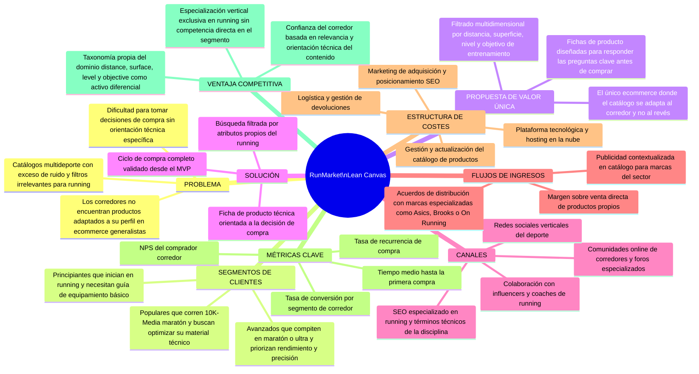
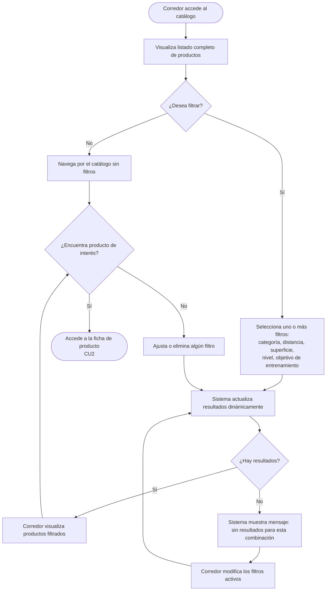
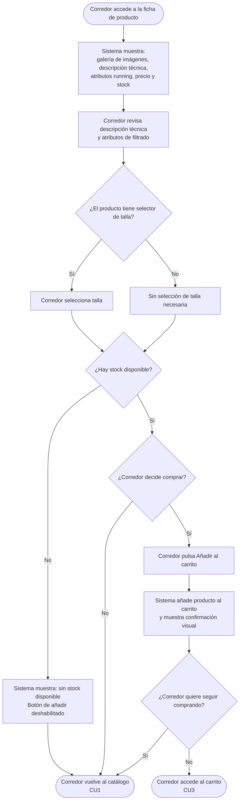
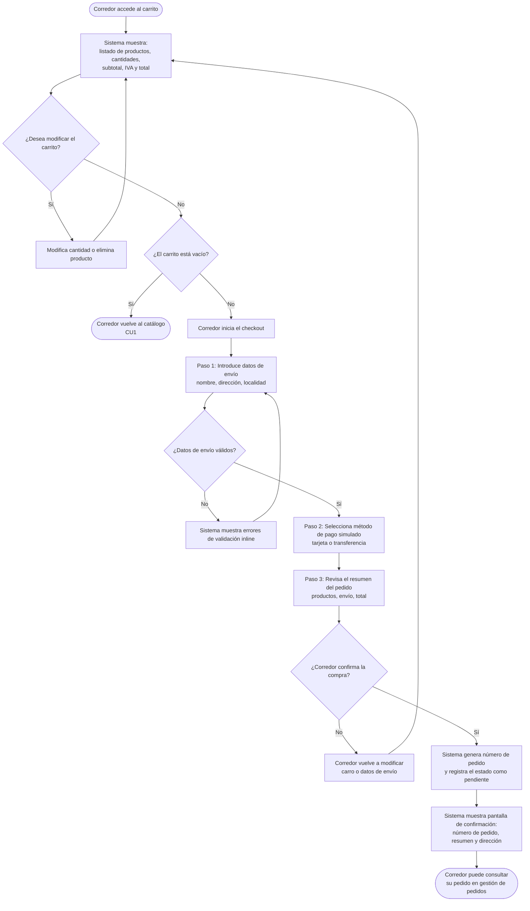

## 1. Descripción general del producto

### **1.1. Objetivo:**

**RunMarket** es una plataforma de comercio electrónico especializada en productos deportivos para running. Su propósito es facilitar a corredores de todos los niveles —principiantes, populares y avanzados— la identificación y compra de zapatillas, ropa técnica y accesorios adecuados a su perfil real de entrenamiento.

El problema que resuelve es de orientación y relevancia: los ecommerce generalistas obligan al usuario a filtrar entre cientos de productos sin criterios específicos del running. RunMarket introduce un modelo de búsqueda filtrada por atributos propios de la disciplina —distancia objetivo, tipo de superficie, nivel del corredor y objetivo de entrenamiento— lo que reduce la fricción de decisión y aumenta la confianza de compra.

#### Valor añadido

| Dimensión | Propuesta de RunMarket |
|---|---|
| **Especialización** | Catálogo exclusivo de running con atributos técnicos relevantes para la disciplina |
| **Filtrado contextual** | Búsqueda por distancia, superficie, nivel y objetivo, no solo por categoría o precio |
| **Orientación a la decisión** | Fichas de producto diseñadas para responder las preguntas clave del corredor antes de comprar |
| **Ciclo de compra completo** | Flujo carrito → checkout → confirmación → gestión de pedido, validado desde el MVP |

#### Ventajas competitivas

1. **Vertical puro de running:** a diferencia de plataformas multideporte, RunMarket elimina el ruido de otras disciplinas y optimiza la experiencia para el corredor.
2. **Filtros propios del dominio:** los atributos `distance`, `surface`, `level` y `objective` no existen en ecommerce generalistas; son el núcleo diferencial del producto.
3. **Experiencia de compra simplificada:** el MVP prioriza la velocidad de decisión sobre la amplitud de funcionalidades, adecuado para un corredor con necesidades claras.
4. **Escalabilidad hacia personalización:** la arquitectura de filtros permite, en versiones posteriores, evolucionar hacia recomendaciones basadas en historial o perfil de usuario sin rediseñar el modelo de datos.

#### Lean Canvas — Modelo de negocio

El siguiente diagrama sintetiza el modelo de negocio de RunMarket según el marco Lean Canvas. Cada bloque está justificado por las decisiones funcionales ya descritas y por los patrones de comportamiento del corredor como consumidor digital.

---

### **1.2. Características y funcionalidades principales:**

El MVP de RunMarket cubre el ciclo completo de descubrimiento y compra de productos de running. A continuación se describen las siete funcionalidades principales.

#### 1. Catálogo de productos deportivos para running

Listado paginado de productos que incluye zapatillas, ropa técnica y accesorios. Cada producto expone su imagen principal, nombre, marca, precio y atributos de filtrado running. El catálogo es el punto de entrada principal de la experiencia de usuario.

#### 2. Búsqueda y filtrado avanzado

Sistema de filtrado múltiple que permite al usuario acotar el catálogo mediante los siguientes criterios:

- **Categoría:** zapatillas, ropa, accesorios
- **Distancia objetivo:** 5K, 10K, media maratón, maratón
- **Superficie:** asfalto, trail, pista
- **Nivel del corredor:** principiante, popular, avanzado
- **Objetivo de entrenamiento:** velocidad, resistencia, recuperación, competición

Los filtros son combinables y los resultados se actualizan de forma dinámica, sin recargas de página.

#### 3. Ficha de producto

Vista detallada orientada a la decisión de compra que incluye:

- Galería de imágenes del producto
- Descripción técnica adaptada al perfil running
- Atributos de filtrado visibles como etiquetas (distancia, superficie, nivel, objetivo)
- Selector de talla (cuando aplica)
- Precio y botón de añadir al carrito
- Indicador de disponibilidad de stock

#### 4. Gestión de carrito

El usuario puede añadir, modificar la cantidad y eliminar productos del carrito. El resumen muestra el desglose de productos, subtotal, IVA estimado y total. El carrito persiste durante la sesión.

#### 5. Checkout simulado

Flujo de compra en tres pasos:

1. **Datos de envío:** nombre, dirección y localidad
2. **Método de pago:** selección simulada (tarjeta, transferencia) sin procesamiento real
3. **Revisión del pedido:** resumen antes de confirmar

El checkout es funcional a nivel de interfaz y flujo de usuario, pero no procesa pagos reales en la versión MVP.

#### 6. Confirmación de pedido

Pantalla de éxito tras completar el checkout que muestra el número de pedido generado, el resumen de productos comprados y la dirección de entrega confirmada. Sirve como cierre del ciclo de compra y punto de entrada a la gestión de pedidos.

#### 7. Gestión básica de pedidos

Vista de historial de pedidos del usuario que permite consultar el estado de cada pedido (pendiente, procesando, enviado, entregado). Valida el ciclo completo de compra y establece la base para funcionalidades de postventa en versiones posteriores.

---

#### Casos de uso principales

---

##### Caso de uso 1 — Búsqueda filtrada de productos para running

**Descripción**

El corredor llega a RunMarket con un perfil de entrenamiento definido —o lo descubre durante la navegación— y necesita acotar el catálogo hasta encontrar los productos relevantes para su situación. Este caso de uso es el punto de entrada más frecuente y el diferencial principal del producto respecto a ecommerce generalistas.

**Actores principales**

- **Corredor (usuario):** persona con perfil de entrenamiento que busca productos adaptados a su nivel, distancia, superficie u objetivo.
- **Sistema RunMarket:** aplica los filtros seleccionados y devuelve los resultados actualizados de forma dinámica.

**Flujo principal**

**Escenarios alternativos y errores**

| Escenario | Comportamiento del sistema |
|---|---|
| Combinación de filtros sin resultados | Se muestra un mensaje explícito indicando que no hay productos para esa combinación; se sugiere eliminar algún filtro |
| Filtros incompatibles entre sí | El sistema no bloquea la selección; simplemente devuelve un catálogo vacío con mensaje orientativo |
| Pérdida de sesión con filtros activos | Los filtros no persisten entre sesiones en el MVP; el usuario debe volver a seleccionarlos |

---

##### Caso de uso 2 — Consulta de ficha de producto y decisión de compra

**Descripción**

El corredor accede a la ficha de un producto concreto para evaluar si se ajusta a sus necesidades antes de decidir añadirlo al carrito. La ficha es el espacio de mayor densidad de información técnica del sistema y el principal punto de conversión.

**Actores principales**

- **Corredor (usuario):** evalúa el producto en detalle para tomar una decisión de compra fundamentada.
- **Sistema RunMarket:** presenta los atributos técnicos, imágenes, disponibilidad y opciones de talla.

**Flujo principal**

**Escenarios alternativos y errores**

| Escenario | Comportamiento del sistema |
|---|---|
| Producto sin stock | El botón de añadir al carrito aparece deshabilitado con texto explicativo; no se bloquea la visualización de la ficha |
| Corredor no selecciona talla cuando es obligatorio | El sistema muestra un aviso inline antes de permitir añadir al carrito |
| Producto ya en el carrito | El sistema incrementa la cantidad existente en lugar de duplicar la entrada |
| Error al añadir al carrito | Se muestra un mensaje de error no bloqueante; el corredor puede reintentar |

---

##### Caso de uso 3 — Proceso de compra: carrito y checkout simulado

**Descripción**

El corredor ha seleccionado uno o más productos y procede al proceso de compra. Este caso de uso cubre desde la revisión del carrito hasta la confirmación del pedido, validando el ciclo completo de compra del MVP. El checkout es simulado: recoge los datos de envío y método de pago sin procesar transacciones reales.

**Actores principales**

- **Corredor (usuario):** revisa su selección, introduce datos de envío y confirma la compra.
- **Sistema RunMarket:** valida los datos del formulario, genera el pedido y emite la confirmación.

**Flujo principal**

**Escenarios alternativos y errores**

| Escenario | Comportamiento del sistema |
|---|---|
| Carrito vacío al iniciar checkout | El botón de checkout está deshabilitado; el sistema redirige al catálogo |
| Datos de envío incompletos o inválidos | Validación inline con mensajes descriptivos por campo; no se avanza al paso siguiente hasta resolverlos |
| El corredor abandona el checkout a mitad | El carrito persiste durante la sesión; el corredor puede retomar desde el carrito |
| Error en la generación del pedido | Se muestra mensaje de error con opción de reintentar; el carrito no se vacía |
| Confirmación exitosa | El carrito se vacía automáticamente tras la confirmación; el pedido queda registrado en el historial |

---

### **1.3. Diseño y experiencia de usuario:**

El prototipo interactivo completo está disponible en Figma Make:
[Ecommerce para productos deportivos](https://www.figma.com/make/0wtedXb5138odnAOgHlMiA/Ecommerce-para-productos-deportivos)

A continuación se describe cada pantalla principal, su funcionalidad y su relación con los casos de uso del producto.

---

#### Pantalla 1 — Home: catálogo con filtros

Pantalla de entrada al ecommerce. Muestra el catálogo completo de productos de running con un panel lateral de filtros por categoría, distancia, superficie, nivel y objetivo de entrenamiento. Los resultados se actualizan en tiempo real al aplicar filtros combinados.

**Funcionalidad:** Catálogo de productos · Búsqueda y filtrado avanzado (Caso de uso 1)

---

#### Pantalla 2 — Ficha de producto

Vista detallada de un producto. Incluye galería de imágenes, descripción técnica, atributos running mostrados como etiquetas de color (nivel, distancia, superficie), selector de talla y color, stepper de cantidad y botón de añadir al carrito. Incorpora iconos de confianza: envío gratis, devolución y garantía.

**Funcionalidad:** Ficha de producto (Caso de uso 2)

---

#### Pantalla 3 — Carrito

Resumen de los productos seleccionados antes de iniciar el pago. Permite modificar cantidades y eliminar artículos. El panel lateral muestra subtotal, gastos de envío (gratuito a partir de 50€) y total, con acceso directo al checkout.

**Funcionalidad:** Gestión de carrito (Caso de uso 3)

---

#### Pantalla 4 — Checkout: datos de envío

Primer paso del proceso de compra. Formulario con nombre, email, teléfono, dirección, ciudad, código postal y país. Validación de campos obligatorios antes de avanzar al paso de pago. Indicador de progreso visible en la parte superior.

**Funcionalidad:** Checkout simulado — paso 1 (Caso de uso 3)

---

#### Pantalla 5 — Checkout: método de pago

Segundo paso del checkout. Formulario de tarjeta simulada con número, titular, fecha de vencimiento y CVV. El resumen del pedido permanece visible en el lateral. El proceso no realiza transacciones reales.

**Funcionalidad:** Checkout simulado — paso 2 (Caso de uso 3)

---

#### Pantalla 6 — Confirmación de pedido

Pantalla de éxito tras completar la compra. Muestra el número de pedido generado y confirma el email de notificación. Ofrece dos acciones: ver el historial de pedidos o continuar comprando.

**Funcionalidad:** Confirmación de pedido (Caso de uso 3)

---

#### Pantalla 7 — Gestión de pedidos

Historial de pedidos del usuario. Cada pedido muestra ID, estado (en proceso, enviado, entregado, cancelado), fecha, total y detalle de productos con enlace a la ficha para facilitar la recompra.

**Funcionalidad:** Gestión básica de pedidos
