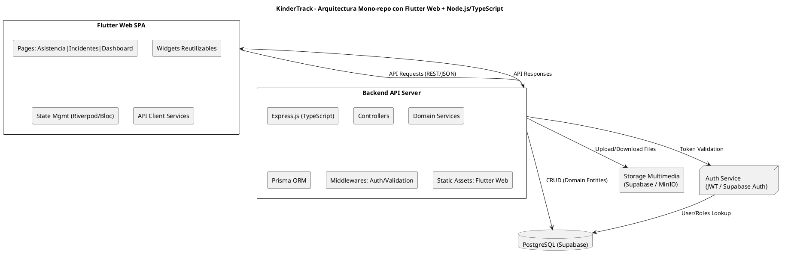
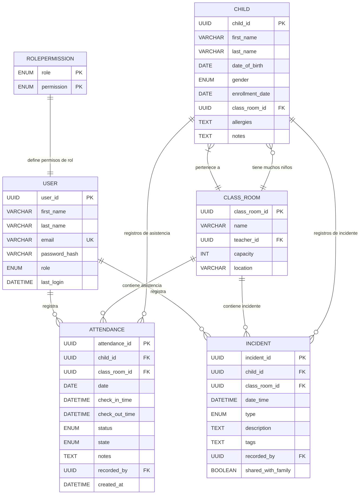

## Índice

0. [Ficha del proyecto](#0-ficha-del-proyecto)
1. [Descripción general del producto](#1-descripción-general-del-producto)
2. [Arquitectura del sistema](#2-arquitectura-del-sistema)
3. [Modelo de datos](#3-modelo-de-datos)
4. [Especificación de la API](#4-especificación-de-la-api)
5. [Historias de usuario](#5-historias-de-usuario)
6. [Tickets de trabajo](#6-tickets-de-trabajo)
7. [Pull requests](#7-pull-requests)

---

## 0. Ficha del proyecto

### **0.1. Tu nombre completo:**

Juan Ernesto Kujarchi

### **0.2. Nombre del proyecto:**

KinderTrack

### **0.3. Descripción breve del proyecto:**

KinderTrack es una plataforma de software para instituciones de educación inicial (0–5 años) que permite registrar y dar seguimiento a la asistencia diaria y los incidentes relevantes de los niños.
El sistema transforma los registros administrativos en información significativa para docentes, directivos y familias, construyendo una historia diaria y evolutiva del desarrollo de cada niño.
Desarrollado con Flutter Web, Node.js/TypeScript y PostgreSQL, siguiendo arquitectura DDD y metodología TDD, con infraestructura de costo cero.

### **0.4. URL del proyecto:**

> Puede ser pública o privada, en cuyo caso deberás compartir los accesos de manera segura. Puedes enviarlos a [alvaro@lidr.co](mailto:alvaro@lidr.co) usando algún servicio como [onetimesecret](https://onetimesecret.com/).

### 0.5. URL o archivo comprimido del repositorio

[AI4Devs-finalproject - KinderTrack](https://github.com/juankuja/AI4Devs-finalproject)

---

## 1. Descripción general del producto

> Describe en detalle los siguientes aspectos del producto:

### **1.1. Objetivo:**

**KinderTrack** es una plataforma de software diseñada para instituciones de educación inicial (0–5 años) que permite registrar y dar seguimiento a la asistencia diaria y a los incidentes relevantes de los niños.

El producto transforma los registros administrativos en **información significativa para docentes, directivos y familias**, construyendo una **historia diaria y evolutiva del desarrollo de cada niño**.
- Convierte la asistencia y los incidentes en una historia diaria clara y confiable, alineada con la educación infantil y el cuidado de los niños.
- Proporciona información relevante para el día pedagógico mediante asistencias contextualizadas.
- Permite un seguimiento integral del desarrollo evolutivo de cada niño.

**Para quién:**
- Instituciones de educación inicial (0–5 años)
- Docentes que necesitan registrar información sin interrumpir la rutina del aula
- Directivos que requieren visibilidad y control sobre la operación diaria
- Familias que desean recibir información clara sobre el día de sus hijos

### **1.2. Características y funcionalidades principales:**

#### **Registro de Asistencias**
- **Check-in y check-out rápido**: registro de entrada y salida de cada niño en menos de 15 segundos
- **Estado al llegar**: captura del estado del niño (tranquilo, cansado, inquieto, medicación, alimentación, etc.)
- **Responsabilidad**: cada registro se asocia con el educador responsable
- **Visualización en tiempo real**: vista de niños presentes/ausentes por aula
- **Ausencias justificadas**: registro de ausencias con motivo

#### **Registro de Incidentes**
- **Registro de hechos relevantes**: captura de eventos del día, tanto positivos como negativos
- **Categorías predefinidas**: positivo, negativo, pedagógico, salud, comportamiento, logro
- **Etiquetado pedagógico**: clasificación por áreas de desarrollo (motricidad, socialización, lenguaje, autonomía)
- **Control de visibilidad**: cada incidente puede ser interno (solo docentes y directivos) o compartido con familias
- **Resumen diario**: generación automática de resumen del día por niño para compartir con familias

#### **Ventajas Competitivas**
- **Asistencias contextualizadas**: información relevante para el día pedagógico, no solo administrativo
- **Incidentes positivos y pedagógicos**: no solo problemas, sino también logros y hechos relevantes
- **Seguridad operacional**: roles claros, trazabilidad completa, historial inmutable
- **Costo de infraestructura 0**: diseño offline-first con datos locales
- **Simplicidad**: UX minimalista y mobile-friendly para no interrumpir la rutina del aula
- **Escalabilidad**: diseño modular preparado para sincronización cloud y multi-sede

### **1.3. Diseño y experiencia de usuario:**

**Nota:** Las imágenes y videotutoriales se agregarán en una fase posterior del desarrollo.

**Descripción de la experiencia de usuario:**

La aplicación está diseñada con una interfaz **minimalista y mobile-friendly** que permite a los docentes realizar registros rápidos sin interrumpir la rutina del aula.

**Flujo principal:**

1. **Acceso y autenticación**: El usuario inicia sesión con sus credenciales, y el sistema le asigna automáticamente los permisos según su rol (docente, directivo o administrativo)

2. **Panel principal**: Vista en tiempo real del aula mostrando:
   - Lista de niños presentes y ausentes
   - Accesos rápidos a funcionalidades principales
   - Resumen del día actual

3. **Registro de asistencia (< 15 segundos por niño)**:
   - Selección rápida del niño
   - Check-in/check-out con un toque
   - Captura opcional del estado (tranquilo, cansado, inquieto, medicación, etc.)
   - Confirmación visual inmediata

4. **Registro de incidentes**:
   - Selección del niño involucrado
   - Elección de categoría (positivo, negativo, pedagógico, salud, comportamiento, logro)
   - Descripción breve del hecho
   - Etiquetado por área de desarrollo (motricidad, socialización, lenguaje, autonomía)
   - Definición de visibilidad (interno o compartido con familias)

5. **Visualización y consultas**:
   - Historial de asistencias por niño y por aula
   - Historial de incidentes con filtros por categoría y fecha
   - Resumen diario generado automáticamente para cada niño

6. **Exportación de datos**:
   - Exportación de registros en formato CSV
   - Generación de reportes para directivos

La experiencia está optimizada para que los docentes puedan registrar información de manera **rápida, simple y sin fricción**, manteniendo el foco en el cuidado y la educación de los niños.

### **1.4. Instrucciones de instalación:**
> Documenta de manera precisa las instrucciones para instalar y poner en marcha el proyecto en local (librerías, backend, frontend, servidor, base de datos, migraciones y semillas de datos, etc.)

---

## 2. Arquitectura del Sistema

### **2.1. Diagrama de arquitectura:**



**Patrón arquitectónico:** **DDD + MVC + servicios**, modular y desacoplado.

KinderTrack está diseñado como **un sistema modular, basado en DDD (Domain-Driven Design)**, con **mono-repo** que contiene frontend y backend:

- **Frontend**: Flutter Web SPA para docentes, familias y administradores
- **Backend**: Node.js + TypeScript + Express, organizado por dominios
- **Base de datos**: PostgreSQL (Supabase Free Tier)
- **Almacenamiento multimedia**: Supabase Storage o MinIO local
- **Autenticación**: JWT o Supabase Auth, con roles diferenciados

**Justificación de la arquitectura:**

Se eligió esta arquitectura para cumplir con los objetivos de desarrollo **simple, seguro y escalable**, con modularidad que facilita el **mantenimiento y futuras funcionalidades**, e infraestructura de **costo 0** usando servicios gratuitos.

**Beneficios principales:**
- **DDD + TDD**: robustez y modularidad desde el diseño
- **Mono-repo**: simple de mantener y desplegar
- **TypeScript + Prisma**: seguridad de tipos y ORM eficiente
- **Flutter Web**: UI moderna y reusable para futuras apps móviles
- **Infraestructura gratuita**: Supabase + hosting gratuito

**Sacrificios:**
- Bundle inicial de Flutter Web grande → requiere optimización
- Hot reload simultáneo frontend + backend requiere abrir dos procesos en desarrollo


### **2.2. Descripción de componentes principales:**

#### **Frontend: Flutter Web**
- **Tecnología**: Flutter Web 3.x
- **Navegación**: Páginas principales para Asistencia, Incidentes y Dashboard
- **Gestión de estado**: Riverpod o Bloc
- **UI**: Basada en widgets reutilizables con Material Design
- **Comunicación**: API Client Services para conectar con el backend mediante REST/JSON

#### **Backend: Node.js + TypeScript + Express**
- **Tecnología**: Node.js 20.x + TypeScript 5.x + Express.js
- **Organización**: Estructura por dominios (DDD):
  - `Users`: Gestión de usuarios y roles
  - `Children`: Gestión de niños
  - `Attendance`: Registro de asistencias
  - `Incidents`: Registro de incidentes
- **Lógica de negocio**: Domain Services con repositorios usando Prisma ORM
- **Controllers**: Exponen endpoints REST
- **Middlewares**: Validación y seguridad (autenticación, autorización)
- **Servicio estático**: Sirve el frontend Flutter Web compilado

#### **Base de datos: PostgreSQL**
- **Tecnología**: PostgreSQL 15+ (Supabase Free Tier)
- **ORM**: Prisma para gestión de esquema y queries
- **Acceso**: A través de repositorios por dominio

#### **Almacenamiento multimedia**
- **Tecnología**: Supabase Storage o MinIO local
- **Uso**: Almacenamiento de fotos y documentos adjuntos a incidentes

#### **Autenticación y autorización**
- **Tecnología**: JWT o Supabase Auth
- **Roles**: Docente, Directivo, Administrativo, Familia
- **Implementación**: Middleware de validación de tokens y permisos por endpoint

### **2.3. Descripción de alto nivel del proyecto y estructura de ficheros**

Estructura **mono-repo basada en DDD (Domain-Driven Design)**:

```
kindertrack/
│
├─ frontend/                 # Flutter Web
│   ├─ lib/
│   │   ├─ pages/            # Páginas principales: Asistencia, Incidentes, Dashboard
│   │   ├─ widgets/          # Componentes reutilizables
│   │   ├─ services/         # Cliente API
│   │   └─ state/            # Gestión de estado (Riverpod/Bloc)
│   └─ test/                 # Tests unitarios e integración frontend
│
├─ backend/                  # Node.js + TypeScript + Express + Prisma
│   ├─ src/
│   │   ├─ domains/          # DDD: Users, Children, Attendance, Incidents
│   │   │   ├─ entities/     
│   │   │   ├─ repositories/ 
│   │   │   ├─ services/     
│   │   │   └─ dtos/         
│   │   ├─ infrastructure/   
│   │   │   ├─ prisma/       # Configuración y cliente Prisma
│   │   │   └─ persistence/  # Repositorios concretos
│   │   ├─ interfaces/       
│   │   │   ├─ controllers/  # Express Controllers
│   │   │   └─ routes/       # Rutas API
│   │   ├─ middlewares/      # Seguridad y validación
│   │   ├─ utils/            # Helpers
│   │   └─ config/           # DB, Auth, variables de entorno
│   └─ tests/                # Tests unitarios e integración backend
│
├─ infra/                    # Scripts de despliegue, Docker
├─ docker-compose.yml        # Levantar backend + frontend
└─ docs/                     # PRD, diagramas, documentación
```

**Propósito de las carpetas principales:**

- **frontend/**: Contiene toda la aplicación Flutter Web con páginas, widgets reutilizables, servicios de API y gestión de estado
- **backend/src/domains/**: Núcleo de la lógica de negocio organizada por dominios (Users, Children, Attendance, Incidents) siguiendo DDD
- **backend/src/infrastructure/**: Capa de infraestructura con Prisma y persistencia de datos
- **backend/src/interfaces/**: Capa de presentación con controllers y rutas REST
- **backend/src/middlewares/**: Funcionalidades transversales como autenticación y validación
- **infra/**: Scripts e infraestructura como código para despliegue
- **docs/**: Documentación del producto, arquitectura y especificaciones

**Patrón arquitectónico:** El proyecto obedece al patrón **DDD (Domain-Driven Design) + MVC + servicios**, que proporciona modularidad, desacoplamiento y facilita el mantenimiento y escalabilidad.

### **2.4. Infraestructura y despliegue**

#### **Componentes de infraestructura:**

- **Frontend Flutter Web**:
  - Build: `flutter build web` → genera carpeta `build/web`
  - Servido desde backend Express: `app.use(express.static('frontend/build/web'))`
  - Hosting gratuito alternativo: Vercel, Netlify o Supabase Hosting

- **Backend Node.js + TypeScript**:
  - Desarrollo: `ts-node-dev src/index.ts`
  - Producción: VPS gratuito o Render Free Tier

- **Base de datos PostgreSQL**: Supabase Free Tier o Docker local

- **Almacenamiento multimedia**: Supabase Storage o MinIO local

#### **Flujo de despliegue unificado:**

```
Flutter Web build --> frontend/build/web
Backend Node.js sirve frontend + API
Backend <--> PostgreSQL (Supabase)
Backend <--> Storage Multimedia
```

#### **Proceso de despliegue:**

1. **Compilación del frontend**: Ejecutar `flutter build web` para generar los archivos estáticos optimizados
2. **Integración**: Copiar los archivos compilados a la carpeta pública del backend
3. **Configuración**: Establecer variables de entorno para conexión a base de datos, autenticación y storage
4. **Despliegue del backend**: Subir el código del backend a servicio de hosting (Render, VPS, etc.)
5. **Base de datos**: Configurar PostgreSQL en Supabase o instancia Docker
6. **Migraciones**: Ejecutar migraciones de Prisma para inicializar el esquema
7. **Verificación**: Probar endpoints de API y acceso al frontend

La arquitectura está diseñada para mantener **infraestructura de costo 0** utilizando servicios gratuitos.

### **2.5. Seguridad**

#### **Prácticas de seguridad implementadas:**

1. **Autenticación robusta**:
   - Sistema de autenticación basado en **JWT o Supabase Auth**
   - Tokens con expiración controlada
   - Roles diferenciados: Docente, Directivo, Administrativo, Familia

2. **Autorización por roles**:
   - Middleware que valida permisos por endpoint según el rol del usuario
   - Control de acceso granular a funcionalidades sensibles
   - Verificación de permisos antes de cada operación crítica

3. **Cifrado de contraseñas**:
   - Uso de **bcrypt o Argon2** para hash de contraseñas
   - Salt único por usuario
   - Nunca se almacenan contraseñas en texto plano

4. **Sanitización de inputs**:
   - Protección contra **XSS (Cross-Site Scripting)**
   - Protección contra **SQL Injection** mediante Prisma ORM con queries parametrizadas
   - Validación estricta de todos los datos de entrada

5. **Comunicación segura**:
   - **HTTPS obligatorio** en producción
   - Cifrado de datos en tránsito

6. **Auditoría y trazabilidad** *(Post-MVP)*:
   - Logging de todas las operaciones de asistencia e incidentes
   - Registro de usuario, timestamp, aula y dispositivo en cada acción
   - Historial inmutable de registros

7. **Respaldo de datos** *(Post-MVP)*:
   - Backups periódicos de base de datos
   - Backups de almacenamiento multimedia
   - Estrategia de recuperación ante desastres

### **2.6. Tests**

#### Enfoque: TDD (Test-Driven Development)

El proyecto sigue la metodología **TDD**, donde los tests se escriben antes de la implementación. Esto garantiza robustez y facilita el mantenimiento del código.

**Tipos de tests implementados:**

#### **Backend (Node.js + TypeScript)**
- **Tests unitarios por dominio**: Validación de entidades, servicios y repositorios
  - Entities: Validación de reglas de negocio y comportamiento de objetos de dominio
  - Services: Pruebas de lógica de negocio aislada
  - Repositories: Verificación de operaciones de persistencia
- **Tests de integración**: Validación de flujos completos incluyendo base de datos
- **Herramientas**: Jest + ts-jest

#### **Frontend (Flutter Web)**
- **Tests unitarios de widgets**: Validación de componentes individuales
- **Tests de integración de páginas**: Verificación de flujos completos de usuario
- **Tests de gestión de estado**: Validación de Riverpod/Bloc
- **Herramientas**: Flutter test

#### **End-to-End (E2E)**
- **Tests de flujos críticos**: Registro de asistencia, registro de incidentes, autenticación
- **Herramientas**: Cypress

**Cobertura mínima recomendada**: 90% en servicios críticos

**Flujo de desarrollo TDD**:
1. Escribir test unitario para funcionalidad de dominio
2. Implementar lógica mínima para pasar el test
3. Refactorizar y validar integraciones
4. Iterar por dominio (Users, Attendance, Incidents, Children)

---

## 3. Modelo de Datos

### **3.1. Diagrama del modelo de datos:**




### **3.2. Descripción de entidades principales:**

#### **Niño (`Child`)**

**Descripción:** Representa a cada niño inscrito en la institución de primera infancia.

**Atributos:**

| Atributo | Tipo | Descripción | Clave | Restricciones |
|-----------|------|------------|-------|---------------|
| `child_id` | UUID | Identificador único | PK | NOT NULL, UNIQUE |
| `first_name` | VARCHAR | Nombre del niño |  | NOT NULL |
| `last_name` | VARCHAR | Apellido del niño |  | NOT NULL |
| `date_of_birth` | DATE | Fecha de nacimiento |  | NOT NULL |
| `gender` | ENUM(`MALE`,`FEMALE`,`OTHER`) | Género del niño |  | NULLABLE |
| `enrollment_date` | DATE | Fecha de ingreso a la institución |  | NOT NULL |
| `class_room_id` | UUID | Aula/grupo asignado | FK → `ClassRoom.class_room_id` | NOT NULL |
| `allergies` | TEXT | Información sobre alergias |  | NULLABLE |
| `notes` | TEXT | Información adicional |  | NULLABLE |

**Relaciones:**
- Cada niño **pertenece a un aula** (`ClassRoom`) → Cardinalidad: N:1
- Cada niño puede tener **muchos registros de asistencia** → Cardinalidad: 1:N
- Cada niño puede tener **muchos incidentes** → Cardinalidad: 1:N

---

#### **Aula / Grupo (`ClassRoom`)**

**Descripción:** Representa un aula o grupo dentro de la institución.

**Atributos:**

| Atributo | Tipo | Descripción | Clave | Restricciones |
|-----------|------|------------|-------|---------------|
| `class_room_id` | UUID | Identificador único | PK | NOT NULL, UNIQUE |
| `name` | VARCHAR | Nombre del aula o grupo |  | NOT NULL |
| `teacher_id` | UUID | Docente principal responsable | FK → `User.user_id` | NULLABLE |
| `capacity` | INT | Capacidad máxima de niños |  | NOT NULL |
| `location` | VARCHAR | Ubicación física |  | NULLABLE |

**Relaciones:**
- Un aula tiene **muchos niños** → Cardinalidad: 1:N
- Un aula tiene **uno o varios docentes asignados** → Cardinalidad: 1:N
- Contiene registros de asistencia e incidentes → Cardinalidad: 1:N

---

#### **Usuario / Docente (`User`)**

**Descripción:** Representa a los usuarios del sistema, incluyendo docentes y directivos.

**Atributos:**

| Atributo | Tipo | Descripción | Clave | Restricciones |
|-----------|------|------------|-------|---------------|
| `user_id` | UUID | Identificador único | PK | NOT NULL, UNIQUE |
| `first_name` | VARCHAR | Nombre del usuario |  | NOT NULL |
| `last_name` | VARCHAR | Apellido del usuario |  | NOT NULL |
| `email` | VARCHAR | Correo electrónico |  | NOT NULL, UNIQUE |
| `password_hash` | VARCHAR | Contraseña cifrada |  | NOT NULL |
| `role` | ENUM(`TEACHER`,`DIRECTOR`,`ADMIN`) | Rol de usuario |  | NOT NULL |
| `assigned_classes` | ARRAY(UUID) | Clases asignadas (solo docentes) |  | NULLABLE |
| `last_login` | DATETIME | Último inicio de sesión |  | NULLABLE |

**Relaciones:**
- Un usuario puede **registrar muchos registros de asistencia** → Cardinalidad: 1:N
- Un usuario puede **registrar muchos incidentes** → Cardinalidad: 1:N
- Un usuario puede tener **uno o varios roles definidos en RolePermission** → Cardinalidad: N:1

---

#### **Registro de Asistencia (`Attendance`)**

**Descripción:** Representa la presencia diaria de cada niño.

**Atributos:**

| Atributo | Tipo | Descripción | Clave | Restricciones |
|-----------|------|------------|-------|---------------|
| `attendance_id` | UUID | Identificador único | PK | NOT NULL, UNIQUE |
| `child_id` | UUID | Niño asociado | FK → `Child.child_id` | NOT NULL |
| `class_room_id` | UUID | Aula asociada | FK → `ClassRoom.class_room_id` | NOT NULL |
| `date` | DATE | Fecha del registro |  | NOT NULL |
| `check_in_time` | DATETIME | Hora de llegada |  | NULLABLE |
| `check_out_time` | DATETIME | Hora de salida |  | NULLABLE |
| `status` | ENUM(`PRESENT`,`ABSENT`,`LATE`) | Estado del niño |  | NOT NULL |
| `state` | ENUM(`CALM`,`TIRED`,`HYPERACTIVE`,`OTHER`) | Estado del niño |  | NULLABLE |
| `notes` | TEXT | Observaciones adicionales |  | NULLABLE |
| `recorded_by` | UUID | Usuario que registró | FK → `User.user_id` | NOT NULL |
| `created_at` | DATETIME | Fecha y hora de creación del registro |  | NOT NULL |

**Relaciones:**
- Cada registro pertenece a **un niño** → Cardinalidad: N:1
- Cada registro pertenece a **un aula** → Cardinalidad: N:1
- Cada registro es **creado por un usuario** → Cardinalidad: N:1

---

#### **Registro de Incidente (`Incident`)**

**Descripción:** Representa hechos relevantes, positivos o negativos de cada niño.

**Atributos:**

| Atributo | Tipo | Descripción | Clave | Restricciones |
|-----------|------|------------|-------|---------------|
| `incident_id` | UUID | Identificador único | PK | NOT NULL, UNIQUE |
| `child_id` | UUID | Niño asociado | FK → `Child.child_id` | NOT NULL |
| `class_room_id` | UUID | Aula asociada | FK → `ClassRoom.class_room_id` | NOT NULL |
| `date_time` | DATETIME | Fecha y hora del incidente |  | NOT NULL |
| `type` | ENUM(`ACHIEVEMENT`,`BEHAVIOR`,`SPECIAL_EVENT`,`HEALTH`) | Tipo de incidente |  | NOT NULL |
| `description` | TEXT | Descripción breve |  | NOT NULL |
| `tags` | TEXT | Etiquetas pedagógicas |  | NULLABLE |
| `recorded_by` | UUID | Usuario que registró | FK → `User.user_id` | NOT NULL |
| `shared_with_family` | BOOLEAN | Indica si se comparte con familia |  | DEFAULT FALSE |

**Relaciones:**
- Cada incidente pertenece a **un niño** → Cardinalidad: N:1
- Cada incidente pertenece a **un aula** → Cardinalidad: N:1
- Cada incidente es **registrado por un usuario** → Cardinalidad: N:1

---

#### **Roles y Permisos (`RolePermission`)**

**Descripción:** Define permisos asociados a cada rol para controlar acceso a funcionalidades.

**Atributos:**

| Atributo | Tipo | Descripción | Clave | Restricciones |
|-----------|------|------------|-------|---------------|
| `role` | ENUM(`TEACHER`,`DIRECTOR`,`ADMIN`) | Rol de usuario | PK | NOT NULL |
| `permission` | ENUM(`CREATE_ATTENDANCE`,`CREATE_INCIDENT`,`VIEW_REPORTS`,`MANAGE_USERS`) | Permiso asociado | PK | NOT NULL |

**Relaciones:**
- Relaciona roles con **acciones permitidas** en el sistema → Cardinalidad: 1:N

---

## 4. Especificación de la API

```yaml
openapi: 3.0.3
info:
  title: KinderTrack API
  version: 1.0.0
  description: API para el registro de asistencias e incidentes en instituciones de primera infancia.
servers:
  - url: https://api.kindertrack.example.com
    description: Servidor principal

paths:
  /attendance:
    post:
      summary: Registrar la asistencia de un niño
      description: Crea un registro de asistencia para un niño en una clase y fecha específica.
      tags:
        - Attendance
      requestBody:
        required: true
        content:
          application/json:
            schema:
              type: object
              required:
                - childId
                - classRoomId
                - date
                - status
              properties:
                childId:
                  type: string
                  format: uuid
                  description: ID del niño
                classRoomId:
                  type: string
                  format: uuid
                  description: ID del aula
                date:
                  type: string
                  format: date
                  description: Fecha de asistencia
                status:
                  type: string
                  enum: [present, absent, late]
                  description: Estado de la asistencia
            example:
              childId: "c1a2b3d4-e5f6-7g8h-9i0j-k1l2m3n4o5p6"
              classRoomId: "a123b456-c789-0d12-e345-f67890123456"
              date: "2026-01-20"
              status: "present"
      responses:
        '201':
          description: Asistencia registrada correctamente
          content:
            application/json:
              schema:
                type: object
                properties:
                  id:
                    type: string
                    format: uuid
                  childId:
                    type: string
                  classRoomId:
                    type: string
                  date:
                    type: string
                    format: date
                  status:
                    type: string
              example:
                id: "att-98765432-1234-5678-9012-abcdefabcdef"
                childId: "c1a2b3d4-e5f6-7g8h-9i0j-k1l2m3n4o5p6"
                classRoomId: "a123b456-c789-0d12-e345-f67890123456"
                date: "2026-01-20"
                status: "present"

  /incidents:
    post:
      summary: Registrar un incidente de un niño
      description: Crea un registro de incidente, que puede ser positivo o negativo.
      tags:
        - Incidents
      requestBody:
        required: true
        content:
          application/json:
            schema:
              type: object
              required:
                - childId
                - classRoomId
                - description
                - type
                - date
              properties:
                childId:
                  type: string
                  format: uuid
                  description: ID del niño
                classRoomId:
                  type: string
                  format: uuid
                  description: ID del aula
                description:
                  type: string
                  description: Descripción del incidente
                type:
                  type: string
                  enum: [positive, negative, neutral]
                  description: Tipo de incidente
                date:
                  type: string
                  format: date
                  description: Fecha del incidente
            example:
              childId: "c1a2b3d4-e5f6-7g8h-9i0j-k1l2m3n4o5p6"
              classRoomId: "a123b456-c789-0d12-e345-f67890123456"
              description: "El niño ayudó a otro compañero durante la actividad"
              type: "positive"
              date: "2026-01-20"
      responses:
        '201':
          description: Incidente registrado correctamente
          content:
            application/json:
              schema:
                type: object
                properties:
                  id:
                    type: string
                    format: uuid
                  childId:
                    type: string
                  classRoomId:
                    type: string
                  description:
                    type: string
                  type:
                    type: string
                  date:
                    type: string
                    format: date
              example:
                id: "inc-abcdef12-3456-7890-abcd-ef1234567890"
                childId: "c1a2b3d4-e5f6-7g8h-9i0j-k1l2m3n4o5p6"
                classRoomId: "a123b456-c789-0d12-e345-f67890123456"
                description: "El niño ayudó a otro compañero durante la actividad"
                type: "positive"
                date: "2026-01-20"

  /children:
    get:
      summary: Obtener la lista de niños por aula
      description: Devuelve los niños asignados a un aula específica.
      tags:
        - Children
      parameters:
        - in: query
          name: classRoomId
          required: true
          schema:
            type: string
            format: uuid
          description: ID del aula
      responses:
        '200':
          description: Lista de niños
          content:
            application/json:
              schema:
                type: array
                items:
                  type: object
                  properties:
                    id:
                      type: string
                      format: uuid
                    firstName:
                      type: string
                    lastName:
                      type: string
                    dateOfBirth:
                      type: string
                      format: date
              example:
                - id: "c1a2b3d4-e5f6-7g8h-9i0j-k1l2m3n4o5p6"
                  firstName: "Juan"
                  lastName: "Pérez"
                  dateOfBirth: "2021-05-15"
                - id: "d2b3c4e5-f6g7-8h9i-0j1k-l2m3n4o5p6q7"
                  firstName: "María"
                  lastName: "González"
                  dateOfBirth: "2020-09-22"
```

---

## 5. Historias de Usuario

### **Historia de Usuario 1: US-001 - Autenticación de usuarios**

**Como** docente o directivo,  
**quiero** iniciar sesión en la aplicación de forma segura,  
**para** acceder a las funcionalidades según mi rol asignado.

#### Descripción

El sistema debe permitir a los usuarios autenticarse mediante credenciales únicas, manteniendo la sesión activa durante la jornada laboral sin necesidad de autenticarse repetidamente.

#### Criterios de aceptación

- **Dado que** soy un usuario registrado con credenciales válidas,  
  **cuando** ingreso mi usuario y contraseña,  
  **entonces** el sistema me autentica y me redirige a la pantalla principal.

- **Dado que** ingreso credenciales incorrectas,  
  **cuando** intento iniciar sesión,  
  **entonces** el sistema muestra un mensaje de error sin revelar qué dato es incorrecto.

- **Dado que** he iniciado sesión exitosamente,  
  **cuando** uso la aplicación durante mi jornada laboral,  
  **entonces** la sesión permanece activa sin solicitar nueva autenticación.

#### Notas adicionales

- Implementar almacenamiento seguro de tokens de sesión
- Considerar bloqueo temporal tras múltiples intentos fallidos
- La sesión debe expirar automáticamente al finalizar el día laboral
- Implementar en modo offline-first (SQLite local)
- Implementar en modo offline-first:
  - **Web:** Usar SQLite vía WASM (paquetes: `drift`, `sqlite3_wasm`, `drift_web`, `sqlite3_flutter_libs`) para persistencia SQL, requiere incluir y inicializar WASM en el build web. Alternativa: usar almacén web nativo como IndexedDB (`idb_shim`), Hive (`hive_flutter`), o Isar (`isar`) para mayor compatibilidad y menor complejidad, aunque sin SQL. Pros: SQLite ofrece queries avanzadas y portabilidad; IndexedDB/Hive/Isar son más simples y nativos en web. Setup: agregar el paquete elegido, inicializar en main y configurar persistencia según plataforma.

#### Historias relacionadas

- **Requerida por**: US-002, US-003, US-006, US-009
- **Relacionada con**: US-014 (Cifrado de datos)

---

### **Historia de Usuario 2: US-003 - Registro rápido de check-in**

**Como** docente,  
**quiero** registrar la llegada de un niño en menos de 15 segundos,  
**para** no interrumpir la rutina de recepción matutina y capturar información relevante del día.

#### Descripción

El docente debe poder registrar el check-in de manera ágil, capturando el estado del niño al llegar para proporcionar contexto pedagógico al día.

#### Criterios de aceptación

- **Dado que** estoy en la pantalla de asistencia de mi aula,  
  **cuando** selecciono un niño y registro su llegada,  
  **entonces** el sistema captura automáticamente la hora actual y solicita el estado del niño (tranquilo, cansado, inquieto, medicación, desayunó/no desayunó).

- **Dado que** completo el registro de check-in,  
  **cuando** confirmo la información,  
  **entonces** el proceso se completa en menos de 15 segundos y el niño aparece como "presente" en la lista.

- **Dado que** registro un check-in,  
  **cuando** guardo la información,  
  **entonces** queda asociado automáticamente mi usuario como educador responsable.

#### Notas adicionales

- Interfaz debe ser mobile-friendly y optimizada para tablets
- El timestamp debe ser inmutable una vez registrado
- Permitir agregar notas opcionales breves (máximo 100 caracteres)
- Priorizar velocidad y simplicidad sobre cantidad de datos

#### Historias relacionadas

- **Depende de**: US-001, US-002
- **Requerida por**: US-004, US-005, US-008
- **Relacionada con**: US-010 (Resumen diario)

---

### **Historia de Usuario 3: US-009 - Registro rápido de incidentes**

**Como** docente,  
**quiero** registrar hechos relevantes del día (positivos, negativos o pedagógicos),  
**para** documentar el desarrollo y eventos importantes de cada niño.

#### Descripción

El sistema debe permitir documentar incidentes de manera rápida y estructurada, diferenciando entre tipos (positivo, negativo, pedagógico, salud, comportamiento, logro) y permitiendo etiquetado por áreas de desarrollo.

#### Criterios de aceptación

- **Dado que** estoy en el aula y observo un hecho relevante,  
  **cuando** accedo al registro de incidentes,  
  **entonces** puedo seleccionar el niño, tipo de incidente y agregar descripción en menos de 30 segundos.

- **Dado que** registro un incidente,  
  **cuando** completo el formulario,  
  **entonces** puedo agregar etiquetas de áreas de desarrollo (motricidad, socialización, lenguaje, autonomía) opcionalmente.

- **Dado que** registro un incidente,  
  **cuando** guardo la información,  
  **entonces** puedo decidir si es visible solo para docentes/directivos o si se comparte con la familia.

#### Notas adicionales

- Descripción máxima: 500 caracteres
- Tipos de incidente: positivo, negativo, pedagógico, salud, comportamiento, logro
- Áreas de desarrollo: motricidad fina, motricidad gruesa, socialización, lenguaje, autonomía, creatividad
- Default: shared_with_family = false (privado)

#### Historias relacionadas

- **Depende de**: US-001, US-002
- **Requerida por**: US-010, US-011, US-012
- **Relacionada con**: US-010 (Control de visibilidad)

---

## 6. Tickets de Trabajo

### **Ticket 1 (Base de Datos): TICKET-001-DB - Diseño e implementación del modelo de datos de usuarios**

**Tipo:** Database  
**Prioridad:** Crítica  
**Estimación:** 5 puntos  
**Sprint:** 1

#### Descripción

Crear el esquema de base de datos para usuarios, sesiones y control de intentos fallidos en PostgreSQL usando Prisma.

#### Tareas técnicas

- [ ] Definir schema de Prisma para entidad `User`
  - Campos: id, email, password_hash, role, first_name, last_name, is_active, failed_attempts, locked_until, created_at, updated_at
- [ ] Definir schema para `Session`
  - Campos: id, user_id, token_hash, expires_at, device_id, created_at
- [ ] Crear índices:
  - `UNIQUE(email)` en User
  - `INDEX(user_id)` en Session
  - `INDEX(expires_at)` en Session
- [ ] Generar y aplicar migration de Prisma
- [ ] Poblar datos de prueba (usuarios de prueba con roles)
- [ ] Documentar esquema y relaciones

#### Criterios de aceptación

- Schema de Prisma compila sin errores
- Migrations se aplican correctamente en PostgreSQL
- Índices creados y funcionando
- Constraints de unicidad funcionando
- Datos de prueba cargados (mínimo 3 usuarios con diferentes roles)

#### Dependencias

- Ninguna

#### Notas técnicas

- Usar bcrypt rounds: 12 para password_hash
- expires_at en Session debe ser timestamp con zona horaria
- failed_attempts debe reiniciarse a 0 tras login exitoso
- locked_until debe ser nullable

---

### **Ticket 2 (Backend): TICKET-003-BE-01 - Implementación de entidades de dominio de asistencias**

**Tipo:** Backend - Domain Layer  
**Prioridad:** Crítica  
**Estimación:** 8 puntos  
**Sprint:** 2

#### Descripción

Crear entidades de dominio para Attendance con validaciones de negocio y enums.

#### Tareas técnicas

- [ ] Crear entity `Attendance` en `domains/attendance/entities/`
  - Propiedades completas según schema
  - Métodos: `create()`, `checkOut()`, `validate()`
- [ ] Crear enums:
  - `AttendanceStatus`: PRESENT, ABSENT, LATE
  - `ChildState`: CALM, TIRED, HYPERACTIVE, MEDICATED, FED, NOT_FED
- [ ] Value Objects si necesario (notas con validación de longitud)
- [ ] Validaciones de dominio:
  - No duplicado mismo día
  - check_out_time > check_in_time
  - notes máximo 100 caracteres
- [ ] Domain Events:
  - `ChildCheckedIn`
  - `ChildCheckedOut`
- [ ] Tests unitarios >85% coverage

#### Criterios de aceptación

- Entidades cumplen DDD
- Validaciones funcionan correctamente
- Domain events emitidos apropiadamente
- Tests pasan con alta cobertura
- TSLint sin warnings

#### Dependencias

- TICKET-003-DB

#### Notas técnicas

- check_in_time y check_out_time deben ser timestamps inmutables
- Implementar patrón Factory para creación de Attendance
- Value Objects deben lanzar excepciones descriptivas en validación fallida

---

### **Ticket 3 (Frontend): TICKET-003-FE-01 - Implementación de pantalla de registro de check-in**

**Tipo:** Frontend  
**Prioridad:** Crítica  
**Estimación:** 8 puntos  
**Sprint:** 2

#### Descripción

Desarrollar la pantalla de check-in optimizada para tablets con selección rápida de niños y estados.

#### Tareas técnicas

- [ ] Crear widget `CheckInScreen` en `lib/pages/attendance/`
- [ ] Implementar lista de niños del aula con búsqueda rápida
- [ ] Crear selector de estado del niño (tranquilo, cansado, inquieto, medicación, desayunó/no desayunó)
- [ ] Implementar captura automática de timestamp
- [ ] Crear campo opcional de notas (máximo 100 caracteres)
- [ ] Implementar indicador visual de confirmación (<2 segundos)
- [ ] Conectar con servicio de API usando Dio
- [ ] Implementar gestión de estado con Riverpod/Bloc
- [ ] Añadir validaciones de formulario
- [ ] Optimizar para completar en <15 segundos
- [ ] Tests de widgets unitarios

#### Criterios de aceptación

- Interfaz responsive para tablets
- Proceso completo en <15 segundos
- Estados visuales claros (cargando, éxito, error)
- Búsqueda de niños funcional
- Validaciones de formulario funcionando
- UI sigue Material Design 3
- Tests unitarios pasan

#### Dependencias

- TICKET-003-BE-03 (API endpoint)
- TICKET-003-FE-STATE (State management)

#### Notas técnicas

- Usar TextFormField con validación para notas
- Implementar debounce en búsqueda (300ms)
- Mostrar feedback visual inmediato al guardar
- Manejar modo offline (guardar local y sincronizar después)

---

## 7. Pull Requests

> Documenta 3 de las Pull Requests realizadas durante la ejecución del proyecto

**Pull Request 1**

**Pull Request 2**

**Pull Request 3**

