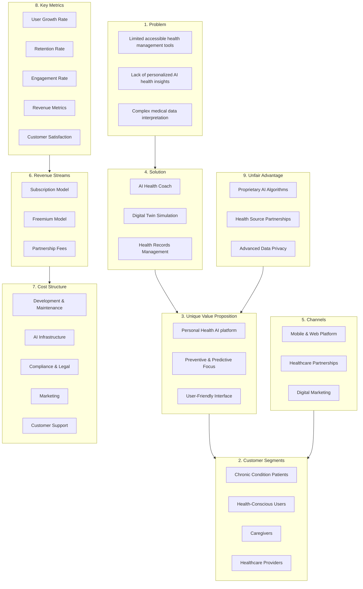

## Índice

0. [Ficha del proyecto](#0-ficha-del-proyecto)
1. [Descripción general del producto](#1-general-product-description)
2. [Arquitectura del sistema](#2-arquitectura-del-sistema)
3. [Modelo de datos](#3-modelo-de-datos)
4. [Especificación de la API](#4-especificación-de-la-api)
5. [Historias de usuario](#5-historias-de-usuario)
6. [Tickets de trabajo](#6-tickets-de-trabajo)
7. [Pull requests](#7-pull-requests)

---

## 0. Ficha del proyecto

### **0.1. Tu nombre completo:**
   - **JESUS ALBERTO ABREU ALMONTE**

### **0.2. Nombre del proyecto:**
   - **VitaMind**

### **0.3. Descripción breve del proyecto:**
   - VitaMind is an advanced AI-powered healthcare application designed to help users manage their health records, receive personalized health coaching, and use a digital twin to simulate lifestyle changes. Aimed at people with chronic illnesses and health-conscious individuals, VitaMind leverages artificial intelligence to provide tailored health insights, daily wellness recommendations, and proactive chronic disease management.

### **0.4. URL del proyecto:**
   - **Pending!**

### 0.5. URL o archivo comprimido del repositorio
   - **[Final-Project-JAA](https://github.com/eltonina/finalproject-JAA)**

---

## 1. General Product Description

This section provides an in-depth overview of VitaMind, from its objectives and main features to user experience design and installation instructions.

### **1.1. Objective:**

   - **Purpose**: VitaMind aims to empower individuals to take charge of their health by providing a comprehensive platform for health records management, personalized health coaching, and chronic disease prevention. With VitaMind, users can keep track of personal health information, gain insights into their risk for common chronic diseases, and explore lifestyle adjustments that could enhance their wellbeing.
   
   - **Value Proposition**: VitaMind’s core value is in its AI-driven approach to personal health management. Unlike traditional apps that require manual input or provide limited insights, VitaMind utilizes AI to:
     - Interpret complex medical records and test results.
     - Offer personalized health recommendations.
     - Simulate lifestyle changes, allowing users to understand how diet, exercise, and other factors could impact their health.
   
   - **Target Audience**: VitaMind is specifically tailored for:
     - Individuals with chronic conditions who want proactive management tools.
     - Health-conscious users who seek data-driven insights into their wellbeing.
     - Those interested in understanding their health risks and exploring lifestyle modifications.

### **1.2. Main Features and Functionalities:**

VitaMind includes three core components: **Health Records Manager**, **Personal Health Coach**, and **Digital Twin**. Each feature addresses a specific need within the health management experience, offering users a centralized and cohesive platform.

#### **Health Records Manager**
- **User Data Input**: Users can enter personal health information, such as age, weight, and fitness level. They can upload medical records or lab results in PDF or image format, or fill out a structured form.
- **Document Handling**: Medical records are stored securely with end-to-end encryption, ensuring user privacy and data protection.
- **Data Parsing**: The AI engine parses and summarizes uploaded documents, explains medical terminology, and offers insights into test results. This feature provides users with accessible, understandable interpretations of complex medical data.
- **Risk Assessment**: Based on the user's data, VitaMind provides personalized risk assessments for conditions such as heart disease, diabetes, and hypertension, using risk scoring models and machine learning algorithms trained on relevant medical datasets.
- **Focus**: Emphasis is placed on accurate handling and analysis of PDFs, images, and structured data input formats to ensure comprehensive coverage of user-uploaded information.

#### **Personal Health Coach**
- **Feedback Schedule**: VitaMind provides daily health plans, notifications, and alerts specifically designed for users managing chronic diseases.
- **Health Focus**: Personalized health goals are established based on individual data and wellness priorities, with regular check-ins and motivational reminders.
- **Interactivity**: A chatbot allows users to ask freeform health questions, receiving simple, friendly explanations on complex topics. The AI responds to questions such as “What is my risk for diabetes?” using the latest data and health records to ensure accurate, context-driven responses.

#### **Digital Twin**
- **Simulation Depth**: The Digital Twin allows users to simulate potential lifestyle adjustments (e.g., diet changes, exercise routines) and assess their impact on health factors related to chronic diseases.
- **Focus**: The current focus is on managing heart disease, diabetes, blood glucose issues, and blood pressure, providing users with insights on how lifestyle modifications could influence their risk levels and health outcomes.
- **Update Frequency**: The model is designed to be updated frequently as users provide new health data or make changes, ensuring the simulations remain relevant and accurate.

#### **Lean Canvas Analysis**

- **Problem:**
  - Lack of accessible, affordable health management tools for individuals with chronic illnesses.
  - Limited access to personalized, AI-driven insights for preventive health and chronic disease management.
  - Complexity of interpreting medical data for non-professionals, which can impact proactive health measures.

- **Customer Segments:**
  - Individuals with chronic conditions (e.g., diabetes, hypertension) who want to actively manage their health.
  - Health-conscious users interested in preventive health and lifestyle management.
  - Caregivers and family members of chronically ill patients who assist with health management.
  - Potential partnerships with healthcare providers, clinics, and insurance companies looking for digital health solutions.

- **Unique Value Proposition:**
  - **Personal Health AI:** VitaMind combines a Personal Health Coach, Digital Twin simulation, and Health Records management in a single platform, making personalized healthcare insights available to anyone.
  - **Preventive and Predictive Focus:** The AI-driven insights and predictive simulations empower users to make proactive decisions and reduce health risks through lifestyle adjustments.
  - **User-Friendly Interface:** Designed for non-experts, VitaMind simplifies complex medical data, making it accessible and actionable for everyday users.

- **Solution:**
  - **AI Health Coach:** A conversational AI providing personalized advice and answers to user queries related to health, lifestyle, and disease management.
  - **Digital Twin Simulation:** An interactive feature allowing users to simulate lifestyle adjustments (e.g., diet, exercise) and view the predicted health impacts over time.
  - **Health Records Management:** A secure upload and analysis tool for medical records, enabling users to store, parse, and interpret their health data within the app.

- **Channels:**
  - Mobile application and web platform for direct user access.
  - Partnerships with clinics, healthcare providers, and insurance companies to integrate VitaMind as an additional service for their patients.
  - Digital marketing via social media, healthcare forums, and partnerships with health influencers to reach target users.
  - Paid ads targeting users searching for health management and chronic disease solutions.

- **Revenue Streams:**
  - **Subscription Model:** Monthly or annual subscription fees for premium features such as advanced digital twin simulations, in-depth health coaching, and additional storage for health records.
  - **Freemium Model:** Free basic features with in-app purchases or upgrades to access premium functionalities.
  - **Partnership and Licensing Fees:** Revenue from healthcare providers and insurance companies that offer VitaMind to patients as a part of their wellness programs.

- **Cost Structure:**
  - **Development and Maintenance:** Continuous development of the mobile app and web platform, including software updates and AI model improvements.
  - **AI and Data Processing Infrastructure:** Costs associated with maintaining secure, scalable AI-driven data analysis and storage.
  - **Compliance and Legal:** HIPAA and GDPR compliance, legal consultation, and data protection measures.
  - **Marketing and Customer Acquisition:** Advertising, promotions, content creation, and partnership development.
  - **Customer Support and User Education:** Dedicated customer support for users, onboarding tutorials, and educational materials for understanding platform usage.

- **Key Metrics:**
  - **User Growth Rate:** Monthly and yearly growth of active users on the platform.
  - **Retention Rate:** Percentage of users continuing subscriptions or remaining active over time.
  - **Engagement Rate:** Frequency of interactions with AI Health Coach, digital twin simulations, and health records features.
  - **Revenue Metrics:** Monthly recurring revenue (MRR) and annual recurring revenue (ARR) from subscriptions and partnerships.
  - **Customer Satisfaction:** Measured through feedback forms, reviews, and net promoter score (NPS) to gauge overall user satisfaction and loyalty.

- **Unfair Advantage:**
  - **Proprietary AI Algorithms:** Custom algorithms fine-tuned for interpreting complex health records and providing accurate, relevant simulations based on the latest medical guidelines.
  - **Partnerships with Trusted Health Sources:** Collaborations with well-known medical organizations and publications to validate health recommendations.
  - **Secure Data Privacy Measures:** Built-in privacy and security measures that exceed industry standards, fostering user trust and compliance with health data regulations.



### **1.3. Design and User Experience:**

### **1.3.1 Overview of User Flow**

The user flow is structured around VitaMind’s three core functionalities: Health Records, Health Coach, and Digital Twin. Each section’s interface should be intuitive, visually appealing, and highly responsive, providing a seamless experience.

#### **Landing Page / Dashboard**
   - **Objective**: The landing page serves as the dashboard, displaying each primary feature—Health Records, Health Coach, and Digital Twin—within easy reach. This gives users a sense of control and understanding of available tools from the outset.
   
   - **Design Elements**:
     - **Navigation Bar**: A top navigation bar with links to Home, Profile, Settings, and Log Out ensures users can navigate back to their personal data or logout securely.
     - **Feature Cards**: The three primary features (Health Records, Health Coach, Digital Twin) are displayed as clickable cards or tiles, each with an icon and brief description.
     - **Quick-Access Buttons**: Buttons like “Upload Records,” “Ask the Coach,” and “Run Simulation” provide direct access to key functions without overwhelming the interface.

   - **User Flow**:
     1. **Entry Point**: User logs in and lands on the dashboard.
     2. **Feature Selection**: User selects a feature, which navigates them to either upload health records, interact with the health coach, or set up simulations with the digital twin.

#### **Health Records Upload**
   - **Objective**: Users can upload medical records and health information securely, with VitaMind’s AI parsing and analyzing the data to provide insights.
   
   - **Design Elements**:
     - **Upload Interface**: A clear, step-by-step upload process supports PDF and image formats. Users are guided through each step, including file selection, confirmation, and final upload.
     - **Secure Uploads**: Security is visually reinforced through icons or messaging (e.g., “End-to-End Encryption Enabled”) to reassure users that their sensitive information is protected.
     - **Data Review and Parsing**: After upload, users see an analysis preview screen where the AI parses information and provides summaries, highlights important metrics, and explains medical terms.

   - **User Flow**:
     1. **File Selection**: User selects “Upload Records” from the dashboard, accesses the upload screen, and chooses a PDF or image file.
     2. **Upload Confirmation**: After selecting a file, the system shows a confirmation prompt before securely uploading.
     3. **Parsed Output Display**: The AI processes the document, displaying insights such as flagged conditions, risk levels, and recommended next steps.

#### **Interactivity with Health Coach**
   - **Objective**: The Health Coach functions as a conversational AI that responds to user questions and offers tailored health advice.
   
   - **Design Elements**:
     - **Chat Interface**: A conversational UI where users can ask freeform health questions or select from suggested prompts (e.g., “How can I reduce my blood pressure?”).
     - **Custom Responses**: The chatbot provides responses based on the user’s personal health data, explaining complex terms in layman’s terms.
     - **Secure and Private Communication**: The chat interface displays a security badge (e.g., “Private and Secure”) ensuring user confidence.

   - **User Flow**:
     1. **Question Submission**: User accesses the Health Coach interface from the dashboard, enters a question or selects a prompt.
     2. **AI Response**: The AI analyzes the question, references relevant user data, and provides a response.
     3. **Follow-Up Suggestions**: The coach may offer further recommendations or link back to other features (e.g., “Based on your cholesterol level, consider running a digital twin simulation”).

#### **Digital Twin Simulations**
   - **Objective**: This feature allows users to simulate lifestyle changes and visualize the potential impact on their health.
   
   - **Design Elements**:
     - **Interactive Settings Panel**: Users can adjust parameters such as diet, exercise frequency, and sleep hours to see predicted health outcomes.
     - **Real-Time Visualizations**: Simulations display graphical representations of how specific changes could influence risk factors (e.g., heart disease, diabetes).
     - **Feedback Alerts**: Color-coded indicators show positive or negative impacts based on the simulated changes (e.g., green for improvement, red for risk increase).

   - **User Flow**:
     1. **Simulation Setup**: User accesses the Digital Twin, selects a health metric (e.g., blood pressure), and adjusts lifestyle variables.
     2. **Run Simulation**: User starts the simulation, and real-time visual feedback shows the predicted outcome.
     3. **Summary and Recommendations**: The AI provides insights based on results, possibly directing the user to resources for lifestyle changes.

### **1.3.2 Visual Content Recommendations**

For an engaging and user-friendly experience, visual aids like wireframes, walkthrough videos, and annotated images can guide users effectively.

#### **Mockups and Wireframes**
   - **Dashboard Wireframe**: Display the layout of main feature tiles, the navigation bar, and quick-access buttons.
   
   
   

   - **Health Records Upload Screen**: Show file selection options, a step-by-step guide, and a secure upload indicator.
   
   
   
   
   
   
   
   
   

   - **Health Coach Chat Interface**: Mockup of the chat window with sample prompts and a displayed AI response.
   
   

   - **Digital Twin Simulation Panel**: Interactive sliders for lifestyle adjustments and visualizations of simulated health outcomes.
   

#### **Video Walkthrough Script**
   - A short video walkthrough of the main features can help users get started and understand the app’s functionality.

   - **Script Outline**:
     1. **Intro Screen**: Display VitaMind’s logo with a tagline: “Your Personal Health Companion.”
     2. **Dashboard Tour**: Briefly show each feature tile on the dashboard, highlighting the Health Records, Health Coach, and Digital Twin.
     3. **Health Records Upload**:
        - Narrate: “Let’s start by uploading a health record. Select the file type, follow the steps, and rest assured, all your data is securely encrypted.”
        - Action: Show user selecting a file, confirming upload, and viewing the AI’s parsed output.
     4. **Health Coach Interaction**:
        - Narrate: “Got questions? Ask our Health Coach for advice. Just type in your question or choose from suggested prompts.”
        - Action: Demonstrate a user typing a question about their risk for diabetes, receiving a response with risk analysis and recommendations.
     5. **Digital Twin Simulation**:
        - Narrate: “Curious about lifestyle changes? Use our Digital Twin to simulate different choices and see potential health impacts.”
        - Action: Show user adjusting sliders for diet and exercise, with real-time visual feedback on projected health outcomes.
     6. **Ending**: Close with a reminder about privacy: “VitaMind is here to support you. Remember to consult with your healthcare provider before making any health decisions.”

#### **User Feedback Annotations**
   - **Dashboard**: Annotations like “Access all features easily” or “Secure navigation.”
   - **Health Records Upload**: “Upload files securely” or “AI summarizes medical terms.”
   - **Digital Twin**: “Adjust settings to see potential impacts” or “Immediate feedback on risk factors.”

### **1.3.3 UI and UX Enhancements**

To ensure an accessible and intuitive user experience, the following elements should be prioritized:

   - **Security Emphasis**: Reassuring messages (e.g., “Your data is protected”) are visible across the dashboard, chat interface, and upload screens.
   - **Accessibility**: Provide alternative text for images and ensure compatibility with screen readers. For visually impaired users, incorporate keyboard shortcuts for navigation.
   - **User Onboarding**: A brief tutorial or “Getting Started” guide upon first login to help users understand VitaMind’s functionality.
   - **Visual Cues**: Employ color-coding for risks (e.g., red for high, green for optimal) and progress indicators during uploads or simulations to enhance usability.
   - **Feedback Mechanisms**: Integrate a “Give Feedback” button, allowing users to report issues or request new features easily.

### **1.4. Installation Instructions:**

   - Follow these instructions to set up VitaMind on a local development environment.

   - **Prerequisites**:
     - Install the necessary libraries and tools:
       - **Python 3.8+** for backend services.
       - **Node.js** for frontend development.
       - **Docker** (optional) for containerized deployment.
   
   - **Frontend and Backend Setup**:
     - **Frontend**: Navigate to the frontend directory and run:
       ```bash
       npm install
       npm start
       ```
     - **Backend**: Navigate to the backend directory and run:
       ```bash
       pip install -r requirements.txt
       python manage.py migrate
       python manage.py runserver
       ```
   
   - **Database Configuration**:
     - Set up a local database (e.g., PostgreSQL or SQLite) and configure environment variables.
     - Apply migrations:
       ```bash
       python manage.py migrate
       ```
     - Seed initial data if required:
       ```bash
       python manage.py loaddata initial_data.json
       ```
   
   - **Environment Variables**:
     - Create an `.env` file in the root directory with required variables (database credentials, API keys).
     - **Example**:
       ```plaintext
       DB_NAME=vita_db
       DB_USER=username
       DB_PASSWORD=password
       SECRET_KEY=your_secret_key_here
       ```
   
   - **Running the Application**:
     - For a quick start, you can run the backend and frontend simultaneously if Docker is configured:
       ```bash
       docker-compose up
       ```
     - Alternatively, start each service separately as described above.

   - **Optional Troubleshooting**:
     - If issues arise, refer to the common troubleshooting guide in the repository (link pending) or consult the installation FAQ.

---

## 2. Arquitectura del Sistema

### **2.1. Diagrama de arquitectura:**
> Usa el formato que consideres más adecuado para representar los componentes principales de la aplicación y las tecnologías utilizadas. Explica si sigue algún patrón predefinido, justifica por qué se ha elegido esta arquitectura, y destaca los beneficios principales que aportan al proyecto y justifican su uso, así como sacrificios o déficits que implica.


### **2.2. Descripción de componentes principales:**

> Describe los componentes más importantes, incluyendo la tecnología utilizada

### **2.3. Descripción de alto nivel del proyecto y estructura de ficheros**

> Representa la estructura del proyecto y explica brevemente el propósito de las carpetas principales, así como si obedece a algún patrón o arquitectura específica.

### **2.4. Infraestructura y despliegue**

> Detalla la infraestructura del proyecto, incluyendo un diagrama en el formato que creas conveniente, y explica el proceso de despliegue que se sigue

### **2.5. Seguridad**

> Enumera y describe las prácticas de seguridad principales que se han implementado en el proyecto, añadiendo ejemplos si procede

### **2.6. Tests**

> Describe brevemente algunos de los tests realizados

---

## 3. Modelo de Datos

### **3.1. Diagrama del modelo de datos:**

> Recomendamos usar mermaid para el modelo de datos, y utilizar todos los parámetros que permite la sintaxis para dar el máximo detalle, por ejemplo las claves primarias y foráneas.


### **3.2. Descripción de entidades principales:**

> Recuerda incluir el máximo detalle de cada entidad, como el nombre y tipo de cada atributo, descripción breve si procede, claves primarias y foráneas, relaciones y tipo de relación, restricciones (unique, not null…), etc.

---

## 4. Especificación de la API

> Si tu backend se comunica a través de API, describe los endpoints principales (máximo 3) en formato OpenAPI. Opcionalmente puedes añadir un ejemplo de petición y de respuesta para mayor claridad

---

## 5. Historias de Usuario

> Documenta 3 de las historias de usuario principales utilizadas durante el desarrollo, teniendo en cuenta las buenas prácticas de producto al respecto.

**Historia de Usuario 1**

**Historia de Usuario 2**

**Historia de Usuario 3**

---

## 6. Tickets de Trabajo

> Documenta 3 de los tickets de trabajo principales del desarrollo, uno de backend, uno de frontend, y uno de bases de datos. Da todo el detalle requerido para desarrollar la tarea de inicio a fin teniendo en cuenta las buenas prácticas al respecto. 

**Ticket 1**

**Ticket 2**

**Ticket 3**

---

## 7. Pull Requests

> Documenta 3 de las Pull Requests realizadas durante la ejecución del proyecto

**Pull Request 1**

**Pull Request 2**

**Pull Request 3**

