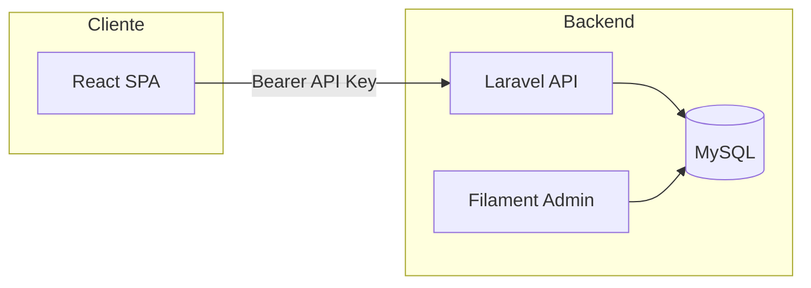
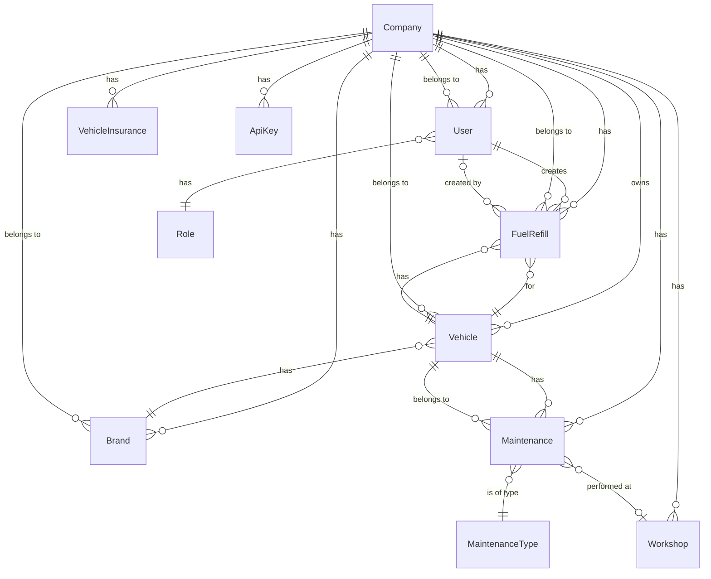

# Flotiko — Proyecto AI4Devs

## Índice

1. [0. Ficha del proyecto](#0-ficha-del-proyecto)
2. [1. Descripción general del producto](#1-descripción-general-del-producto)
3. [2. Arquitectura del sistema](#2-arquitectura-del-sistema)
4. [3. Modelo de datos](#3-modelo-de-datos)
5. [4. Especificación de la API](#4-especificación-de-la-api)
6. [5. Historias de usuario](#5-historias-de-usuario)
7. [6. Tickets de trabajo](#6-tickets-de-trabajo)
8. [7. Pull Requests](#7-pull-requests)

---

## 0. Ficha del proyecto

### 0.1. Tu nombre completo

Carlos Rodríguez Muiño

### 0.2. Nombre del proyecto

**Flotiko**

### 0.3. Descripción breve del proyecto

Flotiko es una aplicación de gestión de flotas (vehículos, repostajes, mantenimientos, seguros, ITV). Permite a los usuarios autenticarse, ver el listado de vehículos de su empresa, registrar repostajes y mantenimientos, y consultar historial e informes de consumo y costes. Backend en Laravel (PHP) con Filament; frontend en React (Vite); base de datos MySQL.

### 0.4. URL del proyecto

(Indicar URL de la app desplegada si existe.)

Puede ser pública o privada, en cuyo caso deberás compartir los accesos de manera segura. Puedes enviarlos a alvaro@lidr.co usando algún servicio como onetimesecret.

### 0.5. URL o archivo comprimido del repositorio

(Indicar URL del repo AI4Devs-finalproject o de este proyecto.)

Puedes tenerlo alojado en público o en privado, en cuyo caso deberás compartir los accesos de manera segura. Puedes enviarlos a alvaro@lidr.co usando algún servicio como onetimesecret. También puedes compartir por correo un archivo zip con el contenido.

---

## 1. Descripción general del producto

### 1.1. Objetivo

Flotiko tiene como propósito permitir a los usuarios llevar el control de sus flotas de vehículos: repostajes, mantenimientos, seguros e ITV. Aporta valor al centralizar la información en una sola aplicación, calcular consumo (L/100 km) y coste por km, y ofrecer alertas de próximos mantenimientos e ITV. Está dirigido tanto a usuarios de empresas que gestionan vehículos (flotas comerciales, servicios, etc.) como a particulares para un mejor control de gastos.

### 1.2. Características y funcionalidades principales

- **Autenticación**: Login con API key (Bearer); la app guarda la API key en localStorage y la envía en cada petición.
- **Multi-tenant**: Datos filtrados por empresa (`company_id`); sin fugas entre empresas.
- **Vehículos**: CRUD de vehículos (marca, modelo, matrícula, año, km, tipo de combustible por defecto).
- **Repostajes**: Registro de repostajes; cálculo automático de coste total y consumo L/100 km y coste por km.
- **Mantenimientos**: Tipos de mantenimiento, talleres, fechas, km, coste; alertas y recordatorios.
- **Seguros e ITV**: Gestión de pólizas y fechas de ITV con recordatorios.
- **Gasolineras**: Endpoint público de gasolineras cercanas (geolocalización).
- **Notificaciones**: Centro de notificaciones en la app; push (Firebase) opcional.
- **Panel admin**: Filament para gestión avanzada (backend).

### 1.3. Diseño y experiencia de usuario

(Incluir aquí imágenes y/o videotutorial mostrando la experiencia desde que el usuario aterriza en la aplicación hasta las funcionalidades principales: login, dashboard, detalle de vehículo, formularios de repostaje y mantenimiento, historial e informe.)

### 1.4. Instrucciones de instalación

**Requisitos:** PHP 8.x, Composer, Node.js y npm, MySQL.

**Backend (Laravel):**

1. `cd flotiko_backend`
2. `composer install`
3. `cp .env.example .env`
4. Configurar en `.env`: `DB_DATABASE`, `DB_USERNAME`, `DB_PASSWORD`
5. `php artisan key:generate`
6. `php artisan migrate` (opcional: `php artisan db:seed` para datos de prueba)
7. `php artisan serve` (API en http://localhost:8000 o el puerto indicado)

**Frontend (React + Vite):**

1. `cd flotiko_frontend`
2. `npm install`
3. Crear `.env` si es necesario con `VITE_API_BASE_URL` apuntando al backend (ej. `http://localhost:8000`)
4. `npm run dev` (app en http://localhost:5173 o el puerto indicado)

**API key:** Obtener una API key desde el panel Filament del backend (ruta `/admin` o la configurada) y usarla en el login del frontend.

---

## 2. Arquitectura del sistema

### 2.1. Diagrama de arquitectura

La aplicación sigue una arquitectura cliente-servidor: un frontend SPA (React) consume una API REST (Laravel). La lógica de negocio está en el backend; el frontend se limita a presentación y llamadas HTTP. Se ha elegido esta separación para reutilizar la API en web y futuras apps móviles, y para centralizar reglas y seguridad en el servidor. Beneficios: API única, escalabilidad del backend, despliegue independiente de frontend (ej. Netlify). Sacrificio: mayor complejidad operativa (dos despliegues, CORS, gestión de API key).



### 2.2. Descripción de componentes principales

- **Frontend (React + Vite):** SPA que consume la API REST. Tecnologías: React, Vite, React Router, cliente HTTP (axios). Páginas: Login, Dashboard, Detalle vehículo, Añadir repostaje, Añadir mantenimiento, Historial, Informe. Contextos para tema, idioma y notificaciones.
- **Backend (Laravel):** API REST bajo `/api`; autenticación por API key (header `Authorization: Bearer {api_key}`). Tecnologías: Laravel, Eloquent, Filament para panel admin. Controladores API por recurso (Auth, Vehicles, FuelRefills, Maintenances, etc.); servicios para lógica de negocio (FuelRefillService, VehicleReportService).
- **Base de datos (MySQL):** Persistencia de empresas, usuarios, vehículos, marcas, repostajes, mantenimientos, talleres, tipos de mantenimiento, seguros, ITV, gasolineras, API keys. Modelos con scope por `company_id` (multi-tenant).

### 2.3. Descripción de alto nivel del proyecto y estructura de ficheros

```
app/
├── documentacion/           # Documentación del proyecto (readme, historias, tickets, trazabilidad)
├── flotiko_backend/         # Backend Laravel
│   ├── app/
│   │   ├── Http/Controllers/Api/   # Controladores API
│   │   ├── Models/                # Eloquent (Company, User, Vehicle, FuelRefill, etc.)
│   │   ├── Services/              # Lógica de negocio (FuelRefillService, etc.)
│   │   └── Http/Middleware/        # ApiAuth, etc.
│   ├── database/migrations/       # Migraciones MySQL
│   ├── routes/api.php             # Rutas API
│   └── ai-specs/specs/            # Especificaciones (data-model, api-spec)
└── flotiko_frontend/        # Frontend React
    ├── src/
    │   ├── pages/                 # Login, Dashboard, VehicleDetail, AddFuelRefill, etc.
    │   ├── components/            # Layout, Toast, etc.
    │   ├── services/api.js        # Cliente HTTP e interceptores
    │   └── context/               # AppContext, ThemeContext, etc.
    └── vite.config.js
```

El backend sigue la estructura estándar de Laravel (MVC + servicios); el frontend organiza por páginas, componentes y servicios.

### 2.4. Infraestructura y despliegue

- **Frontend:** Despliegue estático (ej. Netlify); build con `npm run build`; publicación desde `dist`. Configuración en `flotiko_frontend/netlify.toml`.
- **Backend:** Servidor PHP (VPS, shared hosting o PaaS); requisitos Laravel (PHP, extensiones, MySQL). Proceso: subir código, configurar `.env` (BD, `APP_KEY`), ejecutar `migrate`, configurar servidor web (Apache/Nginx) con document root en `public`.
- **Pipeline CI/CD:** Pendiente o planeado (ej. GitHub Actions para tests y despliegue).
- **Secretos:** Variables de entorno en Netlify para el frontend (`VITE_API_BASE_URL`); `.env` en el backend (no versionado).

### 2.5. Seguridad

- **Autenticación API:** Las rutas protegidas exigen header `Authorization: Bearer {api_key}` o `X-API-Key`. La API key se valida contra la tabla `api_keys` y se asocia a una empresa; el middleware inyecta `company_id` para filtrar datos.
- **Multi-tenant:** Todos los recursos (vehículos, repostajes, mantenimientos, etc.) se filtran por `company_id`; un usuario no puede acceder a datos de otra empresa. Los modelos extienden `BaseModelCompany` y aplican scope por empresa.
- **Validación:** Las peticiones POST/PUT se validan en el backend (reglas Laravel); respuestas 422 con mensajes por campo.
- **Datos sensibles:** Contraseñas hasheadas; API keys almacenadas cifradas; no se exponen en respuestas JSON.

### 2.6. Tests

- **Backend:** PHPUnit en `flotiko_backend/tests/`: tests unitarios y de integración/feature (FuelRefill, FuelRefillService, GeolocationController, Auth, etc.). Ejecución: `php artisan test` o `./vendor/bin/phpunit`.
- **Frontend:** (Opcional) tests con Vitest o React Testing Library.
- **E2E:** Planeado (Cypress o Playwright) para el flujo principal: login → dashboard → detalle vehículo → añadir repostaje → historial.

---

## 3. Modelo de datos

### 3.1. Diagrama del modelo de datos



Documentación detallada: [flotiko_backend/ai-specs/specs/data-model.md](../flotiko_backend/ai-specs/specs/data-model.md).

### 3.2. Descripción de entidades principales

- **Company (companies):** `id` PK, `name`, `email` (unique), `subscription_plan_id` FK nullable. Relaciones: users, vehicles, brands, fuel_refills, maintenances, workshops, api_keys.
- **User (users):** `id` PK, `name`, `email` (unique), `password` (hashed), `company_id` FK required. Relaciones: company, role, fuelRefills (created_by).
- **Vehicle (vehicles):** `id` PK, `company_id` FK, `brand_id` FK, `plate_number`, `model`, `year`, `kms`, `default_fuel_type`. Relaciones: company, brand, fuelRefills, maintenances.
- **Brand (brands):** `id` PK, `company_id` FK, `name`. Relaciones: company, vehicles.
- **FuelRefill (fuel_refills):** `id` PK, `vehicle_id` FK, `company_id` FK, `refill_date`, `kms`, `fuel_type`, `liters`, `price_per_liter`, `total_cost` (calculado), `created_by` FK nullable. Relaciones: vehicle, company, createdByUser. Reglas: total_cost = liters * price_per_liter; si kms > vehicle.kms se actualiza vehicle.kms.
- **Maintenance (maintenances):** `id` PK, `company_id` FK, `vehicle_id` FK, `maintenance_type_id` FK, `workshop_id` FK nullable, `date`, `kms`, `cost`. Relaciones: company, vehicle, maintenanceType, workshop.
- **MaintenanceType, Workshop:** Catálogos por empresa para desplegables.
- **ApiKey (api_keys):** `id` PK, `company_id` FK, `name`, `key` (encrypted). Relación: company.

Restricciones: FK con integridad referencial; índices en `company_id`, `vehicle_id`, `refill_date`; campos obligatorios según especificación en data-model.md.

---

## 4. Especificación de la API

A continuación se describen tres endpoints principales. Especificación OpenAPI completa: [flotiko_backend/ai-specs/specs/api-spec.yml](../flotiko_backend/ai-specs/specs/api-spec.yml).

**Autenticación:** Header `Authorization: Bearer {api_key}` o `X-API-Key: {api_key}` en rutas protegidas.

### Endpoint 1: POST /api/auth/login (login)

- **Descripción:** Valida la API key y devuelve datos de usuario y empresa para la sesión.
- **Request:** Body JSON `{ "api_key": "flk_xxxx..." }`.
- **Response 200:** `{ "user": { "id", "name", "email", "company_id" }, "company": { "id", "name" } }`.
- **Response 401:** `{ "message": "Invalid API key" }`.

### Endpoint 2: GET /api/vehicles (listado de vehículos)

- **Descripción:** Listado paginado de vehículos de la empresa. Requiere API key.
- **Query params:** `page`, `per_page`, `brand_id`, `search`.
- **Response 200:** `{ "data": [ { "id", "brand_id", "license_plate", "model", "year", "current_kms", "company_id" } ], "meta": { "current_page", "per_page", "total" } }`.

### Endpoint 3: POST /api/fuel-refills (crear repostaje)

- **Descripción:** Crea un repostaje; el backend calcula `total_cost` y puede actualizar `vehicle.kms`. Requiere API key.
- **Request:** Body JSON con `vehicle_id`, `refill_date`, `liters`, `price_per_liter`, `fuel_type_id`; opcional `kms`, `gas_station_name`.
- **Response 201:** `{ "data": { "id", "vehicle_id", "refill_date", "liters", "price_per_liter", "total_cost", "kms", "company_id" } }`.
- **Response 422:** Errores de validación por campo.

---

## 5. Historias de usuario

Se documentan tres historias principales. Índice completo: [historias-usuario.md](historias-usuario.md).

### Historia de usuario 1 — Login y acceso (MH1)

**Como** usuario de la empresa **quiero** iniciar sesión con mi API key **para** acceder a la app y ver solo los datos de mi empresa.

**Criterios de aceptación:** Pantalla de login con campo API key; al enviar se llama a `POST /api/auth/login`; si es correcto se guarda la API key en localStorage y se redirige al dashboard; si no hay API key en rutas protegidas se redirige a login; si la API devuelve 401 se limpia el storage y se redirige a login. Solo se ven datos de la empresa asociada a la API key.

**Detalle:** [historias-usuario/MH1.md](historias-usuario/MH1.md).

### Historia de usuario 2 — Listado y detalle de vehículos (MH2)

**Como** usuario **quiero** ver el listado de vehículos de mi empresa y abrir el detalle de uno **para** gestionar repostajes y mantenimientos.

**Criterios de aceptación:** Dashboard con listado paginado desde `GET /api/vehicles`; cada vehículo muestra matrícula, marca/modelo, km actual; clic navega a detalle `/vehicle/:id`; detalle muestra datos del vehículo, último repostaje y alertas; desde el detalle hay enlaces a Añadir repostaje, Añadir mantenimiento, Historial e Informe.

**Detalle:** [historias-usuario/MH2.md](historias-usuario/MH2.md).

### Historia de usuario 3 — Registrar repostaje (MH3)

**Como** usuario **quiero** registrar un repostaje (fecha, km, litros, precio, opcional gasolinera) **para** llevar el control del consumo y el coste.

**Criterios de aceptación:** Desde el detalle del vehículo, botón "Añadir repostaje" que lleva al formulario; campos: fecha, km, litros, precio por litro, tipo de combustible (obligatorios); al enviar se llama a `POST /api/fuel-refills`; el backend calcula total_cost y actualiza vehicle.kms si aplica; tras guardar, mensaje de éxito y redirección; solo para vehículos de la empresa del usuario.

**Detalle:** [historias-usuario/MH3.md](historias-usuario/MH3.md).

---

## 6. Tickets de trabajo

Se documentan tres tickets: uno de backend, uno de frontend y uno de bases de datos. Índice completo: [tickets.md](tickets.md).

### Ticket 1 — Backend: Middleware API key y scopes company (T2)

**Objetivo:** Implementar el middleware que valide la API key en las peticiones (header `Authorization: Bearer {api_key}` o `X-API-Key`), resuelva la empresa asociada y deje `company_id` disponible para el resto de la aplicación.

**Criterios de aceptación:** Middleware (ApiAuth) que lea el header y valide la key contra `api_keys`; si es válida inyectar `company_id` en el request; si falta o es inválida responder 401 JSON; rutas protegidas usan el middleware; rutas públicas (health, login, gas-stations/nearby) no; modelos con scope por empresa usan el contexto inyectado.

**Detalle:** [tickets/T2.md](tickets/T2.md).

### Ticket 2 — Frontend: Login y guardado de API key (T9)

**Objetivo:** Implementar la pantalla de login, llamar al endpoint de login, guardar la API key en localStorage y redirigir al dashboard; que las peticiones API incluyan el header Authorization y que en 401 se limpie la sesión y se redirija a login.

**Criterios de aceptación:** Ruta `/login` y componente Login con formulario (API key); al enviar `POST /api/auth/login`; en éxito guardar API key en localStorage y redirigir a `/`; cliente HTTP con interceptor que añade `Authorization: Bearer {api_key}`; interceptor de respuesta: si 401 eliminar API key y redirigir a `/login`; manejo de errores de login (mensaje en pantalla).

**Detalle:** [tickets/T9.md](tickets/T9.md).

### Ticket 3 — Bases de datos: Proyecto Laravel, migraciones y modelos (T1)

**Objetivo:** Configurar el proyecto Laravel, la conexión a MySQL y las migraciones con los modelos necesarios para el MVP (Company, User, Vehicle, Brand, FuelRefill, Maintenance, etc.) con multi-tenant (company_id), relaciones y scopes.

**Criterios de aceptación:** Proyecto Laravel con BD en `.env`; migraciones para companies, users, vehicles, brands, fuel_refills, maintenances, maintenance_types, workshops, api_keys, etc.; modelos Eloquent con relaciones (belongsTo, hasMany); modelos con scope por company_id; seeders mínimos; `php artisan migrate` sin errores.

**Detalle:** [tickets/T1.md](tickets/T1.md).

---

## 7. Pull Requests

Documenta aquí tres Pull Requests realizadas durante el proyecto (título, descripción breve, enlace al PR si aplica).

### Pull Request 1

(Título y descripción; enlace al PR si está en GitHub/GitLab.)

### Pull Request 2

(Título y descripción; enlace al PR si está en GitHub/GitLab.)

### Pull Request 3

(Título y descripción; enlace al PR si está en GitHub/GitLab.)

---

## Documentación adicional

| Documento | Descripción |
|-----------|-------------|
| [TRACEABILITY.md](TRACEABILITY.md) | Trazabilidad Historia → Tickets. |
| [historias-usuario.md](historias-usuario.md) | Índice de historias (MH1–MH5, SH1–SH2). |
| [tickets.md](tickets.md) | Índice de tickets (T1–T15) y matriz de trazabilidad. |
| [prompts.md](prompts.md) | Registro de prompts utilizados con IA. |
| [glosario.md](glosario.md) | Convenciones y términos del proyecto. |
