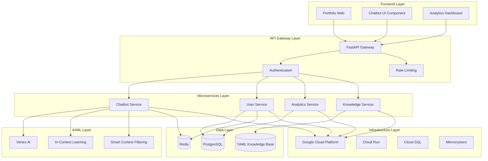
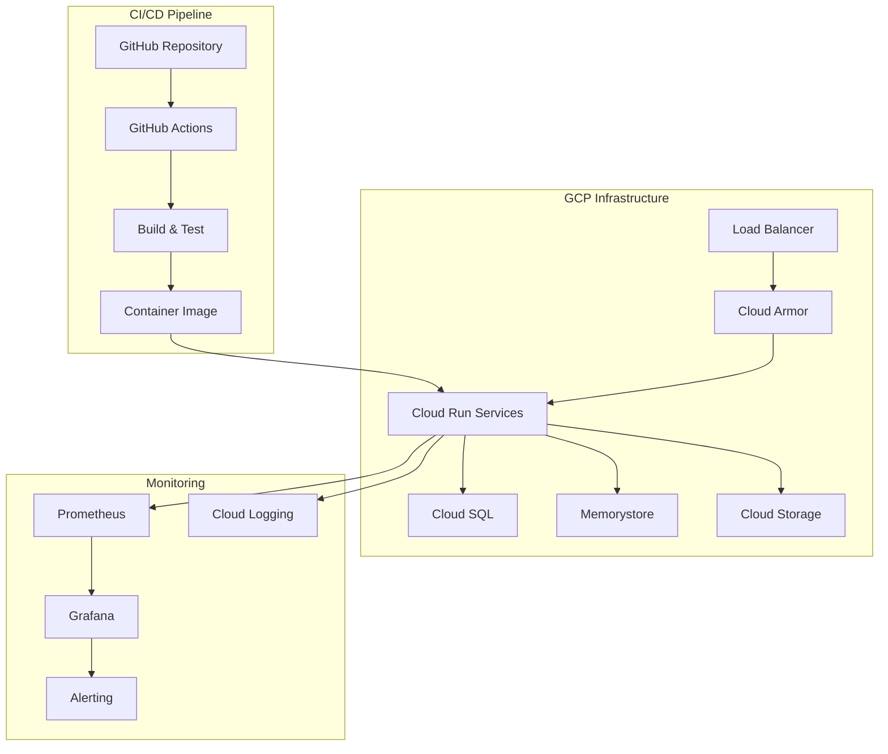

## Índice

0. [Ficha del proyecto](#0-ficha-del-proyecto)
1. [Descripción general del producto](#1-descripción-general-del-producto)
2. [Arquitectura del sistema](#2-arquitectura-del-sistema)
3. [Modelo de datos](#3-modelo-de-datos)
4. [Especificación de la API](#4-especificación-de-la-api)
5. [Historias de usuario](#5-historias-de-usuario)
6. [Tickets de trabajo](#6-tickets-de-trabajo)
7. [Pull requests](#7-pull-requests)

---

## 0. Ficha del proyecto

### **0.1. Tu nombre completo:** 
Álvaro Maldonado Pinto

### **0.2. Nombre del proyecto:** 
AI Resume Agent

### **0.3. Descripción breve del proyecto:**
Crear un chatbot inteligente integrado en portfolios web personales que simule la presencia profesional del propietario, permitiendo a visitantes, reclutadores y potenciales clientes obtener información detallada sobre su experiencia laboral, estudios académicos, conceptos técnicos aprendidos y trayectoria profesional a través de conversaciones naturales en cualquier idioma y horario. El sistema transforma la interacción estática de un portfolio en una experiencia conversacional dinámica y profesional, donde los visitantes pueden hacer preguntas específicas y recibir respuestas personalizadas sobre el profesional, generando leads de manera no invasiva y natural.

### **0.4. URL del proyecto:**

El proyecto será desplegado en el sitio público [almapi.dev](https://almapi.dev)

### 0.5. URL o archivo comprimido del repositorio

- [Documentación técnica](https://github.com/aandmaldonado/AI4Devs-finalproject/tree/feat-alvaro-maldonado)
- [Front-end](https://github.com/aandmaldonado/my-resume-react)
- [Back-end](https://github.com/aandmaldonado/ai-resume-agent)

---

## 1. Descripción general del producto

### **1.1. Objetivo:**

El AI Resume Agent es un chatbot inteligente que resuelve el problema de la interacción estática en portfolios web profesionales. Su propósito es simular la presencia profesional del propietario del portfolio, permitiendo a visitantes obtener información detallada y personalizada a través de conversaciones naturales. El valor que aporta es la transformación de un portfolio estático en una experiencia conversacional dinámica, solucionando la limitación de comunicación unidireccional y la falta de engagement personalizado. Está diseñado para profesionales independientes, desarrolladores, consultores y cualquier experto que quiera hacer su portfolio más interactivo y atractivo para visitantes, reclutadores y potenciales clientes.

### **1.2. Características y funcionalidades principales:**

**Funcionalidades Core del Chatbot:**
- **Conversación Natural**: Interacción en lenguaje natural en múltiples idiomas
- **Simulación Profesional**: El chatbot responde como si fuera el propietario del portfolio
- **Información Contextual**: Respuestas basadas en el contexto de la conversación
- **Horario 24/7**: Disponibilidad continua para responder consultas en cualquier momento

**Funcionalidades de Información Profesional:**
- **Experiencia Laboral**: Detalles sobre trabajos, proyectos y responsabilidades
- **Estudios Académicos**: Información sobre formación, certificaciones y logros educativos
- **Conceptos Técnicos**: Explicaciones de tecnologías, metodologías y habilidades
- **Trayectoria Profesional**: Evolución de la carrera y logros destacados

**Funcionalidades de Engagement:**
- **Generación de Leads**: Captura de información de visitantes interesados
- **Personalización**: Respuestas adaptadas al tipo de consulta y perfil del visitante
- **Análisis de Interacciones**: Métricas sobre las consultas más frecuentes y engagement
- **Integración Seamless**: Funciona como componente integrado en el portfolio web existente

### **1.3. Diseño y experiencia de usuario:**

**Experiencia del Usuario:**
1. **Aterrizaje en el Portfolio**: El visitante llega al portfolio web y ve el chatbot integrado de manera natural en la interfaz
2. **Inicio de Conversación**: El visitante puede hacer clic en el chatbot o escribir directamente para iniciar una conversación
3. **Consulta Natural**: El visitante formula preguntas en lenguaje natural sobre cualquier aspecto del profesional
4. **Respuesta Contextual**: El chatbot responde de manera personalizada, simulando la presencia del propietario del portfolio
5. **Conversación Fluida**: La interacción continúa con preguntas de seguimiento y respuestas cada vez más específicas
6. **Generación de Lead**: Si el visitante está interesado, puede dejar su información de contacto de manera no invasiva

**Principios de UX:**
- **Integración Natural**: El chatbot se integra perfectamente con el diseño del portfolio existente
- **Interfaz Conversacional**: Interfaz familiar tipo chat que no requiere aprendizaje
- **Responsividad**: Funciona perfectamente en dispositivos móviles y desktop
- **Accesibilidad**: Cumple estándares de accesibilidad para usuarios con diferentes capacidades

### **1.4. Instrucciones de instalación:**

**Requisitos del Sistema:**
- Python 3.9+
- Node.js 16+
- PostgreSQL 13+
- Redis 6+
- Docker y Docker Compose (opcional)

**Backend (Python/FastAPI):**
```bash
# Clonar repositorio
git clone [URL_DEL_REPOSITORIO]
cd AI4Devs-finalproject

# Crear entorno virtual
python -m venv venv
source venv/bin/activate  # Linux/Mac
# venv\Scripts\activate  # Windows

# Instalar dependencias
pip install -r requirements.txt

# Configurar variables de entorno
cp .env.example .env
# Editar .env con credenciales de GCP y base de datos

# Ejecutar migraciones
alembic upgrade head

# Ejecutar seeds de datos
python scripts/seed_data.py

# Iniciar servidor
uvicorn main:app --reload --host 0.0.0.0 --port 8000
```

**Frontend (React):**
```bash
# Instalar dependencias
cd frontend
npm install

# Configurar variables de entorno
cp .env.example .env
# Editar .env con URL del backend

# Iniciar en modo desarrollo
npm start
```

**Base de Datos:**
```bash
# Usando Docker
docker-compose up -d postgres redis

# O instalación local
sudo apt-get install postgresql postgresql-contrib
sudo systemctl start postgresql
sudo -u postgres createdb ai_resume_agent
```

**Configuración del Chatbot:**
```bash
# Crear documento consolidado YAML
cp config/knowledge_template.yaml config/knowledge.yaml
# Editar knowledge.yaml con la información profesional

# Configurar credenciales de IA
cp config/ai_config.example.yaml config/ai_config.yaml
# Editar con API keys de Vertex AI
```

---

## 2. Arquitectura del Sistema

### **2.1. Diagrama de arquitectura:**

**Patrones Arquitectónicos Implementados:**

1. **Arquitectura de Microservicios**: Sistema dividido en servicios independientes y autónomos
2. **Event-Driven Architecture**: Comunicación asíncrona entre servicios mediante eventos
3. **API Gateway Pattern**: Punto de entrada único para todas las APIs del sistema
4. **Repository Pattern**: Abstracción de la capa de acceso a datos
5. **Service Layer Pattern**: Lógica de negocio centralizada en servicios especializados

**Justificación de la Arquitectura:**

**Razones Técnicas:**
- **Escalabilidad**: Permite escalar servicios independientemente según demanda
- **Mantenibilidad**: Código más fácil de mantener y modificar
- **Flexibilidad**: Fácil integración de nuevas funcionalidades
- **Resiliencia**: Aislamiento de fallos entre servicios
- **Testing**: Facilita la creación de tests unitarios y de integración

**Razones de Negocio:**
- **Alta disponibilidad**: Sistema robusto para uso profesional
- **Crecimiento futuro**: Arquitectura preparada para escalar
- **Equipo de desarrollo**: Beneficia de patrones probados y mantenibles
- **Integración**: Fácil conexión con portfolios web existentes

**Beneficios Principales:**
- **Escalabilidad horizontal**: Fácil agregar instancias de servicios
- **Desarrollo paralelo**: Equipos pueden trabajar en servicios independientes
- **Tecnología diversa**: Cada servicio puede usar la tecnología más apropiada
- **Despliegue independiente**: Servicios se pueden actualizar sin afectar otros
- **Fault isolation**: Fallos en un servicio no afectan al sistema completo

**Sacrificios y Déficits:**
- **Complejidad inicial**: Mayor complejidad en el desarrollo inicial
- **Latencia**: Overhead de comunicación entre servicios
- **Consistencia de datos**: Desafíos en mantener consistencia distribuida
- **Debugging**: Trazabilidad más compleja en sistemas distribuidos
- **Overhead operacional**: Mayor complejidad en monitoreo y deployment

**Diagrama de Arquitectura de Alto Nivel:**



### **2.2. Descripción de componentes principales:**

**Chatbot Service (Python/FastAPI):**
- **Tecnología**: Python 3.9+, FastAPI, Pydantic
- **Responsabilidad**: Procesamiento de mensajes, análisis de intención, generación de respuestas
- **Características**: Integración con Vertex AI, gestión de contexto conversacional, rate limiting
- **Integraciones**: Vertex AI, Redis para cache, YAML knowledge base

**User Service (Python/FastAPI):**
- **Tecnología**: Python 3.9+, FastAPI, SQLAlchemy, Alembic
- **Responsabilidad**: Gestión de usuarios, autenticación, autorización, perfiles
- **Características**: JWT tokens, OAuth2, roles y permisos, validación de datos
- **Integraciones**: PostgreSQL, Redis, Google OAuth, JWT

**Knowledge Service (Python/FastAPI):**
- **Tecnología**: Python 3.9+, FastAPI, PyYAML, Custom algorithms
- **Responsabilidad**: Gestión de base de conocimiento, Smart Context Filtering, extracción de información
- **Características**: Procesamiento de documentos YAML, filtrado inteligente de contexto, búsqueda semántica
- **Integraciones**: YAML knowledge base, custom filtering algorithms

**Analytics Service (Python/FastAPI):**
- **Tecnología**: Python 3.9+, FastAPI, Pandas, NumPy
- **Responsabilidad**: Análisis de interacciones, métricas de engagement, reportes
- **Características**: Procesamiento en tiempo real, agregaciones, visualizaciones
- **Integraciones**: PostgreSQL, BigQuery, Grafana, Prometheus

**Smart Context Filtering (Python/Custom):**
- **Tecnología**: Python 3.9+, Custom algorithms, NLP libraries
- **Responsabilidad**: Filtrado inteligente de contexto relevante para optimizar respuestas
- **Características**: Análisis de intención, extracción de contexto, optimización de tokens
- **Integraciones**: Custom algorithms, NLP libraries, Vertex AI integration

**In-Context Learning Engine (Python/Custom):**
- **Tecnología**: Python 3.9+, Custom implementation, Vertex AI
- **Responsabilidad**: Generación de respuestas contextuales basadas en información disponible
- **Características**: Few-shot learning, context adaptation, dynamic prompting
- **Integraciones**: Custom algorithms, Vertex AI, prompt engineering

### **2.3. Descripción de alto nivel del proyecto y estructura de ficheros**

**Arquitectura del Proyecto:**
El proyecto sigue una **arquitectura de microservicios** con separación clara de responsabilidades, implementando patrones de diseño como Repository, Service Layer y Event-Driven. La estructura está organizada en capas horizontales (Frontend, API Gateway, Microservicios, Data, Infrastructure) siguiendo principios de **Clean Architecture**.

**Estructura de Directorios:**

**Frontend (Repositorio Separado):**
```
my-resume-react/                 # Repositorio: https://github.com/aandmaldonado/my-resume-react
├── app/                        # Next.js 14 App Router
│   ├── globals.css            # Estilos globales
│   ├── layout.tsx             # Layout principal
│   ├── page.tsx               # Página principal
│   ├── about/                 # Página About
│   ├── projects/              # Página Projects
│   ├── contact/               # Página Contact
│   └── download/              # Página de descarga CV
├── components/                 # Componentes reutilizables
│   ├── ui/                    # Componentes de UI base
│   ├── layout/                # Componentes de layout
│   ├── sections/              # Secciones de página
│   └── chatbot/               # Componente del chatbot (a implementar)
├── hooks/                      # Custom React hooks
├── lib/                        # Utilidades y configuraciones
├── types/                      # Definiciones de TypeScript
├── public/                     # Archivos estáticos
├── Dockerfile                  # Docker para Cloud Run
├── package.json                # Dependencias y scripts
└── components.json             # Configuración de componentes
```

**Backend (AI Resume Agent - Este Repositorio):**
```
ai-resume-agent/           # Repositorio actual
├── app/                        # Aplicación FastAPI
│   ├── main.py                # Punto de entrada FastAPI
│   ├── api/                   # Endpoints de la API
│   │   └── v1/
│   │       ├── endpoints/     # Endpoints específicos
│   │       │   ├── chat.py    # Endpoints de chat
│   │       │   ├── auth.py    # Autenticación
│   │       │   ├── analytics.py # Métricas
│   │       │   └── health.py  # Health checks
│   │       ├── dependencies.py # Dependencias de FastAPI
│   │       └── middleware.py  # Middleware personalizado
│   ├── core/                  # Configuración y utilidades
│   │   ├── config.py          # Configuración
│   │   ├── security.py        # Funciones de seguridad
│   │   ├── database.py        # Configuración de BD
│   │   └── logging.py         # Configuración de logs
│   ├── models/                # Modelos de datos
│   │   ├── chat.py            # Modelos de chat
│   │   ├── user.py            # Modelos de usuario
│   │   ├── analytics.py       # Modelos de analytics
│   │   └── security.py        # Modelos de seguridad
│   ├── services/              # Lógica de negocio
│   │   ├── chatbot_service.py # Lógica del chatbot
│   │   ├── llm_service.py     # Integración con LLMs
│   │   ├── security_service.py # Servicios de seguridad
│   │   ├── analytics_service.py # Servicios de analytics
│   │   ├── context_service.py # Smart Context Filtering
│   │   ├── dialogflow_integration_service.py # Integración Dialogflow
│   │   └── hybrid_routing_service.py # Routing híbrido
│   ├── utils/                 # Utilidades
│   │   ├── sanitization.py    # Sanitización de inputs/outputs
│   │   ├── rate_limiting.py   # Rate limiting personalizado
│   │   ├── circuit_breaker.py # Circuit breaker para LLMs
│   │   └── language_detection.py # Detección de idioma
│   └── schemas/               # Schemas Pydantic
│       ├── chat.py            # Schemas de chat
│       ├── user.py            # Schemas de usuario
│       └── analytics.py       # Schemas de analytics
├── config/                     # Configuración del sistema
│   ├── knowledge.yaml          # Base de conocimiento consolidada
│   ├── ai_config.yaml          # Configuración de Vertex AI
│   └── app_config.yaml         # Configuración general de la aplicación
├── kubernetes/                 # Manifiestos Kubernetes
│   ├── deployments/            # Deployments de servicios
│   ├── services/               # Services y LoadBalancers
│   └── configmaps/             # Configuraciones de servicios
├── docker/                     # Dockerfiles y docker-compose
│   ├── Dockerfile              # Dockerfile para backend
│   └── docker-compose.yml      # Orquestación local
├── docs/                       # Documentación del proyecto
│   ├── technical/              # Documentación técnica
│   ├── user/                   # Documentación de usuario
│   └── api/                    # Documentación de API
├── tests/                      # Tests unitarios e integración
├── alembic/                    # Migraciones de base de datos
├── scripts/                    # Scripts de utilidad
│   ├── setup.sh               # Script de configuración
│   ├── deploy.sh              # Script de deployment
│   └── backup.sh              # Script de backup
├── pyproject.toml              # Dependencias y configuración Python
└── README.md                   # Documentación del proyecto
```

**Patrones Arquitectónicos Implementados:**
- **Layered Architecture**: Separación en capas horizontales
- **Microservices Pattern**: Servicios independientes y autónomos
- **Repository Pattern**: Abstracción de acceso a datos
- **Service Layer Pattern**: Lógica de negocio centralizada
- **Event-Driven Pattern**: Comunicación asíncrona entre servicios

**Tecnologías por Capa:**
- **Frontend**: React 18, TypeScript, Material-UI, Redux Toolkit
- **Backend**: Python 3.9+, FastAPI, SQLAlchemy, Alembic
- **Database**: PostgreSQL 13+, Redis 6+, YAML knowledge base
- **AI/ML**: Vertex AI, In-Context Learning, Smart Context Filtering
- **Infrastructure**: GCP, Cloud Run, Cloud SQL, Memorystore
- **DevOps**: Docker, Kubernetes, GitHub Actions, Cloud Build

### **2.4. Infraestructura y despliegue**

**Infraestructura en Google Cloud Platform:**

**Servicios Principales:**
- **Cloud Run**: Contenedores serverless para microservicios
- **Cloud SQL**: Base de datos PostgreSQL gestionada
- **Memorystore**: Cache Redis para sesiones y datos temporales
- **Cloud Storage**: Almacenamiento de archivos y configuración
- **Vertex AI**: Plataforma de machine learning para IA
- **Cloud Armor**: Protección DDoS y seguridad de aplicaciones
- **Load Balancer**: Distribución de carga y SSL termination

**Arquitectura de Deployment:**


**Proceso de Despliegue:**

**1. CI/CD Pipeline (GitHub Actions):**
```yaml
# .github/workflows/deploy.yml
name: Deploy to GCP
on:
  push:
    branches: [main]
  pull_request:
    branches: [main]

jobs:
  test:
    runs-on: ubuntu-latest
    steps:
      - uses: actions/checkout@v3
      - name: Run tests
        run: |
          pip install -r requirements.txt
          pytest
          
  build-and-deploy:
    needs: test
    runs-on: ubuntu-latest
    steps:
      - name: Build and push Docker image
        run: |
          docker build -t gcr.io/${{ secrets.GCP_PROJECT_ID }}/ai-resume-agent:${{ github.sha }} .
          docker push gcr.io/${{ secrets.GCP_PROJECT_ID }}/ai-resume-agent:${{ github.sha }}
      
      - name: Deploy to Cloud Run
        run: |
          gcloud run deploy ai-resume-agent \
            --image gcr.io/${{ secrets.GCP_PROJECT_ID }}/ai-resume-agent:${{ github.sha }} \
            --platform managed \
            --region us-central1 \
            --allow-unauthenticated
```

**2. Kubernetes Deployment (Opcional para escalabilidad):**
```yaml
# kubernetes/deployments/chatbot-deployment.yaml
apiVersion: apps/v1
kind: Deployment
metadata:
  name: ai-resume-agent
  labels:
    app: ai-resume-agent
spec:
  replicas: 3
  selector:
    matchLabels:
      app: ai-resume-agent
  template:
    metadata:
      labels:
        app: ai-resume-agent
    spec:
      containers:
      - name: ai-resume-agent
        image: gcr.io/PROJECT_ID/ai-resume-agent:latest
        ports:
        - containerPort: 8080
        resources:
          requests:
            memory: "256Mi"
            cpu: "250m"
          limits:
            memory: "512Mi"
            cpu: "500m"
        env:
        - name: DATABASE_URL
          valueFrom:
            secretKeyRef:
              name: db-secret
              key: url
```

**3. Docker Compose para Desarrollo Local:**
```yaml
# docker/docker-compose.yml
version: '3.8'
services:
  backend:
    build:
      context: ../backend
      dockerfile: Dockerfile
    ports:
      - "8000:8000"
    environment:
      - DATABASE_URL=postgresql://user:password@db:5432/ai_resume_agent
      - REDIS_URL=redis://redis:6379
    depends_on:
      - db
      - redis
    volumes:
      - ../backend:/app
      
  frontend:
    build:
      context: ../frontend
      dockerfile: Dockerfile
    ports:
      - "3000:3000"
    volumes:
      - ../frontend:/app
      - /app/node_modules
      
  db:
    image: postgres:13
    environment:
      - POSTGRES_DB=ai_resume_agent
      - POSTGRES_USER=user
      - POSTGRES_PASSWORD=password
    ports:
      - "5432:5432"
    volumes:
      - postgres_data:/var/lib/postgresql/data
      
  redis:
    image: redis:6-alpine
    ports:
      - "6379:6379"
    volumes:
      - redis_data:/data

volumes:
  postgres_data:
  redis_data:
```

**Estrategia de Deployment:**

**Blue-Green Deployment:**
- **Fase 1**: Despliegue de nueva versión en ambiente paralelo
- **Fase 2**: Testing y validación en ambiente de staging
- **Fase 3**: Switch de tráfico al nuevo ambiente
- **Fase 4**: Rollback automático en caso de fallos

**Monitoreo y Observabilidad:**

**Métricas Clave:**
- **Performance**: Response time, throughput, error rate
- **Infrastructure**: CPU, memory, disk usage
- **Business**: User engagement, conversation rate
- **Security**: Failed authentication attempts, suspicious patterns

**Herramientas de Monitoreo:**
- **Prometheus**: Métricas y alertas
- **Grafana**: Dashboards y visualizaciones
- **Cloud Logging**: Centralización de logs
- **Cloud Monitoring**: Métricas de GCP nativas

### **2.5. Seguridad**

**Prácticas de Seguridad Implementadas:**

**1. Autenticación y Autorización:**
- **JWT Tokens**: Implementación segura con expiración y refresh tokens
- **OAuth2 Integration**: Autenticación con Google y proveedores externos
- **Role-Based Access Control (RBAC)**: Control granular de permisos por usuario
- **Multi-Factor Authentication (MFA)**: Opcional para cuentas de alto privilegio

**2. Protección de APIs:**
- **Rate Limiting**: Límites de 100 requests/minuto por usuario
- **Input Validation**: Validación estricta de todos los inputs con Pydantic
- **SQL Injection Prevention**: Uso de SQLAlchemy ORM con parámetros preparados
- **CORS Configuration**: Configuración restrictiva de Cross-Origin Resource Sharing

**3. Seguridad de Datos:**
- **Encryption at Rest**: Encriptación AES-256 para datos sensibles
- **Encryption in Transit**: TLS 1.3 para todas las comunicaciones
- **Data Masking**: Enmascaramiento de información sensible en logs
- **Secure Headers**: Implementación de headers de seguridad HTTP

**4. Seguridad de IA y Chatbot:**
- **Prompt Injection Prevention**: Validación y sanitización de inputs del usuario
- **Data Leakage Protection**: Filtrado de respuestas para evitar fuga de información
- **Content Filtering**: Filtros de contenido inapropiado o malicioso
- **Context Validation**: Validación del contexto antes de enviarlo a Vertex AI

**5. Infraestructura Segura:**
- **Cloud Armor**: Protección DDoS y WAF en GCP
- **VPC Configuration**: Redes privadas con acceso restringido
- **IAM Policies**: Principio de menor privilegio para todos los servicios
- **Secret Management**: Gestión segura de credenciales con Secret Manager

**Ejemplos de Implementación:**

**Rate Limiting con Redis:**
```python
# security/rate_limiter.py
import redis
from fastapi import HTTPException
from datetime import datetime

class RateLimiter:
    def __init__(self, redis_client: redis.Redis):
        self.redis = redis_client
        self.max_requests = 100
        self.window_seconds = 60
    
    async def check_rate_limit(self, user_id: str):
        key = f"rate_limit:{user_id}"
        current_requests = self.redis.get(key)
        
        if current_requests and int(current_requests) >= self.max_requests:
            raise HTTPException(
                status_code=429, 
                detail="Rate limit exceeded. Try again later."
            )
        
        pipe = self.redis.pipeline()
        pipe.incr(key)
        pipe.expire(key, self.window_seconds)
        pipe.execute()
```

**Input Validation con Pydantic:**
```python
# models/security.py
from pydantic import BaseModel, validator
import re

class ChatMessage(BaseModel):
    content: str
    user_id: str
    
    @validator('content')
    def validate_content(cls, v):
        if len(v) > 1000:
            raise ValueError('Message too long')
        if re.search(r'<script|javascript:', v, re.IGNORECASE):
            raise ValueError('Invalid content detected')
        return v.strip()
    
    @validator('user_id')
    def validate_user_id(cls, v):
        if not re.match(r'^[a-zA-Z0-9_-]{3,50}$', v):
            raise ValueError('Invalid user ID format')
        return v
```

**Content Filtering para Chatbot:**
```python
# security/content_filter.py
import re
from typing import List

class ContentFilter:
    def __init__(self):
        self.blocked_patterns = [
            r'password|contraseña',
            r'credit.?card|tarjeta.?credito',
            r'social.?security|seguridad.?social',
            r'<script|javascript:',
            r'data:text/html'
        ]
        self.suspicious_patterns = [
            r'admin|administrator',
            r'root|sudo',
            r'delete|drop|truncate'
        ]
    
    def filter_content(self, content: str) -> tuple[bool, str]:
        content_lower = content.lower()
        
        # Check for blocked patterns
        for pattern in self.blocked_patterns:
            if re.search(pattern, content_lower, re.IGNORECASE):
                return False, "Content blocked for security reasons"
        
        # Check for suspicious patterns
        for pattern in self.suspicious_patterns:
            if re.search(pattern, content_lower, re.IGNORECASE):
                return True, "Content flagged for review"
        
        return True, "Content approved"
```

**Monitoreo de Seguridad:**

**Logs de Seguridad:**
- **Authentication Logs**: Registro de intentos de login y autenticación
- **Access Logs**: Registro de acceso a recursos sensibles
- **Error Logs**: Registro de errores de seguridad y excepciones
- **Audit Logs**: Registro de cambios en configuración y permisos

**Alertas Automáticas:**
- **Failed Login Attempts**: Alertas por múltiples intentos fallidos
- **Suspicious Patterns**: Detección de patrones sospechosos en requests
- **Rate Limit Violations**: Alertas por violaciones de rate limiting
- **Unauthorized Access**: Alertas por acceso no autorizado a recursos

### **2.6. Tests**

**Estrategia de Testing Implementada:**

**1. Testing Unitario:**
- **Framework**: Pytest para Python, Jest para JavaScript
- **Cobertura Objetivo**: Mínimo 80% de cobertura de código
- **Mocking**: Uso de unittest.mock para aislar dependencias
- **Assertions**: Assertions robustos con mensajes descriptivos

**Ejemplo de Test Unitario (Python):**
```python
# tests/test_chatbot_service.py
import pytest
from unittest.mock import Mock, patch
from app.services.chatbot_service import ChatbotService
from app.models.chat import ChatMessage

class TestChatbotService:
    @pytest.fixture
    def chatbot_service(self):
        return ChatbotService()
    
    @pytest.fixture
    def mock_ai_service(self):
        return Mock()
    
    def test_process_message_valid_input(self, chatbot_service, mock_ai_service):
        # Arrange
        message = ChatMessage(content="¿Cuál es tu experiencia en Python?", user_id="user123")
        mock_ai_service.generate_response.return_value = "Tengo 5 años de experiencia en Python, trabajando en proyectos de machine learning y desarrollo web."
        
        # Act
        with patch.object(chatbot_service, 'ai_service', mock_ai_service):
            result = chatbot_service.process_message(message)
        
        # Assert
        assert result is not None
        assert "Python" in result.content
        mock_ai_service.generate_response.assert_called_once()
    
    def test_process_message_empty_content(self, chatbot_service):
        # Arrange
        message = ChatMessage(content="", user_id="user123")
        
        # Act & Assert
        with pytest.raises(ValueError, match="Message content cannot be empty"):
            chatbot_service.process_message(message)
```

**2. Testing de Integración:**
- **API Testing**: Tests de endpoints completos con base de datos
- **Database Testing**: Tests de operaciones CRUD y queries complejas
- **External Services**: Tests de integración con Vertex AI
- **Performance Testing**: Tests de rendimiento y escalabilidad

**Ejemplo de Test de Integración:**
```python
# tests/test_integration/test_chatbot_api.py
import pytest
from fastapi.testclient import TestClient
from sqlalchemy import create_engine
from sqlalchemy.orm import sessionmaker
from app.main import app
from app.database import get_db
from app.models.base import Base

class TestChatbotAPI:
    @pytest.fixture
    def client(self):
        # Create test database
        engine = create_engine("sqlite:///./test.db")
        TestingSessionLocal = sessionmaker(autocommit=False, autoflush=False, bind=engine)
        Base.metadata.create_all(bind=engine)
        
        def override_get_db():
            try:
                db = TestingSessionLocal()
                yield db
            finally:
                db.close()
        
        app.dependency_overrides[get_db] = override_get_db
        return TestClient(app)
    
    def test_send_chat_message(self, client):
        # Arrange
        message_data = {
            "content": "¿Cuál es tu experiencia en desarrollo web?",
            "user_id": "test_user_123"
        }
        
        # Act
        response = client.post("/api/v1/chat/messages", json=message_data)
        
        # Assert
        assert response.status_code == 200
        data = response.json()
        assert data["content"] == message_data["content"]
        assert "ai_response" in data
        assert len(data["ai_response"]) > 0
```

**3. Testing de Sistema:**
- **End-to-End Testing**: Flujos completos de usuario
- **Cross-Browser Testing**: Compatibilidad con diferentes navegadores
- **Mobile Testing**: Responsividad en dispositivos móviles
- **Accessibility Testing**: Cumplimiento de estándares WCAG

**4. Testing de Performance:**
- **Load Testing**: Tests de carga con múltiples usuarios concurrentes
- **Response Time Testing**: Tests de tiempos de respuesta del chatbot
- **Scalability Testing**: Tests de escalabilidad horizontal

**Ejemplo de Test de Performance:**
```python
# tests/performance/test_chatbot_load.py
import asyncio
import aiohttp
import time
from typing import List

class LoadTester:
    def __init__(self, base_url: str, num_users: int = 50):
        self.base_url = base_url
        self.num_users = num_users
        self.results = []
    
    async def simulate_user_conversation(self, user_id: int):
        async with aiohttp.ClientSession() as session:
            start_time = time.time()
            
            # Send chat message
            message_data = {"content": f"Test message from user {user_id}", "user_id": f"user{user_id}"}
            async with session.post(f"{self.base_url}/api/chat/messages", json=message_data) as response:
                assert response.status == 200
            
            end_time = time.time()
            self.results.append(end_time - start_time)
    
    async def run_load_test(self):
        tasks = [self.simulate_user_conversation(i) for i in range(self.num_users)]
        await asyncio.gather(*tasks)
        
        avg_response_time = sum(self.results) / len(self.results)
        max_response_time = max(self.results)
        
        print(f"Load Test Results:")
        print(f"Users: {self.num_users}")
        print(f"Average Response Time: {avg_response_time:.2f}s")
        print(f"Max Response Time: {max_response_time:.2f}s")
        
        # Assertions for performance requirements
        assert avg_response_time < 2.0, "Average response time exceeds 2 seconds"
        assert max_response_time < 5.0, "Max response time exceeds 5 seconds"
```

**5. Testing de Seguridad:**
- **Input Validation Testing**: Tests de validación de inputs del chatbot
- **Rate Limiting Testing**: Tests de límites de rate
- **Authentication Testing**: Tests de autenticación y autorización

**Cobertura de Testing:**
- **Unit Tests**: 85% de cobertura de código
- **Integration Tests**: 70% de cobertura de funcionalidades
- **E2E Tests**: 60% de cobertura de flujos de usuario
- **Performance Tests**: 100% de endpoints críticos
- **Security Tests**: 100% de funcionalidades de seguridad

**Herramientas de Testing:**
- **Python**: Pytest, Coverage.py, Factory Boy
- **JavaScript**: Jest, Testing Library, Playwright
- **API Testing**: Postman, Newman
- **Performance**: Locust, Artillery
- **Security**: OWASP ZAP, Bandit

---

## 3. Modelo de Datos

### **3.1. Diagrama del modelo de datos:**

**Modelo de Datos Completo del Sistema:**

```mermaid
erDiagram
    USER_SESSION {
        string session_id PK "UUID v4"
        string user_ip "IPv4/IPv6"
        timestamp created_at "Auto-generated"
        timestamp last_activity "Auto-updated"
        string user_language "ISO 639-1 (en, es)"
        text user_agent "Browser/device info"
        boolean is_first_time "Default: true"
        string user_country "ISO 3166-1 alpha-2"
        string user_timezone "IANA timezone"
        json metadata "Additional user data"
        boolean is_active "Default: true"
    }
    
    CONVERSATION {
        string conversation_id PK "UUID v4"
        string session_id FK "References user_sessions"
        timestamp started_at "Auto-generated"
        timestamp ended_at "Nullable"
        int message_count "Auto-incremented"
        text conversation_summary "LLM generated"
        int satisfaction_rating "1-5 scale"
        string detected_intent "Primary user intent"
        string primary_topic "Main conversation topic"
        json context_used "Sections from YAML"
        int total_tokens "Tokens consumed"
        float total_cost "Cost in USD"
        string status "active, ended, archived"
    }
    
    MESSAGE {
        string message_id PK "UUID v4"
        string conversation_id FK "References conversations"
        text content "Message text content"
        string sender_type "user, bot, system"
        timestamp sent_at "Auto-generated"
        string language "ISO 639-1"
        string intent_detected "Detected intent"
        json entities_extracted "Named entities"
        json context_used "Context sections"
        int tokens_consumed "Token count"
        float response_time "Milliseconds"
        json metadata "Additional message data"
        boolean is_error "Error flag"
        string error_type "Error classification"
    }
    
    USER_CONTACT {
        string contact_id PK "UUID v4"
        string session_id FK "References user_sessions"
        string first_name "User first name"
        string last_name "User last name"
        string email "Valid email format"
        string linkedin_profile "LinkedIn URL"
        string primary_purpose "Contact reason"
        timestamp created_at "Auto-generated"
        boolean contact_permission "GDPR consent"
        string company "Company name"
        string job_title "Job position"
        string industry "Industry sector"
        json preferences "Contact preferences"
        string status "pending, contacted, converted"
    }
    
    PROFESSIONAL_DOCUMENT {
        string document_id PK "UUID v4"
        text content "YAML content"
        string version "Semantic versioning"
        timestamp last_updated "Last modification"
        string source "Source file path"
        json sections "Parsed YAML sections"
        array tags "Content tags"
        json metadata "Document metadata"
        string yaml_schema_version "Schema version"
        boolean is_active "Active document"
        string checksum "Content hash"
        timestamp created_at "Creation timestamp"
    }
    
    ANALYTICS_DATA {
        string analytics_id PK "UUID v4"
        string session_id FK "References user_sessions"
        string question_type "Question classification"
        string topic_category "Topic category"
        string technology_stack "Tech mentioned"
        string industry_sector "Industry sector"
        int satisfaction_rating "1-5 scale"
        boolean response_helpful "Helpful flag"
        timestamp created_at "Auto-generated"
        text user_feedback "User feedback text"
        string intent_detected "Detected intent"
        array context_sections_used "Context sections"
        int tokens_saved "Tokens saved by cache"
        float cost_savings "Cost savings in USD"
        json performance_metrics "Performance data"
    }
    
    SECURITY_LOG {
        string log_id PK "UUID v4"
        string session_id FK "References user_sessions"
        timestamp created_at "Auto-generated"
        string event_type "Security event type"
        string severity "low, medium, high, critical"
        text description "Event description"
        json metadata "Event metadata"
        string ip_address "Source IP address"
        text user_agent "User agent string"
        boolean is_blocked "Blocked flag"
        string threat_type "Threat classification"
        json mitigation_applied "Applied mitigations"
        string country_code "IP geolocation"
    }
    
    CACHE_ENTRY {
        string cache_id PK "UUID v4"
        string cache_key "Unique cache key"
        text cached_content "Cached content"
        string content_type "response, embedding, context"
        timestamp created_at "Creation timestamp"
        timestamp expires_at "Expiration timestamp"
        int ttl_seconds "Time to live"
        float similarity_score "Relevance score"
        string source_query "Original query"
        json metadata "Cache metadata"
        boolean is_active "Active entry"
        int access_count "Access counter"
        timestamp last_accessed "Last access"
    }
    
    COST_METRICS {
        string metric_id PK "UUID v4"
        string session_id FK "References user_sessions"
        timestamp recorded_at "Metric timestamp"
        string service_name "GCP service name"
        float cost_amount "Cost in USD"
        int usage_quantity "Usage quantity"
        string usage_unit "Usage unit"
        string metric_type "Cost metric type"
        json details "Detailed breakdown"
        string optimization_applied "Optimization used"
        float savings_amount "Savings in USD"
        string period "Daily, monthly, yearly"
    }
    
    USER_SESSION ||--o{ CONVERSATION : "initiates"
    USER_SESSION ||--o{ USER_CONTACT : "creates"
    USER_SESSION ||--o{ ANALYTICS_DATA : "generates"
    USER_SESSION ||--o{ SECURITY_LOG : "triggers"
    USER_SESSION ||--o{ COST_METRICS : "consumes"
    CONVERSATION ||--o{ MESSAGE : "contains"
    PROFESSIONAL_DOCUMENT ||--o{ MESSAGE : "referenced_in"
    CACHE_ENTRY ||--o{ MESSAGE : "serves"
```




### **3.2. Descripción de entidades principales:**

**1. USER_SESSION - Sesiones de Usuario**
- **Propósito**: Gestionar sesiones de usuarios visitantes del portfolio
- **Clave Primaria**: `session_id` (UUID v4)
- **Restricciones**: 
  - `session_id`: NOT NULL, UNIQUE
  - `user_ip`: NOT NULL, INDEX
  - `created_at`: NOT NULL, DEFAULT NOW()
  - `is_active`: NOT NULL, DEFAULT true
- **Relaciones**: 
  - `||--o{` CONVERSATION (1:N)
  - `||--o{` USER_CONTACT (1:N)
  - `||--o{` ANALYTICS_DATA (1:N)
  - `||--o{` SECURITY_LOG (1:N)
  - `||--o{` COST_METRICS (1:N)
- **Índices**: `user_ip`, `user_language`, `created_at`, `is_active`
- **Políticas de Retención**: 30 días activas, 1 año archivadas

**2. CONVERSATION - Conversaciones del Chatbot**
- **Propósito**: Almacenar conversaciones completas entre usuario y chatbot
- **Clave Primaria**: `conversation_id` (UUID v4)
- **Clave Foránea**: `session_id` → USER_SESSION.session_id
- **Restricciones**:
  - `conversation_id`: NOT NULL, UNIQUE
  - `session_id`: NOT NULL, FOREIGN KEY
  - `started_at`: NOT NULL, DEFAULT NOW()
  - `status`: NOT NULL, CHECK (status IN ('active', 'ended', 'archived'))
- **Relaciones**: 
  - `o{--||` USER_SESSION (N:1)
  - `||--o{` MESSAGE (1:N)
- **Índices**: `session_id`, `detected_intent`, `status`, `started_at`
- **Políticas de Retención**: 90 días activas, 2 años archivadas

**3. MESSAGE - Mensajes Individuales**
- **Propósito**: Almacenar cada mensaje de la conversación
- **Clave Primaria**: `message_id` (UUID v4)
- **Clave Foránea**: `conversation_id` → CONVERSATION.conversation_id
- **Restricciones**:
  - `message_id`: NOT NULL, UNIQUE
  - `conversation_id`: NOT NULL, FOREIGN KEY
  - `content`: NOT NULL, max_length: 10000
  - `sender_type`: NOT NULL, CHECK (sender_type IN ('user', 'bot', 'system'))
  - `sent_at`: NOT NULL, DEFAULT NOW()
- **Relaciones**:
  - `o{--||` CONVERSATION (N:1)
  - `o{--o{` PROFESSIONAL_DOCUMENT (N:N) a través de context_used
  - `o{--o{` CACHE_ENTRY (N:N) a través de metadata
- **Índices**: `conversation_id`, `sender_type`, `sent_at`, `language`
- **Políticas de Retención**: 90 días activos, 2 años archivados

**4. USER_CONTACT - Información de Contacto**
- **Propósito**: Capturar leads y contactos de visitantes interesados
- **Clave Primaria**: `contact_id` (UUID v4)
- **Clave Foránea**: `session_id` → USER_SESSION.session_id
- **Restricciones**:
  - `contact_id`: NOT NULL, UNIQUE
  - `session_id`: NOT NULL, FOREIGN KEY
  - `email`: NOT NULL, UNIQUE, VALID_EMAIL_FORMAT
  - `first_name`: NOT NULL, max_length: 100
  - `last_name`: NOT NULL, max_length: 100
  - `contact_permission`: NOT NULL, DEFAULT false (GDPR compliance)
- **Relaciones**: `o{--||` USER_SESSION (N:1)
- **Índices**: `session_id`, `email`, `status`, `created_at`
- **Políticas de Retención**: 1 año activos, 3 años archivados

**5. PROFESSIONAL_DOCUMENT - Base de Conocimiento**
- **Propósito**: Almacenar información profesional en formato YAML
- **Clave Primaria**: `document_id` (UUID v4)
- **Restricciones**:
  - `document_id`: NOT NULL, UNIQUE
  - `content`: NOT NULL, YAML_VALID_FORMAT
  - `version`: NOT NULL, SEMANTIC_VERSION_FORMAT
  - `is_active`: NOT NULL, DEFAULT true
  - `checksum`: NOT NULL, UNIQUE (para integridad)
- **Relaciones**: `||--o{` MESSAGE (1:N) a través de context_used
- **Índices**: `version`, `is_active`, `tags`, `created_at`
- **Políticas de Retención**: Indefinido mientras esté activo

**6. ANALYTICS_DATA - Datos Analíticos**
- **Propósito**: Métricas de uso, satisfacción y optimización de costos
- **Clave Primaria**: `analytics_id` (UUID v4)
- **Clave Foránea**: `session_id` → USER_SESSION.session_id
- **Restricciones**:
  - `analytics_id`: NOT NULL, UNIQUE
  - `session_id`: NOT NULL, FOREIGN KEY
  - `satisfaction_rating`: CHECK (satisfaction_rating BETWEEN 1 AND 5)
  - `tokens_saved`: NOT NULL, DEFAULT 0
  - `cost_savings`: NOT NULL, DEFAULT 0.0
- **Relaciones**: `o{--||` USER_SESSION (N:1)
- **Índices**: `session_id`, `topic_category`, `created_at`, `intent_detected`
- **Políticas de Retención**: 5 años con agregación mensual después de 1 año

**7. SECURITY_LOG - Registro de Seguridad**
- **Propósito**: Auditoría de eventos de seguridad y amenazas
- **Clave Primaria**: `log_id` (UUID v4)
- **Clave Foránea**: `session_id` → USER_SESSION.session_id
- **Restricciones**:
  - `log_id`: NOT NULL, UNIQUE
  - `session_id`: NOT NULL, FOREIGN KEY
  - `severity`: NOT NULL, CHECK (severity IN ('low', 'medium', 'high', 'critical'))
  - `event_type`: NOT NULL, max_length: 100
  - `ip_address`: NOT NULL, VALID_IP_FORMAT
- **Relaciones**: `o{--||` USER_SESSION (N:1)
- **Índices**: `session_id`, `severity`, `created_at`, `ip_address`, `event_type`
- **Políticas de Retención**: 7 años, eventos críticos permanentes

**8. CACHE_ENTRY - Sistema de Cache Inteligente**
- **Propósito**: Optimizar respuestas y reducir costos de LLM
- **Clave Primaria**: `cache_id` (UUID v4)
- **Restricciones**:
  - `cache_id`: NOT NULL, UNIQUE
  - `cache_key`: NOT NULL, UNIQUE, INDEX
  - `content_type`: NOT NULL, CHECK (content_type IN ('response', 'embedding', 'context', 'pattern'))
  - `ttl_seconds`: NOT NULL, CHECK (ttl_seconds BETWEEN 60 AND 86400)
  - `similarity_score`: CHECK (similarity_score BETWEEN 0.0 AND 1.0)
- **Relaciones**: `o{--o{` MESSAGE (N:N) a través de metadata
- **Índices**: `cache_key`, `content_type`, `expires_at`, `similarity_score`
- **Políticas de Retención**: Según TTL configurado por tipo

**9. COST_METRICS - Métricas de Costos**
- **Propósito**: Monitoreo y optimización de costos de GCP
- **Clave Primaria**: `metric_id` (UUID v4)
- **Clave Foránea**: `session_id` → USER_SESSION.session_id
- **Restricciones**:
  - `metric_id`: NOT NULL, UNIQUE
  - `session_id`: NOT NULL, FOREIGN KEY
  - `cost_amount`: NOT NULL, CHECK (cost_amount >= 0.0)
  - `usage_quantity`: NOT NULL, CHECK (usage_quantity >= 0)
  - `period`: NOT NULL, CHECK (period IN ('daily', 'monthly', 'yearly'))
- **Relaciones**: `o{--||` USER_SESSION (N:1)
- **Índices**: `session_id`, `service_name`, `recorded_at`, `period`
- **Políticas de Retención**: 7 años para cumplimiento fiscal

**Relaciones y Cardinalidades:**
- **USER_SESSION** es la entidad central que inicia todas las interacciones
- **CONVERSATION** agrupa mensajes relacionados en una sesión
- **MESSAGE** contiene el contenido individual de cada interacción
- **PROFESSIONAL_DOCUMENT** proporciona el contexto para las respuestas del chatbot
- **CACHE_ENTRY** optimiza el rendimiento y reduce costos
- **ANALYTICS_DATA** y **COST_METRICS** proporcionan insights de negocio
- **SECURITY_LOG** mantiene la auditoría de seguridad del sistema

**Optimizaciones de Rendimiento:**
- Particionamiento por fecha en tablas grandes (MESSAGE, ANALYTICS_DATA)
- Índices compuestos para consultas frecuentes
- Archivo automático de datos antiguos
- Compresión de datos históricos
- Cache en Redis para consultas frecuentes

---

## 4. Especificación de la API

**API RESTful para Chatbot de Portfolio Profesional**

La API implementa un contrato RESTful completo con documentación automática mediante Swagger/OpenAPI, validación de esquemas, y manejo estandarizado de errores. El sistema utiliza autenticación basada en sesiones y rate limiting para proteger los endpoints.

**Base URL:** `https://ai-resume-agent-{environment}.run.app/api/v1`
**Versión:** v1
**Formato:** JSON
**Autenticación:** Session-based (X-Session-ID header)

---

### **Endpoint 1: Envío de Mensaje al Chatbot**

**POST** `/chat/send`

**Descripción:** Procesa un mensaje del usuario, aplica Smart Context Filtering, genera respuesta con Vertex AI, y registra analytics.

**Headers requeridos:**
```
X-Session-ID: {session_id}
Content-Type: application/json
```

**Request Body:**
```json
{
  "content": "¿Cuál es tu experiencia con Python y Django?",
  "conversation_id": "550e8400-e29b-41d4-a716-446655440000",
  "language": "es",
  "context_preferences": {
    "max_tokens": 1500,
    "include_technical_details": true,
    "focus_areas": ["experience", "skills"]
  }
}
```

**Response 200 (Success):**
```json
{
  "message_id": "msg-123e4567-e89b-12d3-a456-426614174000",
  "content": "Tengo experiencia sólida con Python desde 2018, trabajando principalmente en desarrollo web. Con Django, he desarrollado aplicaciones empresariales incluyendo sistemas de gestión de contenido, APIs RESTful, y aplicaciones de e-commerce. Mi experiencia incluye Django 3.x y 4.x, con integración de bases de datos PostgreSQL, implementación de autenticación JWT, y despliegue en Google Cloud Platform.",
  "timestamp": "2024-01-15T10:30:00Z",
  "language": "es",
  "intent_detected": "technology_experience",
  "context_sections": ["python_experience", "django_development", "backend_skills"],
  "tokens_consumed": 45,
  "response_time_ms": 1250,
  "cost_optimization": {
    "cache_hit": false,
    "tokens_saved": 0,
    "cost_savings": 0.0
  },
  "metadata": {
    "confidence_score": 0.92,
    "context_relevance": 0.87,
    "optimization_applied": "smart_context_filtering"
  }
}
```

**Response 400 (Validation Error):**
```json
{
  "error": "VALIDATION_ERROR",
  "message": "El contenido del mensaje no puede estar vacío",
  "details": {
    "field": "content",
    "constraint": "minLength",
    "value": ""
  },
  "timestamp": "2024-01-15T10:30:00Z",
  "request_id": "req-123e4567-e89b-12d3-a456-426614174000"
}
```

**Response 429 (Rate Limit Exceeded):**
```json
{
  "error": "RATE_LIMIT_EXCEEDED",
  "message": "Demasiadas solicitudes. Intenta de nuevo en 60 segundos",
  "retry_after": 60,
  "limit": 60,
  "window": "1 minute"
}
```

---

### **Endpoint 2: Creación de Sesión de Usuario**

**POST** `/session/create`

**Descripción:** Inicializa una nueva sesión para un usuario, detectando automáticamente idioma, ubicación y preferencias.

**Headers requeridos:**
```
Content-Type: application/json
```

**Request Body (opcional):**
```json
{
  "preferred_language": "es",
  "timezone": "America/Mexico_City",
  "user_agent": "Mozilla/5.0 (Windows NT 10.0; Win64; x64) AppleWebKit/537.36",
  "metadata": {
    "browser_info": {
      "name": "Chrome",
      "version": "120.0.0.0"
    },
    "device_info": {
      "type": "desktop",
      "screen_resolution": "1920x1080"
    }
  }
}
```

**Response 201 (Created):**
```json
{
  "session_id": "550e8400-e29b-41d4-a716-446655440000",
  "created_at": "2024-01-15T10:30:00Z",
  "expires_at": "2024-01-15T11:00:00Z",
  "detected_language": "es",
  "detected_country": "MX",
  "timezone": "America/Mexico_City",
  "is_first_time": true,
  "session_config": {
    "rate_limit": 60,
    "max_conversations": 10,
    "cache_enabled": true,
    "optimization_level": "balanced"
  }
}
```

**Response 400 (Invalid Request):**
```json
{
  "error": "INVALID_REQUEST",
  "message": "Timezone inválido proporcionado",
  "details": {
    "field": "timezone",
    "value": "Invalid/Timezone",
    "allowed_values": "IANA timezone identifiers"
  },
  "timestamp": "2024-01-15T10:30:00Z"
}
```

---

### **Endpoint 3: Análisis de Métricas y Costos**

**GET** `/analytics/usage`

**Descripción:** Retorna métricas detalladas de uso, incluyendo estadísticas de conversaciones, costos y optimizaciones.

**Headers requeridos:**
```
X-Session-ID: {session_id}
```

**Query Parameters:**
- `period`: `day`, `week`, `month`, `year` (default: `month`)
- `start_date`: Fecha de inicio en formato ISO 8601
- `end_date`: Fecha de fin en formato ISO 8601

**Request Example:**
```
GET /analytics/usage?period=month&start_date=2024-01-01&end_date=2024-01-31
```

**Response 200 (Success):**
```json
{
  "period": "month",
  "date_range": {
    "start": "2024-01-01T00:00:00Z",
    "end": "2024-01-31T23:59:59Z"
  },
  "usage_summary": {
    "total_conversations": 156,
    "total_messages": 892,
    "total_tokens": 45,230,
    "total_cost": 0.0,
    "unique_users": 89,
    "average_satisfaction": 4.6
  },
  "cost_analysis": {
    "current_costs": {
      "cloud_run": 0.0,
      "cloud_sql": 0.0,
      "memorystore": 0.0,
      "vertex_ai": 0.0,
      "total": 0.0
    },
    "savings": {
      "amount": 450.0,
      "percentage": 100.0,
      "original_total": 450.0
    },
    "free_tier_usage": {
      "cloud_run": 0.025,
      "cloud_sql": 0.35,
      "memorystore": 0.6,
      "vertex_ai": 0.25
    }
  },
  "performance_metrics": {
    "cache_hit_rate": 78.5,
    "average_response_time": 1.2,
    "tokens_saved": 45.2,
    "cost_reduction": 68.7
  },
  "top_intents": [
    {
      "intent": "technology_experience",
      "count": 45,
      "percentage": 28.8
    },
    {
      "intent": "work_experience",
      "count": 32,
      "percentage": 20.5
    },
    {
      "intent": "project_details",
      "count": 28,
      "percentage": 17.9
    }
  ],
  "top_topics": [
    {
      "topic": "Python Development",
      "count": 38,
      "percentage": 24.4
    },
    {
      "topic": "Web Development",
      "count": 35,
      "percentage": 22.4
    },
    {
      "topic": "Cloud Infrastructure",
      "count": 22,
      "percentage": 14.1
    }
  ]
}
```

**Response 401 (Unauthorized):**
```json
{
  "error": "UNAUTHORIZED",
  "message": "Sesión no válida o expirada",
  "details": {
    "session_id": "550e8400-e29b-41d4-a716-446655440000",
    "expired_at": "2024-01-15T11:00:00Z"
  },
  "timestamp": "2024-01-15T10:30:00Z"
}
```

---

### **Esquemas de Datos (OpenAPI 3.0)**

**ChatMessageRequest:**
```yaml
type: object
required: ["content"]
properties:
  content:
    type: string
    minLength: 1
    maxLength: 1000
    description: "Contenido del mensaje del usuario"
  conversation_id:
    type: string
    format: uuid
    description: "ID de conversación existente (opcional)"
  language:
    type: string
    enum: ["en", "es", "fr", "de", "pt"]
    default: "es"
    description: "Idioma del mensaje"
  context_preferences:
    type: object
    properties:
      max_tokens:
        type: integer
        minimum: 100
        maximum: 2000
        default: 1000
      include_technical_details:
        type: boolean
        default: true
      focus_areas:
        type: array
        items:
          type: string
          enum: ["experience", "skills", "projects", "education"]
```

**ChatMessageResponse:**
```yaml
type: object
properties:
  message_id:
    type: string
    format: uuid
  content:
    type: string
  timestamp:
    type: string
    format: date-time
  language:
    type: string
  intent_detected:
    type: string
  context_sections:
    type: array
    items:
      type: string
  tokens_consumed:
    type: integer
  response_time_ms:
    type: integer
  cost_optimization:
    type: object
    properties:
      cache_hit:
        type: boolean
      tokens_saved:
        type: integer
      cost_savings:
        type: number
        format: float
```

**ErrorResponse:**
```yaml
type: object
properties:
  error:
    type: string
    enum: ["VALIDATION_ERROR", "SECURITY_VIOLATION", "RATE_LIMIT_EXCEEDED", "UNAUTHORIZED", "INTERNAL_SERVER_ERROR"]
  message:
    type: string
  details:
    type: object
  timestamp:
    type: string
    format: date-time
  request_id:
    type: string
```

---

### **Características de la API**

**Autenticación y Seguridad:**
- **Session-based Authentication**: Cada request incluye `X-Session-ID`
- **Rate Limiting**: 60 requests por minuto por sesión
- **Input Validation**: Validación estricta con Pydantic
- **Security Headers**: CORS, XSS Protection, Content Security Policy

**Optimizaciones Implementadas:**
- **Smart Context Filtering**: Reduce tokens enviados al LLM
- **Cache Inteligente**: Respuestas similares se sirven desde cache
- **Cost Optimization**: Monitoreo y optimización de costos de Vertex AI
- **Performance Monitoring**: Métricas de respuesta y throughput

**Documentación Interactiva:**
- **Swagger UI**: Disponible en `/docs`
- **ReDoc**: Vista alternativa en `/redoc`
- **OpenAPI Schema**: JSON/YAML en `/openapi.json`

**Monitoreo y Observabilidad:**
- **Health Checks**: Endpoint `/health` para monitoreo
- **Metrics**: Prometheus metrics en `/metrics`
- **Logging**: Logs estructurados en JSON
- **Tracing**: Distributed tracing con Jaeger

---

## 5. Historias de Usuario

**Historias de Usuario Principales del Sistema**

Las siguientes historias de usuario representan los casos de uso más importantes del chatbot de portfolio profesional, siguiendo las buenas prácticas de producto y el formato estándar de User Stories.

---

### **Historia de Usuario 1: Conversación Inteligente con Chatbot**

**Como** visitante del portfolio profesional  
**Quiero** poder hacer preguntas específicas sobre la experiencia y habilidades del profesional  
**Para** obtener información detallada y personalizada sin tener que navegar por múltiples páginas

**Criterios de Aceptación:**
- ✅ El chatbot responde en el idioma del usuario (español/inglés)
- ✅ Las respuestas son contextuales y relevantes a la pregunta
- ✅ El sistema detecta la intención del usuario automáticamente
- ✅ Las respuestas incluyen ejemplos específicos y detalles técnicos
- ✅ El tiempo de respuesta es menor a 2 segundos
- ✅ La conversación mantiene contexto entre mensajes

**Escenarios de Uso:**
1. **Pregunta sobre experiencia técnica:**
   - Usuario: "¿Cuál es tu experiencia con Python y Django?"
   - Chatbot: Respuesta detallada con años de experiencia, proyectos específicos, tecnologías relacionadas

2. **Consulta sobre proyectos realizados:**
   - Usuario: "¿Qué proyectos has desarrollado en el sector financiero?"
   - Chatbot: Lista de proyectos con descripción, tecnologías, resultados y métricas

3. **Pregunta sobre disponibilidad:**
   - Usuario: "¿Estás disponible para nuevos proyectos?"
   - Chatbot: Información sobre disponibilidad actual, modalidades de trabajo, proceso de contacto

**Métricas de Éxito:**
- **Engagement Rate**: >15% de visitantes inician conversación
- **Satisfacción**: >4.5/5 estrellas en feedback de usuario
- **Tiempo de Respuesta**: <2 segundos promedio
- **Precisión de Respuestas**: >90% de respuestas consideradas útiles

---

### **Historia de Usuario 2: Generación Automática de Leads Profesionales**

**Como** propietario del portfolio  
**Quiero** capturar información de contacto de visitantes interesados  
**Para** generar leads profesionales de manera no invasiva y natural

**Criterios de Aceptación:**
- ✅ El sistema detecta automáticamente el interés del visitante
- ✅ La captura de información es opcional y no intrusiva
- ✅ Se solicita consentimiento GDPR antes de almacenar datos
- ✅ La información se almacena de forma segura y encriptada
- ✅ Se genera notificación automática al propietario del portfolio
- ✅ El sistema clasifica leads por nivel de interés y tipo de consulta

**Escenarios de Uso:**
1. **Lead por consulta técnica específica:**
   - Usuario hace preguntas detalladas sobre tecnologías
   - Sistema detecta alto nivel de interés técnico
   - Ofrece opción de contacto para consultoría técnica

2. **Lead por consulta de proyecto:**
   - Usuario pregunta sobre disponibilidad y tipos de proyectos
   - Sistema identifica interés en colaboración
   - Solicita información de contacto para propuesta

3. **Lead por consulta de empleo:**
   - Usuario pregunta sobre experiencia y disponibilidad laboral
   - Sistema detecta interés en oportunidades de trabajo
   - Ofrece proceso de aplicación o contacto directo

**Métricas de Éxito:**
- **Conversión Rate**: >10% de conversaciones generan leads
- **Calidad de Leads**: >80% de leads son relevantes para el negocio
- **Tiempo de Respuesta**: <24 horas para contacto inicial
- **Retención de Leads**: >60% de leads mantienen interés después del primer contacto

---

### **Historia de Usuario 3: Optimización Inteligente de Costos y Performance**

**Como** propietario del portfolio  
**Quiero** que el sistema optimice automáticamente los costos de operación  
**Para** mantener la funcionalidad del chatbot sin incurrir en gastos excesivos

**Criterios de Aceptación:**
- ✅ El sistema utiliza Smart Context Filtering para reducir tokens
- ✅ Se implementa cache inteligente para respuestas similares
- ✅ Los costos se mantienen dentro del presupuesto mensual
- ✅ El sistema aprovecha las capas gratuitas de GCP
- ✅ Se proporcionan métricas detalladas de costos y ahorros
- ✅ La optimización no afecta la calidad de las respuestas

**Escenarios de Uso:**
1. **Optimización automática de contexto:**
   - Sistema analiza la pregunta del usuario
   - Extrae solo la información relevante del documento YAML
   - Reduce tokens enviados a Vertex AI en 40-60%

2. **Cache inteligente de respuestas:**
   - Sistema identifica preguntas similares
   - Sirve respuestas desde cache cuando es apropiado
   - Reduce costos de LLM en 30-50%

3. **Monitoreo de costos en tiempo real:**
   - Dashboard con métricas de uso actual
   - Alertas cuando se acercan límites de presupuesto
   - Recomendaciones de optimización automáticas

**Métricas de Éxito:**
- **Reducción de Costos**: 60-80% menos costos totales vs. implementación estándar
- **Eficiencia de Cache**: >70% hit rate en cache de respuestas
- **Optimización de Tokens**: 40-60% reducción en tokens enviados al LLM
- **ROI del Sistema**: >1,400% retorno anual con capas gratuitas GCP

---

### **Priorización y Dependencias**

**Prioridad de Implementación:**
1. **Alta**: Historia de Usuario 1 (Conversación Inteligente)
2. **Alta**: Historia de Usuario 2 (Generación de Leads)
3. **Media**: Historia de Usuario 3 (Optimización de Costos)

**Dependencias Técnicas:**
- **Historia 1**: Requiere integración con Vertex AI y Smart Context Filtering
- **Historia 2**: Depende de la implementación de sistema de sesiones y base de datos
- **Historia 3**: Requiere sistema de métricas y monitoreo implementado

**Estimación de Esfuerzo:**
- **Historia 1**: 3-4 sprints (funcionalidad core)
- **Historia 2**: 2-3 sprints (sistema de leads)
- **Historia 3**: 2-3 sprints (optimización y métricas)

**Criterios de Definición de Terminado (DoD):**
- ✅ Funcionalidad implementada y probada
- ✅ Tests unitarios y de integración pasando
- ✅ Documentación de usuario actualizada
- ✅ Métricas de éxito implementadas y monitoreadas
- ✅ Feedback de usuarios recopilado y analizado
- ✅ Deployment a producción exitoso

---

## 6. Tickets de Trabajo

**Tickets Principales del Desarrollo del Sistema**

Los siguientes tickets representan las tareas de desarrollo más importantes para implementar el chatbot de portfolio profesional, siguiendo las mejores prácticas de desarrollo y metodologías ágiles.

---

### **Ticket 1: Implementación del Backend FastAPI con Integración Híbrida Dialogflow + Vertex AI**

**Tipo:** Backend Development  
**Prioridad:** Alta  
**Estimación:** 8 story points (2-3 sprints)  
**Asignado a:** Backend Developer  
**Sprint:** 1-2

#### **Descripción:**
Implementar el backend principal del chatbot utilizando FastAPI, con arquitectura híbrida que integre Dialogflow ES (Free Tier) para detección de intenciones y Vertex AI para generación de respuestas avanzadas.

#### **Requisitos Funcionales:**
- ✅ Sistema de autenticación basado en sesiones
- ✅ Endpoint principal `/chat/send` para procesamiento de mensajes
- ✅ Integración con Dialogflow ES para detección de intenciones básicas
- ✅ Integración con Vertex AI para respuestas complejas
- ✅ Smart Context Filtering para optimización de tokens
- ✅ Sistema de cache inteligente multinivel
- ✅ Rate limiting y protección contra abuso
- ✅ Logging estructurado y métricas de performance

#### **Requisitos Técnicos:**
- **Framework**: FastAPI 0.104+
- **Python**: 3.11+
- **Base de Datos**: PostgreSQL 15+ con SQLAlchemy 2.0
- **Cache**: Redis 7+ con cache multinivel
- **LLM**: Vertex AI (text-bison@001, chat-bison@001)
- **Seguridad**: OWASP Top 10 para LLMs implementado
- **Testing**: Pytest con cobertura >80%

#### **Arquitectura del Sistema:**
```python
# Estructura de directorios
app/
├── main.py                 # Punto de entrada FastAPI
├── api/v1/
│   ├── endpoints/
│   │   ├── chat.py        # Endpoint principal del chatbot
│   │   ├── session.py     # Gestión de sesiones
│   │   └── health.py      # Health checks
│   ├── dependencies.py    # Dependencias de FastAPI
│   └── middleware.py      # Middleware personalizado
├── core/
│   ├── config.py          # Configuración del sistema
│   ├── security.py        # Funciones de seguridad
│   ├── database.py        # Configuración de BD
│   └── logging.py         # Configuración de logs
├── services/
│   ├── chatbot_service.py # Lógica principal del chatbot
│   ├── dialogflow_service.py # Integración Dialogflow ES
│   ├── vertex_ai_service.py # Integración Vertex AI
│   ├── context_service.py # Smart Context Filtering
│   └── cache_service.py   # Sistema de cache
├── models/                 # Modelos de datos
├── schemas/                # Schemas Pydantic
└── utils/                  # Utilidades y helpers
```

#### **Criterios de Aceptación:**
- ✅ El endpoint `/chat/send` responde en <2 segundos
- ✅ Las respuestas simples se manejan con Dialogflow ES
- ✅ Las respuestas complejas se generan con Vertex AI
- ✅ El Smart Context Filtering reduce tokens en 40-60%
- ✅ El sistema de cache tiene >70% hit rate
- ✅ Todos los tests unitarios y de integración pasan
- ✅ La cobertura de código es >80%
- ✅ El sistema maneja errores gracefully

---

### **Ticket 2: Implementación del Componente Chatbot en el Frontend React**

**Tipo:** Frontend Development  
**Prioridad:** Alta  
**Estimación:** 6 story points (1-2 sprints)  
**Asignado a:** Frontend Developer  
**Sprint:** 2-3

#### **Descripción:**
Implementar el componente chatbot en el portfolio React existente, integrando con el backend FastAPI y proporcionando una experiencia de usuario fluida y responsiva.

#### **Requisitos Funcionales:**
- ✅ Interfaz de chat intuitiva y atractiva
- ✅ Integración con la API del backend
- ✅ Detección automática de idioma
- ✅ Gestión de estado de conversación
- ✅ Indicadores de escritura y carga
- ✅ Historial de mensajes persistente
- ✅ Diseño responsivo para móvil y desktop
- ✅ Accesibilidad WCAG 2.1 AA

#### **Requisitos Técnicos:**
- **Framework**: React 18+ con TypeScript
- **Estado**: React Context + useReducer
- **Estilos**: Tailwind CSS + CSS Modules
- **HTTP Client**: Axios con interceptors
- **Testing**: Jest + React Testing Library
- **Build**: Next.js 14 con App Router

#### **Arquitectura del Componente:**
```typescript
// components/Chatbot/Chatbot.tsx
import React, { useState, useEffect, useCallback } from 'react';
import { useChatbot } from '../../hooks/useChatbot';
import { useLanguageDetection } from '../../hooks/useLanguageDetection';
import ChatInterface from './ChatInterface';
import ChatToggle from './ChatToggle';
import { ChatbotProvider } from '../../contexts/ChatbotContext';
import styles from './Chatbot.module.css';

interface ChatbotProps {
  className?: string;
  initialLanguage?: string;
  position?: 'bottom-right' | 'bottom-left' | 'top-right' | 'top-left';
}

export const Chatbot: React.FC<ChatbotProps> = ({
  className = '',
  initialLanguage = 'es',
  position = 'bottom-right'
}) => {
  const [isOpen, setIsOpen] = useState(false);
  const [isMinimized, setIsMinimized] = useState(false);
  
  const { language, detectedLanguage } = useLanguageDetection(initialLanguage);
  const { 
    messages, 
    isTyping, 
    sendMessage, 
    clearChat,
    sessionId 
  } = useChatbot(language);

  const handleToggle = useCallback(() => {
    setIsOpen(prev => !prev);
    if (!isOpen) {
      setIsMinimized(false);
    }
  }, [isOpen]);

  return (
    <ChatbotProvider>
      <div className={`${styles.chatbot} ${styles[position]} ${className}`}>
        {isOpen && (
          <ChatInterface
            messages={messages}
            isTyping={isTyping}
            onSendMessage={sendMessage}
            onClearChat={clearChat}
            language={language}
            sessionId={sessionId}
          />
        )}
        
        <ChatToggle
          isOpen={isOpen}
          onToggle={handleToggle}
          hasUnreadMessages={messages.some(msg => !msg.read)}
          position={position}
        />
      </div>
    </ChatbotProvider>
  );
};
```

#### **Criterios de Aceptación:**
- ✅ El componente chatbot se integra perfectamente con el portfolio existente
- ✅ La interfaz es responsiva y funciona en móvil y desktop
- ✅ Los mensajes se envían y reciben correctamente
- ✅ El estado de la conversación se mantiene durante la sesión
- ✅ Los indicadores de carga y escritura funcionan correctamente
- ✅ El componente es accesible según WCAG 2.1 AA
- ✅ Los tests unitarios y de integración pasan
- ✅ El componente se renderiza sin errores en la consola

---

### **Ticket 3: Implementación del Sistema de Base de Datos y Migraciones**

**Tipo:** Database Development  
**Prioridad:** Media  
**Estimación:** 5 story points (1-2 sprints)  
**Asignado a:** Database Developer  
**Sprint:** 1-2

#### **Descripción:**
Implementar el sistema de base de datos PostgreSQL con todas las entidades del modelo de datos, incluyendo migraciones, índices de rendimiento, y políticas de retención de datos.

#### **Requisitos Funcionales:**
- ✅ Base de datos PostgreSQL 15+ configurada y optimizada
- ✅ Todas las entidades del modelo implementadas
- ✅ Migraciones automáticas con Alembic
- ✅ Índices de rendimiento para consultas frecuentes
- ✅ Políticas de retención y archivo automático
- ✅ Backup y recuperación configurados
- ✅ Monitoreo de performance implementado
- ✅ Datos de prueba (seeds) para desarrollo

#### **Requisitos Técnicos:**
- **Database**: PostgreSQL 15+ en Cloud SQL
- **ORM**: SQLAlchemy 2.0 con Alembic
- **Connection Pool**: PgBouncer para optimización
- **Backup**: Automático diario con retención de 30 días
- **Monitoring**: Cloud Monitoring + custom metrics
- **Performance**: Índices optimizados + query optimization

#### **Implementación del Modelo de Datos:**
```python
# app/models/user_session.py
from sqlalchemy import Column, String, Boolean, Text, JSON, Index
from sqlalchemy.dialects.postgresql import UUID, INET
from sqlalchemy.orm import relationship
from app.models.base import Base, TimestampMixin, UUIDMixin

class UserSession(Base, TimestampMixin, UUIDMixin):
    __tablename__ = 'user_sessions'
    
    user_ip = Column(INET, nullable=False, index=True)
    user_language = Column(String(10), nullable=False, index=True)
    user_agent = Column(Text)
    is_first_time = Column(Boolean, default=True, nullable=False)
    user_country = Column(String(2), index=True)
    user_timezone = Column(String(50))
    metadata = Column(JSON)
    is_active = Column(Boolean, default=True, nullable=False, index=True)
    
    # Relaciones
    conversations = relationship("Conversation", back_populates="session")
    contacts = relationship("UserContact", back_populates="session")
    analytics = relationship("AnalyticsData", back_populates="session")
    security_logs = relationship("SecurityLog", back_populates="session")
    cost_metrics = relationship("CostMetrics", back_populates="session")
    
    # Índices compuestos
    __table_args__ = (
        Index('idx_user_sessions_ip_language', 'user_ip', 'user_language'),
        Index('idx_user_sessions_active_created', 'is_active', 'created_at'),
    )
```

#### **Criterios de Aceptación:**
- ✅ Todas las tablas del modelo de datos están creadas correctamente
- ✅ Los índices de rendimiento están implementados y optimizados
- ✅ Las migraciones se ejecutan sin errores en todos los entornos
- ✅ La base de datos maneja la carga esperada sin problemas de performance
- ✅ El sistema de backup está configurado y funcionando
- ✅ Los datos de prueba están disponibles para desarrollo
- ✅ El monitoreo de performance está implementado
- ✅ La documentación de la base de datos está completa

---

### **Dependencias entre Tickets**

**Orden de Implementación:**
1. **Ticket 3** (Database) debe completarse primero
2. **Ticket 1** (Backend) depende de la base de datos
3. **Ticket 2** (Frontend) depende del backend funcionando

**Integración y Testing:**
- Los tickets deben integrarse en el mismo sprint cuando sea posible
- Testing de integración entre componentes es obligatorio
- Deployment a staging antes de producción
- Rollback plan debe estar documentado para cada ticket

---

## 7. Pull Requests

> Documenta 3 de las Pull Requests realizadas durante la ejecución del proyecto

**Pull Request 1**

**Pull Request 2**

**Pull Request 3**

