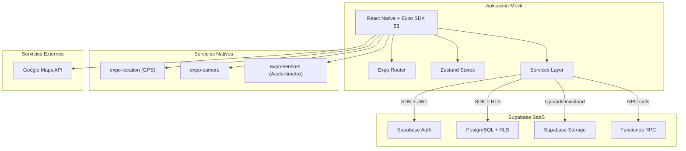
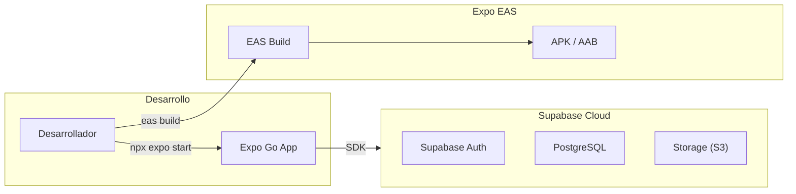
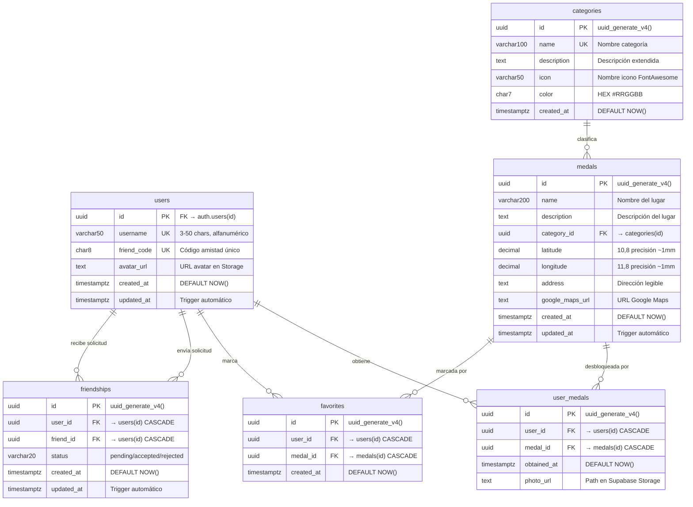

## Índice

0. [Ficha del proyecto](#0-ficha-del-proyecto)
1. [Descripción general del producto](#1-descripción-general-del-producto)
2. [Arquitectura del sistema](#2-arquitectura-del-sistema)
3. [Modelo de datos](#3-modelo-de-datos)
4. [Especificación de la API](#4-especificación-de-la-api)
5. [Historias de usuario](#5-historias-de-usuario)
6. [Tickets de trabajo](#6-tickets-de-trabajo)
7. [Pull requests](#7-pull-requests)

---

## 0. Ficha del proyecto

### **0.1. Tu nombre completo:**

Tomás Pérez Vellarino

### **0.2. Nombre del proyecto:**

Salmantour - Aplicación móvil ludificada para el descubrimiento de lugares de interés en entornos urbanos (Salamanca)

### **0.3. Descripción breve del proyecto:**

Salmantour es una aplicación móvil gamificada desarrollada con React Native y Expo que motiva a estudiantes universitarios y residentes a descubrir lugares de interés en Salamanca. El usuario explora un mapa interactivo con puntos de interés geolocalizados y, al acercarse físicamente a menos de 10 metros, puede capturar una foto del lugar para obtener una medalla virtual. La app incluye un sistema de progreso por categorías (Monumentos, Gastronomía, Deporte, Naturaleza, etc.), galería de fotos, favoritos, y un sistema social para conectar con amigos y comparar colecciones de medallas.

### **0.4. URL del proyecto:**

> La aplicación no está desplegada como web. Se distribuye como APK nativo para Android mediante **Expo EAS Build**. Se puede consultar un [vídeo demostrativo](https://drive.google.com/file/d/14n4RJ0RCcsMhkem92tHah8KjtjuAJvv6/view?usp=sharing) que muestra todas las funcionalidades de la aplicación.

### 0.5. URL o archivo comprimido del repositorio

> No comparto el código al tratarse de un proyecto académico (TFG) privado, pero detallo en este documento los aspectos más importantes de él, además de mostrar en el vídeo todas las funcionalidades principales.

---

## 1. Descripción general del producto

### **1.1. Objetivo:**

Salmantour nace para resolver un problema real: muchos estudiantes universitarios llegan a Salamanca y desconocen gran parte de la oferta cultural, gastronómica y de ocio de la ciudad. La propuesta de valor es convertir la exploración urbana en un juego coleccionable, incentivando al usuario a visitar lugares físicamente mediante un sistema de recompensas (medallas) y progresión visual.

**Para quién:** Principalmente estudiantes universitarios y nuevos residentes de Salamanca que desean descubrir la ciudad de forma interactiva.

**Qué valor aporta:**
- Gamifica la exploración urbana con un sistema de medallas geolocalizadas
- Crea un álbum fotográfico de recuerdos asociado a cada lugar visitado
- Fomenta la interacción social mediante un sistema de amigos y comparación de progreso
- Ofrece información contextual de cada punto de interés (dirección, categoría, descripción)

### **1.2. Características y funcionalidades principales:**

#### **Autenticación completa**
- Registro con email, contraseña y nombre de usuario único
- Verificación de correo electrónico con polling automático
- Login con persistencia de sesión entre reinicios
- Recuperación de contraseña vía email
- Generación automática de código de amistad único (8 caracteres)

#### **Mapa interactivo con geolocalización**
- Mapa de Google Maps con 40 puntos de interés reales de Salamanca
- Marcadores personalizados con colores e iconos por categoría (8 categorías)
- Geolocalización en tiempo real con tracking continuo
- Filtrado por categoría y búsqueda por nombre de lugar
- Feedback visual de proximidad: el borde del marcador cambia de color al acercarse

#### **Sistema de medallas por proximidad**
- Detección automática de proximidad (radio configurable, 10m por defecto)
- Algoritmo de Haversine para cálculo preciso de distancias GPS
- Desbloqueo de medalla al capturar foto dentro del radio de proximidad
- Celebración animada con confetti al obtener una medalla

#### **Cámara y captura fotográfica**
- Cámara integrada con expo-camera y detección de orientación (acelerómetro)
- Vista previa con opciones de confirmar o repetir foto
- Tres modos: medalla (desbloquear), retake (cambiar foto), perfil (avatar)
- Compresión automática y subida a Supabase Storage

#### **Progreso y galería**
- Pantalla de progreso con estadísticas globales y por categoría (barras animadas)
- Vista de colección con filtros (todas/obtenidas/bloqueadas) y ordenamiento
- Galería de fotos en grid con expansión a pantalla completa
- Marcado de medallas como favoritas (independiente del estado de obtención)

#### **Sistema social**
- Añadir amigos mediante código de amistad
- Gestión de solicitudes (enviar, aceptar, rechazar)
- Perfil de amigo con estadísticas y galería de medallas
- Comparación lado a lado con filtros (todas, solo amigo, solo yo, en común, bloqueadas)
- Filtrado por categoría en la vista de comparación

#### **Edición de perfil**
- Cambio de nombre de usuario con validación de unicidad
- Actualización de foto de perfil desde cámara o galería
- Visualización de estadísticas personales

### **1.3. Diseño y experiencia de usuario:**

La aplicación sigue un diseño **mobile-first** con un sistema de diseño consistente basado en Shopify Restyle y tokens de diseño centralizados (colores, tipografía, espaciado).

**Flujo principal del usuario:**
1. **Registro/Login** → Formularios con validación en tiempo real y feedback visual
2. **Mapa** (tab principal) → Mapa interactivo con marcadores por categoría, búsqueda y filtros
3. **Progreso** → Estadísticas globales y barras de progreso por categoría
4. **Galería** → Colección de medallas con filtros, búsqueda y grid de fotos
5. **Amigos** → Lista de amigos, solicitudes pendientes, búsqueda por código
6. **Perfil** → Datos del usuario, avatar, estadísticas, edición de perfil

Se puede consultar el [vídeo demostrativo](https://drive.google.com/file/d/14n4RJ0RCcsMhkem92tHah8KjtjuAJvv6/view?usp=sharing) que recorre todas las funcionalidades.

### **1.4. Instrucciones de instalación:**

#### Prerrequisitos

| Herramienta | Versión | Descarga |
|-------------|---------|----------|
| Node.js | v18.0.0+ | [nodejs.org](https://nodejs.org/) |
| Git | Cualquiera | [git-scm.com](https://git-scm.com/) |
| Expo Go | SDK 53 | [Android](https://play.google.com/store/apps/details?id=host.exp.exponent) / [iOS](https://apps.apple.com/app/expo-go/id982107779) |

#### 1. Clonar e instalar dependencias

```bash
git clone https://github.com/tomypv/salmantour.git
cd salmantour
npm run install:all
```

#### 2. Configurar variables de entorno

```bash
cd frontend
cp .env.example .env
```

Editar `frontend/.env` con las credenciales de Supabase:

```bash
EXPO_PUBLIC_SUPABASE_URL=https://tu-proyecto.supabase.co
EXPO_PUBLIC_SUPABASE_ANON_KEY=tu_anon_key
GOOGLE_MAPS_API_KEY=tu_api_key_de_google_maps
```

#### 3. Configurar Supabase

- Crear proyecto en [Supabase Dashboard](https://supabase.com/dashboard)
- Ejecutar las 6 migraciones SQL de `backend/supabase/migrations/` en orden
- Ejecutar los seeds de `backend/supabase/seed/` (categories.sql, medals.sql)

#### 4. Iniciar la aplicación

```bash
cd frontend
npx expo start
```

Escanear el código QR con Expo Go para ejecutar en dispositivo físico.

#### 5. Ejecutar tests

```bash
cd frontend
npm test
```

---

## 2. Arquitectura del Sistema

### **2.1. Diagrama de arquitectura:**



**Patrón arquitectónico: Arquitectura por Capas + BaaS**

La aplicación sigue una **arquitectura por capas** con Supabase como Backend as a Service:

1. **Capa de Presentación:** Pantallas y componentes React Native con Expo Router (file-based routing)
2. **Capa de Lógica de Negocio:** Hooks personalizados y Zustand stores para gestión de estado
3. **Capa de Datos:** Servicios que encapsulan el acceso a Supabase mediante su SDK
4. **Capa de Servicios Nativos:** Interacción con GPS, cámara y sensores del dispositivo

**Justificación:**
- **Supabase BaaS:** Elimina la necesidad de un servidor backend propio, proporcionando auth, base de datos PostgreSQL con RLS, storage y funciones RPC de forma integrada. Reduce drásticamente el tiempo de desarrollo.
- **React Native + Expo:** Desarrollo multiplataforma con acceso a APIs nativas (GPS, cámara, sensores) mediante un único codebase en TypeScript.
- **Zustand:** Gestión de estado global ligera y sin boilerplate, ideal para aplicaciones móviles donde el rendimiento es crítico.

**Beneficios:** Velocidad de desarrollo, seguridad integrada (RLS + JWT), escalabilidad del backend gestionada por Supabase, código tipado end-to-end.

**Trade-offs:** Dependencia de un proveedor BaaS específico, menor control sobre la lógica del servidor (compensado con funciones RPC), sin Edge Functions (toda la lógica servidor se resuelve con funciones SQL).

### **2.2. Descripción de componentes principales:**

#### **Frontend (React Native + Expo SDK 53)**
| Componente | Tecnología | Descripción |
|------------|-----------|-------------|
| Framework | React Native + Expo SDK 53 | Aplicación móvil nativa |
| Lenguaje | TypeScript (strict mode) | Tipado estático completo |
| Navegación | Expo Router (file-based) | Tabs + Stack + Modales |
| Estado global | Zustand | 5 stores: auth, location, medals, favorites, friends |
| Diseño | Shopify Restyle | Sistema de diseño con tokens centralizados |
| Mapas | react-native-maps (PROVIDER_GOOGLE) | Mapa interactivo con marcadores personalizados |
| Geolocalización | expo-location | Tracking GPS en tiempo real |
| Cámara | expo-camera + expo-sensors | Captura con detección de orientación |
| Tests | Jest + React Native Testing Library | 156 tests unitarios |

#### **Backend (Supabase)**
| Servicio | Uso en Salmantour |
|----------|------------------|
| Supabase Auth | Registro, login, verificación de email, recuperación de contraseña |
| PostgreSQL + RLS | 6 tablas con Row Level Security, 6 migraciones, seeds |
| Supabase Storage | 2 buckets (avatars, medal-photos) con políticas RLS |
| Funciones RPC | 6 funciones SQL con SECURITY DEFINER para bypass controlado de RLS |

### **2.3. Descripción de alto nivel del proyecto y estructura de ficheros**

El proyecto es un **monorepo** con workspaces npm, organizado en dos paquetes principales:

```
salmantour/
├── frontend/                    # React Native + Expo
│   ├── app/                    # Expo Router (file-based routing)
│   │   ├── (auth)/            # Login, Signup, Forgot Password, Verify Email
│   │   ├── (modals)/          # Camera, Edit Profile, Friend Profile, Comparison
│   │   └── (tabs)/            # Map, Progress, Gallery, Friends, Profile
│   ├── src/
│   │   ├── components/        # Componentes organizados por dominio
│   │   │   ├── base/         # Button, primitivos
│   │   │   ├── ui/           # CategoryFilter, FavoriteButton, StatusFilterRow...
│   │   │   ├── map/          # MapView, MapMarker, MedalSearch
│   │   │   ├── medals/       # MedalCard, MedalThumbnail, MedalUnlockModal
│   │   │   ├── camera/       # CameraView, CameraControls, PhotoPreview
│   │   │   ├── forms/        # InputField
│   │   │   └── social/       # FriendCard, ComparisonHeader, ComparisonCard...
│   │   ├── services/          # Servicios de acceso a datos
│   │   ├── store/             # Zustand stores (auth, medals, location, favorites, friends)
│   │   ├── hooks/             # Hooks personalizados (auth, data, location, camera)
│   │   ├── types/             # Tipos TypeScript (database, medal, friend, location)
│   │   ├── styles/            # Tema Shopify Restyle
│   │   ├── utils/             # Algoritmo de Haversine
│   │   └── config/            # Constantes, permisos, devConfig
│   └── __tests__/             # 156 tests unitarios (7 suites)
│
├── backend/                    # Supabase BaaS
│   ├── supabase/
│   │   ├── migrations/        # 6 migraciones SQL
│   │   └── seed/              # Datos de categorías y medallas
│   └── docs/                  # DATABASE.md, API.md, FUNCTION.md, DEPLOYMENT.md
│
├── docs/                       # Documentación general del proyecto
└── package.json                # Monorepo root con workspaces
```

**Patrón:** Arquitectura por capas con separación por dominio funcional. Los componentes se organizan por feature (map, medals, social, camera) y el acceso a datos se abstrae en servicios modulares.

### **2.4. Infraestructura y despliegue**



- **Desarrollo:** Se utiliza Expo Go conectado a Supabase Cloud. Hot reload permite verificación inmediata.
- **Backend:** Supabase Cloud gestiona la infraestructura del servidor (auth, DB, storage). Las migraciones SQL se ejecutan manualmente en el SQL Editor de Supabase Dashboard.
- **Build de producción:** Expo EAS Build genera APK/AAB nativos para Android. La configuración de build se define en `eas.json`.
- **No se requiere servidor propio:** Toda la lógica del servidor se resuelve con RLS policies, triggers y funciones RPC directamente en PostgreSQL.

### **2.5. Seguridad**

#### **Row Level Security (RLS)**
Todas las tablas tienen RLS activado con políticas granulares. Cada usuario solo puede leer y modificar sus propios datos:

```sql
-- Ejemplo: política de favoritos
CREATE POLICY "users_manage_own_favorites" ON favorites
FOR ALL USING (auth.uid() = user_id);
```

#### **Funciones RPC con SECURITY DEFINER**
Para operaciones que requieren acceder a datos de otros usuarios (como buscar por código de amistad), se usan funciones SQL con `SECURITY DEFINER` que ejecutan con permisos elevados de forma controlada:

```sql
CREATE FUNCTION find_user_by_friend_code(code TEXT)
RETURNS TABLE(id UUID, username TEXT, avatar_url TEXT)
SECURITY DEFINER AS $$ ... $$;
```

#### **Autenticación JWT**
Supabase Auth gestiona tokens JWT con renovación automática. Las sesiones persisten entre reinicios de la app.

#### **Políticas de Storage**
Los buckets de almacenamiento tienen políticas RLS: cada usuario solo puede subir, modificar y eliminar sus propias fotos. La lectura es pública para permitir visualizar fotos de amigos.

#### **Validación en cliente**
Validación extensiva de formularios con `AuthValidator` (email, contraseña, username) antes de enviar datos al servidor.

#### **Gestión de estado segura**
Al cerrar sesión, se limpian todos los stores con datos personales (amigos, favoritos, medallas obtenidas), evitando que el siguiente usuario acceda a datos del anterior en el mismo dispositivo.

### **2.6. Tests**

Salmantour implementa **156 tests unitarios** distribuidos en 7 suites, enfocados en lógica de negocio aislada de servicios externos:

| Suite | Tests | Qué valida |
|-------|-------|-----------|
| AuthValidator | ~50 | Validación de email, contraseña, username, formularios completos |
| authStore | ~25 | Estado de autenticación, setters, limpieza de sesión |
| medalsStore | ~20 | Cache de medallas, estados de carga, reinicio |
| locationStore | ~20 | Estado de ubicación, permisos, tracking |
| favoritesStore | ~20 | Estado de favoritos, toggle, limpieza |
| friendsStore | ~25 | Estado de amigos, solicitudes, limpieza |
| distanceCalculator | ~15 | Haversine, isWithinRadius, casos límite geográficos |

**Decisión de diseño:** No se mockean extensamente los servicios de Supabase porque los mocks complejos son frágiles y terminan probando el mock en sí, no la lógica real. Las funcionalidades acopladas a Supabase (auth, CRUD, storage) se validan mediante type checking estricto y testing manual en dispositivo.

---

## 3. Modelo de Datos

### **3.1. Diagrama del modelo de datos:**



### **3.2. Descripción de entidades principales:**

#### **users**
Extiende `auth.users` de Supabase con datos de perfil público. El `id` coincide con el UUID de `auth.users`. El `friend_code` se genera automáticamente con la función `generate_friend_code()` (8 caracteres alfanuméricos, excluye 0/O/1/I para evitar confusiones). `ON DELETE CASCADE` desde `auth.users`.

#### **categories**
Catálogo maestro de 8 tipos de lugares: Monumentos y Cultura, Bibliotecas, Gastronomía, Bares y Pubs, Discotecas, Deporte, Ocio Alternativo, Naturaleza. Cada categoría tiene un icono FontAwesome y un color HEX asignado. Tabla de solo lectura para usuarios regulares.

#### **medals**
40 puntos de interés geolocalizados reales de Salamanca. Coordenadas con 8 decimales (~1mm de precisión). Índice espacial en `(latitude, longitude)` para queries de proximidad. Cada medalla pertenece a una categoría.

#### **user_medals**
Registro de medallas completadas. Constraint `UNIQUE (user_id, medal_id)` evita duplicados. `photo_url` almacena la ruta en Supabase Storage (`{userId}/{medalId}/photo.jpg`). `ON DELETE CASCADE` en ambas FK.

#### **favorites**
Medallas marcadas como favoritas, independientemente de si están completadas. Permite el workflow "marcar favorito → planificar visita → completar". Constraint `UNIQUE (user_id, medal_id)`.

#### **friendships**
Relaciones de amistad bidireccionales. Modelo unidireccional en DB, bidireccional en lógica de negocio. Estados: `pending` → `accepted` / `rejected`. Constraint `no_self_friendship` impide que un usuario se añada a sí mismo. Query de amigos: `WHERE (user_id = X OR friend_id = X) AND status = 'accepted'`.

---

## 4. Especificación de la API

Salmantour utiliza Supabase como BaaS: la comunicación se realiza mediante el **SDK de Supabase** directamente desde el frontend, no a través de una API REST tradicional. La autorización se gestiona con Row Level Security (RLS) a nivel de base de datos. Para operaciones que requieren bypass de RLS, se utilizan **funciones RPC** invocadas con `supabase.rpc()`.

A continuación se documentan los 3 servicios principales en formato similar a OpenAPI:

### **Servicio 1: MedalService — Desbloqueo de medalla**

```yaml
Operation: unlockMedal
Module: frontend/src/services/database/MedalService.ts
Description: Registra una medalla como completada por el usuario

Parameters:
  - userId: string (UUID del usuario autenticado)
  - medalId: string (UUID de la medalla a desbloquear)

Returns: UserMedal { id, user_id, medal_id, obtained_at, photo_url }

Authorization: RLS policy — solo el propio usuario puede insertar en user_medals

Errors:
  - 409: Medalla ya obtenida (UNIQUE constraint violation)
  - 401: Usuario no autenticado
```

**Ejemplo de uso:**
```typescript
const result = await medalService.unlockMedal(userId, medalId);
// result.data = { id: "uuid", user_id: "uuid", medal_id: "uuid", obtained_at: "2025-01-15T...", photo_url: null }
```

### **Servicio 2: FriendService — Enviar solicitud de amistad**

```yaml
Operation: sendFriendRequest
Module: frontend/src/services/database/FriendService.ts
Description: Envía una solicitud de amistad a otro usuario

Parameters:
  - userId: string (UUID del usuario que envía)
  - targetId: string (UUID del usuario destino)

Returns: boolean (éxito/fallo)

Authorization: RLS policy — el usuario solo puede crear friendships donde user_id = auth.uid()

Pre-validation: Se valida el código de amistad vía RPC find_user_by_friend_code()

Errors:
  - 409: Solicitud ya existente (UNIQUE constraint)
  - 400: No se puede enviar solicitud a uno mismo (no_self_friendship constraint)
```

### **Servicio 3: Función RPC — find_user_by_friend_code**

```yaml
Operation: supabase.rpc('find_user_by_friend_code', { code: 'ABC12345' })
Module: backend/supabase/migrations/006_rpc_friend_functions.sql
Description: Busca un usuario por su código de amistad (bypass de RLS con SECURITY DEFINER)

Parameters:
  - code: text (código de amistad de 8 caracteres)

Returns: TABLE(id UUID, username TEXT, avatar_url TEXT) | null

Security: SECURITY DEFINER — ejecuta con permisos del owner, no del caller
```

**Ejemplo de uso:**
```typescript
const { data: user, error } = await supabase.rpc('find_user_by_friend_code', {
  code: 'ABC12345'
});
// user = { id: "uuid", username: "Tomypv", avatar_url: "https://..." }
```

---

## 5. Historias de Usuario

### **Historia de Usuario 1: US-001 — Registro de nueva cuenta**

**Como** residente nuevo en Salamanca  
**Quiero** crear una cuenta en la aplicación proporcionando un correo electrónico, contraseña y nombre de usuario  
**Para** poder empezar a descubrir lugares de la ciudad y registrar mi progreso

**Criterios de Aceptación:**

1. El formulario solicita: correo electrónico (formato válido), contraseña (mín. 6 caracteres, 1 número), nombre de usuario (3-20 chars, alfanumérico), confirmación de contraseña
2. Se valida unicidad de email y username en tiempo real
3. Se genera automáticamente un código de amistad único de 8 caracteres
4. El usuario recibe feedback visual inmediato sobre errores de validación
5. Tras registro exitoso, se redirige a pantalla de verificación de email
6. La sesión persiste entre reinicios de la aplicación

**Información Técnica:**
- **Prioridad:** Alta | **Estimación:** 5 SP | **Sprint:** 1
- **Dependencias:** Supabase Auth, trigger `handle_new_user()`, RPC `check_username_exists()`

---

### **Historia de Usuario 2: US-008 — Exploración de lugares en mapa**

**Como** usuario autenticado  
**Quiero** ver un mapa interactivo con todos los lugares de interés de Salamanca  
**Para** planificar qué lugares visitar y orientarme geográficamente

**Criterios de Aceptación:**

1. El mapa se centra en la ubicación actual del usuario (con permiso de geolocalización)
2. Se visualizan los 40 puntos de interés como marcadores con iconos y colores por categoría
3. Los marcadores se diferencian visualmente: gris (no visitado), dorado (obtenido), borde azul (cercano)
4. El usuario puede filtrar por las 8 categorías y buscar lugares por nombre
5. Al tocar un marcador, se muestra información detallada (nombre, categoría, descripción, dirección)
6. Existe un botón para centrar el mapa en la ubicación actual

**Información Técnica:**
- **Prioridad:** Alta | **Estimación:** 8 SP | **Sprint:** 2
- **Dependencias:** Google Maps API, expo-location, MedalService, seed data de medallas

---

### **Historia de Usuario 3: US-011 — Obtención de medalla por proximidad**

**Como** usuario que está físicamente cerca de un lugar de interés  
**Quiero** que se active automáticamente la opción de obtener la medalla cuando esté a menos de 10 metros  
**Para** documentar mi visita y añadir el logro a mi colección

**Criterios de Aceptación:**

1. El sistema monitorea continuamente la distancia entre el usuario y los puntos de interés
2. Cuando el usuario está a menos de 10 metros, el marcador cambia visualmente (borde azul)
3. Se habilita un botón "Capturar" en la tarjeta de información del lugar
4. Al tocar "Capturar", se abre la cámara para tomar foto del lugar
5. Tras confirmar la foto, se desbloquea la medalla con celebración animada (confetti)
6. El radio de proximidad es de 10 metros (configurable en `config/constants.ts`)
7. No se permite obtener la misma medalla dos veces (UNIQUE constraint)

**Información Técnica:**
- **Prioridad:** Alta | **Estimación:** 8 SP | **Sprint:** 3
- **Dependencias:** Algoritmo Haversine (`distanceCalculator.ts`), expo-location, expo-camera, MedalService, StorageService

---

## 6. Tickets de Trabajo

### **Ticket 1: Frontend — Módulo de cámara y flujo completo de captura de medallas**

| Campo | Valor |
|-------|-------|
| **ID** | TASK-057/058/062 |
| **Tipo** | Frontend |
| **Sprint** | Sprint 4 |
| **Estimación** | 7 Story Points (3 + 2 + 2) |
| **Prioridad** | Alta |
| **User Stories** | US-013, US-014 |

**Descripción:**  
Implementar el módulo de cámara real con vista previa, sistema de recaptura y el flujo completo de captura → compresión → subida a Supabase Storage → desbloqueo de medalla con celebración animada.

**Subtareas:**
1. Integrar componente `CameraView` de expo-camera con visor en tiempo real en `app/(modals)/camera.tsx`
2. Crear componente `CameraControls` con botón de captura, cambio de cámara (frontal/trasera) e indicador de flash
3. Implementar detección de orientación del dispositivo mediante `expo-sensors` (acelerómetro) para rotar la foto correctamente
4. Crear componente `PhotoPreview` con opciones "Usar esta foto" y "Capturar de nuevo" a pantalla completa
5. Conectar flujo de cámara con `ImageProcessor` (compresión a 1200px, JPEG 80%) y `StorageService` (subida a bucket `medal-photos`)
6. Llamar a `unlockMedal()` de `MedalService` tras subida exitosa para registrar la medalla con la URL de la foto
7. Mostrar celebración con confetti animado (`MedalUnlockModal`) solo tras confirmación de la BD
8. Gestionar tres modos de cámara: `medal` (desbloquear medalla), `retake` (cambiar foto existente), `profile` (actualizar avatar)

**Criterios de Aceptación:**
- La cámara muestra preview en tiempo real con controles funcionales
- La foto se previsualiza con opciones de confirmar o repetir
- El flujo completo (captura → compresión → subida → desbloqueo) funciona sin interrupciones
- La foto se sube comprimida al bucket correcto con la ruta `{userId}/{medalId}.jpg`
- El modal de celebración con confetti aparece solo tras éxito de la BD
- Los tres modos de cámara funcionan correctamente según el contexto de navegación
- Se muestra indicador de progreso durante la subida y se gestionan errores de conexión

**Archivos afectados:**  
`app/(modals)/camera.tsx`, `src/components/camera/CameraView.tsx`, `src/components/camera/CameraControls.tsx`, `src/components/camera/PhotoPreview.tsx`, `src/components/medals/MedalUnlockModal.tsx`

---

### **Ticket 2: Frontend — Pantalla de mapa interactivo con marcadores**

| Campo | Valor |
|-------|-------|
| **ID** | TASK-033/037 |
| **Tipo** | Frontend |
| **Sprint** | Sprint 2 |
| **Estimación** | 10 Story Points (5 + 5) |
| **Prioridad** | Alta |
| **User Stories** | US-008, US-009 |

**Descripción:**  
Implementar la pantalla principal del mapa con Google Maps, marcadores personalizados por categoría, tarjeta de información de lugar, filtro por categorías y búsqueda por nombre.

**Subtareas:**
1. Integrar `react-native-maps` con `PROVIDER_GOOGLE` en `app/(tabs)/map.tsx`
2. Crear componente `MapView` con región inicial centrada en Plaza Mayor (40.964997, -5.664068)
3. Crear componente `MapMarker` con marcadores circulares de 28px, colores e iconos por categoría
4. Implementar estados visuales de marcadores: `obtained` (dorado), `nearby` (borde azul), `locked` (gris)
5. Crear componente `PlaceInfoCard` como modal con información detallada del lugar
6. Crear componente `CategoryFilter` con chips horizontales scrollables para filtrar por categoría
7. Crear componente `MedalSearch` con búsqueda por nombre que centra el mapa en el resultado
8. Aplicar optimizaciones: `tracksViewChanges` dinámico (true→false tras 300ms), `React.memo`, `zIndex` por hash

**Criterios de Aceptación:**
- El mapa muestra los 40 marcadores con iconos y colores correctos por categoría
- Al tocar un marcador se abre PlaceInfoCard con nombre, categoría, descripción, dirección y estado
- El filtro por categoría muestra/oculta marcadores dinámicamente
- La búsqueda encuentra lugares por nombre y centra el mapa en el resultado
- El rendimiento es fluido en dispositivos de gama media

**Archivos afectados:**  
`app/(tabs)/map.tsx`, `src/components/map/MapView.tsx`, `src/components/map/MapMarker.tsx`, `src/components/map/MedalSearch.tsx`, `src/components/ui/CategoryFilter.tsx`

---

### **Ticket 3: Frontend — Pantalla de amigos con buscador y vista de comparación**

| Campo | Valor |
|-------|-------|
| **ID** | TASK-085/092 |
| **Tipo** | Frontend |
| **Sprint** | Sprint 6 |
| **Estimación** | 7 Story Points (4 + 3) |
| **Prioridad** | Alta |
| **User Stories** | US-021, US-022 |

**Descripción:**  
Desarrollar la pantalla principal de amigos con lista de contactos, buscador integrado por código de amistad, gestión de solicitudes pendientes, y la pantalla modal de comparación lado a lado del progreso de medallas entre el usuario y un amigo.

**Subtareas:**
1. Implementar pantalla `friends.tsx` con FlatList de amigos (componente `FriendCard` con avatar, nombre y estadísticas)
2. Crear componente `FriendSearchBar` desplegable con input prefijado `#`, validación de 8 caracteres y botón de envío
3. Implementar validaciones del buscador: código inválido, usuario no encontrado, código propio, ya son amigos, solicitud ya enviada
4. Crear sección de solicitudes pendientes con botones "Aceptar" y "Rechazar" y badge contador
5. Implementar pantalla modal `comparison.tsx` con header "Yo vs. [Nombre]" y fotos de perfil lado a lado (`ComparisonHeader`)
6. Crear barra de filtros con chips: Todas, Solo amigo, Solo yo, En común, Bloqueadas
7. Implementar `ComparisonCard` con indicadores visuales por estado: verde (ambos), naranja (solo amigo), azul (solo yo), gris (ninguno)
8. Añadir filtro por categoría en la comparación y botón "Ver en mapa" en cada medalla

**Criterios de Aceptación:**
- La lista de amigos se carga con pull-to-refresh y muestra estadísticas de cada amigo
- El buscador despliega con animación, valida el código y muestra mensajes de error/éxito claros
- Las solicitudes pendientes se aceptan/rechazan correctamente y el badge se actualiza
- La pantalla de comparación muestra las medallas de ambos usuarios con diferenciación visual clara
- Los filtros (todas/solo amigo/solo yo/en común/bloqueadas) y el filtro por categoría funcionan correctamente
- La navegación fluye: amigos → perfil amigo → comparación → ver en mapa
- Empty state informativo cuando el usuario no tiene amigos

**Archivos afectados:**  
`app/(tabs)/friends.tsx`, `app/(modals)/comparison.tsx`, `src/components/social/FriendCard.tsx`, `src/components/social/FriendSearchBar.tsx`, `src/components/social/ComparisonHeader.tsx`, `src/components/social/ComparisonCard.tsx`

---

## 7. Pull Requests

### **Pull Request 1: PR #56 — Vista de progreso y sistema de medallas**

| Campo | Valor |
|-------|-------|
| **Rama** | `feature/progress-view` → `main` |
| **PR** | #56 |
| **Sprint** | Sprint 3 |

**Descripción:**  
Implementación completa del sistema de progreso personal y detección de proximidad para desbloqueo de medallas.

**Cambios principales:**
- **Pantalla de progreso** (`app/(tabs)/progress.tsx`): Estadísticas globales (medallas obtenidas/total, porcentaje) y barras de progreso animadas por categoría
- **Hook `useMedals`**: Lógica de detección de proximidad con `useMemo`, cálculo de distancias con Haversine, lista reactiva de `nearbyMedals`
- **Componente `MedalCard`**: Card expandible con foto, estado, fecha de obtención y botón "Ver en mapa"
- **Componente `CategoryProgressBar`**: Barra visual de progreso por categoría con colores del tema
- **MedalService**: Funciones `getUserMedals()` y `getUserMedalStats()` para queries de medallas obtenidas
- **Integración con LocationStore**: Recálculo automático de proximidad cada 5 segundos

**Archivos modificados:** 15 archivos (8 nuevos, 7 modificados)

---

### **Pull Request 2: PR #70 — Módulo de cámara y captura fotográfica**

| Campo | Valor |
|-------|-------|
| **Rama** | `feature/camera-module` → `main` |
| **PR** | #70 |
| **Sprint** | Sprint 4 |

**Descripción:**  
Implementación del sistema completo de cámara para captura de fotos de medallas y avatares, incluyendo detección de orientación del dispositivo.

**Cambios principales:**
- **Sistema de cámara** (`app/(modals)/camera.tsx`): Vista modal con expo-camera, flash, cambio de cámara frontal/trasera
- **Hook `useCamera`**: Gestión de permisos, captura, flash, tipo de cámara y detección de orientación con acelerómetro
- **Componentes de cámara**: `CameraView`, `CameraControls` (controles que rotan según orientación), `PhotoPreview` (preview con aspect ratio correcto)
- **Detección de orientación**: `expo-sensors` (acelerómetro) detecta si la foto es portrait/landscape, compensando el bloqueo de rotación de la app
- **StorageService**: Upload de fotos a Supabase Storage con compresión automática vía `ImageProcessor`
- **MedalUnlockModal**: Modal de celebración con confetti animado al desbloquear medalla
- **Tres modos**: medalla (desbloquear), retake (cambiar foto), perfil (avatar)
- **Edición de perfil** (`app/(modals)/edit-profile.tsx`): Cambio de username y avatar

**Archivos modificados:** 20 archivos (12 nuevos, 8 modificados)

---

### **Pull Request 3: PR #101 — Sistema social completo**

| Campo | Valor |
|-------|-------|
| **Rama** | `feature/social` → `main` |
| **PR** | #101 |
| **Sprint** | Sprint 6 |

**Descripción:**  
Implementación del sistema social completo: conexión con amigos, perfiles, comparación de progreso y funciones RPC de base de datos.

**Cambios principales:**
- **Migración SQL**: Funciones RPC `find_user_by_friend_code()`, `get_user_profiles_by_ids()`, `get_pending_friend_requests()` con SECURITY DEFINER
- **FriendService**: 12 funciones para gestión completa de amistades (búsqueda, solicitudes, aceptar/rechazar, comparación)
- **FriendsStore**: Estado global Zustand con gestión de amigos y solicitudes, limpieza al cerrar sesión
- **Pantalla de amigos** (`app/(tabs)/friends.tsx`): Lista de amigos, solicitudes pendientes, barra de búsqueda por código
- **Perfil de amigo** (`app/(modals)/friend-profile.tsx`): Estadísticas, galería de medallas, botones de comparar y eliminar
- **Vista de comparación** (`app/(modals)/comparison.tsx`): Comparación lado a lado con filtros (todas, solo amigo, solo yo, en común, bloqueadas) y filtro por categoría
- **Componentes sociales**: `FriendCard`, `FriendRequestCard`, `FriendSearchBar`, `ComparisonHeader`, `ComparisonCard`, `ComparisonMedalDetail`
- **Gestión de estado**: Actualización automática de stores al aceptar/rechazar solicitudes, refresh de datos al navegar entre vistas

**Archivos modificados:** 45 archivos (15 nuevos, 20 modificados, 10 eliminados — limpieza de placeholders)
