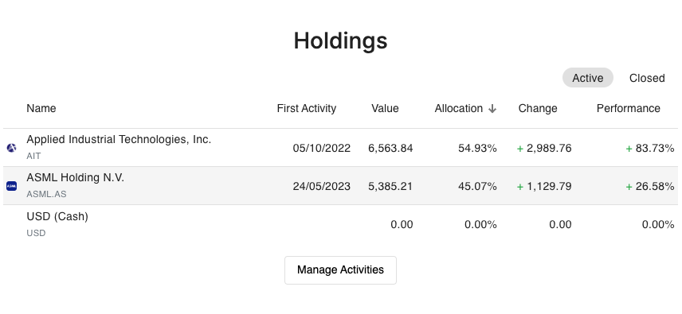
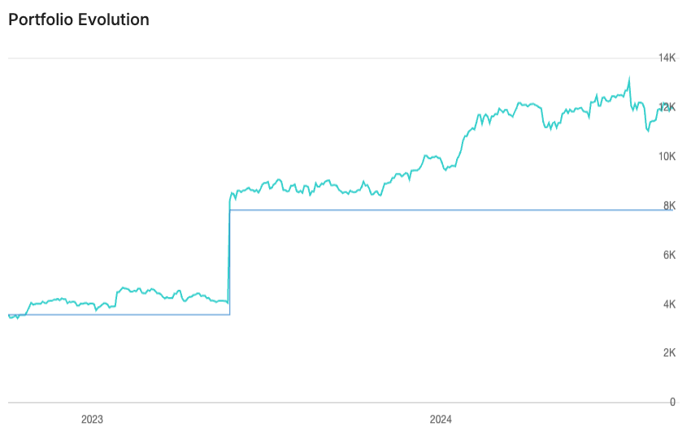
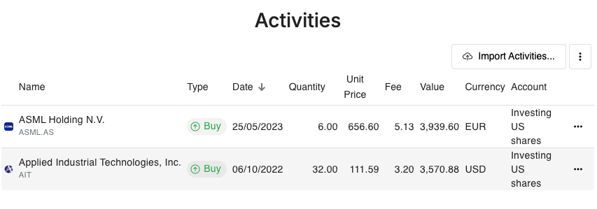

## Índice

0. [Ficha del proyecto](#0-ficha-del-proyecto)
1. [Descripción general del producto](#1-descripción-general-del-producto)
2. [Arquitectura del sistema](#2-arquitectura-del-sistema)
3. [Modelo de datos](#3-modelo-de-datos)
4. [Especificación de la API](#4-especificación-de-la-api)
5. [Historias de usuario](#5-historias-de-usuario)
6. [Tickets de trabajo](#6-tickets-de-trabajo)
7. [Pull requests](#7-pull-requests)

---

## 0. Ficha del proyecto

### **0.1. Tu nombre completo:**
Enrique Rochina Ramond

### **0.2. Nombre del proyecto:**
EasyPortfolio

### **0.3. Descripción breve del proyecto:**
EasyPortfolio es una aplicación que permite a los usuarios llevar el seguimiento de su patrimonio personal de manera sencilla y eficiente. 

Quiere ser capaz de mostrar la evolución del patrimonio a lo largo del tiempo, calculando para ello el valor de cada activo en el momento de mostrar las gráficas y obteniendo de fuentes públicas los datos de cotizacion de los activos como acciones y fondos de inversión.

### **0.4. URL del proyecto:**

WIP

### **0.5. URL o archivo comprimido del repositorio**

https://github.com/rochinae/AI4Devs-finalproject-private

---

## 1. Descripción general del producto

### **1.1. Objetivo:**
EasyPortfolio es una aplicación para llevar el seguimiento de tu patrimonio personal de manera sencilla y eficiente.
Intenta ser capaz de manejar cualquier tipo de patrimonio, desde acciones, fondos de inversión, criptomonedas, depósitos bancarios a plazo fijo, cuentas de ahorro, hasta bienes raices.

### **1.2. Características y funcionalidades principales:**
Tiene una página en la que ver la lista de todos los activos que se tienen, así como su valor actual y su valor inicial. Igualmente, se proporciona una gráfica que muestra la evolución del patrimonio a lo largo del tiempo.

Para el caso de activos con precios públicos (acciones, fondos de inversión, etc), se obtiene la cotización de los mismos de fuentes públicas como Yahoo Finance.

Otra funcionalidad será la de plasmar la lista de operaciones que se han realizado, junto con la fecha y el precio de la operación. Para el caso de operaciones de venta, se mostrará si ha habido plusvalía o minusvalía, y en cuánto.

También quiere ofrecer la capacidad de importar muchas operaciones de manera masiva, para no tener que introducir cada una de ellas manualmente.

### **1.3. Diseño y experiencia de usuario:**

#### Pantalla 1: Resumen de Activos

La pantalla muestra una lista de todos los activos en una tabla organizada. Cada fila de la tabla incluye el nombre del activo, su tipo (acciones, fondos, criptomonedas, etc.), el valor inicial y el valor actual. En una pantalla

#### Pantalla 2: Evolución global del patrimonio
Hay una gráfica lineal que muestra la evolución del valor total del patrimonio a lo largo del tiempo. La gráfica tiene un eje X con fechas y un eje Y con valores monetarios. La interfaz es limpia y moderna, con un diseño minimalista y colores que contrastan, como azul turquesa y blanco.

#### Pantalla 3: Historial de Operaciones

La pantalla muestra una tabla con el historial de operaciones realizadas. Cada fila muestra la fecha, tipo de operación (compra/venta), nombre del activo, cantidad, precio por unidad, y el resultado (plusvalía o minusvalía) con el monto. La tabla está organizada de manera cronológica, con filtros para buscar por fecha o tipo de operación. La parte superior tiene un encabezado con botones para "Importar Operaciones" y "Añadir Nueva Operación", ambos con íconos sencillos.

####Pantalla 4: Importación de Operaciones Masivas

Esta pantalla incluye un formulario simple para importar operaciones en masa. Tiene un área destacada para arrastrar y soltar archivos (por ejemplo, un CSV) o un botón para cargar archivos desde el dispositivo. Debajo del área de importación, hay una lista de los archivos recientemente cargados, con su estado de procesamiento (completado, en progreso, error). Al lado, hay un botón para iniciar la importación y otro para cancelar. La interfaz es clara y funcional, con indicaciones para guiar al usuario.

### **1.4. Instrucciones de instalación:**
WIP 

---

## 2. Arquitectura del Sistema

### **2.1. Diagrama de arquitectura:**
> Usa el formato que consideres más adecuado para representar los componentes principales de la aplicación y las tecnologías utilizadas. Explica si sigue algún patrón predefinido, justifica por qué se ha elegido esta arquitectura, y destaca los beneficios principales que aportan al proyecto y justifican su uso, así como sacrificios o déficits que implica.

### **2.2. Descripción de componentes principales:**

> Describe los componentes más importantes, incluyendo la tecnología utilizada

### **2.3. Descripción de alto nivel del proyecto y estructura de ficheros**

> Representa la estructura del proyecto y explica brevemente el propósito de las carpetas principales, así como si obedece a algún patrón o arquitectura específica.

### **2.4. Infraestructura y despliegue**

> Detalla la infraestructura del proyecto, incluyendo un diagrama en el formato que creas conveniente, y explica el proceso de despliegue que se sigue

### **2.5. Seguridad**

> Enumera y describe las prácticas de seguridad principales que se han implementado en el proyecto, añadiendo ejemplos si procede

### **2.6. Tests**

> Describe brevemente algunos de los tests realizados

---

## 3. Modelo de Datos

### **3.1. Diagrama del modelo de datos:**

> Recomendamos usar mermaid para el modelo de datos, y utilizar todos los parámetros que permite la sintaxis para dar el máximo detalle, por ejemplo las claves primarias y foráneas.

### **3.2. Descripción de entidades principales:**

> Recuerda incluir el máximo detalle de cada entidad, como el nombre y tipo de cada atributo, descripción breve si procede, claves primarias y foráneas, relaciones y tipo de relación, restricciones (unique, not null…), etc.

---

## 4. Especificación de la API

> Si tu backend se comunica a través de API, describe los endpoints principales (máximo 3) en formato OpenAPI. Opcionalmente puedes añadir un ejemplo de petición y de respuesta para mayor claridad

---

## 5. Historias de Usuario

> Documenta 3 de las historias de usuario principales utilizadas durante el desarrollo, teniendo en cuenta las buenas prácticas de producto al respecto.

**Historia de Usuario 1**

**Historia de Usuario 2**

**Historia de Usuario 3**

---

## 6. Tickets de Trabajo

> Documenta 3 de los tickets de trabajo principales del desarrollo, uno de backend, uno de frontend, y uno de bases de datos. Da todo el detalle requerido para desarrollar la tarea de inicio a fin teniendo en cuenta las buenas prácticas al respecto. 

**Ticket 1**

**Ticket 2**

**Ticket 3**

---

## 7. Pull Requests

> Documenta 3 de las Pull Requests realizadas durante la ejecución del proyecto

**Pull Request 1**

**Pull Request 2**

**Pull Request 3**

