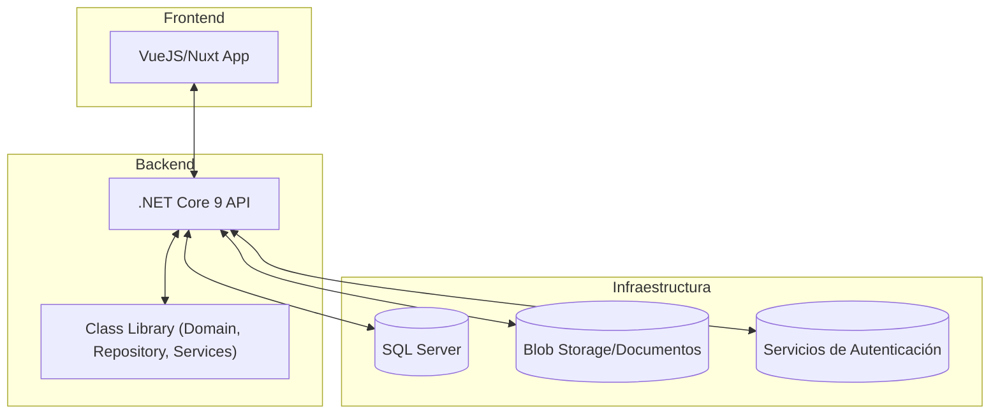
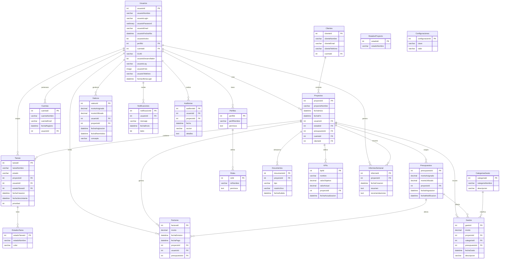

## Índice

0. [Ficha del proyecto](#0-ficha-del-proyecto)
1. [Descripción general del producto](#1-descripción-general-del-producto)
2. [Arquitectura del sistema](#2-arquitectura-del-sistema)
3. [Modelo de datos](#3-modelo-de-datos)
4. [Especificación de la API](#4-especificación-de-la-api)
5. [Historias de usuario](#5-historias-de-usuario)
6. [Tickets de trabajo](#6-tickets-de-trabajo)
7. [Pull requests](#7-pull-requests)

---

## 0. Ficha del proyecto

### **0.1. Tu nombre completo:**
Miguel Rico Rios

### **0.2. Nombre del proyecto:**
Sistema de Gestión Integral de Proyectos de Consultoría

### **0.3. Descripción breve del proyecto:**
Plataforma digital integral para la gestión del ciclo de vida de proyectos de consultoría, centralizando cronogramas, tareas, KPIs, informes y gestión financiera, optimizando la eficiencia, transparencia y control bajo la metodología "Hombro a Hombro".

### **0.4. URL del proyecto:**
- **Backend:** [https://rrdeveloper.sytes.net/consultoriaAPI](https://rrdeveloper.sytes.net/consultoriaAPI)
- **Frontend:** [https://rrdeveloper.sytes.net/consultoriamanagment](https://rrdeveloper.sytes.net/consultoriamanagment)

> Accesos disponibles bajo petición. Puedes contactar a [alvaro@lidr.co](mailto:alvaro@lidr.co) para más información.

### 0.5. URL o archivo comprimido del repositorio
[Por completar]

> Puedes tenerlo alojado en público o en privado, en cuyo caso deberás compartir los accesos de manera segura. Puedes enviarlos a [alvaro@lidr.co](mailto:alvaro@lidr.co) usando algún servicio como [onetimesecret](https://onetimesecret.com/). También puedes compartir por correo un archivo zip con el contenido


---

## 1. Descripción general del producto

### **1.1. Objetivo:**
Centralizar y digitalizar la gestión operativa y administrativa de los proyectos de consultoría, mejorando la visibilidad, eficiencia y colaboración entre consultores, gerentes y clientes, y facilitando el cumplimiento del retorno de inversión 3:1.

### **1.2. Características y funcionalidades principales:**
- **Gestión de Proyectos:** Cronogramas personalizables, visualización Gantt, hitos, dependencias, ruta crítica.
- **Gestión de Tareas (TODOs):** Asignación y seguimiento de tareas, recordatorios, vistas personalizadas.
- **Informes Semanales:** Generación automática de reportes consolidados, exportación y envío programado.
- **Panel de KPIs:** Configuración y seguimiento de indicadores clave, alertas y dashboards.
- **Gestión Documental:** Almacenamiento estructurado, control de versiones, permisos y búsqueda avanzada.
- **Gestión de Viáticos y Gastos:** Registro, aprobación y seguimiento, integración con control presupuestario.
- **Control Presupuestario:** Seguimiento financiero integral, reportes y alertas de desviaciones.
- **Seguridad:** Autenticación multifactor, encriptación, control de acceso basado en roles.
- **Integraciones:** API para sistemas externos, integración con ofimática y sistemas contables.

### **1.3. Diseño y experiencia de usuario:**
[Por completar: Puedes añadir diagramas, capturas de pantalla, wireframes o videotutoriales.]

### **1.4. Instrucciones de instalación:**
[Por completar: Detalla dependencias, comandos de instalación y ejecución para backend (.NET Core 9) y frontend (VueJS/Nuxt), configuración de base de datos, migraciones, etc.]

---

## 2. Arquitectura del Sistema

### **2.1. Diagrama de arquitectura:**



**Patrón:**  
Backend con arquitectura en capas y patrón Repository, separando lógica de negocio en librerías de clases reutilizables y una API RESTful.  
Frontend desacoplado, SPA con VueJS/Nuxt, consume la API.  
**Beneficios:**  
- Separación de responsabilidades y alta mantenibilidad.
- Escalabilidad y facilidad para pruebas.
- Integración sencilla de nuevos módulos o tecnologías.

**Sacrificios:**  
- Mayor complejidad inicial.
- Requiere gestión de autenticación y CORS entre frontend y backend.

### **2.2. Descripción de componentes principales:**

- **Frontend (VueJS/Nuxt):**  
  SPA responsiva, permite una experiencia fluida y moderna en escritorio y móvil.  
  Estructura basada en carpetas estándar de Nuxt (pages, components, store, assets).

- **Backend (.NET Core 9 MVC):**  
  - **API:** Expone endpoints RESTful para todas las operaciones.
  - **Librería de Clases:** Contiene entidades, repositorios (acceso a datos), servicios (lógica de negocio).
  - **Patrón Repository:** Facilita pruebas unitarias y desacopla acceso a datos.

- **Base de datos (SQL Server):**  
  Almacena información estructurada de proyectos, usuarios, tareas, KPIs, gastos, etc.

- **Almacenamiento de documentos (Blob Storage):**  
  Guarda archivos y documentos asociados a los proyectos.

- **Servicios de autenticación:**  
  Implementa autenticación multifactor y control de acceso basado en roles (RBAC).

### **2.3. Descripción de alto nivel del proyecto y estructura de ficheros**

#### Backend (.NET Core 9)

```
/src
  /Project.API           # Proyecto principal de la API
  /Project.Domain        # Entidades y modelos de dominio
  /Project.Repository    # Repositorios y acceso a datos
  /Project.Services      # Lógica de negocio y servicios
  /Project.Tests         # Pruebas unitarias e integración
```
- **API:** Controladores y configuración general.
- **Domain:** Entidades, modelos y DTOs.
- **Repository:** Implementación del patrón repository, acceso a SQL Server.
- **Services:** Lógica de negocio, validaciones, reglas.
- **Tests:** Pruebas automatizadas.

#### Frontend (VueJS/Nuxt)

```
/frontend
  /pages             # Vistas principales
  /components        # Componentes reutilizables
  /store             # Estado global (Vuex/Pinia)
  /assets            # Recursos estáticos
  /services          # Llamadas a la API
```

### **2.4. Infraestructura y despliegue**

- **Infraestructura:**  
  - Backend y frontend desplegados en contenedores Docker.
  - Base de datos SQL Server gestionada en la nube (Azure/AWS).
  - Almacenamiento de documentos en blob storage (Azure Blob, AWS S3).
  - Integración con servicios de autenticación (Azure AD, Auth0, etc).
  - CI/CD con GitHub Actions, Azure DevOps o similar.

- **Proceso de despliegue:**  
  1. Build y test de backend y frontend.
  2. Empaquetado en contenedores Docker.
  3. Despliegue automatizado en entorno cloud.
  4. Migraciones automáticas de base de datos.
  5. Monitoreo y alertas de disponibilidad.

### **2.5. Seguridad**

- Autenticación multifactor (MFA).
- Encriptación de datos sensibles en tránsito (HTTPS) y en reposo.
- Control de acceso basado en roles (RBAC).
- Políticas de contraseñas robustas.
- Auditoría y registro de operaciones clave.
- Cumplimiento con GDPR y LFPDPPP.
- Copias de seguridad automáticas y recuperación ante desastres.

### **2.6. Tests**

- **Backend:**  
  - Pruebas unitarias de servicios y repositorios.
  - Pruebas de integración de endpoints API.
  - Pruebas de validación de reglas de negocio.

- **Frontend:**  
  - Pruebas unitarias de componentes.
  - Pruebas de integración de vistas y flujos principales.
  - Pruebas end-to-end (E2E) con Cypress o similar.

---

## 3. Modelo de Datos

### **3.1. Diagrama del modelo de datos:**




### **3.2. Descripción de entidades principales:**

- **Proyecto**
  - Id (int, PK): Identificador único del proyecto
  - Nombre (string, not null): Nombre descriptivo del proyecto
  - FechaInicio (date, not null): Fecha de inicio del proyecto
  - FechaFin (date): Fecha estimada de finalización
  - Estado (string, not null): Estado actual (Planificación, En Progreso, Finalizado, etc.)
  - ClienteId (int, FK): Referencia al cliente asociado

- **Usuario**
  - Id (int, PK): Identificador único del usuario
  - Nombre (string, not null): Nombre completo del usuario
  - Email (string, unique, not null): Correo electrónico para acceso
  - PasswordHash (string, not null): Contraseña encriptada
  - Rol (string, not null): Rol en el sistema (Administrador, Consultor, Cliente, etc.)

- **Tarea**
  - Id (int, PK): Identificador único de la tarea
  - ProyectoId (int, FK, not null): Proyecto al que pertenece
  - UsuarioId (int, FK): Usuario asignado a la tarea
  - Descripcion (string, not null): Detalle de la tarea a realizar
  - Estado (string, not null): Estado actual (Pendiente, En Progreso, Completada, etc.)
  - FechaLimite (date): Fecha límite para completar la tarea

- **KPI**
  - Id (int, PK): Identificador único del KPI
  - ProyectoId (int, FK, not null): Proyecto al que pertenece
  - Nombre (string, not null): Nombre del indicador
  - ValorActual (decimal, not null): Valor actual del KPI
  - Objetivo (decimal, not null): Valor objetivo a alcanzar
  - Tendencia (string): Tendencia actual (Positiva, Negativa, Estable)

- **Gasto**
  - Id (int, PK): Identificador único del gasto
  - ProyectoId (int, FK, not null): Proyecto asociado
  - UsuarioId (int, FK, not null): Usuario que reportó el gasto
  - Categoria (string, not null): Tipo de gasto (Viático, Material, Servicio, etc.)
  - Monto (decimal, not null): Cantidad del gasto
  - Estado (string, not null): Estado de aprobación (Pendiente, Aprobado, Rechazado)
  - ComprobanteUrl (string): Enlace al comprobante digitalizado

- **Documento**
  - Id (int, PK): Identificador único del documento
  - ProyectoId (int, FK, not null): Proyecto al que pertenece
  - Nombre (string, not null): Nombre descriptivo del documento
  - Url (string, not null): Ubicación de almacenamiento
  - Version (int, not null): Control de versiones
  - Permisos (string): Configuración de acceso (Lectura, Escritura, etc.)

---

## 4. Especificación de la API

```yaml
paths:
  /api/proyectos:
    get:
      summary: Obtiene todos los proyectos con filtros opcionales
      parameters:
        - in: query
          name: estado
          schema:
            type: string
          description: Filtrar por estado del proyecto
        - in: query
          name: clienteId
          schema:
            type: integer
          description: Filtrar por cliente
      responses:
        '200':
          description: Lista de proyectos
          content:
            application/json:
              example:
                - id: 1
                  nombre: "Optimización de Procesos Industriales"
                  fechaInicio: "2025-01-15"
                  fechaFin: "2025-06-30"
                  estado: "En Progreso"
                  clienteId: 3
                - id: 2
                  nombre: "Transformación Digital RH"
                  fechaInicio: "2025-02-01"
                  fechaFin: "2025-05-15"
                  estado: "Planificación"
                  clienteId: 5
  
  /api/tareas:
    post:
      summary: Crea una nueva tarea
      requestBody:
        required: true
        content:
          application/json:
            schema:
              type: object
              required:
                - proyectoId
                - descripcion
                - estado
              properties:
                proyectoId:
                  type: integer
                usuarioId:
                  type: integer
                descripcion:
                  type: string
                estado:
                  type: string
                fechaLimite:
                  type: string
                  format: date
            example:
              proyectoId: 1
              usuarioId: 3
              descripcion: "Realizar análisis de procesos actuales"
              estado: "Pendiente"
              fechaLimite: "2025-02-28"
      responses:
        '201':
          description: Tarea creada
          content:
            application/json:
              example:
                id: 15
                proyectoId: 1
                usuarioId: 3
                descripcion: "Realizar análisis de procesos actuales"
                estado: "Pendiente"
                fechaLimite: "2025-02-28"
  
  /api/kpis/{id}:
    put:
      summary: Actualiza un KPI
      parameters:
        - in: path
          name: id
          required: true
          schema:
            type: integer
          description: ID del KPI a actualizar
      requestBody:
        required: true
        content:
          application/json:
            schema:
              type: object
              properties:
                valorActual:
                  type: number
                objetivo:
                  type: number
                tendencia:
                  type: string
            example:
              valorActual: 75.5
              objetivo: 90.0
              tendencia: "Positiva"
      responses:
        '200':
          description: KPI actualizado
          content:
            application/json:
              example:
                id: 8
                proyectoId: 1
                nombre: "Reducción de tiempos de proceso"
                valorActual: 75.5
                objetivo: 90.0
                tendencia: "Positiva"
```

---

## 5. Historias de Usuario

**Historia de Usuario 1**  
**Como:** Gerente de Proyecto  
**Quiero:** crear y personalizar cronogramas para proyectos  
**Para:** estructurar y adaptar los proyectos a las necesidades específicas del cliente  

**Criterios de aceptación:**
- Puedo crear un nuevo cronograma desde cero o a partir de plantillas predefinidas
- Puedo definir etapas, hitos y dependencias entre tareas
- Puedo visualizar el cronograma en formato Gantt con ruta crítica
- Puedo asignar recursos (consultores) a cada tarea
- Puedo establecer fechas de inicio y fin para cada tarea
- El sistema calcula automáticamente la duración total del proyecto
- Recibo alertas cuando hay conflictos de dependencias o recursos

**Historia de Usuario 2**  
**Como:** Consultor  
**Quiero:** ver y actualizar mis tareas y KPIs semanalmente  
**Para:** mantener el seguimiento y cumplir con los objetivos del proyecto  

**Criterios de aceptación:**
- Tengo un dashboard personalizado que muestra mis tareas pendientes ordenadas por prioridad
- Puedo marcar tareas como completadas y actualizar su porcentaje de avance
- Puedo registrar horas dedicadas a cada tarea
- Puedo actualizar los valores actuales de los KPIs asignados
- Recibo notificaciones de tareas próximas a vencer
- Puedo adjuntar documentos o evidencias a las tareas completadas
- Puedo filtrar mis tareas por proyecto, estado o fecha límite

**Historia de Usuario 3**  
**Como:** Cliente  
**Quiero:** acceder a cronogramas simplificados, KPIs y entregables  
**Para:** validar el avance y valor recibido en el proyecto  

**Criterios de aceptación:**
- Puedo ver una versión simplificada del cronograma con hitos principales
- Tengo acceso a un dashboard con los KPIs clave del proyecto
- Puedo visualizar tendencias y evolución de los KPIs en el tiempo
- Puedo acceder a los entregables aprobados y su historial de versiones
- Recibo notificaciones cuando hay nuevos entregables disponibles
- Puedo proporcionar retroalimentación directa sobre entregables
- Tengo acceso a informes semanales automáticos del avance del proyecto

---

## 6. Tickets de Trabajo

**Ticket 1 (Backend): Implementación de endpoint para gestión de cronogramas**

**Descripción:**  
Desarrollar los endpoints necesarios para la creación, consulta y actualización de cronogramas de proyecto, incluyendo validación de etapas, dependencias y cálculo de ruta crítica.

**Tareas:**
1. Crear modelos y DTOs para Cronograma, Etapa, Tarea y Dependencia
2. Implementar repositorios con patrón Repository para acceso a datos
3. Desarrollar servicio de validación de dependencias entre tareas
4. Implementar algoritmo de cálculo de ruta crítica
5. Crear controlador con endpoints REST:
   - GET /api/proyectos/{id}/cronograma
   - POST /api/proyectos/{id}/cronograma
   - PUT /api/proyectos/{id}/cronograma
   - GET /api/proyectos/{id}/cronograma/ruta-critica
6. Implementar pruebas unitarias para servicios y repositorios
7. Implementar pruebas de integración para endpoints

**Criterios de aceptación:**
- Todos los endpoints devuelven códigos HTTP apropiados (200, 201, 400, 404, etc.)
- Las validaciones rechazan cronogramas con dependencias circulares
- El cálculo de ruta crítica identifica correctamente las tareas críticas
- Las pruebas unitarias y de integración pasan con éxito
- La documentación Swagger está actualizada

**Estimación:** 3 días

**Ticket 2 (Frontend): Desarrollo de interfaz Kanban para gestión de tareas**

**Descripción:**  
Desarrollar la interfaz de gestión de tareas tipo Kanban, con vistas personalizadas por usuario, calendario y sistema de notificaciones.

**Tareas:**
1. Crear componente Vue para vista Kanban con columnas configurables (Pendiente, En Progreso, Completado, etc.)
2. Implementar funcionalidad drag-and-drop para mover tareas entre columnas
3. Desarrollar componente de detalle de tarea con formulario de edición
4. Crear vista de calendario con tareas asignadas
5. Implementar filtros por proyecto, estado, usuario asignado y fecha
6. Desarrollar sistema de notificaciones para tareas próximas a vencer
7. Integrar con endpoints de API para obtener y actualizar tareas
8. Implementar pruebas unitarias y E2E

**Criterios de aceptación:**
- La interfaz Kanban permite arrastrar y soltar tareas entre columnas
- Los cambios de estado se sincronizan correctamente con el backend
- El calendario muestra correctamente las tareas en sus fechas asignadas
- Los filtros funcionan correctamente y se pueden combinar
- Las notificaciones aparecen para tareas que vencen en los próximos 3 días
- La interfaz es responsiva y funciona en dispositivos móviles
- Todas las pruebas pasan con éxito

**Estimación:** 4 días

**Ticket 3 (Base de datos): Diseño e implementación del modelo relacional para gastos y viáticos**

**Descripción:**  
Diseñar e implementar el modelo relacional para gastos y viáticos, incluyendo restricciones, claves foráneas y triggers para auditoría.

**Tareas:**
1. Diseñar tablas para Gasto, CategoríaGasto, EstadoAprobacion y ComprobanteGasto
2. Implementar restricciones de integridad referencial y check constraints
3. Crear índices para optimizar consultas frecuentes
4. Desarrollar triggers para auditoría de cambios en aprobaciones
5. Implementar procedimientos almacenados para reportes comunes
6. Crear scripts de migración para Entity Framework
7. Desarrollar scripts de datos semilla para categorías y estados
8. Documentar el modelo y las restricciones implementadas

**Criterios de aceptación:**
- El modelo implementa correctamente todas las relaciones y restricciones
- Los triggers registran adecuadamente los cambios de estado en la tabla de auditoría
- Los procedimientos almacenados devuelven resultados correctos
- Las migraciones se ejecutan sin errores
- Los datos semilla se cargan correctamente
- La documentación es clara y completa

**Estimación:** 2 días

---

## 7. Pull Requests

**Pull Request 1: Integración del módulo de cronogramas y visualización Gantt**

**Descripción:**  
Este PR implementa el módulo completo de cronogramas de proyecto con visualización tipo Gantt, cálculo de ruta crítica y gestión de dependencias entre tareas.

**Cambios principales:**
- Nuevos modelos: Cronograma, Etapa, Tarea, Dependencia
- Implementación de repositorios y servicios para gestión de cronogramas
- Algoritmo de cálculo de ruta crítica
- Endpoints API para CRUD de cronogramas
- Componente Vue para visualización Gantt interactiva
- Pruebas unitarias y de integración

**Tickets relacionados:** #45, #46, #47

**Revisores:** @tech-lead, @frontend-dev

**Pull Request 2: Implementación del sistema de gestión de viáticos y gastos**

**Descripción:**  
Este PR implementa el sistema completo de gestión de viáticos y gastos, incluyendo registro, aprobación, seguimiento y reportes.

**Cambios principales:**
- Modelo de datos para Gasto, CategoríaGasto, EstadoAprobacion
- Implementación de triggers para auditoría
- Endpoints API para gestión de gastos y aprobaciones
- Interfaz de usuario para registro y seguimiento de gastos
- Sistema de notificaciones para aprobaciones pendientes
- Generación de reportes y exportación a Excel
- Pruebas unitarias y de integración

**Tickets relacionados:** #53, #54, #55

**Revisores:** @db-admin, @backend-dev

**Pull Request 3: Despliegue inicial de la arquitectura base**

**Descripción:**  
Este PR establece la arquitectura base del proyecto, incluyendo la estructura de carpetas, configuración de CI/CD, autenticación y control de acceso.

**Cambios principales:**
- Estructura de proyecto backend con patrón Repository
- Configuración de Entity Framework y migraciones iniciales
- Implementación de autenticación JWT y RBAC
- Estructura base de frontend con VueJS/Nuxt
- Configuración de Docker para desarrollo y producción
- Pipeline CI/CD con GitHub Actions
- Documentación de arquitectura y guía de desarrollo

**Tickets relacionados:** #1, #2, #3

**Revisores:** @architect, @devops-engineer

**Pull Request 3**

