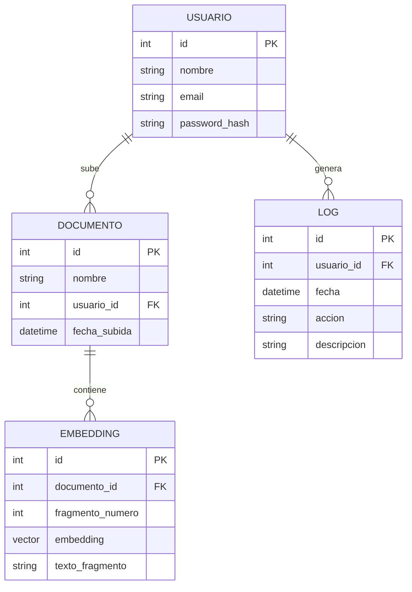

## Índice

0. [Ficha del proyecto](#0-ficha-del-proyecto)
1. [Descripción general del producto](#1-descripción-general-del-producto)
2. [Arquitectura del sistema](#2-arquitectura-del-sistema)
3. [Modelo de datos](#3-modelo-de-datos)
4. [Especificación de la API](#4-especificación-de-la-api)
5. [Historias de usuario](#5-historias-de-usuario)
6. [Tickets de trabajo](#6-tickets-de-trabajo)
7. [Pull requests](#7-pull-requests)

---

## 0. Ficha del proyecto

### **0.1. Tu nombre completo:**
Josue David Perez

### **0.2. Nombre del proyecto:**
CHATJDP

### **0.3. Descripción breve del proyecto:**
CHATJDP es una herramienta de chatbot on premise diseñada para analizar documentos Word confidenciales y permitir a los usuarios interactuar mediante una interfaz web desarrollada en Angular. El sistema utiliza modelos de lenguaje open-source (como Llama) y técnicas de RAG (Retrieval Augmented Generation) para responder preguntas sobre el contenido de los documentos subidos, facilitando el acceso rápido a la información y reduciendo el tiempo de aprendizaje de nuevos integrantes en equipos de trabajo.

### **0.4. URL del proyecto:**
https://github.com/Joshoperez/AI4Devs-finalproject


---

## 1. Descripción general del producto

> Describe en detalle los siguientes aspectos del producto:

### **1.1. Objetivo:**
El objetivo de CHATJDP es proporcionar una herramienta segura y eficiente que permita a los usuarios analizar y consultar documentos Word confidenciales mediante un chatbot inteligente, facilitando el acceso a la información clave y reduciendo el tiempo de aprendizaje de nuevos integrantes en equipos de trabajo, todo en un entorno on premise sin dependencia de servicios externos.

### **1.2. Características y funcionalidades principales:**
- Subida de documentos Word (.docx) a través de la interfaz web.
- Extracción automática y segura del contenido de los documentos.
- Procesamiento local de la información utilizando modelos de lenguaje open-source (Llama).
- Implementación de RAG (Retrieval Augmented Generation) para respuestas precisas basadas en el contenido del documento.
- Chatbot interactivo para realizar preguntas y obtener respuestas contextuales.
- Historial de preguntas y respuestas por sesión.
- Interfaz intuitiva y moderna desarrollada en Angular.
- Operación 100% on premise, garantizando la confidencialidad de los datos.

### **1.3. Diseño y experiencia de usuario:**
- Pantalla de inicio con opción para subir un documento Word.
- Visualización del nombre y estado del documento cargado.
- Área de chat donde el usuario puede escribir preguntas y recibir respuestas.
- Indicadores visuales de procesamiento y carga.
- Historial de conversación visible durante la sesión.
- Diseño responsive y accesible para distintos dispositivos.

### **1.4. Instrucciones de instalación:**
1. Clonar el repositorio del proyecto (URL pendiente).
2. Instalar dependencias del backend (Python):
   - Requiere Python 3.10+
   - Instalar dependencias: `pip install -r requirements.txt`
3. Instalar dependencias del frontend (Angular):
   - Requiere Node.js 18+ y Angular CLI
   - Instalar dependencias: `npm install`
4. Descargar y configurar el modelo Llama localmente (instrucciones detalladas en la documentación del backend).
5. Ejecutar el backend:
   - `python main.py` o el comando correspondiente según la estructura final.
6. Ejecutar el frontend:
   - `ng serve` desde la carpeta del frontend.
7. Acceder a la aplicación desde el navegador en la URL indicada (por defecto, `http://localhost:4200`).

---

## 2. Arquitectura del Sistema

### **2.1. Diagrama de arquitectura:**
```mermaid
flowchart TD
    A[Usuario] -->|Sube documento Word| B[Frontend Angular]
    B -->|Envía documento| C[Backend Python]
    C -->|Extrae texto| D[Procesador de Documentos]
    D -->|Genera embeddings| E[Motor de RAG (Llama + Vector DB)]
    E -->|Responde preguntas| C
    C -->|Envía respuesta| B
    B -->|Muestra respuesta| A
    subgraph Seguridad
        F[Autenticación local]
        G[Control de acceso]
        H[Logs de actividad]
    end
    B --> F
    C --> G
    C --> H
```
*El diagrama puede visualizarse y editarse en diagrams.net usando el formato mermaid.*

### **2.2. Descripción de componentes principales:**
- **Frontend Angular:** Interfaz web para carga de documentos y chat con el asistente.
- **Backend Python:** API para procesar documentos, gestionar sesiones y servir respuestas.
- **Procesador de Documentos:** Extrae y preprocesa el texto de archivos Word.
- **Motor de RAG:** Implementa embeddings y recuperación de contexto usando Llama y una base vectorial local.
- **Seguridad:** Autenticación local, control de acceso y registro de actividad.

### **2.3. Descripción de alto nivel del proyecto y estructura de ficheros**
- `/frontend`: Código fuente Angular.
- `/backend`: Código fuente Python, modelos y lógica de negocio.
- `/models`: Modelos de lenguaje y embeddings.
- `/docs`: Documentación y diagramas.

### **2.4. Infraestructura y despliegue**

```mermaid
flowchart TD
    subgraph Servidor Local
        A[Frontend Angular]
        B[Backend Python]
        C[Modelo Llama]
        D[Base Vectorial Local]
        E[Almacenamiento de Documentos]
    end
    F[Usuario en red interna] -->|Acceso web| A
    A -->|Solicitudes API| B
    B -->|Consulta| C
    B -->|Consulta| D
    B -->|Lee/Escribe| E
    C -->|Embeddings| D
    note right of Servidor Local: Todo el procesamiento y almacenamiento es local, sin acceso a internet.
```
*El diagrama puede visualizarse y editarse en diagrams.net usando el formato mermaid.*

- Despliegue on premise en servidor local.
- Requiere Python, Node.js y dependencias listadas en cada módulo.
- El modelo Llama y la base vectorial se alojan localmente.
- Se recomienda Docker para facilitar la instalación y el aislamiento de componentes.

### **2.5. Seguridad**
- Autenticación local de usuarios.
- Control de acceso a documentos y sesiones.
- Procesamiento y almacenamiento 100% local, sin salida a internet.
- Logs de actividad para auditoría.
- Pruebas de seguridad automatizadas en el backend.

### **2.6. Tests**
- Enfoque TDD (Test Driven Development) para el backend.
- Pruebas unitarias para procesamiento de documentos y API.
- Pruebas de integración para flujo completo (subida, consulta, respuesta).
- Pruebas end-to-end para la interfaz Angular.

---

## 3. Modelo de Datos

### **3.1. Diagrama del modelo de datos:**

*El diagrama puede visualizarse y editarse en diagrams.net usando el formato mermaid.*

### **3.2. Descripción de entidades principales:**
- **USUARIO**: Representa a los usuarios del sistema. Incluye identificador, nombre, email y hash de contraseña.
- **DOCUMENTO**: Almacena información sobre los documentos Word subidos, el usuario que lo subió y la fecha de carga.
- **EMBEDDING**: Guarda los vectores generados para cada fragmento de texto de un documento, junto con el texto original.
- **LOG**: Registra acciones relevantes realizadas por los usuarios para auditoría y seguridad.

---

## 4. Especificación de la API

A continuación se documentan los 3 endpoints principales del backend, siguiendo el formato OpenAPI y proporcionando ejemplos de petición y respuesta para cada uno.

### 1. Subir documento Word
**POST /api/documentos/upload**

**Descripción:** Permite al usuario subir un archivo Word para su análisis.

**Ejemplo de petición:**
```http
POST /api/documentos/upload HTTP/1.1
Content-Type: multipart/form-data
Authorization: Bearer <token>

file: documento.docx
```
**Ejemplo de respuesta:**
```json
{
  "documento_id": 123,
  "nombre": "documento.docx",
  "mensaje": "Documento subido y procesado exitosamente."
}
```

---

### 2. Realizar pregunta sobre un documento
**POST /api/chat/preguntar**

**Descripción:** Permite al usuario enviar una pregunta sobre el documento previamente subido y obtener una respuesta generada por el modelo.

**Ejemplo de petición:**
```http
POST /api/chat/preguntar HTTP/1.1
Content-Type: application/json
Authorization: Bearer <token>

{
  "documento_id": 123,
  "pregunta": "¿Cuál es el objetivo principal del documento?"
}
```
**Ejemplo de respuesta:**
```json
{
  "respuesta": "El objetivo principal del documento es..."
}
```

---

### 3. Obtener historial de preguntas y respuestas
**GET /api/chat/historial/{documento_id}**

**Descripción:** Devuelve el historial de preguntas y respuestas realizadas sobre un documento específico.

**Ejemplo de petición:**
```http
GET /api/chat/historial/123 HTTP/1.1
Authorization: Bearer <token>
```
**Ejemplo de respuesta:**
```json
[
  {
    "pregunta": "¿Cuál es el objetivo principal del documento?",
    "respuesta": "El objetivo principal del documento es...",
    "fecha": "2025-09-15T10:23:00Z"
  },
  {
    "pregunta": "¿Quién es el autor?",
    "respuesta": "El autor es...",
    "fecha": "2025-09-15T10:25:00Z"
  }
]
```

---

## 5. Historias de Usuario

**Historia de Usuario 1: Subida y análisis de documentos**
Como nuevo integrante del equipo,
quiero poder subir un documento Word confidencial a la plataforma
para que el sistema lo analice y lo prepare para consultas posteriores, garantizando la seguridad y privacidad de la información.

**Criterios de aceptación:**
- El usuario puede autenticarse en la plataforma.
- El usuario puede seleccionar y subir un archivo Word (.docx).
- El sistema confirma la subida y procesamiento exitoso del documento.
- El documento no sale del entorno local en ningún momento.

---

**Historia de Usuario 2: Consulta inteligente sobre documentos**
Como usuario autenticado,
quiero realizar preguntas en lenguaje natural sobre el contenido de un documento previamente subido
y recibir respuestas precisas y contextualizadas, para obtener información relevante de manera rápida y segura.

**Criterios de aceptación:**
- El usuario puede seleccionar un documento previamente subido.
- El usuario puede escribir preguntas en lenguaje natural.
- El sistema responde de forma precisa y contextualizada usando el modelo Llama y RAG.
- El historial de preguntas y respuestas es visible durante la sesión.

---

**Historia de Usuario 3: Seguridad y auditoría**
Como administrador del sistema,
quiero que todas las acciones relevantes (subida de documentos, consultas, accesos) queden registradas en logs de auditoría
para garantizar la trazabilidad y seguridad de la información manejada en la plataforma.

**Criterios de aceptación:**
- Todas las acciones de los usuarios quedan registradas en logs.
- Los logs incluyen usuario, acción, fecha y descripción.
- El acceso a los logs está restringido a administradores.

---

## 6. Tickets de Trabajo

**Ticket 1: Backend - Procesamiento y almacenamiento de documentos**
- Descripción: Implementar el endpoint para la subida de documentos Word, extracción de texto, generación de embeddings y almacenamiento seguro en la base vectorial local.
- Criterios de aceptación:
  - El endpoint recibe archivos .docx y valida el formato.
  - El texto es extraído y segmentado en fragmentos.
  - Se generan embeddings para cada fragmento usando el modelo Llama.
  - Los embeddings y metadatos se almacenan localmente.
  - El proceso es auditable y seguro.
- Definición de terminado:
  - Pruebas unitarias y de integración cubren los casos principales.
  - Documentación técnica actualizada.

---

**Ticket 2: Frontend - Interfaz de chat y carga de documentos**
- Descripción: Desarrollar la interfaz en Angular para autenticación, carga de documentos y chat interactivo con el asistente.
- Criterios de aceptación:
  - El usuario puede autenticarse y ver su sesión activa.
  - El usuario puede subir un documento y ver el estado de procesamiento.
  - El usuario puede interactuar con el chatbot y ver el historial de preguntas/respuestas.
  - La interfaz es responsive y accesible.
- Definición de terminado:
  - Pruebas end-to-end para los flujos principales.
  - Mockups y documentación de la UI.

---

**Ticket 3: Base de datos - Logs de auditoría y control de acceso**
- Descripción: Implementar el registro de logs de auditoría para todas las acciones relevantes y el control de acceso a los mismos.
- Criterios de aceptación:
  - Todas las acciones de usuarios quedan registradas con usuario, acción, fecha y descripción.
  - Solo los administradores pueden acceder a los logs.
  - Los logs pueden ser consultados y exportados por los administradores.
- Definición de terminado:
  - Pruebas unitarias para el registro y consulta de logs.
  - Documentación de la estructura de logs y permisos.

---

## 7. Pull Requests

**Pull Request 1: Documentación inicial del proyecto y definición de MVP**
- Descripción: Se agrega el archivo `readme.md` con la documentación completa del proyecto, incluyendo ficha del proyecto, descripción general, arquitectura, modelo de datos, especificación de la API, historias de usuario, tickets de trabajo y pull request inicial.
- Cambios principales:
  - Estructuración y llenado profesional de todas las secciones del `readme.md`.
  - Definición clara del MVP y alcance del proyecto.
  - Inclusión de diagramas mermaid para arquitectura e infraestructura.
- Revisor: (Por definir)
- Estado: Aprobado para integración a la rama principal.

