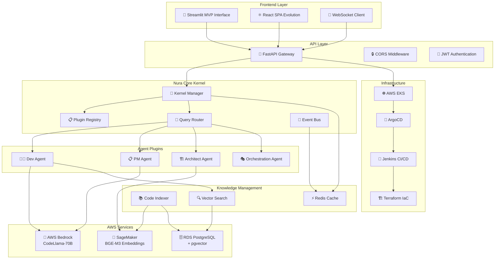
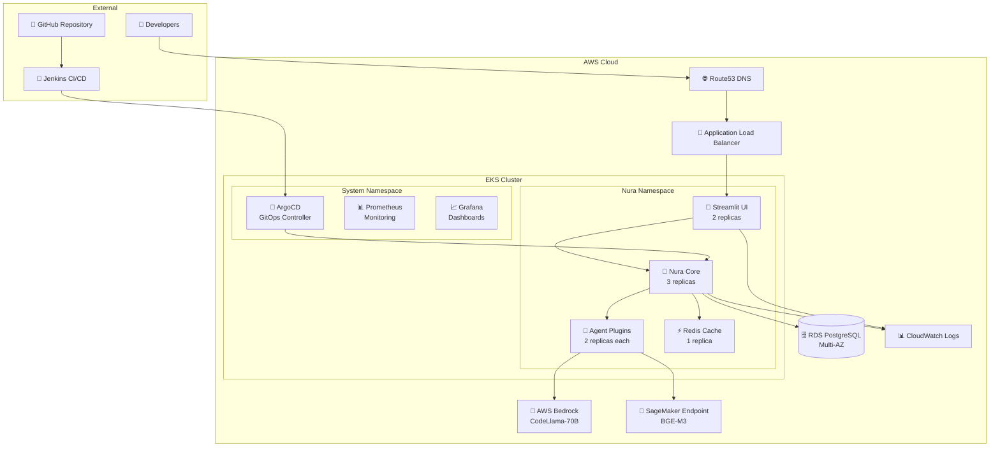
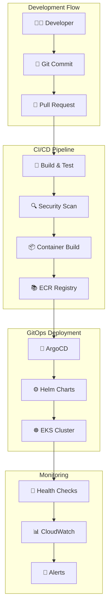
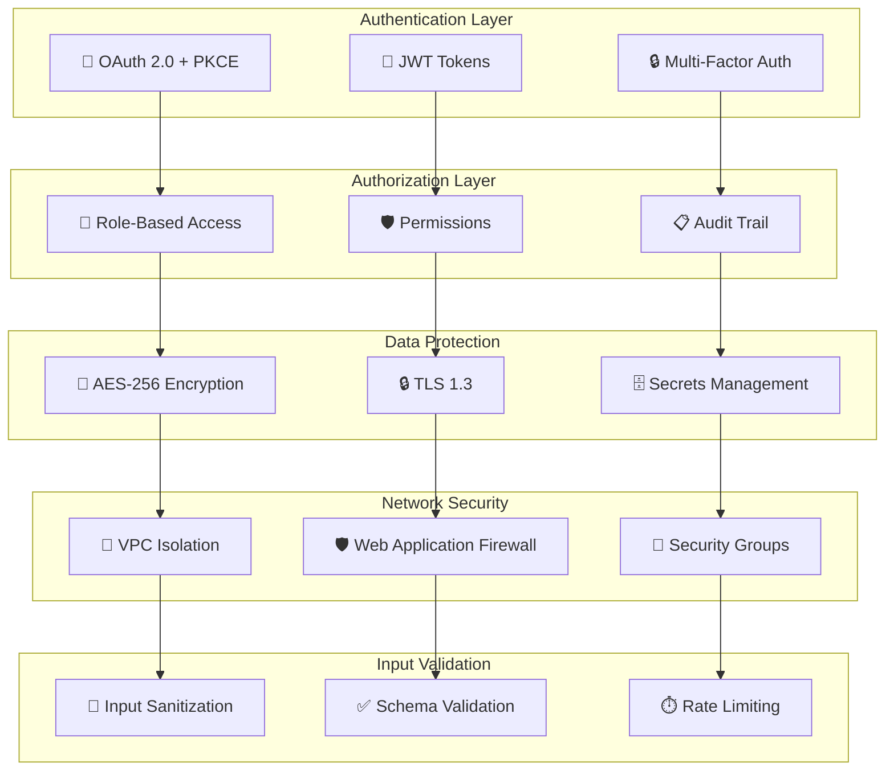
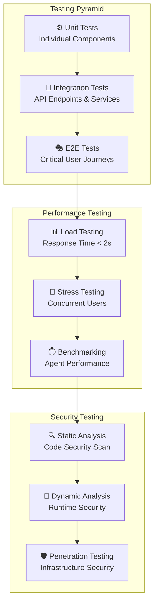
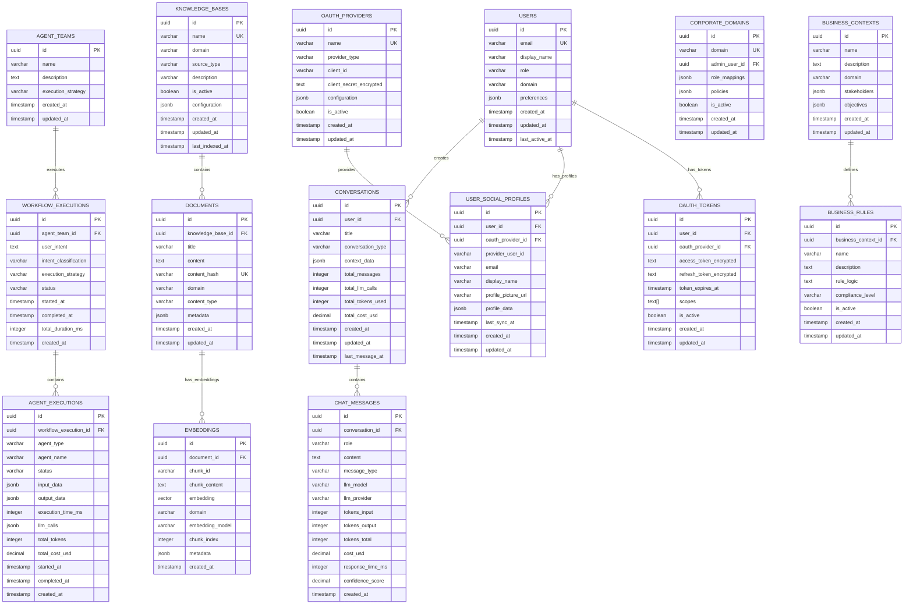
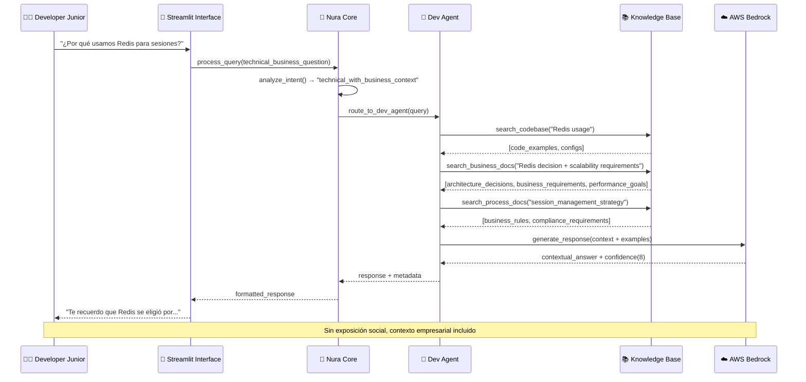
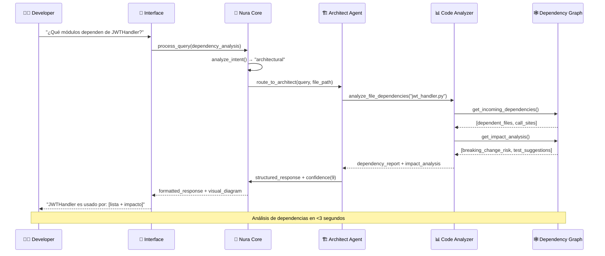
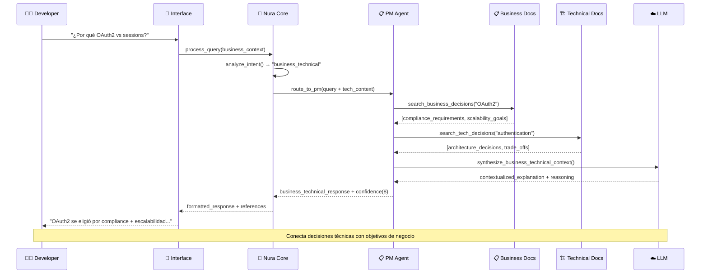
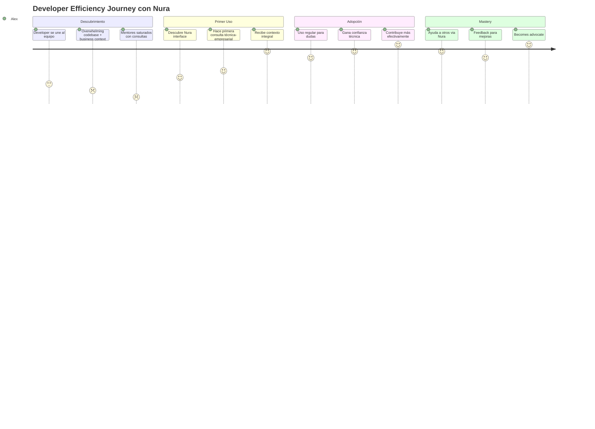

## Índice

0. [Ficha del proyecto](#0-ficha-del-proyecto)
1. [Descripción general del producto](#1-descripción-general-del-producto)
2. [Arquitectura del sistema](#2-arquitectura-del-sistema)
3. [Modelo de datos](#3-modelo-de-datos)
4. [Especificación de la API](#4-especificación-de-la-api)
5. [Historias de usuario](#5-historias-de-usuario)
6. [Tickets de trabajo](#6-tickets-de-trabajo)
7. [Pull requests](#7-pull-requests)

---

**📚 Referencias de Documentación Completa:**
- [📋 Product Requirements](./docs/prd/) - Especificaciones detalladas del producto
- [🏗️ Architecture Documentation](./docs/architecture/) - Documentación técnica completa
- [📝 User Stories](./docs/stories/) - Historias de usuario detalladas
- [🔧 Implementation Guides](./docs/) - Guías técnicas de implementación

---

## 0. Ficha del proyecto

### **0.1. Jairo Javier Polo Martínez:**
Ingeniero de Software y músico aficionado apasionado por la arquitectura, la solución creativa de problemas y el uso de buenas prácticas de desarrollo de Software.

### **0.2. Nombre del proyecto:**
🤖 **Nura - AI Developer Assistant**

### **0.3. Descripción breve del proyecto:**
Asistente de IA especializado que acelera la eficiencia operacional en equipos de ingeniería, resolviendo los retos de mentoría técnica y empresarial a escala. Proporciona respuestas contextuales sobre código, arquitectura, procesos de negocio e inteligencia empresarial, reduciendo el tiempo de ramp-up de desarrolladores en 50% y liberando tiempo de mentores senior para trabajo de alto valor estratégico.

### **0.4. URL del proyecto:**
🔗 **Fase de Documentación Completada** - Proyecto en fase de desarrollo  
📊 **Demo Streamlit MVP**: Planificado para Octubre 2025  
🚀 **Producción**: Q4 2025

### 0.5. URL o archivo comprimido del repositorio
📁 **Repositorio**: `AI4Devs-finalproject-JairoPolo`  
📋 **Estado Actual**: Documentación técnica completa y plan de implementación validado  
✅ **PO Checklist**: 100% aprobado para implementación


---

## 1. Descripción general del producto

### **1.1. Objetivo:**
🎯 **Acelerar la eficiencia operacional del área de ingeniería** optimizando los procesos de mentoría técnica, transferencia de conocimiento empresarial e inteligencia de negocio.

**Propósito del producto:**
- **Problema:** Desarrolladores requieren 2+ semanas para ser productivos debido a retos de mentoría a escala - los expertos técnicos y líderes de producto se quedan cortos ante la demanda de explicación de conceptos técnicos, procesos empresariales, decisiones de negocio y flujos de trabajo internos
- **Solución:** Asistente IA que democratiza el acceso al conocimiento técnico y empresarial, proporcionando mentoría integral escalable 24/7 que abarca desde arquitectura de código hasta inteligencia de negocio
- **Valor:** Reducción del 50% en tiempo de ramp-up (de 2 semanas a 1 semana productiva) + liberación de 60% del tiempo de mentores técnicos y líderes de producto para trabajo estratégico

**Audiencia objetivo:**
- 🥇 **Primaria:** Desarrolladores junior/mid-level en equipos de software
- 🥈 **Secundaria:** Equipos de ingeniería que buscan eficiencia en onboarding
- 🥉 **Terciaria:** Senior developers que actúan como mentores
- 🎯 **Cuaternaria:** Product Managers y Business Analysts que necesitan explicar contexto empresarial a equipos técnicos

### **1.2. Características y funcionalidades principales:**

#### 🤖 **Core MVP (Epic 1)**
- **Asistente contextual especializado:** Responde preguntas técnicas con contexto de negocio relevante
- **Chat interface minimalista:** Streamlit ultra-básico para validación rápida de hipótesis
- **Indexación de código:** Búsqueda semántica en codebase usando BGE-M3 embeddings
- **Single-agent proof:** Dev Agent especializado con CodeLlama-70B via AWS Bedrock

#### 🔄 **Multi-Agent Evolution (Epic 2-3)**
- **PM Agent:** Proporciona inteligencia de negocio y contexto empresarial detrás de decisiones técnicas, procesos internos y objetivos estratégicos
- **Architect Agent:** Análisis de dependencias y vistas estructurales
- **Orchestration Intelligence:** Routing automático al agente especializado apropiado
- **Confidence Scoring:** Nivel de confianza (1-10) en cada respuesta

#### 🚀 **Enterprise Features (Post-MVP)**
- **Confluence Integration:** Documentación empresarial indexada
- **Real-time sync:** Bitbucket + Confluence automático
- **Analytics Dashboard:** Métricas de adopción e independencia
- **Multi-tenancy:** Segregación completa por empresa

### **1.3. Diseño y experiencia de usuario:**

#### 🎨 **Filosofía de Diseño: "Conversation-First"**
- **Interaction Pattern:** Chat como interfaz principal (elimina friction de navegación)
- **Progressive Enhancement:** Streamlit MVP → React SPA evolution
- **Mobile-Responsive:** Acceso desde cualquier dispositivo
- **Zero Learning Curve:** Paradigma de conversación natural

#### 📱 **Flujo de Usuario Principal**
```
🏠 Landing → 💬 Query (Technical + Business) → 🤖 AI Processing → 📊 Enterprise Context Response
                                    ↓
                    💼 Business Intelligence + 🕐 History → 📊 Efficiency Metrics
```

#### 🖼️ **Mockup Interface (Streamlit MVP)**
```
┌─────────────────────────────────────────────┐
│ 🤖 Nura - Enterprise AI Assistant          │
├─────────────────────────────────────────────┤
│ Conversation History:                       │
│ [Usuario] ¿Por qué usamos JWT para auth?    │
│ [Enhanced PM Agent] JWT se eligió por       │
│ compliance + escalabilidad empresarial...   │
│                                             │
│ ┌─────────────────────────────────────────┐ │
│ │ Consulta sobre código, arquitectura,    │ │
│ │ procesos o inteligencia empresarial...  │ │
│ └─────────────────────────────────────────┘ │
│                 [Enviar 🚀]                 │
└─────────────────────────────────────────────┘
```

### **1.4. Instrucciones de instalación:**

#### 🛠️ **Prerrequisitos del Sistema**
```bash
# Versiones requeridas
Python 3.11+
Node.js 18+ (para React evolution)
Docker & Docker Compose
AWS CLI configurado
PostgreSQL 15+ con pgvector extension
```

#### ⚙️ **Setup Inicial (Desarrollo Local)**
```bash
# 1. Clonar repositorio
git clone https://github.com/username/nura-ai-assistant
cd nura-ai-assistant

# 2. Configurar backend
cd src/backend
python -m venv venv
source venv/bin/activate  # Windows: venv\Scripts\activate
pip install -r requirements.txt
pip install -r requirements-dev.txt

# 3. Variables de entorno
cp .env.example .env
# Configurar AWS credentials, database URLs

# 4. Base de datos
docker-compose up postgres -d
python manage.py migrate
python manage.py seed_data

# 5. Servicios AWS
# Configurar Bedrock access (CodeLlama-70B)
# Setup SageMaker endpoint (BGE-M3)
aws configure set region us-east-1

# 6. Ejecutar aplicación
cd src/frontend/streamlit
streamlit run app.py --server.port 8501

# Backend API en paralelo
cd ../../backend
uvicorn main:app --reload --port 8000
```

#### 🐳 **Deployment con Docker**
```bash
# Build & Run
docker-compose up --build

# Servicios disponibles
# Frontend: http://localhost:8501
# Backend API: http://localhost:8000
# Database: localhost:5432
```

#### ☁️ **Deployment AWS (Producción)**

Consultar guía completa de deployment en [🚀 Deployment Architecture](./docs/architecture/deployment-architecture.md)

---

## 2. Arquitectura del Sistema

### **2.1. Diagrama de arquitectura:**

#### 🏗️ **Patrón Arquitectónico: Microkernel + Clean Architecture**



#### 🎯 **Justificación Arquitectónica**

**✅ Beneficios:**
- **Escalabilidad Horizontal:** Plugin architecture permite agregar agentes sin modificar core
- **Separation of Concerns:** Clean Architecture con capas bien definidas
- **Technology Flexibility:** Frontend evolution sin afectar backend
- **Hot-Swapping:** Plugins pueden ser actualizados sin downtime
- **Event-Driven:** Comunicación asíncrona entre componentes

**⚠️ Sacrificios:**
- **Complejidad Inicial:** Overhead de setup vs monolito simple
- **Network Latency:** Comunicación entre servicios distribuidos
- **Debugging Complexity:** Trazabilidad a través de múltiples componentes

### **2.2. Descripción de componentes principales:**

#### 🧠 **Nura Core Kernel** 
- **Tecnología:** Python 3.11+ con FastAPI y asyncio
- **Responsabilidad:** Orchestración central, plugin management, query routing
- **Patrón:** Microkernel con dependency injection
- **Key Features:** Hot-swapping, event bus, health monitoring

#### 👨‍💻 **Dev Agent Plugin**
- **Tecnología:** Python con AWS Bedrock SDK
- **Modelo:** CodeLlama-70B para respuestas técnicas contextuales
- **Responsabilidad:** Preguntas de código, debugging, best practices
- **Integration:** Vector search en codebase indexado

#### 📋 **PM Agent Plugin**
- **Tecnología:** Python con Confluence API integration
- **Responsabilidad:** Contexto empresarial, business rules, product decisions
- **Knowledge Source:** Documentación Confluence indexada
- **Output:** "Por qué" detrás de decisiones técnicas

#### 🏗️ **Architect Agent Plugin**
- **Tecnología:** Python con análisis estático de código
- **Responsabilidad:** Dependency analysis, structural views, system design
- **Features:** Import graph analysis, package.json parsing, architecture insights

#### 🎨 **Frontend Layer**
- **MVP:** Streamlit (Python) - Ultra-rápido para validación
- **Evolution:** React SPA con TypeScript, Tailwind CSS, Zustand
- **Real-time:** WebSocket para live conversations
- **Responsive:** Mobile-first design approach

#### 🗄️ **Data Layer**
- **Primary:** PostgreSQL 15+ con pgvector extension
- **Caching:** Redis para session management y performance
- **Vector Storage:** Embeddings de código y documentación
- **Search:** Semantic search con BGE-M3 embeddings

### **2.3. Descripción de alto nivel del proyecto y estructura de ficheros**

#### 📁 **Estructura del Proyecto**
```
nura-ai-assistant/
├── 📚 docs/                          # Documentación técnica completa
│   ├── architecture/                 # Specs de arquitectura detalladas
│   ├── prd/                         # Product Requirements Document
│   └── stories/                     # User stories técnicas
├── 🔧 src/
│   ├── backend/                     # Backend services
│   │   ├── nura-core/              # Kernel principal
│   │   │   ├── src/core/           # Core kernel logic
│   │   │   ├── src/plugins/        # Plugin base classes
│   │   │   └── src/api/            # FastAPI endpoints
│   │   └── plugins/                # Agent plugins
│   │       ├── dev-agent/          # Developer assistant
│   │       ├── pm-agent/           # Product management
│   │       └── architect-agent/    # Architecture analysis
│   ├── frontend/                   # Frontend applications
│   │   ├── streamlit/             # MVP interface
│   │   └── react/                 # Evolution SPA
│   └── shared/                    # Common utilities
├── 🏗️ infrastructure/              # Infrastructure as Code
│   ├── terraform/                 # AWS resources
│   ├── kubernetes/               # K8s manifests
│   ├── argocd/                  # GitOps configuration
│   └── jenkins/                 # CI/CD pipelines
├── 🧪 tests/                      # Testing suite
│   ├── unit/                    # Unit tests
│   ├── integration/             # API integration tests
│   └── e2e/                     # End-to-end tests
└── 🐳 docker/                     # Container configurations
```

#### 🏛️ **Adherencia a Patrones**
- **Clean Architecture:** Dependency inversion, separation of concerns
- **Plugin Pattern:** Extensible agent system
- **Repository Pattern:** Data access abstraction
- **CQRS:** Separación de read/write operations para performance
- **Event Sourcing:** Para audit trail y debugging

### **2.4. Infraestructura y despliegue**

#### ☁️ **Diagrama de Infraestructura AWS**



#### 🚀 **Proceso de Despliegue**



**📋 Referencias:** [🚀 Deployment Architecture](./docs/architecture/deployment-architecture.md)

### **2.5. Seguridad**

#### 🔒 **Prácticas de Seguridad Implementadas**



**📋 Referencias:** [🔒 Security Architecture](./docs/architecture/security-architecture.md)

### **2.6. Tests**

#### 🧪 **Testing Strategy**



**📋 Referencias:** [🧪 Testing Strategy](./docs/architecture/testing-strategy.md)

---

## 3. Modelo de Datos

### **3.1. Diagrama del modelo de datos:**

#### 🗄️ **ERD Completo - Nura System Database Schema**



#### 📊 **Diccionario de Datos por Bounded Context**

| Entidad | Bounded Context | Descripción | Propósito Principal |
|---------|----------------|-------------|-------------------|
| **agent_teams** | Agent Orchestration | Equipos de agentes preconfigurados | Colaboración en workflows específicos |
| **workflow_executions** | Agent Orchestration | Ejecuciones de workflows completos | Tracking de intent analysis y performance |
| **agent_executions** | Agent Orchestration | Ejecuciones individuales de agentes | Tracking detallado de LLM calls y costos |
| **users** | User Interfaces | Usuarios del sistema con roles | Gestión de perfiles y preferencias |
| **conversations** | User Interfaces | Conversaciones unificadas | Tracking de usage y costos por sesión |
| **chat_messages** | User Interfaces | Mensajes individuales | Metadata completa de LLM interactions |
| **knowledge_bases** | Knowledge Management | Bases de conocimiento por dominio | Organización de fuentes de información |
| **documents** | Knowledge Management | Documentos indexados | Storage con clasificación automática |
| **embeddings** | Knowledge Management | Vector embeddings por dominio | Optimización de búsquedas semánticas |
| **oauth_providers** | Corporate Authentication | Proveedores OAuth configurados | Integración con sistemas corporativos |
| **corporate_domains** | Corporate Authentication | Dominios corporativos autorizados | Control de acceso empresarial |
| **user_social_profiles** | Corporate Authentication | Perfiles sociales vinculados | Sincronización automática de datos |
| **oauth_tokens** | Corporate Authentication | Tokens OAuth encriptados | Gestión de sesiones corporativas |
| **business_contexts** | Business Intelligence | Contextos de negocio | Mapping a componentes técnicos |
| **business_rules** | Business Intelligence | Reglas de negocio | Implementation mapping y compliance |

**📋 Referencias:** [🗄️ Database Schema](./docs/architecture/database-schema.md)

### **3.2. Descripción de entidades principales:**

#### 👤 **Users (Gestión de Usuarios)**
- **Propósito:** Autenticación y gestión de desarrolladores que usan Nura
- **Atributos clave:**
  - `id`: UUID primary key para identificación única
  - `email`: Identificador único para login (Google OAuth integration)
  - `role`: Control de acceso por roles (`developer`, `admin`, `pm`)
  - `profile_picture_url`: Integración con Google Workspace avatars
- **Restricciones:** Email único, name required, role con valores permitidos
- **Relaciones:** 1:N con Conversations, QueryAnalytics, UserSessions

#### 💬 **Conversations (Gestión de Conversaciones)**
- **Propósito:** Agrupa mensajes en contextos conversacionales para continuidad
- **Atributos clave:**
  - `conversation_type`: Categorización para analytics (`general`, `technical`, `architectural`)
  - `metadata`: JSON flexible para contexto adicional (proyecto activo, stack tecnológico)
  - `updated_at`: Auto-actualizado para ordenamiento por recencia
- **Relaciones:** N:1 con Users, 1:N con Messages
- **Business Logic:** Auto-creación en primer mensaje, auto-título basado en contenido

#### 📝 **Messages (Almacenamiento de Mensajes)**
- **Propósito:** Almacena intercambios usuario-asistente con metadatos detallados
- **Atributos clave:**
  - `role`: Diferencia entre `user`, `assistant`, `system` messages
  - `agent_type`: Tracking de qué agente procesó el mensaje (`dev`, `pm`, `architect`)
  - `llm_metadata`: JSON con modelo usado, tokens consumidos, costo, confidence score
  - `content`: Texto limitado a 10K caracteres para performance
- **Indexing:** Ordenado por conversation_id + created_at para queries eficientes
- **Relaciones:** N:1 con Conversations, 1:1 con QueryAnalytics

#### 📚 **CodeDocuments (Indexación de Código)**
- **Propósito:** Vector storage para búsqueda semántica en codebase
- **Atributos clave:**
  - `file_path`: Ruta única del archivo en el repositorio
  - `embedding`: Vector pgvector(1536) con embeddings BGE-M3
  - `file_type`: Clasificación para filtrado por lenguaje
  - `metadata`: JSON con info de repository, branch, commit_hash
- **Vector Search:** Índice IVFFLAT para queries de similaridad coseno
- **Sync Strategy:** Batch updates durante indexing, incremental para cambios

#### 📋 **BusinessDocuments (Documentación Empresarial)**
- **Propósito:** Knowledge base de documentación Confluence y business rules
- **Atributos clave:**
  - `source_type`: Origen del documento (`confluence`, `wiki`, `docs`)
  - `source_id`: ID externo para sync con sistemas source
  - `embedding`: Vector búsqueda semántica para contexto empresarial
  - `metadata`: Autor, tags, departamento para filtrado contextual
- **Integration:** Sync automático con Confluence API (Epic 2)
- **Search Strategy:** Híbrida (keyword + vector) para máxima relevancia

#### 📊 **QueryAnalytics (Métricas y Analytics)**
- **Propósito:** Tracking completo de performance, costo y satisfacción usuario
- **Atributos clave:**
  - `query_type`: Categorización automática del tipo de consulta
  - `confidence_score`: Score 1-10 del agente sobre su respuesta
  - `response_time_ms`: Performance tracking para SLA monitoring
  - `cost_usd`: Tracking de costo AWS por query para budget control
  - `user_satisfied`: Feedback opcional post-respuesta
- **Analytics Use Cases:**
  - Cost optimization por tipo de query
  - Performance monitoring por agente
  - User satisfaction trends
  - Agent effectiveness comparison

#### 🔐 **UserSessions (Autenticación y Sesiones)**
- **Propósito:** JWT session management con tracking de dispositivos
- **Atributos clave:**
  - `session_token`: Hash del JWT para revocación segura
  - `session_data`: JSON con device info para security monitoring
  - `expires_at`: Gestión automática de expiración de sesiones
  - `is_active`: Flag para logout manual y revocación batch
- **Security:** Cleanup automático de sesiones expiradas, session hijacking detection

#### ⚙️ **SystemConfig (Configuración del Sistema)**
- **Propósito:** Configuración dinámica sin redeploy (feature flags, limits)
- **Casos de uso:**
  - `aws_cost_limit_monthly`: $670 budget enforcement
  - `agent_response_timeout_ms`: 30000 timeout configuration
  - `indexing_batch_size`: 100 files per batch
  - `confidence_threshold_minimum`: 7 minimum confidence for responses
- **Flexibility:** JSON values para configuración compleja, hot-reload capability

---

## 4. Especificación de la API

### 🚪 **API Principal: Nura Core FastAPI**

#### **Endpoints Principales por Bounded Context**

| **Bounded Context** | **Endpoint** | **Método** | **Descripción** | **Autenticación** |
|---------------------|--------------|------------|-----------------|-------------------|
| **Authentication** | `/auth/oauth/authorize` | GET | Inicia flujo OAuth 2.0 con PKCE | No requerida |
| **Authentication** | `/auth/oauth/callback` | POST | Intercambia código por token | No requerida |
| **Authentication** | `/auth/refresh` | POST | Refresca token de acceso | No requerida |
| **User Management** | `/users/me` | GET | Obtiene perfil del usuario | Bearer/OAuth2 |
| **User Management** | `/users/me` | PUT | Actualiza perfil y preferencias | Bearer/OAuth2 |
| **Conversation Management** | `/conversations` | GET | Lista conversaciones con filtros | Bearer/OAuth2 |
| **Conversation Management** | `/conversations` | POST | Crea nueva conversación | Bearer/OAuth2 |
| **Conversation Management** | `/conversations/{id}` | GET | Obtiene detalles de conversación | Bearer/OAuth2 |
| **Message Handling** | `/conversations/{id}/messages` | GET | Obtiene historial de mensajes | Bearer/OAuth2 |
| **Chat Processing** | `/chat/message` | POST | Envía mensaje y obtiene respuesta | Bearer/OAuth2 |
| **Agent Orchestration** | `/orchestration/agents` | GET | Lista agentes disponibles | Bearer/OAuth2 |
| **Agent Orchestration** | `/orchestration/agent-status/{type}` | GET | Estado específico de agente | Bearer/OAuth2 |
| **Advanced RAG** | `/rag/search` | POST | Búsqueda con Late Chunking | Bearer/OAuth2 |
| **Advanced RAG** | `/rag/index/documents` | POST | Indexa documentos | Bearer/OAuth2 |
| **Analytics** | `/analytics/usage` | GET | Métricas de uso | Bearer/OAuth2 |
| **System Health** | `/health` | GET | Estado de salud del sistema | No requerida |
| **Webhooks** | `/webhooks/oauth` | POST | Notificaciones OAuth | API Key |

**📋 Referencias:** [📡 API Specifications](./docs/architecture/api-specifications.md)

---

## 5. Historias de Usuario

### 📋 **Historias de Usuario Principales del MVP**

#### **👨‍💻 Historia de Usuario 1 - Acceso Eficiente a Mentoría Técnica-Empresarial**

**Como** desarrollador junior que necesita contexto técnico y empresarial rápido  
**Quiero** poder consultar dudas sobre código, procesos y decisiones de negocio a un asistente IA especializado  
**Para que** pueda ser productivo sin sobrecargar a mentores senior y líderes de producto con consultas repetitivas

**🎯 Criterios de Aceptación:**
- ✅ Puedo hacer preguntas técnicas en lenguaje natural
- ✅ Recibo respuestas que incluyen contexto empresarial relevante
- ✅ Las respuestas incluyen ejemplos específicos del codebase
- ✅ El sistema indica nivel de confianza en la respuesta (1-10)
- ✅ No hay tracking público de mis preguntas (privacidad garantizada)

**📊 Métricas de Éxito:**
- **Engagement:** >5 consultas técnicas-empresariales por developer por semana
- **Satisfacción:** >85% de respuestas marcadas como útiles (técnicas + contexto de negocio)
- **Adopción:** 80% de junior/mid developers + 60% PMs usan la herramienta regularmente
- **Eficiencia:** 40% reducción en interrupciones a seniors + 35% reducción en consultas repetitivas a PMs
- **Business Intelligence:** 70% de consultas incluyen contexto empresarial exitoso

#### **🔄 Diagrama de Secuencia - Historia 1**



---

#### **🏗️ Historia de Usuario 2 - Análisis de Dependencias de Código**

**Como** developer que trabaja en features nuevos  
**Quiero** entender las dependencias e impactos de mis cambios en el sistema  
**Para que** pueda desarrollar con confianza sin romper funcionalidad existente

**🎯 Criterios de Aceptación:**
- ✅ Puedo preguntar sobre dependencias de archivos específicos
- ✅ Recibo análisis de impacto al modificar funciones/clases
- ✅ El sistema identifica otros módulos que usan mi código
- ✅ Obtengo sugerencias de testing basadas en dependencias
- ✅ Las respuestas incluyen diagramas o vistas estructurales básicas

**📊 Métricas de Éxito:**
- **Precisión:** 90% accuracy en identificación de dependencias
- **Coverage:** Análisis de >80% del codebase indexado
- **Tiempo:** Respuestas en <3 segundos para dependency queries
- **Prevención:** 40% reducción en bugs de integración

#### **🔄 Diagrama de Secuencia - Historia 2**



---

#### **📋 Historia de Usuario 3 - Integración de Inteligencia de Negocio y Contexto Técnico**

**Como** developer que necesita entender el contexto empresarial completo  
**Quiero** obtener inteligencia de negocio, procesos internos y rationale empresarial detrás de decisiones técnicas  
**Para que** pueda tomar decisiones informadas que alineen perfectamente soluciones técnicas con objetivos estratégicos de la empresa

**🎯 Criterios de Aceptación:**
- ✅ Puedo preguntar por qué se eligió una tecnología específica
- ✅ Recibo explicaciones que conectan decisiones técnicas con goals empresariales
- ✅ Las respuestas incluyen trade-offs considerados en la decisión
- ✅ El sistema referencia documentación de producto cuando relevante
- ✅ Aprendo sobre constraints de negocio que influyeron en la arquitectura

**📊 Métricas de Éxito:**
- **Business Intelligence Access:** 85% developers reportan acceso eficiente a inteligencia empresarial
- **Decision Quality:** 60% mejora en alineación técnica-negocio en nuevos features
- **Context Integration:** 90% de respuestas técnicas incluyen inteligencia de negocio relevante
- **Knowledge Scaling:** 70% reducción en consultas repetitivas a PMs + 50% faster onboarding empresarial
- **Strategic Impact:** 40% más decisiones técnicas informadas por objetivos estratégicos

#### **🔄 Diagrama de Secuencia - Historia 3**



**📋 Referencias:** [📝 User Stories](./docs/stories/) | [📋 PRD Stories](./docs/prd/)

### 🎭 **Personas y Journey Mapping**

#### **👨‍💻 Developer Junior - "Alex"**
- **Background:** 6 meses experiencia, CS degree, miedo al "síndrome impostor"
- **Pain Points:** Afraid to ask "basic" questions, overwhelmed by codebase size
- **Goals:** Learn quickly, contribute meaningfully, gain confidence
- **Journey:** Question → Private consultation → Contextualized answer → Applied learning

#### **👩‍💼 Developer Mid-level - "Maria"**
- **Background:** 3 años experiencia, changing teams, necesita contexto empresarial integral
- **Pain Points:** Skills técnicos sólidos, pero falta acceso eficiente a inteligencia de negocio y procesos internos
- **Goals:** Comprender rationale empresarial, acceder a knowledge base corporativa, tomar decisiones técnicas informadas por contexto de negocio
- **Journey:** Consulta técnica-empresarial → Inteligencia de negocio contextualizada → Decisiones informadas estratégicamente

#### **🏗️ Senior Developer - "Carlos"**
- **Background:** 8 años experiencia, architecture focus, mentoring load
- **Pain Points:** Too many interruptions, repetitive questions, knowledge bottleneck
- **Goals:** Reduce interruptions, scale knowledge transfer, focus on complex work
- **Journey:** Knowledge creation → AI captures context → Automated responses → More focus time

#### **👩‍💼 Product Manager - "Sofia"**
- **Background:** 5 años experiencia, lidera features cross-funcionales, bottleneck de comunicación técnica-negocio
- **Pain Points:** Demanda constante de explicar decisiones de producto, procesos de negocio y estrategia a equipos técnicos
- **Goals:** Escalar transferencia de conocimiento empresarial, reducir interrupciones, permitir auto-servicio de inteligencia de negocio
- **Journey:** Documenta conocimiento → Nura indexa inteligencia empresarial → Respuestas automatizadas → Más tiempo estratégico

### 🔄 **User Journey Flow**



---

## 6. Tickets de Trabajo

### 🎫 **Tickets de Trabajo del Epic 1 MVP**

#### **🔧 Ticket 1 - Implementar Dev Agent Plugin con AWS Bedrock**

**📋 Información General**
- **ID:** NURA-001  
- **Épica:** Epic 1 - MVP Vertical Slice  
- **Historia:** 👨‍💻 Historia 1 - Consulta Técnica sin Exposición Social  
- **Tipo:** Backend Feature  
- **Prioridad:** Alta  
- **Estimación:** 8 Story Points  
- **Asignado:** Backend Developer

**📝 Descripción**
Implementar el Dev Agent Plugin que se registra automáticamente con Nura Core y procesa preguntas técnicas usando CodeLlama-70B via AWS Bedrock, proporcionando respuestas contextuales con business context.

**🎯 Criterios de Aceptación**
- [ ] Dev Agent plugin se registra automáticamente con Nura Core
- [ ] Procesa preguntas sobre código usando CodeLlama-70B via AWS Bedrock
- [ ] Responde con contexto técnico + business context cuando relevante
- [ ] Implementa formato "Te recuerdo que..." para enseñanza sin condescendencia
- [ ] Maneja errores gracefully con fallback a respuesta genérica
- [ ] Incluye confidence scoring (1-10) en cada respuesta
- [ ] Response time < 5 segundos para queries básicas

**📋 Definición de Completado**
- [ ] Código implementado según especificaciones
- [ ] Tests unitarios >90% coverage
- [ ] Integration tests pasan
- [ ] Performance tests < 5s response time
- [ ] Code review aprobado
- [ ] Documentación actualizada
- [ ] Deployed en ambiente dev

---

#### **🎨 Ticket 2 - Crear Chat Interface Streamlit Ultra-Básico**

**📋 Información General**
- **ID:** NURA-002  
- **Épica:** Epic 1 - MVP Vertical Slice  
- **Historia:** 👨‍💻 Historia 1 - Consulta Técnica sin Exposición Social  
- **Tipo:** Frontend Feature  
- **Prioridad:** Alta  
- **Estimación:** 5 Story Points  
- **Asignado:** Frontend Developer

**📝 Descripción**
Crear una interfaz Streamlit minimalista que permita a developers hacer preguntas a Nura y recibir respuestas en formato conversacional, con indicadores de procesamiento y manejo básico de errores.

**🎯 Criterios de Aceptación**
- [ ] Streamlit app con input text + chat history display
- [ ] Submit button conecta a Nura Core API 
- [ ] Muestra respuestas del Dev Agent en formato conversational
- [ ] Incluye indicador visual de "processing" durante requests
- [ ] Error handling básico si Nura Core no responde
- [ ] Interface responsive para diferentes tamaños de pantalla
- [ ] Session state management para conversación persistente

**📋 Definición de Completado**
- [ ] Interface implementada según mockups
- [ ] Conexión funcional con backend API
- [ ] Tests unitarios y E2E pasando
- [ ] Responsive design validado
- [ ] Error handling probado
- [ ] Deployed en ambiente dev
- [ ] UX testing con 2-3 developers internos

---

#### **🗄️ Ticket 3 - Implementar Schema PostgreSQL + Vector Search**

**📋 Información General**
- **ID:** NURA-003  
- **Épica:** Epic 1 - MVP Vertical Slice  
- **Historia:** 🏗️ Historia 2 - Análisis de Dependencias de Código  
- **Tipo:** Infrastructure  
- **Prioridad:** Alta  
- **Estimación:** 8 Story Points  
- **Asignado:** DevOps + Backend Developer

**📝 Descripción**
Configurar base de datos PostgreSQL con extensión pgvector para almacenamiento de embeddings, implementar schema inicial y scripts de indexación para búsqueda semántica en codebase.

**🎯 Criterios de Aceptación**
- [ ] PostgreSQL 15+ configurado con pgvector extension
- [ ] Schema implementado según modelo de datos
- [ ] Scripts de migración e índices optimizados
- [ ] Sistema de indexación manual para archivos de código
- [ ] Vector search funcional con BGE-M3 embeddings
- [ ] Performance: búsquedas <100ms para top-5 resultados
- [ ] Capacidad para indexar >80% del codebase

**📋 Definición de Completado**
- [ ] PostgreSQL database configurado y accesible
- [ ] Schema migrado y validado
- [ ] Indexing scripts funcionando
- [ ] Vector search performance <100ms
- [ ] Codebase sample indexado exitosamente
- [ ] Backup y recovery procedures documentados
- [ ] Monitoring queries y alertas configuradas
- [ ] Integration tests pasando

**📋 Referencias:** [📝 Stories Documentation](./docs/stories/)

### 🔄 **Workflow de Tickets**

**📊 Sprint Planning Process:**
1. **Refinement:** PO + Tech Lead revisan tickets
2. **Estimation:** Team estima Story Points (Fibonacci)
3. **Dependencies:** Identificar blocking relationships
4. **Assignment:** Asignar según expertise y carga
5. **Definition of Ready:** Todos los ACs claros antes de sprint

**🚦 Estados de Tickets:**
- **📋 Backlog:** Ticket creado, pendiente refinement
- **🔄 In Progress:** Desarrollo activo
- **👀 Code Review:** Pending review approval
- **🧪 Testing:** QA validation en progreso
- **✅ Done:** Deployed y validado en dev
- **🚀 Released:** Deployed en production

---

## 7. Pull Requests

1. **2025-09-15:** [Pull Request](https://github.com/LIDR-academy/AI4Devs-finalproject/pull/59)

---
