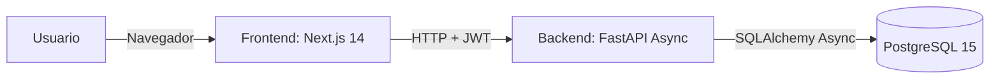
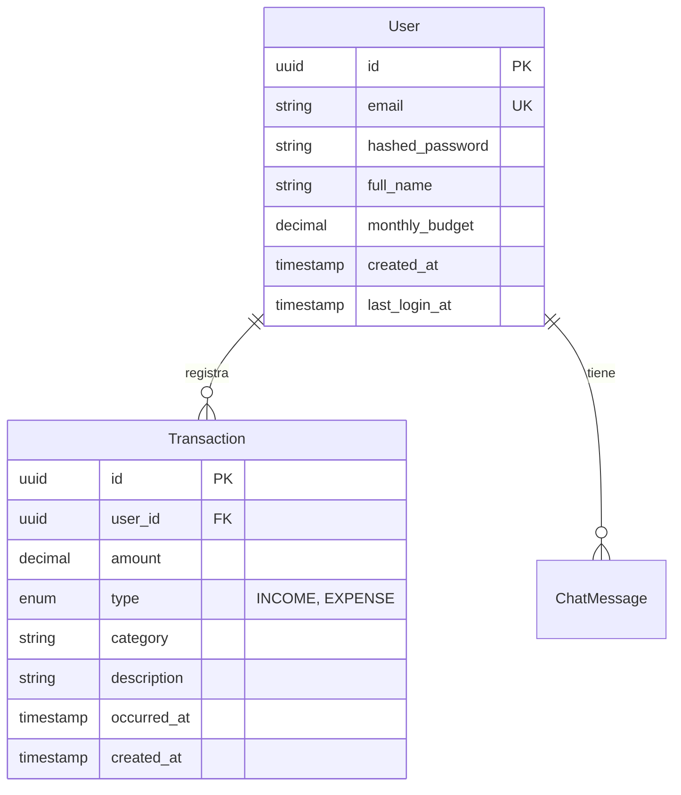

## Índice

0. [Ficha del proyecto](#0-ficha-del-proyecto)
1. [Descripción general del producto](#1-descripción-general-del-producto)
2. [Arquitectura del sistema](#2-arquitectura-del-sistema)
3. [Modelo de datos](#3-modelo-de-datos)
4. [Especificación de la API](#4-especificación-de-la-api)
5. [Historias de usuario](#5-historias-de-usuario)
6. [Tickets de trabajo](#6-tickets-de-trabajo)
7. [Pull requests](#7-pull-requests)

---

## 0. Ficha del proyecto

### **0.1. Tu nombre completo:**

Welington Jafer Cruz

### **0.2. Nombre del proyecto:**

Ze Finance (Zefa)

### **0.3. Descripción breve del proyecto:**

Ze Finance es un asistente de finanzas personales en formato MVP centrado en un **Walking Skeleton**: un flujo completo, minimal y de extremo a extremo que funciona en el navegador (Frontend → API → Base de datos). El nombre del sistema es **Ze Finance** y el asistente de chat con IA se llama **Zefa** (masculino). El proyecto proporciona una base sólida para futuras fases de integración con IA y WhatsApp.

### **0.4. URL del proyecto:**

> **Producción:**
> - Aplicación: https://ze-finance.vercel.app
>
> **Entorno de desarrollo local:**
> - Frontend: http://localhost:3000
> - Backend API: http://localhost:8000
> - Documentación API: http://localhost:8000/docs
> - Admin de base de datos (Adminer): http://localhost:8080

### 0.5. URL o archivo comprimido del repositorio

> Repositorio: https://github.com/welingtoncruz/ze-finance

---

## 1. Descripción general del producto

### **1.1. Objetivo:**

Ze Finance está diseñado para ayudar a las personas a gestionar sus finanzas personales a través de una aplicación web simple e intuitiva. El MVP se centra en establecer un flujo completo de extremo a extremo donde los usuarios pueden:

- Registrarse y autenticarse de forma segura
- Registrar transacciones de ingresos y gastos
- Ver un dashboard financiero con totales y desglose por categorías
- Gestionar el historial de transacciones

**Propuesta de valor:**
- Proporciona valor inmediato mediante un sistema funcional de seguimiento financiero
- Establece una base sólida (Walking Skeleton) antes de añadir funcionalidades complejas
- Permite futuras extensiones con IA e integración con WhatsApp
- Demuestra arquitectura limpia y buenas prácticas desde el primer día

**Usuarios objetivo:**
- Personas que desean registrarse, iniciar sesión, registrar transacciones básicas (ingresos/gastos) y ver un resumen financiero sencillo

### **1.2. Características y funcionalidades principales:**

#### **Autenticación**
- Registro de usuarios con email y contraseña
- Login con autenticación JWT
- Contraseñas hasheadas con BCrypt
- Logout accesible desde el drawer de cuenta en móvil
- Refresco automático del access token mediante refresh token en cookie HTTP-only

#### **Transacciones**
- Listar transacciones (del usuario autenticado)
- Crear transacción (ingreso/gasto) con selector de categoría tipo icon-grid
- Editar transacción (endpoint PATCH integrado con UI optimista y persistencia local)
- Eliminar transacción (solo las propias)
- Aislamiento de datos: cada usuario solo accede a sus transacciones

#### **Perfil y configuración**
- Obtener perfil de usuario (email, full_name, monthly_budget) vía `GET /user/profile`
- Actualizar perfil (parcial) vía `PATCH /user/profile`
- Página de configuración (`/settings`) para editar nombre y presupuesto mensual
- Datos de perfil cacheados en localStorage y sincronizados con el backend

#### **Dashboard**
- Totales resumidos (balance, ingresos, gastos)
- Desglose por categoría
- Actualización en tiempo real al añadir o eliminar transacciones

#### **Chat (agente IA)**
- Interfaz de chat interactiva con el asistente Zefa (IA)
- Conversaciones en tiempo real vía `POST /chat/messages`
- Consultas en lenguaje natural ("Qual meu saldo?")
- Function calling: get_balance, list_transactions, create_transaction, analyze_spending
- Persistencia de conversación con soporte de resúmenes
- UI optimista, Markdown GFM en respuestas, indicador de escritura
- Tarjetas de confirmación de transacciones
- Diseño responsive (móvil/tablet/desktop)

### **1.3. Diseño y experiencia de usuario:**

La aplicación sigue un diseño **responsive-first**, asegurando que la UI sea coherente en escritorio, tablet y móvil:

- **Móvil:** Layout de una columna, navegación inferior, áreas táctiles amplias
- **Tablet:** Dashboards de 2 columnas, filtros/paneles colapsables
- **Escritorio:** Dashboards multi-columna, sidebar persistente

**Sistema de diseño:**
- Tokens semánticos (variables CSS) para theming consistente
- Soporte de modo claro y oscuro
- Identidad fintech: audaz pero limpia ("confianza + claridad + energía")
- Componentes ShadcnUI sobre Radix UI
- Tailwind CSS para estilos

**Flujo de usuario (MVP):**
1. Registro → crear usuario → almacenar token
2. Login → iniciar sesión → almacenar token
3. Dashboard → mostrar resumen
4. Lista de transacciones → listar transacciones
5. Formulario crear transacción → crear → refrescar lista/resumen
6. Editar transacción → PATCH backend → refrescar lista/resumen
7. Eliminar transacción → refrescar lista/resumen
8. Configuración → actualizar perfil (nombre, presupuesto mensual)

### **1.4. Instrucciones de instalación:**

#### Prerrequisitos

- **Python 3.11+** (backend)
- **Node.js 18+** (frontend)
- **Docker Desktop + Docker Compose v2** (base de datos)

#### 1. Iniciar la base de datos con Docker

Desde la raíz del repositorio:

```bash
docker compose up -d db
```

Esto inicia PostgreSQL 15 en un contenedor Docker:
- **Puerto:** `5433`
- **Base de datos:** `zefa_db`
- **Usuario:** `postgres`
- **Contraseña:** `postgres_password`
- **Almacenamiento persistente:** datos en volumen Docker

**Opcional - Admin UI (Adminer):**
```bash
docker compose --profile tools up -d adminer
```
Acceso en http://localhost:8080 (mismas credenciales).

#### 2. Configurar el Backend

```bash
cd backend
cp .env.example .env
pip install -r requirements.txt
python -m uvicorn app.main:app --reload --host 0.0.0.0 --port 8000 --env-file .env
```

#### 3. Configurar el Frontend

```bash
cd frontend
cp .env.example .env.local
npm install
npm run dev
```

El frontend estará en http://localhost:3000 y la API en http://localhost:8000.

#### 4. Verificar la instalación

1. Base de datos: `docker compose ps`
2. API docs: http://localhost:8000/docs
3. Frontend: http://localhost:3000

#### Tests

**Backend:**
```bash
cd backend
pip install -r requirements.txt
python -m pytest -v
```

**Frontend:**
```bash
cd frontend
npm test
npx playwright test
```

---

## 2. Arquitectura del Sistema

### **2.1. Diagrama de arquitectura:**

El sistema sigue una **Arquitectura en Capas Simplificada**, evitando abstracciones prematuras y manteniendo una separación clara de responsabilidades.



**Patrón arquitectónico:**
- **Arquitectura en capas simplificada:** Presentación → Servicio/CRUD → Datos
- **Monolito modular:** Una unidad desplegable con límites claros entre módulos
- **Walking Skeleton First:** Conectividad end-to-end priorizada

**Justificación:**
- **FastAPI (Async):** Alto rendimiento, soporte async, documentación OpenAPI automática
- **Next.js 14 (App Router):** SSR, buena DX, optimizaciones integradas
- **PostgreSQL:** ACID, modelo relacional robusto
- **SQLAlchemy Async:** ORM tipado, no bloqueante

**Beneficios:** Velocidad de desarrollo, seguridad de tipos, base escalable para IA/WhatsApp.

**Trade-offs:** Sin microservicios (YAGNI), sin DDD puro (MVP).

### **2.2. Descripción de componentes principales:**

#### **Frontend (Next.js 14)**
- Framework: Next.js 14 con App Router
- Lenguaje: TypeScript 5+ (modo strict, sin `any`)
- Estilos: Tailwind CSS + ShadcnUI (Radix UI)
- Gráficos: Recharts
- Cliente HTTP: Axios vía `@/lib/api` (interceptores para auth)
- Estado: React Context (AuthContext) + estado local

#### **Backend (FastAPI)**
- Framework: FastAPI (Async)
- Validación: Pydantic V2
- ORM: SQLAlchemy 2.0 (Async)
- Driver: AsyncPG
- Servidor: Uvicorn
- Autenticación: JWT (python-jose) + BCrypt (passlib)

#### **Base de datos (PostgreSQL 15)**
- Despliegue: Docker Compose (desarrollo local)
- Claves UUID, foreign keys con cascade, índices en columnas frecuentes
- Decimal para montos monetarios

### **2.3. Descripción de alto nivel del proyecto y estructura de ficheros**

```
ze-finance/
├── backend/              # FastAPI
│   ├── app/
│   │   ├── main.py
│   │   ├── models.py
│   │   ├── schemas.py
│   │   ├── crud.py
│   │   ├── routers/      # auth, transactions, dashboard, user, chat
│   │   └── ...
│   └── tests/
├── frontend/             # Next.js
│   ├── app/              # App Router (login, register, dashboard, transactions, chat, settings)
│   ├── components/
│   ├── lib/              # api.ts, chat/service.ts, hooks/useChat.ts
│   └── context/          # AuthContext
├── ai-specs/
│   ├── specs/            # api-spec.yml, data-model.md
│   └── changes/          # Planes de implementación
├── .cursor/rules/        # Estándares del proyecto
├── docker-compose.yml
└── README.md
```

**Patrón:** Arquitectura limpia simplificada (Presentación → Aplicación → Datos).

### **2.4. Infraestructura y despliegue**

**Local:** Docker Compose (PostgreSQL 5433), Uvicorn (8000), Next.js (3000).

**Producción:**
- **Frontend:** Vercel (Next.js)
- **Backend:** GCP Cloud Run (FastAPI)
- **Base de datos:** Neon (PostgreSQL)
- **Secrets:** GCP Secret Manager

**CI/CD mínimo:** Backend (lint, pytest), Frontend (lint, build) en cada PR.

### **2.5. Seguridad**

- **Contraseñas:** BCrypt (passlib)
- **JWT:** Tokens con expiración, validación en rutas protegidas
- **Aislamiento:** Todas las consultas filtradas por `user_id`
- **Validación:** Pydantic en todas las entradas
- **CORS:** Configuración vía ALLOWED_ORIGINS
- **Refresh tokens:** HTTP-only cookies, revocación en logout

### **2.6. Tests**

- **Backend:** Pytest + pytest-asyncio, base SQLite en memoria, ~48 tests
- **Frontend:** Vitest (unit/integración), Playwright (E2E), ~86 tests
- **E2E mínimo:** Registrar → Login → Crear transacción → Verificar dashboard → Eliminar → Verificar

---

## 3. Modelo de Datos

### **3.1. Diagrama del modelo de datos:**



### **3.2. Descripción de entidades principales:**

#### **User**
- **id** (UUID, PK), **email** (string, UK), **hashed_password**, **full_name**, **monthly_budget**, **created_at**, **last_login_at**
- Relación: User 1:N Transaction

#### **Transaction**
- **id** (UUID, PK), **user_id** (FK → User), **amount** (Decimal, >0), **type** (INCOME/EXPENSE), **category**, **description**, **occurred_at**, **created_at**
- Índice compuesto: (user_id, occurred_at)
- Integridad referencial con cascade delete
- Precisión decimal para montos
- occurred_at = fecha de negocio; created_at = auditoría

---

## 4. Especificación de la API

### Endpoints principales (resumen)

| Método | Endpoint | Descripción |
|--------|----------|-------------|
| POST | /auth/register | Registrar usuario (público) |
| POST | /token | Login OAuth2 form (público) |
| POST | /auth/refresh | Refrescar token (cookie HTTP-only) |
| POST | /auth/logout | Cerrar sesión |
| GET | /transactions | Listar transacciones (protegido) |
| POST | /transactions | Crear transacción (protegido) |
| PATCH | /transactions/{id} | Actualizar transacción (protegido) |
| DELETE | /transactions/{id} | Eliminar transacción (protegido) |
| GET | /dashboard/summary | Resumen financiero (protegido) |
| GET | /user/profile | Obtener perfil (protegido) |
| PATCH | /user/profile | Actualizar perfil (protegido) |
| POST | /chat/messages | Enviar mensaje a Zefa (protegido) |

**Ejemplo POST /auth/register**

Request:
```json
{
  "email": "user@example.com",
  "password": "securepassword123"
}
```

Response (201):
```json
{
  "access_token": "eyJhbGciOiJIUzI1NiIsInR5cCI6IkpXVCJ9...",
  "token_type": "bearer"
}
```

**Ejemplo GET /dashboard/summary**

Response (200):
```json
{
  "total_balance": 500.0,
  "total_income": 2000.0,
  "total_expense": 1500.0,
  "by_category": [
    {"name": "Food", "value": 800.0},
    {"name": "Transport", "value": 400.0}
  ]
}
```

Especificación OpenAPI completa: `ai-specs/specs/api-spec.yml` y http://localhost:8000/docs

---

## 5. Historias de Usuario

### **Historia de Usuario 1: Registro y autenticación**

**Como** usuario  
**Quiero** registrarme e iniciar sesión en la aplicación  
**Para** acceder de forma segura a mis datos financieros personales

**Problema/Valor:** Los usuarios necesitan un acceso seguro a su información financiera. Registro y autenticación garantizan aislamiento de datos y seguridad.

**Alcance:** Registro con email y contraseña, login, JWT, BCrypt, expiración de tokens.

**Criterios de aceptación:** Registro con email válido y contraseña ≥8 caracteres; login devuelve JWT; credenciales inválidas → 401; email duplicado → 400; contraseñas nunca en claro; rutas protegidas requieren Bearer token.

**Fuera de alcance:** Reset de contraseña, verificación de email, OAuth, MFA.

---

### **Historia de Usuario 2: Gestión de transacciones**

**Como** usuario  
**Quiero** crear, listar y eliminar mis transacciones financieras  
**Para** hacer seguimiento de ingresos y gastos

**Problema/Valor:** Los usuarios necesitan registrar movimientos financieros para entender su situación. Crear, ver y eliminar transacciones es la funcionalidad central.

**Alcance:** Crear transacción (amount, type, category, descripción opcional, fecha), listar propias transacciones, eliminar propias transacciones, aislamiento de datos.

**Criterios de aceptación:** Crear con campos requeridos; listar con límite; eliminar por ID solo propias; orden por occurred_at; amount positivo; category requerida.

**Fuera de alcance (inicial):** Editar transacción (backend), recurrentes, adjuntos, bulk.

---

### **Historia de Usuario 3: Dashboard financiero**

**Como** usuario  
**Quiero** ver un resumen de mi situación financiera  
**Para** entender balance, ingresos, gastos y desglose por categoría

**Problema/Valor:** Los usuarios necesitan una visión general para tomar decisiones informadas.

**Alcance:** Balance total, total ingresos, total gastos, desglose por categoría, actualización en tiempo real.

**Criterios de aceptación:** Totales correctos; desglose por categoría; actualización al añadir/eliminar; solo datos del usuario autenticado; estado vacío manejado.

**Fuera de alcance:** Analytics avanzados, presupuestos, filtros por período, exportación.

---

## 6. Tickets de Trabajo

### **Ticket 1: Backend - Core Architecture (feat-1)**

**Módulo:** Backend

**Descripción:** Implementar la arquitectura backend core (FastAPI Async + SQLAlchemy Async + JWT) para el Walking Skeleton: Register → Login → Create/List/Delete Transactions → Dashboard Summary.

**Detalles técnicos:**
- Capa de datos: modelos User y Transaction, schemas Pydantic
- CRUD: auth, transactions, dashboard
- Rutas: POST /auth/register, POST /token, GET/POST/DELETE /transactions, GET /dashboard/summary
- Tests de integración

**Criterios de aceptación:** Endpoints según OpenAPI; BCrypt; JWT válidos; filtrado por user_id; tests de Walking Skeleton; type hints en todo el código.

---

### **Ticket 2: Frontend - Scaffolding e integración (feat-3)**

**Módulo:** Frontend

**Descripción:** Crear el scaffolding frontend (Next.js 14 App Router, TypeScript strict, Tailwind + ShadcnUI) e integrar los flujos con el backend.

**Detalles técnicos:**
- Rutas: login, register, dashboard, transactions, insights, chat, settings
- Componentes: layout, AuthForm, TransactionItem, DashboardScreen
- lib/api.ts (Axios + interceptores), AuthContext
- Layout responsive (móvil/tablet/desktop)

**Criterios de aceptación:** Uso de @/lib/api; token en AuthContext; layout responsive; TypeScript strict; flujos end-to-end integrados.

---

### **Ticket 3: Base de datos - Docker Compose (feat-2)**

**Módulo:** Infraestructura / Base de datos

**Descripción:** Configurar PostgreSQL 15 vía Docker Compose para desarrollo local.

**Detalles técnicos:**
- docker-compose.yml con servicio PostgreSQL (puerto 5433)
- Adminer opcional (profile tools)
- Volumen persistente
- backend/.env.example alineado con Compose

**Criterios de aceptación:** Docker Compose arranca PostgreSQL; backend conecta; /health → 200; pytest sin Docker (SQLite); documentación actualizada.

---

## 7. Pull Requests

### **Pull Request 1: Entrega 2 - Walking Skeleton Implementation**

**Rama:** `feature-entrega2-WJC`

**Resumen:** Entrega del Walking Skeleton end-to-end (Frontend → API → DB) con documentación y estándares.

**Cambios principales:**
- Backend: auth, transactions, dashboard, CRUD, tests de integración
- Infra: docker-compose PostgreSQL + Adminer
- Frontend: páginas, layout responsive, AuthContext, tests Vitest + Playwright
- Docs: README, TECHNICAL_DOCUMENTATION, prompts, rules

**Plan de verificación:** pytest, npm test, playwright test, docker compose up -d

---

### **Pull Request 2: Chat frontend integration (feat-9)**

**Resumen:** Integración del chat con el backend, reemplazando respuestas simuladas por llamadas reales.

**Cambios principales:**
- UI de chat integrada con POST /chat/messages
- useChat hook con persistencia en localStorage
- Optimistic UI, ChatBubble con Markdown GFM
- TypingIndicator, TransactionConfirmationCard
- lib/chat/service.ts como capa de normalización
- 27 tests nuevos (integración, useChat, service)

---

### **Pull Request 3: Zefa chatbot agent backend (feat-8)**

**Resumen:** Implementación del agente IA Zefa en el backend.

**Cambios principales:**
- Módulos app/chat/ y app/ai/
- Gateway provider-agnóstico (OpenAI/Anthropic)
- Tools: get_balance, list_transactions, create_transaction, analyze_spending
- Persistencia de mensajes y resúmenes de conversación
- Respuestas en pt-BR
- Tests test_chat_agent.py con respx

---

## Documentación adicional

- **Documentación técnica detallada:** `projeto/TECHNICAL_DOCUMENTATION.md`
- **Documentación del proyecto:** `projeto/PROJECT_DOCUMENTATION.md`
- **Prompts utilizados:** `projeto/PROMPTS.md` y `prompts.md`
- **Guía de desarrollo:** `projeto/ai-specs/specs/development_guide.md`
- **Especificación API (OpenAPI):** `projeto/ai-specs/specs/api-spec.yml`
- **Modelo de datos:** `projeto/ai-specs/specs/data-model.md`
