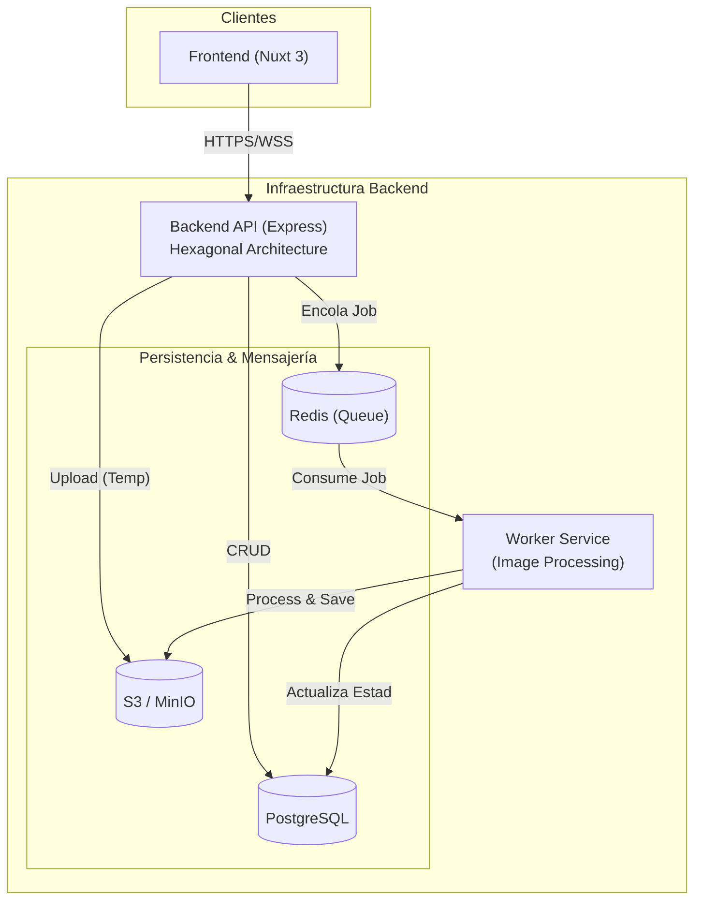
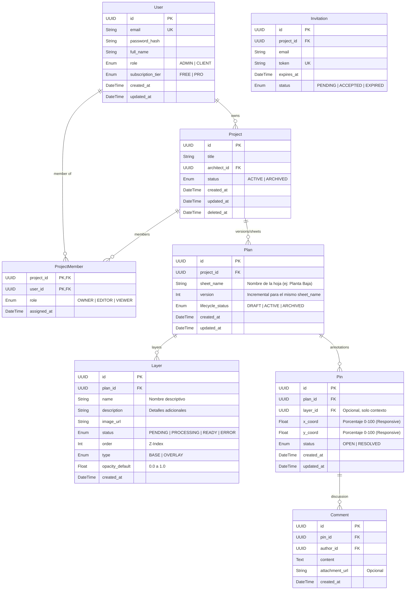

## Índice

0. [Ficha del proyecto](#0-ficha-del-proyecto)
1. [Descripción general del producto](#1-descripción-general-del-producto)
2. [Arquitectura del sistema](#2-arquitectura-del-sistema)
3. [Modelo de datos](#3-modelo-de-datos)
4. [Especificación de la API](#4-especificación-de-la-api)
5. [Historias de usuario](#5-historias-de-usuario)
6. [Tickets de trabajo](#6-tickets-de-trabajo)
7. [Pull requests](#7-pull-requests)

---

## 0. Ficha del proyecto

### **0.1. Tu nombre completo:** David Ferreras Garcia

### **0.2. Nombre del proyecto:** TRACÉ

### **0.3. Descripción breve del proyecto:**
Plataforma SaaS de colaboración visual para arquitectura e interiorismo. Centraliza la revisión de planos mediante superposición de imágenes, control de opacidad y comentarios contextuales ("Pin & Comment"), reemplazando el intercambio desordenado de correos y PDFs.

### **0.4. URL del proyecto:**

> Puede ser pública o privada, en cuyo caso deberás compartir los accesos de manera segura. Puedes enviarlos a [alvaro@lidr.co](mailto:alvaro@lidr.co) usando algún servicio como [onetimesecret](https://onetimesecret.com/).

### 0.5. URL o archivo comprimido del repositorio

> Puedes tenerlo alojado en público o en privado, en cuyo caso deberás compartir los accesos de manera segura. Puedes enviarlos a [alvaro@lidr.co](mailto:alvaro@lidr.co) usando algún servicio como [onetimesecret](https://onetimesecret.com/). También puedes compartir por correo un archivo zip con el contenido


---

## 1. Descripción general del producto

TRACÉ es una herramienta web diseñada para modernizar la comunicación entre arquitectos/interioristas y sus clientes durante la fase de diseño. Soluciona la fragmentación de feedback eliminando los hilos infinitos de correo y ofreciendo un entorno visual colaborativo.

### **1.1. Objetivo:**

Establecer una **"Fuente Única de Verdad"** para el proyecto de obra. Su propósito es mitigar errores de interpretación y agilizar la toma de decisiones al permitir que el feedback del cliente sea:
1.  **Contextual:** Situado exactamente sobre el punto del conflicto en el plano.
2.  **Ordenado:** Centralizado en una plataforma y no disperso en emails.
3.  **Visual:** Soportado por herramientas de comparación (superposición de capas).

### **1.2. Características y funcionalidades principales:**

*   **Visor Comparativo con Opacidad ("The Layer Feature"):** Funcionalidad estrella que permite superponer la propuesta sobre el estado actual (o dos versiones distintas) y deslizar una barra de transparencia para entender los cambios al instante.
*   **Sistema "Pin & Comment":** El cliente puede hacer clic en cualquier punto del plano para dejar un comentario, iniciar un hilo de discusión o adjuntar referencias visuales.
*   **Gestión de Versiones:** Control automático de entregas. El sistema muestra siempre la última versión vigente, permitiendo consultar el historial para auditoría.
*   **Modelo de Permisos Simplificado:** Roles claros de Arquitecto (Gestión total) y Cliente (Acceso simplificado mediante invitación para visualización y comentarios).
*   **Interfaz Touch-First:** Diseño optimizado para tablets, facilitando la revisión de planos en visitas de obra.

### **1.3. Diseño y experiencia de usuario:**

> Proporciona imágenes y/o videotutorial mostrando la experiencia del usuario desde que aterriza en la aplicación, pasando por todas las funcionalidades principales.

### **1.4. Instrucciones de instalación:**
> Documenta de manera precisa las instrucciones para instalar y poner en marcha el proyecto en local (librerías, backend, frontend, servidor, base de datos, migraciones y semillas de datos, etc.)

---

## 2. Arquitectura del Sistema

### **2.1. Diagrama de arquitectura:**

El sistema sigue una arquitectura de **servicios distribuidos gestionada en Monorepo**. Se ha elegido el patrón **Worker** para desacoplar el procesamiento pesado de imágenes (crítico para el visor de planos) del servidor API principal. Esto evita que la conversión de archivos grandes bloquee el bucle de eventos de la API, garantizando una experiencia de usuario fluida.

**Beneficios:**
*   **Resiliencia:** Si el procesador de imágenes falla, la web sigue funcionando.
*   **Escalabilidad independiente:** Se pueden añadir más instancias del Worker sin duplicar la API.
*   **DRY (Don't Repeat Yourself):** Al ser Monorepo, compartimos la lógica de dominio entre API y Worker.



### **2.2. Descripción de componentes principales:**

*   **Backend API (Express.js):** Orquestador principal. Implementa arquitectura Hexagonal y DDD. Gestiona la autenticación, los endpoints REST y la comunicación WebSocket. Delega las tareas pesadas a la cola.
*   **Worker Service (Node.js):** Servicio "headless" (sin UI) que consume trabajos de BullMQ. Utiliza librerías nativas (`sharp`, `ghostscript`) para convertir PDFs y generar tiles de imágenes.
*   **Frontend (Nuxt 3):** Aplicación SPA/SSR. Utiliza `Pinia` para estado y `Canvas API` para el visor interactivo de planos.
*   **Package Core (Shared):** Librería interna que contiene las Entidades de Dominio, Value Objects e interfaces. Garantiza que tanto la API como el Worker validen los datos con las mismas reglas de negocio.

### **2.3. Descripción de alto nivel del proyecto y estructura de ficheros**

El proyecto se organiza mediante **npm workspaces**, permitiendo gestionar múltiples paquetes y aplicaciones en un solo repositorio.

```bash
/ai4devs-finalproject
├── apps/                         # Aplicaciones ejecutables
│   ├── frontend/                 # Web App (Vue 3 + Nuxt)
│   ├── backend/                  # API Rest (Express)
│   └── worker/                   # Procesador de fondo (Node)
│
├── packages/                     # Librerías compartidas
│   └── core/                     # Lógica de Dominio (DDD) agnóstica
│
├── docs/                         # Documentación de arquitectura y producto
└── docker-compose.yml            # Infraestructura local (DB, Redis, S3)
```

### **2.4. Infraestructura y despliegue**

> Detalla la infraestructura del proyecto, incluyendo un diagrama en el formato que creas conveniente, y explica el proceso de despliegue que se sigue

### **2.5. Seguridad**

> Enumera y describe las prácticas de seguridad principales que se han implementado en el proyecto, añadiendo ejemplos si procede

### **2.6. Tests**

> Describe brevemente algunos de los tests realizados

---

## 3. Modelo de Datos

### **3.1. Diagrama del modelo de datos:**



### **3.2. Descripción de entidades principales:**

El modelo sigue principios ACID estrictos, empleando UUID v4 para todas las claves primarias y campos de auditoría (`created_at`, `updated_at`) en todas las tablas.

#### 1. Gestión de Usuarios (Contexto: IAM)
*   **User:** Representa a los usuarios de la plataforma.
    *   `id`: PK (UUID).
    *   `email`: Identificador único y medio de contacto.
    *   `role`: Rol de sistema (`ADMIN` para staff, `CLIENT` para usuarios).
    *   `subscription_tier`: Nivel de servicio (`FREE`, `PRO`).
*   **ProjectMember:** Tabla pivote para relación M:N entre Usuarios y Proyectos. Define permisos granulares.
    *   `role`: Nivel de acceso dentro del proyecto (`OWNER`, `EDITOR`, `VIEWER`).

#### 2. Proyectos y Planos (Contexto: Core)
*   **Project:** Entidad raíz que agrupa todo el trabajo. Admite Soft Delete (`deleted_at`).
    *   `architect_id`: FK ref User. Propietario del proyecto.
    *   `status`: Estado del ciclo de vida del proyecto (`ACTIVE`, `ARCHIVED`).
*   **Plan:** Representa una **Versión/Revisión** específica de una hoja técnica.
    *   `project_id`: FK ref Project.
    *   `sheet_name`: Agrupador lógico (ej: "Planta Baja").
    *   `version`: Entero incremental para control de versiones.
    *   `lifecycle_status`: Estado de disponibilidad (`DRAFT`, `ACTIVE`, `ARCHIVED`).
*   **Layer:** Componentes visuales (archivos de imagen) que componen un plano.
    *   `plan_id`: FK ref Plan.
    *   `image_url`: Ruta al recurso optimizado.
    *   `status`: Estado del procesamiento asíncrono de la imagen (`PENDING`, `PROCESSING`, `READY`, `ERROR`).
    *   `type`: Define comportamiento de visualización (`BASE`: opaco, `OVERLAY`: transparente).
    *   `order`: Z-Index para orden de renderizado.

#### 3. Colaboración Simbiótica (Contexto: Collaboration)
*   **Pin:** Punto de anotación posicional sobre el plano.
    *   `plan_id`: FK ref Plan. Los pines son inmutables respecto a la versión del plano donde se crearon.
    *   `x_coord`, `y_coord`: Floats (0-100) representando posición porcentual relativa para responsive design.
    *   `status`: Estado de la incidencia (`OPEN`, `RESOLVED`).
*   **Comment:** Hilo de conversación anidado en un Pin.
    *   `pin_id`: FK ref Pin.
    *   `author_id`: FK ref User.
    *   `content`: Texto del mensaje.

---

## 4. Especificación de la API

La API de TRACÉ está diseñada siguiendo el estándar RESTful y documentada con **OpenAPI 3.0.3**. A continuación, se describen los principales grupos de endpoints y sus características.

Puedes consultar la documentación completa en el archivo: [docs/modules/backend_api_express.md](docs/modules/backend_api_express.md#7-especificación-de-la-api-openapi)

### Seguridad y Autenticación
Todos los endpoints, excepto los de registro e inicio de sesión, están protegidos mediante **JWT (Bearer Authentication)**.
- El rol del usuario determina el acceso a ciertos recursos (ej. solo el *Owner* puede borrar un proyecto).
- Esquema de seguridad global: `bearerAuth`.

### Endpoints Principales

#### **IAM (Identity & Access Management)**
Gestión de usuarios y autenticación.
- `POST /auth/register`: Registro de nuevos arquitectos.
- `POST /auth/login`: Autenticación y obtención de Token JWT.

#### **Proyectos (Collaboration Context)**
Gestión del ciclo de vida de los proyectos.
- `GET /projects`: Lista proyectos donde el usuario es Owner o Invitado.
- `POST /projects`: Creación de nuevos proyectos (Valida límite de plan).
- `GET /projects/{id}`: Detalle de un proyecto específico.
- `DELETE /projects/{id}`: Eliminación de proyecto (Requiere rol Owner).

#### **Accesos y Colaboradores (Project Access)**
Gestión de permisos y compartición de proyectos.
- `GET /projects/{projectId}/users`: Listar miembros y roles.
- `POST /projects/{projectId}/invitations`: Invitar colaboradores por email.
- `DELETE /projects/{projectId}/users/{userId}`: Revocar acceso a usuarios.
- `POST /projects/{projectId}/share-token`: Generar enlace público para invitados (Clientes).

#### **Planos (Plans)**
Carga y visualización de documentos.
- `POST /projects/{projectId}/plans`: Subida de imágenes/planos. Retorna `202 Accepted` para procesamiento asíncrono.
- `GET /plans/{id}`: Recuperación de datos del plano procesado y sus capas.

#### **Colaboración (Discussion)**
Herramientas de feedback visual.
- `POST /plans/{planId}/pins`: Creación de marcadores (pines) en coordenadas X,Y.
- `GET /plans/{planId}/pins`: Listado de pines en un plano.
- `POST /pins/{pinId}/comments`: Añadir comentarios a un hilo de discusión.
- `PATCH /pins/{pinId}/resolve`: Marcar un hilo como resuelto.

---

> Si tu backend se comunica a través de API, describe los endpoints principales (máximo 3) en formato OpenAPI. Opcionalmente puedes añadir un ejemplo de petición y de respuesta para mayor claridad

---

## 5. Historias de Usuario

A continuación se detallan 3 de las historias de usuario clave que definen la funcionalidad core de TRACÉ.

### Historia de Usuario 1: Registro e Inicio de Sesión (US-001)

**Título:** Registro y Autenticación de Arquitecto
**Prioridad:** Alta (P1) | **Estimación:** 3 Puntos

**Como** Arquitecto
**Quiero** registrarme e iniciar sesión en la plataforma
**Para** poder acceder a mi espacio de trabajo y gestionar mis proyectos.

**Criterios de Aceptación (Gherkin):**

> **Escenario 1: Registro de nuevo usuario exitoso**
> **Dado** que el usuario está en la página de registro
> **Cuando** introduce un email válido "arq@test.com", una contraseña segura y confirma
> **Y** hace clic en "Registrarse"
> **Entonces** el sistema crea la cuenta y redirige al Dashboard principal

> **Escenario 2: Inicio de sesión exitoso**
> **Dado** obligatoriamente un usuario registrado
> **Cuando** ingresa su email y contraseña correctos en el login
> **Entonces** el sistema le otorga acceso al Dashboard

### Historia de Usuario 2: Carga y Procesamiento de Planos (US-003)

**Título:** Subida de Archivos y Procesamiento en Segundo Plano
**Prioridad:** Alta (P1) | **Estimación:** 8 Puntos

**Como** Arquitecto
**Quiero** subir archivos de imágenes o PDF al proyecto
**Para** que sean procesados y visualizados como la base para la revisión.

**Criterios de Aceptación (Gherkin):**

> **Escenario: Subida de PDF y conversión asíncrona**
> **Dado** un archivo PDF de alta resolución "plano_planta.pdf"
> **Cuando** el usuario lo sube a la plataforma
> **Entonces** el sistema lo acepta y muestra estado "Procesando"
> **Y** en segundo plano (Worker) se convierte a imagen optimizada
> **Y** cuando termina, la interfaz se actualiza automáticamente mostrando el plano listo

### Historia de Usuario 3: Colaboración Contextual (US-006)

**Título:** Pines y Comentarios sobre el Plano
**Prioridad:** Alta (P1) | **Estimación:** 8 Puntos

**Como** Usuario (Cliente o Arquitecto)
**Quiero** colocar un pin en un punto específico del plano y escribir un comentario
**Para** indicar una corrección o duda exacta en ese lugar.

**Criterios de Aceptación (Gherkin):**

> **Escenario: Crear un Pin en coordenadas específicas**
> **Dado** que estoy viendo un plano en el visor
> **Cuando** hago clic en una zona (coordenada X,Y)
> **Entonces** aparece un marcador visual (Pin) en ese punto exacto
> **Y** se abre un panel lateral para escribir el comentario asociado

> **Escenario: Hilo de discusión**
> **Dado** un pin existente
> **Cuando** hago clic en el marcador
> **Entonces** se despliega el historial del chat y puedo responder

---

## 6. Tickets de Trabajo

### Ticket 1: Backend - Endpoints de Carga y Cola de Procesamiento (BACK-003)

**Título:** Implementar Endpoint de Subida de Planos y Producer de Cola
**Historia de Usuario Relacionada:** US-003 (Carga de Planos)
**Tipo:** Feature | **Esfuerzo:** 5 pts

**Descripción:**
Desarrollar el endpoint REST que permite la carga segura de archivos (imágenes y PDFs) a S3 y encola una tarea de procesamiento para el Worker Service. Es vital que este proceso no bloquee la respuesta HTTP.

**Criterios de Aceptación:**
1.  Endpoint `POST /projects/{projectId}/layers` operativo.
2.  Validación estricta de MimeTypes (image/jpeg, image/png, application/pdf) y tamaño máximo (20MB).
3.  El archivo se sube correctamente al bucket S3 temporal (`/uploads`).
4.  Se crea un registro en DB `Layer` con estado `PROCESSING`.
5.  Se añade un Job a la cola Redis `plan-processing` conteniendo `layerId` y `s3Key`.
6.  Respuesta HTTP 202 Accepted inmediata.

**Notas Técnicas:**
*   **Seguridad:** Validar que el usuario sea miembro del `projectId` con rol OWNER o EDITOR.
*   **Librerías:** Usar `multer` + `multer-s3` para streaming directo a S3 (evitar memoria del servidor).
*   **Testing:** Unit test para el controller (mockeando S3/Queue) y Integration test con Testcontainers (Localstack + Redis).

---

### Ticket 2: Frontend - UI de Pines y Comentarios (FRONT-006)

**Título:** Interfaz de Pines Interactivos y Drawer de Discusión
**Historia de Usuario Relacionada:** US-006 (Colaboración)
**Tipo:** Feature | **Esfuerzo:** 8 pts

**Descripción:**
Implementar la capa interactiva sobre el visor de planos que permite renderizar marcadores (Pines) y gestionar el hilo de comentarios asociado en un panel lateral (Drawer).

**Criterios de Aceptación:**
1.  **Interacción en Canvas:** Al hacer clic en el plano, capturar coordenadas X,Y en porcentaje (relativo al tamaño de la imagen) para asegurar responsive design.
2.  **Renderizado de Pines:** Mostrar componentes `PinMarker.vue` sobre la imagen usando `position: absolute` y las coords %.
3.  **Estado de Pines:** Los pines deben cambiar de color según su estado (Nuevo/Leído/Resuelto).
4.  **Drawer:** Al hacer clic en un pin, abrir `CommentsDrawer.vue` con la lista de mensajes cargada desde la API.
5.  **Optimistic UI:** Al crear un pin/comentario, mostrarlo inmediatamente antes de confirmar la respuesta del servidor.

**Notas Técnicas:**
*   **State Management:** Usar Pinia `useCollaborationStore` para sincronizar pines y comentarios.
*   **Componentes:** Reutilizar `BaseDrawer` y `ChatBubble`.
*   **Eventos:** Deshabilitar zoom/pan del visor mientras se está creando un pin para evitar conflictos de UX.

---

### Ticket 3: Base de Datos - Esquema de Planos y Capas (DB-003)

**Título:** Migración y Modelado de Datos para Planos (Plans & Layers)
**Historia de Usuario Relacionada:** US-003 (Carga de Planos)
**Tipo:** Database Task | **Esfuerzo:** 3 pts

**Descripción:**
Diseñar e implementar las tablas necesarias para soportar el versionado de planos y el manejo de múltiples capas (imágenes) por plano, utilizando Prisma como ORM.

**Criterios de Aceptación:**
1.  **Modelo `Plan` creado:** Campos `id`, `project_id` (FK), `sheet_name`, `version`, `lifecycle_status` (Enum: DRAFT, ACTIVE, ARCHIVED).
2.  **Modelo `Layer` creado:** Campos `id`, `plan_id` (FK), `image_url`, `status` (Enum: PENDING, PROCESSING, READY, ERROR), `order`.
3.  **Restricciones:** 
    *   Unique constraint compuesto en `Plan` (`project_id` + `sheet_name` + `version`).
    *   Index en `Layer` (`plan_id`) para búsquedas rápidas.
4.  **Migración:** Archivo SQL generado y aplicable sin errores.
5.  **Seed:** Datos de prueba para un proyecto con 2 versiones de planos.

**Notas Técnicas:**
*   Asegurar borrado en cascada: Si se borra un `Plan`, se borran sus `Layer`s.
*   Verificar compatibilidad de Enums con PostgreSQL.

---

## 7. Pull Requests

> Documenta 3 de las Pull Requests realizadas durante la ejecución del proyecto

**Pull Request 1**

**Pull Request 2**

**Pull Request 3**

