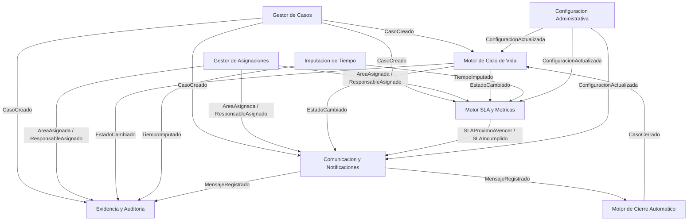
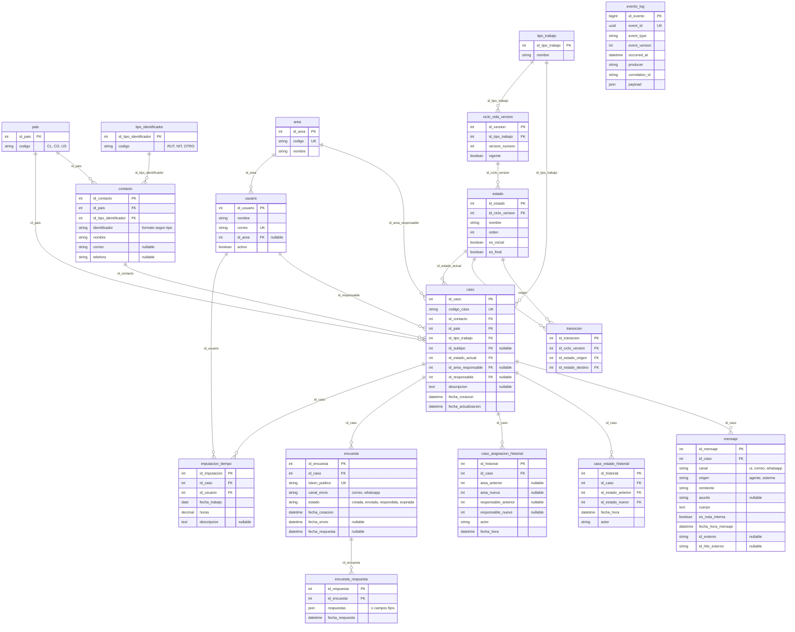

## Índice

0. [Ficha del proyecto](#0-ficha-del-proyecto)
1. [Descripción general del producto](#1-descripción-general-del-producto)
2. [Arquitectura del sistema](#2-arquitectura-del-sistema)
3. [Modelo de datos](#3-modelo-de-datos)
4. [Especificación de la API](#4-especificación-de-la-api)
5. [Historias de usuario](#5-historias-de-usuario)
6. [Tickets de trabajo](#6-tickets-de-trabajo)
7. [Pull requests](#7-pull-requests)

---

## 0. Ficha del proyecto

### **0.1. Tu nombre completo:**
José Miguel Padilla Mundaca

### **0.2. Nombre del proyecto:**
**TAKUMI**

*Siglas:* **T**icket, **A**ssignment, **K**nowledge base, **U**nified **M**anagement **I**nterface.

### **0.3. Descripción breve del proyecto:**
Sistema único e integrado que unifica la gestión de requerimientos, incidentes, proyectos y actividades internas (reemplazando Whaticket, OTRS/Znuny y SIHR), con imputación de tiempo, ciclos de vida configurables, SLA por hitos, encuestas post-cierre y trazabilidad completa para las áreas de Desarrollo (DII), Soporte TI y Procesos.

### **0.4. URL del proyecto:**
Pendiente.

> Cuando exista, puede ser pública o privada; en ese caso comparte los accesos de manera segura (por ejemplo a [alvaro@lidr.co](mailto:alvaro@lidr.co) usando [onetimesecret](https://onetimesecret.com/)).

### **0.5. URL o archivo comprimido del repositorio**
Pendiente.

> Cuando exista, puede estar en público o en privado; comparte los accesos de forma segura o envía un archivo zip con el contenido si aplica.

---

## 1. Descripción general del producto

> Describe en detalle los siguientes aspectos del producto:

### **1.1. Objetivo:**

El producto tiene como propósito ofrecer un **sistema único e integrado** que permita gestionar requerimientos, incidentes, proyectos y actividades internas, junto con la imputación de horas, para las áreas de Desarrollo Informático (DII), Soporte TI y Procesos.
**Valor que aporta:** elimina la fragmentación de herramientas actuales (Whaticket, OTRS/Znuny, SIHR), asegura trazabilidad completa, auditoría confiable y soporte efectivo a la mejora continua, sin sobrecargar la operación diaria.
**Para quién:** usuarios internos de la organización (solicitantes, agentes, encargados de área, auditoría y administración).

### **1.2. Características y funcionalidades principales:**

- **Unificación del trabajo:** Un solo punto de ingreso; gestión del ciclo de vida completa y configurable por tipo de trabajo (Incidente, Solicitud de servicio, Contingencia, Requerimiento, Proyecto, Actividad de procesos).
- **Ciclos de vida:** Cada tipo tiene su propio ciclo de vida con estados y transiciones configurables (sin saltos ni retrocesos); reasignaciones sin cambiar estado.
- **Roles y permisos:** Usuario Solicitante, Agentes por área (Soporte TI, DII, Procesos), Encargado de Área, Jefe de Área, Jefa de Gobierno TI, Auditor, Administrador; administración centralizada, mínimo privilegio, auditoría obligatoria.
- **Canales de entrada:** Correo (creación automática de casos en MVP), mensajería interna, portal/formularios internos, creación interna por roles; todos con trazabilidad completa.
- **Comunicaciones:** Notificaciones por eventos; mensajes y notas internas asociadas al caso; distinción entre comunicación con solicitante y notas internas.
- **Asignaciones:** Asignación y reasignación de área responsable y de responsable (usuario), con historial inmutable.
- **SLA multi-hito:** SLA configurables por tipo/subtipo/área (desde ingreso, desde asignación a área, a responsable, desde primera acción); alertas por vencer e incumplimiento.
- **Imputación de tiempo:** Configurable por tipo de trabajo; asociada a caso, usuario y área; consolidación de esfuerzo.
- **Encuestas post-cierre:** CSAT por caso; disparador al cierre; envío por correo (MVP); respuesta sin login; reportería agregada.
- **Cierre automático por inactividad:** Regla configurable (ej. 14 días sin respuesta); cierre con motivo auditable.
- **Evidencia y auditoría:** Historial de estados y asignaciones; registro de acciones relevantes; evento_log para trazabilidad.
- **Métricas estándar:** Volumen (casos creados/cerrados, backlog), tiempos de ciclo, cumplimiento SLA, horas imputadas, calidad (encuestas, reaperturas), consolidados por área.

### **1.3. Diseño y experiencia de usuario:**
Pendiente (hasta disponer de versión desplegada con flujos principales).

### **1.4. Instrucciones de instalación:**
Pendiente (hasta tener proyecto Laravel/Angular y pasos documentados).

---

## 2. Arquitectura del Sistema

> **Nota:** Toda esta sección es **tentativa**. Se basa en la documentación de las Etapas 4 y 5; aún no existe código ni despliegue, y podrá ajustarse durante el desarrollo.

---

### **2.1. Diagrama de arquitectura:**

A nivel de arquitectura, el sistema sigue un estilo **SPA + API** (o **cliente–servidor con frontend desacoplado**): un cliente web tipo **Single Page Application** (Angular) en una carpeta y un servidor de aplicaciones que expone **API REST** (Laravel) en otra, comunicados solo por HTTP/JSON.
El proyecto tendrá **backend y frontend en carpetas separadas** (por ejemplo `backend/` para Laravel y `frontend/` para Angular), comunicados vía API REST.
El **backend** se diseña como **monolito modular** con **comunicación basada en eventos** entre sus componentes.
El **frontend** es una aplicación **Angular** en su propia carpeta: consume la API del backend para listados y detalle de casos, formularios (crear caso, asignaciones, mensajes), tableros Kanban por área y, en su caso, pantallas de configuración; no contiene lógica de negocio crítica (validaciones duras y reglas viven en el backend).
**Qué significa “monolito modular” (en el backend):** es una **única aplicación backend** (un solo proceso/servidor Laravel), pero organizada en **módulos bien delimitados** (Core de Casos, Ciclo de Vida, Asignaciones, SLA, etc.), cada uno con responsabilidades claras y comunicación mediante eventos internos. No es un “monolito enmarañado” (todo mezclado) ni microservicios (varios backends desplegados por separado): es un solo backend con fronteras internas claras, lo que simplifica operación y despliegue y facilita mantener o extraer módulos más adelante si hiciera falta.

**Tecnologías (según Etapa 5):** Backend PHP 8+ / Laravel, servidor Apache; frontend Angular; base de datos MySQL; integración correo vía Microsoft Graph (MVP). Autenticación: usuario/contraseña, API corporativa de permisos, reCAPTCHA v3.

**Beneficios:** un solo despliegue, stack conocido, comunicación por eventos que desacopla módulos y permite trazabilidad (evento_log). **Sacrificios/déficits:** un único punto de despliegue (escalado vertical o réplicas del mismo monolito), stack único en backend; los integradores externos (correo, WhatsApp) son puntos de fallo que se abordan con tolerancia a fallos y desacoplamiento.

Diagrama lógico de componentes y flujo de eventos (Etapa 4):

---

### **2.2. Descripción de componentes principales:**

| Componente | Responsabilidad | Tecnología prevista |
|------------|-----------------|---------------------|
| **Core de Casos (Case Management)** | Creación del Caso, identificación única, tipo de trabajo y metadatos; emite CasoCreado/CasoActualizado. | Laravel (módulo/servicios). |
| **Motor de Ciclo de Vida (Lifecycle Engine)** | Estados y transiciones; validación de reglas duras (sin saltos ni retrocesos); historial de estados; emite EstadoCambiado. | Laravel. |
| **Gestor de Asignaciones** | Asignación de área y responsables; reasignación sin cambiar estado; historial; emite AreaAsignada, ResponsableAsignado. | Laravel. |
| **Comunicación y Notificaciones** | Mensajes y notas internas asociadas al caso; notificaciones por eventos; emite MensajeRegistrado. | Laravel + canal correo (Graph). |
| **Motor de SLA y Métricas** | Medición de SLA y métricas por eventos; alertas (próximo a vencer, incumplido); no altera el flujo del caso. | Laravel. |
| **Imputación de Tiempo** | Registro de horas por caso/usuario/área; emite TiempoImputado. | Laravel. |
| **Evidencia y Auditoría** | Historial de estados y asignaciones; registro de acciones; evento_log; trazabilidad inmutable. | Laravel + MySQL. |
| **Motor de Cierre Automático** | Cierre por inactividad (ej. 14 días); emite CasoCerrado con motivo auditable. | Laravel. |
| **Encuestas** | Encuesta al cierre; envío por correo (MVP); respuesta sin login. | Laravel. |
| **Configuración (Admin)** | Ciclos de vida, estados, transiciones, SLA, catálogos; emite ConfiguracionActualizada. | Laravel. |
| **Integrador Correo** | Ingreso y comunicación por Office365 (Microsoft Graph). | Laravel + Graph API. |
| **Integrador WhatsApp** | Diseñado; fuera de MVP. | Post-MVP. |
| **Asistente IA** | Sugerencias en modo mixto (umbral 0,85); no ejecuta reglas duras. | Laravel + servicio IA. |
| **Frontend (Kanban y UI)** | Tableros Kanban por área; formularios y listados de casos. | Angular. |

Todos los componentes del backend se comunican mediante **eventos internos** (catálogo canónico: CasoCreado, EstadoCambiado, AreaAsignada, ResponsableAsignado, MensajeRegistrado, TiempoImputado, SLAProximoAVencer, SLAIncumplido, CasoCerrado, ConfiguracionActualizada, etc.).

---

### **2.3. Descripción de alto nivel del proyecto y estructura de ficheros**

Pendiente (hasta tener el proyecto creado). La estructura de alto nivel será:

- **`backend/`** — Aplicación Laravel (API, reglas de negocio, eventos, persistencia). Dentro, reflejar los módulos lógicos (Casos, Ciclo de Vida, Asignaciones, Comunicaciones, SLA, etc.) en carpetas o namespaces por dominio.
- **`frontend/`** — Aplicación Angular (UI: listados, detalle de caso, formularios, Kanban, login, etc.). Consume la API del backend; la estructura interna (módulos por feature o por pantalla) se definirá al crear el proyecto.

---

### **2.4. Infraestructura y despliegue**

Pendiente (hasta definir entorno de despliegue, servidor, base de datos en entorno objetivo y proceso de despliegue).

---

### **2.5. Seguridad**

Tentativo, según Etapa 5 y paquete CU-13 (Seguridad básica y permisos):

- **Autenticación:** usuario y contraseña; validación de credenciales contra API corporativa externa.
- **Protección de endpoints:** ningún endpoint de gestión de casos público; solo excepciones explícitas (por ejemplo, encuestas por token).
- **reCAPTCHA v3** en pantalla de login.
- **Permisos:** obtenidos desde API corporativa (menús/acciones); principio de mínimo privilegio y segmentación por área.
- **Auditoría:** acciones relevantes y trazabilidad en evento_log (sin implementar aún).

---

### **2.6. Tests**

Tentativo, según estrategia de pruebas de la Etapa 5:

- **Unitarias:** reglas de negocio y validaciones (p. ej. transiciones, validadores RUT/NIT).
- **Integración:** módulos y eventos (publicación/consumo de eventos, persistencia).
- **End-to-end:** creación y gestión de casos, Kanban y transiciones, correo entrante, cierre automático, encuestas.
- **Idempotencia y seguridad:** pruebas específicas cuando los integradores y la autenticación estén implementados.

Nada de lo anterior está implementado aún; se irá aplicando según el avance del desarrollo.

---

## 3. Modelo de Datos

> **Nota:** El diagrama y las descripciones que siguen son **tentativos** y se basan en la documentación de las etapas 2, 3 y 5 y en los paquetes de la Etapa 6 (HU). Pueden refinarse al implementar las migraciones. En la Etapa 5 se mencionan además las entidades *evidencia*, *sugerencia_ia* y *evento_consumo*; no están dibujadas en el diagrama para no recargarlo, pero se consideran parte del modelo.

### **3.1. Diagrama del modelo de datos:**

### **3.2. Descripción de entidades principales (tentativa):**

| Entidad | Descripción | Atributos principales | PK | Relaciones |
|--------|-------------|------------------------|----|------------|
| **pais** | Catálogo de países (CL, CO, US). | id_pais (PK), codigo (string). | id_pais | Contacto N:1, Caso N:1. |
| **tipo_identificador** | Tipo de documento del solicitante (RUT, NIT, OTRO). | id_tipo_identificador (PK), codigo. | id_tipo_identificador | Contacto N:1. |
| **tipo_trabajo** | Tipo de trabajo del caso (Incidente, Solicitud de servicio, Contingencia, Requerimiento, Proyecto, Actividad de procesos). | id_tipo_trabajo (PK), nombre. | id_tipo_trabajo | Caso N:1, Ciclo_vida_version 1:N. |
| **contacto** | Solicitante (sin login). Identificador único por (pais + tipo_identificador + identificador). | id_contacto (PK), id_pais (FK), id_tipo_identificador (FK), identificador (formato según tipo), nombre, correo (nullable), telefono (nullable). | id_contacto | Pais N:1, Tipo_identificador N:1, Caso 1:N. |
| **area** | Área responsable (DII, Soporte TI, Procesos). | id_area (PK), codigo (UNIQUE), nombre. | id_area | Caso N:1, Usuario N:1. |
| **usuario** | Usuario interno (agentes, encargados). | id_usuario (PK), nombre, correo (UNIQUE), id_area (FK nullable), activo (bool). | id_usuario | Area N:1, Caso (responsable) N:1, Imputacion_tiempo N:1. |
| **ciclo_vida_version** | Versión vigente del ciclo de vida por tipo de trabajo. | id_version (PK), id_tipo_trabajo (FK), version_numero, vigente (bool). | id_version | Tipo_trabajo N:1, Estado 1:N, Transicion 1:N. |
| **estado** | Estado dentro de un ciclo (Ingresado, Asignado a área, En trabajo, Cerrado, etc.). | id_estado (PK), id_ciclo_version (FK), nombre, orden, es_inicial, es_final (bool). | id_estado | Ciclo_vida_version N:1, Caso N:1, Caso_estado_historial N:1. |
| **transicion** | Transición permitida entre dos estados (origen → destino). | id_transicion (PK), id_ciclo_version (FK), id_estado_origen (FK), id_estado_destino (FK). UNIQUE(ciclo_version, origen, destino). | id_transicion | Ciclo_vida_version N:1, Estado (origen/destino) N:1. |
| **caso** | Entidad central: todo trabajo es un caso. | id_caso (PK), codigo_caso (UNIQUE), id_contacto (FK), id_pais (FK), id_tipo_trabajo (FK), id_subtipo (FK nullable), id_estado_actual (FK), id_area_responsable (FK nullable), id_responsable (FK nullable), descripcion (nullable), fecha_creacion, fecha_actualizacion. Regla: caso cerrado no se reabre. | id_caso | Contacto N:1, Pais N:1, Tipo_trabajo N:1, Estado N:1, Area N:1, Usuario N:1; 1:N con Mensaje, Caso_estado_historial, Caso_asignacion_historial, Encuesta, Imputacion_tiempo. |
| **mensaje** | Comunicación asociada al caso (externo o nota interna). | id_mensaje (PK), id_caso (FK), canal (ui/correo/whatsapp), origen (agente/sistema), remitente, asunto (nullable), cuerpo (text), es_nota_interna (bool), fecha_hora_mensaje, id_externo (nullable), id_hilo_externo (nullable). Índice (id_caso, fecha_hora_mensaje). | id_mensaje | Caso N:1. |
| **caso_estado_historial** | Historial de cambios de estado (inmutable). | id_historial (PK), id_caso (FK), id_estado_anterior (FK), id_estado_nuevo (FK), fecha_hora, actor. | id_historial | Caso N:1, Estado N:1. |
| **caso_asignacion_historial** | Historial de asignaciones de área y responsable. | id_historial (PK), id_caso (FK), area_anterior, area_nueva, responsable_anterior, responsable_nuevo, actor, fecha_hora. | id_historial | Caso N:1. |
| **evento_log** | Registro de eventos del sistema (CasoCreado, EstadoCambiado, etc.) para auditoría y trazabilidad. | id_evento (PK), event_id (UUID UNIQUE), event_type, event_version, occurred_at, producer, correlation_id, payload (JSON). | id_evento | — |
| **encuesta** | Encuesta de satisfacción asociada al cierre de un caso. Una por cierre. | id_encuesta (PK), id_caso (FK), token_publico (UNIQUE), canal_envio, estado, fecha_creacion, fecha_envio (nullable), fecha_respuesta (nullable). | id_encuesta | Caso N:1, Encuesta_respuesta 1:N. |
| **encuesta_respuesta** | Respuesta del solicitante a la encuesta (sin login). | id_respuesta (PK), id_encuesta (FK), respuestas (JSON o campos), fecha_respuesta. | id_respuesta | Encuesta N:1. |
| **imputacion_tiempo** | Horas imputadas a un caso por un usuario. | id_imputacion (PK), id_caso (FK), id_usuario (FK), fecha_trabajo (date), horas (decimal), descripcion (nullable). Restricciones por (id_caso, fecha_trabajo) y (id_usuario, fecha_trabajo) según diseño. | id_imputacion | Caso N:1, Usuario N:1. |

---

## 4. Especificación de la API

> Si tu backend se comunica a través de API, describe los endpoints principales (máximo 3) en formato OpenAPI. Opcionalmente puedes añadir un ejemplo de petición y de respuesta para mayor claridad.

**Estado:** Pendiente. Los endpoints se definen en los paquetes de la Etapa 6 (carpeta `documentacion-sdd/06 - Etapa 6 (Ejecucion y Construccion)/HU/`); la especificación en formato OpenAPI se incorporará cuando se disponga del contrato estable.

---

## 5. Historias de Usuario

> Documenta 3 de las historias de usuario principales utilizadas durante el desarrollo, teniendo en cuenta las buenas prácticas de producto al respecto.
> El resto de historias (HU-03 a HU-16) están documentadas en `documentacion-sdd/06 - Etapa 6 (Ejecucion y Construccion)/HU/`, un paquete por caso de uso.

**Criterio de selección y buenas prácticas:** Las tres historias elegidas son las **principales** porque cubren el flujo core de valor: (1) crear el caso, (2) consultarlo y (3) asignarlo a área/responsable; sin ellas no hay operación diaria. Se ha seguido formato estándar *Como / Quiero / Para*, criterios de aceptación en *Given-When-Then*, prioridad explícita (alta) y alcance MVP acotado, alineado con la documentación de la Etapa 6.

**Historia de Usuario 1 — Crear caso desde UI**

- **Como** usuario interno
- **Quiero** crear un caso indicando país y datos básicos del solicitante
- **Para** registrar solicitudes recibidas por teléfono u otros medios.

*Criterios de aceptación (Given/When/Then):*
- Dado que estoy autenticado como usuario interno, cuando envío una solicitud de creación de caso con país, solicitante y descripción, entonces el sistema crea el contacto (si no existe) y crea el caso con un `codigo_caso` único.
- Dado un solicitante con RUT inválido, cuando intento crear el caso, entonces el sistema rechaza con error indicando identificador inválido.
- Dado un solicitante con NIT con caracteres no numéricos, cuando intento crear el caso, entonces el sistema rechaza con error indicando formato inválido.

---

**Historia de Usuario 2 — Ver listado y detalle de casos**

- **Como** usuario interno
- **Quiero** buscar y ver casos por filtros básicos
- **Para** gestionar mi carga de trabajo diaria y dar seguimiento.

*Filtros mínimos (MVP):* codigo_caso, país, tipo_trabajo, rango de fechas (creación), estado_actual, texto libre sobre contacto (opcional).

*Criterios de aceptación (Given/When/Then):*
- Dado que existen casos creados, cuando consulto el listado sin filtros, entonces obtengo una lista paginada ordenada por fecha_actualizacion desc.
- Dado un `codigo_caso`, cuando lo busco en el listado, entonces aparece el caso correspondiente.
- Dado un `id_caso`, cuando consulto el detalle, entonces veo los datos del caso y del contacto asociado.
- Dado un `id_caso` inexistente, cuando consulto el detalle, entonces recibo 404.

---

**Historia de Usuario 3 — Asignar caso a área y responsable**

- **Como** usuario interno
- **Quiero** asignar o reasignar un caso a un área y/o responsable
- **Para** que el trabajo llegue al equipo correcto sin cambiar el estado.

*Criterios de aceptación (Given/When/Then):*
- Dado un caso abierto, cuando asigno un área válida, entonces el caso actualiza su área, no cambia estado, registra historial y emite AreaAsignada.
- Dado un caso abierto, cuando asigno un responsable válido, entonces el caso actualiza responsable, no cambia estado, registra historial y emite ResponsableAsignado.
- Dado un caso cerrado, cuando intento asignar, entonces el sistema rechaza.

---

## 6. Tickets de Trabajo

> Documenta 3 de los tickets de trabajo principales del desarrollo, uno de backend, uno de frontend, y uno de bases de datos. Da todo el detalle requerido para desarrollar la tarea de inicio a fin teniendo en cuenta las buenas prácticas al respecto.
> El resto de tickets (T6-007 en adelante) están en los paquetes de `documentacion-sdd/06 - Etapa 6 (Ejecucion y Construccion)/HU/`.

**Buenas prácticas aplicadas:** Cada ticket incluye objetivo, alcance acotado (≤4 h), criterios de aceptación verificables, pruebas mínimas y dependencias; el orden de ejecución recomendado es T6-001 → T6-004 → T6-006 (catálogos → API → UI).

---

**Ticket 1 — Base de datos: Migraciones y seed de catálogos mínimos (T6-001)**

- **Objetivo:** Crear migraciones para `pais`, `tipo_identificador`, `tipo_trabajo` y seeds base para que el resto del flujo (Contacto, Caso) pueda persistir datos válidos.
- **Precondiciones / entorno:** Proyecto Laravel creado, MySQL configurado, `php artisan migrate` operativo.
- **Alcance (pasos):**
  1. Crear migración `pais`: al menos `id` (PK), `codigo` (string, único o índice). Seed: CL, CO, US.
  2. Crear migración `tipo_identificador`: `id` (PK), `codigo`. Seed: RUT, NIT, OTRO.
  3. Crear migración `tipo_trabajo`: `id` (PK), `nombre`. Seed: Incidente, Solicitud de servicio, Contingencia, Requerimiento, Proyecto, Actividad de procesos.
  4. Nombres y nombres de campos en español; comentarios en tablas/campos críticos.
  5. Seeders ejecutables con `php artisan db:seed` (o `migrate:fresh --seed`).
- **Criterios de aceptación:** (1) `php artisan migrate:fresh --seed` termina sin errores. (2) Las tablas existen y los catálogos se pueden consultar (por ejemplo desde tinker o un endpoint futuro).
- **Definition of done:** Migraciones versionadas en código; seeds idempotentes o ejecutables en entorno limpio; sin datos sensibles en seeds.
- **Pruebas mínimas:** Ejecutar `migrate:fresh --seed` en local y comprobar que las tres tablas tienen registros.

---

**Ticket 2 — Backend: Endpoint POST /api/casos (T6-004)**

- **Objetivo:** Exponer un endpoint que permita crear un caso según CU-01 (Crear Caso): resolver o crear contacto, crear caso con `codigo_caso` único, devolver `id_caso` y `codigo_caso`.
- **Precondiciones:** T6-001 completado (catálogos); modelos `Contacto` y `Caso` con validaciones de RUT/NIT (T6-002, T6-003) y generación de `codigo_caso` implementados; en caso de no existir aún, el estado inicial del caso puede ser un valor por defecto o placeholder.
- **Alcance (pasos):**
  1. Crear `CasosController` (o equivalente) con método `store`.
  2. Request (body): país, datos del solicitante (nombre, tipo_identificador, identificador, correo opcional, teléfono opcional), tipo_trabajo, descripción.
  3. Lógica en Service/acción: (a) Buscar o crear `Contacto` por (pais, tipo_identificador, identificador); (b) Crear `Caso` con FK a contacto, id_pais, id_tipo_trabajo, codigo_caso generado, estado inicial; (c) Persistir.
  4. Respuesta JSON 201: `{ "id_caso": ..., "codigo_caso": "CASO-000001" }`. Errores de validación 422 con mensaje claro (ej. identificador inválido).
- **Criterios de aceptación:** (1) Crear caso con datos válidos devuelve 201 y el caso existe en BD con contacto asociado. (2) RUT inválido → 422. (3) NIT con caracteres no numéricos → 422. (4) Tipo de trabajo inexistente → 422.
- **Definition of done:** Endpoint documentado o testeado; sin lógica de negocio duplicada en el controller (delegada a servicio/caso de uso).
- **Pruebas mínimas:** Feature tests (HTTP): un caso con RUT válido (201 y payload); RUT inválido (422); NIT inválido (422); NIT válido (201).

---

**Ticket 3 — Frontend: UI Angular formulario Crear Caso (T6-006)**

- **Objetivo:** Pantalla en Angular que permita a un usuario interno rellenar los datos de creación de caso, enviarlos a POST /api/casos y mostrar el `codigo_caso` devuelto (o mensaje de error).
- **Precondiciones:** Proyecto Angular creado; endpoint POST /api/casos disponible y probado (T6-004); CORS/configuración de API base en el frontend (URL del backend).
- **Alcance (pasos):**
  1. Crear componente/ruta para "Crear caso" (ej. `/casos/crear`).
  2. Formulario reactivo con campos: país (select; opciones CL, CO, US), nombre (texto), tipo_identificador (select: RUT, NIT), identificador (texto), correo (opcional), teléfono (opcional), tipo_trabajo (select; cargar desde API o estático para MVP), descripción (textarea).
  3. Validaciones básicas en frontend (campos requeridos según CU-01); mostrar errores de validación del backend si la API devuelve 422.
  4. Al enviar: POST /api/casos con el body en JSON; en éxito, mostrar `codigo_caso` (y opcionalmente id_caso); en error, mostrar mensaje amigable.
  5. Opcional: botón "Crear otro" que limpie el formulario.
- **Criterios de aceptación:** (1) El usuario puede crear un caso correctamente y ve el código generado. (2) Si la API rechaza (ej. RUT inválido), se muestra el error sin romper la pantalla.
- **Definition of done:** Formulario accesible desde la navegación; sin datos sensibles en consola; manejo de loading/error básico.
- **Pruebas mínimas:** Prueba manual guiada (flujo feliz + un caso de error); opcional test de componente o E2E.

---

## 7. Pull Requests

> Documenta 3 de las Pull Requests realizadas durante la ejecución del proyecto.

**Requisitos de cada PR:**
- **Título claro** que indique el tipo de cambio (ej. `docs:`, `feat:`, `fix:`) y el alcance.
- **Descripción detallada:** qué cambia, por qué y qué impacto tiene.
- **Referencia a la historia de usuario o ticket** correspondiente cuando aplique (ej. "Relacionado con HU Crear caso (CU-01)" o "Implementa Ticket T6-004").

---

**Pull Request 1 — Documentación inicial del proyecto (primera entrega)**

- **Título:** `docs: documentación inicial — ficha, producto, arquitectura, modelo de datos, HUs y tickets (Entrega 1)`
- **Descripción detallada:**
  - **Qué cambia:** Se añade o actualiza el `readme.md` con: (0) Ficha del proyecto (nombre TAKUMI, autor, descripción breve, URLs pendientes); (1) Objetivo y características/funcionalidades del producto; (2) Arquitectura tentativa (SPA + API, monolito modular, diagrama Mermaid de componentes y eventos, tecnologías); (3) Modelo de datos tentativo (diagrama Mermaid y tabla de entidades); (5) Tres historias de usuario con criterios de aceptación; (6) Tres tickets de trabajo con objetivo, alcance, criterios y pruebas; (7) Esta PR documentada. No se incluye código; solo documentación.
  - **Por qué:** Cumplir la primera entrega del proyecto: dejar establecida la visión del producto, la arquitectura objetivo y el alcance documentado (HUs y tickets) para que las siguientes PRs tengan una base clara y trazable.
  - **Impacto:** Permite al equipo y al revisor entender el sistema TAKUMI de un vistazo; las HUs y tickets sirven de contrato para el desarrollo posterior (backend, frontend, BD). No afecta a código existente ni a despliegue.
- **Referencia a HU / ticket:** Esta PR no implementa código; documenta el alcance que será implementado en PRs futuras. Relación documentada: **HU Crear caso (CU-01)** → Ticket 2 (POST /api/casos, T6-004) y Ticket 3 (UI Angular Crear Caso, T6-006); **HU Consultar caso** y **HU Asignar área/responsable** → referenciadas en sección 5; Ticket 1 (BD migraciones y seeds, T6-001) como base para los demás.
- **Criterios de revisión:** Lectura coherente del readme; HUs en formato Como/Quiero/Para con Given-When-Then; tickets con objetivo, alcance, criterios de aceptación y pruebas mínimas.
- **Estado:** Primera entrega (solo documentación).

---

**Pull Request 2**

*(Pendiente de documentar.)*

---

**Pull Request 3**

*(Pendiente de documentar.)*

