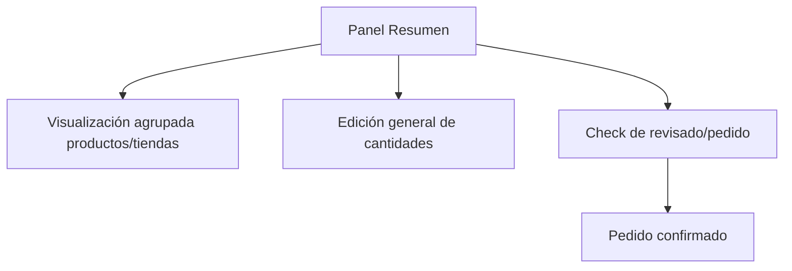
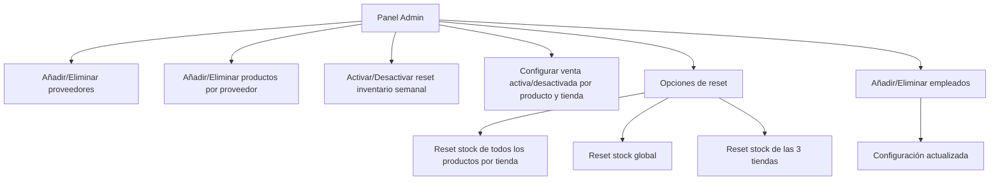
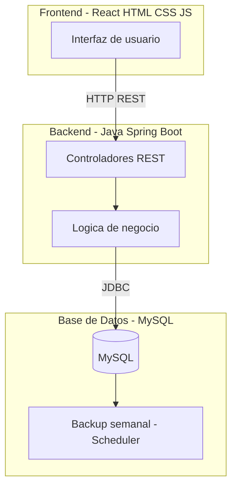

## Índice

0. [Ficha del proyecto](#0-ficha-del-proyecto)
1. [Descripción general del producto](#1-descripción-general-del-producto)
2. [Arquitectura del sistema](#2-arquitectura-del-sistema)
3. [Modelo de datos](#3-modelo-de-datos)
4. [Especificación de la API](#4-especificación-de-la-api)
5. [Historias de usuario](#5-historias-de-usuario)
6. [Tickets de trabajo](#6-tickets-de-trabajo)
7. [Pull requests](#7-pull-requests)

---

## 0. Ficha del proyecto

### **0.1. Tu nombre completo:**

Miquel Debon Villagrasa

### **0.2. Nombre del proyecto:**

StockPro

### **0.3. Descripción breve del proyecto:**

Este proyecto consiste en una aplicación web para la gestión de pedidos y stock de una empresa, concretamente una charcutería con varias tiendas.

### **0.4. URL del proyecto:**

> Enlace de la aplicación

### 0.5. URL o archivo comprimido del repositorio

> [Github AI4 FinalProject MDV](https://github.com/MiquelDebon/AI4Devs-finalproject)

---

## 1. Descripción general del producto

StockPro permitie centralizar los pedidos de los diferentes proveedores, con una plataforma multitienda y multiempleado teninendo el control del inventario en las tiendas.
La aplicación busca optimizar el proceso de compra y reposición de productos, garantizando que cada tienda disponga de las cantidades ideales de cada artículo según su inventario.

### **1.1. Objetivo:**

**El propósito** del StockPro es ayudar a las empresas a dejar el inventario a papel y subirlo al cloud.

**Valor que aporta:**

- Unifica todos los pedidos en una sola plataforma.
- Cada tienda sabe qué tiene, qué le falta y cuánto debería pedir.
- Asegura que siempre haya las cantidades ideales de producto en cada tienda.

**Qué soluciona:**

- Evita la dispersión de pedidos por WhatsApp, Excel o llamadas.
- Elimina errores de sobrepedido o quedarse sin stock.
- Reduce pérdidas económicas por exceso de stock o ventas perdidas por falta de producto.

**Para quién:**

- Gestores generales y encargados de tienda que necesitan coordinación entre varios locales.
- Encargados de tienda que preparan pedidos y responsables de almacén que necesitan precisión.
- Propietarios y gestores que buscan eficiencia operativa y mejor rentabilidad.

### **1.2. Características y funcionalidades principales:**

StockPro consta de 3 simples menus.

**Panel tienda**
Panel donde van a entrar unicamente los usuarios de esta tienda para rellenar la cantidad que articulos que han quedado de cada unidad. El listado de productos sale ordenado por proveedor, aunque hay dos buscadores tanto de proveedor como de producto.

Por otro lado, se bloquea poder introduccir valores hasta que no se seleccione que empleado esta rellando los valors, para dejar constancia quien introduce el stock.

Pasos de uso

1. Seleccionar trabajador
2. Introducir los valores
3. Se guarda automaticamente cada cambio y asi existe error humano


**Panel Resumen**
Panel donde se puede ver el resumen de productos por tiendas

1. Visualización agrupada productos/tiendas
2. Edición de general
3. Check de revisado/pedido


**Panel Admin**
Panel de configuración donde se crea, edita y elimina.

- Anadir/Eliminar proveedores
- Anadir/Eliminar productor por proveedor
- Activar/Desactivar reset inventario semanal
- Configuración venta activa/desactivada de productor y tienda
- Opción de reset
  - Reset stock de todos los productos por tienda
  - Reset stock
  - Reset stocl de las 3 tiendas
- Añadir/Eliminar empleado


### **1.3. Diseño y experiencia de usuario:**

1. **Panel Inventario por tienda -> usuario Trabajador**
   ```mermaid
   flowchart TD
       A[Seleccionar trabajador] --> B[Introducir cantidad actual y pedido ]
       B --> C[Guardado automático de cambios]
   ```
2. **Panel Resumen**



3. **Panel de Configruación**



### **1.4. Instrucciones de instalación:**

> Documenta de manera precisa las instrucciones para instalar y poner en marcha el proyecto en local (librerías, backend, frontend, servidor, base de datos, migraciones y semillas de datos, etc.)

---

## 2. Arquitectura del Sistema

### **2.1. Diagrama de arquitectura:**

La aplicación se compone de tres bloques principales:

- 🎨 **Frontend**: desarrollado en **React** con **HTML, CSS y JavaScript**, responsable de la interacción con el usuario final y de la representación visual.
- ⚙️ **Backend**: implementado con **Java Spring Boot**, encargado de exponer las APIs REST, aplicar la lógica de negocio y gestionar las reglas de acceso a datos.
- 💾 **Base de Datos**: **MySQL**, que almacena la información persistente (tiendas, proveedores, artículos, pedidos e historial). Se complementa con un **scheduler** que realiza una copia de seguridad semanal.

🔗 La comunicación se establece de la siguiente forma: el frontend consume las APIs REST del backend, mientras que el backend se conecta a la base de datos mediante JDBC.

Ademas al ser programador backend en java Spring boot he podido revisar bien el codigo, en el frontend he dependido mucho más de la IA.



### **2.2. Descripción de componentes principales:**

**📐 Patrón de Arquitectura**

El sistema sigue un patrón **cliente-servidor en tres capas (3-tier architecture)**:

1. 🖥️ **Capa de presentación (Frontend)**: interfaz de usuario en React.
2. ⚙️ **Capa de negocio (Backend)**: servicios REST y lógica en Spring Boot.
3. 🗄️ **Capa de datos (Persistencia)**: almacenamiento en MySQL.

Este patrón es uno de los más extendidos en aplicaciones web modernas y encaja bien con los requisitos de una solución modular, escalable y fácil de mantener.

**✅ Justificación de la Elección**

- 🪄 **Separación de responsabilidades**: cada capa tiene una función clara (UI, lógica, persistencia).
- 🔄 **Flexibilidad tecnológica**: el frontend y backend son independientes, lo que permite evolucionar el frontend o backend sin afectar a la otra capa.
- 🌍 **Estandarización**: Spring Boot y React son tecnologías ampliamente adoptadas, con gran comunidad y soporte.
- 📈 **Mantenibilidad y escalabilidad**: la arquitectura modular permite añadir nuevas funcionalidades (ej. nuevos paneles de pedidos o integraciones con proveedores) sin reestructurar todo el sistema.

**🌟 Beneficios**

- ⚡ **Experiencia de usuario fluida** gracias a React y la actualización dinámica del interfaz.
- 🛡️ **Robustez y productividad en el backend** mediante el ecosistema Spring Boot (seguridad, inyección de dependencias, gestión de APIs REST).
- 💾 **Consistencia de datos** con MySQL y respaldo periódico por scheduler.
- ☁️ **Escalabilidad horizontal**: el frontend y backend pueden desplegarse en servidores independientes o incluso en la nube de forma desacoplada.
- 🔮 **Fácil integración futura**: posible ampliación hacia microservicios o integración con APIs externas de proveedores.

### **⚠️ 2.3. Descripción de alto nivel del proyecto y estructura de ficheros**

> Representa la estructura del proyecto y explica brevemente el propósito de las carpetas principales, así como si obedece a algún patrón o arquitectura específica.

### **2.4. Infraestructura y despliegue**

Actualmente, el despliegue se realiza de forma **manual** y consiste en los siguientes pasos:

### **2.5. Seguridad**

Prácticas implementadas:

1. Validación de Datos
   - Validación de inputs frontend
   - Validación de valores backend

### **2.6. Tests**

Backend Tests (Mockito)

- Unit Tests: Controladores, servicios, modelos
- Database Tests: Operaciones CRUD des de backend

## 3. Modelo de Datos

### **3.1. Diagrama del modelo de datos:**

> Recomendamos usar mermaid para el modelo de datos, y utilizar todos los parámetros que permite la sintaxis para dar el máximo detalle, por ejemplo las claves primarias y foráneas.

### **3.2. Descripción de entidades principales:**

> Recuerda incluir el máximo detalle de cada entidad, como el nombre y tipo de cada atributo, descripción breve si procede, claves primarias y foráneas, relaciones y tipo de relación, restricciones (unique, not null…), etc.

## 4. Especificación de la API

> Si tu backend se comunica a través de API, describe los endpoints principales (máximo 3) en formato OpenAPI. Opcionalmente puedes añadir un ejemplo de petición y de respuesta para mayor claridad

## 5. Historias de Usuario

> Documenta 3 de las historias de usuario principales utilizadas durante el desarrollo, teniendo en cuenta las buenas prácticas de producto al respecto.

**Historia de Usuario 1**

**Historia de Usuario 2**

**Historia de Usuario 3**

## 6. Tickets de Trabajo

> Documenta 3 de los tickets de trabajo principales del desarrollo, uno de backend, uno de frontend, y uno de bases de datos. Da todo el detalle requerido para desarrollar la tarea de inicio a fin teniendo en cuenta las buenas prácticas al respecto.

**Ticket 1**

**Ticket 2**

**Ticket 3**

## 7. Pull Requests

> Documenta 3 de las Pull Requests realizadas durante la ejecución del proyecto

**Pull Request 1**

**Pull Request 2**

**Pull Request 3**
