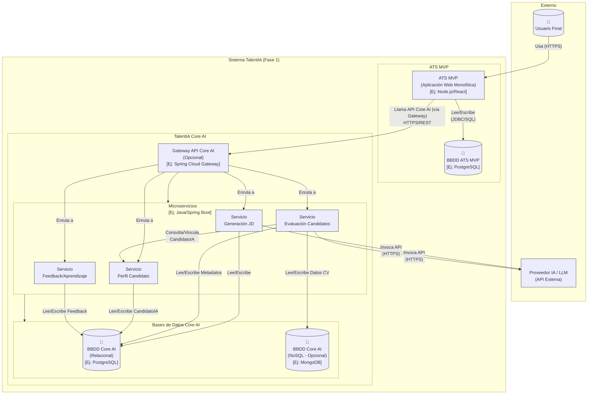

## Índice

0. [Ficha del proyecto](#0-ficha-del-proyecto)
1. [Descripción general del producto](#1-descripción-general-del-producto)
2. [Arquitectura del sistema](#2-arquitectura-del-sistema)
3. [Modelo de datos](#3-modelo-de-datos)
4. [Especificación de la API](#4-especificación-de-la-api)
5. [Historias de usuario](#5-historias-de-usuario)
6. [Tickets de trabajo](#6-tickets-de-trabajo)
7. [Pull requests](#7-pull-requests)

---

## 0. Ficha del proyecto

### **0.1. Tu nombre completo:**

- David Álvarez Díaz
- Jesus Gallego de la Cruz
- José Luis Jimenez Jambrina

### **0.2. Nombre del proyecto:**

- TalentIA

### **0.3. Descripción breve del proyecto:**

- TalentIA es una plataforma de gestión de talento que permite a las empresas gestionar su proceso de selección de manera eficiente.

### **0.4. URL del proyecto:**

> Puede ser pública o privada, en cuyo caso deberás compartir los accesos de manera segura. Puedes enviarlos a [alvaro@lidr.co](mailto:alvaro@lidr.co) usando algún servicio como [onetimesecret](https://onetimesecret.com/).

### 0.5. URL o archivo comprimido del repositorio

> Puedes tenerlo alojado en público o en privado, en cuyo caso deberás compartir los accesos de manera segura. Puedes enviarlos a [alvaro@lidr.co](mailto:alvaro@lidr.co) usando algún servicio como [onetimesecret](https://onetimesecret.com/). También puedes compartir por correo un archivo zip con el contenido


---

## 1. Descripción general del producto

> Describe en detalle los siguientes aspectos del producto:

### **1.1. Objetivo:**

El propósito de TalentIA, en su Fase 1, es validar el impacto de la IA en un ciclo completo de reclutamiento gestionado a través de un ATS MVP. Busca optimizar los procesos reduciendo tiempos y elevando la calidad y objetividad de la selección dentro del ecosistema TalentIA MVP. El valor que aporta es la eficiencia operativa para los usuarios piloto (Equipos internos de RRHH/Reclutamiento y Hiring Managers) al reducir significativamente el tiempo en tareas manuales como la creación de JDs y la criba inicial. También soluciona la falta de objetividad en la evaluación inicial mediante un sistema de scoring y matching multicriterio transparente.

### **1.2. Características y funcionalidades principales:**

TalentIA, en su Fase 1, se compone de un ATS MVP (Minimal Viable Product) y la Plataforma TalentIA Core AI, que trabajan conjuntamente. Las características y funcionalidades principales son:

**Componentes del ATS MVP**:

* **Gestión de Vacantes:** Permite crear, editar, publicar y gestionar ofertas de empleo, integrándose con TalentIA Core para la generación de JDs.
* **Portal de Candidatos / Aplicación:** Interfaz pública para visualizar vacantes publicadas y aplicar a ellas mediante un formulario con carga de CV.
* **Gestión de Candidaturas:** Almacena información de candidatos y sus postulaciones, muestra resultados de evaluación IA, y permite añadir notas.
* **Gestión de Pipeline Básico:** Permite definir etapas, visualizar candidatos por etapa (ej. Kanban), y mover candidatos entre etapas.
* **Interfaz de Usuario (Reclutador/Manager):** Incluye un dashboard básico, vistas de gestión de vacantes y candidatos, y un mecanismo para dar feedback a la IA.

**Componentes de la Plataforma TalentIA (Core AI)**:

* **Generador Inteligente de Job Descriptions:** Recibe parámetros de vacantes desde el ATS MVP, utiliza LLMs y datos internos (opcional) para generar JDs.
* **Módulo de Cribado y Evaluación Inteligente:** Procesa CVs (parsing), compara con requisitos de vacante (matching), calcula score, genera resumen (opcional), y determina etapa sugerida.
* **Motor de Integración Interna (ATS MVP <-> Core AI):** Gestiona la comunicación (APIs RESTful) entre ATS MVP y Core AI.
* **Módulo de Aprendizaje y Mejora Continua:** Recibe feedback de usuarios y eventos del pipeline para ajustar modelos de IA.
* **(Opcional Fase 1) Servicio de Analítica Básica:** Recopila datos para mostrar métricas básicas en el Dashboard del ATS MVP.

### **1.3. Diseño y experiencia de usuario:**

> Proporciona imágenes y/o videotutorial mostrando la experiencia del usuario desde que aterriza en la aplicación, pasando por todas las funcionalidades principales.

### **1.4. Instrucciones de instalación:**
> Documenta de manera precisa las instrucciones para instalar y poner en marcha el proyecto en local (librerías, backend, frontend, servidor, base de datos, migraciones y semillas de datos, etc.)

---

## 2. Arquitectura del Sistema

### **2.1. Diagrama de arquitectura:**
La arquitectura propuesta para la Fase 1 de TalentIA es un enfoque híbrido: un **ATS MVP Monolítico** (o Monolito Modular) para la interfaz de usuario y el workflow de reclutamiento, y una arquitectura basada en **Microservicios** para **TalentIA Core AI**, que agrupa los componentes de inteligencia artificial.

La elección de esta arquitectura se justifica por la necesidad de un desarrollo rápido y sencillo para el MVP del ATS, combinado con la escalabilidad, modularidad y especialización requerida para los componentes de IA. Permite escalar, desarrollar y desplegar independientemente las capacidades de IA.

**Beneficios principales:**

* Desarrollo y despliegue ágil del ATS MVP.
* Escalabilidad y despliegue independiente de los microservicios de Core AI.
* Encapsulamiento claro de responsabilidades.
* Soporte para NFRs críticos como seguridad y consistencia de datos.

**Sacrificios o déficits:**

* Puede haber complejidad en la comunicación y consistencia de datos entre el monolito y los microservicios.
* El rendimiento puede depender de la optimización de cada componente y las llamadas externas al proveedor LLM.

**Diagrama de Contenedores (C2):**



### **2.2. Descripción de componentes principales:**

Los componentes principales del sistema TalentIA en la Fase 1 son el ATS MVP y la Plataforma TalentIA Core AI.

**ATS MVP:**
* **Tecnología Propuesta (Ejemplo):** Backend en Node.js, Python, PHP o Java; Frontend con un framework JavaScript moderno (React, Vue, Angular); Base de Datos Relacional (PostgreSQL recomendado).
* **Componentes:** Controladores/API Endpoints, Servicios de Lógica de Negocio (Gestión Vacantes, Candidaturas, Pipeline), Repositorios de Datos, y un Módulo de Integración con Core AI para las llamadas API.

**TalentIA Core AI:**
* **Estilo:** Microservicios.
* **Tecnología Propuesta:** Lenguaje/Framework Java + Spring Boot.
* **Bases de Datos:** Potencialmente Políglota, con Relacional (PostgreSQL) para metadatos y Documental (MongoDB, Elasticsearch) para datos semi-estructurados como `datos_extraidos_cv`.
* **Comunicación:** APIs RESTful internas y opcionalmente un Message Broker para tareas asíncronas.
* **Microservices Propuestos (Fase 1):** `Servicio de Generación JD`, `Servicio de Evaluación de Candidatos`, `Servicio Perfil Candidato`, `Servicio de Feedback y Aprendizaje`, y opcionalmente un `Servicio de Integración Interna/Gateway API`.

### **2.3. Descripción de alto nivel del proyecto y estructura de ficheros**

> Representa la estructura del proyecto y explica brevemente el propósito de las carpetas principales, así como si obedece a algún patrón o arquitectura específica.

### **2.4. Infraestructura y despliegue**

> Detalla la infraestructura del proyecto, incluyendo un diagrama en el formato que creas conveniente, y explica el proceso de despliegue que se sigue

### **2.5. Seguridad**

Las prácticas de seguridad principales implementadas en el proyecto, basadas en los Requisitos No Funcionales (RNF) del PRD, incluyen:

* **Autenticación Robusta (RNF-07):** Acceso al ATS MVP para roles internos requiere autenticación con usuario y contraseña y políticas de contraseñas seguras.
* **Autorización Basada en Roles (RNF-08):** Control de acceso según roles (Reclutador, Manager, Admin) para restringir funcionalidades y datos.
* **Cifrado de Datos en Tránsito (RNF-09):** Toda comunicación de red (acceso web, APIs internas/externas) protegida con TLS 1.2 o superior.
* **Cifrado de Datos Sensibles en Reposo (RNF-10):** Datos personales de candidatos y credenciales almacenados cifrados en bases de datos.
* **Gestión Segura de API Keys Externas (RNF-11):** Claves de API para proveedores LLM gestionadas de forma segura (servicio de secretos).
* **Mitigación de Vulnerabilidades Web Comunes (RNF-12):** Aplicación de mejores prácticas contra OWASP Top 10 (Inyección SQL, XSS, etc.).
* **Gestión Segura de Secretos Internos (RNF-13):** Secretos internos gestionados con mecanismos seguros.
* **Registro de Auditoría de Seguridad (RNF-14):** Registro de eventos relevantes como intentos de login, creación/modificación de usuarios/vacantes para auditoría.

### **2.6. Tests**

La estrategia de pruebas para la Fase 1 incluye varios niveles para validar el sistema integrado (ATS MVP + TalentIA Core AI).

**Niveles de Prueba:**

* **Pruebas Unitarias:** Verifican componentes individuales en aislamiento (backend y frontend), realizadas por desarrolladores.
* **Pruebas de Integración:** Verifican la comunicación entre ATS MVP y Core AI (API interna), y Core AI con el Proveedor LLM externo.
* **Pruebas de Sistema / E2E:** Simulan flujos de usuario completos (ej. crear vacante, aplicar, mover candidato en pipeline).
* **Pruebas de API:** Prueban directamente los endpoints API, verificando contratos y respuestas.

**Tipos de Prueba:**

* **Funcionales:** Basadas en los requisitos (RFs) y criterios de aceptación de las historias de usuario (USs).
* **No Funcionales:** Incluyen Rendimiento (tiempos de respuesta, latencia IA), Seguridad (autenticación, autorización), Usabilidad y Fiabilidad (manejo de errores).
* **Regresión:** Ejecución de pruebas automatizadas para detectar nuevos defectos.
* **Aceptación de Usuario (UAT) / Piloto:** Realizadas por usuarios finales (Reclutadores, Managers) para validar funcionalidad y usabilidad.

**Enfoque Específico para Pruebas de IA:**

* Uso de conjuntos de CVs diversos para probar el parsing y medir su precisión.
* Evaluación cualitativa de la calidad de las JDs generadas por Reclutadores.
* Validación de scoring: Consistencia y correlación con evaluaciones humanas expertas.
* Validación de sugerencias de etapa.
* Asegurar el almacenamiento correcto del feedback para el aprendizaje continuo.
> Describe brevemente algunos de los tests realizados

---

## 3. Modelo de Datos

### **3.1. Diagrama del modelo de datos:**

**Modelo de Datos ATS MVP (Conceptual):**
```mermaid
erDiagram
    USUARIOS {
        UUID id PK
        VARCHAR(255) nombre_completo NOT_NULL
        VARCHAR(255) email UNIQUE_NOT_NULL
        VARCHAR(255) password_hash NOT_NULL
        VARCHAR(50) rol CHECK_NOT_NULL
        BOOLEAN activo NOT_NULL_DEFAULT_TRUE
        TIMESTAMPZ fecha_creacion NOT_NULL
        TIMESTAMPZ fecha_actualizacion NOT_NULL
    }

    ETAPAS_PIPELINE {
        UUID id PK
        VARCHAR(100) nombre NOT_NULL
        INTEGER orden NOT_NULL
        BOOLEAN seleccionable_ia NOT_NULL_DEFAULT_FALSE
        VARCHAR(50) tipo_etapa NULLABLE
        TIMESTAMPZ fecha_creacion NOT_NULL
        TIMESTAMPZ fecha_actualizacion NOT_NULL
    }

    VACANTES {
        UUID id PK
        VARCHAR(255) titulo NOT_NULL
        VARCHAR(100) departamento NULLABLE
        VARCHAR(255) ubicacion_texto NOT_NULL
        TEXT requisitos_clave NULLABLE
        TEXT descripcion_html NULLABLE
        VARCHAR(50) estado CHECK_NOT_NULL_DEFAULT_BORRADOR
        TEXT_ARRAY tags NULLABLE
        TIMESTAMPZ fecha_creacion NOT_NULL
        TIMESTAMPZ fecha_actualizacion NOT_NULL
        TIMESTAMPZ fecha_publicacion NULLABLE
        TIMESTAMPZ fecha_cierre NULLABLE
        UUID recruiter_id FK_NULLABLE
        UUID hiring_manager_id FK_NULLABLE
        UUID referencia_jd_generada_id NULLABLE
        VARCHAR(2048) enlace_portal NULLABLE
    }

    CANDIDATOS {
        UUID id PK
        VARCHAR(255) nombre_completo NOT_NULL
        VARCHAR(255) email UNIQUE_NOT_NULL
        VARCHAR(50) telefono NULLABLE
        TEXT_ARRAY tags NULLABLE
        BOOLEAN consentimiento_gdpr NOT_NULL_DEFAULT_FALSE
        TIMESTAMPZ fecha_creacion NOT_NULL
        TIMESTAMPZ fecha_actualizacion NOT_NULL
    }

    ARCHIVOS_CANDIDATO {
        UUID id PK
        UUID candidato_id FK_NOT_NULL
        VARCHAR(255) nombre_archivo_original NOT_NULL
        VARCHAR(100) tipo_archivo NOT_NULL
        VARCHAR(1024) ruta_almacenamiento NOT_NULL
        TIMESTAMPZ fecha_subida NOT_NULL
    }

    CANDIDATURAS {
        UUID id PK
        UUID candidato_id FK_NOT_NULL
        UUID vacante_id FK_NOT_NULL
        UUID archivo_cv_id FK_NOT_NULL
        TIMESTAMPZ fecha_aplicacion NOT_NULL
        VARCHAR(100) fuente NULLABLE
        UUID etapa_pipeline_actual_id FK_NOT_NULL
        UUID motivo_rechazo_id FK_NULLABLE
        TEXT comentario_rechazo NULLABLE
        TIMESTAMPZ fecha_ultimo_cambio_etapa NOT_NULL
        UUID referencia_evaluacion_ia_id NULLABLE
        INTEGER puntuacion_ia_general NULLABLE
        VARCHAR(100) etapa_sugerida NULLABLE %% <-- Campo Confirmado
        JSONB detected_skills NULLABLE
        TEXT resumen_ia NULLABLE
        TEXT_ARRAY tags NULLABLE
        INTEGER calificacion_estrellas NULLABLE
        "UNIQUE (candidato_id, vacante_id)"
    }

    HISTORIAL_ETAPAS {
        UUID id PK
        UUID candidatura_id FK_NOT_NULL
        UUID etapa_id FK_NOT_NULL
        TIMESTAMPZ fecha_cambio NOT_NULL
        UUID usuario_id FK_NULLABLE
        TEXT comentario NULLABLE
    }

    NOTAS {
        UUID id PK
        UUID candidatura_id FK_NOT_NULL
        UUID usuario_id FK_NOT_NULL
        TEXT contenido NOT_NULL
        TIMESTAMPZ fecha_creacion NOT_NULL
    }

    MOTIVOS_RECHAZO {
        UUID id PK
        VARCHAR(100) nombre UNIQUE_NOT_NULL
        TEXT descripcion NULLABLE
    }

    VACANTE_PLANTILLAS {
        UUID id PK
        VARCHAR(100) nombre UNIQUE_NOT_NULL
        JSONB datos_vacante NOT_NULL
        TIMESTAMPZ fecha_creacion NOT_NULL
    }

    SYSTEM_CONFIGURATIONS {
        VARCHAR(100) key PK
        TEXT value NOT_NULL
        TIMESTAMPZ fecha_actualizacion NOT_NULL
    }

    NOTIFICACIONES {
        UUID id PK
        UUID user_id FK_NOT_NULL
        TEXT mensaje NOT_NULL
        VARCHAR(2048) link_url NULLABLE
        BOOLEAN leida NOT_NULL_DEFAULT_FALSE
        TIMESTAMPZ fecha_creacion NOT_NULL
    }

    USUARIOS ||--o{ VACANTES : "es Recruiter"
    USUARIOS ||--o{ VACANTES : "es Manager"
    USUARIOS ||--o{ HISTORIAL_ETAPAS : "realiza cambio"
    USUARIOS ||--o{ NOTAS : "escribe"
    USUARIOS ||--o{ NOTIFICACIONES : "recibe"

    VACANTES ||--o{ CANDIDATURAS : "recibe"
    CANDIDATOS ||--o{ CANDIDATURAS : "realiza"
    CANDIDATOS ||--o{ ARCHIVOS_CANDIDATO : "posee"

    ARCHIVOS_CANDIDATO ||--|| CANDIDATURAS : "se usa en"

    ETAPAS_PIPELINE ||--o{ CANDIDATURAS : "esta en"
    MOTIVOS_RECHAZO ||--o{ CANDIDATURAS : "motiva rechazo"

    CANDIDATURAS ||--o{ HISTORIAL_ETAPAS : "tiene"
    ETAPAS_PIPELINE ||--o{ HISTORIAL_ETAPAS : "registra entrada a"

    USUARIOS ||--o{ HISTORIAL_ETAPAS : "realiza"

    CANDIDATURAS ||--o{ NOTAS : "tiene"
    USUARIOS ||--o{ NOTAS : "es autor"
```

**Modelo de Datos TalentIA Core AI (Conceptual):**
```mermaid
erDiagram
    DESCRIPCIONES_PUESTO_GENERADAS {
        UUID id PK
        UUID vacante_ats_id NOT_NULL_IDX
        JSONB parametros_entrada NULLABLE
        TEXT contenido_generado NULLABLE
        JSONB metadata_ia NULLABLE
        TIMESTAMPZ fecha_generacion NOT_NULL
        FLOAT evaluacion_corte NULLABLE
        VARCHAR etapa_pre_aceptacion NULLABLE
        VARCHAR etapa_pre_rechazo NULLABLE
    }

    CANDIDATOS_IA {
        UUID id PK
        VARCHAR email UNIQUE_NOT_NULL_IDX
        VARCHAR nombre_completo NULLABLE
        VARCHAR telefono NULLABLE
        UUID_ARRAY candidaturas_ids NOT_NULL_DEFAULT_EMPTY_ARRAY
        TIMESTAMPZ fecha_creacion NOT_NULL
        TIMESTAMPZ fecha_actualizacion NOT_NULL
        TEXT_ARRAY tags_agregados NULLABLE
        JSONB perfil_enriquecido NULLABLE
    }

    EVALUACIONES_CANDIDATO_IA {
        UUID id PK
        UUID candidatura_ats_id NOT_NULL_IDX
        UUID candidato_ia_id FK_NOT_NULL_IDX
        UUID vacante_ats_id NOT_NULL_IDX
        UUID archivo_candidato_ats_id NULLABLE_IDX
        FLOAT score_valor_general NULLABLE_IDX
        JSONB score_scores_parciales NULLABLE
        TEXT score_justificacion_basica NULLABLE
        TEXT resumen_generado NULLABLE
        JSONB datos_extraidos_cv NULLABLE
        JSONB metadata_ia NULLABLE
        TIMESTAMPZ fecha_evaluacion NOT_NULL
    }

    REGISTROS_FEEDBACK_IA {
        UUID id PK
        UUID evaluacion_ia_id FK_NOT_NULL_IDX
        UUID candidatura_ats_id NOT_NULL_IDX
        UUID usuario_ats_id NOT_NULL_IDX
        VARCHAR tipo_feedback NOT_NULL_IDX
        JSONB datos_feedback NULLABLE
        TIMESTAMPZ fecha_feedback NOT_NULL
    }

    CANDIDATOS_IA ||--|{ EVALUACIONES_CANDIDATO_IA : "tiene evaluaciones"
    EVALUACIONES_CANDIDATO_IA ||--o{ REGISTROS_FEEDBACK_IA : "recibe feedback"

    %% Notas:
    %% - Las relaciones con ATS MVP son por ID (ej. vacante_ats_id).
    %% - JSONB es recomendado para campos flexibles (PostgreSQL).
    %% - Los índices (IDX) y Foreign Keys (FK) son cruciales.
```
El modelo para Core AI se enfoca en los datos específicos de IA, vinculados por IDs al ATS MVP. Se propone una base de datos que puede ser relacional o documental (MongoDB), o una combinación.


### **3.2. Descripción de entidades principales:**

> Recuerda incluir el máximo detalle de cada entidad, como el nombre y tipo de cada atributo, descripción breve si procede, claves primarias y foráneas, relaciones y tipo de relación, restricciones (unique, not null…), etc.

---

## 4. Especificación de la API

La comunicación entre el ATS MVP y TalentIA Core AI se realiza principalmente a través de una API interna RESTful, versionada (`/api/v1/`) y documentada con OpenAPI/Swagger.

Aquí se describen 3 de los endpoints principales definidos en el contrato API:

1.  **Endpoint:** `POST /api/v1/ai/generate-jd`
    * **Componente:** TalentIA Core AI (Servicio Generación JD).
    * **Descripción:** Solicita la generación de una Descripción de Puesto (JD) asistida por IA.
    * **Cuerpo de Petición (Ejemplo):** Incluye datos básicos de la vacante (título, requisitos clave).
        ```json
        {
          "titulo": "Frontend Developer Senior",
          "requisitos_clave": "React, JavaScript, HTML, CSS"
        }
        ```
    * **Respuesta Exitosa (Ejemplo):** Devuelve el texto de la JD generada.
        ```json
        {
          "generated_jd": "## Descripción del Puesto\n...\n## Requisitos\n..."
        }
        ```
    * **Seguridad:** Protegido por autenticación interna (ej. API Key).

2.  **Endpoint:** `POST /api/v1/applications`
    * **Componente:** ATS MVP.
    * **Descripción:** Recepciona una nueva candidatura desde el formulario de aplicación público.
    * **Cuerpo de Petición:** `multipart/form-data` con datos del candidato (nombre, email, teléfono, jobId) y archivo CV.
    * **Respuesta Exitosa (Ejemplo):** Devuelve confirmación y potencialmente el ID de la candidatura creada.
        ```json
        {
          "message": "Aplicación recibida con éxito",
          "application_id": "a1b2c3d4-e5f6-7890-1234-567890abcdef"
        }
        ```
    * **Seguridad:** No requiere autenticación (endpoint público).

3.  **Endpoint:** `PATCH /api/v1/applications/{applicationId}/stage`
    * **Componente:** ATS MVP.
    * **Descripción:** Actualiza la etapa del pipeline para una candidatura específica.
    * **Cuerpo de Petición (Ejemplo):** Incluye el ID de la nueva etapa.
        ```json
        {
          "new_stage_id": "f9e8d7c6-b5a4-3210-fedc-ba9876543210"
        }
        ```
    * **Respuesta Exitosa (Ejemplo):** Devuelve 200 OK con la candidatura actualizada o 204 No Content.
        ```json
        {
          "message": "Etapa actualizada"
        }
        ```
    * **Seguridad:** Protegido por autenticación interna.
---

## 5. Historias de Usuario

**User Story: US-004 - Autenticar Usuario para Acceder al Sistema**

* **Feature Asociada:** Feature 7: Administración y Configuración del Sistema.
* **Título:** Autenticar Usuario para Acceder al Sistema.
* **Narrativa:** Como usuario registrado (Reclutador, Manager, Admin) quiero poder iniciar sesión en el ATS MVP usando mi email y contraseña para acceder a las funcionalidades correspondientes a mi rol y proteger la información del sistema.
* **Detalles:** Cubre el proceso de login y la protección de acceso al sistema.
* **Criterios de Aceptación:**
    1.  Dado que intento acceder a una URL interna del ATS sin estar autenticado, soy redirigido a la página de Login.
    2.  Dado que estoy en la página de Login, introduzco mi email de usuario registrado y mi contraseña correcta, y hago clic en "Iniciar Sesión", soy redirigido al dashboard o a la página interna solicitada y se establece una sesión activa.
    3.  Dado que estoy en la página de Login, introduzco mi email de usuario registrado pero una contraseña incorrecta, se muestra un mensaje de error "Credenciales inválidas".
    4.  Dado que he iniciado sesión, existe una opción visible para "Cerrar Sesión".
    5.  Dado que hago clic en "Cerrar Sesión", mi sesión activa se termina y soy redirigido a la página de Login.
* **Prioridad:** Must Have.
* **Estimación Preliminar (SP):** 3.

**User Story: US-010 - Aplicar a una Vacante**

* **Feature Asociada:** Feature 3: Portal de Empleo y Proceso de Aplicación.
* **Título:** Aplicar a una Vacante.
* **Narrativa:** Como Candidato interesado quiero poder completar un formulario sencillo con mis datos básicos y adjuntar mi CV para enviar mi candidatura a una vacante específica que he visto en el portal.
* **Detalles:** Cubre la interfaz y la acción del candidato para postular a una oferta.
* **Criterios de Aceptación:**
    1.  Dado que hago clic en el enlace "Aplicar" de una vacante en el portal (US-009), se me presenta un formulario de aplicación web.
    2.  Dado que estoy en el formulario, veo claramente a qué vacante estoy aplicando.
    3.  Dado que estoy en el formulario, puedo introducir mi Nombre Completo (obligatorio) y mi Email (obligatorio, formato válido).
    4.  Dado que estoy en el formulario, puedo (opcionalmente) introducir mi Número de Teléfono.
    5.  Dado que estoy en el formulario, puedo seleccionar un archivo de mi dispositivo usando un campo de carga de archivos.
    6.  Dado que selecciono un archivo, el sistema valida que la extensión sea .pdf o .docx (se muestra error si no lo es).
    7.  Dado que (opcional pero recomendado GDPR) existe un checkbox para aceptar la política de privacidad, debo marcarlo para poder enviar.
    8.  Dado que relleno los campos obligatorios, adjunto un CV válido y hago clic en "Enviar Aplicación", mi solicitud es enviada al sistema (ver US-011).
* **Prioridad:** Must Have.
* **Estimación Preliminar (SP):** 5.

**User Story: US-021 - Calcular Score de Idoneidad Candidato vs Vacante (Capacidad Core AI)**

* **Feature Asociada:** Feature 4: Evaluación Inteligente de Candidaturas.
* **Título:** Calcular Score de Idoneidad Candidato vs Vacante (Capacidad Core AI).
* **Narrativa:** Como Sistema TalentIA Core AI quiero poder comparar los datos extraídos del CV de un candidato con los requisitos de la vacante y calcular un score numérico de idoneidad para proporcionar una medida objetiva inicial que facilite la priorización.
* **Detalles:** Capacidad interna de Core AI para realizar el matching y scoring.
* **Criterios de Aceptación:**
    1.  Dado que se han extraído datos estructurados del CV (US-020).
    2.  El Servicio de Evaluación recupera los requisitos de la vacante (ya sea de la JD o de parámetros específicos asociados a `DescripcionPuestoGenerada`).
    3.  Se aplica un algoritmo de matching/scoring definido que compara los datos del candidato (skills, años de experiencia, tipo de formación) con los requisitos.
    4.  El algoritmo calcula un `score.valor_general` numérico (ej. 0-100).
    5.  (Opcional) El algoritmo calcula `score.scores_parciales` por categorías.
    6.  El/los score(s) calculados se almacenan en la entidad `EvaluacionCandidatoIA`.
* **Prioridad:** Must Have.
* **Estimación Preliminar (SP):** 5.

---

## 6. Tickets de Trabajo

**Ticket: TK-003 - BE: Implementar Endpoint de Login (`POST /api/v1/auth/login`)**

* **Título:** BE: Implementar Endpoint de Login (`POST /api/v1/auth/login`).
* **Descripción:** Crear y exponer un endpoint en el backend del ATS MVP que reciba credenciales (email, contraseña) en formato JSON. Debe verificar las credenciales contra la base de datos de usuarios, comparar la contraseña hasheada de forma segura, y si son válidas, generar e iniciar una sesión o emitir un token (JWT recomendado).
* **User Story Relacionada:** US-004: Autenticar Usuario para Acceder al Sistema.
* **Criterios de Aceptación Técnicos:**
    1.  Existe un endpoint `POST /api/v1/auth/login` que acepta `{"email": "...", "password": "..."}`.
    2.  Busca al usuario por email en la tabla `Usuario`. Si no existe, devuelve 401 Unauthorized.
    3.  Verifica que el estado del usuario encontrado sea "Activo".
    4.  Compara la contraseña proporcionada con la contraseña hasheada almacenada usando una librería segura (ej. bcrypt.compare). Si no coincide, devuelve 401 Unauthorized.
    5.  Si la contraseña coincide y el usuario está activo, genera un mecanismo de sesión/token (ver TK-004).
    6.  Devuelve una respuesta 200 OK con el token/identificador de sesión.
* **Estimación Técnica Preliminar:** 4 horas.
* **Asignación Inicial:** Equipo Backend.
* **Etiquetas:** backend, api, authentication, login, security, jwt.

**Ticket: TK-041 - FE: Implementar Lógica Formulario Aplicación**

* **Título:** FE: Implementar Lógica Formulario Aplicación (Validación y Envío).
* **Descripción:** Desarrollar la lógica en el frontend para manejar el formulario de aplicación (TK-040). Esto incluye validación de campos obligatorios y formato de email, validación del tipo de archivo del CV (PDF/DOCX), recopilación de los datos y el archivo, y el envío de la información como una petición `multipart/form-data` al endpoint correspondiente del backend. Manejar la respuesta para mostrar confirmación o error al candidato.
* **User Story Relacionada:** US-010: Aplicar a una Vacante.
* **Criterios de Aceptación Técnicos:**
    1.  Al intentar enviar, se valida en cliente que Nombre y Email no estén vacíos y Email tenga formato válido.
    2.  Al seleccionar un archivo CV, se valida que la extensión sea `.pdf` o `.docx`.
    3.  Al hacer clic en "Enviar Aplicación" (y pasar validaciones), se construye un objeto `FormData` con los datos y el archivo CV.
    4.  Se realiza una llamada POST al endpoint backend de recepción de candidaturas (`/api/v1/applications`) con el `FormData`.
    5.  Se muestra un indicador de carga durante el envío.
    6.  Si la respuesta del backend es exitosa (ej. 201 Created), se muestra un mensaje de "Aplicación enviada con éxito".
    7.  Si la respuesta es de error, se muestra un mensaje genérico de error.
* **Estimación Técnica Preliminar:** 6 horas.
* **Asignación Inicial:** Equipo Frontend.
* **Etiquetas:** frontend, logic, api-client, state-management, application, form, validation, file-upload.

**Ticket: TK-041 - FE: Implementar Lógica Formulario Aplicación**

* **Título:** FE: Implementar Lógica Formulario Aplicación (Validación y Envío).
* **Descripción:** Desarrollar la lógica en el frontend para manejar el formulario de aplicación (TK-040). Esto incluye validación de campos obligatorios y formato de email, validación del tipo de archivo del CV (PDF/DOCX), recopilación de los datos y el archivo, y el envío de la información como una petición `multipart/form-data` al endpoint correspondiente del backend. Manejar la respuesta para mostrar confirmación o error al candidato.
* **User Story Relacionada:** US-010: Aplicar a una Vacante.
* **Criterios de Aceptación Técnicos:**
    1.  Al intentar enviar, se valida en cliente que Nombre y Email no estén vacíos y Email tenga formato válido.
    2.  Al seleccionar un archivo CV, se valida que la extensión sea `.pdf` o `.docx`.
    3.  Al hacer clic en "Enviar Aplicación" (y pasar validaciones), se construye un objeto `FormData` con los datos y el archivo CV.
    4.  Se realiza una llamada POST al endpoint backend de recepción de candidaturas (`/api/v1/applications`) con el `FormData`.
    5.  Se muestra un indicador de carga durante el envío.
    6.  Si la respuesta del backend es exitosa (ej. 201 Created), se muestra un mensaje de "Aplicación enviada con éxito".
    7.  Si la respuesta es de error, se muestra un mensaje genérico de error.
* **Estimación Técnica Preliminar:** 6 horas.
* **Asignación Inicial:** Equipo Frontend.
* **Etiquetas:** frontend, logic, api-client, state-management, application, form, validation, file-upload.

---

## 7. Pull Requests

> Documenta 3 de las Pull Requests realizadas durante la ejecución del proyecto

**Pull Request 1**

**Pull Request 2**

**Pull Request 3**

