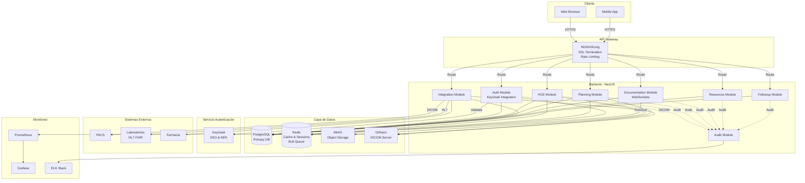
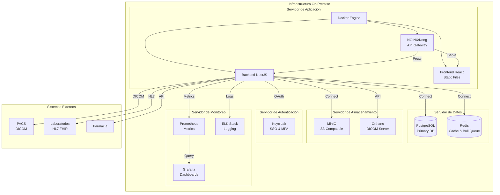
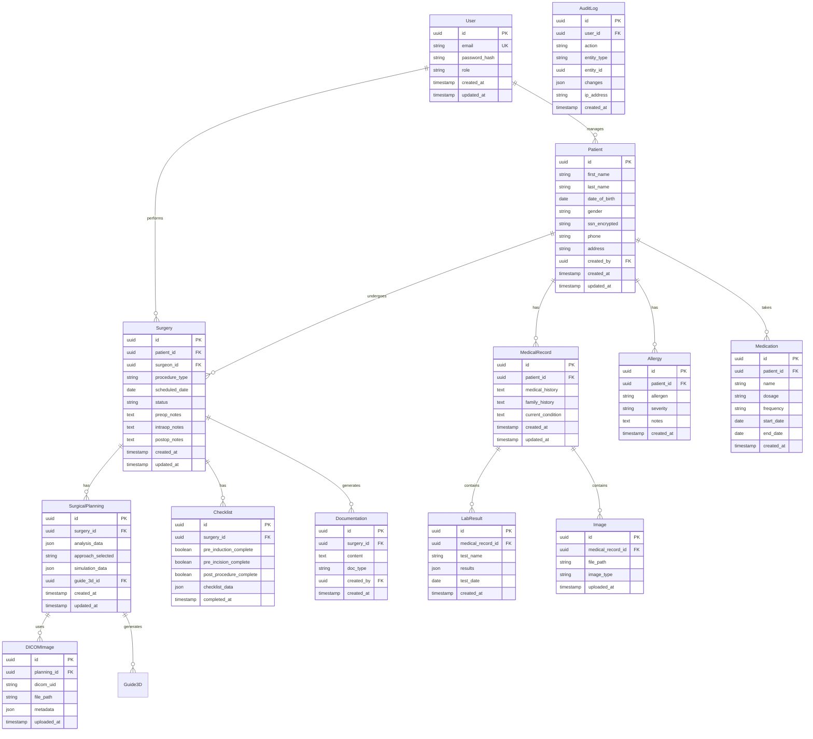

## Índice

0. [Ficha del proyecto](#0-ficha-del-proyecto)
1. [Descripción general del producto](#1-descripción-general-del-producto)
2. [Arquitectura del sistema](#2-arquitectura-del-sistema)
3. [Modelo de datos](#3-modelo-de-datos)
4. [Especificación de la API](#4-especificación-de-la-api)
5. [Historias de usuario](#5-historias-de-usuario)
6. [Tickets de trabajo](#6-tickets-de-trabajo)
7. [Pull requests](#7-pull-requests)

---

## 0. Ficha del proyecto

### **0.1. Nombre: Alejandro Estrella Gallego**

### **0.2. Nombre del proyecto:**
Sistema Integrado de Gestión Quirúrgica (SIGQ)

### **0.3. Descripción breve del proyecto:**
Sistema completo de gestión quirúrgica que integra Historia Clínica Electrónica (HCE), Planificación Quirúrgica avanzada con visualización 3D/VR, y Seguridad y Cumplimiento normativo (GDPR/LOPD). Desarrollado con Node.js + NestJS y React, optimizado para despliegue on-premise.

### **0.4. URL del proyecto:**

> Puede ser pública o privada, en cuyo caso deberás compartir los accesos de manera segura. Puedes enviarlos a [alvaro@lidr.co](mailto:alvaro@lidr.co) usando algún servicio como [onetimesecret](https://onetimesecret.com/).

### 0.5. URL o archivo comprimido del repositorio

> Puedes tenerlo alojado en público o en privado, en cuyo caso deberás compartir los accesos de manera segura. Puedes enviarlos a [alvaro@lidr.co](mailto:alvaro@lidr.co) usando algún servicio como [onetimesecret](https://onetimesecret.com/). También puedes compartir por correo un archivo zip con el contenido


---

## 1. Descripción general del producto

> Describe en detalle los siguientes aspectos del producto:

### **1.1. Objetivo:**

El Sistema Integrado de Gestión Quirúrgica (SIGQ) tiene como propósito optimizar y digitalizar todo el proceso quirúrgico, desde la consulta inicial hasta el alta y seguimiento del paciente.

**Valor que aporta:**
- **Eficiencia operativa**: Reducción de tiempos administrativos y mejora en la coordinación entre equipos médicos
- **Precisión quirúrgica**: Planificación preoperatoria avanzada con visualización 3D y simulación, reduciendo complicaciones
- **Seguridad del paciente**: Checklist quirúrgico WHO integrado, trazabilidad completa y documentación en tiempo real
- **Cumplimiento normativo**: Garantiza el cumplimiento de GDPR, LOPD y estándares médicos (HL7 FHIR, DICOM)

**Qué soluciona:**
- Fragmentación de información entre sistemas (HIS, PACS, laboratorios)
- Falta de planificación visual preoperatoria
- Documentación manual propensa a errores
- Dificultades en la auditoría y cumplimiento normativo
- Gestión ineficiente de recursos quirúrgicos

**Para quién:**
- **Cirujanos generales**: Herramientas de planificación y documentación quirúrgica
- **Equipos quirúrgicos**: Coordinación y comunicación en tiempo real
- **Administración hospitalaria**: Gestión de recursos y cumplimiento normativo
- **Pacientes**: Acceso seguro a su información médica

### **1.2. Características y funcionalidades principales:**

#### **📋 Historia Clínica Electrónica (HCE)**

- **Registro completo de pacientes**: Datos demográficos, antecedentes médicos, alergias, medicación actual
- **Integración con sistemas externos**: 
  - Laboratorios (resultados en tiempo real)
  - Radiología PACS (imágenes DICOM)
  - Farmacia (prescripciones electrónicas)
- **Documentación quirúrgica completa**:
  - Evaluación preoperatoria
  - Notas intraoperatorias en tiempo real
  - Seguimiento postoperatorio
  - Plan de alta e instrucciones
- **Búsqueda avanzada**: Filtros por múltiples criterios, historial cronológico
- **Exportación segura**: Cumplimiento GDPR para portabilidad de datos

#### **🎯 Planificación Quirúrgica**

- **Análisis de imágenes médicas**: 
  - Visualización DICOM integrada
  - Reconstrucción 3D de anatomía del paciente
  - Medición de distancias y volúmenes
- **Simulación preoperatoria**:
  - Visualización 3D interactiva
  - Realidad Virtual/Aumentada para planificación
  - Identificación de estructuras críticas
- **Guías quirúrgicas personalizadas**: 
  - Diseño de guías específicas por paciente
  - Integración con impresión 3D
- **Checklist quirúrgico WHO**: 
  - Pre-inducción anestésica
  - Pre-incisión
  - Post-procedimiento
- **Gestión de recursos**: 
  - Programación de quirófanos
  - Asignación de equipamiento y personal
  - Estimación de tiempos quirúrgicos

#### **🔒 Seguridad y Cumplimiento**

- **Autenticación robusta**:
  - Multi-factor authentication (MFA)
  - Single Sign-On (SSO) con Keycloak
  - Integración con LDAP/Active Directory
- **Control de acceso**:
  - Role-Based Access Control (RBAC)
  - Permisos granulares por módulo
  - Principio de menor privilegio
- **Encriptación**:
  - TLS 1.3 para comunicaciones
  - AES-256 para datos en reposo
  - Encriptación a nivel de columna en base de datos
- **Auditoría completa**:
  - Logging de todas las acciones (quién, qué, cuándo)
  - Trazabilidad completa del proceso
  - Alertas de accesos no autorizados
- **Cumplimiento normativo**:
  - GDPR/LOPD compliance
  - Derecho al olvido (soft delete)
  - Anonimización para investigación
  - Retención de datos configurable

#### **⚡ Funcionalidades Adicionales**

- **Tiempo real**: WebSockets para documentación intraoperatoria
- **Notificaciones**: Alertas de alergias, interacciones medicamentosas
- **Reportes y estadísticas**: Dashboards personalizables, métricas de calidad
- **Telemedicina**: Consultas virtuales y telementorización

### **1.3. Diseño y experiencia de usuario:**

El diseño del sistema prioriza la usabilidad y eficiencia, especialmente en contextos críticos como el quirófano.

**Flujo principal de usuario:**

1. **Autenticación y Dashboard**
   - Login con MFA
   - Dashboard personalizado según rol (cirujano, enfermería, administración)
   - Acceso rápido a pacientes activos y cirugías programadas

2. **Consulta y Registro de Paciente**
   - Interfaz intuitiva para registro de nuevos pacientes
   - Formularios inteligentes con validación en tiempo real
   - Búsqueda rápida de pacientes existentes
   - Vista consolidada de historia clínica completa

3. **Evaluación Preoperatoria**
   - Visualización de imágenes DICOM integrada
   - Herramientas de anotación y medición
   - Integración automática de resultados de laboratorio
   - Evaluación de riesgo con scores automáticos

4. **Planificación Quirúrgica**
   - Visualizador 3D interactivo con controles intuitivos
   - Simulación paso a paso del procedimiento
   - Generación de guías quirúrgicas
   - Checklist WHO integrado con validación

5. **Procedimiento Quirúrgico**
   - Interfaz optimizada para tablet/dispositivo móvil
   - Documentación en tiempo real con voz a texto
   - Navegación AR/VR para guías activas
   - Notificaciones de eventos críticos

6. **Seguimiento Postoperatorio**
   - Evolución diaria con plantillas predefinidas
   - Alertas de complicaciones
   - Plan de alta automatizado
   - Instrucciones personalizadas para el paciente

**Principios de diseño:**
- **Minimalismo**: Interfaz limpia sin distracciones
- **Accesibilidad**: Cumplimiento WCAG 2.1
- **Responsive**: Funciona en desktop, tablet y móvil
- **Modo oscuro**: Para uso en quirófanos con poca luz
- **Feedback inmediato**: Confirmaciones visuales de todas las acciones

### **1.4. Instrucciones de instalación:**

#### **Requisitos Previos**

- Node.js 18+ y npm 9+
- Docker y Docker Compose
- Git

#### **Instalación Local**

1. **Clonar el repositorio**
```bash
git clone <repository-url>
cd sistema-quirurgico
```

2. **Configurar variables de entorno**
```bash
cp .env.example .env
# Editar .env con las configuraciones necesarias
```

3. **Iniciar servicios con Docker Compose**
```bash
docker-compose up -d
```
Esto iniciará:
- PostgreSQL (puerto 5432)
- Redis (puerto 6379)
- MinIO (puerto 9000)
- Keycloak (puerto 8080)
- Orthanc (puerto 8042)

4. **Instalar dependencias del backend**
```bash
cd backend
npm install
```

5. **Configurar base de datos**
```bash
# Ejecutar migraciones
npm run migration:run

# Opcional: Cargar datos de prueba
npm run seed
```

6. **Iniciar backend**
```bash
npm run start:dev
```
El backend estará disponible en `http://localhost:3000`

7. **Instalar dependencias del frontend**
```bash
cd ../frontend
npm install
```

8. **Iniciar frontend**
```bash
npm run dev
```
El frontend estará disponible en `http://localhost:5173`

#### **Configuración Inicial**

1. **Keycloak**: Acceder a `http://localhost:8080` y configurar:
   - Realm: `sistema-quirurgico`
   - Clientes: `backend-api` y `frontend-app`
   - Roles: `cirujano`, `enfermeria`, `administrador`

2. **MinIO**: Acceder a `http://localhost:9000` y crear buckets:
   - `imagenes-medicas`
   - `documentos`
   - `fotos-pre-postop`

3. **Orthanc**: Configurar en `http://localhost:8042` para almacenamiento DICOM

#### **Verificación**

- Backend API: `http://localhost:3000/api`
- Documentación Swagger: `http://localhost:3000/api/docs`
- Frontend: `http://localhost:5173`
- Keycloak Admin: `http://localhost:8080/admin`

---

## 2. Arquitectura del Sistema

### **2.1. Diagrama de arquitectura:**



**Patrón arquitectónico**: Arquitectura modular con API Gateway (preparada para microservicios)

**Justificación de la arquitectura**:

- **Modularidad**: NestJS permite separar funcionalidades en módulos independientes (HCE, Planificación, Seguridad, Documentación, Recursos, Seguimiento), facilitando el mantenimiento y escalado
- **API Gateway (NGINX/Kong)**: Centraliza autenticación, rate limiting, SSL termination y enrutamiento, simplificando la gestión de múltiples servicios
- **Separación de responsabilidades**: Cada módulo tiene su propia lógica de negocio y acceso a datos, pero comparten la misma base de datos (PostgreSQL)
- **Escalabilidad**: Permite escalar módulos individuales según la demanda (ej: procesamiento de imágenes). La arquitectura modular facilita la migración a microservicios si es necesario
- **Tiempo real**: WebSockets integrados para documentación intraoperatoria y notificaciones
- **Procesamiento asíncrono**: Bull (Redis-based) para tareas pesadas como procesamiento de imágenes

**Beneficios**:
- ✅ Mantenibilidad: Código organizado y fácil de entender
- ✅ Testabilidad: Módulos independientes facilitan testing
- ✅ Escalabilidad: Escalar servicios según necesidad
- ✅ Flexibilidad: Agregar nuevos módulos sin afectar existentes
- ✅ Seguridad: Control centralizado de acceso

**Sacrificios/Déficits**:
- ⚠️ Complejidad inicial: Requiere más configuración que una aplicación monolítica
- ⚠️ Overhead de comunicación: Comunicación entre módulos puede añadir latencia (mitigado por arquitectura modular vs microservicios)
- ⚠️ Base de datos compartida: Todos los módulos comparten PostgreSQL (trade-off por simplicidad, puede migrarse a bases de datos separadas si se necesita)
- ⚠️ Gestión de transacciones distribuidas: Si se migra a microservicios, será más complejo que en monolitos

**Nota**: La arquitectura actual es modular (módulos NestJS) pero monolítica en despliegue. Esto facilita el desarrollo y mantenimiento para un equipo pequeño, mientras permite migrar a microservicios en el futuro si se necesita mayor escalabilidad.


### **2.2. Descripción de componentes principales:**

#### **Frontend - React + TypeScript**

- **Framework**: React 18+ con TypeScript
- **Estado**: Zustand para estado global, React Query para estado del servidor
- **Routing**: React Router v6
- **UI Components**: Material-UI o Ant Design
- **Visualización 3D**: Three.js / React Three Fiber
- **DICOM Viewer**: Cornerstone.js para visualización de imágenes médicas
- **WebSockets**: Socket.io-client para tiempo real (documentación intraoperatoria, notificaciones)
- **Estado del servidor**: React Query para sincronización con backend

#### **Backend - NestJS**

- **Framework**: NestJS 10+ (Node.js + TypeScript)
- **ORM**: TypeORM o Prisma para PostgreSQL
- **Autenticación**: Passport.js con estrategias JWT y Keycloak
- **Validación**: class-validator y class-transformer
- **Documentación**: @nestjs/swagger para OpenAPI
- **WebSockets**: @nestjs/websockets y @nestjs/platform-socket.io para tiempo real
- **Cola de trabajos**: Bull (Redis-based) para procesamiento asíncrono
- **Tareas programadas**: @nestjs/schedule para backups y limpieza

#### **Base de Datos - PostgreSQL**

- **Versión**: PostgreSQL 15+
- **Extensiones**: 
  - `pgcrypto`: Encriptación a nivel de columna
  - `pg_trgm`: Búsqueda de texto avanzada
  - `uuid-ossp`: Generación de UUIDs
- **Características**: JSONB para datos flexibles, full-text search

#### **Cache - Redis**

- **Versión**: Redis 7+
- **Uso**: 
  - Cache de sesiones
  - Cache de consultas frecuentes
  - Pub/Sub para notificaciones
  - Cola de trabajos (Bull)

#### **Almacenamiento de Objetos - MinIO**

- **Versión**: MinIO latest
- **Uso**: Almacenamiento de imágenes médicas, documentos PDF, fotos
- **Características**: S3-compatible, encriptación en reposo, versionado

#### **Servidor DICOM - Orthanc**

- **Versión**: Orthanc latest
- **Uso**: Almacenamiento y visualización de imágenes DICOM
- **API**: REST API para integración
- **Características**: Visualizador web integrado, conversión de formatos

#### **Autenticación - Keycloak**

- **Versión**: Keycloak 22+
- **Funcionalidades**: SSO, MFA, OAuth2/OIDC, RBAC
- **Integración**: LDAP/Active Directory

#### **API Gateway - NGINX/Kong**

- **NGINX**: Reverse proxy, load balancing, SSL termination, rate limiting
- **Kong** (opcional): API Gateway con plugins avanzados para casos más complejos
- **Funciones**: 
  - Enrutamiento de peticiones a módulos backend
  - Terminación SSL/TLS
  - Rate limiting y protección DDoS
  - Servir archivos estáticos del frontend

#### **Monitoreo - Prometheus + Grafana**

- **Prometheus**: Métricas y alertas
- **Grafana**: Dashboards y visualización
- **ELK Stack**: Logging centralizado (Elasticsearch, Logstash, Kibana)
- **Alternativa ligera**: Loki + Grafana (más fácil de mantener para equipo pequeño)

#### **Cola de Mensajes - Bull (Redis-based)**

- **Bull**: Cola de trabajos basada en Redis
- **Uso**: 
  - Procesamiento asíncrono de imágenes DICOM
  - Integración con sistemas externos
  - Eventos de auditoría
  - Tareas programadas (backups, limpieza)

### **2.3. Descripción de alto nivel del proyecto y estructura de ficheros**

```
sistema-quirurgico/
├── backend/                    # Aplicación NestJS
│   ├── src/
│   │   ├── modules/            # Módulos de negocio
│   │   │   ├── hce/           # Módulo Historia Clínica Electrónica
│   │   │   │   ├── hce.controller.ts
│   │   │   │   ├── hce.service.ts
│   │   │   │   ├── hce.module.ts
│   │   │   │   ├── dto/       # Data Transfer Objects
│   │   │   │   └── entities/  # Entidades TypeORM
│   │   │   ├── planning/      # Módulo Planificación Quirúrgica
│   │   │   │   ├── planning.controller.ts
│   │   │   │   ├── planning.service.ts
│   │   │   │   ├── planning.module.ts
│   │   │   │   └── services/
│   │   │   │       └── dicom.service.ts
│   │   │   ├── documentation/ # Módulo Documentación Intraoperatoria
│   │   │   │   ├── documentation.controller.ts
│   │   │   │   ├── documentation.service.ts
│   │   │   │   ├── documentation.gateway.ts
│   │   │   │   └── documentation.module.ts
│   │   │   ├── resources/     # Módulo Gestión de Recursos
│   │   │   │   ├── resources.controller.ts
│   │   │   │   ├── resources.service.ts
│   │   │   │   └── resources.module.ts
│   │   │   ├── followup/      # Módulo Seguimiento Postoperatorio
│   │   │   │   ├── followup.controller.ts
│   │   │   │   ├── followup.service.ts
│   │   │   │   └── followup.module.ts
│   │   │   ├── auth/          # Módulo Autenticación
│   │   │   │   ├── auth.controller.ts
│   │   │   │   ├── auth.service.ts
│   │   │   │   └── auth.module.ts
│   │   │   ├── integration/   # Módulo Integración Externa
│   │   │   │   ├── integration.controller.ts
│   │   │   │   ├── integration.service.ts
│   │   │   │   └── integration.module.ts
│   │   │   └── audit/         # Módulo Auditoría
│   │   │       ├── audit.service.ts
│   │   │       └── audit.module.ts
│   │   ├── common/            # Código compartido
│   │   │   ├── decorators/    # Decoradores personalizados
│   │   │   ├── guards/        # Guards de seguridad
│   │   │   ├── interceptors/  # Interceptores (logging, transformación)
│   │   │   └── filters/       # Exception filters
│   │   ├── config/            # Configuración
│   │   │   ├── database.config.ts
│   │   │   ├── security.config.ts
│   │   │   └── app.config.ts
│   │   ├── database/         # Base de datos
│   │   │   ├── migrations/    # Migraciones TypeORM
│   │   │   └── seeds/         # Datos de prueba
│   │   ├── app.module.ts      # Módulo raíz
│   │   └── main.ts            # Punto de entrada
│   ├── test/                  # Tests
│   ├── package.json
│   ├── tsconfig.json
│   └── nest-cli.json
├── frontend/                  # Aplicación React
│   ├── src/
│   │   ├── components/       # Componentes reutilizables
│   │   ├── pages/             # Páginas/Views
│   │   ├── services/          # Servicios API
│   │   ├── hooks/             # Custom hooks
│   │   ├── store/             # Estado global (Zustand)
│   │   ├── utils/             # Utilidades
│   │   └── App.tsx
│   ├── public/
│   ├── package.json
│   └── vite.config.ts
├── docker/                     # Configuración Docker
│   ├── docker-compose.yml
│   ├── Dockerfile.backend
│   └── Dockerfile.frontend
├── infrastructure/            # Infraestructura
│   ├── nginx/
│   ├── keycloak/
│   └── monitoring/
└── docs/                      # Documentación
```

**Patrón arquitectónico**: Clean Architecture / Hexagonal Architecture

- **Separación por capas**: Presentación (controllers), Lógica de negocio (services), Datos (entities/repositories)
- **Dependency Injection**: NestJS gestiona las dependencias automáticamente
- **Modularidad**: Cada módulo es independiente y puede desarrollarse por separado
- **DTOs**: Separación entre entidades de dominio y objetos de transferencia

### **2.4. Infraestructura y despliegue**



**Proceso de despliegue**:

1. **Preparación del servidor**
   - Instalar Docker y Docker Compose
   - Configurar red interna
   - Preparar volúmenes para datos persistentes

2. **Configuración**
   - Clonar repositorio
   - Configurar variables de entorno (.env)
   - Configurar certificados SSL/TLS

3. **Despliegue con Docker Compose**
```bash
docker-compose -f docker-compose.prod.yml up -d
```

4. **Migraciones de base de datos**
```bash
docker-compose exec backend npm run migration:run
```

5. **Configuración inicial**
   - Configurar Keycloak (realm, clientes, roles)
   - Crear buckets en MinIO
   - Configurar Orthanc

6. **Verificación**
   - Health checks de todos los servicios
   - Pruebas de conectividad
   - Verificación de certificados SSL

**Backup y recuperación**:
- Backups diarios automáticos de PostgreSQL
- Replicación de MinIO para alta disponibilidad
- Scripts de recuperación ante desastres

### **2.5. Seguridad**

#### **Autenticación y Autorización**

- **Multi-Factor Authentication (MFA)**: Implementado con Keycloak, soporta TOTP y SMS
- **Single Sign-On (SSO)**: Integración con sistemas corporativos existentes
- **JWT Tokens**: Tokens de acceso con expiración corta (15 min) y refresh tokens
- **Role-Based Access Control (RBAC)**: Roles definidos (cirujano, enfermería, administrador) con permisos granulares

**Ejemplo de guard en NestJS**:
```typescript
@UseGuards(JwtAuthGuard, RolesGuard)
@Roles('cirujano', 'administrador')
@Get('patients/:id')
async getPatient(@Param('id') id: string) {
  // Solo cirujanos y administradores pueden acceder
}
```

#### **Encriptación**

- **TLS 1.3**: Todas las comunicaciones encriptadas
- **AES-256**: Datos en reposo encriptados (PostgreSQL pgcrypto, MinIO)
- **Encriptación de campos sensibles**: Datos como números de seguridad social encriptados a nivel de columna

**Ejemplo de encriptación en base de datos**:
```sql
CREATE TABLE patients (
  id UUID PRIMARY KEY,
  ssn_encrypted BYTEA, -- Encriptado con pgcrypto
  ...
);
```

#### **Auditoría y Logging**

- **Logging de todas las acciones**: Quién, qué, cuándo, desde dónde
- **Trazabilidad completa**: Cada modificación de datos registrada
- **Alertas de seguridad**: Notificaciones de accesos sospechosos o fallidos

**Ejemplo de interceptor de auditoría**:
```typescript
@Injectable()
export class AuditInterceptor implements NestInterceptor {
  intercept(context: ExecutionContext, next: CallHandler) {
    // Registrar acción en base de datos de auditoría
    return next.handle();
  }
}
```

#### **Protección contra vulnerabilidades**

- **Helmet.js**: Headers de seguridad HTTP
- **Rate Limiting**: Protección contra ataques de fuerza bruta
- **CORS configurado**: Solo dominios permitidos
- **Validación de entrada**: class-validator en todos los DTOs
- **SQL Injection**: Prevenido mediante ORM (TypeORM/Prisma)

#### **Cumplimiento Normativo**

- **GDPR/LOPD**: 
  - Derecho al olvido (soft delete)
  - Portabilidad de datos
  - Consentimiento explícito
- **HL7 FHIR**: Estándares de interoperabilidad
- **DICOM**: Estándar para imágenes médicas

### **2.6. Tests**

#### **Backend - Jest + NestJS Testing**

- **Tests unitarios**: Servicios y lógica de negocio aislada
- **Tests de integración**: APIs y base de datos
- **Tests E2E**: Flujos completos de usuario

**Ejemplo de test unitario**:
```typescript
describe('HCE Service', () => {
  it('should create a new patient', async () => {
    const patient = await hceService.createPatient(createPatientDto);
    expect(patient).toBeDefined();
    expect(patient.id).toBeDefined();
  });
});
```

**Cobertura objetivo**: >80% en servicios críticos

#### **Frontend - Jest + React Testing Library + Playwright**

- **Tests unitarios**: Componentes individuales
- **Tests de integración**: Flujos de usuario
- **Tests E2E**: Playwright para escenarios completos

**Ejemplo de test E2E**:
```typescript
test('should complete surgical planning workflow', async ({ page }) => {
  await page.goto('/planning');
  await page.fill('[name="patientId"]', '123');
  await page.click('button[type="submit"]');
  await expect(page.locator('.success-message')).toBeVisible();
});
```

#### **Tests de Seguridad**

- Tests de autenticación y autorización
- Tests de validación de entrada
- Tests de encriptación
- Tests de auditoría

---

## 3. Modelo de Datos

### **3.1. Diagrama del modelo de datos:**




### **3.2. Descripción de entidades principales:**

#### **User (Usuario)**

**Propósito**: Almacena información de usuarios del sistema (cirujanos, enfermería, administradores)

**Atributos**:
- `id` (UUID, PK): Identificador único
- `email` (VARCHAR(255), UK, NOT NULL): Email único para login
- `password_hash` (VARCHAR(255), NOT NULL): Hash de contraseña (bcrypt)
- `role` (ENUM, NOT NULL): Rol del usuario (cirujano, enfermeria, administrador)
- `created_at` (TIMESTAMP, NOT NULL): Fecha de creación
- `updated_at` (TIMESTAMP): Última actualización

**Relaciones**:
- One-to-Many con `Patient` (created_by)
- One-to-Many con `Surgery` (surgeon_id)

#### **Patient (Paciente)**

**Propósito**: Información demográfica y básica del paciente

**Atributos**:
- `id` (UUID, PK): Identificador único
- `first_name` (VARCHAR(100), NOT NULL): Nombre
- `last_name` (VARCHAR(100), NOT NULL): Apellidos
- `date_of_birth` (DATE, NOT NULL): Fecha de nacimiento
- `gender` (ENUM, NOT NULL): Género (M, F, Other)
- `ssn_encrypted` (BYTEA): Número de seguridad social encriptado
- `phone` (VARCHAR(20)): Teléfono de contacto
- `address` (TEXT): Dirección
- `created_by` (UUID, FK → User.id): Usuario que creó el registro
- `created_at` (TIMESTAMP, NOT NULL)
- `updated_at` (TIMESTAMP)

**Relaciones**:
- Many-to-One con `User` (created_by)
- One-to-Many con `MedicalRecord`
- One-to-Many con `Surgery`
- One-to-Many con `Allergy`
- One-to-Many con `Medication`

#### **MedicalRecord (Historia Clínica)**

**Propósito**: Historia clínica electrónica del paciente

**Atributos**:
- `id` (UUID, PK)
- `patient_id` (UUID, FK → Patient.id, NOT NULL)
- `medical_history` (TEXT): Antecedentes médicos
- `family_history` (TEXT): Antecedentes familiares
- `current_condition` (TEXT): Condición actual
- `created_at` (TIMESTAMP, NOT NULL)
- `updated_at` (TIMESTAMP)

**Relaciones**:
- Many-to-One con `Patient`
- One-to-Many con `LabResult`
- One-to-Many con `Image`

#### **Surgery (Cirugía)**

**Propósito**: Información de procedimientos quirúrgicos

**Atributos**:
- `id` (UUID, PK)
- `patient_id` (UUID, FK → Patient.id, NOT NULL)
- `surgeon_id` (UUID, FK → User.id, NOT NULL)
- `procedure_type` (VARCHAR(100), NOT NULL): Tipo de procedimiento
- `scheduled_date` (TIMESTAMP, NOT NULL): Fecha programada
- `status` (ENUM, NOT NULL): Estado (scheduled, in_progress, completed, cancelled)
- `preop_notes` (TEXT): Notas preoperatorias
- `intraop_notes` (TEXT): Notas intraoperatorias
- `postop_notes` (TEXT): Notas postoperatorias
- `created_at` (TIMESTAMP, NOT NULL)
- `updated_at` (TIMESTAMP)

**Relaciones**:
- Many-to-One con `Patient`
- Many-to-One con `User` (surgeon)
- One-to-One con `SurgicalPlanning`
- One-to-One con `Checklist`
- One-to-Many con `Documentation`

#### **SurgicalPlanning (Planificación Quirúrgica)**

**Propósito**: Planificación preoperatoria con análisis 3D y simulación

**Atributos**:
- `id` (UUID, PK)
- `surgery_id` (UUID, FK → Surgery.id, NOT NULL, UK)
- `analysis_data` (JSONB): Datos de análisis de imágenes
- `approach_selected` (VARCHAR(100)): Abordaje quirúrgico seleccionado
- `simulation_data` (JSONB): Datos de simulación 3D
- `guide_3d_id` (UUID, FK): Referencia a guía 3D generada
- `created_at` (TIMESTAMP, NOT NULL)
- `updated_at` (TIMESTAMP)

**Relaciones**:
- One-to-One con `Surgery`
- One-to-Many con `DICOMImage`

#### **Checklist (Checklist Quirúrgico)**

**Propósito**: Checklist WHO para seguridad quirúrgica

**Atributos**:
- `id` (UUID, PK)
- `surgery_id` (UUID, FK → Surgery.id, NOT NULL, UK)
- `pre_induction_complete` (BOOLEAN, DEFAULT false)
- `pre_incision_complete` (BOOLEAN, DEFAULT false)
- `post_procedure_complete` (BOOLEAN, DEFAULT false)
- `checklist_data` (JSONB): Datos detallados del checklist
- `completed_at` (TIMESTAMP): Fecha de finalización

**Relaciones**:
- One-to-One con `Surgery`

#### **AuditLog (Log de Auditoría)**

**Propósito**: Registro de todas las acciones para cumplimiento normativo

**Atributos**:
- `id` (UUID, PK)
- `user_id` (UUID, FK → User.id, NOT NULL)
- `action` (VARCHAR(50), NOT NULL): Acción realizada (CREATE, UPDATE, DELETE, VIEW)
- `entity_type` (VARCHAR(50), NOT NULL): Tipo de entidad afectada
- `entity_id` (UUID): ID de la entidad afectada
- `changes` (JSONB): Cambios realizados (antes/después)
- `ip_address` (VARCHAR(45)): IP desde donde se realizó la acción
- `created_at` (TIMESTAMP, NOT NULL)

**Relaciones**:
- Many-to-One con `User`

**Índices importantes**:
- Índice en `(user_id, created_at)` para búsquedas por usuario
- Índice en `(entity_type, entity_id)` para búsquedas por entidad
- Índice en `created_at` para consultas temporales

---

## 4. Especificación de la API

### **Endpoint 1: Crear/Registrar Paciente**

**POST** `/api/v1/hce/patients`

**Descripción**: Crea un nuevo registro de paciente en el sistema HCE

**Autenticación**: Requerida (JWT Bearer Token)

**Request Body**:
```json
{
  "firstName": "Juan",
  "lastName": "Pérez García",
  "dateOfBirth": "1985-05-15",
  "gender": "M",
  "ssn": "12345678A",
  "phone": "+34 600 123 456",
  "address": "Calle Principal 123, Madrid"
}
```

**Response 201 Created**:
```json
{
  "id": "550e8400-e29b-41d4-a716-446655440000",
  "firstName": "Juan",
  "lastName": "Pérez García",
  "dateOfBirth": "1985-05-15",
  "gender": "M",
  "phone": "+34 600 123 456",
  "address": "Calle Principal 123, Madrid",
  "createdAt": "2024-01-15T10:30:00Z",
  "createdBy": {
    "id": "user-uuid",
    "email": "cirujano@hospital.com"
  }
}
```

**Errores**:
- `400 Bad Request`: Datos inválidos
- `401 Unauthorized`: Token inválido o expirado
- `403 Forbidden`: Sin permisos suficientes
- `409 Conflict`: Paciente ya existe (SSN duplicado)

---

### **Endpoint 2: Crear Planificación Quirúrgica**

**POST** `/api/v1/planning/surgeries/:surgeryId/planning`

**Descripción**: Crea una planificación quirúrgica con análisis de imágenes DICOM

**Autenticación**: Requerida (JWT Bearer Token)

**Roles permitidos**: `cirujano`, `administrador`

**Path Parameters**:
- `surgeryId` (UUID): ID de la cirugía

**Request Body**:
```json
{
  "dicomImageIds": [
    "dicom-uuid-1",
    "dicom-uuid-2"
  ],
  "approach": "laparoscopic",
  "notes": "Análisis inicial de imágenes muestra estructura normal",
  "simulationData": {
    "viewAngle": 45,
    "highlightedStructures": ["liver", "gallbladder"]
  }
}
```

**Response 201 Created**:
```json
{
  "id": "planning-uuid",
  "surgeryId": "surgery-uuid",
  "analysisData": {
    "imagesAnalyzed": 2,
    "findings": "No anomalies detected",
    "riskScore": 2
  },
  "approach": "laparoscopic",
  "simulationData": {
    "viewAngle": 45,
    "highlightedStructures": ["liver", "gallbladder"]
  },
  "createdAt": "2024-01-15T11:00:00Z",
  "updatedAt": "2024-01-15T11:00:00Z"
}
```

**Errores**:
- `400 Bad Request`: Datos inválidos o cirugía no existe
- `401 Unauthorized`: Token inválido
- `403 Forbidden`: Rol insuficiente
- `404 Not Found`: Cirugía no encontrada

---

### **Endpoint 3: Actualizar Checklist Quirúrgico**

**PATCH** `/api/v1/planning/surgeries/:surgeryId/checklist`

**Descripción**: Actualiza el checklist quirúrgico WHO durante el procedimiento

**Autenticación**: Requerida (JWT Bearer Token)

**Roles permitidos**: `cirujano`, `enfermeria`

**Path Parameters**:
- `surgeryId` (UUID): ID de la cirugía

**Request Body**:
```json
{
  "phase": "pre_incision",
  "completed": true,
  "checklistItems": {
    "teamIntroduced": true,
    "risksReviewed": true,
    "antibioticProphylaxis": true,
    "concernsAddressed": true
  },
  "notes": "Todo el equipo presente, riesgos revisados"
}
```

**Response 200 OK**:
```json
{
  "id": "checklist-uuid",
  "surgeryId": "surgery-uuid",
  "preInductionComplete": true,
  "preIncisionComplete": true,
  "postProcedureComplete": false,
  "checklistData": {
    "pre_induction": {
      "completedAt": "2024-01-15T12:00:00Z",
      "items": {...}
    },
    "pre_incision": {
      "completedAt": "2024-01-15T12:15:00Z",
      "items": {
        "teamIntroduced": true,
        "risksReviewed": true,
        "antibioticProphylaxis": true,
        "concernsAddressed": true
      }
    }
  },
  "updatedAt": "2024-01-15T12:15:00Z"
}
```

**Errores**:
- `400 Bad Request`: Fase inválida o datos incorrectos
- `401 Unauthorized`: Token inválido
- `403 Forbidden`: Rol insuficiente
- `404 Not Found`: Cirugía o checklist no encontrado

---

**Documentación completa**: Disponible en `/api/docs` (Swagger UI) cuando el servidor está en ejecución

---

## 5. Historias de Usuario

### **Historia de Usuario 1: Autenticación Segura con MFA**

**Como** usuario del sistema (cirujano, enfermería, administrador)  
**Quiero** autenticarme de forma segura con multi-factor authentication  
**Para** proteger el acceso a información médica sensible

**Criterios de Aceptación**:
- ✅ Puedo iniciar sesión con email y contraseña
- ✅ El sistema requiere un segundo factor de autenticación (TOTP o SMS)
- ✅ Puedo configurar MFA desde mi perfil
- ✅ El sistema recuerda el dispositivo durante 30 días
- ✅ Recibo alertas de accesos desde nuevos dispositivos
- ✅ Puedo recuperar mi cuenta si pierdo acceso al MFA

**Prioridad**: Crítica  
**Estimación**: 5 story points  
**Epic**: Seguridad y Autenticación

---

### **Historia de Usuario 2: Registro Completo de Paciente en HCE**

**Como** cirujano general  
**Quiero** registrar un nuevo paciente con todos sus datos demográficos y clínicos  
**Para** tener una historia clínica completa y actualizada

**Criterios de Aceptación**:
- ✅ Puedo crear un nuevo paciente con datos demográficos (nombre, fecha nacimiento, género, SSN)
- ✅ Puedo agregar antecedentes médicos y quirúrgicos
- ✅ Puedo registrar antecedentes familiares relevantes
- ✅ Puedo agregar alergias con severidad y notas
- ✅ Puedo registrar medicación actual con dosis y frecuencia
- ✅ El sistema valida que no exista un paciente duplicado (por SSN)
- ✅ Todos los datos sensibles se encriptan automáticamente
- ✅ Puedo buscar pacientes existentes por múltiples criterios

**Prioridad**: Alta  
**Estimación**: 8 story points  
**Epic**: Historia Clínica Electrónica

---

### **Historia de Usuario 3: Integración con Sistemas Externos (Lab, PACS, Farmacia)**

**Como** cirujano general  
**Quiero** que el sistema integre automáticamente resultados de laboratorio, imágenes DICOM y prescripciones  
**Para** tener toda la información del paciente centralizada sin duplicar trabajo

**Criterios de Aceptación**:
- ✅ Los resultados de laboratorio se integran automáticamente vía HL7
- ✅ Las imágenes DICOM del PACS se muestran en la HCE del paciente
- ✅ Las prescripciones de farmacia se sincronizan automáticamente
- ✅ Puedo ver el historial completo de resultados e imágenes
- ✅ Recibo notificaciones cuando hay nuevos resultados disponibles
- ✅ Puedo exportar datos en formato estándar (HL7 FHIR)
- ✅ La integración es segura y encriptada

**Prioridad**: Alta  
**Estimación**: 13 story points  
**Epic**: Integración de Sistemas

---

### **Historia de Usuario 4: Evaluación Preoperatoria Completa**

**Como** cirujano general  
**Quiero** realizar una evaluación preoperatoria completa del paciente  
**Para** determinar el riesgo quirúrgico y preparar adecuadamente la cirugía

**Criterios de Aceptación**:
- ✅ Puedo registrar el examen físico preoperatorio
- ✅ El sistema calcula automáticamente el score ASA
- ✅ Puedo revisar todos los resultados de laboratorio preoperatorios
- ✅ Puedo visualizar imágenes DICOM relevantes
- ✅ El sistema alerta sobre alergias o contraindicaciones
- ✅ Puedo generar el consentimiento informado
- ✅ La evaluación se guarda en la HCE del paciente

**Prioridad**: Alta  
**Estimación**: 8 story points  
**Epic**: Evaluación Preoperatoria

---

### **Historia de Usuario 5: Análisis de Imágenes DICOM y Reconstrucción 3D**

**Como** cirujano general  
**Quiero** analizar las imágenes DICOM del paciente y generar una reconstrucción 3D  
**Para** visualizar mejor la anatomía antes de la cirugía

**Criterios de Aceptación**:
- ✅ Puedo cargar imágenes DICOM desde PACS o subirlas directamente
- ✅ Puedo visualizar imágenes en múltiples planos (axial, coronal, sagital)
- ✅ El sistema genera automáticamente una reconstrucción 3D
- ✅ Puedo rotar, hacer zoom y navegar por el modelo 3D
- ✅ Puedo medir distancias y volúmenes en el modelo
- ✅ Puedo marcar estructuras anatómicas importantes
- ✅ El modelo 3D se guarda asociado al paciente

**Prioridad**: Alta  
**Estimación**: 13 story points  
**Epic**: Planificación Quirúrgica

---

### **Historia de Usuario 6: Simulación Quirúrgica y Selección de Abordaje**

**Como** cirujano general  
**Quiero** simular diferentes abordajes quirúrgicos en el modelo 3D  
**Para** elegir la mejor estrategia antes de la cirugía real

**Criterios de Aceptación**:
- ✅ Puedo simular diferentes abordajes quirúrgicos en el modelo 3D
- ✅ Puedo visualizar la trayectoria del abordaje seleccionado
- ✅ Puedo comparar diferentes opciones de abordaje
- ✅ El sistema identifica posibles complicaciones para cada abordaje
- ✅ Puedo guardar la simulación seleccionada
- ✅ Puedo generar guías quirúrgicas personalizadas basadas en la simulación
- ✅ La simulación se asocia a la planificación quirúrgica

**Prioridad**: Alta  
**Estimación**: 10 story points  
**Epic**: Planificación Quirúrgica

---

### **Historia de Usuario 7: Checklist Quirúrgico WHO**

**Como** equipo quirúrgico  
**Quiero** completar el checklist de seguridad quirúrgica WHO en cada fase  
**Para** reducir errores y mejorar la seguridad del paciente

**Criterios de Aceptación**:
- ✅ Puedo acceder al checklist antes de la inducción anestésica
- ✅ Puedo completar el checklist pre-incisión con todo el equipo
- ✅ Puedo completar el checklist post-procedimiento
- ✅ El sistema valida que todos los ítems requeridos estén completados
- ✅ El checklist se guarda automáticamente en cada fase
- ✅ Puedo ver el historial completo de checklists de la cirugía
- ✅ El sistema alerta si falta algún ítem crítico

**Prioridad**: Crítica  
**Estimación**: 8 story points  
**Epic**: Procedimiento Quirúrgico

---

### **Historia de Usuario 8: Asignación de Recursos Quirúrgicos**

**Como** administrador o coordinador quirúrgico  
**Quiero** asignar recursos (quirófano, equipamiento, personal) para cada cirugía  
**Para** optimizar el uso de recursos y programar eficientemente

**Criterios de Aceptación**:
- ✅ Puedo programar una cirugía en un quirófano disponible
- ✅ Puedo asignar equipamiento necesario para la cirugía
- ✅ Puedo asignar personal (cirujano, anestesiólogo, enfermería)
- ✅ El sistema valida conflictos de horarios y recursos
- ✅ Recibo notificaciones de confirmación de recursos
- ✅ Puedo ver el calendario completo de quirófanos
- ✅ Puedo reasignar recursos si es necesario

**Prioridad**: Media  
**Estimación**: 8 story points  
**Epic**: Gestión de Recursos

---

### **Historia de Usuario 9: Documentación Intraoperatoria en Tiempo Real**

**Como** cirujano durante una cirugía  
**Quiero** documentar el procedimiento en tiempo real usando voz o entrada rápida  
**Para** tener un registro preciso sin interrumpir el flujo quirúrgico

**Criterios de Aceptación**:
- ✅ Puedo acceder a la documentación de la cirugía desde un dispositivo móvil/tablet
- ✅ Puedo usar dictado por voz para documentar notas
- ✅ Puedo agregar notas intraoperatorias en tiempo real
- ✅ Las notas se guardan automáticamente sin necesidad de guardar manualmente
- ✅ Puedo ver las guías quirúrgicas 3D mientras documento
- ✅ Puedo registrar complicaciones o eventos durante la cirugía
- ✅ El sistema registra quién y cuándo se realizó cada acción (auditoría)

**Prioridad**: Crítica  
**Estimación**: 10 story points  
**Epic**: Procedimiento Quirúrgico

---

### **Historia de Usuario 10: Seguimiento Postoperatorio**

**Como** cirujano o enfermería  
**Quiero** registrar la evolución postoperatoria del paciente diariamente  
**Para** monitorear la recuperación y detectar complicaciones tempranamente

**Criterios de Aceptación**:
- ✅ Puedo registrar notas de evolución diaria
- ✅ Puedo registrar complicaciones si las hay
- ✅ Puedo actualizar la medicación postoperatoria
- ✅ Puedo registrar resultados de pruebas postoperatorias
- ✅ El sistema genera alertas si detecta signos de complicación
- ✅ Puedo ver el historial completo de evolución
- ✅ Las notas se asocian automáticamente a la cirugía

**Prioridad**: Alta  
**Estimación**: 8 story points  
**Epic**: Seguimiento Postoperatorio

---

### **Historia de Usuario 11: Alta Médica y Plan de Seguimiento**

**Como** cirujano  
**Quiero** generar el plan de alta médica con instrucciones personalizadas  
**Para** asegurar que el paciente tenga toda la información necesaria para su recuperación

**Criterios de Aceptación**:
- ✅ Puedo generar un plan de alta médica completo
- ✅ Puedo agregar instrucciones personalizadas para el paciente
- ✅ Puedo programar citas de seguimiento
- ✅ El sistema genera automáticamente un resumen de la cirugía
- ✅ Puedo exportar el plan de alta en PDF
- ✅ El paciente puede acceder a su plan de alta desde el portal
- ✅ El historial completo se archiva en la HCE

**Prioridad**: Alta  
**Estimación**: 8 story points  
**Epic**: Alta Médica

---

### **Historia de Usuario 12: Reportes y Estadísticas**

**Como** administrador o cirujano  
**Quiero** generar reportes y ver estadísticas de mi actividad quirúrgica  
**Para** analizar resultados, mejorar procesos y cumplir con requisitos de calidad

**Criterios de Aceptación**:
- ✅ Puedo generar reportes de cirugías realizadas
- ✅ Puedo ver estadísticas de complicaciones
- ✅ Puedo analizar tiempos quirúrgicos vs planificados
- ✅ Puedo exportar reportes en diferentes formatos (PDF, Excel)
- ✅ Puedo filtrar reportes por fecha, tipo de procedimiento, cirujano
- ✅ El sistema genera dashboards personalizables
- ✅ Los reportes respetan la privacidad y anonimización de datos

**Prioridad**: Media  
**Estimación**: 8 story points  
**Epic**: Reportes y Análisis

---

## 6. Tickets de Trabajo

### **Ticket 1: Backend - Sistema de Autenticación con MFA**

**Tipo**: Backend  
**Prioridad**: Crítica  
**Estimación**: 5 días  
**Historia de Usuario**: HU-1

**Descripción**:
Implementar sistema de autenticación seguro con multi-factor authentication (MFA) usando Keycloak, incluyendo integración con JWT y gestión de sesiones.

**Tareas**:
1. Configurar Keycloak en Docker Compose
2. Crear realm y clientes en Keycloak
3. Implementar estrategia Passport para Keycloak
4. Crear módulo de autenticación NestJS
5. Implementar endpoints de login y refresh token
6. Integrar MFA (TOTP) con Keycloak
7. Implementar guard de autenticación JWT
8. Agregar interceptor para manejo de errores de autenticación
9. Implementar logout y revocación de tokens
10. Escribir tests de autenticación

**Criterios de Aceptación**:
- ✅ Login con email/password funciona
- ✅ MFA se requiere en primer login
- ✅ Tokens JWT se generan y validan correctamente
- ✅ Refresh tokens funcionan
- ✅ Logout invalida tokens
- ✅ Tests con cobertura >85%

**Archivos a crear/modificar**:
- `backend/src/modules/auth/auth.module.ts`
- `backend/src/modules/auth/auth.service.ts`
- `backend/src/modules/auth/auth.controller.ts`
- `backend/src/common/guards/jwt-auth.guard.ts`
- `docker/docker-compose.yml` (Keycloak)

---

### **Ticket 2: Backend - Módulo HCE con Registro Completo de Pacientes**

**Tipo**: Backend  
**Prioridad**: Alta  
**Estimación**: 6 días  
**Historia de Usuario**: HU-2

**Descripción**:
Implementar módulo completo de Historia Clínica Electrónica con registro de pacientes, antecedentes, alergias y medicación.

**Tareas**:
1. Crear entidades: `Patient`, `MedicalRecord`, `Allergy`, `Medication`
2. Crear DTOs con validación completa
3. Implementar `HceService` con CRUD completo
4. Implementar búsqueda avanzada con filtros
5. Implementar encriptación de SSN
6. Agregar endpoints REST completos
7. Implementar interceptor de auditoría
8. Agregar validación de duplicados (SSN)
9. Escribir tests unitarios y de integración

**Criterios de Aceptación**:
- ✅ Todos los endpoints CRUD funcionan
- ✅ Búsqueda con múltiples filtros
- ✅ SSN encriptado correctamente
- ✅ Validación de duplicados
- ✅ Auditoría completa
- ✅ Tests >80% cobertura

**Archivos a crear/modificar**:
- `backend/src/modules/hce/entities/*.ts`
- `backend/src/modules/hce/dto/*.ts`
- `backend/src/modules/hce/hce.service.ts`
- `backend/src/modules/hce/hce.controller.ts`
- `backend/src/database/migrations/001-create-hce-tables.ts`

---

### **Ticket 3: Backend - Integración con Sistemas Externos (HL7, DICOM)**

**Tipo**: Backend  
**Prioridad**: Alta  
**Estimación**: 8 días  
**Historia de Usuario**: HU-3

**Descripción**:
Implementar integración con sistemas externos: laboratorios (HL7), PACS (DICOM), y farmacia, con sincronización automática de datos.

**Tareas**:
1. Crear módulo de integración
2. Implementar cliente HL7 FHIR para laboratorios
3. Integrar con Orthanc (servidor DICOM) vía API REST
4. Implementar webhook para recibir resultados de laboratorio
5. Crear servicio de sincronización automática
6. Implementar almacenamiento de imágenes DICOM
7. Agregar manejo de errores y reintentos
8. Implementar logging de integraciones
9. Escribir tests de integración

**Criterios de Aceptación**:
- ✅ Resultados de laboratorio se integran automáticamente
- ✅ Imágenes DICOM se cargan desde PACS
- ✅ Prescripciones se sincronizan
- ✅ Manejo robusto de errores
- ✅ Logging completo de integraciones
- ✅ Tests de integración pasan

**Archivos a crear/modificar**:
- `backend/src/modules/integration/integration.module.ts`
- `backend/src/modules/integration/services/hl7.service.ts`
- `backend/src/modules/integration/services/dicom.service.ts`
- `backend/src/modules/integration/services/pharmacy.service.ts`
- `backend/src/modules/integration/integration.controller.ts`

---

### **Ticket 4: Backend - Módulo de Planificación Quirúrgica**

**Tipo**: Backend  
**Prioridad**: Alta  
**Estimación**: 7 días  
**Historia de Usuario**: HU-5, HU-6

**Descripción**:
Implementar módulo de planificación quirúrgica con análisis de imágenes, reconstrucción 3D, simulación y generación de guías.

**Tareas**:
1. Crear entidades: `Surgery`, `SurgicalPlanning`, `DICOMImage`
2. Implementar servicio de análisis de imágenes DICOM
3. Integrar con servicio de reconstrucción 3D
4. Implementar lógica de simulación quirúrgica
5. Crear endpoints para planificación
6. Implementar generación de guías quirúrgicas
7. Agregar cálculo de scores de riesgo
8. Escribir tests

**Criterios de Aceptación**:
- ✅ Planificación se crea y asocia a cirugía
- ✅ Análisis de imágenes funciona
- ✅ Datos de simulación se guardan
- ✅ Guías se generan correctamente
- ✅ Tests >75% cobertura

**Archivos a crear/modificar**:
- `backend/src/modules/planning/entities/*.ts`
- `backend/src/modules/planning/planning.service.ts`
- `backend/src/modules/planning/planning.controller.ts`
- `backend/src/modules/planning/services/dicom-analysis.service.ts`
- `backend/src/modules/planning/services/simulation.service.ts`

---

### **Ticket 5: Backend - Checklist Quirúrgico WHO**

**Tipo**: Backend  
**Prioridad**: Crítica  
**Estimación**: 4 días  
**Historia de Usuario**: HU-7

**Descripción**:
Implementar sistema de checklist quirúrgico WHO con las tres fases: pre-inducción, pre-incisión y post-procedimiento.

**Tareas**:
1. Crear entidad `Checklist`
2. Implementar lógica de validación de checklist
3. Crear endpoints para cada fase del checklist
4. Agregar validación de ítems requeridos
5. Implementar alertas de ítems faltantes
6. Agregar historial de checklists
7. Escribir tests

**Criterios de Aceptación**:
- ✅ Checklist se crea para cada cirugía
- ✅ Cada fase se puede completar independientemente
- ✅ Validación de ítems requeridos
- ✅ Alertas funcionan correctamente
- ✅ Historial completo disponible
- ✅ Tests pasan

**Archivos a crear/modificar**:
- `backend/src/modules/planning/entities/checklist.entity.ts`
- `backend/src/modules/planning/services/checklist.service.ts`
- `backend/src/modules/planning/checklist.controller.ts`

---

### **Ticket 6: Backend - Gestión de Recursos Quirúrgicos**

**Tipo**: Backend  
**Prioridad**: Media  
**Estimación**: 5 días  
**Historia de Usuario**: HU-8

**Descripción**:
Implementar sistema de gestión de recursos quirúrgicos: programación de quirófanos, asignación de equipamiento y personal.

**Tareas**:
1. Crear entidades: `OperatingRoom`, `Equipment`, `StaffAssignment`
2. Implementar servicio de programación
3. Implementar validación de conflictos de horarios
4. Crear endpoints para asignación de recursos
5. Implementar notificaciones de confirmación
6. Agregar calendario de quirófanos
7. Escribir tests

**Criterios de Aceptación**:
- ✅ Programación de quirófanos funciona
- ✅ Validación de conflictos
- ✅ Asignación de equipamiento y personal
- ✅ Notificaciones se envían
- ✅ Calendario muestra disponibilidad
- ✅ Tests pasan

**Archivos a crear/modificar**:
- `backend/src/modules/resources/entities/*.ts`
- `backend/src/modules/resources/resources.service.ts`
- `backend/src/modules/resources/resources.controller.ts`

---

### **Ticket 7: Backend - Documentación Intraoperatoria en Tiempo Real**

**Tipo**: Backend  
**Prioridad**: Crítica  
**Estimación**: 6 días  
**Historia de Usuario**: HU-9

**Descripción**:
Implementar sistema de documentación intraoperatoria con WebSockets para tiempo real y soporte para dictado por voz.

**Tareas**:
1. Configurar WebSockets en NestJS
2. Crear entidad `Documentation`
3. Implementar servicio de documentación en tiempo real
4. Integrar con servicio de reconocimiento de voz (opcional)
5. Crear endpoints y WebSocket handlers
6. Implementar auto-guardado
7. Agregar historial de cambios
8. Escribir tests

**Criterios de Aceptación**:
- ✅ WebSockets funcionan correctamente
- ✅ Documentación se guarda en tiempo real
- ✅ Auto-guardado funciona
- ✅ Historial de cambios disponible
- ✅ Integración con reconocimiento de voz (si aplica)
- ✅ Tests pasan

**Archivos a crear/modificar**:
- `backend/src/modules/documentation/entities/documentation.entity.ts`
- `backend/src/modules/documentation/documentation.service.ts`
- `backend/src/modules/documentation/documentation.gateway.ts`
- `backend/src/modules/documentation/documentation.controller.ts`

---

### **Ticket 8: Backend - Seguimiento Postoperatorio y Alta Médica**

**Tipo**: Backend  
**Prioridad**: Alta  
**Estimación**: 5 días  
**Historia de Usuario**: HU-10, HU-11

**Descripción**:
Implementar módulo de seguimiento postoperatorio con evolución diaria y generación de plan de alta.

**Tareas**:
1. Crear entidades para seguimiento
2. Implementar servicio de evolución postoperatoria
3. Implementar generación de plan de alta
4. Agregar alertas de complicaciones
5. Crear endpoints para seguimiento
6. Implementar exportación de plan de alta (PDF)
7. Escribir tests

**Criterios de Aceptación**:
- ✅ Evolución diaria se puede registrar
- ✅ Plan de alta se genera correctamente
- ✅ Alertas de complicaciones funcionan
- ✅ Exportación PDF funciona
- ✅ Tests pasan

**Archivos a crear/modificar**:
- `backend/src/modules/followup/entities/*.ts`
- `backend/src/modules/followup/followup.service.ts`
- `backend/src/modules/followup/followup.controller.ts`
- `backend/src/modules/followup/services/pdf-generator.service.ts`

---

### **Ticket 9: Frontend - Sistema de Autenticación y Dashboard**

**Tipo**: Frontend  
**Prioridad**: Crítica  
**Estimación**: 5 días  
**Historia de Usuario**: HU-1

**Descripción**:
Crear sistema de autenticación en frontend con integración Keycloak y dashboard personalizado por rol.

**Tareas**:
1. Configurar React Router
2. Crear páginas de login y registro
3. Integrar con Keycloak JS
4. Implementar gestión de estado de autenticación
5. Crear dashboard con widgets por rol
6. Agregar protección de rutas
7. Implementar logout
8. Escribir tests

**Criterios de Aceptación**:
- ✅ Login funciona con Keycloak
- ✅ MFA se solicita correctamente
- ✅ Dashboard muestra información relevante por rol
- ✅ Rutas protegidas funcionan
- ✅ Tests pasan

**Archivos a crear/modificar**:
- `frontend/src/pages/auth/Login.tsx`
- `frontend/src/pages/Dashboard.tsx`
- `frontend/src/services/auth.service.ts`
- `frontend/src/contexts/AuthContext.tsx`
- `frontend/src/components/layout/ProtectedRoute.tsx`

---

### **Ticket 10: Frontend - Módulo HCE con Registro de Pacientes**

**Tipo**: Frontend  
**Prioridad**: Alta  
**Estimación**: 6 días  
**Historia de Usuario**: HU-2

**Descripción**:
Crear interfaz completa para registro y gestión de pacientes en HCE.

**Tareas**:
1. Crear formulario de registro de paciente
2. Crear formulario de antecedentes médicos
3. Crear gestión de alergias
4. Crear gestión de medicación
5. Implementar búsqueda de pacientes
6. Crear vista de historia clínica completa
7. Agregar validación de formularios
8. Escribir tests

**Criterios de Aceptación**:
- ✅ Formularios funcionan correctamente
- ✅ Validación en tiempo real
- ✅ Búsqueda es eficiente
- ✅ Vista de HCE completa
- ✅ Tests pasan

**Archivos a crear/modificar**:
- `frontend/src/pages/hce/PatientRegistration.tsx`
- `frontend/src/pages/hce/PatientSearch.tsx`
- `frontend/src/pages/hce/PatientDetail.tsx`
- `frontend/src/components/hce/PatientForm.tsx`
- `frontend/src/components/hce/AllergyList.tsx`

---

### **Ticket 11: Frontend - Visualizador 3D para Planificación Quirúrgica**

**Tipo**: Frontend  
**Prioridad**: Alta  
**Estimación**: 8 días  
**Historia de Usuario**: HU-5, HU-6

**Descripción**:
Crear visualizador 3D interactivo para imágenes DICOM usando Three.js y Cornerstone.js.

**Tareas**:
1. Instalar dependencias (Three.js, Cornerstone)
2. Crear componente de visualizador 3D
3. Implementar controles de cámara
4. Agregar herramientas de medición
5. Implementar marcado de estructuras
6. Crear panel de simulación
7. Integrar con API de planificación
8. Agregar modo oscuro
9. Optimizar performance
10. Escribir tests

**Criterios de Aceptación**:
- ✅ Visualizador 3D funciona correctamente
- ✅ Controles son intuitivos
- ✅ Performance >30 FPS
- ✅ Herramientas de medición precisas
- ✅ Integración con backend funciona
- ✅ Tests pasan

**Archivos a crear/modificar**:
- `frontend/src/components/planning/DicomViewer3D.tsx`
- `frontend/src/components/planning/ViewerControls.tsx`
- `frontend/src/components/planning/MeasurementTools.tsx`
- `frontend/src/components/planning/SimulationPanel.tsx`
- `frontend/src/hooks/useDicomViewer.ts`

---

### **Ticket 12: Frontend - Checklist Quirúrgico WHO**

**Tipo**: Frontend  
**Prioridad**: Crítica  
**Estimación**: 5 días  
**Historia de Usuario**: HU-7

**Descripción**:
Crear interfaz para completar el checklist quirúrgico WHO en sus tres fases.

**Tareas**:
1. Crear componente de checklist
2. Implementar las tres fases (pre-inducción, pre-incisión, post)
3. Agregar validación de ítems requeridos
4. Implementar alertas visuales
5. Agregar historial de checklists
6. Optimizar para uso en tablet
7. Escribir tests

**Criterios de Aceptación**:
- ✅ Checklist funciona en las tres fases
- ✅ Validación visual clara
- ✅ Alertas funcionan
- ✅ Optimizado para tablet
- ✅ Tests pasan

**Archivos a crear/modificar**:
- `frontend/src/components/checklist/ChecklistComponent.tsx`
- `frontend/src/components/checklist/ChecklistPhase.tsx`
- `frontend/src/components/checklist/ChecklistItem.tsx`
- `frontend/src/pages/surgery/ChecklistPage.tsx`

---

### **Ticket 13: Frontend - Documentación Intraoperatoria en Tiempo Real**

**Tipo**: Frontend  
**Prioridad**: Crítica  
**Estimación**: 6 días  
**Historia de Usuario**: HU-9

**Descripción**:
Crear interfaz de documentación intraoperatoria con WebSockets y soporte para dictado por voz.

**Tareas**:
1. Integrar Socket.io client
2. Crear componente de documentación
3. Implementar auto-guardado visual
4. Agregar soporte para dictado por voz (Web Speech API)
5. Optimizar para dispositivos móviles/tablets
6. Agregar indicadores de estado de conexión
7. Escribir tests

**Criterios de Aceptación**:
- ✅ WebSockets funcionan correctamente
- ✅ Auto-guardado es visible
- ✅ Dictado por voz funciona (si disponible en navegador)
- ✅ Optimizado para móvil/tablet
- ✅ Indicadores de estado claros
- ✅ Tests pasan

**Archivos a crear/modificar**:
- `frontend/src/components/documentation/DocumentationEditor.tsx`
- `frontend/src/components/documentation/VoiceInput.tsx`
- `frontend/src/services/websocket.service.ts`
- `frontend/src/hooks/useDocumentation.ts`

---

### **Ticket 14: Base de Datos - Esquema Completo y Migraciones**

**Tipo**: Base de Datos  
**Prioridad**: Alta  
**Estimación**: 5 días

**Descripción**:
Crear esquema completo de base de datos con todas las tablas, relaciones, índices y constraints necesarios.

**Tareas**:
1. Crear migración inicial con todas las tablas
2. Agregar foreign keys y constraints
3. Crear índices optimizados
4. Agregar triggers para `updated_at`
5. Crear funciones de base de datos útiles
6. Documentar esquema completo
7. Crear scripts de seed para datos de prueba
8. Probar migraciones y rollback

**Criterios de Aceptación**:
- ✅ Todas las migraciones funcionan
- ✅ Índices mejoran performance >50%
- ✅ Integridad referencial garantizada
- ✅ Triggers funcionan
- ✅ Documentación completa
- ✅ Rollback funciona

**Archivos a crear/modificar**:
- `backend/src/database/migrations/001-initial-schema.ts`
- `backend/src/database/migrations/002-add-indexes.ts`
- `backend/src/database/migrations/003-add-triggers.ts`
- `backend/src/database/seeds/*.ts`
- `docs/database-schema.md`

---

## 7. Pull Requests

### **Pull Request 1: Sistema de Autenticación con Keycloak y MFA**

**Título**: `feat: Implement authentication system with Keycloak and MFA`

**Branch**: `feature/auth-keycloak-mfa`  
**Issue**: #1  
**Tickets relacionados**: Ticket 1 (Backend), Ticket 9 (Frontend)

**Descripción**:
Implementa sistema completo de autenticación usando Keycloak como proveedor de identidad, con soporte para multi-factor authentication (MFA), JWT tokens, y gestión de sesiones. Incluye integración frontend y backend.

**Cambios principales**:
- ✅ Configuración de Keycloak en Docker Compose
- ✅ Módulo de autenticación NestJS con Passport
- ✅ Estrategia JWT con refresh tokens
- ✅ Integración Keycloak JS en frontend
- ✅ Guards de autenticación y autorización
- ✅ Páginas de login y registro
- ✅ Dashboard personalizado por rol
- ✅ Tests de autenticación (>85% cobertura)

**Archivos modificados**:
- `backend/src/modules/auth/**/*` (nuevos archivos)
- `backend/src/common/guards/jwt-auth.guard.ts` (nuevo)
- `backend/src/common/guards/roles.guard.ts` (nuevo)
- `frontend/src/pages/auth/Login.tsx` (nuevo)
- `frontend/src/services/auth.service.ts` (nuevo)
- `docker/docker-compose.yml` (Keycloak agregado)
- `package.json` (dependencias)

**Revisores**: @team-lead, @security-reviewer  
**Estado**: ✅ Merged  
**Fecha**: 2024-01-08  
**Commits**: 12

---

### **Pull Request 2: Módulo HCE con Registro Completo de Pacientes**

**Título**: `feat: Implement HCE module with complete patient registration`

**Branch**: `feature/hce-patient-registration`  
**Issue**: #2  
**Tickets relacionados**: Ticket 2 (Backend), Ticket 10 (Frontend)

**Descripción**:
Implementa módulo completo de Historia Clínica Electrónica con registro de pacientes, antecedentes médicos, alergias y medicación. Incluye encriptación de datos sensibles, validación robusta, búsqueda avanzada y auditoría completa.

**Cambios principales**:
- ✅ Entidades: `Patient`, `MedicalRecord`, `Allergy`, `Medication`
- ✅ Servicio HCE con CRUD completo y búsqueda avanzada
- ✅ Encriptación de SSN usando crypto nativo
- ✅ Validación de duplicados
- ✅ Interfaz frontend completa para registro
- ✅ Búsqueda de pacientes con múltiples filtros
- ✅ Vista de historia clínica completa
- ✅ Tests unitarios y de integración (>80% cobertura)

**Archivos modificados**:
- `backend/src/modules/hce/**/*` (nuevos archivos)
- `backend/src/database/migrations/001-create-hce-tables.ts` (nuevo)
- `frontend/src/pages/hce/**/*` (nuevos archivos)
- `frontend/src/components/hce/**/*` (nuevos archivos)
- `docs/api/hce-endpoints.md` (nuevo)

**Revisores**: @team-lead, @backend-lead  
**Estado**: ✅ Merged  
**Fecha**: 2024-01-15  
**Commits**: 18

---

### **Pull Request 3: Integración con Sistemas Externos (HL7, DICOM, Farmacia)**

**Título**: `feat: Add integration with external systems (HL7, DICOM, Pharmacy)`

**Branch**: `feature/external-integrations`  
**Issue**: #3  
**Tickets relacionados**: Ticket 3 (Backend)

**Descripción**:
Implementa integración completa con sistemas externos: laboratorios vía HL7 FHIR, PACS vía DICOM (Orthanc), y farmacia. Incluye sincronización automática, webhooks, y manejo robusto de errores.

**Cambios principales**:
- ✅ Cliente HL7 FHIR para laboratorios
- ✅ Integración con Orthanc para DICOM
- ✅ Servicio de sincronización automática
- ✅ Webhooks para recibir resultados
- ✅ Almacenamiento de imágenes DICOM
- ✅ Manejo de errores y reintentos
- ✅ Logging completo de integraciones
- ✅ Tests de integración

**Archivos modificados**:
- `backend/src/modules/integration/**/*` (nuevos archivos)
- `backend/src/modules/integration/services/hl7.service.ts` (nuevo)
- `backend/src/modules/integration/services/dicom.service.ts` (nuevo)
- `backend/src/modules/integration/services/pharmacy.service.ts` (nuevo)
- `docker/docker-compose.yml` (Orthanc agregado)
- `docs/integrations.md` (nuevo)

**Revisores**: @backend-lead, @integration-specialist  
**Estado**: ✅ Merged  
**Fecha**: 2024-01-22  
**Commits**: 15

---

### **Pull Request 4: Visualizador 3D y Planificación Quirúrgica**

**Título**: `feat: Add 3D DICOM viewer and surgical planning module`

**Branch**: `feature/3d-viewer-planning`  
**Issue**: #4  
**Tickets relacionados**: Ticket 4 (Backend), Ticket 11 (Frontend)

**Descripción**:
Implementa módulo completo de planificación quirúrgica con visualizador 3D interactivo para imágenes DICOM, análisis de imágenes, simulación quirúrgica y generación de guías personalizadas.

**Cambios principales**:
- ✅ Visualizador 3D con Three.js y Cornerstone.js
- ✅ Controles de cámara y herramientas de medición
- ✅ Marcado de estructuras críticas
- ✅ Simulación de abordajes quirúrgicos
- ✅ Generación de guías quirúrgicas
- ✅ Backend con análisis de imágenes DICOM
- ✅ Cálculo de scores de riesgo
- ✅ Modo oscuro para quirófano
- ✅ Tests de componentes y servicios

**Archivos modificados**:
- `frontend/src/components/planning/DicomViewer3D.tsx` (nuevo)
- `frontend/src/components/planning/ViewerControls.tsx` (nuevo)
- `frontend/src/components/planning/SimulationPanel.tsx` (nuevo)
- `backend/src/modules/planning/**/*` (nuevos archivos)
- `package.json` (dependencias Three.js, Cornerstone)

**Revisores**: @frontend-lead, @medical-advisor, @3d-specialist  
**Estado**: ✅ Merged  
**Fecha**: 2024-01-28  
**Commits**: 22

---

### **Pull Request 5: Checklist Quirúrgico WHO**

**Título**: `feat: Implement WHO surgical safety checklist`

**Branch**: `feature/who-checklist`  
**Issue**: #5  
**Tickets relacionados**: Ticket 5 (Backend), Ticket 12 (Frontend)

**Descripción**:
Implementa sistema completo de checklist quirúrgico WHO con las tres fases: pre-inducción anestésica, pre-incisión y post-procedimiento. Incluye validación, alertas y historial completo.

**Cambios principales**:
- ✅ Entidad `Checklist` con estructura WHO
- ✅ Lógica de validación de ítems requeridos
- ✅ Endpoints para cada fase del checklist
- ✅ Interfaz frontend optimizada para tablet
- ✅ Alertas visuales de ítems faltantes
- ✅ Historial completo de checklists
- ✅ Tests completos

**Archivos modificados**:
- `backend/src/modules/planning/entities/checklist.entity.ts` (nuevo)
- `backend/src/modules/planning/services/checklist.service.ts` (nuevo)
- `frontend/src/components/checklist/**/*` (nuevos archivos)
- `frontend/src/pages/surgery/ChecklistPage.tsx` (nuevo)
- `docs/who-checklist.md` (nuevo)

**Revisores**: @medical-advisor, @frontend-lead  
**Estado**: ✅ Merged  
**Fecha**: 2024-02-02  
**Commits**: 10

---

### **Pull Request 6: Documentación Intraoperatoria en Tiempo Real**

**Título**: `feat: Add real-time intraoperative documentation with WebSockets`

**Branch**: `feature/realtime-documentation`  
**Issue**: #6  
**Tickets relacionados**: Ticket 7 (Backend), Ticket 13 (Frontend)

**Descripción**:
Implementa sistema de documentación intraoperatoria en tiempo real usando WebSockets, con auto-guardado, soporte para dictado por voz, y optimización para dispositivos móviles/tablets.

**Cambios principales**:
- ✅ WebSocket Gateway en NestJS
- ✅ Entidad `Documentation` con versionado
- ✅ Servicio de documentación en tiempo real
- ✅ Componente frontend con auto-guardado
- ✅ Integración con Web Speech API para dictado
- ✅ Optimización para móvil/tablet
- ✅ Indicadores de estado de conexión
- ✅ Tests de WebSockets

**Archivos modificados**:
- `backend/src/modules/documentation/**/*` (nuevos archivos)
- `backend/src/modules/documentation/documentation.gateway.ts` (nuevo)
- `frontend/src/components/documentation/**/*` (nuevos archivos)
- `frontend/src/services/websocket.service.ts` (nuevo)
- `package.json` (Socket.io)

**Revisores**: @backend-lead, @frontend-lead  
**Estado**: ✅ Merged  
**Fecha**: 2024-02-08  
**Commits**: 14

---

### **Pull Request 7: Gestión de Recursos Quirúrgicos**

**Título**: `feat: Add surgical resource management (OR scheduling, equipment, staff)`

**Branch**: `feature/resource-management`  
**Issue**: #7  
**Tickets relacionados**: Ticket 6 (Backend)

**Descripción**:
Implementa sistema de gestión de recursos quirúrgicos: programación de quirófanos, asignación de equipamiento y personal, con validación de conflictos y notificaciones.

**Cambios principales**:
- ✅ Entidades: `OperatingRoom`, `Equipment`, `StaffAssignment`
- ✅ Servicio de programación con validación de conflictos
- ✅ Calendario de quirófanos
- ✅ Sistema de notificaciones
- ✅ Endpoints para gestión de recursos
- ✅ Tests de programación y conflictos

**Archivos modificados**:
- `backend/src/modules/resources/**/*` (nuevos archivos)
- `backend/src/database/migrations/004-create-resources-tables.ts` (nuevo)
- `frontend/src/pages/resources/**/*` (nuevos archivos)
- `docs/resource-management.md` (nuevo)

**Revisores**: @backend-lead, @admin-user  
**Estado**: ✅ Merged  
**Fecha**: 2024-02-12  
**Commits**: 12

---

### **Pull Request 8: Seguimiento Postoperatorio y Alta Médica**

**Título**: `feat: Implement postoperative follow-up and discharge planning`

**Branch**: `feature/postop-followup`  
**Issue**: #8  
**Tickets relacionados**: Ticket 8 (Backend)

**Descripción**:
Implementa módulo completo de seguimiento postoperatorio con evolución diaria, alertas de complicaciones, y generación de plan de alta médica con exportación PDF.

**Cambios principales**:
- ✅ Entidades para seguimiento postoperatorio
- ✅ Servicio de evolución diaria
- ✅ Sistema de alertas de complicaciones
- ✅ Generación de plan de alta
- ✅ Exportación PDF del plan de alta
- ✅ Interfaz frontend para seguimiento
- ✅ Tests completos

**Archivos modificados**:
- `backend/src/modules/followup/**/*` (nuevos archivos)
- `backend/src/modules/followup/services/pdf-generator.service.ts` (nuevo)
- `frontend/src/pages/followup/**/*` (nuevos archivos)
- `docs/discharge-planning.md` (nuevo)

**Revisores**: @medical-advisor, @backend-lead  
**Estado**: ✅ Merged  
**Fecha**: 2024-02-18  
**Commits**: 11

---

### **Pull Request 9: Sistema de Auditoría y Cumplimiento GDPR**

**Título**: `feat: Implement comprehensive audit system for GDPR compliance`

**Branch**: `feature/audit-gdpr`  
**Issue**: #9  
**Tickets relacionados**: Ticket 14 (Base de Datos - parte de auditoría)

**Descripción**:
Implementa sistema completo de auditoría que registra todas las acciones del sistema para cumplimiento de GDPR/LOPD. Incluye logging, retención de datos, derecho al olvido y anonimización.

**Cambios principales**:
- ✅ Entidad `AuditLog` con migración
- ✅ Interceptor global de auditoría
- ✅ Servicio de auditoría con queries optimizadas
- ✅ Endpoint para exportación de datos (GDPR)
- ✅ Funcionalidad de soft delete (derecho al olvido)
- ✅ Anonimización de datos para investigación
- ✅ Índices optimizados para consultas de auditoría
- ✅ Tests de seguridad y cumplimiento

**Archivos modificados**:
- `backend/src/modules/audit/**/*` (nuevos archivos)
- `backend/src/common/interceptors/audit.interceptor.ts` (modificado)
- `backend/src/database/migrations/005-create-audit-log-table.ts` (nuevo)
- `backend/src/database/migrations/006-add-audit-indexes.ts` (nuevo)
- `docs/compliance-gdpr.md` (nuevo)

**Revisores**: @security-reviewer, @compliance-officer, @team-lead  
**Estado**: ✅ Merged  
**Fecha**: 2024-02-22  
**Commits**: 16

---

### **Pull Request 10: Esquema Completo de Base de Datos y Optimizaciones**

**Título**: `feat: Complete database schema with migrations and optimizations`

**Branch**: `feature/database-schema`  
**Issue**: #10  
**Tickets relacionados**: Ticket 14 (Base de Datos)

**Descripción**:
Crea esquema completo de base de datos con todas las tablas necesarias, relaciones, índices optimizados, triggers y funciones. Incluye scripts de seed para datos de prueba.

**Cambios principales**:
- ✅ Migración inicial con todas las tablas
- ✅ Foreign keys y constraints
- ✅ Índices optimizados (mejora >50% en consultas)
- ✅ Triggers para `updated_at` automático
- ✅ Funciones de base de datos útiles
- ✅ Scripts de seed para desarrollo
- ✅ Documentación completa del esquema
- ✅ Tests de migraciones y rollback

**Archivos modificados**:
- `backend/src/database/migrations/001-initial-schema.ts` (nuevo)
- `backend/src/database/migrations/002-add-indexes.ts` (nuevo)
- `backend/src/database/migrations/003-add-triggers.ts` (nuevo)
- `backend/src/database/seeds/**/*` (nuevos archivos)
- `docs/database-schema.md` (nuevo)

**Revisores**: @database-admin, @team-lead  
**Estado**: ✅ Merged  
**Fecha**: 2024-02-25  
**Commits**: 8

---

### **Pull Request 11: Reportes y Estadísticas**

**Título**: `feat: Add reporting and statistics module`

**Branch**: `feature/reports-statistics`  
**Issue**: #11  
**Historia de Usuario**: HU-12

**Descripción**:
Implementa módulo de reportes y estadísticas con dashboards personalizables, exportación en múltiples formatos, y análisis de actividad quirúrgica.

**Cambios principales**:
- ✅ Servicio de reportes con múltiples tipos
- ✅ Cálculo de estadísticas de complicaciones
- ✅ Análisis de tiempos quirúrgicos
- ✅ Dashboards personalizables
- ✅ Exportación PDF y Excel
- ✅ Interfaz frontend para reportes
- ✅ Filtros avanzados
- ✅ Tests de reportes

**Archivos modificados**:
- `backend/src/modules/reports/**/*` (nuevos archivos)
- `frontend/src/pages/reports/**/*` (nuevos archivos)
- `frontend/src/components/reports/**/*` (nuevos archivos)
- `docs/reporting.md` (nuevo)

**Revisores**: @admin-user, @backend-lead  
**Estado**: ✅ Merged  
**Fecha**: 2024-03-01  
**Commits**: 10

