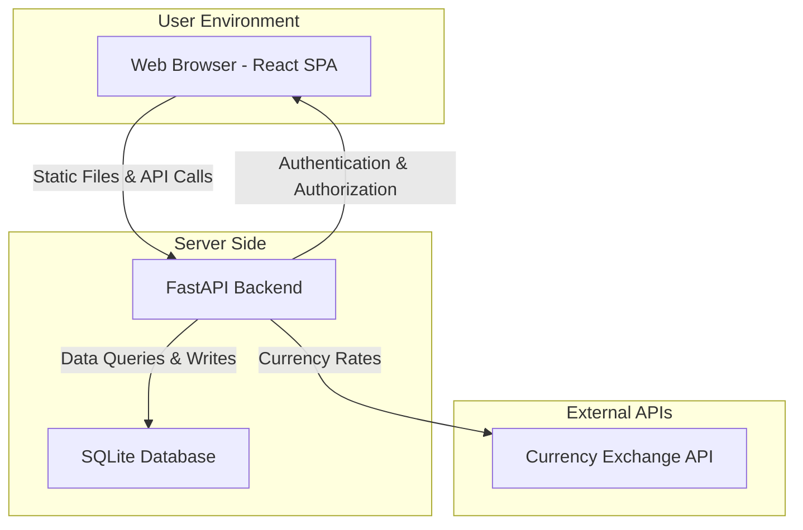
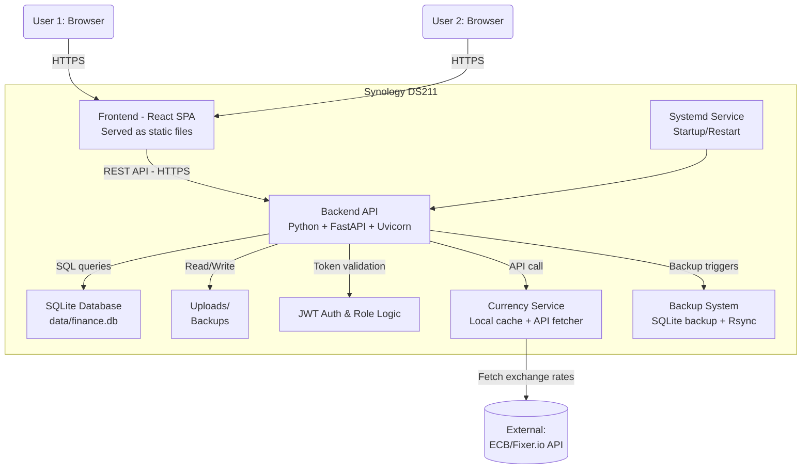
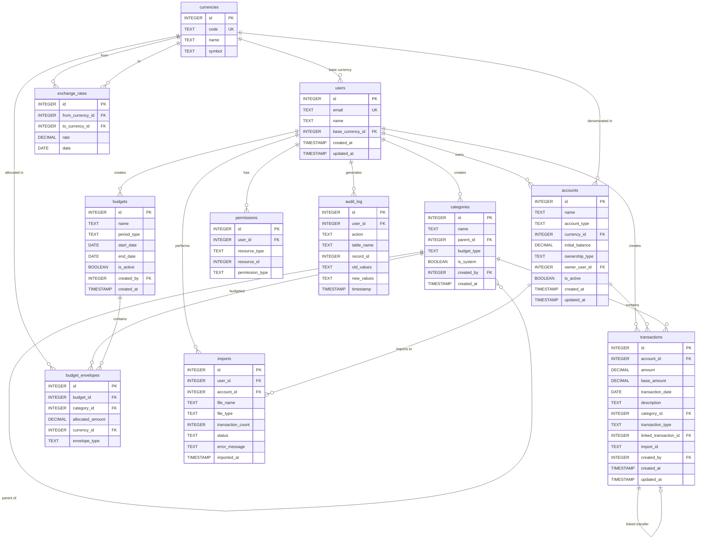

## Table of Contents

0. [Project Overview](#0-project-overview)
1. [General Product Description](#1-general-product-description)
2. [System Architecture](#2-system-architecture)
3. [Data Model](#3-data-model)
4. [API Specification](#4-api-specification)
5. [User Stories](#5-user-stories)
6. [Work Tickets](#6-work-tickets)
7. [Pull Requests](#7-pull-requests)

---

## 0. Project Overview

### **0.1. Your full name:**

José Ángel García Mena

### **0.2. Project name:**

Family Finance

### **0.3. Brief project description:**

Web app to track couple's money expending and budgeting.

### **0.4. Project URL:**

> Puede ser pública o privada, en cuyo caso deberás compartir los accesos de manera segura. Puedes enviarlos a [alvaro@lidr.co](mailto:alvaro@lidr.co) usando algún servicio como [onetimesecret](https://onetimesecret.com/).

### **0.5. URL or compressed file of the repository:**

https://github.com/joangarme/AI4Devs-finalproject

---

## 1. General Product Description

### **1.1. Objective:**

**A smarter way to manage money together—without losing your independence.**

- **Track Personal & Shared Finances**
  Keep joint and individual budgets clearly separated—but unified in one place.

- **Handle Multiple Currencies Seamlessly**
  Automatically convert and balance EUR, USD, and more—no spreadsheets required.

- **Enforce 50/30/20 Automatically**
  Every income is auto-sorted into Needs, Wants, and Savings—for both partners.

- **Stay Private & In Control**
  Self-hosted on your NAS. Your data, your rules.

- **Collaborate Without Conflict**
  Shared dashboards, notes, and real-time sync support open, healthy money conversations.

### **1.2. Main features and functionalities:**

- Multi-currency engine: View all spending/saving in common currency or by source—eliminates manual conversion hassles.
- Automated 50/30/20 split + sub-envelopes: No more spreadsheets or accidental over-spending in “Wants.” Immediate feedback on how much is left for each partner.
- Hybrid categorization engine: Saves time with auto-sorting while always allowing corrections—best of both worlds for accuracy and efficiency.
- NAS-based self-hosting with permissions: Shields your data from external providers, and ensures each partner’s privacy preferences are respected.
- Import bank data (CSV/OFX): Reduces tedious manual entry; focuses effort on review, not data management.
- Editable ledger with audit trail: Fix errors or recategorize with accountability. No black-box changes.
- Custom dashboards: Always know where you stand together and individually—bolsters joint planning and reduces stress.

### **1.3. Design and user experience:**

> Proporciona imágenes y/o videotutorial mostrando la experiencia del usuario desde que aterriza en la aplicación, pasando por todas las funcionalidades principales.

### **1.4. Installation instructions:**

> Documenta de manera precisa las instrucciones para instalar y poner en marcha el proyecto en local (librerías, backend, frontend, servidor, base de datos, migraciones y semillas de datos, etc.)

---

## 2. System Architecture

### **2.1. Architecture diagram:**

The financial web application follows a layered architecture pattern combined with client-server principles, designed specifically for resource-constrained self-hosting environments. This hybrid approach provides clear separation of concerns while maintaining simplicity and efficiency suitable for the Synology DS211's hardware limitations.



The application follows a **traditional layered client-server pattern** with the following layers:

**1. Presentation Layer (Client-Side)**

- React SPA handling user interface and user experience
- Real-time updates through WebSocket connections
- Responsive design for multiple device types

**2. Application Layer (Server-Side)**

- FastAPI handling business logic and API endpoints
- Authentication and authorization middleware
- Budget calculation engine and categorization rules

**3. Data Layer**

- SQLite database for persistent storage
- File system for document uploads and backups
- External API integration for currency data

**4. Infrastructure Layer**

- Synology DS211 NAS providing hosting environment
- Linux-based DSM operating system
- Network connectivity and security

### **2.2. Description of main components:**

| Component           | Technology                     | Role & Description                                                                                                                                                |
| ------------------- | ------------------------------ | ----------------------------------------------------------------------------------------------------------------------------------------------------------------- |
| Frontend            | React 18 + Vite                | Provides a modern, interactive Single Page Application (SPA) for end users. Handles all user interface, dashboard, visualization, and client-side logic.          |
| Backend API         | Python 3.11 + FastAPI          | Implements core business logic, API endpoints, authentication, budgeting engine, multi-currency logic, and file import/export. FastAPI offers async processing.   |
| Database            | SQLite 3.40+                   | Serves as the persistent data store for users, transactions, budgets, and audit logs. Chosen for its simplicity and suitability on resource-limited NAS hardware. |
| Authentication      | JWT + Custom Auth              | Provides stateless, secure, role-based authentication and access control over all RESTful API endpoints. Enables future mobile integration.                       |
| Web Server          | FastAPI Built-in (Uvicorn)     | Hosts both the API and, optionally, static frontend files for simplicity. Eliminates extra dependencies given NAS hardware constraints.                           |
| Currency Service    | External APIs (ECB, Fixer.io)  | Fetches and caches real-time currency exchange rates, supporting multi-currency budgeting and unified reporting.                                                  |
| File Processing     | Python Pandas + Custom Parsers | Parses, sanitizes, and imports financial data from CSV/OFX files. Supports robust validation, transformation, and error handling.                                 |
| Deployment Platform | Synology DSM (DS211)           | NAS operating system and hardware environment for self-hosted deployment. Direct installation due to limited/no Docker support.                                   |
| Process Management  | Systemd Service                | Ensures backend process runs reliably, restarts on crash or reboot, and integrates with NAS startup system.                                                       |
| Backup System       | SQLite Backup API + Rsync      | Periodic database file backups and optional file synchronization, providing data durability and facilitating disaster recovery.                                   |

Each technology is selected to match the **privacy-first, resource-constrained, and self-hosted** nature of the Synology DS211 while providing maintainability, future extensibility, and strong data sovereignty.

### **2.3. High-level project description and file structure**

**Backend Folder Structure**

A typical FastAPI-based backend for a project like this, designed for maintainability and clarity, follows a **modular layered architecture** (sometimes referred to as "service-layered" or "clean architecture" in Python web apps). Here’s a representative structure:

```
backend/
├── app/
│   ├── api/               # Route (endpoint) definitions and request/response schemas
│   ├── core/              # Core settings, configuration, security logic (auth, JWT)
│   ├── models/            # Database models (SQLAlchemy for SQLite)
│   ├── schemas/           # Pydantic models (request/response validation)
│   ├── services/          # Business logic (budget split, multi-currency engine, etc.)
│   ├── utils/             # Utility/helper functions (parsers, currency fetching)
│   ├── main.py            # FastAPI app instance and entrypoint
│   └── __init__.py
├── tests/                 # Unit/integration tests
├── requirements.txt       # Python dependencies
├── alembic/               # (Optional) DB migrations
└── README.md
```

**Main Backend Directories & Their Purpose**

| Directory | Purpose                                                                                              | Pattern/Architecture                                  |
| --------- | ---------------------------------------------------------------------------------------------------- | ----------------------------------------------------- |
| api/      | Defines HTTP routes, input/output (request+response) validation, and ties http requests to services. | **Router/Controller** (Layered)                       |
| core/     | Application-wide setup: config loading, credentials, security, and app startup logic.                | **Singleton/Config** (Layered)                        |
| models/   | ORM database models representing tables (users, transactions, budgets).                              | **Data Layer/Model** (Layered/Domain)                 |
| schemas/  | Pydantic classes for validation, serialization, and enforcing API contract.                          | **DTO/Validation** (Layered/Clean)                    |
| services/ | Core business logic, independent of the HTTP layer: budgeting, multi-currency, audit logics.         | **Service Layer/Domain** (Layered/Clean/DDD inspired) |
| utils/    | Reusable utilities: file parsers, currency updaters, email, etc.                                     | **Helper/Utility**                                    |
| main.py   | Startup, app definition, and routing. Entry point for running the API.                               | **Entrypoint/App Factory**                            |
| tests/    | Testing code for each module, ensures robustness.                                                    | **Testing/QA**                                        |

- This structure offers **separation of concerns** (routes vs business logic vs data vs utilities), aiding long-term reliability.
- Patterns are a hybrid of **layered** and **service-layered/clean architecture**, common in modern Python web projects.

---

**Frontend Folder Structure**

A well-organized React (Vite-based) frontend usually follows a **feature-based or modular structure**. Here’s a common layout:

```
frontend/
├── src/
│   ├── components/        # Reusable presentational components (Buttons, Forms)
│   ├── features/          # Feature modules (Budgets, Transactions, Auth)
│   ├── pages/             # Top-level page components/routes (Dashboard, Login)
│   ├── hooks/             # Custom React hooks (useAuth, useFetch)
│   ├── services/          # API clients/utilities for backend communication
│   ├── utils/             # General-purpose helpers (formatting, currency, etc.)
│   ├── assets/            # Images, icons, style assets
│   ├── App.tsx            # Main component/route container
│   ├── main.tsx           # Application entrypoint (renders App)
│   └── index.css          # Global styles
├── public/                # Static public files
├── package.json           # Frontend dependencies
└── README.md
```

**Key Frontend Directories & Their Purpose**

| Directory   | Purpose                                                                                            | Pattern/Architecture              |
| ----------- | -------------------------------------------------------------------------------------------------- | --------------------------------- |
| components/ | Building blocks used across pages/features (reusable UI).                                          | **Component-based/Atomic Design** |
| features/   | Encapsulates business/UI logic for a specific functional area (e.g. "budgets", "auth", "reports"). | **Feature Modularization**        |
| pages/      | Route-mapped page components, containers rendering full-page layouts.                              | **Page Routing/View**             |
| hooks/      | Encapsulates reusable stateful logic with React hooks.                                             | **Hooks Pattern/Functional**      |
| services/   | API interfaces, backend fetch logic, and integration utilities.                                    | **Data Layer/Service**            |
| utils/      | Pure helper functions (formatting, calculations, etc.).                                            | **Utility/Helper**                |
| assets/     | Images, SVGs, style sheets, webfonts for consistent branding.                                      | **Asset Management**              |
| public/     | Files served statically, outside the module bundler (e.g., favicon).                               | **Static File Serving**           |

- The **component/feature/page/services** separation reflects a **modular, scalable React SPA architecture** advocated in modern Vite/React projects.
- This ensures clear code boundaries: **UI**, **stateful business logic**, **API communication**, and **domain “features”** are all decoupled for maintainability.

---

**Summary of Patterns**

- **Backend:** Layered/service- (clean) architecture separates HTTP endpoints, business logic, and data, reflecting standard Python web best practices.
- **Frontend:** Modular, component-based SPA structure, grouping code by feature and responsibility, aligns with modern React industry standards.

**This structure ensures clarity, maintainability, and scalability—while accommodating platform constraints and future feature growth.**

### **2.4. Infrastructure and deployment**



**Step-by-Step Deployment Process:**

**1. Prepare the Synology Environment**

- **Install Python 3.11+**
  - NAS DSM may come with older Python versions; install via Synology Package Center, community package, or manual compilation.
- **Set up a project directory**
  - Example: `/volume1/finance-app/` with subfolders `app/`, `static/`, `data/`, `backups/`, `logs/`, etc.

**2. Backend Deployment**

- **Dependencies:**
  - SSH into the NAS.
  - Create a Python virtual environment (`python3 -m venv venv`), activate, and install dependencies (`pip install -r requirements.txt`).
- **Database:**
  - Ensure `SQLite` is available (should be default).
  - Run any initialization or migration scripts to create DB schema under `data/finance.db`.
- **Configuration:**
  - Place configuration files (settings, credentials, JWT secret) in a secure subfolder.
- **Run Backend:**

  - Configure a `systemd` service—a unit file that runs the Uvicorn server at boot and restarts on failure.
  - Example `ExecStart`:
    ```
    ExecStart=/volume1/finance-app/venv/bin/uvicorn app.main:app --host 0.0.0.0 --port 8000 --workers 1
    ```

  **3. Frontend Deployment**

- **Build React App:**
  - On your dev machine, build with `npm run build` or `yarn build`.
  - Output goes in the `dist/` or `build/` folder.
- **Copy Static Files:**
  - Upload build files to `/volume1/finance-app/static/` or a Synology web directory.
- **Serve Static Files:**

  - Option A: Let FastAPI/Uvicorn serve static files directly ([suitable for low-traffic, simplicity]).
  - Option B: Use Synology’s built-in web server (enable via DSM Control Panel, Web Station).

  **4. Authentication and Security Configuration**

- **HTTPS Setup:**
  - Enable HTTPS via DSM’s built-in Let's Encrypt or upload your own certificate.
- **Firewall:**
  - Restrict management ports and API access to your home network or trusted IPs.
- **Environment Variables:**

  - Store JWT secrets, currency API keys, etc. as environment variables or in protected config files.

  **5. Backup Configuration**

- **Database Backups:**
  - Use SQLite’s backup API or simple file copy (when app is idle).
  - Automate with `cron` or `systemd timers`.
- **External Backup:**

  - Run `rsync` to push database and data files to an external disk or cloud backup (optional).

  **6. Monitoring & Maintenance**

- **Logs:**
  - Direct FastAPI and app logs to NAS `logs/` directory.
- **Upgrades:**
  - Pull code updates via SSH/Git.
  - Stop service, update code, install new dependencies, restart service.
- **Health Checks:**

  - Basic app “/health” endpoint for availability probes.

  **Key Tools Involved**

- **Python 3.11+**, **pip**, **venv**: For backend environment management.
- **Uvicorn**: ASGI web server for FastAPI.
- **React + Vite**: SPA frontend stack.
- **npm/yarn**: Frontend build tooling.
- **SQLite3**: Database storage.
- **Systemd**: For managed backend service.
- **Rsync, Cron**: For backups/automation.
- **DSM Web Server/Web Station**: Alternative for advanced static file serving.

**This infrastructure and deployment process ensures privacy-first, reliable, resource-optimized self-hosted finance app runs smoothly on the DS211, with clear upgrade and maintenance paths.**

### **2.5. Security**

1. **Privacy by Design (PbD)**
   **Purpose:** Embed privacy protection into the core architecture from inception, not as an afterthought.

   **Strategic Implementation:**

   - **Proactive Prevention:** Design systems to prevent privacy breaches before they occur rather than responding after incidents

   - **Privacy as Default:** Ensure maximum privacy settings are enabled by default, requiring users to explicitly opt into data sharing

   - **End-to-End Lifecycle Protection:** Integrate privacy safeguards throughout the entire data lifecycle from collection to deletion

   **Real-World Application:** The app would automatically encrypt all transaction data locally, minimize data collection to only essential information (transaction amount, date, category), and provide granular user controls for data sharing between partners. For example, one spouse could choose to share budget categories but keep specific transaction details private.

2. **Data Sovereignty**
   **Purpose:** Maintain complete ownership and control over financial data to ensure compliance with personal privacy standards and reduce dependency on external entities.

   **Strategic Implementation:**

   - **Local-First Architecture:** Store all sensitive data on self-controlled infrastructure

   - **Vendor Independence:** Design systems to avoid vendor lock-in and enable data portability

   **Real-World Application:** All the financial records, transaction history, and budget data remain exclusively on the Synology DS211, never transmitted to external cloud services. Allow to export the complete financial history in standard formats, ensuring independency on the application's continued availability.

3. **Zero Trust Architecture (ZTA)**

   **Purpose:** Eliminate implicit trust assumptions and continuously verify every access request, even within your own network.

   **Strategic Implementation:**

   - **Never Trust, Always Verify:** Authenticate and authorize every request regardless of source location

   - **Least Privilege Access:** Grant minimum necessary permissions for each user role and function

   - **Continuous Validation:** Implement ongoing verification rather than one-time authentication

   **Real-World Application:** Even though both spouses use the same home network, each login session requires verification. Administrative functions (like budget rule changes) require additional authentication. The system monitors for unusual access patterns, such as multiple simultaneous sessions or access from unexpected locations.

4. **Defense in Depth**

   **Purpose:** Create multiple layers of security controls to ensure that if one layer fails, others continue to protect the system.

   **Strategic Implementation:**

   - **Layered Security Controls:** Implement security measures at network, application, data, and user levels

   - **Redundancy and Failover:** Design multiple independent security mechanisms for critical functions

   - **Compartmentalization:** Isolate different system components to limit breach impact

   **Real-World Application:** The system implements network-level access controls (firewall rules), application-level authentication (JWT tokens), database-level encryption, and file-system permissions. If an attacker bypasses one layer, they encounter additional barriers at each subsequent level.

5. **Secure Development Lifecycle (SDL)**

   **Purpose:** Integrate security considerations into every phase of development and deployment.

   **Strategic Implementation:**

   - **Security by Design:** Consider security implications during architectural design phase

   - **Threat Modeling:** Systematically identify and analyze potential attack vectors

   - **Secure Coding Practices:** Implement coding standards that prevent common vulnerabilities

   **Real-World Application:** Implement input validation for all financial amounts and use secure libraries for currency calculations to prevent precision errors.

6. **Risk-Based Security Management**

   **Purpose:** Prioritize security investments and controls based on actual risk exposure and business impact.

   **Strategic Implementation:**

   - **Regular Risk Assessments:** Systematically evaluate threats, vulnerabilities, and potential impacts

   - **Dynamic Risk Adaptation:** Adjust security controls based on changing threat landscape

   **Real-World Application:** Prioritize protecting transaction data and authentication systems over less sensitive features like report formatting preferences. Implement stronger controls for shared budget modifications than for personal expense categorization, reflecting the higher relationship impact of budget disputes.

7. **Principle of Least Privilege**

   **Purpose:** Minimize potential damage from compromised accounts or insider threats by granting only necessary access rights.

   **Strategic Implementation:**

   - **Role-Based Access Control (RBAC):** Define granular permissions based on user responsibilities

   - **Temporal Access:** Implement time-limited permissions for sensitive operations

   - **Regular Access Reviews:** Periodically audit and adjust user permissions

   **Real-World Application:** One spouse may have "budget administrator" privileges to modify spending categories and rules, while the other has "contributor" access to add transactions and view reports. Administrative functions like data export or user management require explicit elevation of privileges with additional authentication.

8. **Data Minimization and Purpose Limitation**

   **Purpose:** Reduce security exposure by collecting and retaining only necessary data for specified purposes.

   **Strategic Implementation:**

   - **Minimal Data Collection:** Gather only information required for specific functionality

   - **Retention Policies:** Implement automatic data disposal when no longer needed

   **Real-World Application:** The application stores transaction amounts, dates, and user-defined categories but doesn't collect merchant geolocation data or detailed purchase descriptions unless explicitly provided by users. Old transaction data is automatically archived after configurable periods, and temporary import files are securely deleted after processing.

9. **Incident Response and Recovery Planning**

   **Purpose:** Ensure rapid detection, containment, and recovery from security incidents to minimize impact.

   **Strategic Implementation:**

   - **Detection Capabilities:** Implement monitoring systems to identify security anomalies

   - **Response Procedures:** Define clear escalation paths and recovery actions

   - **Business Continuity:** Ensure critical functions can continue during security incidents

   **Real-World Application:** The system logs all authentication attempts, data modifications, and administrative actions. Unusual patterns (like multiple failed logins or bulk data exports) trigger alerts. Recovery procedures include automated database backups, rollback capabilities, and documented steps to restore service after a compromise.

10. **Transparency and Auditability**

    **Purpose:** Enable security oversight and incident investigation through comprehensive logging and monitoring.

    **Strategic Implementation:**

    - **Comprehensive Logging:** Record all security-relevant events and decisions

    - **Audit Trails:** Maintain tamper-evident records of system activities

    - **Transparency Reports:** Provide clear visibility into security practices and incidents

    **Real-World Application:** Every financial transaction, budget modification, and system configuration change is logged with timestamps, user identification, and change details. Users can view their own activity history, and administrators can generate compliance reports showing who accessed what data when. The system maintains integrity checks on log files to detect tampering attempts.

---

**Implementation Considerations**

1. **Regulatory Alignment**

   While this is a personal application, following established financial industry security practices (like those required by PCI DSS, GDPR, or SOX) provides a robust security foundation.

2. **Scalability Planning**

   Design security controls to accommodate future growth, such as adding children as users or integrating with external financial services.

3. **User Experience Balance**

   Implement security measures that enhance rather than hinder usability, such as single sign-on between spouses and intuitive privacy controls.

4. **Continuous Improvement**

   Establish processes for regularly updating security practices based on evolving threats, new vulnerabilities, and lessons learned from the broader financial technology community.

This strategic security framework provides a comprehensive foundation for protecting personal financial data while maintaining the privacy, collaboration, and functionality requirements of a self-hosted solution. Each practice contributes to building a trustworthy system that protects the family's financial information without compromising usability or collaborative features.

### **2.6. Tests**

> Describe brevemente algunos de los tests realizados

---

## 3. Data Model

### **3.1. Data model diagram:**



### **3.2. Description of entities:**

1. **Users**

   Core user accounts for the two partners in the financial management system.

   Attributes:

   - `id` (INTEGER) - Primary Key
   - `email` (TEXT) - Unique constraint, user's email address
   - `name` (TEXT) - User's display name
   - `base_currency_id` (INTEGER) - Foreign Key to currencies table
   - `created_at` (TIMESTAMP) - Account creation timestamp
   - `updated_at` (TIMESTAMP) - Last modification timestamp

   Relations:

   - **Has one** base currency (currencies)
   - **Has many** accounts (one-to-many)
   - **Has many** created categories (one-to-many)
   - **Has many** created transactions (one-to-many)
   - **Has many** created budgets (one-to-many)
   - **Has many** permissions (one-to-many)
   - **Has many** audit log entries (one-to-many)
   - **Has many** imports (one-to-many)

   Restrictions:

   - Email must be unique across all users
   - Base currency is required |

2. **Currencies**

   Supported currencies for multi-currency transaction tracking.

   Attributes:

   - `id` (INTEGER) - Primary Key
   - `code` (TEXT) - Unique constraint, ISO currency code (USD, EUR, etc.)
   - `name` (TEXT) - Full currency name
   - `symbol` (TEXT) - Currency symbol ($, €, etc.)

   Relations:

   - **Used by many** users as base currency (one-to-many)
   - **Used by many** accounts (one-to-many)
   - **Used by many** budget envelopes (one-to-many)
   - **Has many** exchange rates as source (one-to-many)
   - **Has many** exchange rates as target (one-to-many)

   Restrictions:

   - Currency code must be unique

3. **Exchange Rates**

   Historical exchange rates for currency conversion.

   Attributes:

   - `id` (INTEGER) - Primary Key
   - `from_currency_id` (INTEGER) - Foreign Key to currencies (source)
   - `to_currency_id` (INTEGER) - Foreign Key to currencies (target)
   - `rate` (DECIMAL(10,6)) - Exchange rate value
   - `date` (DATE) - Date of the exchange rate

   Relations:

   - **Belongs to** one source currency (many-to-one)
   - **Belongs to** one target currency (many-to-one)

   Restrictions:

   - Unique constraint on (from_currency_id, to_currency_id, date)
   - Rate must be positive

4. **Accounts**

   Bank accounts, credit cards, and other financial accounts.

   Attributes:

   - `id` (INTEGER) - Primary Key
   - `name` (TEXT) - Account name/description
   - `account_type` (TEXT) - Type (checking, savings, credit_card, etc.)
   - `currency_id` (INTEGER) - Foreign Key to currencies
   - `initial_balance` (DECIMAL(10,2)) - Starting balance, default 0
   - `ownership_type` (TEXT) - 'personal_user1', 'personal_user2', or 'shared'
   - `owner_user_id` (INTEGER) - Foreign Key to users (NULL if shared)
   - `is_active` (BOOLEAN) - Active status, default TRUE
   - `created_at` (TIMESTAMP) - Creation timestamp
   - `updated_at` (TIMESTAMP) - Last modification timestamp

   Relations:

   - **Belongs to** one currency (many-to-one)
   - **Belongs to** one user if personal (many-to-one, optional)
   - **Has many** transactions (one-to-many)
   - **Has many** imports (one-to-many)

   Restrictions:

   - If ownership_type is 'personal_user1' or 'personal_user2', owner_user_id must be set
   - If ownership_type is 'shared', owner_user_id must be NULL

5. **Categories**

   Hierarchical transaction categories supporting the 50/30/20 budget rule.

   Attributes:

   - `id` (INTEGER) - Primary Key
   - `name` (TEXT) - Category name
   - `parent_id` (INTEGER) - Foreign Key to categories (self-referencing)
   - `budget_type` (TEXT) - 'needs', 'wants', or 'savings' (for top-level)
   - `is_system` (BOOLEAN) - System-defined category flag, default FALSE
   - `created_by` (INTEGER) - Foreign Key to users
   - `created_at` (TIMESTAMP) - Creation timestamp

   Relations:

   - **Belongs to** one parent category (many-to-one, optional)
   - **Has many** child categories (one-to-many)
   - **Created by** one user (many-to-one)
   - **Used by many** transactions (one-to-many)
   - **Used by many** budget envelopes (one-to-many)

   Restrictions:

   - Parent categories cannot create circular references
   - Top-level categories should have budget_type set

6. **Transactions**

   Financial transactions with multi-currency support and categorization.

   Attributes:

   - `id` (INTEGER) - Primary Key
   - `account_id` (INTEGER) - Foreign Key to accounts
   - `amount` (DECIMAL(10,2)) - Amount in account currency
   - `base_amount` (DECIMAL(10,2)) - Amount converted to user's base currency
   - `transaction_date` (DATE) - Date of transaction
   - `description` (TEXT) - Transaction description
   - `category_id` (INTEGER) - Foreign Key to categories
   - `transaction_type` (TEXT) - 'income', 'expense', or 'transfer'
   - `linked_transaction_id` (INTEGER) - Foreign Key to transactions (self-referencing)
   - `import_id` (TEXT) - External ID for imported transactions
   - `created_by` (INTEGER) - Foreign Key to users
   - `created_at` (TIMESTAMP) - Creation timestamp
   - `updated_at` (TIMESTAMP) - Last modification timestamp

   Relations:

   - **Belongs to** one account (many-to-one)
   - **Belongs to** one category (many-to-one, optional)
   - **Created by** one user (many-to-one)
   - **Linked to** one other transaction for transfers (one-to-one, optional)

   Restrictions:

   - Amount must match transaction_type (positive for income, negative for expense)
   - Linked transactions must be paired (transfer in/out)

7. **Budgets**

   Budget periods for financial planning.

   Attributes:

   - `id` (INTEGER) - Primary Key
   - `name` (TEXT) - Budget name
   - `period_type` (TEXT) - 'monthly', 'annual', or 'custom'
   - `start_date` (DATE) - Budget period start
   - `end_date` (DATE) - Budget period end
   - `is_active` (BOOLEAN) - Active status, default TRUE
   - `created_by` (INTEGER) - Foreign Key to users
   - `created_at` (TIMESTAMP) - Creation timestamp

   Relations:

   - **Created by** one user (many-to-one)
   - **Has many** budget envelopes (one-to-many)

   Restrictions:

   - End date must be after start date
   - Only one active budget per period

8. **Budget Envelopes**

   Budget allocations for specific categories within a budget period.

   Attributes:

   - `id` (INTEGER) - Primary Key
   - `budget_id` (INTEGER) - Foreign Key to budgets
   - `category_id` (INTEGER) - Foreign Key to categories
   - `allocated_amount` (DECIMAL(10,2)) - Budget allocation
   - `currency_id` (INTEGER) - Foreign Key to currencies
   - `envelope_type` (TEXT) - 'needs', 'wants', or 'savings'

   Relations:

   - **Belongs to** one budget (many-to-one)
   - **Belongs to** one category (many-to-one)
   - **Uses** one currency (many-to-one)

   Restrictions:

   - Allocated amount must be positive
   - Envelope type must match category's budget type

9. **Permissions**

   Granular access control for resources between partners.

   Attributes:

   - `id` (INTEGER) - Primary Key
   - `user_id` (INTEGER) - Foreign Key to users
   - `resource_type` (TEXT) - 'account', 'transaction', or 'budget'
   - `resource_id` (INTEGER) - ID of the specific resource
   - `permission_type` (TEXT) - 'view', 'edit', or 'delete'

   Relations:

   - **Belongs to** one user (many-to-one)

   Restrictions:

   - Unique constraint on (user_id, resource_type, resource_id, permission_type)
   - Resource_id must exist in the corresponding table

10. **Audit Log**

    Complete audit trail of all data changes.

    Attributes:

    - `id` (INTEGER) - Primary Key
    - `user_id` (INTEGER) - Foreign Key to users
    - `action` (TEXT) - 'create', 'update', or 'delete'
    - `table_name` (TEXT) - Name of affected table
    - `record_id` (INTEGER) - ID of affected record
    - `old_values` (TEXT) - JSON of previous values
    - `new_values` (TEXT) - JSON of new values
    - `timestamp` (TIMESTAMP) - Action timestamp, default CURRENT_TIMESTAMP

    Relations:

    - **Created by** one user (many-to-one)

    Restrictions:

    - Old_values is NULL for create actions
    - New_values is NULL for delete actions

11. **Imports**

    History of bank data imports from CSV/OFX files.

    Attributes:

    - `id` (INTEGER) - Primary Key
    - `user_id` (INTEGER) - Foreign Key to users
    - `account_id` (INTEGER) - Foreign Key to accounts
    - `file_name` (TEXT) - Name of imported file
    - `file_type` (TEXT) - 'csv' or 'ofx'
    - `transaction_count` (INTEGER) - Number of transactions imported
    - `status` (TEXT) - 'pending', 'completed', or 'failed'
    - `error_message` (TEXT) - Error details if failed
    - `imported_at` (TIMESTAMP) - Import timestamp

    Relations:

    - **Performed by** one user (many-to-one)
    - **Imports to** one account (many-to-one)

    Restrictions:

    - Transaction_count must be non-negative
    - Error_message only set when status is 'failed'

## 4. API Specification

- **[OpenAPI specifications](docs/api-specifications.yaml)**
- **[API examples](docs/api-examples.md)**

---

## 5. User Stories

### Epic 1: User Management & Authentication

#### US1.1: Account Registration

**As a** Sarah (Budget-Conscious Partner),  
**I want** to create a secure account with my email and password,  
**So that** I can start tracking my finances privately and securely.

**Acceptance Criteria:**

- Email validation with proper format checking
- Password requirements: minimum 8 characters, 1 uppercase, 1 number, 1 special character
- Email verification sent upon registration
- Clear error messages for validation failures
- Success confirmation and redirect to login
- Duplicate email prevention

### Epic 2: Transaction Management Core

#### US2.1: Add Transaction

**As a** Sarah (Budget-Conscious Partner),  
**I want** to quickly add income and expense transactions,  
**So that** I can maintain an accurate record of all my financial activities.

**Acceptance Criteria:**

- Transaction form with: amount, date, description, category, account
- Auto-populate today's date
- Category suggestions based on description
- Support for recurring transactions
- Save and add another option
- Validation for required fields
- Success confirmation with transaction details

### Epic 3: Automated Budget Engine

#### US3.1: Automatic 50/30/20 Budget Creation

**As a** David (Financial Planner),  
**I want** my income automatically split into needs (50%), wants (30%), and savings (20%),  
**So that** I can follow proven budgeting principles without manual calculations.

**Acceptance Criteria:**

- Automatic calculation on income transaction
- Visual representation of splits
- Customizable percentage splits
- Multiple income sources handled
- Monthly/annual view options
- Remaining budget displayed real-time
- Rollover options for unused budgets

---

## 6. Work Tickets

### Task 1: Task ID: US1.1-T1

**Type**: [Database]  
**Title**: Create users table schema  
**Story Points**: 0.5  
**Dependencies**: None

#### Description

**What**: Create the users table with fields for authentication  
**Input**: Data model specification for user entity  
**Output**: Migration script for users table  
**Boundary**: Only base table structure, no indexes or verification tables

#### Acceptance Criteria

- [ ] Table includes: id, email, password_hash, created_at, updated_at, is_active, is_verified
- [ ] Email field has unique constraint
- [ ] Migration script is reversible
- [ ] Appropriate data types used (VARCHAR for email, TEXT for password_hash)

#### Testing Requirements

- [ ] Test migration up and down functionality
- [ ] Verify all columns created with correct types
- [ ] Test unique constraint on email
- [ ] Verify default values are set correctly

#### Technical Notes

- Use Alembic for migration management
- Password_hash field should accommodate bcrypt output (60 chars)
- Consider adding fields for future OAuth integration

### Task 2: Task ID: US1.1-T3

**Type**: [Backend]  
**Title**: Create user authentication Pydantic models  
**Story Points**: 0.5  
**Dependencies**: None

#### Description

**What**: Define request/response models for user registration  
**Input**: API specification for authentication endpoints  
**Output**: Pydantic model classes in schemas/auth.py  
**Boundary**: Only data models, no validation logic beyond basic types

#### Acceptance Criteria

- [ ] UserRegisterRequest model with email and password fields
- [ ] UserRegisterResponse model with user info (excluding password)
- [ ] EmailVerificationRequest model
- [ ] Proper typing for all fields

#### Testing Requirements

- [ ] Test model instantiation with valid data
- [ ] Test basic field type validation
- [ ] Test serialization/deserialization
- [ ] Verify password field is excluded from response

#### Technical Notes

- Use Pydantic v2 syntax
- Email field should use EmailStr type
- Password should be SecretStr in request model

### Task ID: US1.1-T10

**Type**: [Frontend]  
**Title**: Build registration form component  
**Story Points**: 1  
**Dependencies**: None

#### Description

**What**: Create React component for registration form  
**Input**: UI mockups and form requirements  
**Output**: RegistrationForm.tsx component  
**Boundary**: UI component only, no API integration

#### Acceptance Criteria

- [ ] Email and password input fields
- [ ] Password strength indicator
- [ ] Real-time validation feedback
- [ ] Submit button with loading state
- [ ] Accessible form with proper labels

#### Testing Requirements

- [ ] Component renders all fields
- [ ] Password strength indicator works correctly
- [ ] Form validation prevents invalid submission
- [ ] Loading states display properly
- [ ] Accessibility tests (ARIA, keyboard nav)
- [ ] Responsive design tests

#### Technical Notes

- Use React Hook Form for form management
- Consider zxcvbn for password strength
- Implement debounced validation

---

## 7. Pull Requests

> Documenta 3 de las Pull Requests realizadas durante la ejecución del proyecto

**Pull Request 1**

**Pull Request 2**

**Pull Request 3**

```

```
