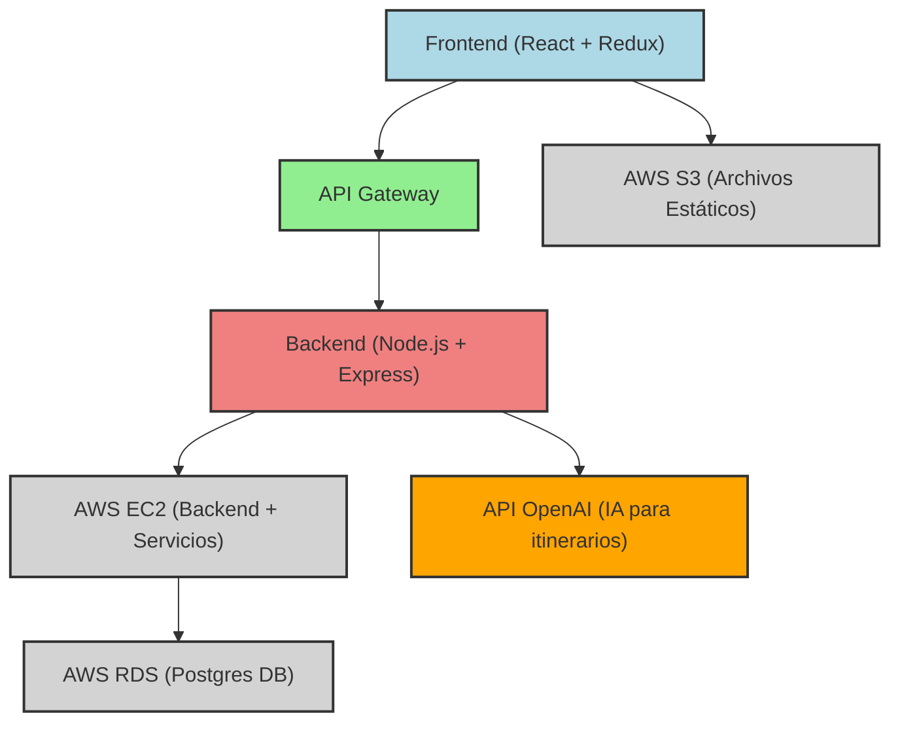
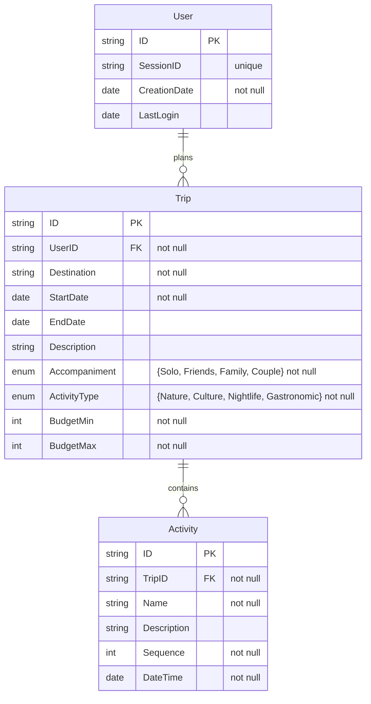

## Índice

0. [Ficha del proyecto](#0-ficha-del-proyecto)
1. [Descripción general del producto](#1-descripción-general-del-producto)
2. [Arquitectura del sistema](#2-arquitectura-del-sistema)
3. [Modelo de datos](#3-modelo-de-datos)
4. [Especificación de la API](#4-especificación-de-la-api)
5. [Historias de usuario](#5-historias-de-usuario)
6. [Tickets de trabajo](#6-tickets-de-trabajo)
7. [Pull requests](#7-pull-requests)

---

## 0. Ficha del proyecto

### **0.1. Tu nombre completo:**

María Pizarro Cuevas

### **0.2. Nombre del proyecto:**


### **0.3. Descripción breve del proyecto:**

IkiGoo tiene por objetivo simplificar y personalizar la planificación de viajes utilizando Inteligencia Artificial. Permitirá a los usuarios crear itinerarios de viaje adaptados a sus preferencias y necesidades específicas, desde la selección de destinos hasta la organización de actividades, transporte y alojamiento.

La IA actuará como un asistente personal de viaje, generando itinerarios optimizados basados en la información proporcionada por el usuario, como intereses, presupuesto y disponibilidad. Buscará ofrecer una experiencia de planificación eficiente, permitiendo a cualquier persona organizar sus viajes de manera rápida y sin complicaciones.

IkiGoo está pensada para ser una solución integral que facilita la creación de itinerarios únicos, asegurando que cada viaje sea una experiencia personalizada y acorde a las expectativas del usuario.

### **0.4. URL del proyecto:**

(WIP)

### 0.5. URL o archivo comprimido del repositorio

[Github Repository - AI4Devs-finalproject-MPC](https://github.com/Edain92/AI4Devs-finalproject-MPC)

---

## 1. Descripción general del producto

### **1.1. Objetivo:**

IkiGoo pretende transformar la planificación de viajes en una experiencia eficiente y altamente personalizada. Utilizando Inteligencia Artificial (IA), IkiGoo genera itinerarios de viaje optimizados que se adaptan a las preferencias y necesidades únicas de cada usuario. La IA de IkiGoo analiza una variedad de factores, como destinos, intereses, presupuesto y disponibilidad, para ofrecer un proceso de planificación fluido y completamente alineado con los deseos del viajero.

Esta aplicación actuará como un asistente personal de viaje, gestionando grandes volúmenes de datos y ofreciendo recomendaciones en tiempo real. A medida que el usuario interactúa con la aplicación, la IA ajustará sus sugerencias, mejorando continuamente la precisión y relevancia de los itinerarios. Esto asegura que cada viaje sea no solo bien organizado, sino también perfectamente ajustado a las expectativas del usuario.

**¿Qué Soluciona?**

Planificar un viaje puede ser un proceso complejo y estresante, que a menudo resulta en itinerarios genéricos que no reflejan lo que el viajero realmente desea. IkiGoo simplifica esta tarea, reuniendo toda la información necesaria en un solo lugar y generando itinerarios bien estructurados y personalizados con solo responder a unas pocas preguntas clave. De esta forma, el usuario ahorrará tiempo y reducirá el posible estrés asociado a la planificación, permitiendo que se concentre en disfrutar del viaje en lugar de preocuparse por los detalles logísticos.

**Público Objetivo**

IkiGoo está diseñado para cualquier persona interesada en viajar, independientemente de sus necesidades o el tipo de experiencia que busque. Desde viajeros solitarios y familias, hasta parejas, grupos de amigos y profesionales que viajan por negocios, IkiGoo ofrece una solución adaptable y eficiente para planificar todo tipo de itinerarios. La capacidad de la aplicación para ofrecer itinerarios personalizados asegura que cada usuario reciba una experiencia de viaje alineada con sus intereses y estilo de vida.

### **1.2. Características y funcionalidades principales:**

- **Identificación Automática del Usuario**: El sistema identificará al usuario a través de cookies e ID de sesión. Esta identificación permitirá asociar al usuario con sus chats y planes de viaje de manera automática.
  
- **Interacción con la IA**: Los usuarios podrán interactuar con la IA a través de un chat que les hará preguntas clave sobre su próximo viaje, como destino, duración, tipo de actividades y presupuesto. La IA generará sugerencias y recomendaciones basadas en estas preferencias.

- **Almacenamiento de Planes de Viaje**: Aunque solo se mostrarán los 3 últimos viajes, todos los planes de viaje quedarán almacenados para futuros desarrollos, donde se incentivará a los usuarios a crear un perfil y acceder a todo su historial de viajes.

- **Visualización de los Planes de Viaje Recientes**: Los usuarios podrán visualizar los **3 últimos planes de viaje** asociados a su ID de sesión. Estos planes incluirán las actividades sugeridas para cada itinerario, permitiendo una rápida revisión.

- **Preferencias por Viaje**: Cada viaje tendrá sus propias preferencias, como el destino, duración, acompañantes, tipo de actividades y presupuesto. Esto asegura que cada viaje pueda personalizarse independientemente de los anteriores.

- **Planificación de Actividades**: Los usuarios podrán ver y editar las actividades sugeridas para cada viaje. Estas actividades estarán organizadas cronológicamente y se podrán ajustar según los intereses del usuario.

### **1.3. Diseño y experiencia de usuario:**

[Ver diseño completo](./.docs/design.md)

### **1.4. Instrucciones de instalación:**

#### Herramientas necesarias:
Asegúrate de tener las siguientes herramientas instaladas en tu sistema antes de comenzar:
- [Git](https://git-scm.com/)
- [Node.js](https://nodejs.org/) (versión 14 o superior)
- [Docker](https://www.docker.com/)
- [Docker Compose](https://docs.docker.com/compose/)

1. Clona el repositorio:
   ```bash
   git clone https://github.com/Edain92/AI4Devs-finalproject-MPC.git
   cd AI4Devs-finalproject-MPC
   ```

2. Crea un archivo `.env` en la raíz del proyecto con el siguiente contenido:
   ```dotenv
   # Server
   PORT=5001
   NODE_ENV=development

   # Postgres Database
   DB_NAME=ikigoo
   DB_USER=postgres
   DB_PASSWORD=mipostgres
   DB_HOST=db
   ```

3. Construye y levanta los contenedores Docker:
   ```bash
   docker compose up --build
   ```

4. Verifica que los servicios estén corriendo correctamente:
   - El backend debería estar accesible en `http://localhost:5001`.
   - El frontend debería estar accesible en `http://localhost:3000`.
   - PostgreSQL debería estar corriendo en el puerto `5432`.

5. Para detener los contenedores, ejecuta:
   ```bash
   docker-compose down
   ```

6. Para ver los logs de los contenedores, ejecuta:
   ```bash
   docker-compose logs
   ```

**(WIP)**

---

## 2. Arquitectura del Sistema

### **2.1. Diagrama de arquitectura**



La arquitectura del sistema de **IkiGoo** se ha diseñado para ser modular, escalable y eficiente, utilizando un enfoque de monolito modular. Esto facilita la implementación inicial del MVP, manteniendo la simplicidad y la cohesión, mientras se sientan las bases para una posible transición a un modelo de arquitectura más moderno en el futuro.

**Patrón Arquitectónico: Monolito Modular**

Se ha optado por un enfoque de monolito modular, donde el sistema está organizado en módulos independientes que manejan diferentes aspectos de la aplicación, pero que están unidos en una única base de código. Esta elección se ha dado por los siguientes motivos:
  - **Simplicidad y Rapidez de Desarrollo**: Para el **MVP**, un monolito modular permite un desarrollo más rápido y sencillo, sin la complejidad adicional que conlleva una arquitectura de microservicios.
  - **Cohesión y Facilidad de Mantenimiento**: Mantener toda la lógica del sistema en una base de código facilita la depuración y el mantenimiento en las primeras etapas del proyecto.
  - **Escalabilidad Futurible**: El diseño modular permite que, si el sistema crece en complejidad y demanda, se pueda descomponer en el futuro, por ejemplo, en microservicios, facilitando la transición sin grandes refactorizaciones.

**Desafíos**

- **Escalabilidad Limitada Inicialmente**: Un monolito modular puede volverse difícil de escalar a medida que crece el número de usuarios y la complejidad de las funciones, lo que podría requerir una refactorización significativa en el futuro.
- **Potencialmente Menor Resiliencia**: Si bien un monolito modular es más sencillo, también significa que todos los componentes están unidos; si una parte del sistema falla, podría impactar a todo el sistema.
- **Mayor Complejidad en la Transición**: Si se decide migrar a una arquitectura de microservicios, la transición podría requerir un esfuerzo considerable para dividir los módulos en servicios independientes.

A pesar de ello, este enfoque arquitectónico, junto con las tecnologías seleccionadas, permite a **IkiGoo** ofrecer una solución robusta y flexible, optimizada para un desarrollo rápido y eficaz del MVP, mientras que proporciona una base sólida para una evolución y escalabilidad futura.

### **2.2. Descripción de componentes principales:**

1. **Frontend (React + Redux):** La interfaz de usuario será construida con React, que permite el desarrollo modular de interfaces web dinámicas. Redux se empleará para la gestión del estado global de la aplicación, facilitando la interacción con los itinerarios de viaje y la visualización de los planes recientes.
   - **Comunicación:** El frontend interactuará con el API Gateway para enviar y recibir datos desde el backend.

2. **API Gateway:** Servirá como el único punto de entrada para todas las solicitudes provenientes del frontend hacia el backend. Gestionará el enrutamiento y la composición de respuestas, asegurando una comunicación eficiente entre las distintas capas del sistema.
   - **Comunicación:** Redirigirá las solicitudes del frontend al backend, manejando la interacción con la API de OpenAI según corresponda.

3. **Backend (Node.js + Express):** El backend, desarrollado en Node.js y Express, será el encargado de gestionar la lógica de negocio, manejar las solicitudes HTTP y coordinar la comunicación con la API de OpenAI para la generación de itinerarios de viaje. También se encargará de realizar operaciones con la base de datos relacional (Postgres).
   - **Comunicación:** El backend interactuará con la API de OpenAI para obtener sugerencias basadas en las preferencias del usuario y se conectará a la base de datos Postgres para almacenar y recuperar los datos de usuarios, itinerarios y actividades.

4. **API de OpenAI (IA para itinerarios):** El backend se integrará con la API de OpenAI para obtener recomendaciones y sugerencias personalizadas basadas en los datos proporcionados por los usuarios. Estas recomendaciones incluirán posibles destinos, actividades y otros detalles relacionados con la planificación de los viajes.
   - **Comunicación:** El backend realizará llamadas a la API de OpenAI, procesando las respuestas y ajustando los itinerarios en base a las preferencias del usuario.

5. **Base de Datos (Postgres):** Utilizaremos Postgres como la única base de datos para la POC. Almacena los datos estructurados, como usuarios, viajes, actividades y preferencias asociadas a cada viaje. Esto asegura integridad y permite realizar consultas eficientes.
   - **Comunicación:** El backend realizará operaciones CRUD directamente sobre Postgres, manejando la creación y recuperación de usuarios, planes de viaje y actividades.

6. **Infraestructura en AWS:**
   - **EC2:** El backend, junto con sus servicios y la integración con OpenAI, se desplegará en instancias de **AWS EC2**, utilizando un entorno Dockerizado para facilitar la escalabilidad y el despliegue rápido.
   - **S3:** Almacenará archivos estáticos como imágenes y recursos del frontend.
   - **RDS:** Se utilizará **AWS RDS** para gestionar la base de datos Postgres, proporcionando una solución escalable y gestionada para las necesidades de almacenamiento de la aplicación.

### **2.3. Descripción de alto nivel del proyecto y estructura de ficheros**

> WIP: Representa la estructura del proyecto y explica brevemente el propósito de las carpetas principales, así como si obedece a algún patrón o arquitectura específica.

### **2.4. Infraestructura y despliegue**

> WIP: Detalla la infraestructura del proyecto, incluyendo un diagrama en el formato que creas conveniente, y explica el proceso de despliegue que se sigue

### **2.5. Seguridad**

> WIP: Enumera y describe las prácticas de seguridad principales que se han implementado en el proyecto, añadiendo ejemplos si procede

### **2.6. Tests**

> WIP: Describe brevemente algunos de los tests realizados

---

## 3. Modelo de Datos

### **3.1. Diagrama del modelo de datos:**

**Base de datos relacional: Postgres**



### **3.2. Descripción de entidades principales:**

#### **Base de datos relacional: Postgres**

1. **User**: Representa al usuario que utiliza la aplicación.
   - **Atributos**:
     - `ID` (string, PK): Identificador único del usuario.
     - `SessionID` (string, unique): Identificador de sesión generado en el frontend para asociar al usuario con sus planes de viaje.
     - `CreationDate` (date, not null): Fecha en la que se creó el usuario.
     - `LastLogin` (date): Fecha de la última vez que el usuario interactuó con la aplicación.
   - **Relaciones**:
     - Relación uno a muchos con `Trip` (Un usuario puede planificar múltiples viajes).

2. **Trip**: Representa un viaje planificado por el usuario.
   - **Atributos**:
     - `ID` (string, PK): Identificador único del viaje.
     - `UserID` (string, FK, not null): Referencia al usuario que planifica el viaje.
     - `Destination` (string, not null): Ciudad de destino del viaje.
     - `StartDate` (date, not null): Fecha de inicio del viaje.
     - `EndDate` (date, not null): Fecha de finalización del viaje.
     - `Accompaniment` (enum, not null): Categoría de acompañantes del viaje (ej., Solo, Friends, Family, Couple).
     - `ActivityType` (enum, not null): Tipo de actividades planificadas en el viaje (ej., Nature, Culture, Nightlife, Gastronomic).
     - `BudgetMin` (int, not null): Presupuesto mínimo planificado para el viaje.
     - `BudgetMax` (int, not null): Presupuesto máximo planificado para el viaje.
     - `Description` (string): Descripción opcional del viaje.
   - **Relaciones**:
     - Relación uno a muchos con `Activity` (Un viaje puede contener múltiples actividades).

3. **Activity**: Representa una actividad específica dentro de un viaje, como visitas turísticas, eventos, etc.
   - **Atributos**:
     - `ID` (string, PK): Identificador único de la actividad.
     - `TripID` (string, FK, not null): Referencia al viaje asociado.
     - `Name` (string, not null): Nombre de la actividad.
     - `Description` (string): Descripción opcional de la actividad.
     - `Sequence` (int, not null): Orden de ejecución de la actividad dentro del viaje.
     - `DateTime` (date, not null): Fecha y hora en que se llevará a cabo la actividad.
   - **Relaciones**:
     - Relación muchos a uno con `Trip` (Una actividad pertenece a un solo viaje).

---

Perfecto. A continuación, te presento la documentación de los tres endpoints clave para la POC:

---

## **4. Especificación de la API**

### 1. **Creación de un Viaje**: `POST /trips`

Creación de un nuevo viaje por parte de un usuario, asociándolo a su `SessionID` y permitiendo definir las preferencias para ese viaje.

```yaml
paths:
  /trips:
    post:
      summary: "Create a new trip"
      requestBody:
        description: "Trip data"
        required: true
        content:
          application/json:
            schema:
              type: object
              properties:
                destination:
                  type: string
                  example: "Paris"
                startDate:
                  type: string
                  format: date
                  example: "2024-08-01"
                endDate:
                  type: string
                  format: date
                  example: "2024-08-10"
                accompaniment:
                  type: string
                  enum: ["Solo", "Friends", "Family", "Couple"]
                  example: "Friends"
                activityType:
                  type: array
                  items:
                    type: string
                    enum: ["Nature", "Culture", "Nightlife", "Gastronomic"]
                  example: ["Nature", "Culture"]
                budgetMin:
                  type: integer
                  example: 500
                budgetMax:
                  type: integer
                  example: 1500
                description:
                  type: string
                  example: "A relaxing trip to Paris focusing on cultural activities and nature."
      responses:
        '201':
          description: "Trip created successfully"
          content:
            application/json:
              schema:
                type: object
                properties:
                  id:
                    type: string
                    example: "12345"
                  destination:
                    type: string
                    example: "Paris"
                  startDate:
                    type: string
                    format: date
                    example: "2024-08-01"
                  endDate:
                    type: string
                    format: date
                    example: "2024-08-10"
                  accompaniment:
                    type: string
                    enum: ["Solo", "Friends", "Family", "Couple"]
                    example: "Friends"
                  activityType:
                    type: array
                    items:
                      type: string
                      enum: ["Nature", "Culture", "Nightlife", "Gastronomic"]
                    example: ["Nature", "Culture"]
                  budgetMin:
                    type: integer
                    example: 500
                  budgetMax:
                    type: integer
                    example: 1500
                  description:
                    type: string
                    example: "A relaxing trip to Paris focusing on cultural activities and nature."
        '400':
          description: "Invalid input"
```

**Ejemplo de Petición:**
```json
{
  "destination": "Paris",
  "startDate": "2024-08-01",
  "endDate": "2024-08-10",
  "accompaniment": "Friends",
  "activityType": ["Nature", "Culture"],
  "budgetMin": 500,
  "budgetMax": 1500,
  "description": "A relaxing trip to Paris focusing on cultural activities and nature."
}
```

**Ejemplo de Respuesta:**
```json
{
  "id": "12345",
  "destination": "Paris",
  "startDate": "2024-08-01",
  "endDate": "2024-08-10",
  "accompaniment": "Friends",
  "activityType": ["Nature", "Culture"],
  "budgetMin": 500,
  "budgetMax": 1500,
  "description": "A relaxing trip to Paris focusing on cultural activities and nature."
}
```

---

### 2. **Añadir una Actividad a un Viaje**: `POST /trips/{tripId}/activities`

Añadir actividades a un viaje existente, asociando las actividades al `tripId` correspondiente.

```yaml
paths:
  /trips/{tripId}/activities:
    post:
      summary: "Add a new activity to a trip"
      parameters:
        - name: tripId
          in: path
          required: true
          description: "ID of the trip to which the activity will be added"
          schema:
            type: string
            example: "12345"
      requestBody:
        description: "Activity data"
        required: true
        content:
          application/json:
            schema:
              type: object
              properties:
                name:
                  type: string
                  example: "Louvre Museum Tour"
                description:
                  type: string
                  example: "A guided tour through the famous Louvre Museum."
                dateTime:
                  type: string
                  format: date-time
                  example: "2024-08-02T10:00:00Z"
                sequence:
                  type: integer
                  example: 1
      responses:
        '201':
          description: "Activity added successfully"
          content:
            application/json:
              schema:
                type: object
                properties:
                  id:
                    type: string
                    example: "54321"
                  name:
                    type: string
                    example: "Louvre Museum Tour"
                  description:
                    type: string
                    example: "A guided tour through the famous Louvre Museum."
                  dateTime:
                    type: string
                    format: date-time
                    example: "2024-08-02T10:00:00Z"
                  sequence:
                    type: integer
                    example: 1
        '400':
          description: "Invalid input"
```

**Ejemplo de Petición:**
```json
{
  "name": "Louvre Museum Tour",
  "description": "A guided tour through the famous Louvre Museum.",
  "dateTime": "2024-08-02T10:00:00Z",
  "sequence": 1
}
```

**Ejemplo de Respuesta:**
```json
{
  "id": "54321",
  "name": "Louvre Museum Tour",
  "description": "A guided tour through the famous Louvre Museum.",
  "dateTime": "2024-08-02T10:00:00Z",
  "sequence": 1
}
```

---

### 3. **Obtener los Últimos 3 Viajes del Usuario**: `GET /trips/recent`

Obtención de los últimos 3 viajes asociados a un usuario según su `SessionID`.

```yaml
paths:
  /trips/recent:
    get:
      summary: "Get the last 3 trips for a user"
      parameters:
        - name: sessionId
          in: cookie
          required: true
          description: "Session ID of the user to retrieve the trips"
          schema:
            type: string
            example: "abcd1234session"
      responses:
        '200':
          description: "Recent trips retrieved successfully"
          content:
            application/json:
              schema:
                type: array
                items:
                  type: object
                  properties:
                    id:
                      type: string
                      example: "12345"
                    destination:
                      type: string
                      example: "Paris"
                    startDate:
                      type: string
                      format: date
                      example: "2024-08-01"
                    endDate:
                      type: string
                      format: date
                      example: "2024-08-10"
                    description:
                      type: string
                      example: "A relaxing trip to Paris."
                    activityCount:
                      type: integer
                      example: 3
        '404':
          description: "No trips found"
```

**Ejemplo de Petición:**
```http
GET /trips/recent
Cookie: sessionId=abcd1234session
```

**Ejemplo de Respuesta:**
```json
[
  {
    "id": "12345",
    "destination": "Paris",
    "startDate": "2024-08-01",
    "endDate": "2024-08-10",
    "description": "A relaxing trip to Paris.",
    "activityCount": 3
  },
  {
    "id": "67890",
    "destination": "London",
    "startDate": "2023-07-15",
    "endDate": "2023-07-20",
    "description": "A trip to explore London.",
    "activityCount": 2
  },
  {
    "id": "11223",
    "destination": "Berlin",
    "startDate": "2023-06-10",
    "endDate": "2023-06-14",
    "description": "A short cultural trip to Berlin.",
    "activityCount": 4
  }
]
```

---

## 5. Historias de Usuario

1. **Configuración del Proyecto y Arranque Inicial**
    - **Título:** Configuración del entorno de desarrollo, bases de datos y arranque del proyecto.
    - **Como:** Equipo de DevOps y equipo de desarrollo
    - **Quiero:** Configurar el entorno de desarrollo con las bases de datos necesarias, y asegurarme de que el proyecto se pueda arrancar correctamente.
    - **Para:** Que el equipo pueda empezar a desarrollar y probar funcionalidades sin problemas.

    **Criterios de Aceptación:**
      1. **Dado que** el repositorio ha sido clonado, **cuando** se ejecuta el script de inicialización, **entonces** el entorno debe configurarse correctamente incluyendo las variables de entorno en un archivo `.env`.
      2. **Dado que** las bases de datos están configuradas, **cuando** se ejecuta el script de arranque, **entonces** las migraciones en Postgres deben completarse sin errores y las conexiones a Amazon DocumentDB deben estar activas.
      3. **Dado que** el proyecto está configurado, **cuando** se arranca, **entonces** todas las conexiones a APIs externas deben estar disponibles.
      4. **Dado que** la documentación está disponible, **cuando** un nuevo desarrollador se une al equipo, **entonces** debe poder replicar el entorno y arrancar el proyecto siguiendo las instrucciones proporcionadas.

    **Estimación:** 8 horas

### 2. **Identificación del Usuario mediante Cookies**
   - **Título**: Creación y almacenamiento de `SessionID` para identificar al usuario.
   - **Como**: Usuario que accede por primera vez a la aplicación.
   - **Quiero**: Que el sistema me identifique automáticamente sin necesidad de registrarme.
   - **Para**: Poder empezar a crear viajes y que el sistema recuerde mis viajes recientes.

   **Criterios de Aceptación:**
   1. **Dado que** un usuario accede por primera vez a la aplicación, **cuando** el sistema detecta que no existe una cookie de sesión, **entonces** el sistema debe generar un `SessionID` único y almacenarlo en el navegador del usuario como una cookie.
   2. **Dado que** la cookie de `SessionID` ha sido creada, **cuando** el usuario navega por la aplicación en sesiones futuras, **entonces** el sistema debe usar ese `SessionID` para identificar al usuario y recuperar sus viajes recientes.
   3. **Dado que** el `SessionID` se almacena en la cookie, **cuando** se realicen futuras interacciones, **entonces** el `SessionID` debe ser enviado al backend para gestionar la creación y asociación de los viajes.

   **Estimación:** 6 horas

---

### 3. **Creación de un Viaje**
   - **Título**: Creación de un nuevo viaje y almacenamiento de preferencias.
   - **Como**: Usuario identificado a través de `SessionID`.
   - **Quiero**: Crear un nuevo viaje y almacenar las preferencias asociadas.
   - **Para**: Planificar y organizar los detalles de un viaje, incluyendo destino, duración, acompañantes, tipo de actividades y presupuesto.

   **Criterios de Aceptación:**
   1. **Dado que** el usuario accede a la opción de crear un viaje, **cuando** introduce los detalles como destino, fechas de inicio y fin, presupuesto, acompañantes y tipo de actividades, **entonces** el sistema debe validar que los campos obligatorios estén completos.
   2. **Dado que** el usuario ha ingresado la información, **cuando** guarda el viaje, **entonces** el sistema debe almacenar los detalles del viaje en la base de datos y vincularlo con su `SessionID`.
   3. **Dado que** el viaje ha sido creado, **cuando** el usuario revisa su lista de viajes, **entonces** debe ver el nuevo viaje con la posibilidad de añadir actividades adicionales.

   **Estimación:** 12 horas

---

## 6. Tickets de Trabajo

### **Ticket 1: Bases de Datos**

**Título:** Creación de la Estructura para Almacenar Usuarios y Viajes

**Descripción:**
- **Propósito:** Diseñar y crear las tablas necesarias en Postgres para almacenar los datos de los usuarios (identificados por `SessionID`), sus viajes, y las actividades asociadas. Esto incluye la implementación de las relaciones necesarias para asegurar la integridad de los datos entre los usuarios, los viajes y las actividades.
- **Detalles Específicos:** Se deben crear las tablas `Users`, `Trips`, y `Activities`. Cada viaje debe estar relacionado con un usuario mediante `SessionID`, y cada actividad debe estar asociada a un viaje. Asegurarse de implementar las claves foráneas y restricciones necesarias (como `NOT NULL` y tipos de datos adecuados).

**Criterios de Aceptación:**
1. **Dado que** el equipo de desarrollo necesita almacenar usuarios, viajes y actividades, **cuando** se crean las tablas y las relaciones, **entonces** las claves foráneas deben estar correctamente implementadas para mantener la integridad referencial.
2. **Dado que** las tablas han sido creadas, **cuando** se ejecutan las migraciones, **entonces** no deben producirse errores y las estructuras deben estar listas para manejar datos reales.
3. **Dado que** los datos de viajes y actividades se insertan, **cuando** se realizan consultas a la base de datos, **entonces** los datos deben estar correctamente relacionados y accesibles.

|  Prioridad | Estimación  | Asignado a | Etiquetas |
|---|---|---|---|
|  Alta | 3 horas | Equipo de Bases de Datos | Database, Postgres, Usuarios, Viajes, Sprint 1 |

**Comentarios:**
- Asegurarse de que el modelo de datos sigue las mejores prácticas y está optimizado para las consultas de viajes recientes.
- Coordinar con el equipo de backend para validar las relaciones entre `SessionID`, viajes y actividades.

### **Ticket 2: Backend**

**Título:** Implementación de la API para la Creación de Viajes y Actividades

**Descripción:**
- **Propósito:** Desarrollar los endpoints necesarios para la creación de viajes y actividades asociadas a un usuario identificado por `SessionID`. Esto incluye la validación de los datos introducidos, como las fechas, el presupuesto y la lista de actividades.
- **Detalles Específicos:** Crear un endpoint para la creación de un viaje (`POST /trips`), que acepte la información del viaje (destino, fechas, acompañantes, tipo de actividades, presupuesto, etc.) y lo asocie al `SessionID` del usuario. También se debe implementar un endpoint para añadir actividades a un viaje (`POST /trips/{tripId}/activities`), con validaciones sobre los datos de la actividad.

**Criterios de Aceptación:**
1. **Dado que** el usuario envía una solicitud para crear un viaje, **cuando** los datos del viaje se validan correctamente, **entonces** el viaje debe guardarse en la base de datos y estar asociado al `SessionID` del usuario.
2. **Dado que** el usuario añade una actividad a un viaje, **cuando** la actividad se valida y se guarda en la base de datos, **entonces** la actividad debe estar correctamente relacionada con el viaje.
3. **Dado que** las APIs están en funcionamiento, **cuando** se realizan peticiones para crear un viaje o una actividad, **entonces** las respuestas deben reflejar los datos creados y las posibles validaciones incorrectas deben devolver los mensajes de error correspondientes.

|  Prioridad | Estimación  | Asignado a | Etiquetas |
|---|---|---|---|
|  Alta | 8 horas | Equipo de Backend | Backend, API, Viajes, Actividades, Sprint 1 |

**Comentarios:**
- Coordinar con el equipo de frontend para validar los datos enviados por el usuario y asegurar que los endpoints manejan adecuadamente los errores.

### **Ticket 3: Frontend**

**Título:** Implementación del Frontend para la Identificación del Usuario y Gestión de Viajes

**Descripción:**
- **Propósito:** Desarrollar la interfaz de usuario para la identificación automática mediante cookies (`SessionID`), la creación de viajes y la adición de actividades. Esto incluye la gestión de cookies para almacenar el `SessionID` y la integración con las APIs de backend para crear viajes y añadir actividades.
- **Detalles Específicos:** Implementar la lógica para la creación y almacenamiento del `SessionID` en una cookie del navegador, y desarrollar las pantallas que permitan al usuario ingresar los detalles de un viaje y añadir actividades a dicho viaje. Validar los datos en el frontend antes de enviarlos al backend.

**Criterios de Aceptación:**
1. **Dado que** el usuario accede a la aplicación por primera vez, **cuando** no exista un `SessionID`, **entonces** el frontend debe generar y almacenar una cookie con un `SessionID` único.
2. **Dado que** el usuario desea crear un viaje, **cuando** ingresa los detalles del viaje, **entonces** el frontend debe enviar los datos a la API de backend para crear el viaje y mostrar confirmación de éxito o mensajes de error en caso de validación incorrecta.
3. **Dado que** el usuario desea añadir una actividad, **cuando** los detalles de la actividad se ingresan correctamente, **entonces** el frontend debe enviar los datos al backend para agregar la actividad al viaje.

|  Prioridad | Estimación  | Asignado a | Etiquetas |
|---|---|---|---|
|  Alta | 6 horas | Equipo de Frontend | Frontend, Cookies, Viajes, Actividades, Sprint 1 |

**Comentarios:**
- Coordinar con el equipo de backend para asegurar la correcta integración de los endpoints y validar el manejo de errores en el frontend.
- Asegurarse de que el frontend maneje correctamente la lógica para mostrar los viajes más recientes del usuario.

## 7. Pull Requests

**Pull Request 1: Primera entrega del proyecto**

- <https://github.com/LIDR-academy/AI4Devs-finalproject/pull/2>

**Pull Request 2: Configuración Inicial del Proyecto**

- <https://github.com/Edain92/AI4Devs-finalproject-MPC/pull/2>

**Pull Request 3: Rediseño del proyecto, vAlpha (POC)**

- <https://github.com/Edain92/AI4Devs-finalproject-MPC/pull/5>

**Pull Request 4: Desarrollo de la API (Users, Trips, Activities)**

- <https://github.com/Edain92/AI4Devs-finalproject-MPC/pull/5>

**Pull Request:**

- <https://github.com/Edain92/AI4Devs-finalproject-MPC/pull/>