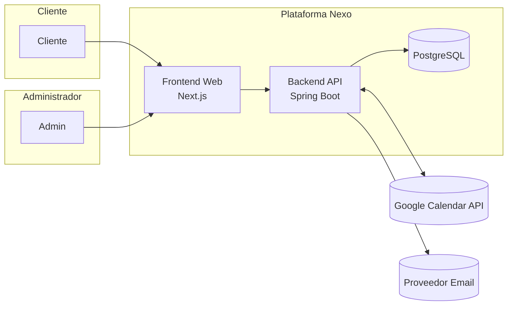
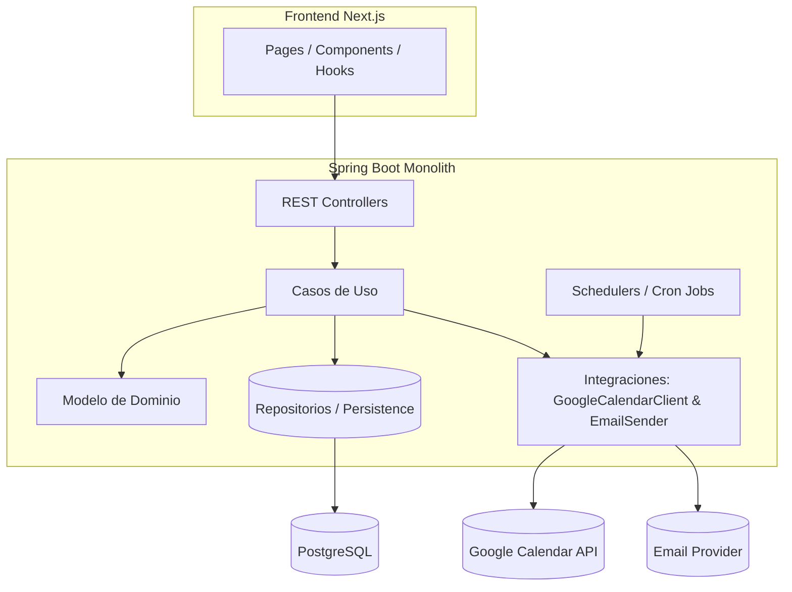
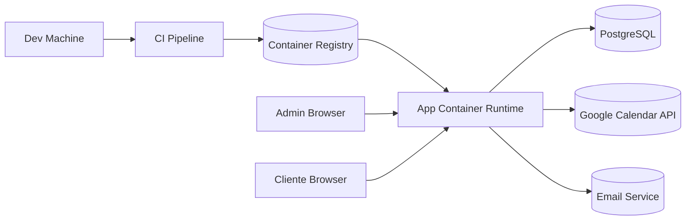
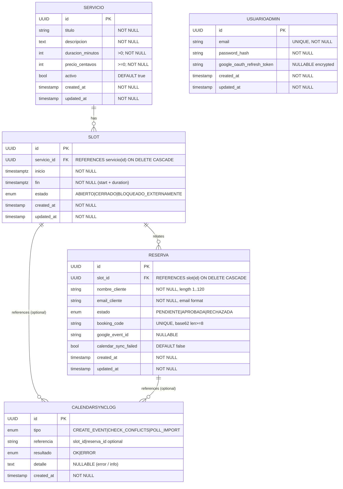

# Nexo - Booking Platform

[](https://github.com/FacuRamallo/AI4Devs-finalproject/actions/workflows/ci.yml)
[](https://github.com/FacuRamallo/AI4Devs-finalproject)
[](https://github.com/FacuRamallo/AI4Devs-finalproject)
[](LICENSE)

## Índice

0. [Ficha del proyecto](#0-ficha-del-proyecto)
1. [Descripción general del producto](#1-descripción-general-del-producto)
2. [Arquitectura del sistema](#2-arquitectura-del-sistema)
3. [Modelo de datos](#3-modelo-de-datos)
4. [Especificación de la API](#4-especificación-de-la-api)
5. [Historias de usuario](#5-historias-de-usuario)
6. [Tickets de trabajo](#6-tickets-de-trabajo)
7. [Pull requests](#7-pull-requests)

---

## 0. Ficha del proyecto

### **0.1. Tu nombre completo:** Facundo Ramallo Miretti

### **0.2. Nombre del proyecto:** Nexo

### **0.3. Descripción breve del proyecto:** Plataforma digital diseñada para **marcas personales, creativas y de consultoría** (1-5 personas) que están en fase de profesionalización y ofrecen servicios como talleres, asesorías o sesiones personalizadas.

### **0.4. URL del proyecto:**

> Puede ser pública o privada, en cuyo caso deberás compartir los accesos de manera segura. Puedes enviarlos a [alvaro@lidr.co](mailto:alvaro@lidr.co) usando algún servicio como [onetimesecret](https://onetimesecret.com/).

### 0.5. URL o archivo comprimido del repositorio

> Puedes tenerlo alojado en público o en privado, en cuyo caso deberás compartir los accesos de manera segura. Puedes enviarlos a [alvaro@lidr.co](mailto:alvaro@lidr.co) usando algún servicio como [onetimesecret](https://onetimesecret.com/). También puedes compartir por correo un archivo zip con el contenido


---
## 1. Descripción general del producto

> Describe en detalle los siguientes aspectos del producto:

### **1.1. Objetivo:**

> Propósito del producto. Qué valor aporta, qué soluciona, y para quién.

El producto es una plataforma digital diseñada para **marcas personales, creativas y de consultoría** (1-5 personas) que están en fase de profesionalización y ofrecen servicios como talleres, asesorías o sesiones personalizadas.

**Soluciona** el problema de la gestión manual e ineficiente de reservas, que actualmente se realiza a través de una combinación de hojas de cálculo, correos electrónicos y mensajería directa. Este método genera una alta carga de trabajo administrativo, es propenso a errores (como el doble-booking) y ofrece una experiencia de cliente fragmentada y poco profesional.

El **valor** que aporta se divide en dos frentes:

* **Para la Marca/Administrador:**
    * **Centralización y Control:** Ofrece un único lugar para publicar su catálogo de servicios y gestionar todas las solicitudes, con un control total para aprobar o rechazar cada reserva.
    * **Reducción de Fricción Operativa:** Automatiza la visualización de la disponibilidad y la comunicación del estado de la reserva, eliminando la necesidad de constantes intercambios de correos.
    * **Eficiencia:** La sincronización bidireccional con su calendario (Google Calendar) previene el doble-booking y elimina la necesidad de consultar manualmente su agenda personal antes de confirmar una solicitud.

* **Para el Usuario Final/Cliente:**
    * **Claridad y Transparencia:** Proporciona una vista clara de los servicios ofrecidos y los horarios disponibles.
    * **Visibilidad Inmediata:** Permite consultar el estado actualizado de su solicitud de reserva en cualquier momento a través de un código único, reduciendo la incertidumbre.

En resumen, el objetivo es **empoderar a los pequeños proveedores de servicios para que gestionen su negocio de forma más profesional y eficiente**, mejorando tanto su operación interna como la experiencia de sus clientes.

### **1.2. Características y funcionalidades principales:**

> Enumera y describe las características y funcionalidades específicas que tiene el producto para satisfacer las necesidades identificadas.

Las funcionalidades del producto (en su versión MVP) se centran en resolver el ciclo completo de la reserva de manera simple y controlada:

**Para la Marca (Backoffice del Administrador):**

* **Gestión del Catálogo de Servicios:**
    * Crear, editar y eliminar servicios definiendo sus atributos clave: título, descripción, duración y precio.
* **Gestión de Disponibilidad (Slots):**
    * Asignar franjas horarias específicas (fecha y hora) a cada servicio para que los clientes puedan reservarlas.
* **Dashboard de Gestión de Reservas:**
    * Visualizar en una lista centralizada todas las solicitudes de reserva que se encuentran en estado "Pendiente".
* **Flujo de Aprobación Manual:**
    * Aprobar o rechazar cada solicitud de reserva con un solo clic, otorgando control total sobre la agenda.
* **Sincronización Bidireccional de Calendario:**
    * Conectar una cuenta de Google Calendar para que los eventos existentes bloqueen automáticamente la disponibilidad en la plataforma, y las reservas aprobadas se añadan como eventos en el calendario.
* **Autenticación Segura:**
    * Un sistema de login para que el administrador acceda a su panel de gestión de forma segura.

**Para el Cliente (Interfaz Pública):**

* **Página de Catálogo de Servicios:**
    * Una página pública y limpia que muestra todos los servicios que la marca ofrece.
* **Detalle de Servicio y Slots Disponibles:**
    * Una vista detallada para cada servicio con su descripción completa y la lista de próximas fechas y horas disponibles para reservar.
* **Formulario de Reserva Simplificado:**
    * Un formulario de solicitud intuitivo que solo pide la información esencial (nombre y email).
* **Página de Consulta de Estado:**
    * Una página accesible a través de un código de reserva único (`booking_code`) donde el cliente puede ver en tiempo real si su solicitud está "Pendiente", "Aprobada" o "Rechazada".

**Funcionalidades del Sistema:**

* **Notificaciones Transaccionales por Email:**
    * Envío de correos electrónicos automáticos al cliente para confirmar la recepción de su solicitud y para notificarle cuando su reserva ha sido aprobada o rechazada.

### **1.4. Instrucciones de instalación:**
#### Prerrequisitos
- **Java 21** (OpenJDK o Temurin)
- **Node.js 18+** y npm
- **Docker** y Docker Compose (para base de datos local)
- **Git**
#### Instalación Local
**1. Clonar el repositorio**
```bash
git clone https://github.com/FacuRamallo/AI4Devs-finalproject.git
cd AI4Devs-finalproject
```
**2. Backend Setup**
```bash
cd backend
# Levantar PostgreSQL con Docker Compose
docker-compose up -d
# Ejecutar migraciones (automático en startup)
./gradlew bootRun
# En otra terminal, ejecutar tests
./gradlew test integrationTest
```
El backend estará disponible en `http://localhost:8080`
**3. Frontend Setup**
```bash
cd frontend
# Instalar dependencias
npm install
# Ejecutar en modo desarrollo
npm run dev
# En otra terminal, ejecutar tests
npm run test
```
El frontend estará disponible en `http://localhost:5173`

---

## 2. Arquitectura del Sistema

### **2.1. Diagrama de arquitectura**

La solución adopta una arquitectura de **Monolito Modular** con separación lógica interna por dominios (catálogo/servicios, slots, reservas, sincronización de calendario, notificaciones y autenticación). Se utiliza un enfoque inspirado en **arquitectura hexagonal** para aislar el dominio de los detalles de infraestructura e integraciones externas.

#### Contexto (C4 Nivel 1)



#### Contenedores / Capas Backend (C4 Nivel 2 simplificado)



#### Justificación Arquitectónica
| Aspecto | Razón | Beneficio | Trade-off |
|---------|-------|-----------|-----------|
| Monolito Modular | Dominio aún cambiante, equipo pequeño | Simplicidad operativa, despliegue único | Escalado granular limitado |
| PostgreSQL | Modelo fuertemente relacional, transacciones | Integridad y consultas eficientes | Migraciones requieren disciplina |
| Sincronización por Polling | Reducir complejidad inicial | Menor time-to-market | Ventana corta de inconsistencia |
| Hexagonal | Aislar dominio de infraestructura | Facilita pruebas y futuras extracciones | Capa adicional de abstracción |
| Jobs internos | Orquestar sincronizaciones Calendar | Control centralizado | Podrían necesitar externalizarse si crece volumen |

### **2.2. Descripción de componentes principales**

1. Frontend (Next.js / React)
     - Renderizado híbrido (SSR/ISR) para catálogo y detalle de servicios.
     - Consumo de API REST backend.
     - Páginas clave: catálogo, detalle de servicio + slots, formulario reserva, consulta estado (booking_code), login admin, dashboard de reservas.

2. Backend API (Spring Boot Kotlin)
     - Exposición de endpoints REST (JSON).
     - Validación de entrada (DTOs) y serialización.
     - Manejo de errores uniforme (HTTP status + payload estándar).

3. Servicios de Aplicación
     - Orquestan casos de uso: crear servicio, generar slots, registrar reserva, aprobar/rechazar, sincronizar calendario.
     - Implementan lógica transaccional (consistencia entre Reserva, Slot y eventos Calendar).

4. Dominio
     - Entidades y agregados: Servicio, Slot, Reserva, UsuarioAdmin, CalendarSyncLog.
     - Reglas de negocio (invariantes, estados válidos, generación de booking_code, transición de estados).

5. Persistencia (Repositorios)
     - Implementaciones JPA / Spring Data para PostgreSQL.
     - Migraciones manejadas con Flyway (naming incremental V1__, V2__, etc.).

6. Integraciones Externas
     - Google Calendar Client: llamadas para listar eventos en ventana de tiempo, crear evento al aprobar una reserva, comprobar conflictos en creación/aprobación.
     - Email Sender: envío de notificaciones transaccionales (solicitud recibida, aprobación, rechazo).

7. Jobs / Scheduler
     - Tarea periódica (cada 5-10 min) que sincroniza eventos de los próximos X días y bloquea slots solapados (estado BLOQUEADO_EXTERNAMENTE).
     - Registro de outcomes en CalendarSyncLog para trazabilidad.

8. Base de Datos (PostgreSQL)
     - Modelo normalizado con índices para queries de disponibilidad y búsqueda por booking_code.

9. Autenticación / Autorización
     - Login administrador (email + password hash Argon2/BCrypt) + sesión/JWT corta duración.
     - Protección de endpoints /admin/** y acciones de mutación.

10. Observabilidad (futuro cercano)
        - Logs estructurados (JSON) + métricas (Micrometer / Prometheus) + health checks /actuator.

### **2.3. Descripción de alto nivel del proyecto y estructura de ficheros**

Se adopta una **plantilla de arquitectura horizontal (por capas)** simple dentro de un único módulo backend. El root del código es `src/` y bajo él sólo existen tres carpetas de primer nivel: `application`, `domain` e `infrastructure`. **Toda la configuración (Spring Boot, beans, seguridad, mapeos, scheduler, adapters) reside dentro de `infrastructure/`.**

```
backend/
    build.gradle.kts
    settings.gradle.kts
    src/
        application/
            usecase/              (Servicios de aplicación / orquestación de casos de uso)
            dto/                  (Request/response / comandos / queries)
            service/              (Aplicación pura: coordinan dominio y puertos)
            mapper/               (Mapeos DTO <-> dominio si no van en adapters)
        domain/
            model/                (Entidades, Value Objects, agregados)
            repository/           (Interfaces de repositorio - puertos de salida)
            event/                (Eventos de dominio / domain events internos)
            exception/            (Excepciones de negocio)
            policy/               (Reglas complejas / especificaciones)
        infrastructure/
            config/               (Configuration classes, Bean definitions, properties binding)
            persistence/          (Implementaciones repositorios JPA, entidades ORM si separadas)
            adapter/
                web/                (Controllers REST, validación, serialización)
                calendar/           (Cliente Google Calendar, DTO externos, traducción a dominio)
                email/              (Email sender implementation)
            security/             (Filters, Auth providers, JWT/session, password encoder)
            scheduling/           (Jobs, schedulers, locking, cron expressions)
            mapper/               (MapStruct / manual mappers específicos de infraestructura)
            migration/            (Scripts Flyway en resources/db/migration)
    src/main/resources/
        application.yml
        db/migration/           (Flyway V1__..., V2__...)

frontend/
    package.json
    src/
        pages/
        components/
        lib/api/
        styles/

docs/                     (Documentación: ADRs, arquitectura, modelo de datos)
```

#### Reglas de Dependencias (Layering)
1. `domain` no depende de ninguna otra capa (cero imports de Spring / frameworks).
2. `application` depende sólo de `domain` y define casos de uso; expone puertos (interfaces) que implementa `infrastructure`.
3. `infrastructure` puede depender de `application` y `domain` (implementa puertos, expone adapters web, persistence, integraciones externas).
4. Los controladores REST viven en `infrastructure/adapter/web` y llaman exclusivamente a clases de `application` (no acceden directamente a repositorios ni entidades ORM si se separan).
5. La configuración (anotaciones @Configuration, @Bean, @EnableScheduling, @EntityScan, @EnableJpaRepositories, security) se centraliza en `infrastructure/config`.

#### Flujo de un Caso de Uso (Ejemplo: Aprobar Reserva)
Controller (adapter web) -> Servicio Application (usecase/service) -> Dominio (valida invariantes en entidades) -> Repositorio (puerto) -> Implementación JPA (persistence) -> Integración Calendar (adapter calendar) -> Actualización dominio -> Retorno DTO.

#### Beneficios de la Plantilla Horizontal
* Simplicidad: árbol de directorios predecible.
* Aislamiento del dominio: posible moverlo a librería futura sin arrastrar infraestructura.
* Facilidad para testing: tests unitarios apuntan a `domain` y `application` sin levantar Spring; tests de integración se enfocan en `infrastructure`.
* Evolutivo: si un subdominio crece se puede extraer a módulo independiente replicando la misma plantilla.

#### Convenciones Adicionales
* Sufijos: `*UseCase`, `*Service` (application); `*Repository` (domain interface), `*RepositoryJpa` (infrastructure impl). 
* Métodos de dominio expresivos que encapsulan invariantes (ej: `slot.aprobarReserva(reserva)` en lugar de mutaciones directas de campos).
* Objetos inmutables en Value Objects (data class Kotlin + validación en init).
* DTO de entrada/salida no filtran a dominio: conversión explícita.
* Eventos de dominio publicados como objetos simples y manejados en `application` (sin acoplar a un bus externo por ahora).

### **2.4. Infraestructura y despliegue**

#### Diagrama Infra Simplificado



Pipeline (propuesto):
1. Push a main / PR: Ejecuta build + tests + análisis estático (lint, calidad). 
2. Construcción de imagen Docker (multi-stage: build + runtime slim).
3. Publicación en registry (tag semántico + commit SHA).
4. Despliegue automatizado (CD) a entorno staging → smoke tests → promoción a producción manual (botón) inicialmente.

Entornos:
* local: Docker Compose (app + postgres + mailhog fake + scheduler interno).
* staging: PostgreSQL gestionado (RDS / CloudSQL), credenciales de test, quotas API calendar bajas.
* producción: PostgreSQL gestionado (backups automáticos, PITR), secrets en store (Vault / AWS SM / GCP Secret Manager).

Operaciones:
* Migraciones Flyway corren en startup (fail-fast si mismatch).
* Scheduler activo sólo en un nodo (líder) para evitar ejecuciones duplicadas (estrategia: lock en DB mediante table-based advisory lock o ShedLock).

Escalabilidad Inicial:
* Vertical (aumentar CPU/RAM) suficiente para MVP.
* Horizontal futura: separar frontend estático (CDN) y escalar contenedor backend; posible partición por módulos si surge necesidad.

### **2.5. Seguridad**

Prácticas implementadas / previstas:
1. Almacenamiento seguro de credenciales: password_hash con BCrypt/Argon2, refresh token de Google cifrado (pgcrypto / KMS). 
2. Principio de mínimo privilegio: usuario DB con sólo permisos DML/DDL controlados.
3. Validación exhaustiva de entrada: DTOs con bean validation (length, formatos email, enums restringidos).
4. Protección contra CSRF: no necesaria para API stateless si sólo JWT/Bearer; si se usa sesión, habilitar CSRF tokens en rutas mutables admin.
5. Rate limiting básico (futuro) en endpoints sensibles (login, verificar estado reserva) para evitar enumeración de booking_code.
6. Generación de booking_code: base62 aleatorio longitud >=8 para reducir colisiones y evitar predicción.
7. Headers de seguridad (frontend/backend): HSTS, X-Content-Type-Options, X-Frame-Options=DENY, CSP restrictiva.
8. Logs sin datos sensibles (no tokens ni hashes). 
9. Dependabot / Renovate para parches de seguridad.
10. Sanitización de errores: respuestas de error genéricas para stack traces internos.

### **2.6. Tests**

La estrategia se separa explícitamente entre Backend y Frontend, buscando equilibrio entre velocidad de feedback y confianza.

#### Backend

Capas y tipos de pruebas:
1. Unitarias (Casos de Uso / Application Layer)
    - Se testean los servicios de aplicación (use cases) como unidad: lógica de orquestación, validación de precondiciones, transiciones de estado, interacción con puertos (repositorios / integraciones) usando dobles (mocks/fakes/stubs).
    - NO se escriben tests unitarios detallados para entidades de dominio aisladas salvo que contengan lógica compleja (evitamos over-testing getters/setters / invariantes triviales). Las reglas relevantes se cubren indirectamente vía casos de uso.
2. Aceptación por Feature (Happy Path)
    - Un test por feature principal que recorra el flujo exitoso completo: crear servicio → generar slot → reservar → aprobar reserva → verificar evento calendar simulado. Objetivo: actuar como especificación ejecutable.
    - Simulan infraestructura mediante test doubles (WireMock para Calendar, in‑memory o Testcontainers para DB si se requiere persistencia real).
3. Integración (Persistencia)
    - Repositorios JPA probados contra PostgreSQL real (Testcontainers) verificando: constraints (UNIQUE), cascadas, índices (consultas de disponibilidad), mapeos ORM y transaccionalidad en operaciones críticas.
4. Integración (Clientes Externos)
    - Google Calendar Client: escenarios de conflicto, sin conflicto, error 429 (retry/backoff) usando WireMock.
    - Email Sender: verificación de formato mínimo y plantilla (assert sobre payload capturado / mailbox in-memory).
5. Jobs / Scheduler
    - Verifican que el job de sincronización marca slots solapados y persiste logs en `CalendarSyncLog` evitando duplicados (lock / exclusión mutua).
6. End-to-End API (Smoke)
    - 1–2 pruebas ligeras arrancando la aplicación (perfil test) validando health y un flujo de reserva minimalista (sin cubrir todos los bordes ya cubiertos en integración/aceptación).

Cobertura Objetivo Backend:
* Líneas global: ≥ 70%
* Casos de uso críticos / reglas de negocio sensibles: ≥ 85%
* Mutación (futuro): evaluar score > 60% en módulos de dominio para garantizar valor real de los asserts.

Herramientas / Librerías (propuesto): JUnit 5, MockK, Testcontainers, WireMock, AssertJ, Spring Boot Test, JaCoCo.

#### Frontend

Objetivo: garantizar que la interfaz comunica correctamente el estado del sistema y flujos críticos (reserva y aprobación visible) funcionan, con énfasis en accesibilidad y resiliencia de UI ante cambios menores de layout.

Capas de pruebas:
1. Unitarias de Componentes
    - React Testing Library (RTL) enfocada en comportamiento (queries por rol/texto) evitando snapshots indiscriminados.
    - Hooks personalizados (ej. uso de API, form state) testeados aislando fetch con `msw`.
2. Integración de Vistas / Páginas
    - Montaje de página completa (catálogo, detalle servicio, formulario reserva, estado reserva) con `msw` simulando API: valida composición de componentes y manejo de estados (loading, error, success).
3. End-to-End (E2E)
    - Playwright o Cypress para flujos principales: (a) usuario navega catálogo→detalle→crea reserva→ve código; (b) admin login→aprueba reserva→cliente refresca estado y ve cambio.
    - Ejecutar en CI en modo headless y subir vídeos/screenshots solo cuando fallan.
4. Pruebas de Contrato (API ↔ Frontend)
    - Generación de tipos TypeScript desde OpenAPI (evita desajustes). Validación en build: si cambia el contrato se fuerza ajuste del frontend.
5. Accesibilidad (a11y)
    - Linter + tests automáticos con `axe-core` / `jest-axe` sobre páginas clave (sin errores críticos WCAG nivel A/AA).
6. Visual Regression (Opcional Futuro)
    - Storybook + Chromatic o Loki en componentes críticos (formularios / estados vacíos / lista de slots).

Pirámide Frontend (target aproximado): 60% unit/integración de componentes, 30% integración páginas, 10% E2E.

Métricas Objetivo Frontend:
* Cobertura líneas: ≥ 60% (priorizando paths críticos sobre cobertura total artificial).
* 0 violaciones severas a11y en páginas principales.
* Tiempo mediano de ejecución test suite < 4 minutos en CI.

#### CI / Pipeline de Calidad Unificado
1. Etapa rápida (PR): unit tests backend + unit/integración frontend + lint (ESLint / Kotlin detekt) + verificación OpenAPI → tipos TS.
2. Etapa integración: Testcontainers + WireMock + aceptación backend + a11y básico.
3. Etapa E2E: despliegue efímero (Docker Compose) + Playwright/Cypress.
4. Publicación de reportes: JUnit XML, JaCoCo, coverage LCOV (frontend), artefactos de fallos E2E.

#### Métricas de Calidad Futuras
* Backend: tiempo medio aprobación reserva, % fallos sincronización calendar, latencia p95 consulta slots.
* Frontend: error rate consola (capturado vía monitoring), tiempo interacción primera (TTI) en páginas clave (observado), ratio reintentos fetch.
* Estabilidad: tasa de flaky tests (<2% en 30 días).

---

## 3. Modelo de Datos

### **3.1. Diagrama del modelo de datos:**

El modelo refleja las entidades mínimas necesarias para el MVP de gestión de servicios, slots y reservas con sincronización de calendario y auditoría básica.



Notas del diagrama:
* `fin` se persiste aunque es derivable para optimizar queries e índices (detección solapamientos y ordenación).
* `booking_code` se genera una sola vez y nunca cambia (permite consultas públicas sin exponer UUID interno).
* `calendar_sync_failed` actúa como flag para reintentos/resolución manual.
* `CalendarSyncLog.referencia` es texto simple para desacoplar (almacena UUID en string) y permitir logs que no referencian algo específico.


### **3.2. Descripción de entidades principales:**

#### 1. Servicio
Representa una oferta concreta reservable (taller, asesoría, sesión). Se usa como plantilla para generar slots.

| Atributo | Tipo | Constraints | Descripción |
|----------|------|-------------|-------------|
| id | UUID | PK | Identificador único.
| titulo | string (<=150) | NOT NULL | Nombre visible del servicio.
| descripcion | text | NOT NULL | Detalle ampliado mostrado en la página de detalle.
| duracion_minutos | int | NOT NULL, >0, <=1440 | Duración estándar de cada slot/reserva.
| precio_centavos | int | NOT NULL, >=0 | Precio almacenado en centavos para evitar decimales flotantes.
| activo | bool | DEFAULT true | Permite ocultar servicio sin borrarlo.
| created_at | timestamptz | NOT NULL | Creado (servidor).
| updated_at | timestamptz | NOT NULL | Última modificación.

Relaciones: 1..N con `Slot` (cascada lógica / física ON DELETE CASCADE aceptable en MVP). 

Índices sugeridos: PK + (activo) combinado con otros filtros en queries de catálogo (opcional futuro).

#### 2. Slot
Unidad concreta de disponibilidad (fecha/hora específica) asociada a un `Servicio`.

| Atributo | Tipo | Constraints | Descripción |
|----------|------|-------------|-------------|
| id | UUID | PK | Identificador.
| servicio_id | UUID | FK NOT NULL | Referencia a Servicio.
| inicio | timestamptz | NOT NULL | Inicio exacto del slot (zona UTC almacenada).
| fin | timestamptz | NOT NULL | Fin (inicio + duración servicio) materializado.
| estado | enum | NOT NULL, valores: ABIERTO, CERRADO, BLOQUEADO_EXTERNAMENTE | Estado operativo.
| created_at | timestamptz | NOT NULL | Creado.
| updated_at | timestamptz | NOT NULL | Actualizado.

Constraints / Reglas:
* UNIQUE(servicio_id, inicio) previene duplicación de disponibilidades.
* Sólo se marca `CERRADO` al aprobar una reserva; revertir no abre automáticamente (decisión simplificada MVP).
* `BLOQUEADO_EXTERNAMENTE` se aplica cuando un evento de Google Calendar solapa (polling scheduler).

Índices: (servicio_id, inicio), (inicio, estado) para listar próximos slots abiertos ordenados cronológicamente.

#### 3. Reserva
Solicitud de un cliente sobre un `Slot`. Pasa por ciclo de vida manual.

| Atributo | Tipo | Constraints | Descripción |
|----------|------|-------------|-------------|
| id | UUID | PK | Identificador.
| slot_id | UUID | FK NOT NULL | Slot reservado.
| nombre_cliente | string (<=120) | NOT NULL | Nombre mostrado en emails / panel.
| email_cliente | string (<=180) | NOT NULL, formato email | Contacto para notificaciones.
| estado | enum | NOT NULL (PENDIENTE/APROBADA/RECHAZADA) | Ciclo de aprobación.
| booking_code | string (len 8-16) | UNIQUE, NOT NULL | Código público para consulta del estado.
| google_event_id | string | NULLABLE | ID del evento creado al aprobar (si integración activa).
| calendar_sync_failed | bool | DEFAULT false | Indica fallo último intento de sincronización.
| created_at | timestamptz | NOT NULL | Creado.
| updated_at | timestamptz | NOT NULL | Actualizado.

Reglas:
* Sólo puede existir UNA reserva APROBADA por Slot (enforcement: transición controlada + validez de negocio; se puede reforzar índice parcial: UNIQUE(slot_id) WHERE estado='APROBADA').
* Al RECHAZAR no se altera el estado del Slot (permanece ABIERTO) para permitir otra reserva.
* `booking_code` se genera aleatoriamente (base62) evitando enumeración fácil; se contempla rate limiting a endpoint de consulta.

Índices: UNIQUE(booking_code), (slot_id, estado) para recuperar reserva aprobada o pendientes por slot.

#### 4. UsuarioAdmin
Usuario interno que gestiona catálogo y reservas.

| Atributo | Tipo | Constraints | Descripción |
|----------|------|-------------|-------------|
| id | UUID | PK | Identificador.
| email | string (<=180) | UNIQUE, NOT NULL | Credencial principal de login.
| password_hash | string | NOT NULL | Hash seguro (BCrypt / Argon2) con parámetros calibrados.
| google_oauth_refresh_token | string | NULLABLE, cifrado | Token para acceso offline a Calendar.
| created_at | timestamptz | NOT NULL | Creado.
| updated_at | timestamptz | NOT NULL | Actualizado.

Reglas: email único; rotación de refresh token invalida el anterior en almacenamiento.

#### 5. CalendarSyncLog
Auditoría de operaciones de sincronización / polling con Google Calendar y creación de eventos.

| Atributo | Tipo | Constraints | Descripción |
|----------|------|-------------|-------------|
| id | UUID | PK | Identificador.
| tipo | enum | NOT NULL (CREATE_EVENT, CHECK_CONFLICTS, POLL_IMPORT) | Tipo de acción.
| referencia | string | NULLABLE | UUID de Slot o Reserva (string crudo) si aplica.
| resultado | enum | NOT NULL (OK, ERROR) | Resultado final.
| detalle | text | NULLABLE | Mensaje de error o resumen operación.
| created_at | timestamptz | NOT NULL | Timestamp del log.

Uso: soporte de troubleshooting y métricas (ratio errores). No se elimina (only append). Puede crecer; estrategia futura: partición o TTL archivado.

### Enumeraciones
```
Slot.estado: ABIERTO, CERRADO, BLOQUEADO_EXTERNAMENTE
Reserva.estado: PENDIENTE, APROBADA, RECHAZADA
CalendarSyncLog.tipo: CREATE_EVENT, CHECK_CONFLICTS, POLL_IMPORT
CalendarSyncLog.resultado: OK, ERROR
```

### Invariantes de Negocio (Resumen)
1. Un Slot sólo puede tener a la vez 0..1 Reserva APROBADA.
2. Transición válida Reserva: PENDIENTE -> (APROBADA | RECHAZADA); no se permite reabrir a PENDIENTE.
3. Estado Slot: ABIERTO -> CERRADO (al aprobar reserva) es unidireccional; BLOQUEADO_EXTERNAMENTE puede volver a ABIERTO si el evento externo desaparece (futuro), MVP: regenerar slots.
4. Solapamientos se previenen vía lógica de generación (no se crean slots superpuestos para un mismo servicio) y bloqueo externo marca estado sin borrar.
5. `booking_code` es único y no expone UUID internos.

### Estrategia de Índices
| Tabla | Índice | Propósito |
|-------|--------|-----------|
| slot | (servicio_id, inicio) | Listar slots futuros por servicio ordenados.
| slot | (inicio, estado) | Recuperar próximos ABIERTO para catálogo.
| reserva | unique(booking_code) | Búsqueda pública por código.
| reserva | (slot_id, estado) | Verificar existencia de aprobada / listar pendientes.
| reserva | unique(slot_id) where estado='APROBADA' (parcial) | Garantizar sólo una aprobada (si la BD lo soporta: PostgreSQL).

### Justificación de Diseño
* UUID como PK evita filtrado incremental y favorece generación lado aplicación.
* Persistir `fin` reduce cálculos repetidos y facilita consultas de overlapping: `WHERE slot.inicio < X AND slot.fin > Y`.
* Flag `calendar_sync_failed` permite reintentos idempotentes sin duplicar logs de error en exceso.
* Log separado (`CalendarSyncLog`) desacopla auditoría de entidades principales y evita bloat de columnas específicas en `Reserva` / `Slot`.

### Posible DDL (PostgreSQL Simplificado)
```sql
CREATE TABLE servicio (
    id UUID PRIMARY KEY,
    titulo VARCHAR(150) NOT NULL,
    descripcion TEXT NOT NULL,
    duracion_minutos INT NOT NULL CHECK (duracion_minutos > 0 AND duracion_minutos <= 1440),
    precio_centavos INT NOT NULL CHECK (precio_centavos >= 0),
    activo BOOLEAN NOT NULL DEFAULT TRUE,
    created_at TIMESTAMPTZ NOT NULL,
    updated_at TIMESTAMPTZ NOT NULL
);

CREATE TABLE slot (
    id UUID PRIMARY KEY,
    servicio_id UUID NOT NULL REFERENCES servicio(id) ON DELETE CASCADE,
    inicio TIMESTAMPTZ NOT NULL,
    fin TIMESTAMPTZ NOT NULL,
    estado VARCHAR(32) NOT NULL,
    created_at TIMESTAMPTZ NOT NULL,
    updated_at TIMESTAMPTZ NOT NULL,
    CONSTRAINT uq_slot_servicio_inicio UNIQUE (servicio_id, inicio)
);
CREATE INDEX idx_slot_servicio_inicio ON slot(servicio_id, inicio);
CREATE INDEX idx_slot_inicio_estado ON slot(inicio, estado);

CREATE TABLE reserva (
    id UUID PRIMARY KEY,
    slot_id UUID NOT NULL REFERENCES slot(id) ON DELETE CASCADE,
    nombre_cliente VARCHAR(120) NOT NULL,
    email_cliente VARCHAR(180) NOT NULL,
    estado VARCHAR(32) NOT NULL,
    booking_code VARCHAR(32) NOT NULL UNIQUE,
    google_event_id VARCHAR(120),
    calendar_sync_failed BOOLEAN NOT NULL DEFAULT FALSE,
    created_at TIMESTAMPTZ NOT NULL,
    updated_at TIMESTAMPTZ NOT NULL
);
CREATE INDEX idx_reserva_slot_estado ON reserva(slot_id, estado);
-- Índice parcial (PostgreSQL): asegura sólo una aprobada por slot
CREATE UNIQUE INDEX uq_reserva_slot_aprobada ON reserva(slot_id) WHERE (estado = 'APROBADA');

CREATE TABLE usuario_admin (
    id UUID PRIMARY KEY,
    email VARCHAR(180) NOT NULL UNIQUE,
    password_hash VARCHAR(255) NOT NULL,
    google_oauth_refresh_token TEXT,
    created_at TIMESTAMPTZ NOT NULL,
    updated_at TIMESTAMPTZ NOT NULL
);

CREATE TABLE calendar_sync_log (
    id UUID PRIMARY KEY,
    tipo VARCHAR(32) NOT NULL,
    referencia VARCHAR(64),
    resultado VARCHAR(16) NOT NULL,
    detalle TEXT,
    created_at TIMESTAMPTZ NOT NULL
);
```

### Riesgos y Mitigaciones
| Riesgo | Impacto | Mitigación |
|--------|---------|------------|
| Crecimiento ilimitado de CalendarSyncLog | Degradación de rendimiento lecturas sec. | Archivar/particionar por fecha; retención 90 días. |
| Enumeración de booking_code | Acceso masivo a estados de reservas | Código base62 suficiente longitud + rate limiting endpoint. |
| Conflictos al aprobar (evento ya creado manualmente) | Doble booking en calendario externo | Verificación previa + rollback transacción + log ERROR. |
| Reloj no sincronizado en servidor | Slots futuros marcados incorrectamente | NTP en infraestructura + comparación siempre en UTC. |

### Evoluciones Futuras (No incluidas en MVP)
* Multi-admin / ownership por Organización (añadir tabla `organizacion` y FK en `servicio`/`usuario_admin`).
* Historial de cambios de estado de Reserva (tabla `reserva_history`).
* Cancelación de reservas por cliente con token firmado (añadir campo `cancel_token`).
* Soft-delete de Servicios (campo `deleted_at`).

---

## 4. Especificación de la API

### 4.1 Endpoints Clave (MVP)

A continuación un extracto minimalista (OpenAPI 3.0) que cubre el recorrido central del MVP: (1) catálogo público, (2) crear reserva, (3) consultar estado de la reserva por `booking_code`.

```yaml
openapi: 3.0.3
info:
    title: Nexo Core Public API (Extracto MVP)
    version: 0.1.0
servers:
    - url: https://api.nexo.example/v1
paths:
    /services:
        get:
            summary: Listar servicios activos
            operationId: listServices
            responses:
                '200':
                    description: OK
                    content:
                        application/json:
                            schema:
                                type: array
                                items:
                                    type: object
                                    properties:
                                        id: { type: string, format: uuid }
                                        title: { type: string }
                                        duration_minutes: { type: integer }
                                        price_cents: { type: integer }
    /bookings:
        post:
            summary: Crear reserva (estado inicial PENDING)
            operationId: createBooking
            requestBody:
                required: true
                content:
                    application/json:
                        schema:
                            type: object
                            required: [slot_id, name, email]
                            properties:
                                slot_id: { type: string, format: uuid }
                                name: { type: string, minLength: 2 }
                                email: { type: string, format: email }
            responses:
                '201':
                    description: Creada
                    content:
                        application/json:
                            schema:
                                type: object
                                properties:
                                    id: { type: string, format: uuid }
                                    slot_id: { type: string, format: uuid }
                                    status: { type: string, enum: [PENDING, APPROVED, REJECTED] }
                                    booking_code: { type: string }
                                    created_at: { type: string, format: date-time }
                '400': { description: Datos inválidos }
                '404': { description: Slot inexistente }
                '409': { description: Conflicto (slot ya cerrado) }
    /bookings/{booking_code}:
        get:
            summary: Consultar estado de reserva por código público
            operationId: getBookingByCode
            parameters:
                - in: path
                    name: booking_code
                    required: true
                    schema: { type: string }
            responses:
                '200':
                    description: OK
                    content:
                        application/json:
                            schema:
                                type: object
                                properties:
                                    booking_code: { type: string }
                                    status: { type: string, enum: [PENDING, APPROVED, REJECTED] }
                                    slot:
                                        type: object
                                        properties:
                                            start: { type: string, format: date-time }
                                            end: { type: string, format: date-time }
                                    service:
                                        type: object
                                        properties:
                                            title: { type: string }
                                            duration_minutes: { type: integer }
                '404': { description: No encontrada }
```

### 4.2 Ejemplos Breves

1. Listar servicios
```
GET /v1/services
200 OK
[
    {"id":"a1...","title":"Asesoría Personal","duration_minutes":60,"price_cents":5000}
]
```

2. Crear reserva
```
POST /v1/bookings
{"slot_id":"b2...","name":"Laura","email":"laura@example.com"}
201 Created
{"id":"c3...","slot_id":"b2...","status":"PENDING","booking_code":"X7K9Q2","created_at":"2025-09-24T10:12:05Z"}
```

3. Consultar estado
```
GET /v1/bookings/X7K9Q2
200 OK
{"booking_code":"X7K9Q2","status":"APPROVED","slot":{"start":"2025-09-30T15:00:00Z","end":"2025-09-30T16:00:00Z"},"service":{"title":"Asesoría Personal","duration_minutes":60}}
```

### 4.3 Notas
* Autenticación: no requerida en estos endpoints públicos (creación y consulta). Endpoints administrativos usan Bearer JWT y quedan fuera del extracto.
* Contrato completo: ver `openapi.yaml` en la raíz del repositorio.

---

## 5. Historias de Usuario
**Historia de Usuario 1: Creación de un Servicio**  
Como Administrador, quiero crear un servicio con título, descripción, duración y precio para publicar mi oferta.  
Aceptación: 
- (1) Form con campos requeridos y validaciones básicas, 
- (2) Servicio aparece en listado tras guardar, 
- (3) Puedo editar/eliminar posteriormente.  
Valor: Habilita catálogo inicial y base para slots.

**Historia de Usuario 2: Solicitud de Reserva de un Slot**  
Como Visitante, quiero seleccionar un slot abierto y enviar mi nombre y email para solicitar una reserva.  
Aceptación: 
- (1) Detalle servicio muestra próximos slots abiertos futuros, 
- (2) Al elegir slot aparece form (nombre, email), 
- (3) Se crea reserva PENDIENTE con booking_code y se muestra página de confirmación, 
- (4) Email de recepción enviado.  
Valor: Captura demanda y genera identificador público.

**Historia de Usuario 3: Aprobación/Rechazo de Reserva**  
Como Administrador, quiero ver reservas PENDIENTES y aprobar o rechazar para controlar mi agenda.  
Aceptación: 
- (1) Dashboard lista reservas PENDIENTES con datos clave (cliente, servicio, slot), 
- (2) Botón Aprobar → estado APROBADA y slot pasa a CERRADO + evento calendar creado, 
- (3) Botón Rechazar → estado RECHAZADA y slot permanece ABIERTO, 
- (4) Emails de notificación enviados según acción, 
- (5) Errores de calendar logueados sin romper aprobación.  
Valor: Cierra el ciclo operativo y evita doble-booking.

---

## 6. Tickets de Trabajo

> Documenta 3 de los tickets de trabajo principales del desarrollo, uno de backend, uno de frontend, y uno de bases de datos. Da todo el detalle requerido para desarrollar la tarea de inicio a fin teniendo en cuenta las buenas prácticas al respecto. 

**Resumen General:** La planificación completa y el set mínimo de tickets se documenta en `docs/work-tickets.md` (T01–T05). A continuación se detallan 3 tickets representativos solicitados: uno de backend, uno de frontend y uno de base de datos, con el formato completo listo para su ejecución.

### Ticket 1 (Backend) – Implementar Core Dominio + API Básica de Servicios/Slots/Reservas/Auth (Corresponde a T03)
**Objetivo:** Exponer endpoints públicos y administrativos para gestionar Servicios, Slots y Reservas (creación y aprobación/rechazo), junto con autenticación de administrador usando JWT, alineado a la arquitectura hexagonal y modelo de datos definidos.

**Alcance IN:**
1. Entidades de dominio Kotlin puras: `Servicio`, `Slot`, `Reserva`, `UsuarioAdmin` + invariantes (transiciones de estado, unicidad reserva aprobada por slot).
2. Interfaces de repositorio en capa `domain` y sus implementaciones JPA en `infrastructure`.
3. Casos de uso (`CreateServiceUseCase`, `UpdateServiceUseCase`, `CreateSlotUseCase`, `CreateBookingUseCase`, `ApproveBookingUseCase`, `RejectBookingUseCase`, `GetBookingStatusUseCase`).
4. Controladores REST:
    - Públicos: `GET /v1/services`, `GET /v1/services/{id}`, `POST /v1/bookings`, `GET /v1/bookings/{booking_code}`.
    - Admin (protegidos): CRUD servicios (`/admin/services`), creación slots (`/admin/services/{id}/slots`), listado reservas pendientes + aprobación/rechazo (`/admin/bookings/pending`, `/admin/bookings/{id}/approve|reject`).
5. Autenticación: endpoint `POST /v1/admin/login` (email + password) → JWT corto (30m). Filtro / middleware para proteger `/admin/**`.
6. Generación `booking_code`: base62 longitud 8–10, verificación de unicidad, utilidad dedicada.
7. Manejo uniforme de errores: respuesta JSON estándar (`timestamp`, `path`, `error_code`, `message`).
8. Actualización de `openapi.yaml` y README (sección API si aplica).
9. Tests:
    - Unit: invariantes dominio (slots, reservas, aprobación conflictiva).
    - Integración: endpoints clave (happy path + error 404/409), repositorio con DB embebida o testcontainer.
10. Lint / formateo (ktlint / detekt configurados si no existen; failing build si infracción severa).

**Alcance OUT:** Google Calendar, Emails, Scheduler (van en ticket distinto). Rate limiting robusto (dejar TODO con referencia futura si no se implementa simple conteo en memoria).

**Dependencias:** Migraciones base (Ticket DB abajo) deben existir; pipeline CI (T01) activo.

**Entradas / Salidas (Contrato breve):**
- Entrada crear reserva: `{slot_id, name, email}` → Salida 201: `{id, slot_id, status:PENDING, booking_code, created_at}`.
- Consulta estado: `GET /v1/bookings/{booking_code}` → 200: `{booking_code,status,slot:{start,end},service:{title,duration_minutes}}` o 404.

**Criterios de Aceptación (CA):**
1. Crear servicio 201 con validaciones (título obligatorio, duración >0).
2. Crear slot calcula `fin = inicio + duracion_servicio` y respeta `UNIQUE(servicio_id,inicio)`.
3. Crear reserva produce estado `PENDIENTE` y `booking_code` único.
4. Aprobación cambia reserva a `APROBADA` y slot a `CERRADO`; rechazo cambia reserva a `RECHAZADA` y slot permanece `ABIERTO`.
5. Endpoint público catálogo no lista servicios `activo=false` ni slots pasados.
6. Login inválido retorna 401; válido retorna token usable para consumir un endpoint admin.
7. Tests cubren cada CA con al menos un caso (unit o integración).
8. Build CI verde (incluyendo lint / tests) en PR.

**Definición de Hecho (DoD):** CA cumplidos, cobertura domain+application ≥60%, documentación OpenAPI actualizada, sin TODO críticos sin issue.

**Riesgos y Mitigación:**
| Riesgo | Mitigación |
|--------|------------|
| Condición de carrera al aprobar simultáneo | Constraint parcial + transacción serializable / retry. |
| Fuga de entidades JPA al exterior | Uso de DTOs de salida dedicados. |

**Métrica de Éxito:** P99 latencia creación reserva <300 ms en staging (log temporal). 0 fallos de unicidad en pruebas de concurrencia ligera.

**Tareas (Check-list):**
- [ ] Definir enums y entidades dominio.
- [ ] Repositorios interfaz + impl JPA.
- [ ] Casos de uso.
- [ ] Servicios de autenticación + hashing BCrypt.
- [ ] Controladores públicos.
- [ ] Controladores admin.
- [ ] DTOs + mapeadores.
- [ ] Generador `booking_code` + test colisiones.
- [ ] Manejo excepciones global.
- [ ] OpenAPI y README.
- [ ] Tests unitarios dominio.
- [ ] Tests integración endpoints.
- [ ] Revisar logs (no exponer datos sensibles).

---
### Ticket 2 (Frontend) – Implementar UI Pública y Backoffice Básico (Corresponde a T05)
**Objetivo:** Entregar la experiencia de usuario completa: catálogo público, detalle servicio con slots, creación de reserva con confirmación y consulta de estado; además de panel admin para CRUD servicios, gestión slots y aprobación/rechazo de reservas.

**Alcance IN:**
1. Páginas públicas: `/` (lista servicios), `/servicio/[id]` (detalle + slots futuros), `/reserva/[booking_code]` (estado live via fetch). 
2. Flujo reserva: selección slot → formulario (nombre, email) → POST → página confirmación con `booking_code`.
3. Páginas admin protegidas: `/admin/login`, `/admin/servicios`, `/admin/servicios/[id]/slots`, `/admin/reservas`.
4. Gestión sesión: almacenar token JWT en `httpOnly cookie` o storage (si storage, proteger XSS mediante CSP y sanitización; preferente cookie segura en prod) + logout.
5. Manejo estados UX (loading, vacíos, error) y validaciones mínimas (email format, campos requeridos).
6. Refetch tras aprobar/rechazar para reflejar cambios.
7. Estilo responsive básico (Tailwind o CSS Modules). Lighthouse objetivo ≥75 performance.
8. Cliente API centralizado con manejo de errores y refresco simple (re-login on 401).

**Alcance OUT:** Theming avanzado, i18n, paginación masiva, tests e2e automáticos (opcional futuro).

**Dependencias:** API backend estable (Ticket 1). 

**Criterios de Aceptación (CA):**
1. El catálogo muestra servicios con al menos un slot futuro abierto; servicios sin slots siguen visibles (decisión: sí, pero detalle mostrará mensaje si sin slots).
2. Crear reserva retorna confirmación con código y link a página de estado.
3. Página estado muestra transiciones (PENDIENTE → APROBADA/RECHAZADA) al recargar.
4. Login incorrecto muestra feedback; correcto redirige a `/admin/reservas`.
5. CRUD servicios: crear/editar/eliminar refleja cambios sin recarga completa (refetch selectivo).
6. Gestión slots: creación evita duplicado visual (manejar 409 backend) con mensaje claro.
7. Dashboard reservas permite aprobar/rechazar y UI actualiza lista pendiente.
8. Acceso directo a rutas admin sin token redirige a login.

**Definición de Hecho (DoD):** CA verificados manualmente, sin errores consola, build prod pasa en CI, README añade sección "Frontend" con comandos `dev` y `build`.

**Riesgos y Mitigación:**
| Riesgo | Mitigación |
|--------|------------|
| Inconsistencia tras mutaciones | Refetch o invalidación cache tras acciones críticas. |
| Exposición token | Preferir cookie httpOnly en despliegue; no loggear encabezados. |

**Métricas:** Lighthouse >=75 performance, 0 errores severos consola en recorrido principal.

**Tareas:**
- [ ] Config base Next.js + dependencias UI.
- [ ] Layout común + estilos globales.
- [ ] Página catálogo.
- [ ] Página detalle servicio + slots.
- [ ] Flujo reserva + confirmación.
- [ ] Página estado reserva.
- [ ] Login admin.
- [ ] CRUD servicios admin.
- [ ] Gestión slots admin.
- [ ] Dashboard reservas (aprobar/rechazar).
- [ ] Cliente API + helpers auth.
- [ ] Control de errores global.
- [ ] Ajustes performance (imagen estática, bundling).

---
### Ticket 3 (Base de Datos) – Migraciones Iniciales y Constraints (Corresponde a T02)
**Objetivo:** Definir y aplicar el esquema inicial en PostgreSQL asegurando integridad, unicidad y soporte a las invariantes de negocio descritas.

**Alcance IN:**
1. Migración `V1__schema_inicial.sql` con tablas: `servicio`, `slot`, `reserva`, `usuario_admin`, `calendar_sync_log`.
2. Índices: `(servicio_id,inicio)`, `(inicio,estado)` en `slot`; `unique(booking_code)`, `(slot_id,estado)` y parcial `unique(slot_id) where estado='APROBADA'` en `reserva`.
3. Constraints CHECK duración y precio, FK con `ON DELETE CASCADE` para `slot` y `reserva`.
4. Persistir `fin` en `slot` y validación consistente (`fin > inicio`).
5. Seed opcional segura: `R__seed_admin.sql` (usuario admin inicial) con hash bcrypt documentado (no contraseña en claro).
6. Script util o doc para generar hash manual (`openssl` / snippet Kotlin) en README.
7. Test integración que verifique: inserción válida, violación índice parcial (segunda aprobada) lanza error.

**Alcance OUT:** Particionamiento logs (futuro), seeds de datos dummy extensos.

**Dependencias:** Pipeline (T01) para aplicar migraciones automáticamente.

**Criterios de Aceptación (CA):**
1. Arrancar app en local aplica migraciones sin errores.
2. Intentar aprobar segunda reserva mismo slot (test) falla por constraint.
3. `booking_code` UNIQUE enforce comprobado con inserción duplicada simulada.
4. Índices visibles en catálogo `pg_indexes` (test consulta). 
5. Seed crea usuario admin y permite login real (backend test).

**Definición de Hecho (DoD):** CA comprobados por tests, migraciones sin warnings, documentación breve de tabla en README ya existente (no duplicada).

**Riesgos y Mitigación:**
| Riesgo | Mitigación |
|--------|------------|
| Migración incompatible versión futura PG | Especificar versión mínima (>=14) en README. |
| Crecimiento `calendar_sync_log` | Añadir nota retención y ticket futuro. |

**Métricas:** 0 fallos de migración en 5 ejecuciones consecutivas (CI + local).

**Tareas:**
- [ ] Escribir `V1__schema_inicial.sql`.
- [ ] Escribir `R__seed_admin.sql` (hash seguro).
- [ ] Verificar aplicación en docker-compose.
- [ ] Implementar test constraint parcial.
- [ ] Documentar pasos hash.

---
Para el resto de actividades (Calendar, Emails, Scheduler, Integraciones) ver `docs/work-tickets.md` (T04) para mantener el número mínimo de tickets globales sin fragmentación innecesaria.

---

## 7. Pull Requests

> Documenta 3 de las Pull Requests realizadas durante la ejecución del proyecto

**Pull Request 1**

**Pull Request 2**

**Pull Request 3**