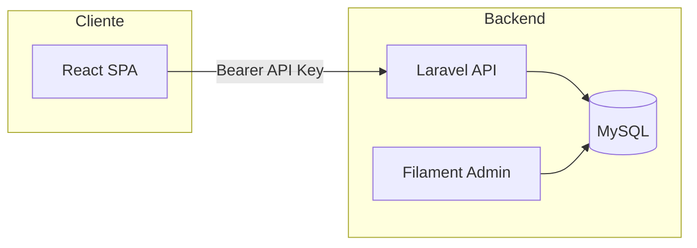
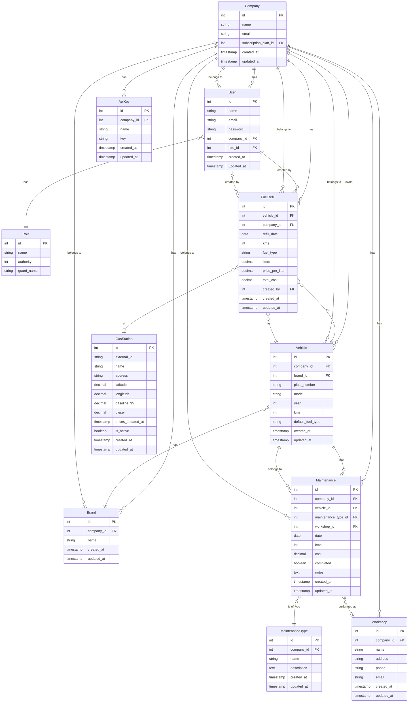

# Flotiko — Proyecto AI4Devs

## Índice

1. [0. Ficha del proyecto](#0-ficha-del-proyecto)
2. [1. Descripción general del producto](#1-descripción-general-del-producto)
3. [2. Arquitectura del sistema](#2-arquitectura-del-sistema)
4. [3. Modelo de datos](#3-modelo-de-datos)
5. [4. Especificación de la API](#4-especificación-de-la-api)
6. [5. Historias de usuario](#5-historias-de-usuario)
7. [6. Tickets de trabajo](#6-tickets-de-trabajo)
8. [7. Pull Requests](#7-pull-requests)

---

## 0. Ficha del proyecto

### 0.1. Tu nombre completo

Carlos Rodríguez Muiño

### 0.2. Nombre del proyecto

**Flotiko**

### 0.3. Descripción breve del proyecto

Flotiko es una aplicación de gestión de flotas (vehículos, repostajes, mantenimientos, seguros, ITV). Permite a los usuarios autenticarse, ver el listado de vehículos de su empresa, registrar repostajes y mantenimientos, y consultar historial e informes de consumo y costes. Backend en Laravel (PHP) con Filament; frontend en React (Vite); base de datos MySQL.

### 0.4. URL del proyecto

(Indicar URL de la app desplegada si existe.)

Puede ser pública o privada, en cuyo caso deberás compartir los accesos de manera segura. Puedes enviarlos a alvaro@lidr.co usando algún servicio como onetimesecret.

### 0.5. URL o archivo comprimido del repositorio

(Indicar URL del repo AI4Devs-finalproject o de este proyecto.)

Puedes tenerlo alojado en público o en privado, en cuyo caso deberás compartir los accesos de manera segura. Puedes enviarlos a alvaro@lidr.co usando algún servicio como onetimesecret. También puedes compartir por correo un archivo zip con el contenido.

---

## 1. Descripción general del producto

### 1.1. Objetivo

Flotiko tiene como propósito permitir a los usuarios llevar el control de sus flotas de vehículos: repostajes, mantenimientos, seguros e ITV. Aporta valor al centralizar la información en una sola aplicación, calcular consumo (L/100 km) y coste por km, y ofrecer alertas de próximos mantenimientos e ITV. Está dirigido tanto a usuarios de empresas que gestionan vehículos (flotas comerciales, servicios, etc.) como a particulares para un mejor control de gastos.

### 1.2. Características y funcionalidades principales

- **Autenticación**: Login con API key (Bearer); la app guarda la API key en localStorage y la envía en cada petición.
- **Multi-tenant**: Datos filtrados por empresa (`company_id`); sin fugas entre empresas.
- **Vehículos**: CRUD de vehículos (marca, modelo, matrícula, año, km, tipo de combustible por defecto).
- **Repostajes**: Registro de repostajes; cálculo automático de coste total y consumo L/100 km y coste por km.
- **Mantenimientos**: Tipos de mantenimiento, talleres, fechas, km, coste; alertas y recordatorios.
- **Seguros e ITV**: Gestión de pólizas y fechas de ITV con recordatorios.
- **Gasolineras**: Endpoint público de gasolineras cercanas (geolocalización).
- **Notificaciones**: Centro de notificaciones en la app; push (Firebase) opcional.
- **Panel admin**: Filament para gestión avanzada (backend).

### 1.3. Diseño y experiencia de usuario

(Incluir aquí imágenes y/o videotutorial mostrando la experiencia desde que el usuario aterriza en la aplicación hasta las funcionalidades principales: login, dashboard, detalle de vehículo, formularios de repostaje y mantenimiento, historial e informe.)

### 1.4. Instrucciones de instalación

**Requisitos:** PHP 8.x, Composer, Node.js y npm, MySQL.

**Backend (Laravel):**

1. Entrar en la carpeta del backend (proyecto Laravel).
2. `composer install`
3. `cp .env.example .env`
4. Configurar en `.env`: `DB_DATABASE`, `DB_USERNAME`, `DB_PASSWORD`
5. `php artisan key:generate`
6. `php artisan migrate` (opcional: `php artisan db:seed` para datos de prueba)
7. `php artisan serve` (API en http://localhost:8000 o el puerto indicado)

**Frontend (React + Vite):**

1. Entrar en la carpeta del frontend (proyecto React).
2. `npm install`
3. Crear `.env` si es necesario con `VITE_API_BASE_URL` apuntando al backend (ej. `http://localhost:8000`)
4. `npm run dev` (app en http://localhost:5173 o el puerto indicado)

**API key:** Obtener una API key desde el panel Filament del backend (ruta `/admin` o la configurada) y usarla en el login del frontend.

---

## 2. Arquitectura del sistema

### 2.1. Diagrama de arquitectura

La aplicación sigue una arquitectura cliente-servidor: un frontend SPA (React) consume una API REST (Laravel). La lógica de negocio está en el backend; el frontend se limita a presentación y llamadas HTTP. Se ha elegido esta separación para reutilizar la API en web y futuras apps móviles, y para centralizar reglas y seguridad en el servidor. Beneficios: API única, escalabilidad del backend, despliegue independiente de frontend (ej. Netlify). Sacrificio: mayor complejidad operativa (dos despliegues, CORS, gestión de API key).



### 2.2. Descripción de componentes principales

- **Frontend (React + Vite):** SPA que consume la API REST. Tecnologías: React, Vite, React Router, cliente HTTP (axios). Páginas: Login, Dashboard, Detalle vehículo, Añadir repostaje, Añadir mantenimiento, Historial, Informe. Contextos para tema, idioma y notificaciones.
- **Backend (Laravel):** API REST bajo `/api`; autenticación por API key (header `Authorization: Bearer {api_key}`). Tecnologías: Laravel, Eloquent, Filament para panel admin. Controladores API por recurso (Auth, Vehicles, FuelRefills, Maintenances, etc.); servicios para lógica de negocio (FuelRefillService, VehicleReportService).
- **Base de datos (MySQL):** Persistencia de empresas, usuarios, vehículos, marcas, repostajes, mantenimientos, talleres, tipos de mantenimiento, seguros, ITV, gasolineras, API keys. Modelos con scope por `company_id` (multi-tenant).

### 2.3. Descripción de alto nivel del proyecto y estructura de ficheros

```
proyecto/
├── documentacion/           # Documentación del proyecto (readme, historias, tickets, trazabilidad)
├── backend/                 # Backend Laravel
│   ├── app/
│   │   ├── Http/Controllers/Api/   # Controladores API
│   │   ├── Models/                 # Eloquent (Company, User, Vehicle, FuelRefill, etc.)
│   │   ├── Services/               # Lógica de negocio (FuelRefillService, etc.)
│   │   └── Http/Middleware/        # ApiAuth, etc.
│   ├── database/migrations/       # Migraciones MySQL
│   └── routes/api.php             # Rutas API
└── frontend/                # Frontend React
    ├── src/
    │   ├── pages/                 # Login, Dashboard, VehicleDetail, AddFuelRefill, etc.
    │   ├── components/             # Layout, Toast, etc.
    │   ├── services/api.js        # Cliente HTTP e interceptores
    │   └── context/                # AppContext, ThemeContext, etc.
    └── vite.config.js
```

El backend sigue la estructura estándar de Laravel (MVC + servicios); el frontend organiza por páginas, componentes y servicios.

### 2.4. Infraestructura y despliegue

- **Frontend:** Despliegue estático (ej. Netlify); build con `npm run build`; publicación desde `dist`. Configuración en la carpeta del frontend (p. ej. `netlify.toml`).
- **Backend:** Servidor PHP (VPS, shared hosting o PaaS); requisitos Laravel (PHP, extensiones, MySQL). Proceso: subir código, configurar `.env` (BD, `APP_KEY`), ejecutar `migrate`, configurar servidor web (Apache/Nginx) con document root en `public`.
- **Pipeline CI/CD:** Pendiente o planeado (ej. GitHub Actions para tests y despliegue).
- **Secretos:** Variables de entorno en Netlify para el frontend (`VITE_API_BASE_URL`); `.env` en el backend (no versionado).

### 2.5. Seguridad

- **Autenticación API:** Las rutas protegidas exigen header `Authorization: Bearer {api_key}` o `X-API-Key`. La API key se valida contra la tabla `api_keys` y se asocia a una empresa; el middleware inyecta `company_id` para filtrar datos.
- **Multi-tenant:** Todos los recursos (vehículos, repostajes, mantenimientos, etc.) se filtran por `company_id`; un usuario no puede acceder a datos de otra empresa. Los modelos extienden `BaseModelCompany` y aplican scope por empresa.
- **Validación:** Las peticiones POST/PUT se validan en el backend (reglas Laravel); respuestas 422 con mensajes por campo.
- **Datos sensibles:** Contraseñas hasheadas; API keys almacenadas cifradas; no se exponen en respuestas JSON.

### 2.6. Tests

- **Backend:** PHPUnit en la carpeta `tests/` del backend: tests unitarios y de integración/feature (FuelRefill, FuelRefillService, GeolocationController, Auth, etc.). Ejecución: `php artisan test` o `./vendor/bin/phpunit`.
- **Frontend:** (Opcional) tests con Vitest o React Testing Library.
- **E2E:** Planeado (Cypress o Playwright) para el flujo principal: login → dashboard → detalle vehículo → añadir repostaje → historial.

---

## 3. Modelo de datos

### 3.1. Diagrama del modelo de datos

El modelo es multi-tenant: la mayoría de entidades tienen `company_id` (FK a `companies`) y se filtran por empresa. Las relaciones principales se muestran a continuación, con claves primarias (PK) y foráneas (FK) indicadas en las entidades.



### 3.2. Tablas, campos y tipos (esquema de base de datos)

A continuación se listan las tablas principales con sus columnas, tipos de dato (MySQL/Laravel), nulabilidad y claves. **PK** = clave primaria, **FK** = clave foránea.

**Tabla `companies`**

| Campo                 | Tipo             | Nullable | Default | Clave | Referencia           |
|-----------------------|------------------|----------|---------|-------|----------------------|
| id                    | bigint unsigned  | NO       | auto    | PK    | —                    |
| name                  | string(255)      | NO       | —       |       | —                    |
| email                 | string(255)     | NO       | —       | UK    | —                    |
| subscription_plan_id  | bigint unsigned  | SÍ       | NULL    | FK    | subscription_plans.id |
| stripe_plan           | string(255)     | SÍ       | NULL    |       | —                    |
| created_at            | timestamp       | SÍ       | NULL    |       | —                    |
| updated_at            | timestamp       | SÍ       | NULL    |       | —                    |

**Tabla `users`**

| Campo            | Tipo             | Nullable | Default | Clave | Referencia  |
|------------------|------------------|----------|---------|-------|-------------|
| id               | bigint unsigned  | NO       | auto    | PK    | —           |
| webauthn_id      | uuid/string      | SÍ       | NULL    | UK    | —           |
| name             | string(255)      | NO       | —       |       | —           |
| email            | string(255)      | NO       | —       | UK    | —           |
| password         | string(255)      | NO       | —       |       | —           |
| photo            | string(255)      | SÍ       | NULL    |       | —           |
| company_id       | bigint unsigned  | NO       | —       | FK    | companies.id |
| email_verified_at| timestamp       | SÍ       | NULL    |       | —           |
| remember_token   | string(100)     | SÍ       | NULL    |       | —           |
| created_at       | timestamp       | SÍ       | NULL    |       | —           |
| updated_at       | timestamp       | SÍ       | NULL    |       | —           |

**Tabla `roles`**

| Campo      | Tipo            | Nullable | Default | Clave | Referencia |
|------------|-----------------|----------|---------|-------|------------|
| id         | bigint unsigned | NO       | auto    | PK    | —          |
| name       | string(255)     | NO       | —       | UK    | —          |
| authority  | int             | NO       | —       |       | —          |
| guard_name | string(255)     | NO       | web     |       | —          |
| created_at | timestamp       | SÍ       | NULL    |       | —          |
| updated_at | timestamp       | SÍ       | NULL    |       | —          |

**Tabla `vehicles`**

| Campo             | Tipo             | Nullable | Default | Clave | Referencia   |
|-------------------|------------------|----------|---------|-------|--------------|
| id                | bigint unsigned  | NO       | auto    | PK    | —            |
| company_id        | bigint unsigned  | NO       | —       | FK,I  | companies.id |
| brand_id          | bigint unsigned  | NO       | —       | FK    | brands.id    |
| plate_number      | string(15)       | NO       | —       |       | —            |
| model             | string(255)      | SÍ       | NULL    |       | —            |
| year              | int unsigned     | SÍ       | NULL    |       | —            |
| kms               | int unsigned     | SÍ       | NULL    |       | —            |
| default_fuel_type | enum             | SÍ       | NULL    |       | gasoline_95, gasoline_98, diesel, diesel_plus |
| created_at        | timestamp        | SÍ       | NULL    |       | —            |
| updated_at        | timestamp        | SÍ       | NULL    |       | —            |

*I = indexed*

**Tabla `brands`**

| Campo       | Tipo             | Nullable | Default | Clave | Referencia   |
|-------------|------------------|----------|---------|-------|--------------|
| id          | bigint unsigned  | NO       | auto    | PK    | —            |
| company_id  | bigint unsigned  | NO       | —       | FK    | companies.id |
| name        | string(100)      | NO       | —       |       | —            |
| created_at  | timestamp        | SÍ       | NULL    |       | —            |
| updated_at  | timestamp        | SÍ       | NULL    |       | —            |

**Tabla `fuel_refills`**

| Campo              | Tipo             | Nullable | Default | Clave | Referencia   |
|--------------------|------------------|----------|---------|-------|--------------|
| id                 | bigint unsigned  | NO       | auto    | PK    | —            |
| vehicle_id         | bigint unsigned  | NO       | —       | FK,I  | vehicles.id (cascade) |
| company_id         | bigint unsigned  | NO       | —       | FK,I  | companies.id (cascade) |
| refill_date        | date             | NO       | —       | I     | —            |
| kms                | int unsigned     | SÍ       | NULL    |       | —            |
| fuel_type          | enum             | NO       | —       | I     | gasoline_95, gasoline_98, diesel, diesel_plus |
| liters             | decimal(8,2)     | NO       | —       |       | —            |
| price_per_liter    | decimal(6,3)     | NO       | —       |       | —            |
| total_cost         | decimal(10,2)    | SÍ       | NULL    |       | (calculado)   |
| gas_station_id     | string(50)       | SÍ       | NULL    | I     | gas_stations.external_id |
| gas_station_name   | string(255)      | SÍ       | NULL    |       | —            |
| gas_station_address| string(255)      | SÍ       | NULL    |       | —            |
| gas_station_latitude| decimal(10,8)   | SÍ       | NULL    |       | —            |
| gas_station_longitude| decimal(11,8)  | SÍ       | NULL    |       | —            |
| payment_method     | enum             | SÍ       | NULL    |       | cash, card, company_card, other |
| notes              | text             | SÍ       | NULL    |       | —            |
| receipt_attachment | string(255)      | SÍ       | NULL    |       | —            |
| created_by         | bigint unsigned  | SÍ       | NULL    | FK,I  | users.id (set null on delete) |
| created_at         | timestamp        | SÍ       | NULL    |       | —            |
| updated_at         | timestamp        | SÍ       | NULL    |       | —            |

**Tabla `maintenances`**

| Campo                 | Tipo             | Nullable | Default | Clave | Referencia        |
|-----------------------|------------------|----------|---------|-------|-------------------|
| id                    | bigint unsigned  | NO       | auto    | PK    | —                 |
| company_id            | bigint unsigned  | NO       | —       | FK,I  | companies.id      |
| vehicle_id            | bigint unsigned  | NO       | —       | FK,I  | vehicles.id       |
| maintenance_type_id   | bigint unsigned  | NO       | —       | FK    | maintenance_types.id |
| workshop_id           | bigint unsigned  | SÍ       | NULL    | FK    | workshops.id      |
| date                  | date             | NO       | —       | I     | —                 |
| kms                   | int unsigned     | SÍ       | NULL    |       | —                 |
| cost                  | decimal(10,2)    | SÍ       | NULL    |       | —                 |
| next_maintenance_date | date             | SÍ       | NULL    |       | —                 |
| next_maintenance_kms  | int unsigned     | SÍ       | NULL    |       | —                 |
| completed             | boolean          | NO       | false   |       | —                 |
| in_workshop           | boolean          | NO       | false   |       | —                 |
| oil_changed           | boolean          | NO       | false   |       | —                 |
| oil_filter_changed    | boolean          | NO       | false   |       | —                 |
| pollen_filter_changed | boolean          | NO       | false   |       | —                 |
| air_filter_changed    | boolean          | NO       | false   |       | —                 |
| fuel_filter_changed   | boolean          | NO       | false   |       | —                 |
| brake_fluid_changed   | boolean          | NO       | false   |       | —                 |
| timing_kit_changed    | boolean          | NO       | false   |       | —                 |
| spark_plugs_changed   | boolean          | NO       | false   |       | —                 |
| notes                 | text             | SÍ       | NULL    |       | —                 |
| created_at            | timestamp        | SÍ       | NULL    |       | —                 |
| updated_at            | timestamp        | SÍ       | NULL    |       | —                 |

**Tabla `maintenance_types`**

| Campo       | Tipo             | Nullable | Default | Clave | Referencia   |
|-------------|------------------|----------|---------|-------|--------------|
| id          | bigint unsigned  | NO       | auto    | PK    | —            |
| company_id  | bigint unsigned  | NO       | —       | FK    | companies.id |
| name        | string(255)      | NO       | —       |       | —            |
| description | text             | SÍ       | NULL    |       | —            |
| created_at  | timestamp        | SÍ       | NULL    |       | —            |
| updated_at  | timestamp        | SÍ       | NULL    |       | —            |

**Tabla `workshops`**

| Campo      | Tipo             | Nullable | Default | Clave | Referencia   |
|------------|------------------|----------|---------|-------|--------------|
| id         | bigint unsigned  | NO       | auto    | PK    | —            |
| company_id | bigint unsigned  | NO       | —       | FK    | companies.id |
| name       | string(255)      | NO       | —       |       | —            |
| address    | string(255)      | SÍ       | NULL    |       | —            |
| phone      | string(50)       | SÍ       | NULL    |       | —            |
| email      | string(255)      | SÍ       | NULL    |       | —            |
| created_at | timestamp        | SÍ       | NULL    |       | —            |
| updated_at | timestamp        | SÍ       | NULL    |       | —            |

**Tabla `api_keys`**

| Campo      | Tipo             | Nullable | Default | Clave | Referencia   |
|------------|------------------|----------|---------|-------|--------------|
| id         | bigint unsigned  | NO       | auto    | PK    | —            |
| company_id | bigint unsigned  | NO       | —       | FK    | companies.id |
| name       | string(255)      | NO       | —       |       | —            |
| key        | string (encrypted)| NO       | —       |       | —            |
| created_at | timestamp        | SÍ       | NULL    |       | —            |
| updated_at | timestamp        | SÍ       | NULL    |       | —            |

**Tabla `gas_stations`** (sin company_id; datos compartidos)

| Campo            | Tipo             | Nullable | Default | Clave | Referencia |
|------------------|------------------|----------|---------|-------|------------|
| id               | bigint unsigned  | NO       | auto    | PK    | —          |
| external_id      | string(50)       | NO       | —       | UK,I  | —          |
| name             | string(255)      | NO       | —       | I     | —          |
| address          | string(500)      | SÍ       | NULL    | I     | —          |
| latitude         | decimal(10,8)    | NO       | —       | I     | —          |
| longitude        | decimal(11,8)    | NO       | —       | I     | —          |
| province         | string(100)      | SÍ       | NULL    |       | —          |
| municipality     | string(100)      | SÍ       | NULL    |       | —          |
| postal_code      | string(10)       | SÍ       | NULL    |       | —          |
| gasoline_95      | decimal(6,3)     | SÍ       | NULL    |       | —          |
| gasoline_98       | decimal(6,3)     | SÍ       | NULL    |       | —          |
| diesel           | decimal(6,3)     | SÍ       | NULL    |       | —          |
| diesel_plus      | decimal(6,3)     | SÍ       | NULL    |       | —          |
| prices_updated_at| timestamp        | SÍ       | NULL    | I     | —          |
| is_active        | boolean          | NO       | true    | I     | —          |
| created_at       | timestamp        | SÍ       | NULL    |       | —          |
| updated_at       | timestamp        | SÍ       | NULL    |       | —          |

*UK = unique.*

Otras tablas del sistema: `vehicle_insurances`, `insurance_companies`, `gas_station_price_history`, `subscription_plans`, `permissions`, `model_has_roles`, `model_has_permissions`, etc., con la misma convención de tipos (bigint unsigned PK/FK, string, decimal, date, timestamp, boolean, enum, text).

### 3.3. Descripción de entidades principales

**Company (tabla `companies`)**  
Representa la empresa u organización que usa el sistema.  
- **Campos:** `id` PK; `name` string required; `email` string required, unique; `subscription_plan_id` FK nullable a `subscription_plans`; `stripe_plan` string nullable; `created_at`, `updated_at` timestamps.  
- **Relaciones:** has many User, Vehicle, Brand, Maintenance, FuelRefill, Workshop, ApiKey; belongs to SubscriptionPlan.  
- **Reglas:** multi-tenant; todos los datos de la empresa se filtran por `company_id`.

**User (tabla `users`)**  
Usuario del sistema con autenticación y permisos.  
- **Campos:** `id` PK; `webauthn_id` UUID nullable unique; `name` string required; `email` string required unique; `password` string hashed required; `photo` string nullable; `company_id` FK required a `companies`; `email_verified_at` datetime nullable; `remember_token` nullable; `created_at`, `updated_at` timestamps.  
- **Relaciones:** belongs to Company, Role; has many FuelRefill (via `created_by`), Activity.  
- **Scopes:** UserScope filtra por company_id (salvo super admin).

**Role (tabla `roles`)**  
Rol de usuario con nivel de autoridad (Spatie Permission).  
- **Campos:** `id` PK; `name` string required unique; `authority` int (menor = más autoridad); `guard_name` string default 'web'; `created_at`, `updated_at`.  
- **Relaciones:** many-to-many con Permission.

**Vehicle (tabla `vehicles`)**  
Vehículo de la flota.  
- **Campos:** `id` PK; `company_id` FK required indexed; `brand_id` FK required a `brands`; `plate_number` string required max 15; `model` string nullable; `year` int nullable; `kms` int unsigned nullable; `default_fuel_type` enum nullable ('gasoline_95', 'gasoline_98', 'diesel', 'diesel_plus'); `created_at`, `updated_at`.  
- **Índices:** company_id, default_fuel_type.  
- **Relaciones:** belongs to Company, Brand; has many Maintenance, FuelRefill; has one lastFuelRefill.  
- **Reglas:** `kms` se actualiza automáticamente cuando un mantenimiento o repostaje tiene `kms` mayor; `default_fuel_type` se usa para rellenar el tipo en nuevos repostajes.

**Brand (tabla `brands`)**  
Marca o fabricante de vehículos.  
- **Campos:** `id` PK; `company_id` FK required; `name` string required max 100; `created_at`, `updated_at`.  
- **Relaciones:** belongs to Company; has many Vehicle.

**FuelRefill (tabla `fuel_refills`)**  
Registro de repostaje de un vehículo.  
- **Campos:** `id` PK; `vehicle_id` FK required cascade on delete indexed; `company_id` FK required cascade indexed; `refill_date` date required indexed; `kms` int unsigned nullable; `fuel_type` enum required ('gasoline_95', 'gasoline_98', 'diesel', 'diesel_plus') indexed; `liters` decimal(8,2) required; `price_per_liter` decimal(6,3) required; `total_cost` decimal(10,2) nullable (calculado); `gas_station_id` string nullable indexed; `gas_station_name`, `gas_station_address` string nullable; `gas_station_latitude`, `gas_station_longitude` decimal nullable; `payment_method` enum nullable ('cash', 'card', 'company_card', 'other'); `notes` text nullable; `receipt_attachment` string nullable; `created_by` FK nullable a `users` set null on delete indexed; `created_at`, `updated_at`.  
- **Índices:** compuesto (vehicle_id, refill_date); company_id, refill_date, fuel_type, gas_station_id, created_by.  
- **Relaciones:** belongs to Vehicle, Company, User (created_by); belongs to GasStation (via gas_station_id → external_id).  
- **Reglas:** `total_cost` = liters × price_per_liter si no se envía; si `kms` del repostaje > vehicle.kms se actualiza vehicle.kms; `company_id` y `created_by` se asignan desde el contexto. Consumo L/100 km y coste por km se calculan comparando con el repostaje anterior.  
- **Eventos:** creating (calcula total_cost, asigna company_id y created_by); created (actualiza vehicle.kms si aplica).

**Maintenance (tabla `maintenances`)**  
Registro de mantenimiento de un vehículo.  
- **Campos:** `id` PK; `company_id` FK required indexed; `vehicle_id` FK required; `maintenance_type_id` FK required; `workshop_id` FK nullable; `date` date required; `kms` int unsigned nullable; `cost` decimal nullable; `next_maintenance_date` date nullable; `next_maintenance_kms` int nullable; `completed` boolean default false; `in_workshop` boolean default false; flags de piezas (oil_changed, oil_filter_changed, pollen_filter_changed, etc.) boolean default false; `notes` text nullable; `created_at`, `updated_at`.  
- **Índices:** company_id, vehicle_id, date.  
- **Relaciones:** belongs to Company, Vehicle, MaintenanceType, Workshop.  
- **Reglas:** al marcar completed, in_workshop pasa a false; si maintenance.kms > vehicle.kms se actualiza vehicle.kms; si hay next_maintenance_date se puede crear automáticamente un nuevo mantenimiento; scope por company.

**MaintenanceType (tabla `maintenance_types`)**  
Tipo de mantenimiento (cambio de aceite, revisión, etc.).  
- **Campos:** `id` PK; `company_id` FK required; `name` string required; `description` text nullable; `created_at`, `updated_at`.  
- **Relaciones:** has many Maintenance.

**Workshop (tabla `workshops`)**  
Taller donde se realiza el mantenimiento.  
- **Campos:** `id` PK; `company_id` FK required; `name` string required; `address`, `phone`, `email` string nullable; `created_at`, `updated_at`.  
- **Relaciones:** belongs to Company; has many Maintenance.

**ApiKey (tabla `api_keys`)**  
Clave API para autenticación de la API REST.  
- **Campos:** `id` PK; `company_id` FK required; `name` string required; `key` string encrypted required; `created_at`, `updated_at`.  
- **Relaciones:** belongs to Company.  
- **Uso:** el middleware valida el header Authorization o X-API-Key e inyecta company_id.

**GasStation (tabla `gas_stations`)**  
Gasolinera (datos de API externa, compartidos entre empresas; sin company_id).  
- **Campos:** `id` PK; `external_id` string required unique indexed; `name` string required; `address` string nullable; `latitude`, `longitude` decimal required indexed; `province`, `municipality`, `postal_code` string nullable; `gasoline_95`, `gasoline_98`, `diesel`, `diesel_plus` decimal nullable; `prices_updated_at` timestamp nullable indexed; `is_active` boolean required default true indexed; `created_at`, `updated_at`.  
- **Relaciones:** has many FuelRefill (via gas_station_id → external_id).  
- **Reglas:** precios actualizados por comando programado; scope nearby por lat/lon (Haversine).

**Otras entidades (resumen):** VehicleInsurance (pólizas, renewal_date, status); InsuranceCompany; GasStationPriceHistory (historial de precios); SubscriptionPlan; News; etc. Todas las tablas con company_id aplican scope por empresa salvo GasStation y tablas de catálogo global.

---

## 4. Especificación de la API

A continuación se describen tres endpoints principales. La especificación OpenAPI completa estará disponible en el repositorio del backend cuando se publique.

**Autenticación:** Header `Authorization: Bearer {api_key}` o `X-API-Key: {api_key}` en rutas protegidas.

### Endpoint 1: POST /api/auth/login (login)

- **Descripción:** Valida la API key y devuelve datos de usuario y empresa para la sesión.
- **Request:** Body JSON `{ "api_key": "flk_xxxx..." }`.
- **Response 200:** `{ "user": { "id", "name", "email", "company_id" }, "company": { "id", "name" } }`.
- **Response 401:** `{ "message": "Invalid API key" }`.

### Endpoint 2: GET /api/vehicles (listado de vehículos)

- **Descripción:** Listado paginado de vehículos de la empresa. Requiere API key.
- **Query params:** `page`, `per_page`, `brand_id`, `search`.
- **Response 200:** `{ "data": [ { "id", "brand_id", "license_plate", "model", "year", "current_kms", "company_id" } ], "meta": { "current_page", "per_page", "total" } }`.

### Endpoint 3: POST /api/fuel-refills (crear repostaje)

- **Descripción:** Crea un repostaje; el backend calcula `total_cost` y puede actualizar `vehicle.kms`. Requiere API key.
- **Request:** Body JSON con `vehicle_id`, `refill_date`, `liters`, `price_per_liter`, `fuel_type_id`; opcional `kms`, `gas_station_name`.
- **Response 201:** `{ "data": { "id", "vehicle_id", "refill_date", "liters", "price_per_liter", "total_cost", "kms", "company_id" } }`.
- **Response 422:** Errores de validación por campo.

---

## 5. Historias de usuario

Se documentan tres historias principales. Índice completo: [historias-usuario.md](historias-usuario.md).

### Historia de usuario 1 — Login y acceso (MH1)

**Como** usuario de la empresa **quiero** iniciar sesión con mi API key **para** acceder a la app y ver solo los datos de mi empresa.

**Criterios de aceptación:** Pantalla de login con campo API key; al enviar se llama a `POST /api/auth/login`; si es correcto se guarda la API key en localStorage y se redirige al dashboard; si no hay API key en rutas protegidas se redirige a login; si la API devuelve 401 se limpia el storage y se redirige a login. Solo se ven datos de la empresa asociada a la API key.

**Detalle:** [historias-usuario/MH1.md](historias-usuario/MH1.md).

### Historia de usuario 2 — Listado y detalle de vehículos (MH2)

**Como** usuario **quiero** ver el listado de vehículos de mi empresa y abrir el detalle de uno **para** gestionar repostajes y mantenimientos.

**Criterios de aceptación:** Dashboard con listado paginado desde `GET /api/vehicles`; cada vehículo muestra matrícula, marca/modelo, km actual; clic navega a detalle `/vehicle/:id`; detalle muestra datos del vehículo, último repostaje y alertas; desde el detalle hay enlaces a Añadir repostaje, Añadir mantenimiento, Historial e Informe.

**Detalle:** [historias-usuario/MH2.md](historias-usuario/MH2.md).

### Historia de usuario 3 — Registrar repostaje (MH3)

**Como** usuario **quiero** registrar un repostaje (fecha, km, litros, precio, opcional gasolinera) **para** llevar el control del consumo y el coste.

**Criterios de aceptación:** Desde el detalle del vehículo, botón "Añadir repostaje" que lleva al formulario; campos: fecha, km, litros, precio por litro, tipo de combustible (obligatorios); al enviar se llama a `POST /api/fuel-refills`; el backend calcula total_cost y actualiza vehicle.kms si aplica; tras guardar, mensaje de éxito y redirección; solo para vehículos de la empresa del usuario.

**Detalle:** [historias-usuario/MH3.md](historias-usuario/MH3.md).

---

## 6. Tickets de trabajo

Se documentan tres tickets: uno de backend, uno de frontend y uno de bases de datos. Índice completo: [tickets.md](tickets.md).

### Ticket 1 — Backend: Middleware API key y scopes company (T2)

**Objetivo:** Implementar el middleware que valide la API key en las peticiones (header `Authorization: Bearer {api_key}` o `X-API-Key`), resuelva la empresa asociada y deje `company_id` disponible para el resto de la aplicación.

**Criterios de aceptación:** Middleware (ApiAuth) que lea el header y valide la key contra `api_keys`; si es válida inyectar `company_id` en el request; si falta o es inválida responder 401 JSON; rutas protegidas usan el middleware; rutas públicas (health, login, gas-stations/nearby) no; modelos con scope por empresa usan el contexto inyectado.

**Detalle:** [tickets/T2.md](tickets/T2.md).

### Ticket 2 — Frontend: Login y guardado de API key (T9)

**Objetivo:** Implementar la pantalla de login, llamar al endpoint de login, guardar la API key en localStorage y redirigir al dashboard; que las peticiones API incluyan el header Authorization y que en 401 se limpie la sesión y se redirija a login.

**Criterios de aceptación:** Ruta `/login` y componente Login con formulario (API key); al enviar `POST /api/auth/login`; en éxito guardar API key en localStorage y redirigir a `/`; cliente HTTP con interceptor que añade `Authorization: Bearer {api_key}`; interceptor de respuesta: si 401 eliminar API key y redirigir a `/login`; manejo de errores de login (mensaje en pantalla).

**Detalle:** [tickets/T9.md](tickets/T9.md).

### Ticket 3 — Bases de datos: Proyecto Laravel, migraciones y modelos (T1)

**Objetivo:** Configurar el proyecto Laravel, la conexión a MySQL y las migraciones con los modelos necesarios para el MVP (Company, User, Vehicle, Brand, FuelRefill, Maintenance, etc.) con multi-tenant (company_id), relaciones y scopes.

**Criterios de aceptación:** Proyecto Laravel con BD en `.env`; migraciones para companies, users, vehicles, brands, fuel_refills, maintenances, maintenance_types, workshops, api_keys, etc.; modelos Eloquent con relaciones (belongsTo, hasMany); modelos con scope por company_id; seeders mínimos; `php artisan migrate` sin errores.

**Detalle:** [tickets/T1.md](tickets/T1.md).

---

## 7. Pull Requests

Documenta aquí tres Pull Requests realizadas durante el proyecto (título, descripción breve, enlace al PR si aplica).

### Pull Request 1

(Título y descripción; enlace al PR si está en GitHub/GitLab.)

### Pull Request 2

(Título y descripción; enlace al PR si está en GitHub/GitLab.)

### Pull Request 3

(Título y descripción; enlace al PR si está en GitHub/GitLab.)

---

## Documentación adicional

| Documento | Descripción |
|-----------|-------------|
| [TRACEABILITY.md](TRACEABILITY.md) | Trazabilidad Historia → Tickets. |
| [historias-usuario.md](historias-usuario.md) | Índice de historias (MH1–MH5, SH1–SH2). |
| [tickets.md](tickets.md) | Índice de tickets (T1–T15) y matriz de trazabilidad. |
| [prompts.md](prompts.md) | Registro de prompts utilizados con IA. |
| [glosario.md](glosario.md) | Convenciones y términos del proyecto. |
