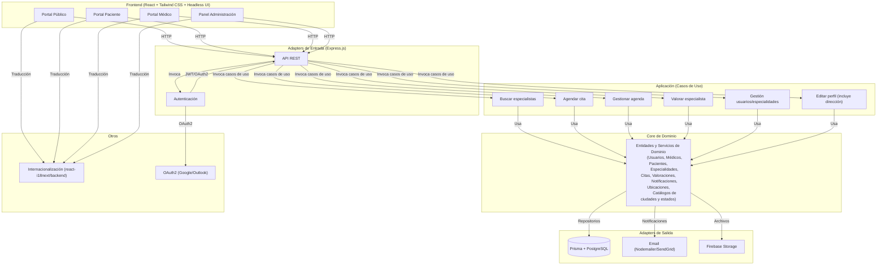
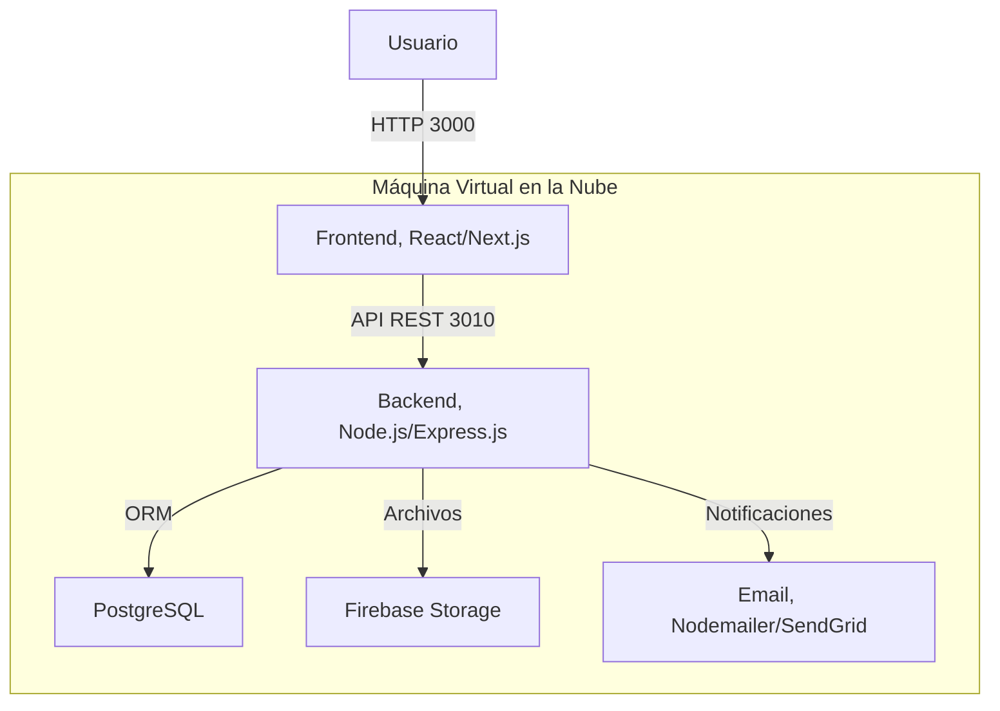
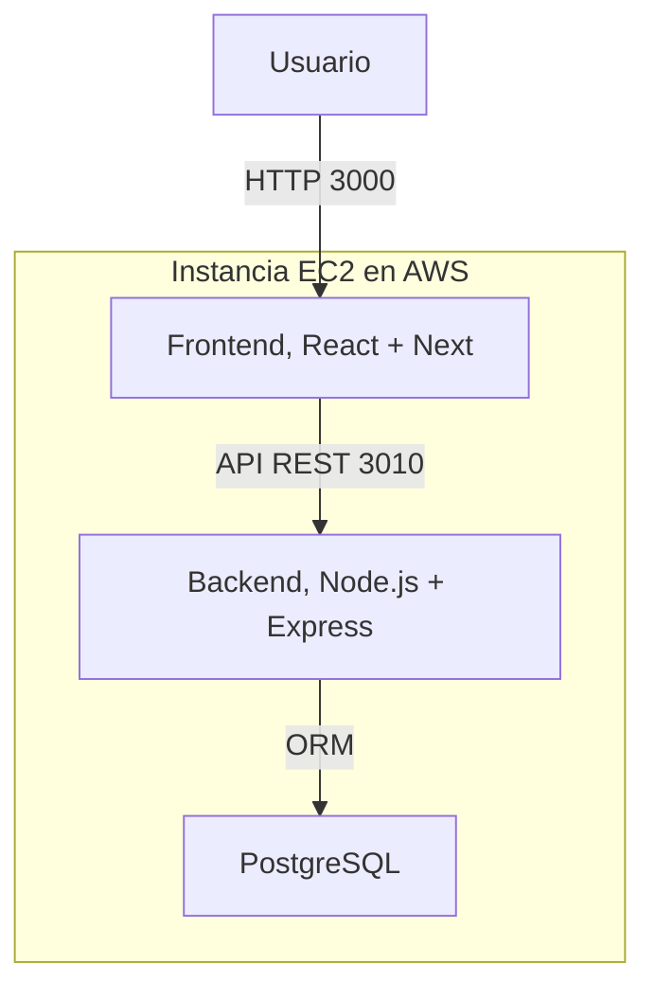

## Índice

0. [Ficha del proyecto](#0-ficha-del-proyecto)
1. [Descripción general del producto](#1-descripción-general-del-producto)
2. [Arquitectura del sistema](#2-arquitectura-del-sistema)
3. [Modelo de datos](#3-modelo-de-datos)
4. [Especificación de la API](#4-especificación-de-la-api)
5. [Historias de usuario](#5-historias-de-usuario)
6. [Tickets de trabajo](#6-tickets-de-trabajo)
7. [Pull requests](#7-pull-requests)

---

## 0. Ficha del proyecto

### **0.1. Tu nombre completo:**

Jorge Antonio Pérez Moreno

### **0.2. Nombre del proyecto:**

Sistemas de búsqueda de especialidades médicas y profesionales de la salud (Buscadoc)

### **0.3. Descripción breve del proyecto:**

El sistema de búsqueda de especialidades médicas y profesionales de la salud es una plataforma diseñada para facilitar la localización, comparación y contacto con especialistas médicos. El propósito principal es optimizar la experiencia de búsqueda y agendamiento de citas tanto para pacientes como para médicos, proporcionando información transparente y herramientas que permitan tomar decisiones informadas.
Además, el sistema gestiona direcciones detalladas de pacientes y médicos mediante las entidades LOCATION, CITY y STATE, permitiendo búsquedas y filtrados más precisos por ubicación.

### **0.4. URL del proyecto:**

> Puede ser pública o privada, en cuyo caso deberás compartir los accesos de manera segura. Puedes enviarlos a [alvaro@lidr.co](mailto:alvaro@lidr.co) usando algún servicio como [onetimesecret](https://onetimesecret.com/).

* **Url Proyecto: [http://50.18.7.99:3000/](http://50.18.7.99:3000/)**

> Nota: El acceso es libre, sin embargo dado que es un entorno de desarrollo es propenso a fallos, favor de comunicarse con el autor en casos de no tener acceso al sitio.

### 0.5. URL o archivo comprimido del repositorio

Repositorio en Github: [https://github.com/rockeroicantonidev/AI4Devs-finalproject.git](https://github.com/rockeroicantonidev/AI4Devs-finalproject.git)

---

## 1. Descripción general del producto

> Describe en detalle los siguientes aspectos del producto:

### **1.1. Objetivo:**

> Propósito del producto. Qué valor aporta, qué soluciona, y para quién.

#### Objetivos y metas

- Permitir a los usuarios buscar especialistas por especialidad, ubicación (dirección, ciudad y estado) y otros filtros relevantes.
- Facilitar la visualización de perfiles profesionales detallados, incluyendo información de ubicación.
- Ofrecer un proceso sencillo y eficiente para el agendamiento de citas.
- Integrar valoraciones y opiniones de pacientes para fomentar la confianza.
- Proveer notificaciones y recordatorios automáticos sobre citas y eventos importantes.
- Brindar herramientas de gestión para médicos y administradores del sistema, incluyendo la administración de direcciones.
- Garantizar una experiencia de usuario accesible y multiplataforma.

### **1.2. Características y funcionalidades principales:**

> Enumera y describe las características y funcionalidades específicas que tiene el producto para satisfacer las necesidades identificadas.

El sistema está diseñado para satisfacer las necesidades de pacientes, médicos y administradores, ofreciendo las siguientes funcionalidades clave:

- **Búsqueda de especialistas:** Permite localizar médicos por especialidad y ubicación (dirección, ciudad y estado), con filtros adicionales relevantes.
- **Visualización de perfiles profesionales:** Muestra información detallada de los médicos, incluyendo datos de contacto, biografía, foto de perfil, título y cédula profesional.
- **Agendamiento de citas:** Los pacientes pueden reservar consultas con especialistas de manera sencilla y eficiente.
- **Gestión de agenda para médicos:** Los médicos pueden administrar su disponibilidad, confirmar o rechazar citas y ver el listado de próximas consultas.
- **Registro de usuarios:** Los usuarios pueden registrarse como médicos especialistas o pacientes e iniciar sesión.
- **Soporte multilenguaje:** El sistema está preparado para operar en varios idiomas.

### **1.3. Diseño y experiencia de usuario:**

> Proporciona imágenes y/o videotutorial mostrando la experiencia del usuario desde que aterriza en la aplicación, pasando por todas las funcionalidades principales.

* **Url Presentación del proyecto: [Video presentación de Buscadoc](https://drive.google.com/file/d/1UoyRQR_NvLOF-nn7WbCN_lQ2RIQIkrff/view?usp=sharing)**

### **1.4. Instrucciones de instalación:**

> Documenta de manera precisa las instrucciones para instalar y poner en marcha el proyecto en local (librerías, backend, frontend, servidor, base de datos, migraciones y semillas de datos, etc.)

#### 1. Prerrequisitos

- Tener acceso a una máquina virtual en la nube (Linux recomendado, con Ubuntu 22.04 o superior).
- Instalar [Docker](https://docs.docker.com/get-docker/) y [Docker Compose](https://docs.docker.com/compose/install/).
- Clonar el repositorio del proyecto.

```sh
git clone <URL_DEL_REPOSITORIO>
cd finalroject-JAPM
```

---

#### 2. Configuración de variables de entorno

##### Backend

Copia el archivo de ejemplo y edítalo con tus valores:

```sh
cd backend
cp .env.example .env
# Edita backend/.env según tu configuración (base de datos, JWT, SMTP, Firebase, etc.)
```

##### Frontend

Copia el archivo de ejemplo y edítalo con tus valores:

```sh
cd ../frontend
cp .env.example .env
# Edita frontend/.env según tu configuración (API base URL, entorno, etc.)
```

**Recomendaciones:**

- No subas archivos `.env` al repositorio.
- Usa diferentes archivos `.env` para desarrollo y producción.

---

#### 3. Construcción y despliegue con Docker Compose

Desde la raíz del proyecto, ejecuta:

```sh
docker compose up -d --build
```

Esto levantará los servicios de base de datos, backend y frontend en contenedores separados.

- El **backend** estará disponible en `http://<IP_PUBLICA>:3010`
- El **frontend** estará disponible en `http://<IP_PUBLICA>:3000`

---

#### 4. Verificación de funcionamiento

##### Verifica los contenedores

```sh
docker ps
```

##### Consulta los logs

```sh
docker logs -f buscadoc_backend
docker logs -f buscadoc-frontend
```

##### Accede a la aplicación

- Frontend: `http://<IP_PUBLICA>:3000`
- Backend: `http://<IP_PUBLICA>:3010`

---

#### 5. Migración y configuración de la base de datos

Accede al contenedor backend para ejecutar migraciones:

```sh
docker exec -it buscadoc_backend sh
npx prisma migrate dev --name init
```

Para visualizar la base de datos:

```sh
npx prisma studio
```

---

#### 6. Ejecución de pruebas

Dentro del contenedor backend:

```sh
docker exec -it buscadoc_backend sh
npm test
```

---

#### 7. Actualización del código

Para actualizar el proyecto en la nube:

```sh
git fetch --all
git pull
docker compose up -d --build
```

---

#### 8. Detener y eliminar servicios

Para detener todos los servicios:

```sh
docker compose down
```

Para eliminar los volúmenes de datos (incluye la base de datos):

```sh
docker compose down -v
```

---

#### 9. Buenas prácticas y cumplimiento

- Mantén las credenciales fuera del código fuente.
- Aplica controles de acceso y protección de datos conforme a la LFPDPPP.
- Audita regularmente el acceso y uso de datos personales.
- Consulta la documentación en la carpeta `docs/` para detalles sobre arquitectura, flujos y cumplimiento.

---

## 2. Arquitectura del Sistema

### **2.1. Diagrama de arquitectura:**

> Usa el formato que consideres más adecuado para representar los componentes principales de la aplicación y las tecnologías utilizadas. Explica si sigue algún patrón predefinido, justifica por qué se ha elegido esta arquitectura, y destaca los beneficios principales que aportan al proyecto y justifican su uso, así como sacrificios o déficits que implica.



[Referencia](docs/planificacion_y_documentacion/diagramas/diagrama_visual_arquitectura.md)

### **2.2. Descripción de componentes principales:**

> Describe los componentes más importantes, incluyendo la tecnología utilizada

#### Componentes del MVP

- **Core de Dominio:** Entidades y servicios para usuarios, médicos, pacientes, especialidades, citas, valoraciones, notificaciones y ubicaciones.
- **Aplicación (Casos de Uso):** Lógica de negocio para búsqueda, agendamiento, gestión de cietas y horario, registro e inicio de sesión de usuarios y visualización de perfiles médicos.
- **Frontend:** Portal público, panel de paciente/visitatne y panel de médico, con soporte de internacionalización.
- **Backend:** API REST, autenticación, orquestadores de casos de uso, endpoints para gestión de agendas y usuarios.
- **Almacenamiento:** Base de datos para usuarios, médicos, especialidades, citas, valoraciones y direcciones.

#### Tecnologías usadas

- **Backend:** Node.js, Express.js, Prisma ORM, PostgreSQL, Nodemailer, JWT (jsonwebtoken), bcryptjs, dotenv, cors.
- **Frontend:** React, Next, React-i18next.
- **Almacenamiento de archivos:** Firebase Storage.
- **Internacionalización:** React-i18next (frontend).
- **Autenticación:** JWT y hash de contraseñas con bcryptjs.

### **2.3. Descripción de alto nivel del proyecto y estructura de ficheros**

> Representa la estructura del proyecto y explica brevemente el propósito de las carpetas principales, así como si obedece a algún patrón o arquitectura específica.

### Backend

La estructura recomendada sigue la arquitectura hexagonal:

```
__test__          # Archivos de test unitarios del proyecto
docs/             # Documentación importante del proyecto
   swagger.json   # Documentación del API del proyecto
src/
  domain/         # Entidades y servicios de dominio
  application/    # Casos de uso
  adapters/
    in/           # Adaptadores de entrada (API REST, controladores)
    out/          # Adaptadores de salida (persistencia, email, storage)
  config/         # Configuración y utilidades
      logger.js   # Utilidad del proyecto para el manejo de logs
prisma/           # Modelos y migraciones
.env              # Variables de entorno
.gitignore        # Archivos exluidos en el repositorio de Github
nodemon.json      # Configuración de nodemon para ejecución en el entorno de desarrollo
docker-compose    # Orquestador de Docker para levantar base de datos y proyecto backend en contenedores
server.json       # Punto de arranque de la aplicación Backend de Buscadoc
README.md         # Documentación inicial del proyecto (archivo actual)
package.json      # Archivo de paquetes, dependecias y detalles del proyecto de NPM
```

### Frontend

```
buscadoc-frontend/
├── public/                     # Archivos estáticos públicos
|── components/                 # Componentes comunes y dependecias para React
├── app/                        # Sistema de rutas y páginas Next.js
│   ├── layout.tsx              # Layout global (NavBar, Footer, modales, notificaciones)
│   ├── page.tsx                # Página principal (Home)
│   ├── agenda/                 # Página de agenda médica
│   │   └── page.tsx
│   ├── doctor/
│   │   └── [id]/
│   │       └── page.tsx        # Perfil de doctor (ruta dinámica)
│   ├── login/
│   │   └── page.tsx            # Login de usuario
│   ├── register/
│   │   └── page.tsx            # Registro de usuario
│   ├── schedule-edit/
│   │   └── page.tsx            # Edición de horarios médicos
│   ├── globals.css             # Estilos globales
|   ├── page.tsx                # Página de inicio de Buscadoc
|   └── layout.tsx              # Plantilla de la página Buscadoc
├── src/                        # Componentes, datos, servicios y utilidades
│   ├── components/             # Componentes reutilizables y UI
│   ├── data/                   # Datos mock y configuraciones
│   ├── i18n/                   # Internacionalización
│   ├── lib/                    # Utilidades y helpers
│   ├── services/               # Servicios para APIs
│   ├── styles/                 # Tailwind CSS y estilos
├── .env.example                # Variables de entorno de ejemplo
├── .env                        # Variables de entorno
├── package.json                # Dependencias y scripts
├── postcss.config.js           # Configuración de PostCSS
├── tailwind.config.js          # Configuración de Tailwind CSS
├── tsconfig.json               # Configuración de TypeScript
└── next.config.mjs             # Configuración de Next.js
```

### **2.4. Infraestructura y despliegue**

> Detalla la infraestructura del proyecto, incluyendo un diagrama en el formato que creas conveniente, y explica el proceso de despliegue que se sigue

Buscadoc está diseñado bajo una **arquitectura hexagonal** (puertos y adaptadores), desacoplando el core de dominio de frameworks y tecnologías. La infraestructura se compone de los siguientes elementos principales:

- **Frontend**: Aplicación web desarrollada con React/Next.js, internacionalización con vue-i18n o react-i18next.
- **Backend**: API REST en Node.js + Express.js, autenticación con Auth.js y JWT/OAuth2, orquestadores de casos de uso.
- **Base de datos**: PostgreSQL gestionada por Prisma ORM.
- **Almacenamiento de archivos**: Firebase Storage.
- **Notificaciones**: Email vía Nodemailer/SendGrid.
- **Contenedores Docker**: Todo el stack se despliega en contenedores orquestados con Docker Compose.
- **Infraestructura en la nube**: El despliegue se realiza sobre una máquina virtual (por ejemplo, EC2 en AWS), con acceso público a los puertos necesarios.

#### Diagrama de Infraestructura



**Puertos expuestos:**

- `3000`: Frontend (web)
- `3010`: Backend (API REST)
- `5432`: PostgreSQL (interno, no expuesto públicamente)

#### Despliegue de Buscadoc con Terraform

Terraform automatiza la creación y configuración de la infraestructura necesaria para ejecutar Buscadoc en la nube, siguiendo estos pasos:

##### 1. Definición de recursos

En los archivos `main.tf`, `variables.tf` y `outputs.tf`, se describe la infraestructura deseada:

- **Instancia EC2**: Se crea una máquina virtual en AWS con Ubuntu 22.04.
- **Grupo de seguridad**: Permite solo los puertos necesarios (22 para SSH, 3000 para frontend, 3010 para backend).
- **Clave SSH**: Se genera y almacena una clave privada para acceso seguro.

##### 2. Aplicación de la infraestructura

Al ejecutar:

```sh
terraform init
terraform apply
```

Terraform:

- Se conecta a AWS usando las credenciales configuradas.
- Crea la instancia EC2, el grupo de seguridad y la clave SSH.
- Asigna una IP pública y muestra el comando SSH para conectarse.

##### 3. Provisionamiento automático

La instancia EC2 ejecuta el script `provision.sh`:

- Instala Docker y Docker Compose.
- Clona el repositorio de Buscadoc.
- Levanta los servicios (frontend, backend, base de datos) usando Docker Compose.

##### 4. Acceso y administración

Una vez desplegada la infraestructura:

- Puedes conectarte por SSH usando la clave generada.
- Los servicios quedan accesibles desde la IP pública en los puertos configurados.

##### 5. Destrucción de la infraestructura

Para eliminar todos los recursos creados, ejecuta:

```sh
terraform destroy
```

---

##### Diagrama de Infraestructura



### **2.5. Seguridad**

> Enumera y describe las prácticas de seguridad principales que se han implementado en el proyecto, añadiendo ejemplos si procede

- **Gestión de credenciales y datos sensibles:** Uso de variables de entorno y archivos `.env` (excluidos del control de versiones).
- **Autenticación segura:** Implementación de JWT para autenticación y bcryptjs para hash de contraseñas.
- **Cumplimiento normativo:** Adherencia a la LFPDPPP (Ley Federal de Protección de Datos Personales en Posesión de los Particulares) y normativas mexicanas de protección de datos personales.
- **Consentimiento y aviso de privacidad:** Registro y gestión del consentimiento informado de los usuarios, especialmente para datos sensibles.
- **Derechos ARCO:** Interfaces y procesos para que los usuarios ejerzan sus derechos de acceso, rectificación, cancelación y oposición.
- **Control de acceso:** Restricción de visualización de direcciones y datos sensibles solo a usuarios autorizados.
- **Seguridad de la información:** Encriptación, control de acceso, registros de actividad y pruebas de seguridad periódicas.
- **Transferencia y eliminación de datos:** Políticas de retención, eliminación segura y control de transferencias a terceros.

### **2.6. Tests**

> Describe brevemente algunos de los tests realizados

Los siguientes archivos de prueba están implementados usando Jest y Supertest, siguiendo el patrón de mocks para desacoplar la lógica de negocio y adaptadores:

- **appointmentRoutes.test.js**
  Pruebas de endpoints para la gestión de citas médicas (crear, listar, cancelar).
- **doctorRoutes.test.js**
  Pruebas de endpoints para el listado, perfil y comentarios de médicos.
- **loginDoctor.test.js**
  Pruebas de autenticación y login para usuarios tipo médico.
- **loginPatient.test.js**
  Pruebas de autenticación y login para usuarios tipo paciente.
- **registerDoctor.test.js**
  Pruebas de registro de nuevos médicos en el sistema.
- **registerPatient.test.js**
  Pruebas de registro de nuevos pacientes en el sistema.

---

**Notas:**

- Todos los tests emplean mocks para servicios de dominio y persistencia, siguiendo la arquitectura hexagonal.
- Las pruebas cubren flujos principales de autenticación, registro, gestión de citas y consulta de médicos.
- Para ejecutar los tests, usa el comando:
  ```sh
  npm test
  ```

---

## 3. Modelo de Datos

### **3.1. Diagrama del modelo de datos:**

> Recomendamos usar mermaid para el modelo de datos, y utilizar todos los parámetros que permite la sintaxis para dar el máximo detalle, por ejemplo las claves primarias y foráneas.


[Referencia](docs/planificacion_y_documentacion/diagramas/modelo_de_datos.md)

### **3.2. Descripción de entidades principales:**

> Recuerda incluir el máximo detalle de cada entidad, como el nombre y tipo de cada atributo, descripción breve si procede, claves primarias y foráneas, relaciones y tipo de relación, restricciones (unique, not null…), etc.

1. **USER**

   - Representa a cualquier usuario registrado en el sistema. Incluye datos personales, correo electrónico, contraseña (hash), rol (paciente, médico, administrador), estado de actividad y fechas de registro.
2. **DOCTOR**

   - Especialista médico vinculado a un usuario. Contiene información profesional como número de cédula, teléfono, ubicación (dirección), biografía y foto de perfil.
3. **PATIENT**

   - Paciente vinculado a un usuario. Incluye datos como teléfono, fecha de nacimiento, género y dirección.
4. **SPECIALTY**

   - Especialidad médica. Define el área de conocimiento o práctica de los médicos, con nombre y descripción.
5. **DOCTOR_SPECIALTY**

   - Relación entre médicos y especialidades. Permite que un médico tenga una o varias especialidades.
6. **APPOINTMENT**

   - Cita médica entre paciente y médico. Incluye fecha, estado, motivo y referencias a ambos usuarios.
7. **RATING**

   - Valoración realizada por un paciente sobre un médico tras una cita. Incluye puntuación, comentario, anonimato y fecha.
8. **NOTIFICATION**

   - Mensajes enviados a usuarios sobre eventos importantes (citas, recordatorios, etc.), con estado y fecha de envío.
9. **LOCATION**

   - Dirección física detallada de pacientes y médicos. Incluye calle, números, colonia, código postal, ciudad, estado y enlace a Google Maps.
10. **CITY**

    - Ciudad asociada a una dirección. Permite organizar y filtrar ubicaciones.
11. **STATE**

    - Estado asociado a una ciudad y dirección. Facilita la segmentación geográfica.

---

Estas entidades forman la base del sistema, permitiendo la gestión integral de usuarios, profesionales, citas, valoraciones y ubicaciones.

---

## 4. Especificación de la API

> Si tu backend se comunica a través de API, describe los endpoints principales (máximo 3) en formato OpenAPI. Opcionalmente puedes añadir un ejemplo de petición y de respuesta para mayor claridad

La API REST sigue la estructura recomendada por la arquitectura hexagonal, exponiendo los recursos bajo el prefijo `/api/{recurso}`.Algunos endpoints principales incluyen:

- **Usuarios:**

  - `POST /api/register/patient` — Registro de paciente
  - `POST /api/register/doctor` — Registro de médico
  - `POST /api/login/patient` — Login de paciente
  - `POST /api/login/doctor` — Login de médico
- **Médicos:**

  - `GET /api/doctors` — Listado de médicos
  - `GET /api/doctors/:id` — Perfil de médico
  - `GET /api/doctors/:id/comments` — Comentarios de médico
- **Citas:**

  - `GET /api/appointments` — Listado de citas
  - `POST /api/appointments` — Crear cita

Consulta el archivo `docs/swagger.json` para la definición completa de los endpoints y sus parámetros.

---

## 5. Historias de Usuario

> Documenta 3 de las historias de usuario principales utilizadas durante el desarrollo, teniendo en cuenta las buenas prácticas de producto al respecto.

**Historia de Usuario 1**

- Como **visitante**, quiero buscar especialistas por especialidad y ubicación (ciudad y estado), para encontrar médicos adecuados a mis necesidades sin necesidad de registrarme.

**Historia de Usuario 2**

- Como **paciente**, quiero agendar una cita con un especialista, para reservar una consulta de manera sencilla.

**Historia de Usuario 3**

- Como **médico especialista**, quiero gestionar mi agenda y disponibilidad, para organizar mis consultas y confirmar o rechazar citas.

---

## 6. Tickets de Trabajo

> Documenta 3 de los tickets de trabajo principales del desarrollo, uno de backend, uno de frontend, y uno de bases de datos. Da todo el detalle requerido para desarrollar la tarea de inicio a fin teniendo en cuenta las buenas prácticas al respecto.

**Ticket 1**

```markdown
### 9.1 [Backend] Diseñar el endpoint para agendar cita con especialista

**Descripción detallada:**  
- **Propósito:**  
Definir la estructura y parámetros del endpoint que permitirá a los pacientes agendar una cita con un especialista, seleccionando fecha y hora disponibles.
- **Detalle específico:**  
Diseñar el endpoint REST (por ejemplo, `POST /api/appointments`) que reciba:
  - `doctor_id` (ID del especialista)
  - `patient_id` (ID del paciente, obtenido del token de autenticación)
  - `appointment_date` (fecha y hora solicitada)
  - `reason` (motivo de la consulta, opcional)
El endpoint debe validar que el paciente esté autenticado y que la fecha/hora estén disponibles en la agenda del especialista.

**Criterios de aceptación:**  
- El endpoint está definido y documentado en el backend.
- Los parámetros permiten seleccionar especialista, fecha y hora.
- El endpoint requiere autenticación de paciente.
- **Pruebas de validación:**  
  - Revisar la definición del endpoint y sus parámetros en el código y documentación.
  - Probar acceso con usuario autenticado y verificar la validación de disponibilidad.

**Prioridad:**  
Muy alta

**Estimación de tiempo:**  
1 hora

**Etiquetas o Tags:**  
- Tipo: Feature  
- Característica del producto: Backend, API REST, Documentación, Seguridad

**Comentarios y Notas:**  
Asegurarse de que el endpoint cumpla con los criterios de aceptación del Product Backlog y modelo de datos. Considerar dependencias con la gestión de agenda y disponibilidad del especialista.

**Enlaces o Referencias:**  
- [Product Backlog](docs/product_backlog.md)
- [Modelo de Datos](docs/planificacion_y_documentacion/diagramas/modelo_de_datos.md)
- [Product Requirement Document](docs/product_requirement_document.md)

**Historial de cambios:**  
- [17/08/2025] [GitHub Copilot] Ticket creado para diseño de endpoint para agendar cita con especialista.
```

**Ticket 2**

```markdown
### 15.2 [Frontend] Maquetar la vista de búsqueda de especialistas (formulario de filtros: especialidad, ciudad, estado)

**Descripción detallada:**  
- **Propósito:**  
Diseñar y maquetar la vista principal de búsqueda en Vue.js, permitiendo al usuario filtrar especialistas por especialidad, ciudad y estado.
- **Detalle específico:**  
Crear un formulario con los siguientes campos:
  - Select de especialidad (con datos del catálogo).
  - Select de ciudad y estado (con datos del catálogo).
  - Botón para ejecutar la búsqueda.
Maquetar el área de resultados para mostrar la lista de especialistas filtrados. Utilizar Vuetify para el diseño responsivo y asegurar accesibilidad.

**Criterios de aceptación:**  
- La vista de búsqueda está implementada y disponible en el frontend.
- El formulario permite seleccionar filtros y ejecutar la búsqueda.
- El diseño es responsivo y cumple con las pautas de UI/UX del PRD.
- El área de resultados está lista para integrar la lógica de consumo de API.
- **Pruebas de validación:**  
  - Visualizar la vista en diferentes dispositivos y tamaños de pantalla.
  - Verificar que los campos de filtro y el área de resultados se muestran correctamente.

**Prioridad:**  
Muy alta

**Estimación de tiempo:**  
2 horas

**Etiquetas o Tags:**  
- Tipo: Feature  
- Característica del producto: Frontend, UI/UX, Maquetado

**Comentarios y Notas:**  
Utilizar Vuetify para componentes visuales y seguir la guía de estilos del PRD. Este ticket no incluye lógica de consumo de API ni internacionalización.

**Enlaces o Referencias:**  
- [Product Requirement Document](docs/product_requirement_document.md)
- [Product Backlog](docs/product_backlog.md)

**Historial de cambios:**  
- [18/08/2025] [GitHub Copilot] Ticket creado para maquetado de vista de búsqueda de especialistas.
```

**Ticket 3**

```markdown
## 3. Generar la migración de la base de datos para su ejecución (usando Prisma)

**Descripción detallada:**  
- **Propósito:**  
Definir y crear el esquema inicial de la base de datos PostgreSQL para Buscadoc, asegurando que todas las entidades y relaciones del modelo de datos estén correctamente representadas y listas para el desarrollo backend.
- **Detalle específico:**  
Utilizar Prisma para modelar las entidades principales (`USER`, `DOCTOR`, `PATIENT`, `SPECIALTY`, `DOCTOR_SPECIALTY`, `APPOINTMENT`, `RATING`, `NOTIFICATION`, `LOCATION`, `CITY`, `STATE`) y sus relaciones. Generar el archivo `schema.prisma` y ejecutar la migración inicial para crear las tablas en PostgreSQL.

**Criterios de aceptación:**  
- El archivo `schema.prisma` refleja fielmente el modelo de datos definido en la documentación.
- Se ejecuta la migración inicial sin errores y todas las tablas y relaciones se crean correctamente en la base de datos.
- Las claves primarias, foráneas y restricciones están correctamente implementadas.
- **Pruebas de validación:**  
  - Verificar la existencia de todas las tablas y relaciones en PostgreSQL.
  - Probar la inserción y consulta básica de datos en cada entidad.

**Prioridad:**  
Alta

**Estimación de tiempo:**  
2 horas

**Etiquetas o Tags:**  
- Tipo: Tarea Técnica  
- Característica del producto: Backend, Configuración, Base de datos

**Comentarios y Notas:**  
Revisar el modelo de datos en `docs/planificacion_y_documentacion/diagramas/modelo_de_datos.md` antes de generar la migración. Documentar cualquier ajuste necesario en el historial de cambios.

**Enlaces o Referencias:**  
- [Modelo de Datos](docs/planificacion_y_documentacion/diagramas/modelo_de_datos.md)
- [Product Requirement Document](docs/product_requirement_document.md)

**Historial de cambios:**  
- [14/08/2025] [GitHub Copilot] Ticket creado para migración inicial de base de datos con Prisma.
```

---

## 7. Pull Requests

> Documenta 3 de las Pull Requests realizadas durante la ejecución del proyecto

**Pull Request 1**

```markdown
## Descripción de la entrega

Esta Pull Request representa la **entrega final** del proyecto **Buscadoc**, un sistema integral para la búsqueda de especialidades médicas y profesionales de la salud, desarrollado bajo una arquitectura hexagonal (puertos y adaptadores) y cumpliendo con las mejores prácticas de seguridad, internacionalización y protección de datos personales (LFPDPPP).

### Funcionalidades principales del MVP

#### 1. Registro y autenticación de usuarios

- Registro de pacientes y médicos especialistas mediante formularios validados y conectados a la API REST.
- Autenticación segura con JWT y hash de contraseñas.
- Soporte para roles diferenciados (paciente, médico, administrador).
- Flujos de login y registro internacionalizados.

#### 2. Búsqueda avanzada de especialistas

- Filtros por especialidad, ciudad y estado.
- Visualización de resultados con información relevante y acceso rápido a perfiles.
- Sistema de búsqueda accesible para visitantes y usuarios autenticados.

#### 3. Perfiles profesionales de médicos

- Visualización de información profesional, biografía, cédula, foto y ubicación.
- Listado de especialidades y valoraciones recibidas.
- Acceso a comentarios y calificaciones de pacientes.

#### 4. Agendamiento y gestión de citas

- Creación de citas médicas por parte de pacientes autenticados.
- Validación de disponibilidad y gestión de agenda para médicos.
- Confirmación, cancelación y visualización de próximas citas.

#### 5. Internacionalización completa

- Soporte multilenguaje (español e inglés) en frontend y mensajes de backend.
- Sistema de traducciones centralizado y dinámico.
- Formularios, validaciones y notificaciones completamente traducibles.

#### 6. Seguridad y cumplimiento normativo

- Gestión de credenciales y datos sensibles mediante variables de entorno.
- Restricción de acceso a datos personales conforme a la LFPDPPP.
- Control de acceso por roles y protección de endpoints críticos.

#### 7. Infraestructura y despliegue automatizado

- Despliegue automatizado en AWS mediante Terraform y Docker Compose.
- Separación de servicios en contenedores: frontend, backend y base de datos.
- Scripts de provisionamiento y healthchecks para asegurar la disponibilidad.

#### 8. Arquitectura hexagonal

- Desacoplamiento del core de dominio respecto a frameworks y tecnologías externas.
- Adaptadores de entrada (API REST) y salida (persistencia, email, almacenamiento de archivos).
- Servicios de dominio y casos de uso orquestados según los diagramas y documentación técnica.

### Documentación y buenas prácticas

- Documentación exhaustiva en la carpeta `docs/` sobre requisitos, arquitectura, modelo de datos y casos de uso.
- Ejemplos de uso, instalación y despliegue en los archivos `README.md` de backend, frontend y Terraform.
- Pruebas unitarias e integración con mocks siguiendo el patrón hexagonal.
- Cumplimiento de las convenciones de internacionalización y seguridad en todos los componentes.

```

**Pull Request 2**

**Pull Request 3**
