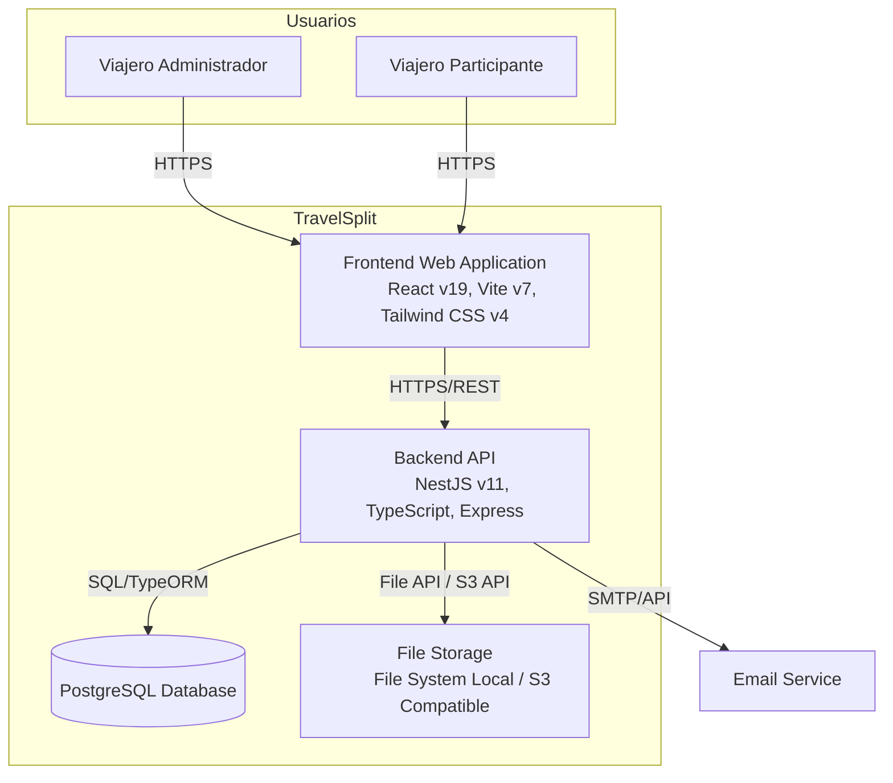
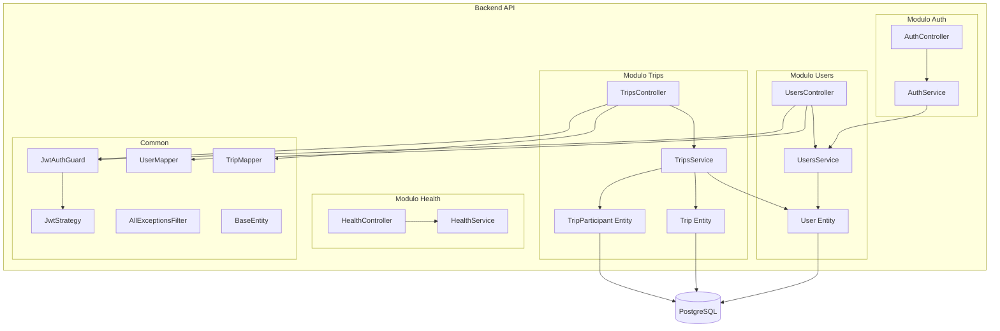
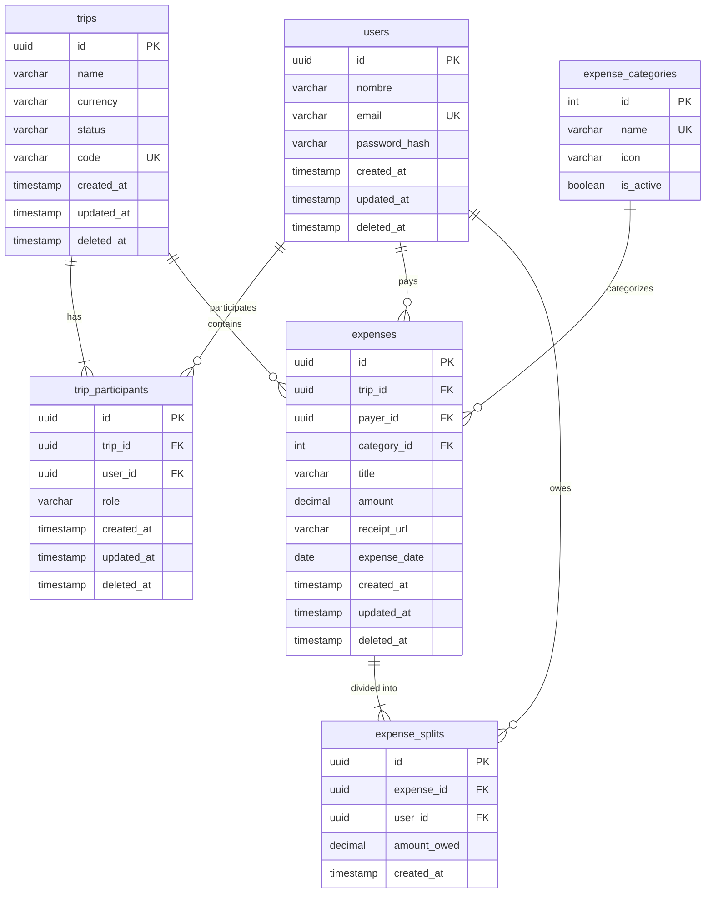

## Indice

0. [Ficha del proyecto](#0-ficha-del-proyecto)
1. [Descripcion general del producto](#1-descripcion-general-del-producto)
2. [Arquitectura del sistema](#2-arquitectura-del-sistema)
3. [Modelo de datos](#3-modelo-de-datos)
4. [Especificacion de la API](#4-especificacion-de-la-api)
5. [Historias de usuario](#5-historias-de-usuario)
6. [Tickets de trabajo](#6-tickets-de-trabajo)
7. [Pull requests](#7-pull-requests)

---

## 0. Ficha del proyecto

### **0.1. Tu nombre completo:**

Juan Camilo Jaramillo Alzate

### **0.2. Nombre del proyecto:**

TravelSplit

### **0.3. Descripcion breve del proyecto:**

Plataforma web para gestionar gastos de viaje en grupo. Permite el registro de usuarios, creacion de viajes, invitacion de participantes, registro de gastos con split entre beneficiarios, calculo de saldos "quien debe a quien" y liquidacion de cuentas en COP o USD.

### **0.4. URL del proyecto:**

_[Completar - puede ser publica o privada]_

> Puede ser publica o privada, en cuyo caso deberas compartir los accesos de manera segura. Puedes enviarlos a [alvaro@lidr.co](mailto:alvaro@lidr.co) usando algun servicio como [onetimesecret](https://onetimesecret.com/).

### 0.5. URL o archivo comprimido del repositorio

_[Completar]_

> Puedes tenerlo alojado en publico o en privado, en cuyo caso deberas compartir los accesos de manera segura. Puedes enviarlos a [alvaro@lidr.co](mailto:alvaro@lidr.co) usando algun servicio como [onetimesecret](https://onetimesecret.com/). Tambien puedes compartir por correo un archivo zip con el contenido

---

## 1. Descripcion general del producto

### **1.1. Objetivo:**

TravelSplit elimina la friccion financiera en viajes grupales. Los grupos de amigos sufren para consolidar gastos dispersos, perdiendo recibos y generando tensiones por calculos manuales erroneos. La solucion es un sistema web que obliga al registro previo para garantizar la identidad, centraliza la evidencia de gastos (fotos) y ofrece una visualizacion simple de saldos "quien debe a quien". El valor principal es la transparencia y la liquidacion clara entre amigos registrados.

### **1.2. Caracteristicas y funcionalidades principales:**

- **Autenticacion:** Registro (email, nombre, password > 6 caracteres), login con JWT y sesion persistente.
- **Gestion de viajes:** Crear viajes con nombre y moneda (COP o USD), listar viajes activos e historicos, invitar participantes por email (Strict User Policy: solo usuarios registrados), unirse por codigo alfanumerico.
- **Gestion de gastos:** Registrar gastos con titulo, monto, pagador, beneficiarios (split), categoria (Comida, Transporte, Alojamiento, Entretenimiento, Varios), foto opcional. Feed con paginacion ordenado por fecha descendente.
- **Saldos:** Calculo de total gastado por usuario vs cuota justa (fair share), visualizacion de deudas tipo "Juan debe $50.000 a Pedro", algoritmo de liquidacion para minimizar transacciones.
- **Roles contextuales:** Creador (CREATOR) gestiona viaje y gastos; Participante (MEMBER) crea gastos pero no puede editarlos ni eliminarlos.
- **Soft delete:** Borrado logico en todas las entidades principales.

### **1.3. Diseno y experiencia de usuario:**

- **Frontend:** React 19, Vite 7, Tailwind CSS 4. Diseño responsive con Atomic Design (atoms, molecules, organisms). Rutas protegidas, formularios con React Hook Form y validacion Zod.
- **Flujo principal:** Login/Registro -> Home con viajes -> Crear viaje o unirse por codigo -> Detalle de viaje (participantes, gastos, saldos) -> Crear gasto -> Ver saldos y liquidar.

_[Incluir capturas de pantalla o videotutorial segun disponibilidad]_

### **1.4. Instrucciones de instalacion:**

**Requisitos previos:**
- Node.js v22.x (Active LTS)
- npm o yarn
- Docker y Docker Compose (para PostgreSQL)

**Backend:**

```bash
cd Backend
npm install
cp .env.example .env
# Editar .env: DB_*, JWT_SECRET, etc.
docker-compose up -d
npm run migration:run
npm run start:dev
```

**Frontend:**

```bash
cd Frontend
npm install
npm run dev
```

**Variables de entorno principales (Backend):**
- `PORT`, `NODE_ENV`, `API_PREFIX`, `CORS_ORIGINS`
- `DB_HOST`, `DB_PORT`, `DB_USERNAME`, `DB_PASSWORD`, `DB_NAME`, `DB_SYNCHRONIZE`, `DB_LOGGING`
- `JWT_SECRET`, `JWT_EXPIRES_IN`

**URLs por defecto:**
- Backend: http://localhost:3000/api
- Swagger: http://localhost:3000/api/docs
- Frontend: http://localhost:5173

---

## 2. Arquitectura del Sistema

### **2.1. Diagrama de arquitectura:**

La arquitectura de TravelSplit se documenta siguiendo el **modelo C4** (Context, Containers, Components, Code). Los diagramas canonicos en formato PlantUML se encuentran en `docs/diagrams/c4/`. A continuacion se presentan las vistas de contenedores y componentes alineadas con dichos diagramas.

---

**Diagrama de contenedores (C4 Level 2)**

Representa las aplicaciones, bases de datos y sistemas externos que conforman el sistema. Alineado con `docs/diagrams/c4/02-containers.puml`.



---

**Diagrama de componentes Backend (C4 Level 3)**

Componentes internos del Backend API siguiendo el patron CSED. Alineado con `docs/diagrams/c4/03-components-backend.puml`.



*Nota: Los modulos Expenses y Balances siguen el mismo patron CSED (ExpensesController/Service, BalancesController/Service, entidades Expense, ExpenseSplit, ExpenseCategory).*

---

**Diagrama de componentes Frontend (C4 Level 3)**

Componentes internos del Frontend siguiendo Atomic Design. Alineado con `docs/diagrams/c4/03-components-frontend.puml`.

```mermaid
flowchart TB
    subgraph Frontend["Frontend Web Application"]
        subgraph Pages["Pages"]
            home[HomePage]
            login[LoginPage]
            register[RegisterPage]
            trips_list[TripsListPage]
            trip_detail[TripDetailPage]
            create_trip[CreateTripPage]
            expense_form[ExpenseFormPage]
        end
        subgraph Organisms["Organisms"]
            header[Header]
            bottom_tab[BottomTabBar]
            join_modal[JoinTripModal]
        end
        subgraph Molecules["Molecules"]
            trip_card[TripCard]
            balance_card[BalanceCard]
            expense_form_mol[ExpenseForm]
            form_field[FormField]
            payer_sel[PayerSelector]
            beneficiaries_sel[BeneficiariesSelector]
            category_sel[CategorySelector]
            protected_route[ProtectedRoute]
            join_btn[JoinTripButton]
        end
        subgraph Atoms["Atoms"]
            button[Button]
            input[Input]
            amount_input[AmountInput]
            category_pill[CategoryPill]
            image_upload[ImageUpload]
            skeleton[Skeleton]
            toast[Toast]
        end
        subgraph Hooks["Hooks"]
            use_auth[useAuth]
            use_trip_detail[useTripDetail]
            use_expense_form[useExpenseForm]
        end
        subgraph Services["Services"]
            auth_svc[authService]
            trips_svc[tripsService]
            api_client[apiClient]
        end
        auth_context[AuthContext]
    end

    backend_api[Backend API]

    home --> header
    home --> bottom_tab
    home --> join_btn
    trips_list --> trip_card
    trip_detail --> balance_card
    trip_detail --> join_modal
    expense_form --> expense_form_mol
    expense_form_mol --> amount_input
    expense_form_mol --> payer_sel
    expense_form_mol --> beneficiaries_sel
    expense_form_mol --> category_sel
    login --> use_auth
    register --> use_auth
    trip_detail --> use_trip_detail
    expense_form --> use_expense_form
    use_auth --> auth_svc
    use_trip_detail --> trips_svc
    use_expense_form --> trips_svc
    auth_svc --> api_client
    trips_svc --> api_client
    api_client -->|HTTPS/REST| backend_api
    protected_route --> auth_context
    use_auth --> auth_context
```



---

**Tabla de componentes (alineada con C4)**

| Contenedor | Componentes principales | Tecnologias |
|------------|-------------------------|-------------|
| **Frontend Web Application** | Pages (HomePage, LoginPage, TripsListPage, TripDetailPage, CreateTripPage, ExpenseFormPage), Organisms (Header, BottomTabBar, JoinTripModal), Molecules (TripCard, BalanceCard, ExpenseForm, FormField, PayerSelector, BeneficiariesSelector, CategorySelector), Atoms (Button, Input, AmountInput, CategoryPill, ImageUpload), Hooks (useAuth, useTripDetail, useExpenseForm), Services (authService, tripsService, apiClient), AuthContext | React 19, Vite 7, Tailwind CSS 4, TanStack Query, React Hook Form, Zod |
| **Backend API** | AuthController, AuthService, UsersController, UsersService, TripsController, TripsService, HealthController, HealthService, JwtAuthGuard, JwtStrategy, AllExceptionsFilter, UserMapper, TripMapper, BaseEntity | NestJS 11, TypeScript, Express, TypeORM, Passport JWT, Swagger, class-validator |
| **PostgreSQL Database** | Almacenamiento de entidades (User, Trip, TripParticipant, Expense, ExpenseSplit, ExpenseCategory) | PostgreSQL 17 |
| **File Storage** | Almacenamiento de imagenes de recibos | File System Local / S3 Compatible |
| **Email Service** | Notificaciones al agregar participantes | SMTP/API (externo) |

---

**Patron predefinido**

El sistema sigue dos patrones predefinidos:

1. **Arquitectura en Capas (Layered Architecture):** El backend se organiza en estratos horizontales. Cada capa tiene una responsabilidad unica y solo se comunica con la capa inmediatamente inferior. Capas: Controllers (HTTP) -> Services (logica de negocio) -> Repositories/Entities (acceso a datos).

2. **Patron CSED (Controller-Service-Entity-DTO):** Cada modulo se estructura en Controller (peticiones HTTP y validacion de entrada), Service (logica de negocio), Entity (modelo de datos) y DTO (contratos de transferencia y validacion). Regla de oro: el Controlador nunca accede directamente a la base de datos; debe pasar siempre por el Servicio.

**Justificacion de la arquitectura elegida**

Se eligio esta arquitectura por las siguientes razones:

- **Separacion de responsabilidades:** El dominio de gastos de viaje requiere integridad financiera (calculos de saldos, splits, liquidacion). Concentrar la logica en Services evita errores y facilita auditorias.
- **Escalabilidad del equipo:** La estructura modular (auth, trips, expenses, balances) permite que distintos desarrolladores trabajen en modulos independientes sin conflictos.
- **Integridad de datos:** PostgreSQL relacional garantiza transacciones ACID y restricciones de integridad referencial, criticas para datos financieros.
- **Ecosistema maduro:** NestJS ofrece inyeccion de dependencias, guards, pipes y documentacion Swagger integrada, reduciendo codigo boilerplate y estandarizando el API.
- **Frontend desacoplado:** React + API REST permite evolucionar el frontend (por ejemplo, migrar a React Native) sin tocar el backend.

**Beneficios principales y justificacion de su uso**

| Beneficio | Justificacion |
|-----------|---------------|
| **Testabilidad** | Los Services son funciones puras respecto a HTTP; se pueden probar con mocks de repositorios sin levantar el servidor. Los DTOs con class-validator garantizan validacion consistente en todos los endpoints. |
| **Mantenibilidad** | Cambios en reglas de negocio (ej. algoritmo de liquidacion) se realizan en un solo Service. Los Controllers permanecen delgados y estables. |
| **Documentacion automatica** | Swagger genera documentacion OpenAPI a partir de decoradores en DTOs y controladores, reduciendo desfase entre codigo y documentacion. |
| **Seguridad por capas** | JWT en Backend, validacion en DTOs y autorizacion por rol contextual (CREATOR/MEMBER) se aplican en puntos bien definidos. |
| **Trazabilidad** | Soft delete (deleted_at) en todas las entidades preserva historial financiero para auditorias. |

**Sacrificios y deficits que implica**

| Sacrificio/Deficit | Impacto |
|--------------------|---------|
| **Mayor cantidad de archivos y capas** | Cada recurso requiere Controller, Service, Entity, DTOs y posiblemente Mapper. Aumenta la curva de aprendizaje para nuevos desarrolladores y el tiempo inicial de implementacion de features. |
| **Overhead de validacion duplicada** | La validacion existe en Frontend (Zod) y Backend (class-validator). Cualquier cambio en reglas debe replicarse en ambos lados, con riesgo de desincronizacion. |
| **Acoplamiento a NestJS** | La estructura CSED y la inyeccion de dependencias estan ligadas al framework. Migrar a otro stack requeriria refactor significativo. |
| **Monolito inicial** | Backend y Frontend son monolitos. Para escalar horizontalmente en el futuro podria requerirse descomposicion en microservicios, lo que implicaria trabajo adicional. |
| **Complejidad para features simples** | Operaciones triviales (ej. health check) siguen la misma estructura que operaciones complejas, lo que puede parecer excesivo para casos minimos. |

**Referencia a diagramas C4**

Los diagramas completos en formato PlantUML (Context, Containers, Components, Code) estan en `docs/diagrams/c4/`. Para visualizarlos: usar la extension PlantUML en VS Code (`Alt+D` para previsualizar) o pegar el contenido en [plantuml.com/plantuml](http://www.plantuml.com/plantuml/uml/).

### **2.2. Descripcion de componentes principales:**

La tabla de componentes en la seccion 2.1 proporciona el inventario completo alineado con los diagramas C4. A continuacion se detallan los componentes criticos por contenedor:

| Contenedor | Componente | Responsabilidad |
|------------|------------|-----------------|
| **Frontend** | apiClient | Cliente HTTP base con interceptors JWT; punto unico de comunicacion con el Backend |
| **Frontend** | AuthContext | Contexto global de autenticacion; provee estado de sesion a ProtectedRoute y hooks |
| **Frontend** | useAuth, useTripDetail, useExpenseForm | Hooks que encapsulan logica de negocio y consumo de API; delegan en Services |
| **Backend** | JwtAuthGuard, JwtStrategy | Proteccion de rutas; validacion de tokens y extraccion de usuario autenticado |
| **Backend** | AllExceptionsFilter | Formateo consistente de excepciones HTTP; logging centralizado |
| **Backend** | UserMapper, TripMapper | Transformacion Entity -> DTO; aislamiento del contrato de API |

### **2.3. Descripcion de alto nivel del proyecto y estructura de ficheros**

```
TravelSplit/
├── Backend/
│   ├── src/
│   │   ├── main.ts, app.module.ts
│   │   ├── common/          # Guards, filters, strategies, mappers, BaseEntity
│   │   ├── config/          # app, database, jwt
│   │   ├── migrations/     # TypeORM migrations
│   │   └── modules/
│   │       ├── auth/       # Login, registro
│   │       ├── users/      # Perfil de usuario
│   │       ├── trips/      # Viajes, participantes
│   │       ├── expenses/   # Gastos, categorias, splits
│   │       ├── balances/   # Saldos, liquidacion
│   │       └── health/     # Health check
│   ├── test/
│   └── docker-compose.yml
├── Frontend/
│   └── src/
│       ├── components/     # atoms, molecules, organisms
│       ├── contexts/      # AuthContext
│       ├── hooks/         # useAuth, useTripDetail, etc.
│       ├── pages/         # Login, Register, Home, TripDetail, etc.
│       ├── routes/
│       ├── schemas/       # Zod
│       ├── services/      # auth, trip, expense, balance
│       └── types/
└── docs/                  # PRD, diagramas C4/ER, backlog
```

### **2.4. Infraestructura y despliegue**

- **Desarrollo:** Docker Compose para PostgreSQL local. Backend y Frontend en localhost.
- **Produccion:** Backend desplegable en Node.js; PostgreSQL gestionado; almacenamiento S3 compatible para imagenes.
- Diagrama de contenedores disponible en `docs/diagrams/c4/02-containers.puml`.

### **2.5. Seguridad**

- **Autenticacion:** JWT con Passport. Token en `Authorization: Bearer <token>`. Secret en variables de entorno.
- **Autorizacion:** Roles contextuales por viaje (CREATOR/MEMBER). Verificacion server-side en servicios.
- **Validacion:** class-validator en DTOs, ValidationPipe global con whitelist y forbidNonWhitelisted.
- **Contraseñas:** bcrypt con salt rounds.
- **Soft delete:** Ningun dato se borra fisicamente; trazabilidad preservada.

### **2.6. Tests**

- Backend: Jest para tests unitarios y e2e. Comando: `npm run test`, `npm run test:e2e`.
- Tests de servicios y controladores segun convenciones del proyecto.

---

## 3. Modelo de Datos

### **3.1. Diagrama del modelo de datos:**



### **3.2. Descripcion de entidades principales:**

| Entidad | Atributos clave | Relaciones |
|---------|-----------------|-------------|
| **users** | id (UUID PK), nombre, email (UK), password_hash, timestamps, deleted_at | Participa en trip_participants; paga expenses; aparece en expense_splits |
| **trips** | id (UUID PK), name, currency (COP/USD), status (ACTIVE/COMPLETED/CANCELLED), code (UK 8 chars) | Tiene trip_participants; contiene expenses |
| **trip_participants** | id (UUID PK), trip_id (FK), user_id (FK), role (CREATOR/MEMBER), UNIQUE(trip_id, user_id) | Resuelve M:N User-Trip |
| **expense_categories** | id (PK), name (UK), icon, is_active | Categoriza expenses |
| **expenses** | id (UUID PK), trip_id, payer_id, category_id, title, amount, receipt_url, expense_date | Pertenece a trip; pagador user; splits en expense_splits |
| **expense_splits** | id (UUID PK), expense_id, user_id, amount_owed | Beneficiarios de un gasto |

---

## 4. Especificacion de la API

**Base URL:** `/api` (ej. http://localhost:3000/api)

**Autenticacion:** Bearer JWT en header `Authorization: Bearer <token>`

### Endpoint 1: POST /auth/register

Registra un nuevo usuario y devuelve token JWT.

```yaml
openapi: 3.0.0
paths:
  /auth/register:
    post:
      summary: Registrar usuario
      requestBody:
        content:
          application/json:
            schema:
              type: object
              required: [nombre, email, contraseña]
              properties:
                nombre: { type: string, example: "Juan Perez" }
                email: { type: string, format: email, example: "juan@example.com" }
                contraseña: { type: string, minLength: 7, example: "password123" }
      responses:
        '201':
          description: Usuario registrado y autenticado
          content:
            application/json:
              schema:
                type: object
                properties:
                  accessToken: { type: string }
                  user: { type: object, properties: { id, nombre, email, createdAt } }
        '400': { description: Validacion fallida }
        '409': { description: Email ya registrado }
```

### Endpoint 2: POST /trips

Crea un viaje (requiere JWT). Usuario autenticado queda como CREATOR.

```yaml
paths:
  /trips:
    post:
      summary: Crear viaje
      security: [{ bearerAuth: [] }]
      requestBody:
        content:
          application/json:
            schema:
              type: object
              required: [name]
              properties:
                name: { type: string, example: "Viaje a Cartagena" }
                currency: { type: string, enum: [COP, USD], default: COP }
                memberEmails: { type: array, items: { type: string, format: email } }
      responses:
        '201':
          description: Viaje creado
          content:
            application/json:
              schema:
                type: object
                properties:
                  id: { type: string, format: uuid }
                  name: { type: string }
                  currency: { type: string }
                  status: { type: string }
                  code: { type: string }
        '400': { description: Datos invalidos }
        '401': { description: No autorizado }
```

### Endpoint 3: POST /trips/:trip_id/expenses

Crea un gasto en un viaje (requiere JWT, ser participante).

```yaml
paths:
  /trips/{trip_id}/expenses:
    post:
      summary: Crear gasto
      security: [{ bearerAuth: [] }]
      parameters:
        - name: trip_id
          in: path
          required: true
          schema: { type: string, format: uuid }
      requestBody:
        content:
          application/json:
            schema:
              type: object
              required: [title, amount, category_id, expense_date, beneficiaries]
              properties:
                title: { type: string }
                amount: { type: number }
                category_id: { type: integer }
                expense_date: { type: string, format: date }
                receipt_url: { type: string }
                beneficiaries: { type: array, items: { type: object, properties: { user_id, amount_owed } } }
      responses:
        '201': { description: Gasto creado }
        '400': { description: Datos invalidos }
        '401': { description: No autorizado }
        '403': { description: No eres participante }
        '404': { description: Viaje no existe o cerrado }
```

**Documentacion completa:** http://localhost:3000/api/docs (Swagger UI)

---

## 5. Historias de Usuario

**Historia de Usuario 1**

- **Como** Creador, **quiero** invitar a mis amigos por correo al viaje, **para que** se unan al registro de gastos sin necesidad de crearlos manualmente.
- **Criterios:** Solo el CREATOR puede invitar. El sistema valida que el email exista como usuario registrado. Si no esta registrado, la invitacion se bloquea y se muestra mensaje indicando que debe registrarse primero.

**Historia de Usuario 2**

- **Como** Participante, **quiero** subir una foto del recibo al crear un gasto, **para que** exista evidencia del monto cobrado.
- **Criterios:** La foto es opcional. Si se envia, se almacena en sistema de archivos o cloud. La URL se asocia al gasto.

**Historia de Usuario 3**

- **Como** Usuario, **quiero** ver una lista simple que me diga cuanto debo o cuanto me deben en el viaje, **para** transferir el dinero y cerrar el viaje.
- **Criterios:** El sistema calcula total gastado por usuario vs cuota justa. Se muestra lista de deudas tipo "Juan debe X a Pedro". La informacion se actualiza al registrar nuevos gastos.

---

## 6. Tickets de Trabajo

**Ticket 1 (Backend): TCK-AUTH-002 - Endpoint de login y emision de JWT**

- **Relacionado con:** US-AUTH-002
- **Descripcion:** Implementar autenticacion con verificacion de credenciales y emision de JWT con payload { sub, email }.
- **Tareas:** Implementar estrategia JWT con Passport; configurar guardas para rutas protegidas; implementar firma de token y expiracion.
- **Criterios de aceptacion:** Credenciales correctas retornan token valido; credenciales incorrectas retornan error generico; token usable en endpoints protegidos con Authorization: Bearer.
- **Story Points:** 3

**Ticket 2 (Frontend): TCK-FE-002 - Pantalla de listado de viajes y creacion de viaje**

- **Relacionado con:** US-TRIP-001, US-TRIP-002
- **Descripcion:** Implementar pantallas para listar viajes del usuario y crear nuevos viajes con nombre, moneda y opcion de invitar miembros por email.
- **Tareas:** Consumir GET /trips y POST /trips; formulario con validacion Zod; mostrar rol y conteo de participantes; manejo de errores (email no registrado).
- **Criterios de aceptacion:** Lista muestra viajes activos e historicos; formulario de creacion valida y envia correctamente; feedback claro de exito/error.
- **Story Points:** 3

**Ticket 3 (Base de datos): TCK-TRIP-001 - Modelo y migracion de Trip y TripParticipant**

- **Relacionado con:** US-TRIP-001, US-PART-001, US-PART-002
- **Descripcion:** Crear entidades y migraciones para viajes y participantes con roles contextuales CREATOR/MEMBER.
- **Tareas:** Entidad Trip (id, name, currency, status, code, timestamps, deleted_at); Entidad TripParticipant (trip_id, user_id, role); llaves foraneas y constraints.
- **Criterios de aceptacion:** Un usuario puede ser CREATOR en un viaje y MEMBER en otro; no existe campo isAdmin global en User.
- **Story Points:** 5

---

## 7. Pull Requests

_[Documentar 3 Pull Requests realizadas durante el desarrollo del proyecto]_

**Pull Request 1**

_[Titulo, descripcion, enlace, cambios principales]_

**Pull Request 2**

_[Titulo, descripcion, enlace, cambios principales]_

**Pull Request 3**

_[Titulo, descripcion, enlace, cambios principales]_
