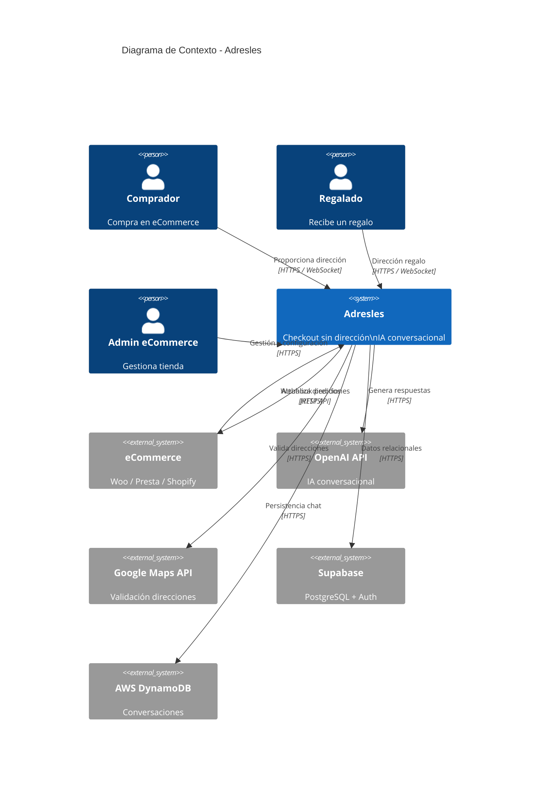
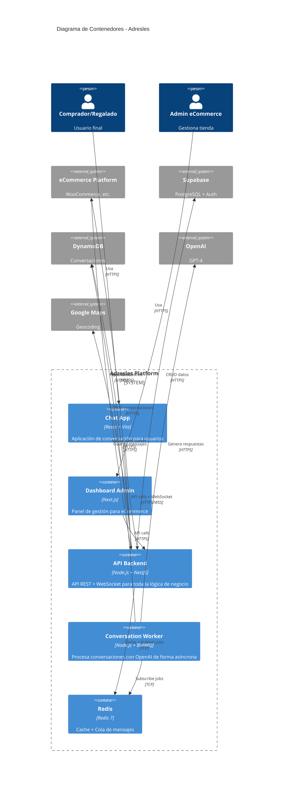
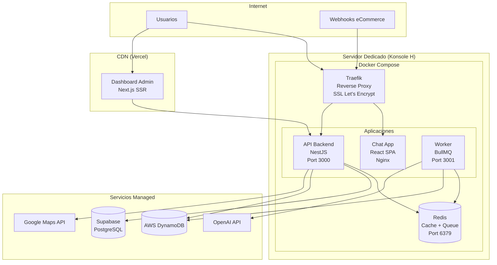
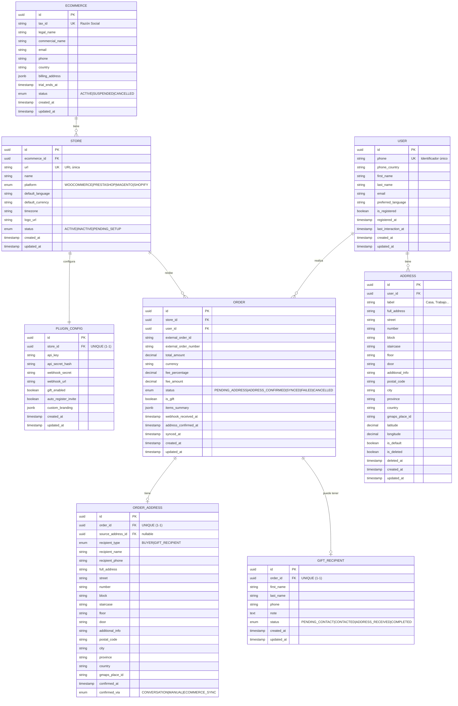
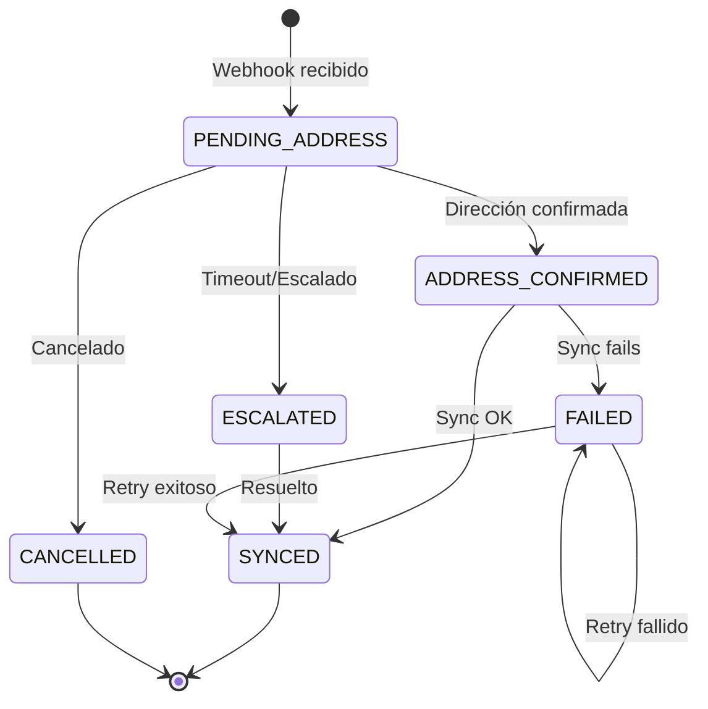
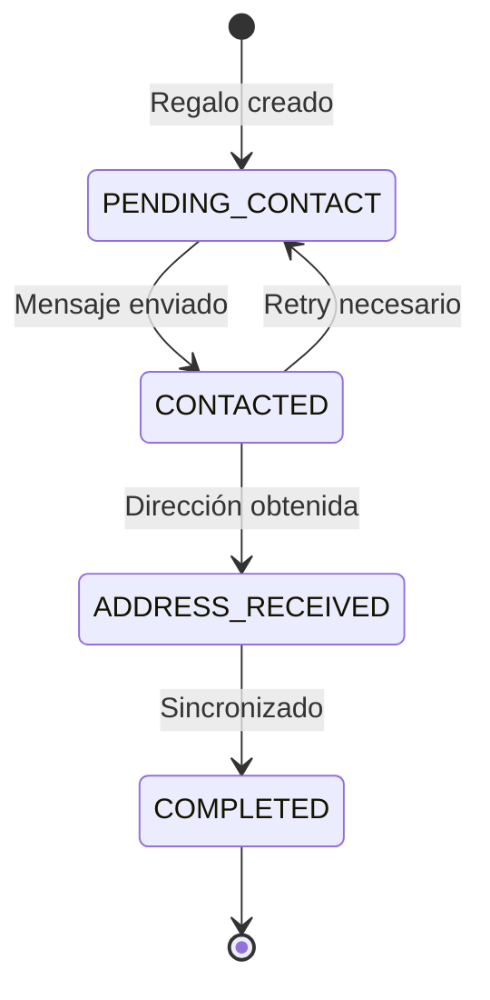

## Índice

0. [Ficha del proyecto](#0-ficha-del-proyecto)
1. [Descripción general del producto](#1-descripción-general-del-producto)
2. [Arquitectura del sistema](#2-arquitectura-del-sistema)
3. [Modelo de datos](#3-modelo-de-datos)
4. [Especificación de la API](#4-especificación-de-la-api)
5. [Historias de usuario](#5-historias-de-usuario)
6. [Tickets de trabajo](#6-tickets-de-trabajo)
7. [Pull requests](#7-pull-requests)

---

## 0. Ficha del proyecto

### **0.1. Tu nombre completo:**

Sergio Valdueza Lozano

### **0.2. Nombre del proyecto:**

ADRESLES

### **0.3. Descripción breve del proyecto:**

Adresles es una plataforma SaaS B2B2C que revoluciona la experiencia de checkout en tiendas online eliminando la fricción más común: la introducción manual de la dirección de entrega. El comprador completa su pedido indicando únicamente nombre y número de teléfono. Un agente conversacional basado en IA (GPT-4) contacta al usuario para obtener la dirección mediante conversación natural, actualizándola automáticamente en el sistema del eCommerce.

**Propuesta de valor central**: "Compra solo con nombre + teléfono, nosotros obtenemos tu dirección conversando contigo"

### **0.4. URL del proyecto:**

https://github.com/SValduezaL/AI4Devs-finalproject/tree/finalproject-SVL

> Repositorio público en GitHub

### 0.5. URL o archivo comprimido del repositorio

https://github.com/SValduezaL/AI4Devs-finalproject/tree/finalproject-SVL

> Repositorio público accesible directamente desde GitHub


---

## 1. Descripción general del producto

### **1.1. Objetivo:**

**Propósito**: Eliminar la fricción del checkout en eCommerce reduciendo drásticamente el abandono de carrito causado por formularios largos y tediosos.

**Qué soluciona**:
- **Para el Comprador**: Elimina la tarea de introducir manualmente 12+ campos de dirección en dispositivos móviles o desktop
- **Para el eCommerce**: Reduce el abandono de carrito en el checkout, aumenta la tasa de conversión y mejora significativamente la experiencia de usuario
- **Para tiendas con e-commerce**: Ofrece experiencia omnicanal mejorada y fidelización de clientes

**Valor diferencial**:
1. **Checkout ultra-rápido**: Solo nombre + teléfono (2 campos vs 12 tradicionales)
2. **Conversación natural con IA**: GPT-4 obtiene la dirección mediante diálogo fluido adaptado al usuario
3. **Validación inteligente**: Integración con Google Maps API + detección proactiva de datos faltantes (escalera, bloque, piso, puerta)
4. **Libreta de direcciones centralizada**: El usuario guarda direcciones reutilizables en cualquier eCommerce integrado con Adresles
5. **Funcionalidad de Regalo**: Permite comprar para terceros sin conocer su dirección
6. **Efecto red**: Cuantos más eCommerce usan Adresles, más usuarios tienen dirección pre-guardada
7. **Global desde el inicio**: Multi-idioma y multi-moneda

**Modelo de monetización**: Fee variable por transacción (2.5%-5% inversamente proporcional al importe), con 1 mes de prueba gratuita.

> 📖 **Documentación detallada**: [Adresles_Business.md - Sección 1](./Adresles_Business.md#fase-1-investigación-y-análisis)

### **1.2. Características y funcionalidades principales:**

#### **Para el Comprador (B2C)**

| Función | Descripción | Estado |
|---------|-------------|--------|
| **Checkout Adresles** | Completar compra solo con nombre y teléfono (sin dirección) | ✅ Diseñado (MVP Mock) |
| **Conversación IA** | Indicar dirección por chat natural en App Adresles con GPT-4 | ✅ Diseñado (Implementación real) |
| **Libreta de Direcciones** | Gestionar direcciones favoritas reutilizables | ✅ Diseñado |
| **Modo Regalo** | Enviar pedido a otra persona sin conocer su dirección | ✅ Diseñado (MVP Mock) |
| **Registro Adresles** | Crear cuenta para persistir preferencias y direcciones | ✅ Diseñado |
| **Detección de idioma** | Conversación automática en el idioma del usuario | ✅ Diseñado (simulado en MVP) |
| **Validación de direcciones** | Google Maps API normaliza y detecta datos faltantes | ✅ Diseñado (Implementación real) |

#### **Para el eCommerce (B2B)**

| Función | Descripción | Estado |
|---------|-------------|--------|
| **Plugin de Checkout** | Integración en el proceso de pago | 🔄 Pendiente (MVP usa entrada JSON mock) |
| **Webhook de Compras** | Recepción automática de pedidos en tiempo real | 🔄 Mockeado (entrada JSON manual) |
| **Dashboard de Gestión** | Monitorización de pedidos y conversaciones | ⏳ Por diseñar |
| **API de Sincronización** | Actualización de direcciones en el sistema | 🔄 Mockeado (log estructurado/notificación) |
| **Prueba gratuita** | 1 mes sin coste para evaluar el servicio | ✅ Definido en modelo de negocio |

#### **Para el Sistema (Interno)**

| Función | Descripción | Estado |
|---------|-------------|--------|
| **Orquestador de Conversaciones** | Gestión del flujo conversacional con GPT-4 | ✅ Diseñado (Backend NestJS) |
| **Motor de Journeys** | Selección automática del flujo según contexto usuario | ✅ Diseñado (5 journeys definidos) |
| **Sistema de Reminders** | Recordatorios tras 15 min sin respuesta | ⏳ Pendiente post-MVP |
| **Validador de Direcciones** | Google Maps API + detección datos faltantes | ✅ Diseñado (Implementación real) |
| **Escalado a Soporte** | Envío de incidencias por email cuando IA no resuelve | ✅ Diseñado |
| **Multi-tenant con RLS** | Aislamiento de datos entre eCommerce | ✅ Diseñado (Supabase RLS policies) |

#### **Roadmap de Integraciones**

1. **Fase 0 (MVP actual)**: Integración Mock - Entrada manual JSON
2. **Fase 1**: Plugin WooCommerce real
3. **Fase 2**: PrestaShop
4. **Fase 3**: Magento
5. **Fase 4**: Shopify

> 📖 **Casos de uso detallados**: [Adresles_Business.md - Fase 2](./Adresles_Business.md#fase-2-casos-de-uso)

### **1.3. Diseño y experiencia de usuario:**

#### **User Journeys Principales**

**Journey 1: Compra Tradicional (Usuario NO usa modo Adresles)**
- Usuario completa checkout tradicional con dirección
- Adresles le invita a registrarse para futuras compras más rápidas

**Journey 2: Compra Adresles - Usuario Registrado en Adresles**
- **Con dirección favorita**: Sistema propone dirección guardada, opción de cambiar
- **Sin dirección favorita**: IA solicita nueva dirección

**Journey 3: Compra Adresles - Usuario Registrado solo en eCommerce**
- **Con dirección en eCommerce**: Sistema propone dirección + invitación registro Adresles
- **Sin dirección en eCommerce**: IA solicita dirección + invitación registro Adresles

**Journey 4: Compra Adresles - Usuario Nuevo**
- Usuario no registrado en ningún sistema
- IA solicita dirección + invitación registro Adresles

**Journey 5: Modo Regalo 🎁**
- **Comprador**: Indica nombre + teléfono del destinatario
- **Sistema**: Inicia dos conversaciones paralelas:
  - Con **destinatario** para obtener/confirmar dirección (si registrado, propone su favorita)
  - Con **comprador** para informar del proceso (sin revelar dirección por protección de datos)

#### **Flujo Principal Simplificado**

```
1. Usuario Compra → 2. Checkout Rápido (nombre + teléfono)
                      ↓
3. Adresles Procesa → 4. App Adresles - Conversación IA
                      ↓
5. Dirección Validada (Google Maps) → 6. eCommerce Actualizado
```

#### **Experiencia de Conversación**

La conversación con el agente IA (GPT-4) incluye:
- **Saludo personalizado** en el idioma del usuario
- **Confirmación de compra** (tienda, productos)
- **Propuesta de dirección** si existe en libreta o eCommerce
- **Solicitud conversacional** de dirección si no existe
- **Validación inteligente** con Google Maps
- **Detección proactiva** de datos faltantes en edificios (piso, puerta, escalera, bloque)
- **Confirmación final** antes de sincronizar con eCommerce
- **Invitación opcional** a registrarse en Adresles

> 📖 **Journeys detallados**: [Adresles_Business.md - Sección 1.6](./Adresles_Business.md#16-user-journeys-detallados)  
> 📖 **Diagramas de secuencia**: [Adresles_Business.md - Sección 4.8](./Adresles_Business.md#48-diagramas-de-secuencia)

> ⚠️ **Nota**: El proyecto se encuentra en fase de diseño y documentación. Las capturas de pantalla y videotutoriales se generarán durante la fase de implementación.

### **1.4. Instrucciones de instalación:**

> ⚠️ **Estado actual**: El proyecto está en fase de diseño y documentación. La implementación del código fuente iniciará tras completar el diseño arquitectónico detallado.

#### **Arquitectura Técnica Diseñada**

**Stack Tecnológico**:
- **Backend**: Node.js + NestJS + TypeScript
- **Frontend Chat**: React + Vite + TailwindCSS + Shadcn/ui
- **Frontend Admin**: Next.js + TailwindCSS
- **Base de Datos**: Supabase (PostgreSQL) + AWS DynamoDB
- **IA Conversacional**: OpenAI GPT-4
- **Validación de Direcciones**: Google Maps API (Geocoding)
- **Colas**: Redis + BullMQ
- **Deployment**: Docker Compose + Traefik (reverse proxy con SSL automático)
- **CI/CD**: GitHub Actions
- **Hosting**: Servidor dedicado Konsole H (backend) + Vercel (dashboard admin)

#### **Estructura del Proyecto (Diseñada)**

```
adresles/
├── apps/
│   ├── api/                    # Backend NestJS
│   ├── worker/                 # Worker BullMQ para conversaciones
│   ├── web-chat/              # Frontend Chat (React + Vite)
│   └── web-admin/             # Frontend Admin (Next.js)
├── packages/
│   ├── shared-types/          # TypeScript types compartidos
│   └── api-client/            # Cliente API generado
├── infrastructure/
│   ├── docker/                # Docker Compose configs
│   └── scripts/               # Scripts de deployment
└── openspec/                  # Especificaciones SDD
```

#### **Servicios Externos Requeridos**

| Servicio | Propósito | Configuración |
|----------|-----------|---------------|
| **Supabase** | PostgreSQL + Auth + RLS | Cuenta gratuita disponible |
| **AWS DynamoDB** | Mensajes conversacionales (alta volumetría) | Modo pay-per-request |
| **OpenAI** | API GPT-4 para conversaciones | API Key requerida |
| **Google Maps** | Geocoding y validación de direcciones | API Key requerida |
| **Vercel** | Hosting Dashboard Admin (opcional) | Free tier disponible |

#### **Variables de Entorno (Futuro `.env`)**

```bash
# Backend API
NODE_ENV=development
PORT=3000
REDIS_URL=redis://localhost:6379

# Supabase
SUPABASE_URL=https://xxx.supabase.co
SUPABASE_SERVICE_KEY=xxx
SUPABASE_ANON_KEY=xxx

# AWS DynamoDB
AWS_REGION=eu-west-1
AWS_ACCESS_KEY_ID=xxx
AWS_SECRET_ACCESS_KEY=xxx

# OpenAI
OPENAI_API_KEY=sk-xxx

# Google Maps
GOOGLE_MAPS_API_KEY=xxx

# Frontend URLs
NEXT_PUBLIC_API_URL=http://localhost:3000
VITE_API_URL=http://localhost:3000
VITE_WS_URL=ws://localhost:3000
```

#### **Instalación Futura (Cuando se implemente)**

```bash
# 1. Clonar repositorio
git clone https://github.com/SValduezaL/AI4Devs-finalproject.git
cd AI4Devs-finalproject

# 2. Instalar dependencias (pnpm requerido)
pnpm install

# 3. Configurar variables de entorno
cp .env.example .env
# Editar .env con tus credenciales

# 4. Iniciar servicios con Docker Compose
docker-compose up -d redis

# 5. Ejecutar migraciones de base de datos (Supabase)
pnpm --filter api db:migrate

# 6. Iniciar aplicaciones en modo desarrollo
pnpm dev

# Las apps estarán disponibles en:
# - API Backend: http://localhost:3000
# - Chat App: http://localhost:5173
# - Admin Dashboard: http://localhost:3001
# - Worker: (background, sin UI)
```

> 📖 **Arquitectura completa**: [Adresles_Business.md - Fase 4](./Adresles_Business.md#fase-4-diseño-de-alto-nivel)  
> 📖 **Stack detallado**: [memory-bank/tech-stack.md](./memory-bank/project-context/tech-stack.md)  
> 📖 **Docker Compose**: [Adresles_Business.md - Sección 4.7](./Adresles_Business.md#47-docker-compose---configuración)

---

## 2. Arquitectura del Sistema

### **2.1. Diagrama de arquitectura:**

#### **Patrón Arquitectónico: Monolito Modular**

Se ha elegido una arquitectura de **Monolito Modular** con separación clara de responsabilidades, siguiendo principios de Domain-Driven Design (DDD).

**Justificación**:
- ✅ **Velocidad de desarrollo**: Un solo repositorio, despliegue simplificado
- ✅ **Coste optimizado**: Aprovecha servidor dedicado existente + servicios managed
- ✅ **Escalabilidad futura**: Módulos con interfaces claras, fácil extracción a microservicios
- ✅ **Apropiado para MVP**: Menor complejidad operacional, ideal para validar producto

**Trade-offs**:
- ⚠️ **Escalado horizontal**: Requiere escalar toda la aplicación (no componentes individuales)
- ⚠️ **Acoplamiento potencial**: Requiere disciplina para mantener módulos independientes
- ✅ **Mitigación**: Bounded contexts claros, interfaces bien definidas, repository pattern

#### **Diagrama C4 - Nivel 1: Contexto del Sistema**



#### **Diagrama C4 - Nivel 2: Contenedores**



**Principios Arquitectónicos Aplicados**:

| Principio | Aplicación en Adresles |
|-----------|------------------------|
| **Separación de concerns** | Módulos independientes por dominio (Conversations, Orders, Addresses, Users, Stores) |
| **Dependency Inversion** | Repositorios abstraídos, servicios inyectables con NestJS DI |
| **Event-Driven** | Colas BullMQ para procesamiento asíncrono de conversaciones |
| **API-First** | Contratos OpenAPI definidos antes de implementación |
| **Infrastructure as Code** | Docker Compose para reproducibilidad |

> 📖 **Diagramas C4 completos**: [Adresles_Business.md - Secciones 4.2-4.4](./Adresles_Business.md#42-diagrama-c4---nivel-1-contexto-del-sistema)  
> 📖 **ADR Arquitectura**: [memory-bank/architecture/001-monolith-modular.md](./memory-bank/architecture/001-monolith-modular.md)

### **2.2. Descripción de componentes principales:**

#### **Backend - API (NestJS)**

**Tecnología**: Node.js + NestJS + TypeScript  
**Puerto**: 3000  
**Responsabilidades**:
- Endpoints REST para gestión de pedidos, direcciones, usuarios
- WebSocket Gateway para comunicación en tiempo real con usuarios
- Orquestación de conversaciones (Journey Engine)
- Integración con Google Maps API para validación de direcciones
- Gestión de webhooks desde eCommerce (mockeados en MVP)
- Autenticación y autorización con Supabase Auth

**Módulos principales**:
- `conversations/`: Orquestación de conversaciones IA (núcleo del sistema)
- `orders/`: Gestión de pedidos
- `addresses/`: Validación y normalización de direcciones
- `users/`: Gestión de usuarios y autenticación
- `stores/`: Configuración de tiendas y eCommerce
- `webhooks/`: Recepción de eventos desde eCommerce

#### **Worker - Conversation Processor (BullMQ)**

**Tecnología**: Node.js + BullMQ + TypeScript  
**Responsabilidades**:
- Procesamiento asíncrono de jobs de conversación
- Llamadas a OpenAI GPT-4 para generar respuestas
- Construcción de prompts según journey y contexto
- Parseo y validación de respuestas de IA
- Programación de reminders (pendiente post-MVP)

**Servicios principales**:
- `ai.service.ts`: Orquesta llamadas a OpenAI
- `prompt-builder.service.ts`: Construye prompts según journey
- `response-parser.service.ts`: Parsea y valida respuestas de IA

#### **Frontend - Chat App (React + Vite)**

**Tecnología**: React + Vite + TailwindCSS + Shadcn/ui  
**Puerto**: 5173 (dev)  
**Responsabilidades**:
- Interfaz de conversación para usuarios (comprador/destinatario)
- Conexión WebSocket en tiempo real con backend
- Gestión de libreta de direcciones
- Visualización de pedidos activos

**Stack**:
- **State Management**: Zustand
- **API Client**: TanStack Query (React Query)
- **WebSocket**: Socket.io client
- **UI Components**: Shadcn/ui (sobre Radix UI)

#### **Frontend - Dashboard Admin (Next.js)**

**Tecnología**: Next.js 14 + TailwindCSS  
**Puerto**: 3001 (dev)  
**Responsabilidades**:
- Panel de gestión para administradores de eCommerce
- Monitorización de pedidos y conversaciones
- Configuración de tiendas y plugins
- Estadísticas y métricas

**Stack**:
- **Rendering**: Server Components + Client Components
- **API Routes**: Next.js API Routes
- **Deployment**: Vercel (free tier)

#### **Base de Datos - Arquitectura Híbrida**

**Supabase (PostgreSQL)**  
**Propósito**: Datos relacionales con integridad referencial  
**Tablas principales**:
- `ecommerce`: Razón social de eCommerce
- `store`: Tiendas (identificadas por URL única)
- `user`: Usuarios (identificador único: teléfono)
- `address`: Libreta de direcciones
- `order`: Pedidos
- `order_address`: Snapshot inmutable de dirección en pedido
- `gift_recipient`: Datos de destinatario en modo regalo

**Ventajas**:
- Auth integrado (JWT)
- Row Level Security (RLS) para multi-tenant
- Realtime subscriptions
- PostgreSQL estándar (SQL completo)

**AWS DynamoDB**  
**Propósito**: Mensajes conversacionales (alta volumetría, TTL automático)  
**Tablas**:
- `Conversations`: Metadata de conversaciones (PK: conversation_id)
- `Messages`: Mensajes individuales (PK: conversation_id, SK: ulid)
- `AuditLog`: Logs de auditoría con TTL

**Ventajas**:
- TTL nativo (90 días para mensajes, configurable)
- Alto throughput para escrituras
- Pay-per-request (coste optimizado)

> 📖 **ADR Base de Datos**: [memory-bank/architecture/002-supabase-dynamodb.md](./memory-bank/architecture/002-supabase-dynamodb.md)

#### **Servicios Externos**

**OpenAI GPT-4**  
**Propósito**: Motor de conversación inteligente  
**Uso**: Generación de respuestas naturales, comprensión de direcciones, detección de intenciones

**Google Maps API (Geocoding)**  
**Propósito**: Validación y normalización de direcciones  
**Uso**: Validación de direcciones, normalización de formato, obtención de coordenadas

**Redis**  
**Propósito**: Cache + Cola de mensajes  
**Uso**: BullMQ jobs, cache de sesiones, PubSub para WebSocket

> 📖 **Stack completo**: [memory-bank/tech-stack.md](./memory-bank/project-context/tech-stack.md)

### **2.3. Descripción de alto nivel del proyecto y estructura de ficheros**

#### **Estructura del Proyecto (Monorepo con pnpm + Turborepo)**

```
adresles/
├── apps/                              # Aplicaciones
│   ├── api/                           # Backend NestJS
│   │   ├── src/
│   │   │   ├── modules/
│   │   │   │   ├── auth/              # Autenticación y autorización
│   │   │   │   ├── conversations/     # 🎯 NÚCLEO - Orquestación conversaciones
│   │   │   │   │   ├── journeys/      # Journey Engine (get-address, register, gift, etc.)
│   │   │   │   │   ├── conversations.gateway.ts  # WebSocket
│   │   │   │   │   └── conversations.service.ts
│   │   │   │   ├── orders/            # Gestión de pedidos
│   │   │   │   ├── addresses/         # Validación con Google Maps
│   │   │   │   ├── users/             # Gestión de usuarios
│   │   │   │   ├── stores/            # Tiendas y eCommerce
│   │   │   │   ├── webhooks/          # Recepción webhooks eCommerce
│   │   │   │   └── ecommerce-sync/    # Sincronización con eCommerce
│   │   │   ├── shared/
│   │   │   │   ├── database/          # Módulos Supabase + DynamoDB
│   │   │   │   ├── queue/             # BullMQ config
│   │   │   │   └── utils/
│   │   │   └── config/
│   │   ├── Dockerfile
│   │   └── package.json
│   │
│   ├── worker/                        # Worker BullMQ para conversaciones
│   │   ├── src/
│   │   │   ├── processors/
│   │   │   │   ├── conversation.processor.ts
│   │   │   │   └── reminder.processor.ts
│   │   │   ├── services/
│   │   │   │   ├── ai.service.ts      # Integración OpenAI
│   │   │   │   ├── prompt-builder.service.ts
│   │   │   │   └── response-parser.service.ts
│   │   │   └── prompts/
│   │   │       └── system-prompts/    # Prompts por journey
│   │   ├── Dockerfile
│   │   └── package.json
│   │
│   ├── web-chat/                      # Frontend Chat (React + Vite)
│   │   ├── src/
│   │   │   ├── components/
│   │   │   │   ├── ui/                # Shadcn/ui components
│   │   │   │   └── chat/              # Componentes específicos de chat
│   │   │   ├── hooks/                 # Custom hooks
│   │   │   ├── stores/                # Zustand stores
│   │   │   └── lib/                   # Utilidades
│   │   ├── Dockerfile
│   │   └── package.json
│   │
│   └── web-admin/                     # Frontend Admin (Next.js)
│       ├── src/
│       │   ├── app/                   # App Router Next.js 14
│       │   ├── components/
│       │   └── lib/
│       ├── Dockerfile
│       └── package.json
│
├── packages/                          # Código compartido
│   ├── shared-types/                  # TypeScript types compartidos
│   │   ├── src/
│   │   │   ├── order.types.ts
│   │   │   ├── conversation.types.ts
│   │   │   ├── address.types.ts
│   │   │   └── index.ts
│   │   └── package.json
│   └── api-client/                    # Cliente API generado (OpenAPI)
│       └── package.json
│
├── infrastructure/                    # Infraestructura como código
│   ├── docker/
│   │   └── docker-compose.yml         # Orquestación de servicios
│   └── scripts/
│       ├── deploy.sh                  # Script de despliegue
│       └── backup.sh                  # Backups de BD
│
├── memory-bank/                       # Documentación persistente
│   ├── project-context/               # Contexto del proyecto
│   ├── architecture/                  # ADRs
│   └── references/                    # Referencias rápidas
│
├── openspec/                          # Especificaciones SDD
│   ├── specs/                         # Estándares del proyecto
│   ├── .agents/                       # Definición de agentes
│   └── changes/                       # Cambios específicos por feature
│
├── .github/
│   └── workflows/
│       ├── ci.yml                     # Tests y linting
│       └── deploy.yml                 # Deployment automático
│
├── package.json                       # Monorepo root
├── pnpm-workspace.yaml               # Configuración workspaces
├── turbo.json                         # Turborepo config
├── Adresles_Business.md              # Documento de diseño completo (2170 líneas)
└── README.md                          # Este archivo
```

#### **Patrón de Organización: Domain-Driven Design (DDD)**

El backend sigue principios de DDD con **Bounded Contexts** claros:

| Dominio | Responsabilidad | Módulo |
|---------|-----------------|--------|
| **Conversations** | 🎯 Núcleo del sistema - Orquestación conversaciones IA | `modules/conversations/` |
| **Orders** | Gestión del ciclo de vida de pedidos | `modules/orders/` |
| **Addresses** | Validación, normalización y gestión de direcciones | `modules/addresses/` |
| **Users** | Identidad, autenticación y perfiles | `modules/users/` |
| **Stores** | Configuración de tiendas y eCommerce | `modules/stores/` |

**Ventajas de esta estructura**:
- ✅ Separación clara de responsabilidades
- ✅ Fácil localización de código por funcionalidad
- ✅ Extracción futura a microservicios sin refactoring mayor
- ✅ Onboarding rápido de nuevos desarrolladores

> 📖 **Estructura completa**: [Adresles_Business.md - Sección 4.5](./Adresles_Business.md#45-estructura-del-proyecto)  
> 📖 **Backend Standards**: [openspec/specs/backend-standards.mdc](./openspec/specs/backend-standards.mdc)

### **2.4. Infraestructura y despliegue**

#### **Diagrama de Infraestructura**



#### **Componentes de Infraestructura**

**Traefik (Reverse Proxy)**
- **Función**: Enrutamiento de tráfico, SSL automático con Let's Encrypt
- **Puertos**: 80 (HTTP), 443 (HTTPS)
- **Ventajas**: Integración nativa con Docker, SSL automático, dashboards

**Servidor Dedicado (Konsole H)**
- **Especificaciones**: (Por definir en fase de implementación)
- **Sistema Operativo**: Linux (Ubuntu/Debian)
- **Servicios alojados**: API Backend, Worker, Chat App, Redis
- **Ventaja**: Coste fijo predecible, control total

**Vercel (Frontend Admin)**
- **Plan**: Free tier (escalable a Pro si necesario)
- **Características**: CDN global, deploy automático desde Git, SSL incluido
- **Ventaja**: SSR optimizado para Next.js, zero-config

#### **Proceso de Despliegue (CI/CD con GitHub Actions)**

**Pipeline Automatizado**:

1. **Trigger**: Push a rama `main` o ejecución manual
2. **Job 1 - Tests**: Ejecuta linter + tests unitarios
3. **Job 2 - Build**: Construye imágenes Docker y las publica en GitHub Container Registry
4. **Job 3 - Deploy**: 
   - Copia docker-compose.yml al servidor vía SSH
   - Ejecuta `docker compose pull` para descargar nuevas imágenes
   - Ejecuta `docker compose up -d` para reiniciar servicios
   - Limpia imágenes antiguas

**Comandos principales**:
```bash
# En servidor (vía GitHub Actions SSH)
cd /opt/adresles
docker compose pull
docker compose up -d --remove-orphans
docker image prune -f
```

**Secrets requeridos en GitHub**:
- `SERVER_HOST`: IP o dominio del servidor
- `SERVER_USER`: Usuario SSH (ej: `deploy`)
- `SERVER_SSH_KEY`: Clave privada SSH

> 📖 **CI/CD completo**: [Adresles_Business.md - Sección 4.9](./Adresles_Business.md#49-cicd-pipeline-github-actions)  
> 📖 **Docker Compose YAML**: [Adresles_Business.md - Sección 4.7](./Adresles_Business.md#47-docker-compose---configuración)

### **2.5. Seguridad**

#### **Capas de Seguridad**

**Capa 1: Perímetro**
- **Firewall**: UFW configurado, solo puertos 80, 443, 22 abiertos
- **SSL/TLS**: Certificados Let's Encrypt renovados automáticamente vía Traefik
- **Rate Limiting**: Traefik middleware para limitar peticiones por IP

**Capa 2: Aplicación**
- **Autenticación**: JWT tokens gestionados por Supabase Auth
- **API Keys**: Para webhooks de eCommerce (validación HMAC)
- **Validación de entrada**: DTOs con class-validator + Zod en NestJS
- **CORS**: Whitelist de dominios permitidos
- **Helmet**: Headers de seguridad HTTP

**Capa 3: Datos**
- **Row Level Security (RLS)**: Políticas de Supabase para aislamiento multi-tenant
- **Encriptación**: 
  - At rest: Supabase automático
  - In transit: TLS obligatorio
- **Audit Log**: Registro de todas las operaciones críticas en DynamoDB

#### **Prácticas de Seguridad Implementadas**

| Área | Medida | Implementación |
|------|--------|----------------|
| **Red** | Firewall | UFW: solo 80, 443, 22 |
| **Red** | SSL/TLS | Let's Encrypt via Traefik |
| **Red** | Rate limiting | Traefik middleware |
| **Auth** | JWT tokens | Supabase Auth |
| **Auth** | API Keys | Para webhooks de eCommerce |
| **Auth** | Webhook signatures | Validar HMAC de cada plataforma |
| **API** | Input validation | class-validator + Zod |
| **API** | CORS | Whitelist de dominios |
| **API** | Helmet | Headers de seguridad |
| **DB** | Row Level Security | Supabase RLS policies |
| **DB** | Encriptación | Supabase (at rest), TLS (transit) |
| **Secrets** | Variables de entorno | .env en servidor, no en repo |
| **Secrets** | Rotación | API keys rotables |
| **Audit** | Logging | Todos los cambios en AuditLog |
| **Backup** | Base de datos | Supabase automático + DynamoDB PITR |

#### **Ejemplo de RLS Policy (Supabase)**

```sql
-- Un eCommerce solo puede ver sus tiendas
CREATE POLICY "ecommerce_isolation" ON store
    FOR ALL
    USING (
        ecommerce_id IN (
            SELECT id FROM ecommerce 
            WHERE id = auth.jwt() ->> 'ecommerce_id'
        )
    );

-- Un eCommerce solo puede ver pedidos de sus tiendas
CREATE POLICY "orders_isolation" ON "order"
    FOR ALL
    USING (
        store_id IN (
            SELECT id FROM store 
            WHERE ecommerce_id = auth.jwt() ->> 'ecommerce_id'
        )
    );
```

> 📖 **Seguridad completa**: [Adresles_Business.md - Sección 4.10](./Adresles_Business.md#410-seguridad)

### **2.6. Tests**

> ⚠️ **Estado actual**: La estrategia de testing será definida durante la fase de implementación.

**Testing Planeado**:

#### **Tests Unitarios**
- **Backend (NestJS)**: Jest + Supertest
  - Servicios de dominio (conversations, orders, addresses)
  - Validadores de direcciones
  - Journey Engine
- **Frontend**: Vitest + React Testing Library
  - Componentes UI
  - Hooks personalizados
  - Stores de Zustand

#### **Tests de Integración**
- **API Endpoints**: Supertest
- **Base de Datos**: Supabase local + DynamoDB Local
- **Colas**: Redis in-memory para tests

#### **Tests End-to-End**
- **Framework**: Playwright
- **Escenarios principales**:
  - Flujo completo de checkout Adresles
  - Conversación con IA para obtener dirección
  - Modo regalo (dos conversaciones paralelas)
  - Validación de dirección con Google Maps

#### **Tests de Carga**
- **Framework**: Artillery o k6
- **Escenarios**: Múltiples conversaciones simultáneas, webhook bursts

**Cobertura objetivo**: 80% en lógica de negocio crítica (Conversations, Orders, Addresses)

> 📖 **Backend Standards incluye testing**: [openspec/specs/backend-standards.mdc](./openspec/specs/backend-standards.mdc)

---

## 3. Modelo de Datos

### **3.1. Diagrama del modelo de datos:**

#### **Arquitectura de Base de Datos: Híbrida (Supabase + DynamoDB)**

**Decisión arquitectural**: Se utiliza una arquitectura híbrida para optimizar rendimiento y costes:
- **Supabase (PostgreSQL)**: Datos relacionales con integridad referencial
- **DynamoDB**: Mensajes conversacionales (alta volumetría, TTL automático)

#### **Modelo Entidad-Relación (Supabase - PostgreSQL)**



#### **Modelo de Conversaciones (DynamoDB)**

**Tabla: Conversations**

| Atributo | Tipo | Key | Descripción |
|----------|------|-----|-------------|
| `PK` | String | Partition Key | `CONV#{conversation_id}` |
| `SK` | String | Sort Key | `METADATA` |
| `conversation_id` | String | | UUID de la conversación |
| `order_id` | String | GSI1-PK | UUID del pedido |
| `user_phone` | String | GSI2-PK | Teléfono del usuario |
| `user_type` | String | | `BUYER` \| `RECIPIENT` |
| `conversation_type` | String | | `INFORMATION` \| `GET_ADDRESS` \| `REGISTER` \| `GIFT_NOTIFICATION` \| `SUPPORT` |
| `status` | String | | `ACTIVE` \| `WAITING_RESPONSE` \| `COMPLETED` \| `ESCALATED` \| `TIMEOUT` |
| `language` | String | | Código de idioma detectado |
| `journey_type` | String | | Tipo de journey activo |
| `context` | Map | | Contexto acumulado para el LLM |
| `created_at` | String | | ISO timestamp |
| `ttl` | Number | | Epoch para metadata (2 años) |

**Tabla: Messages**

| Atributo | Tipo | Key | Descripción |
|----------|------|-----|-------------|
| `PK` | String | Partition Key | `CONV#{conversation_id}` |
| `SK` | String | Sort Key | `MSG#{ulid}` |
| `message_id` | String | | ULID del mensaje |
| `role` | String | | `USER` \| `ASSISTANT` \| `SYSTEM` |
| `content` | String | | Contenido del mensaje |
| `metadata` | Map | | Metadata adicional (tokens, etc.) |
| `timestamp` | String | | ISO timestamp |
| `ttl` | Number | | Epoch para auto-delete (90 días) |

#### **Política de Retención de Datos**

| Dato | Retención | Justificación |
|------|-----------|---------------|
| **Messages** (contenido) | 90 días → Auto-delete vía TTL | Cumplimiento GDPR, reducción de costes |
| **Conversation** (metadata) | 2 años → Luego solo estadísticas agregadas | Análisis y mejora del servicio |
| **AuditLog** | 1 año → Configurable por compliance | Auditoría y trazabilidad |
| **Order** | 7 años → Requisito fiscal | Obligaciones legales |
| **OrderAddress** | 7 años → Vinculado a Order | Inmutable, requisito fiscal |
| **User** | Indefinido mientras activo | Hasta que usuario solicite eliminación |
| **Address** (soft deleted) | 1 año tras soft-delete → Hard delete | Balance entre recuperación y GDPR |
| **ECommerce/Store** | Indefinido mientras activo | Datos de negocio críticos |

> 📖 **Modelo de datos completo**: [Adresles_Business.md - Fase 3](./Adresles_Business.md#fase-3-modelado-de-datos)  
> 📖 **ADR Base de Datos**: [memory-bank/architecture/002-supabase-dynamodb.md](./memory-bank/architecture/002-supabase-dynamodb.md)

### **3.2. Descripción de entidades principales:**

#### **ECOMMERCE** (Supabase)

Representa la razón social (empresa) que contrata Adresles. Un eCommerce puede tener múltiples tiendas (stores).

| Atributo | Tipo | Restricciones | Descripción |
|----------|------|---------------|-------------|
| `id` | UUID | PK | Identificador único |
| `tax_id` | VARCHAR(50) | UNIQUE, NOT NULL | Razón Social / CIF / VAT (identificador fiscal único) |
| `legal_name` | VARCHAR(255) | NOT NULL | Nombre legal de la empresa |
| `commercial_name` | VARCHAR(255) | | Nombre comercial |
| `email` | VARCHAR(255) | NOT NULL | Email de contacto principal |
| `phone` | VARCHAR(20) | | Teléfono de contacto |
| `country` | VARCHAR(2) | NOT NULL | Código ISO país sede |
| `billing_address` | JSONB | | Dirección de facturación completa |
| `trial_ends_at` | TIMESTAMPTZ | | Fin del periodo de prueba (1 mes) |
| `status` | TEXT | NOT NULL, CHECK | `ACTIVE` \| `SUSPENDED` \| `CANCELLED` |
| `created_at` | TIMESTAMPTZ | NOT NULL, DEFAULT now() | Fecha de creación |
| `updated_at` | TIMESTAMPTZ | NOT NULL, DEFAULT now() | Última modificación |

**Relaciones**:
- `1:N` con **STORE** (un eCommerce tiene múltiples tiendas)

---

#### **STORE** (Supabase)

Representa una tienda online específica de un eCommerce, identificada por URL única.

| Atributo | Tipo | Restricciones | Descripción |
|----------|------|---------------|-------------|
| `id` | UUID | PK | Identificador único |
| `ecommerce_id` | UUID | FK → ecommerce, NOT NULL | eCommerce propietario |
| `url` | VARCHAR(500) | UNIQUE, NOT NULL | URL única de la tienda (ej: https://shop.example.com) |
| `name` | VARCHAR(255) | NOT NULL | Nombre de la tienda |
| `platform` | TEXT | NOT NULL, CHECK | `WOOCOMMERCE` \| `PRESTASHOP` \| `MAGENTO` \| `SHOPIFY` |
| `default_language` | VARCHAR(5) | NOT NULL | Idioma por defecto (ISO 639-1: es, en, fr...) |
| `default_currency` | VARCHAR(3) | NOT NULL | Moneda por defecto (ISO 4217: EUR, USD, GBP...) |
| `timezone` | VARCHAR(50) | NOT NULL | Zona horaria (ej: Europe/Madrid) |
| `logo_url` | VARCHAR(500) | | Logo de la tienda |
| `status` | TEXT | NOT NULL, CHECK | `ACTIVE` \| `INACTIVE` \| `PENDING_SETUP` |
| `created_at` | TIMESTAMPTZ | NOT NULL, DEFAULT now() | Fecha de creación |
| `updated_at` | TIMESTAMPTZ | NOT NULL, DEFAULT now() | Última modificación |

**Relaciones**:
- `N:1` con **ECOMMERCE** (muchas tiendas pertenecen a un eCommerce)
- `1:1` con **PLUGIN_CONFIG** (cada tienda tiene una configuración de plugin)
- `1:N` con **ORDER** (una tienda recibe múltiples pedidos)

---

#### **USER** (Supabase)

Representa un comprador o destinatario. El **número de teléfono** es el identificador único.

| Atributo | Tipo | Restricciones | Descripción |
|----------|------|---------------|-------------|
| `id` | UUID | PK | Identificador único interno |
| `phone` | VARCHAR(20) | UNIQUE, NOT NULL | **Teléfono (identificador único del usuario)** |
| `phone_country` | VARCHAR(2) | NOT NULL | Código país del teléfono (ISO 3166-1 alpha-2) |
| `first_name` | VARCHAR(100) | | Nombre |
| `last_name` | VARCHAR(100) | | Apellidos |
| `email` | VARCHAR(255) | | Email opcional |
| `preferred_language` | VARCHAR(5) | | Idioma preferido detectado automáticamente |
| `is_registered` | BOOLEAN | DEFAULT false | Usuario registrado voluntariamente en Adresles |
| `registered_at` | TIMESTAMPTZ | | Fecha de registro voluntario |
| `last_interaction_at` | TIMESTAMPTZ | | Última interacción con el sistema |
| `created_at` | TIMESTAMPTZ | NOT NULL, DEFAULT now() | Primera vez que aparece en el sistema |
| `updated_at` | TIMESTAMPTZ | NOT NULL, DEFAULT now() | Última modificación |

**Relaciones**:
- `1:N` con **ADDRESS** (un usuario tiene múltiples direcciones en su libreta)
- `1:N` con **ORDER** (un usuario realiza múltiples compras)

**Notas importantes**:
- El teléfono es el identificador único. Si dos personas comparten teléfono, el sistema las trata como un solo usuario.
- `is_registered = false`: Usuario existe pero no se ha registrado voluntariamente (solo compró)
- `is_registered = true`: Usuario aceptó registrarse para aprovechar beneficios (libreta de direcciones, checkouts más rápidos)

---

#### **ADDRESS** (Supabase)

Representa direcciones en la libreta del usuario. Las direcciones son reutilizables entre diferentes eCommerce.

| Atributo | Tipo | Restricciones | Descripción |
|----------|------|---------------|-------------|
| `id` | UUID | PK | Identificador único |
| `user_id` | UUID | FK → user, NOT NULL | Usuario propietario |
| `label` | VARCHAR(100) | | Etiqueta amigable (Casa, Trabajo, Oficina...) |
| `full_address` | VARCHAR(500) | NOT NULL | Dirección completa formateada (legible) |
| `street` | VARCHAR(255) | NOT NULL | Calle |
| `number` | VARCHAR(20) | | Número |
| `block` | VARCHAR(20) | | Bloque |
| `staircase` | VARCHAR(20) | | Escalera |
| `floor` | VARCHAR(20) | | Piso |
| `door` | VARCHAR(20) | | Puerta |
| `additional_info` | VARCHAR(255) | | Info adicional (ej: "Timbre roto, llamar al móvil") |
| `postal_code` | VARCHAR(20) | NOT NULL | Código postal |
| `city` | VARCHAR(100) | NOT NULL | Ciudad |
| `province` | VARCHAR(100) | | Provincia/Estado |
| `country` | VARCHAR(2) | NOT NULL | Código ISO país (ISO 3166-1 alpha-2) |
| `gmaps_place_id` | VARCHAR(255) | | ID de Google Maps (validación) |
| `latitude` | DECIMAL(10,8) | | Latitud (coordenadas) |
| `longitude` | DECIMAL(11,8) | | Longitud (coordenadas) |
| `is_default` | BOOLEAN | DEFAULT false | Dirección favorita del usuario |
| `is_deleted` | BOOLEAN | DEFAULT false | Soft delete (no se elimina físicamente) |
| `deleted_at` | TIMESTAMPTZ | | Fecha de soft delete |
| `created_at` | TIMESTAMPTZ | NOT NULL, DEFAULT now() | Fecha de creación |
| `updated_at` | TIMESTAMPTZ | NOT NULL, DEFAULT now() | Última modificación |

**Relaciones**:
- `N:1` con **USER** (muchas direcciones pertenecen a un usuario)
- `1:N` con **ORDER_ADDRESS** (una dirección puede ser fuente de múltiples snapshots)

**Notas importantes**:
- **Soft delete**: `is_deleted = true` marca la dirección como eliminada pero persiste 1 año
- **Dirección favorita**: Solo una dirección por usuario tiene `is_default = true`
- **Google Maps**: `gmaps_place_id`, `latitude`, `longitude` se obtienen de validación con Google Maps API

---

#### **ORDER** (Supabase)

Representa un pedido realizado en una tienda online.

| Atributo | Tipo | Restricciones | Descripción |
|----------|------|---------------|-------------|
| `id` | UUID | PK | Identificador único interno de Adresles |
| `store_id` | UUID | FK → store, NOT NULL | Tienda origen del pedido |
| `user_id` | UUID | FK → user, NOT NULL | Comprador (siempre el que paga) |
| `external_order_id` | VARCHAR(100) | NOT NULL | ID del pedido en el sistema eCommerce |
| `external_order_number` | VARCHAR(50) | | Número visible del pedido para el usuario (ej: #12345) |
| `total_amount` | DECIMAL(12,2) | NOT NULL | Importe total del pedido |
| `currency` | VARCHAR(3) | NOT NULL | Moneda (ISO 4217: EUR, USD, GBP...) |
| `fee_percentage` | DECIMAL(5,2) | NOT NULL | % de fee aplicado (2.5% - 5%) |
| `fee_amount` | DECIMAL(12,2) | NOT NULL | Importe de fee cobrado a eCommerce |
| `status` | TEXT | NOT NULL, CHECK | `PENDING_ADDRESS` \| `ADDRESS_CONFIRMED` \| `SYNCED` \| `FAILED` \| `CANCELLED` |
| `is_gift` | BOOLEAN | DEFAULT false | Pedido es un regalo (modo regalo activo) |
| `items_summary` | JSONB | | Resumen de productos comprados |
| `webhook_received_at` | TIMESTAMPTZ | NOT NULL | Cuándo se recibió el webhook del eCommerce |
| `address_confirmed_at` | TIMESTAMPTZ | | Cuándo el usuario confirmó la dirección |
| `synced_at` | TIMESTAMPTZ | | Cuándo se sincronizó con eCommerce |
| `created_at` | TIMESTAMPTZ | NOT NULL, DEFAULT now() | Fecha de creación |
| `updated_at` | TIMESTAMPTZ | NOT NULL, DEFAULT now() | Última modificación |

**Relaciones**:
- `N:1` con **STORE** (muchos pedidos pertenecen a una tienda)
- `N:1` con **USER** (muchos pedidos realizados por un usuario)
- `1:1` con **ORDER_ADDRESS** (un pedido tiene una dirección confirmada)
- `1:1` con **GIFT_RECIPIENT** (si `is_gift = true`)

**Estados del pedido**:


**Fórmula de fee**:
```
Si importe ≤ 10€:       fee = 5%
Si importe ≥ 100€:      fee = 2.5%
Si 10€ < importe < 100€: fee = 5 - (2.5 × (importe - 10) / 90)
```

**Índices**:
- `idx_order_store_status` ON (store_id, status)
- `idx_order_user` ON (user_id)
- `idx_order_external` ON (store_id, external_order_id) UNIQUE

---

#### **ORDER_ADDRESS** (Supabase) - Snapshot Inmutable

Representa la dirección confirmada de un pedido específico. **Este registro es INMUTABLE** una vez creado.

| Atributo | Tipo | Restricciones | Descripción |
|----------|------|---------------|-------------|
| `id` | UUID | PK | Identificador único |
| `order_id` | UUID | FK → order, **UNIQUE**, NOT NULL | Pedido asociado (relación 1:1) |
| `source_address_id` | UUID | FK → address, NULL | Dirección origen si aplica (puede ser null si es nueva) |
| `recipient_type` | TEXT | NOT NULL, CHECK | `BUYER` \| `GIFT_RECIPIENT` |
| `recipient_name` | VARCHAR(200) | NOT NULL | Nombre completo del destinatario |
| `recipient_phone` | VARCHAR(20) | NOT NULL | Teléfono del destinatario |
| `full_address` | VARCHAR(500) | NOT NULL | Dirección completa formateada |
| `street` | VARCHAR(255) | NOT NULL | Calle |
| `number` | VARCHAR(20) | | Número |
| `block` | VARCHAR(20) | | Bloque |
| `staircase` | VARCHAR(20) | | Escalera |
| `floor` | VARCHAR(20) | | Piso |
| `door` | VARCHAR(20) | | Puerta |
| `additional_info` | VARCHAR(255) | | Info adicional |
| `postal_code` | VARCHAR(20) | NOT NULL | Código postal |
| `city` | VARCHAR(100) | NOT NULL | Ciudad |
| `province` | VARCHAR(100) | | Provincia |
| `country` | VARCHAR(2) | NOT NULL | País (ISO 3166-1 alpha-2) |
| `gmaps_place_id` | VARCHAR(255) | | ID de Google Maps |
| `confirmed_at` | TIMESTAMPTZ | NOT NULL | Momento exacto de confirmación |
| `confirmed_via` | TEXT | NOT NULL, CHECK | `CONVERSATION` \| `MANUAL` \| `ECOMMERCE_SYNC` |

**Relaciones**:
- `1:1` con **ORDER** (cada pedido tiene exactamente un snapshot de dirección)
- `N:1` con **ADDRESS** (opcional, si la dirección proviene de libreta)

**⚠️ IMPORTANTE - Inmutabilidad**:
- Una vez creado, este registro **NO SE MODIFICA NUNCA**
- Si el usuario cambia su dirección en la libreta (`address`), este snapshot permanece intacto
- Garantiza trazabilidad: siempre sabremos exactamente dónde se envió cada pedido
- Requisito legal: direcciones de pedidos deben conservarse 7 años sin modificación

---

#### **GIFT_RECIPIENT** (Supabase)

Representa al destinatario de un regalo. Solo existe si `order.is_gift = true`.

| Atributo | Tipo | Restricciones | Descripción |
|----------|------|---------------|-------------|
| `id` | UUID | PK | Identificador único |
| `order_id` | UUID | FK → order, **UNIQUE**, NOT NULL | Pedido regalo asociado (relación 1:1) |
| `first_name` | VARCHAR(100) | NOT NULL | Nombre del destinatario del regalo |
| `last_name` | VARCHAR(100) | NOT NULL | Apellidos del destinatario |
| `phone` | VARCHAR(20) | NOT NULL | Teléfono del destinatario |
| `note` | TEXT | | Nota opcional del comprador para el destinatario |
| `status` | TEXT | NOT NULL, CHECK | `PENDING_CONTACT` \| `CONTACTED` \| `ADDRESS_RECEIVED` \| `COMPLETED` |
| `created_at` | TIMESTAMPTZ | NOT NULL, DEFAULT now() | Fecha de creación |
| `updated_at` | TIMESTAMPTZ | NOT NULL, DEFAULT now() | Última modificación |

**Relaciones**:
- `1:1` con **ORDER** (cada regalo tiene exactamente un destinatario)
- **NO tiene FK a USER**: El destinatario puede no existir como usuario registrado

**Estados del destinatario de regalo**:


**Nota importante**: 
- El destinatario puede o no existir en la tabla `user`
- Si el destinatario tiene cuenta Adresles (mismo teléfono en `user`), se le propondrá su dirección favorita
- Si no tiene cuenta, se le solicitará dirección y luego se le invitará a registrarse

> 📖 **Diccionario completo**: [Adresles_Business.md - Sección 3.3](./Adresles_Business.md#33-diccionario-de-datos)  
> 📖 **Diagramas de estados**: [Adresles_Business.md - Sección 3.5](./Adresles_Business.md#35-diagramas-de-estados)

---

## 4. Especificación de la API

El backend expone una API REST + WebSocket para comunicación en tiempo real. A continuación se describen 3 endpoints principales en formato OpenAPI.

### **Endpoint 1: Recibir Pedido desde eCommerce (Webhook)**

```yaml
/webhooks/woocommerce:
  post:
    summary: Recibe pedidos de WooCommerce (Mock en MVP)
    description: |
      Webhook llamado por WooCommerce cuando se crea un nuevo pedido.
      En MVP se simula con entrada manual de JSON.
    security:
      - webhookSignature: []
    requestBody:
      required: true
      content:
        application/json:
          schema:
            type: object
            required:
              - order_id
              - order_number
              - store_url
              - customer
              - total
              - currency
              - mode
            properties:
              order_id:
                type: string
                description: ID del pedido en WooCommerce
                example: "wc_12345"
              order_number:
                type: string
                description: Número visible del pedido
                example: "#12345"
              store_url:
                type: string
                format: uri
                description: URL de la tienda
                example: "https://shop.example.com"
              customer:
                type: object
                required:
                  - first_name
                  - last_name
                  - phone
                properties:
                  first_name:
                    type: string
                    example: "Juan"
                  last_name:
                    type: string
                    example: "Pérez"
                  phone:
                    type: string
                    example: "+34612345678"
                  email:
                    type: string
                    format: email
                    example: "juan@example.com"
              total:
                type: number
                format: decimal
                description: Importe total del pedido
                example: 55.90
              currency:
                type: string
                description: Código ISO 4217
                example: "EUR"
              mode:
                type: string
                enum: [adresles, tradicional]
                description: Modo de checkout utilizado
                example: "adresles"
              delivery_address:
                type: object
                description: Dirección de entrega (solo si mode=tradicional)
                properties:
                  street:
                    type: string
                  number:
                    type: string
                  city:
                    type: string
                  postal_code:
                    type: string
                  country:
                    type: string
              is_gift:
                type: boolean
                description: Si el pedido es un regalo
                example: false
              gift_recipient:
                type: object
                description: Datos del destinatario (solo si is_gift=true)
                properties:
                  first_name:
                    type: string
                  last_name:
                    type: string
                  phone:
                    type: string
                  note:
                    type: string
              items:
                type: array
                description: Productos del pedido
                items:
                  type: object
                  properties:
                    name:
                      type: string
                    quantity:
                      type: integer
                    price:
                      type: number
    responses:
      '200':
        description: Pedido recibido y procesado correctamente
        content:
          application/json:
            schema:
              type: object
              properties:
                success:
                  type: boolean
                  example: true
                order_id:
                  type: string
                  description: ID interno de Adresles
                  example: "550e8400-e29b-41d4-a716-446655440000"
                message:
                  type: string
                  example: "Pedido procesado, conversación iniciada"
      '401':
        description: Firma del webhook inválida
        content:
          application/json:
            schema:
              type: object
              properties:
                error:
                  type: string
                  example: "Invalid webhook signature"
      '400':
        description: Datos del pedido inválidos
        content:
          application/json:
            schema:
              type: object
              properties:
                error:
                  type: string
                  example: "Missing required field: customer.phone"
```

**Ejemplo de petición (Modo Adresles sin dirección)**:

```json
{
  "order_id": "wc_12345",
  "order_number": "#12345",
  "store_url": "https://shop.example.com",
  "customer": {
    "first_name": "Juan",
    "last_name": "Pérez",
    "phone": "+34612345678",
    "email": "juan@example.com"
  },
  "total": 55.90,
  "currency": "EUR",
  "mode": "adresles",
  "is_gift": false,
  "items": [
    {
      "name": "Camiseta Azul",
      "quantity": 2,
      "price": 19.95
    },
    {
      "name": "Pantalón Vaquero",
      "quantity": 1,
      "price": 35.95
    }
  ]
}
```

---

### **Endpoint 2: Enviar Mensaje en Conversación**

```yaml
/conversations/{conversation_id}/messages:
  post:
    summary: Envía mensaje del usuario en una conversación
    description: |
      El usuario responde en la conversación activa. 
      El sistema procesa el mensaje con GPT-4 y genera respuesta.
    security:
      - bearerAuth: []
    parameters:
      - name: conversation_id
        in: path
        required: true
        schema:
          type: string
          format: uuid
        description: ID de la conversación
    requestBody:
      required: true
      content:
        application/json:
          schema:
            type: object
            required:
              - content
            properties:
              content:
                type: string
                description: Contenido del mensaje del usuario
                example: "Calle Mayor 123, 3º B, Madrid"
    responses:
      '200':
        description: Mensaje enviado correctamente
        content:
          application/json:
            schema:
              type: object
              properties:
                success:
                  type: boolean
                  example: true
                message_id:
                  type: string
                  format: ulid
                  example: "01HZJQXYZ1234567890ABCDEFG"
                status:
                  type: string
                  enum: [processing, completed]
                  example: "processing"
      '401':
        description: Usuario no autenticado
      '404':
        description: Conversación no encontrada
      '400':
        description: Mensaje vacío o inválido
```

**Ejemplo de petición**:

```json
{
  "content": "Calle Mayor 123, 3º B, 28013 Madrid"
}
```

**Ejemplo de respuesta**:

```json
{
  "success": true,
  "message_id": "01HZJQXYZ1234567890ABCDEFG",
  "status": "processing"
}
```

---

### **Endpoint 3: Validar Dirección con Google Maps**

```yaml
/addresses/validate:
  post:
    summary: Valida y normaliza una dirección usando Google Maps API
    description: |
      Valida formato de dirección, normaliza campos y detecta datos faltantes 
      (escalera, piso, puerta) en edificios.
    security:
      - bearerAuth: []
    requestBody:
      required: true
      content:
        application/json:
          schema:
            type: object
            required:
              - address
            properties:
              address:
                type: string
                description: Dirección en texto libre
                example: "Calle Mayor 123, Madrid"
              country_hint:
                type: string
                description: Código ISO país (hint para mejorar precisión)
                example: "ES"
    responses:
      '200':
        description: Dirección validada correctamente
        content:
          application/json:
            schema:
              type: object
              properties:
                valid:
                  type: boolean
                  description: Si la dirección es válida según Google Maps
                  example: true
                normalized:
                  type: object
                  description: Dirección normalizada por Google Maps
                  properties:
                    full_address:
                      type: string
                      example: "Calle Mayor, 123, 28013 Madrid, España"
                    street:
                      type: string
                      example: "Calle Mayor"
                    number:
                      type: string
                      example: "123"
                    postal_code:
                      type: string
                      example: "28013"
                    city:
                      type: string
                      example: "Madrid"
                    province:
                      type: string
                      example: "Madrid"
                    country:
                      type: string
                      example: "ES"
                    gmaps_place_id:
                      type: string
                      example: "ChIJgTwKgJQpQg0RaSKMYcHeNsQ"
                    latitude:
                      type: number
                      format: decimal
                      example: 40.4167
                    longitude:
                      type: number
                      format: decimal
                      example: -3.7037
                missing_fields:
                  type: array
                  description: Campos que probablemente faltan (edificios)
                  items:
                    type: string
                    enum: [floor, door, staircase, block]
                  example: ["floor", "door"]
                is_building:
                  type: boolean
                  description: Si parece ser un edificio con múltiples viviendas
                  example: true
      '400':
        description: Dirección inválida o no encontrada
        content:
          application/json:
            schema:
              type: object
              properties:
                valid:
                  type: boolean
                  example: false
                error:
                  type: string
                  example: "Address not found in Google Maps"
                suggestions:
                  type: array
                  description: Sugerencias de direcciones similares
                  items:
                    type: string
                  example: ["Calle Mayor, 123, Madrid", "Calle Mayor, 123, Móstoles"]
      '401':
        description: Usuario no autenticado
```

**Ejemplo de petición**:

```json
{
  "address": "Calle Mayor 123, Madrid",
  "country_hint": "ES"
}
```

**Ejemplo de respuesta (dirección válida, edificio con datos faltantes)**:

```json
{
  "valid": true,
  "normalized": {
    "full_address": "Calle Mayor, 123, 28013 Madrid, España",
    "street": "Calle Mayor",
    "number": "123",
    "postal_code": "28013",
    "city": "Madrid",
    "province": "Madrid",
    "country": "ES",
    "gmaps_place_id": "ChIJgTwKgJQpQg0RaSKMYcHeNsQ",
    "latitude": 40.4167,
    "longitude": -3.7037
  },
  "missing_fields": ["floor", "door"],
  "is_building": true
}
```

---

### **Componentes de Seguridad**

```yaml
components:
  securitySchemes:
    bearerAuth:
      type: http
      scheme: bearer
      bearerFormat: JWT
      description: JWT token de Supabase Auth
    webhookSignature:
      type: apiKey
      in: header
      name: X-WC-Webhook-Signature
      description: Firma HMAC del webhook de WooCommerce
```

> 📖 **API completa**: [Adresles_Business.md - Sección 4.12](./Adresles_Business.md#412-api-endpoints-principales)

---

## 5. Historias de Usuario

> ⚠️ **Estado**: El proyecto se encuentra en fase de diseño y documentación. Las historias de usuario se definirán detalladamente durante la fase de implementación.

A continuación se presentan 3 historias de usuario principales basadas en los casos de uso diseñados:

### **Historia de Usuario 1: Compra Rápida con Modo Adresles**

**Como** comprador habitual online  
**Quiero** completar mi compra solo con nombre y teléfono (sin introducir dirección manualmente)  
**Para** ahorrar tiempo y evitar la fricción de formularios largos en móvil

**Criterios de Aceptación**:
- ✅ El checkout muestra solo 2 campos obligatorios: Nombre completo y Teléfono
- ✅ El sistema valida el formato del teléfono (internacional)
- ✅ Tras confirmar compra, recibo una notificación en la App Adresles en menos de 30 segundos
- ✅ El agente IA me saluda en mi idioma preferido
- ✅ Si tengo dirección favorita guardada, el sistema me la propone automáticamente
- ✅ Si no tengo dirección guardada, el agente IA me solicita la dirección mediante conversación natural
- ✅ El sistema valida mi dirección con Google Maps y detecta si faltan datos (piso, puerta)
- ✅ Tras confirmar dirección, el pedido se sincroniza con la tienda online en menos de 1 minuto
- ✅ Recibo confirmación de que mi pedido está procesándose

**Escenarios**:
1. **Usuario registrado con dirección favorita**: 
   - Sistema propone dirección guardada
   - Usuario confirma con un "Sí" o cambia a otra dirección
   - Tiempo total: ~30 segundos

2. **Usuario registrado sin dirección favorita**:
   - IA solicita dirección conversacionalmente
   - Usuario proporciona dirección ("Calle Mayor 123, 3º B, Madrid")
   - IA valida con Google Maps
   - IA solicita confirmación
   - Usuario confirma
   - Tiempo total: ~2 minutos

3. **Usuario nuevo (no registrado)**:
   - IA solicita dirección conversacionalmente
   - Usuario proporciona dirección
   - IA valida y solicita confirmación
   - Usuario confirma
   - IA invita a registrarse en Adresles
   - Usuario acepta o rechaza registro
   - Tiempo total: ~3 minutos

**Prioridad**: ALTA (Core del producto)  
**Puntos de Historia**: 13 (Epic - se descompondrá en subtareas)  
**Dependencies**: Integración OpenAI GPT-4, Google Maps API, Supabase Auth

> 📖 **Caso de Uso detallado**: [Adresles_Business.md - CU-02](./Adresles_Business.md#23-caso-de-uso-2-obtención-de-dirección-por-conversación)

---

### **Historia de Usuario 2: Enviar Regalo sin Conocer Dirección**

**Como** comprador que quiere enviar un regalo  
**Quiero** comprar sin conocer la dirección del destinatario  
**Para** sorprender al destinatario sin tener que preguntarle su dirección previamente

**Criterios de Aceptación**:
- ✅ El checkout tiene opción "Es un regalo" visible y clara
- ✅ Al activar "Es un regalo", aparecen campos adicionales: Nombre destinatario, Teléfono destinatario, Nota opcional
- ✅ Completo la compra solo con mis datos + datos básicos del destinatario
- ✅ El sistema inicia DOS conversaciones paralelas:
  - **Conversación conmigo (comprador)**: Recibo confirmación de compra y se me informa que se está contactando al destinatario
  - **Conversación con destinatario**: IA contacta al destinatario para obtener/confirmar su dirección
- ✅ Como comprador, recibo actualizaciones del progreso ("Hemos contactado a María", "María ha confirmado su dirección")
- ✅ La dirección del destinatario NO se me revela (protección de datos)
- ✅ Si el destinatario tiene dirección favorita en Adresles, el sistema se la propone automáticamente
- ✅ Si el destinatario no responde, recibo notificación del estado
- ✅ Cuando la dirección es confirmada, recibo confirmación final de que el regalo se enviará

**Escenarios**:
1. **Destinatario registrado con dirección favorita**:
   - IA contacta al destinatario
   - IA: "Hola María, Juan te ha enviado un regalo 🎁. ¿Confirmas que lo enviemos a tu dirección: Calle Luna 45, 2º A, Barcelona?"
   - Destinatario confirma
   - Comprador recibe: "María ha confirmado su dirección. Tu regalo se enviará pronto."
   - Tiempo total: ~1 minuto

2. **Destinatario no registrado**:
   - IA contacta al destinatario
   - IA: "Hola María, Juan te ha enviado un regalo 🎁. ¿A qué dirección te lo enviamos?"
   - Destinatario proporciona dirección
   - IA valida con Google Maps y confirma
   - IA invita al destinatario a registrarse
   - Comprador recibe actualización
   - Tiempo total: ~3-5 minutos

3. **Destinatario no responde**:
   - IA contacta al destinatario
   - Tras 15 minutos sin respuesta, comprador recibe: "Todavía no hemos recibido respuesta de María. Le hemos enviado recordatorio."
   - Sistema escala manualmente a soporte si no hay respuesta prolongada (MVP)
   - Tiempo: Variable

**Prioridad**: ALTA (Diferenciador competitivo)  
**Puntos de Historia**: 13 (Epic - incluye gestión de dos conversaciones paralelas)  
**Dependencies**: Sistema de conversaciones, gestión de estado de `gift_recipient`

> 📖 **Caso de Uso detallado**: [Adresles_Business.md - CU-01 FA-1](./Adresles_Business.md#22-caso-de-uso-1-procesar-compra-desde-ecommerce-mock)

---

### **Historia de Usuario 3: Registro Voluntario en Adresles**

**Como** usuario que ha completado una compra (modo Adresles o tradicional)  
**Quiero** registrarme voluntariamente en Adresles  
**Para** aprovechar beneficios como libreta de direcciones y checkouts más rápidos en futuras compras

**Criterios de Aceptación**:
- ✅ Tras confirmar dirección de pedido, el agente IA me invita a registrarme
- ✅ IA explica claramente los beneficios del registro:
  - Futuras compras más rápidas en cualquier tienda integrada
  - Libreta de direcciones centralizada
  - Reutilizar direcciones guardadas sin repetirlas
  - Gestión unificada de direcciones
- ✅ IA me pregunta: "¿Desea registrarse en Adresles para disfrutar de estos beneficios?"
- ✅ Puedo aceptar o rechazar el registro
- ✅ Si acepto:
  - Mi cuenta se crea/actualiza con `is_registered = true`
  - IA me pregunta si quiero guardar la dirección de esta compra en mi libreta
  - Si acepto guardar dirección, se marca como favorita (si es mi primera dirección)
  - Recibo confirmación: "¡Registro completado! Ya puede usar Adresles en cualquier tienda integrada"
- ✅ Si rechazo:
  - IA respeta mi decisión: "Entendido. Puede registrarse cuando lo desee desde cualquier compra futura"
  - No se modifica `is_registered` (permanece false)
  - Puedo seguir usando Adresles sin registrarme
- ✅ Si pido más información sobre privacidad:
  - IA explica política de privacidad
  - IA explica datos almacenados (nombre, teléfono, email opcional, direcciones)
  - IA lista tiendas integradas con Adresles
  - IA informa que puedo actualizar o eliminar mi cuenta en cualquier momento
  - Tras información, IA vuelve a preguntar si deseo registrarme

**Escenarios**:
1. **Usuario acepta registro y guarda dirección**:
   - IA invita a registro tras confirmar pedido
   - Usuario: "Sí, quiero registrarme"
   - IA: "¿Desea guardar esta dirección para futuras compras?"
   - Usuario: "Sí"
   - Sistema crea cuenta y guarda dirección como favorita
   - IA: "¡Registro completado! Su dirección ha sido guardada"
   - Tiempo: ~30 segundos

2. **Usuario acepta registro pero no guarda dirección**:
   - Similar al anterior, pero usuario rechaza guardar dirección
   - Sistema crea cuenta sin direcciones guardadas
   - Tiempo: ~30 segundos

3. **Usuario rechaza registro**:
   - IA invita a registro
   - Usuario: "No, gracias"
   - IA: "Entendido. Puede registrarse cuando lo desee"
   - Sistema no modifica estado de registro
   - Tiempo: ~15 segundos

4. **Usuario pide más información**:
   - IA invita a registro
   - Usuario: "¿Qué datos almacenáis?"
   - IA proporciona información detallada
   - Usuario decide (acepta/rechaza)
   - Tiempo: ~2 minutos

**Prioridad**: MEDIA (Feature importante pero no bloqueante para MVP)  
**Puntos de Historia**: 8  
**Dependencies**: Sistema de conversaciones, gestión de estado `user.is_registered`

> 📖 **Caso de Uso detallado**: [Adresles_Business.md - CU-03](./Adresles_Business.md#24-caso-de-uso-3-solicitud-de-registro-voluntario-en-adresles)

---

### **Mapa de Historias de Usuario → Journeys**

| Historia de Usuario | Journey Asociado | Caso de Uso |
|---------------------|------------------|-------------|
| HU-1: Compra Rápida Adresles | Journey 2, 3, 4 | CU-02 |
| HU-2: Regalo sin Dirección | Journey 5 | CU-01 FA-1 |
| HU-3: Registro Voluntario | Aplica a todos los journeys | CU-03 |

> 📖 **User Journeys completos**: [Adresles_Business.md - Sección 1.6](./Adresles_Business.md#16-user-journeys-detallados)

---

## 6. Tickets de Trabajo

> Documenta 3 de los tickets de trabajo principales del desarrollo, uno de backend, uno de frontend, y uno de bases de datos. Da todo el detalle requerido para desarrollar la tarea de inicio a fin teniendo en cuenta las buenas prácticas al respecto. 

**Ticket 1**

**Ticket 2**

**Ticket 3**

---

## 7. Pull Requests

> Documenta 3 de las Pull Requests realizadas durante la ejecución del proyecto

**Pull Request 1**

**Pull Request 2**

**Pull Request 3**

