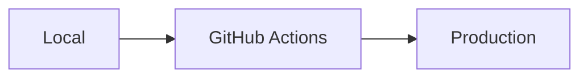
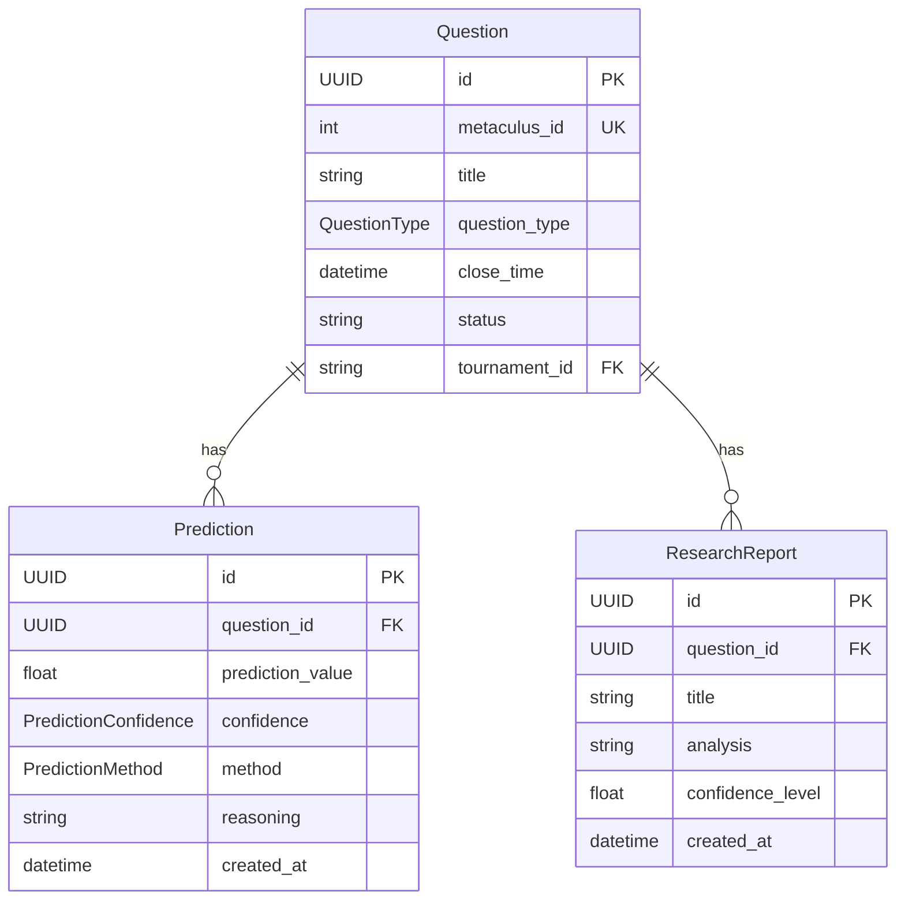

# Documentación del Proyecto

## Índice

0. [Ficha del proyecto](#0-ficha-del-proyecto)
1. [Descripción general del producto](#1-descripción-general-del-producto)
2. [Arquitectura del sistema](#2-arquitectura-del-sistema)
3. [Modelo de datos](#3-modelo-de-datos)
4. [Especificación de la API](#4-especificación-de-la-api)
5. [Historias de usuario](#5-historias-de-usuario)
6. [Tickets de trabajo](#6-tickets-de-trabajo)
7. [Pull requests](#7-pull-requests)

---

## 0. Ficha del proyecto

### **0.1. Tu nombre completo:**

Gonzalo Germán González Castillo

### **0.2. Nombre del proyecto:**

Metaculus Forecasting Bot HA - Tournament Edition

### **0.3. Descripción breve del proyecto:**

Bot de IA para pronósticos automatizados en torneos de Metaculus con múltiples agentes, investigación automática y gestión de presupuesto.

### **0.4. URL del proyecto:**

<https://github.com/herman-aukera/metac-bot-ha>

### 0.5. URL o archivo comprimido del repositorio

<https://github.com/herman-aukera/metac-bot-ha> (repositorio público)

---

## 1. Descripción general del producto

### **1.1. Objetivo:**

Automatizar la participación en torneos de Metaculus generando predicciones precisas mediante IA. Soluciona la necesidad de participación manual constante en competiciones de forecasting, dirigido a investigadores y participantes de torneos de predicción.

### **1.2. Características y funcionalidades principales:**

- **Multi-Agent System**: Chain of Thought, Tree of Thought, ReAct y Ensemble
- **Investigación automática**: AskNews (primario) con fallbacks a Perplexity, Exa y OpenRouter (conmutación automática)
- **Optimización de costos**: Uso del Metaculus Proxy (créditos gratuitos) con fallback a OpenRouter
- **Recuperación de errores**: Retries con backoff exponencial, circuit breakers y degradación suave
- **Monitoreo**: Logging y métricas de rendimiento; seguimiento de uso de cuotas/proxy

### **1.3. Diseño y experiencia de usuario:**

El bot opera principalmente por CLI y API programática. La interfaz principal es:

```bash
# Ejecutar torneo (entrada CLI real)
python3 cli/run_forecast.py --tournament 32813 --max-questions 10

# Validar sistema
python3 scripts/validate_tournament_integration.py
```

No hay interfaz gráfica - es un sistema backend automatizado.

### **1.4. Instrucciones de instalación:**

```bash
# 1. Clonar repositorio
git clone https://github.com/herman-aukera/metac-bot-ha.git
cd metac-bot-ha

# 2. Instalar dependencias
pip install -r requirements.txt

# 3. Configurar variables de entorno
cp .env.example .env  # o .env.template
# Editar .env con tus API keys y ajustes

# 4. Ejecutar (CLI)
python3 cli/run_forecast.py --tournament 32813 --dry-run
```

Requisitos mínimos verificados: Python 3.11+ y credenciales para AskNews y OpenRouter. Variables relevantes (según docs del proyecto): METACULUS_TOKEN, OPENROUTER_API_KEY, ASKNEWS_CLIENT_ID, ASKNEWS_SECRET, AIB_TOURNAMENT_ID, DRY_RUN, PUBLISH_REPORTS, ENABLE_PROXY_CREDITS.

---

## 2. Arquitectura del Sistema

### **2.1. Diagrama de arquitectura:**

```mermaid
graph TB
    CLI[cli/run_forecast.py] --> ORCH[application/tournament_orchestrator.py]
    ORCH --> AGENTS[agents/*]
    AGENTS --> REACT[agents/react_agent.py]
    AGENTS --> TOT[agents/tot_agent.py]
    AGENTS --> ENS[agents/ensemble_agent_simple.py]

    ORCH --> RESEARCH[domain/services/research_service.py]
    RESEARCH --> ASK[infrastructure/external_apis/tournament_asknews_client.py]
    RESEARCH --> SEARCH[search fallbacks (Perplexity/Exa/OpenRouter)]

    ORCH --> LLM[infrastructure/external_apis/llm_client.py]
    LLM --> PROXY[infrastructure/external_apis/metaculus_proxy_client.py]
```

**Patrón**: Arquitectura por capas con Domain-Driven Design y Clean Architecture. Elección por separación de responsabilidades, escalabilidad y testabilidad. Beneficios: mantenibilidad, resiliencia y observabilidad; sacrificio: mayor complejidad inicial.

### **2.2. Descripción de componentes principales (con ubicación):**

- **Tournament Orchestrator**: Coordina ejecución del torneo (asyncio) — `application/tournament_orchestrator.py`.
- **Servicios de aplicación**: Enrutamiento/uso de casos — `application/dispatcher.py`, `application/forecast_service.py`, `application/ingestion_service.py`.
- **Sistema multi-agente**: ReAct, ToT, Ensemble (Strategy/aggregation) — `agents/react_agent.py`, `agents/tot_agent.py`, `agents/ensemble_agent_simple.py`.
- **Capa de investigación**: AskNews como primario con fallbacks — `domain/services/research_service.py`, `infrastructure/external_apis/tournament_asknews_client.py`.
- **Capa LLM/Providers**: Proxy de Metaculus y OpenRouter — `infrastructure/external_apis/metaculus_proxy_client.py`, `infrastructure/external_apis/llm_client.py`.
- **Resiliencia**: Retries/backoff y circuit breakers — `infrastructure/reliability/api_manager.py`.
- **Monitoreo**: Métricas y logging — `infrastructure/monitoring/metrics_service.py`, `infrastructure/monitoring/integrated_monitoring_service.py`, `infrastructure/logging/reasoning_logger.py`.

### **2.3. Descripción de alto nivel del proyecto y estructura de ficheros**

```text
cli/
  └─ run_forecast.py               # Entrada CLI principal
application/
  ├─ dispatcher.py                 # Orquestación de casos de uso
  ├─ forecast_service.py           # Servicio de forecasting programático
  ├─ ingestion_service.py          # Ingesta
  └─ tournament_orchestrator.py    # Orquestador de torneo (asyncio)
domain/
  ├─ entities/                     # Modelos: question.py, prediction.py, research_report.py
  ├─ services/                     # Lógica de dominio: ensemble_service.py, forecasting_service.py, validation_stage_service.py, research_service.py
  └─ value_objects/                # Tipos de valor: probability.py, confidence.py, etc.
infrastructure/
  ├─ external_apis/                # Adaptadores: metaculus_client.py, metaculus_proxy_client.py, tournament_asknews_client.py, llm_client.py, search_client.py
  ├─ monitoring/                   # Métricas/alertas: metrics_service.py, integrated_monitoring_service.py
  ├─ logging/                      # Logging estructurado: reasoning_logger.py
  ├─ reliability/                  # Resiliencia: api_manager.py
  └─ config/                       # Configuración/costos: settings.py, budget_manager.py, cost_monitor.py
agents/
  ├─ react_agent.py
  ├─ tot_agent.py
  ├─ ensemble_agent_simple.py
  └─ tree_of_thought_agent.py
docs/
  └─ *.md                          # Documentación del proyecto
```

Sigue Domain-Driven Design con Clean Architecture (entidades/servicios en `domain`, casos de uso en `application`, adaptadores en `infrastructure`, estrategias en `agents`).

### **2.4. Infraestructura y despliegue**



Despliegue: GitHub Actions → testing automático → despliegue opcional vía Docker.

Detalles verificados:

- Workflows: `.github/workflows/test_bot.yaml` (tests) y `run_bot_on_tournament.yaml` (ejecución de torneo)
- Dockerfile y docker-compose.* disponibles para despliegue contenedorizado
- Variables sensibles gestionadas por entorno/secrets

Referencias:

- Arquitectura del sistema: [PROJECT_ARCHITECTURE.md](https://github.com/herman-aukera/metac-bot-ha/blob/main/docs/PROJECT_ARCHITECTURE.md)
- Guía de integración de torneo: [TOURNAMENT_INTEGRATION_GUIDE.md](https://github.com/herman-aukera/metac-bot-ha/blob/main/docs/TOURNAMENT_INTEGRATION_GUIDE.md)
- Guía de implementación: [IMPLEMENTATION_GUIDE.md](https://github.com/herman-aukera/metac-bot-ha/blob/main/docs/IMPLEMENTATION_GUIDE.md)

### **2.5. Seguridad**

- Variables de entorno para API keys y secretos (no exponer `.env`).
- Validación/sanitización: `infrastructure/external_apis/submission_validator.py`, `infrastructure/logging/reasoning_logger.py` (evitar fugas de datos sensibles).
- Resiliencia y límites: `infrastructure/reliability/api_manager.py` (retries, circuit breakers, rate limiting).
- Principio de mínimos privilegios en despliegue (secrets en GitHub Actions/host).

### **2.6. Tests**

- Framework: pytest.
- Unitarios por agentes y servicios (carpetas `agents` y `domain/services`).
- Integración/validación: `scripts/validate_tournament_integration.py` y demos en `examples/*` (p. ej., `multi_stage_validation_pipeline_demo.py`).
- Configuración/proveedores: validación de OpenRouter/AskNews (p. ej., `infrastructure/config/enhanced_llm_config.py`, `infrastructure/config/openrouter_startup_validator.py`).
- Cobertura (si existe): `htmlcov/index.html`.

---

## 3. Modelo de Datos

### **3.1. Diagrama del modelo de datos:**



### **3.2. Descripción de entidades principales:**

**Question**: Pregunta de Metaculus

- id: UUID, PK
- metaculus_id: int, UK, no nulo
- title: string, no nulo
- question_type: enum (BINARY, NUMERIC, MULTIPLE_CHOICE)
- close_time: datetime, no nulo
- status: enum (OPEN, CLOSED, RESOLVED), no nulo

**Prediction**: Predicción generada

- id: UUID, PK
- question_id: UUID, FK a Question
- prediction_value: float (0-1 para binarias)
- confidence: enum (LOW, MEDIUM, HIGH)
- method: enum (CHAIN_OF_THOUGHT, ENSEMBLE, etc.)
  - reasoning: string, explicación usada por el agente

**ResearchReport**: Investigación realizada

- id: UUID, PK
- question_id: UUID, FK a Question

- title: string, no nulo
- analysis: string, análisis detallado
- confidence_level: float (0-1)
  - created_at: datetime

---

## 4. Especificación de la API

El backend es principalmente CLI y API programática (Python). Opcionalmente, cuando se ejecuta como servicio, expone endpoints de salud/observabilidad. A continuación, se documentan 3 endpoints principales de servicio en formato OpenAPI.

```yaml
openapi: 3.0.3
info:
  title: Metaculus Bot HA - Service Health API
  version: 1.0.0
paths:
  /health:
    get:
      summary: Health check básico
      responses:
        '200':
          description: Servicio operativo
          content:
            application/json:
              schema:
                type: object
                properties:
                  status:
                    type: string
                    example: ok
  /ready:
    get:
      summary: Readiness probe
      responses:
        '200':
          description: Componentes listos
  /metrics:
    get:
      summary: Métricas en formato Prometheus
      responses:
        '200':
          description: Exposición de métricas
          content:
            text/plain:
              schema:
                type: string
```

Notas:

- El forecasting se expone vía CLI y API programática (servicios en `application/forecast_service.py` y orquestación en `application/tournament_orchestrator.py`), no como endpoint HTTP por defecto.
- Esquemas de respuesta programática incluyen `prediction`, `confidence` y `reasoning` (ver `docs/API_DOCUMENTATION.md`).

### 4.1. API programática (ejemplo mínimo)

Ejemplo orientativo para invocar el bot desde Python sin pasar por la CLI. Ajusta los imports y firmas a lo definido en `application/forecast_service.py` y `application/tournament_orchestrator.py` de tu repositorio.

```python
# ejemplo 1: forecast de una pregunta (programático)
from os import getenv

# (opcional) cargar variables desde .env
try:
  from dotenv import load_dotenv  # pip install python-dotenv
  load_dotenv()
except Exception:
  pass

# Ajusta el import a tu implementación real
try:
  from application.forecast_service import ForecastService  # type: ignore
except ImportError as e:
  raise SystemExit("Ajusta el import según application/forecast_service.py") from e

token = getenv("METACULUS_TOKEN")
if not token:
  raise SystemExit("Configura METACULUS_TOKEN en el entorno (.env o secrets)")

# Construcción flexible según tu implementación
service = (
  ForecastService.from_env()  # si existe un constructor de conveniencia
  if hasattr(ForecastService, "from_env")
  else ForecastService(token=token)  # o pasa la config necesaria
)

# Firma orientativa: revisa la definición real para los parámetros soportados
res = service.forecast_question(metaculus_id=12345, dry_run=True)  # type: ignore
print({
  "prediction": res.get("prediction"),
  "confidence": res.get("confidence"),
  "reasoning": (res.get("reasoning") or "")[:200],  # muestra un extracto
})

# ejemplo 2: ejecutar un torneo (programático)
try:
  from application.tournament_orchestrator import TournamentOrchestrator  # type: ignore
except ImportError:
  TournamentOrchestrator = None

if TournamentOrchestrator:
  orch = (
    TournamentOrchestrator.from_env()
    if hasattr(TournamentOrchestrator, "from_env")
    else TournamentOrchestrator()
  )
  orch.run_tournament(tournament_id="32813", dry_run=True)  # firma orientativa
```

Notas rápidas:

- Ajusta nombres/clases a lo definido en código; consulta `application/forecast_service.py` y `application/tournament_orchestrator.py`.
- Contrato típico de salida: `prediction` (valor/objeto de probabilidad), `confidence` (nivel), `reasoning` (texto/markdown).
- Para detalles completos, revisa `docs/API_DOCUMENTATION.md`.

Referencia completa de API programática:

- API Documentation: [API_DOCUMENTATION.md](https://github.com/herman-aukera/metac-bot-ha/blob/main/docs/API_DOCUMENTATION.md)

---

## 5. Historias de Usuario

**Historia de Usuario 1**
Como participante en torneo de Metaculus, quiero que el bot genere predicciones automáticamente para poder competir sin intervención manual constante.

**Historia de Usuario 2**
Como sistema de forecasting, quiero realizar investigación automática con múltiples fuentes para generar predicciones más informadas.

**Historia de Usuario 3**
Como operador del bot, quiero gestión automática de presupuesto para evitar gastos excesivos y mantener operación dentro de límites.

---

## 6. Tickets de Trabajo

**Ticket 1 (Backend)**
Implementar sistema de recuperación ante errores para APIs externas con circuit breakers, fallbacks automáticos y retry con exponential backoff. Incluye logging detallado y métricas de disponibilidad.

**Ticket 2 (Frontend)**
Crear dashboard web para monitoreo en tiempo real con métricas de rendimiento, uso de presupuesto, estado de componentes y log viewer con filtros.

**Ticket 3 (Base de Datos)**
Optimizar esquema de base de datos con índices para consultas frecuentes, particionado de tablas grandes y vistas materializadas para agregaciones complejas.

---

## 7. Pull Requests

> PRs reales del repositorio metac-bot-ha (estado a fecha de edición):

- [#2 Bump the pip group across 1 directory with 2 updates](https://github.com/herman-aukera/metac-bot-ha/pull/2) (abierto)
- [#1 Bump the pip group across 1 directory with 5 updates](https://github.com/herman-aukera/metac-bot-ha/pull/1) (merged)

Nota: El resto de cambios principales se han realizado vía commits directos; no hay más PRs públicos en el momento de documentar.
