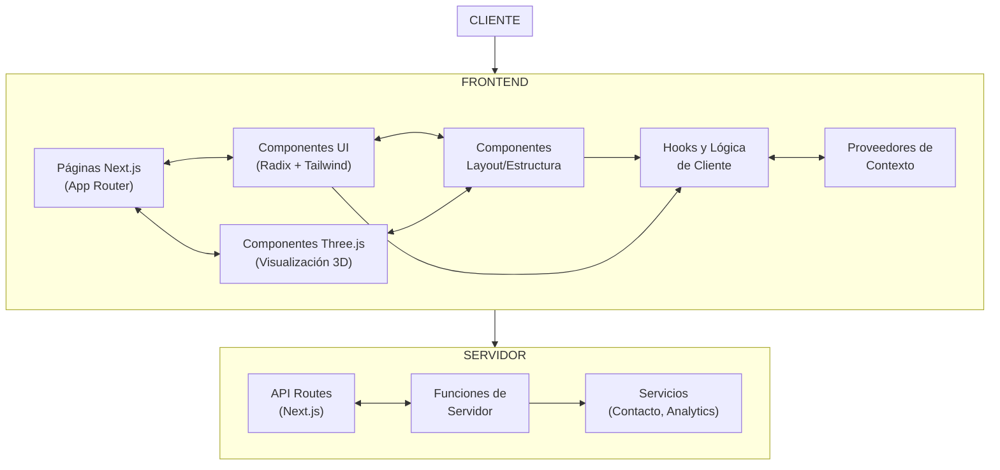

Gracias por las aclaraciones. Ahora completaré la plantilla con la información disponible:

```md
## Índice

0. [Ficha del proyecto](#0-ficha-del-proyecto)
1. [Descripción general del producto](#1-descripción-general-del-producto)
2. [Arquitectura del sistema](#2-arquitectura-del-sistema)
3. [Modelo de datos](#3-modelo-de-datos)
4. [Especificación de la API](#4-especificación-de-la-api)
5. [Historias de usuario](#5-historias-de-usuario)
6. [Tickets de trabajo](#6-tickets-de-trabajo)
7. [Pull requests](#7-pull-requests)

---

## 0. Ficha del proyecto

### **0.1. Tu nombre completo:**
Yoberty Alejandro Garcia Valera

### **0.2. Nombre del proyecto:**
Portfolio Iterativo con AI Playground e Internacionalización Dinámica

### **0.3. Descripción breve del proyecto:**
Portfolio web iterativo que evoluciona constantemente, utilizando un enfoque de desarrollo incremental que demuestra activamente las capacidades de un desarrollador de software aumentado por IA. El proyecto establece un proceso de crecimiento continuo que sirve como demostración viva de la filosofía de desarrollo iterativo, compuesto y con visión a largo plazo.

### **0.4. URL del proyecto:**
yobertyalej.com

### 0.5. URL o archivo comprimido del repositorio
github.com/YobertyAlej/finalproject-yag

---

## 1. Descripción general del producto

### **1.1. Objetivo:**
Crear un portfolio digital dinámico que evolucione constantemente, priorizando:
1. La demostración práctica de capacidades técnicas a través de experiencias interactivas con IA
2. La implementación de un proceso meta-documentado donde el propio desarrollo es parte del showcasing
3. Un crecimiento sostenible y compuesto, donde cada iteración agrega valor tangible sin sobrecarga técnica
4. La transparencia total en el proceso de desarrollo como parte del valor demostrativo
5. La capacidad de adaptación a audiencias globales mediante internacionalización impulsada por IA

El portfolio busca no solo mostrar proyectos, sino ser en sí mismo una demostración viva del enfoque de desarrollo del creador, siguiendo el principio de "show, don't tell" para profesionales de tecnología, reclutadores y potenciales clientes.

### **1.2. Características y funcionalidades principales:**

**Core Portfolio (Entregable para el Máster, Versiones 0.1.0 a 1.0.0):**
- Estructura Next.js con TypeScript y App Router
- Sistema de estilos con Tailwind CSS
- Página de inicio minimalista con presentación profesional clara
- Navegación intuitiva entre secciones principales
- Modo claro/oscuro con detección automática de preferencias
- Adaptabilidad completa a dispositivos móviles
- Integración básica de Three.js para experiencias visuales
- Showcase de proyectos con visualizaciones interactivas
- Información de contacto integrada
- Transiciones y microinteracciones refinadas
- Sistema de diseño cohesivo con componentes reutilizables
- Indicadores de versión y estado de desarrollo mostrando transparencia del proceso
- Optimizaciones de rendimiento y accesibilidad (WCAG 2.1 AA)

**Características Planificadas para Futuras Versiones (Post-Máster):**
- AI Playground con demostraciones de IA integradas
- Blog Técnico para compartir conocimientos y meta-documentación del desarrollo
- Internacionalización dinámica con LLMs para traducción automática bajo demanda

### **1.3. Diseño y experiencia de usuario:**
[Actualmente no existen mockups disponibles]

El diseño sigue estos principios:
- **Minimalismo funcional**: Cada elemento tiene un propósito claro
- **Jerarquía visual**: Guía al usuario a través del contenido de forma intuitiva
- **Consistencia**: Sistema de diseño coherente en todas las secciones
- **Accesibilidad**: Cumplimiento WCAG 2.1 AA en cada iteración
- **Transparencia de proceso**: El diseño comunica claramente el estado de desarrollo

**User Journey previsto (Versión 1.0.0):**
Llegada a homepage → Exploración visual → Navegación a sección de proyectos → Interacción con visualizaciones → Contacto

### **1.4. Instrucciones de instalación:**
Para instalar y ejecutar el proyecto localmente:

1. **Requisitos previos:**
   - Node.js >=18.0.0
   - PNPM >=8.0.0

2. **Clonar el repositorio:**
   ```bash
   git clone [URL_repositorio]
   cd yobertyalej
   ```

3. **Instalar dependencias:**
   ```bash
   pnpm install
   ```

4. **Ejecutar en modo desarrollo:**
   ```bash
   pnpm dev
   ```
   Esto iniciará el servidor de desarrollo con Turbopack en http://localhost:3000

5. **Compilar para producción:**
   ```bash
   pnpm build
   ```

6. **Iniciar en modo producción:**
   ```bash
   pnpm start
   ```

7. **Verificar tipos y linting:**
   ```bash
   pnpm type-check
   pnpm lint
   ```

---

## 2. Arquitectura del Sistema

### **2.1. Diagrama de arquitectura:**



El portfolio implementa una arquitectura basada en componentes que aprovecha el modelo de App Router de Next.js 14. Esta arquitectura está especialmente optimizada para aplicaciones web modernas con experiencias interactivas y visualizaciones 3D.

**Patrón arquitectónico**: Sigue un patrón de componentes con clara separación entre la capa de presentación (frontend) y servicios (servidor), potenciando el renderizado server-side para optimizar rendimiento y SEO.

**Justificación**: Esta arquitectura fue seleccionada por su alineación perfecta con el enfoque de desarrollo iterativo del portfolio, permitiendo implementar funcionalidades de forma incremental mientras se mantiene una base sólida. Maximiza los beneficios del stack tecnológico elegido (Next.js, React, Three.js) mientras facilita la clara separación de responsabilidades.

**Beneficios principales**:
- Rendimiento optimizado mediante Server Components que reducen el JavaScript enviado al cliente
- Desarrollo modular que facilita las iteraciones incrementales (versiones 0.1.0 a 1.0.0)
- Mejora del SEO gracias al renderizado en servidor
- Experiencia de desarrollo intuitiva con clara separación de responsabilidades

**Sacrificios/consideraciones**:
- Acoplamiento al ecosistema Next.js, creando cierta dependencia del framework
- Complejidad inicial al trabajar con el modelo mental de App Router y la separación de componentes cliente/servidor
- Mayor uso de recursos de servidor comparado con aplicaciones puramente client-side

### **2.2. Descripción de componentes principales:**

1. **Páginas Next.js (App Router)**
   - **Tecnología**: Next.js 14+ con App Router
   - **Propósito**: Implementar las rutas principales de la aplicación (/home, /about, /projects, /contact)
   - **Características**: Aprovecha los Server Components y Client Components de React para optimizar el renderizado inicial
   - **Interacciones**: Se comunica con los componentes UI y visualizaciones Three.js

2. **Componentes UI**
   - **Tecnología**: React 18+, Radix UI, Tailwind CSS
   - **Propósito**: Proporcionar una biblioteca de elementos de interfaz consistentes y accesibles
   - **Características**: Implementación del modo claro/oscuro, animaciones con Framer Motion, componentes interactivos
   - **Interacciones**: Utilizados por las páginas y componentes de layout

3. **Componentes Three.js**
   - **Tecnología**: Three.js, React Three Fiber
   - **Propósito**: Gestionar las visualizaciones 3D interactivas que presentan los proyectos
   - **Características**: Escenas optimizadas, gestión de modelos 3D, interacciones con el mouse/touch
   - **Interacciones**: Integración con la UI mediante componentes contenedores

4. **Componentes de Layout**
   - **Tecnología**: React 18+, Tailwind CSS
   - **Propósito**: Estructurar la aplicación y gestionar la disposición de elementos
   - **Características**: Navegación, cabeceras, pies de página, contenedores principales
   - **Interacciones**: Consumen hooks y servicios para funcionalidades como cambio de tema

5. **Hooks y Lógica de Cliente**
   - **Tecnología**: React Hooks, TypeScript
   - **Propósito**: Encapsular lógica reutilizable para componentes cliente
   - **Características**: Gestión de estado local, lógica de interacción, validaciones
   - **Interacciones**: Utilizados por componentes cliente para compartir comportamientos

6. **Proveedores de Contexto**
   - **Tecnología**: React Context API
   - **Propósito**: Gestionar el estado global de la aplicación
   - **Características**: Tema actual, preferencias de usuario, configuraciones compartidas
   - **Interacciones**: Consumidos por componentes que requieren acceso al estado global

7. **API Routes**
   - **Tecnología**: Next.js API Routes
   - **Propósito**: Implementar endpoints serverless para operaciones de servidor
   - **Características**: Manejo de formularios de contacto, analítica, configuraciones dinámicas
   - **Interacciones**: Invocadas desde componentes cliente mediante fetch/axios

8. **Servicios**
   - **Tecnología**: JavaScript/TypeScript modular
   - **Propósito**: Encapsular lógica de interacción con sistemas externos
   - **Características**: Envío de correos, registro de analytics, obtención de datos
   - **Interacciones**: Consumidos por API Routes y funciones de servidor

### **2.3. Descripción de alto nivel del proyecto y estructura de ficheros**

El portfolio sigue una estructura de carpetas organizada que refleja la arquitectura basada en componentes, facilitando el desarrollo iterativo y la clara separación de responsabilidades:

```
/
├── app/                      # Next.js App Router (páginas y rutas)
│   ├── page.tsx              # Página principal (Home)
│   ├── about/                # Sección "Acerca de"
│   │   └── page.tsx          # Página Acerca de
│   ├── projects/             # Sección de proyectos
│   │   ├── page.tsx          # Listado de proyectos
│   │   └── [slug]/           # Página de proyecto individual
│   │       └── page.tsx
│   ├── contact/              # Sección de contacto
│   │   └── page.tsx          # Página de contacto
│   ├── api/                  # API Routes (Next.js)
│   │   ├── contact/          # Endpoint para formulario de contacto
│   │   │   └── route.ts
│   │   └── analytics/        # Endpoint para analytics
│   │       └── route.ts
│   └── layout.tsx            # Layout principal de la aplicación
│
├── components/               # Componentes React reutilizables
│   ├── ui/                   # Componentes de interfaz de usuario
│   │   ├── button.tsx        # Botones y controles
│   │   ├── card.tsx          # Tarjetas y contenedores
│   │   ├── navigation.tsx    # Componentes de navegación
│   │   └── theme-toggle.tsx  # Selector de tema claro/oscuro
│   │
│   ├── three/                # Componentes de visualización 3D
│   │   ├── scene.tsx         # Escena base Three.js
│   │   ├── project-viewer.tsx # Visor de proyectos 3D
│   │   ├── models/           # Componentes de modelos específicos
│   │   └── effects/          # Efectos visuales y shaders
│   │
│   └── layout/               # Componentes estructurales
│       ├── header.tsx        # Cabecera de la aplicación
│       ├── footer.tsx        # Pie de página
│       └── container.tsx     # Contenedores y layouts
│
├── hooks/                    # Custom React Hooks
│   ├── use-theme.ts          # Hook para gestión de tema
│   ├── use-scroll.ts         # Hook para efectos de scroll
│   └── use-form.ts           # Hook para gestión de formularios
│
├── context/                  # Proveedores de contexto
│   ├── theme-context.tsx     # Contexto para tema claro/oscuro
│   └── app-context.tsx       # Contexto global de la aplicación
│
├── lib/                      # Utilidades y helpers
│   ├── three/                # Utilidades para Three.js
│   │   ├── loaders.ts        # Cargadores de modelos y texturas
│   │   └── helpers.ts        # Funciones auxiliares Three.js
│   │
│   └── utils/                # Utilidades generales
│       ├── animations.ts     # Helpers para animaciones
│       └── validation.ts     # Validaciones de formularios
│
├── services/                 # Servicios para interacciones externas
│   ├── email-service.ts      # Servicio de envío de emails
│   └── analytics-service.ts  # Servicio de analytics
│
├── public/                   # Assets estáticos
│   ├── models/               # Modelos 3D en formato glTF/GLB
│   ├── images/               # Imágenes estáticas
│   └── fonts/                # Fuentes web
│
├── styles/                   # Configuración de estilos
│   ├── globals.css           # Estilos globales
│   └── theme.ts              # Configuración de temas
│
├── types/                    # Definiciones de TypeScript
│   └── index.ts              # Tipos y interfaces compartidos
│
├── next.config.js            # Configuración de Next.js
├── tailwind.config.js        # Configuración de Tailwind CSS
├── tsconfig.json             # Configuración de TypeScript
└── package.json              # Dependencias y scripts
```

Esta estructura proporciona varios beneficios clave:

1. **Organización intuitiva**: La estructura de carpetas refleja la arquitectura de la aplicación, facilitando la localización de código.

2. **Desarrollo paralelo**: Múltiples desarrolladores pueden trabajar simultáneamente en diferentes componentes sin conflictos.

3. **Escalabilidad**: Preparada para las futuras expansiones (AI Playground, internacionalización) en versiones post-1.0.0.

4. **Mantenibilidad**: Clara separación de responsabilidades que facilita las actualizaciones y correcciones.

5. **Patrón Feature-First**: Los componentes, lógica y estilos relacionados permanecen cercanos, siguiendo el principio de cohesión.

La estructura sigue las mejores prácticas recomendadas para aplicaciones Next.js modernas, aprovechando al máximo el App Router mientras mantiene una organización clara que facilita el desarrollo iterativo del portfolio.


### **2.4. Infraestructura y despliegue**

El proyecto utilizará GitHub Actions para implementar un flujo de despliegue continuo. El proceso general será:

1. Desarrollo en ramas de características (`feature/YA-número/descripcion`)
2. Pull Request a la rama principal con revisión de código
3. Tras aprobación, fusión a la rama `main`
4. GitHub Actions ejecutará automáticamente el pipeline de CI/CD:
   - Verificación de tipos y linting
   - Ejecución de tests (unitarios, integración, e2e)
   - Construcción del proyecto
   - Despliegue a producción

El detalle específico de la infraestructura está aún por definir en fases posteriores del proyecto.

### **2.5. Seguridad**

El proyecto implementará las siguientes prácticas de seguridad:

1. **Content Security Policy (CSP)**: Para mitigar ataques XSS limitando los recursos que el navegador puede cargar.

2. **Sanitización de entradas**: Validación y limpieza de todas las entradas de usuario para prevenir inyecciones.

3. **Headers de seguridad**: Configuración de headers HTTP para proteger contra diversas vulnerabilidades web.

4. **HTTPS obligatorio**: Forzado de conexiones seguras para toda comunicación.

5. **Protección contra CSRF**: Implementación de tokens anti-CSRF para formularios.

La implementación detallada de estas medidas se desarrollará durante la implementación del proyecto.

### **2.6. Tests**

El proyecto incluirá tres niveles de pruebas:

1. **Tests unitarios**: Para verificar componentes y funciones individuales.

2. **Tests de integración**: Para probar la interacción entre múltiples componentes.

3. **Tests end-to-end (e2e)**: Para validar flujos completos desde la perspectiva del usuario.

La implementación específica de estos tests se desarrollará durante fases posteriores del proyecto.

---

## 3. Modelo de Datos

### **3.1. Diagrama del modelo de datos:**
[No definido actualmente en esta fase del proyecto]

### **3.2. Descripción de entidades principales:**
[No definido actualmente en esta fase del proyecto]

---

## 4. Especificación de la API

[No definido actualmente en esta fase del proyecto]

---

## 5. Historias de Usuario


### HISTORIAS DE USUARIO PARA LA VERSIÓN 0.1.0 (MVP FUNDACIONAL)

#### 1. Estructura Base del Portfolio

**COMO** desarrollador y propietario del portfolio,  
**QUIERO** implementar la estructura base de Next.js con TypeScript y componentes UI core con Tailwind,  
**PARA** establecer una base técnica sólida que permita el desarrollo iterativo.

**Criterios de aceptación:**
1. **DADO QUE** inicio el desarrollo,  
   **CUANDO** configure el proyecto,  
   **ENTONCES** debe usar Next.js con App Router y TypeScript correctamente configurado.
2. **DADO QUE** implemento la estructura de carpetas,  
   **CUANDO** añada nuevos archivos,  
   **ENTONCES** deben seguir la estructura definida en el PRD (app/, components/, lib/, etc.).
3. **DADO QUE** desarrollo componentes UI,  
   **CUANDO** los implemente,  
   **ENTONCES** deben usar Tailwind CSS con un sistema coherente de variables para temas.
4. **DADO QUE** la estructura está implementada,  
   **CUANDO** intente agregar una nueva sección en el futuro,  
   **ENTONCES** debe ser posible sin cambios estructurales importantes.

**Estimación:** M

#### 2. Presentación Profesional

**COMO** profesional buscando oportunidades laborales,  
**QUIERO** una página de inicio con una presentación clara y concisa de mi perfil profesional,  
**PARA** causar una primera impresión positiva y comunicar eficazmente mis capacidades.

**Criterios de aceptación:**
1. **DADO QUE** un reclutador visita mi portfolio,  
   **CUANDO** llegue a la página de inicio,  
   **ENTONCES** debe poder comprender mi perfil profesional y habilidades principales en menos de 5 segundos.
2. **DADO QUE** un visitante desea conocer más sobre mí,  
   **CUANDO** navegue a la sección "Acerca de",  
   **ENTONCES** debe encontrar información detallada sobre mi experiencia, especialización y enfoque profesional.
3. **DADO QUE** un potencial cliente o empleador busca validar mis capacidades,  
   **CUANDO** revise mi presentación,  
   **ENTONCES** debe percibir profesionalismo y coherencia en mi comunicación.
4. **DADO QUE** mi perfil profesional es multifacético,  
   **CUANDO** un visitante explore la página de inicio,  
   **ENTONCES** la presentación debe destacar mis principales áreas de experiencia de forma balanceada.

**Estimación:** S

#### 3. Sistema de Navegación Intuitivo

**COMO** visitante del portfolio,  
**QUIERO** un sistema de navegación claro y accesible,  
**PARA** encontrar fácilmente la información que me interesa sin frustración.

**Criterios de aceptación:**
1. **DADO QUE** estoy en cualquier página del portfolio,  
   **CUANDO** busque cómo navegar a otra sección,  
   **ENTONCES** debo ver un menú de navegación visible y fácil de usar.
2. **DADO QUE** estoy en una sección específica,  
   **CUANDO** quiera entender mi ubicación en el sitio,  
   **ENTONCES** debo tener indicadores visuales claros de mi posición actual.
3. **DADO QUE** uso un dispositivo móvil,  
   **CUANDO** acceda al menú de navegación,  
   **ENTONCES** debe ser accesible y usable en pantallas pequeñas.
4. **DADO QUE** navego por el sitio,  
   **CUANDO** me desplace entre secciones,  
   **ENTONCES** la transición debe ser fluida y mantener mi contexto.

**Estimación:** S

#### 4. Modo Claro/Oscuro

**COMO** usuario con preferencias visuales específicas,  
**QUIERO** poder cambiar entre modo claro y oscuro,  
**PARA** adaptar la experiencia visual según mis necesidades o condiciones de iluminación.

**Criterios de aceptación:**
1. **DADO QUE** visito el portfolio,  
   **CUANDO** busque personalizar mi experiencia visual,  
   **ENTONCES** debo encontrar un selector de tema claramente visible.
2. **DADO QUE** cambio al modo oscuro/claro,  
   **CUANDO** la página se actualice,  
   **ENTONCES** todos los elementos deben mantener un contraste adecuado y ser legibles.
3. **DADO QUE** he seleccionado una preferencia de tema,  
   **CUANDO** regrese al sitio más tarde,  
   **ENTONCES** mi preferencia debe mantenerse entre sesiones.
4. **DADO QUE** uso un sistema operativo con preferencia de tema,  
   **CUANDO** visite el sitio por primera vez,  
   **ENTONCES** el tema inicial debe coincidir con mi preferencia del sistema.

**Estimación:** S

#### 5. Diseño Completamente Responsive

**COMO** usuario de diversos dispositivos,  
**QUIERO** que el portfolio se adapte correctamente a cualquier tamaño de pantalla,  
**PARA** acceder a toda la información sin problemas de visualización o interacción.

**Criterios de aceptación:**
1. **DADO QUE** accedo al portfolio desde un smartphone,  
   **CUANDO** la página cargue,  
   **ENTONCES** todo el contenido debe ser legible sin necesidad de zoom horizontal.
2. **DADO QUE** uso una tablet,  
   **CUANDO** interactúe con elementos clickeables,  
   **ENTONCES** estos deben tener un tamaño y espaciado adecuados para toque.
3. **DADO QUE** roto mi dispositivo,  
   **CUANDO** cambie entre orientación horizontal y vertical,  
   **ENTONCES** el layout debe adaptarse apropiadamente sin pérdida de contenido.
4. **DADO QUE** uso un monitor de alta resolución,  
   **CUANDO** visualice el portfolio,  
   **ENTONCES** el contenido debe aprovechar el espacio adicional sin verse desproporcionado.

**Estimación:** M

#### 6. Sistema de Analíticas

**COMO** propietario del portfolio,  
**QUIERO** implementar un sistema básico de analíticas,  
**PARA** recopilar datos sobre el comportamiento de los visitantes que informen mejoras futuras.

**Criterios de aceptación:**
1. **DADO QUE** un visitante explora el portfolio,  
   **CUANDO** interactúe con secciones clave,  
   **ENTONCES** estos eventos deben ser registrados correctamente.
2. **DADO QUE** analizo el comportamiento de los usuarios,  
   **CUANDO** revise los datos,  
   **ENTONCES** debo poder identificar métricas clave como tiempo en sitio, páginas visitadas y tasas de rebote.
3. **DADO QUE** recopilo datos de usuario,  
   **CUANDO** implemente el sistema,  
   **ENTONCES** debe cumplir con requisitos de privacidad (GDPR) incluyendo consentimiento cuando sea necesario.
4. **DADO QUE** tomo decisiones basadas en datos,  
   **CUANDO** planifique futuras iteraciones,  
   **ENTONCES** las métricas deben proporcionar insights accionables sobre la experiencia del usuario.

**Estimación:** S

#### 7. Indicadores de Desarrollo Iterativo

**COMO** defensor del desarrollo iterativo,  
**QUIERO** mostrar claramente la versión actual y el roadmap del portfolio,  
**PARA** demostrar transparentemente mi enfoque de desarrollo y filosofía de trabajo.

**Criterios de aceptación:**
1. **DADO QUE** un visitante explora el portfolio,  
   **CUANDO** busque información sobre su desarrollo,  
   **ENTONCES** debe poder identificar fácilmente la versión actual (0.1.0 MVP Fundacional).
2. **DADO QUE** quiero comunicar mi enfoque iterativo,  
   **CUANDO** un visitante revise el sitio,  
   **ENTONCES** debe encontrar referencias visuales que indiquen el estado de desarrollo y próximas iteraciones.
3. **DADO QUE** implemento nuevas características,  
   **CUANDO** actualice el portfolio,  
   **ENTONCES** el sistema de versiones debe actualizarse coherentemente.
4. **DADO QUE** un visitante se interesa en mi metodología,  
   **CUANDO** explore el portfolio,  
   **ENTONCES** debe poder comprender el enfoque iterativo a través de la presentación visual y textual.

**Estimación:** S

#### 8. Información de Contacto Integrada

**COMO** visitante interesado en los servicios del desarrollador,  
**QUIERO** encontrar fácilmente información de contacto,  
**PARA** poder comunicarme sin barreras cuando decida hacerlo.

**Criterios de aceptación:**
1. **DADO QUE** estoy interesado en contactar al desarrollador,  
   **CUANDO** busque información de contacto,  
   **ENTONCES** debe ser fácilmente accesible desde cualquier página.
2. **DADO QUE** quiero elegir mi método de contacto preferido,  
   **CUANDO** revise las opciones,  
   **ENTONCES** debo encontrar múltiples canales como email, redes profesionales o formulario de contacto.
3. **DADO QUE** decido utilizar el formulario de contacto,  
   **CUANDO** lo complete y envíe,  
   **ENTONCES** debo recibir confirmación de recepción.
4. **DADO QUE** valoro mi privacidad,  
   **CUANDO** proporcione mis datos de contacto,  
   **ENTONCES** debe ser claro cómo se utilizarán y protegerán estos datos.

**Estimación:** S

### HISTORIAS DE USUARIO PARA LA VERSIÓN 0.2.0 (SHOWCASE TÉCNICO BÁSICO)

#### 1. Galería Interactiva con Three.js

**COMO** visitante interesado en las capacidades técnicas del desarrollador,  
**QUIERO** interactuar con visualizaciones 3D de proyectos,  
**PARA** experimentar de primera mano sus habilidades técnicas y creativas.

**Criterios de aceptación:**
1. **DADO QUE** estoy visitando la sección de proyectos,  
   **CUANDO** cargue la galería,  
   **ENTONCES** debo ver elementos 3D renderizados con Three.js sin errores ni retrasos significativos.
2. **DADO QUE** quiero explorar un proyecto específico,  
   **CUANDO** interactúe con su visualización 3D,  
   **ENTONCES** debe responder intuitivamente a mis acciones (rotación, zoom, selección).
3. **DADO QUE** uso diferentes dispositivos,  
   **CUANDO** acceda a la galería desde móvil o escritorio,  
   **ENTONCES** la experiencia debe adaptarse apropiadamente a cada plataforma.
4. **DADO QUE** me interesa el contexto técnico,  
   **CUANDO** explore una visualización,  
   **ENTONCES** debo tener acceso a información sobre las tecnologías utilizadas.

**Estimación:** M

#### 2. Sistema de Contacto Eficiente

**COMO** potencial cliente o empleador,  
**QUIERO** un método directo y confiable para contactar al desarrollador,  
**PARA** iniciar una comunicación profesional sobre posibles colaboraciones.

**Criterios de aceptación:**
1. **DADO QUE** estoy interesado en los servicios del desarrollador,  
   **CUANDO** busque opciones de contacto,  
   **ENTONCES** debo encontrar un formulario claramente accesible desde cualquier sección.
2. **DADO QUE** completo el formulario de contacto,  
   **CUANDO** lo envíe correctamente,  
   **ENTONCES** debo recibir una confirmación inmediata y clara de la recepción.
3. **DADO QUE** tengo preferencias de comunicación,  
   **CUANDO** revise las opciones de contacto,  
   **ENTONCES** debo encontrar alternativas como email directo y enlaces a redes profesionales.
4. **DADO QUE** me preocupa la privacidad de mis datos,  
   **CUANDO** utilice el sistema de contacto,  
   **ENTONCES** debe ser transparente sobre cómo se procesará mi información.

**Estimación:** S

#### 3. Showcase de Primeros Proyectos

**COMO** evaluador de las habilidades técnicas del desarrollador,  
**QUIERO** explorar una selección de proyectos representativos,  
**PARA** comprender el alcance y calidad de su trabajo.

**Criterios de aceptación:**
1. **DADO QUE** visito la sección de proyectos,  
   **CUANDO** cargue la página,  
   **ENTONCES** debo ver una presentación clara y organizada de proyectos destacados.
2. **DADO QUE** me interesa un proyecto específico,  
   **CUANDO** seleccione su entrada,  
   **ENTONCES** debo acceder a información detallada sobre objetivos, tecnologías y resultados.
3. **DADO QUE** quiero evaluar la calidad del código,  
   **CUANDO** explore un proyecto,  
   **ENTONCES** debo encontrar enlaces al repositorio o ejemplos de código cuando corresponda.
4. **DADO QUE** busco validar capacidades específicas,  
   **CUANDO** examine el showcase,  
   **ENTONCES** los proyectos deben estar categorizados o etiquetados por tecnologías/habilidades.

**Estimación:** M

#### 4. Optimización y Rendimiento

**COMO** usuario preocupado por la experiencia,  
**QUIERO** que el portfolio se cargue y responda rápidamente,  
**PARA** poder evaluar el trabajo del desarrollador sin frustración ni demoras.

**Criterios de aceptación:**
1. **DADO QUE** accedo al portfolio por primera vez,  
   **CUANDO** la página principal cargue,  
   **ENTONCES** el tiempo de carga debe ser inferior a 3 segundos en una conexión 4G estándar.
2. **DADO QUE** navego entre secciones,  
   **CUANDO** haga clic en enlaces de navegación,  
   **ENTONCES** las transiciones deben ser fluidas y sin saltos visuales.
3. **DADO QUE** interactúo con elementos 3D,  
   **CUANDO** manipule visualizaciones,  
   **ENTONCES** la respuesta debe mantener al menos 30 FPS en dispositivos de gama media.
4. **DADO QUE** uso un dispositivo con recursos limitados,  
   **CUANDO** explore el portfolio,  
   **ENTONCES** la experiencia debe seguir siendo funcional sin saturar la CPU/GPU.

**Estimación:** M

### HISTORIAS DE USUARIO PARA LA VERSIÓN 1.0.0 (RELEASE PÚBLICO INICIAL)

#### 1. Experiencia de Usuario Pulida

**COMO** visitante del portfolio,  
**QUIERO** una experiencia visualmente coherente y profesional con interacciones refinadas,  
**PARA** formar una impresión positiva sobre la atención al detalle y habilidades del desarrollador.

**Criterios de aceptación:**
1. **DADO QUE** navego por el portfolio,  
   **CUANDO** interactúo con cualquier elemento,  
   **ENTONCES** debo experimentar transiciones y animaciones fluidas y consistentes.
2. **DADO QUE** presto atención al diseño,  
   **CUANDO** reviso diferentes secciones,  
   **ENTONCES** debo percibir un sistema de diseño coherente (espaciado, colores, tipografía).
3. **DADO QUE** interactúo con elementos interactivos,  
   **CUANDO** hago hover, click o gestos táctiles,  
   **ENTONCES** debo recibir feedback visual apropiado y consistente.
4. **DADO QUE** valoro el profesionalismo,  
   **CUANDO** examine el contenido,  
   **ENTONCES** no debo encontrar errores tipográficos, inconsistencias visuales o enlaces rotos.

**Estimación:** L

#### 2. Proyectos Destacados Inmersivos

**COMO** reclutador o cliente potencial,  
**QUIERO** explorar en profundidad proyectos destacados con casos de estudio detallados,  
**PARA** evaluar rigurosamente las competencias técnicas y metodológicas del desarrollador.

**Criterios de aceptación:**
1. **DADO QUE** busco proyectos de alta calidad,  
   **CUANDO** navegue a la sección de proyectos destacados,  
   **ENTONCES** debo encontrar una selección curada con presentación premium.
2. **DADO QUE** selecciono un proyecto destacado,  
   **CUANDO** acceda a su página dedicada,  
   **ENTONCES** debo ver un caso de estudio completo con problema, aproximación, solución y resultados.
3. **DADO QUE** evalúo competencias técnicas,  
   **CUANDO** explore las visualizaciones interactivas,  
   **ENTONCES** deben demostrar claramente las tecnologías y técnicas empleadas.
4. **DADO QUE** quiero entender el proceso de desarrollo,  
   **CUANDO** revise la documentación del proyecto,  
   **ENTONCES** debe incluir insights sobre desafíos enfrentados y decisiones tomadas.

**Estimación:** L

#### 3. Seguridad y Privacidad

**COMO** usuario consciente de la seguridad,  
**QUIERO** interactuar con un portfolio técnicamente seguro y transparente en el manejo de datos,  
**PARA** confiar en la profesionalidad y competencia del desarrollador en aspectos de seguridad.

**Criterios de aceptación:**
1. **DADO QUE** valoro mi privacidad,  
   **CUANDO** interactúe con cualquier formulario,  
   **ENTONCES** debe ser claro qué datos se recopilan y cómo se utilizarán.
2. **DADO QUE** me preocupa la seguridad web,  
   **CUANDO** inspeccione la implementación técnica,  
   **ENTONCES** debe incluir encabezados de seguridad adecuados y protección contra vulnerabilidades comunes.
3. **DADO QUE** uso diferentes navegadores,  
   **CUANDO** acceda al portfolio,  
   **ENTONCES** la experiencia de seguridad debe ser consistente en todos ellos.
4. **DADO QUE** podría compartir información sensible,  
   **CUANDO** utilice formularios de contacto,  
   **ENTONCES** deben implementar protección contra spam y ataques CSRF.

**Estimación:** M

#### 4. Rendimiento Optimizado

**COMO** usuario que valora la eficiencia,  
**QUIERO** interactuar con un portfolio técnicamente optimizado,  
**PARA** tener una experiencia fluida independientemente de mi dispositivo o conexión.

**Criterios de aceptación:**
1. **DADO QUE** accedo desde diversos dispositivos,  
   **CUANDO** cargue el portfolio,  
   **ENTONCES** debe obtener una puntuación Lighthouse superior a 85 en Rendimiento.
2. **DADO QUE** puedo tener una conexión limitada,  
   **CUANDO** navegue por el sitio,  
   **ENTONCES** los recursos deben estar optimizados con lazy loading, imágenes responsive y carga priorizada.
3. **DADO QUE** valoro la capacidad de respuesta,  
   **CUANDO** interactúe con elementos dinámicos,  
   **ENTONCES** las interacciones deben ser inmediatas sin bloqueos de renderizado.
4. **DADO QUE** uso el portfolio en diferentes condiciones,  
   **CUANDO** acceda con conexión intermitente,  
   **ENTONCES** debe mantener usabilidad básica incluso con conectividad limitada.

**Estimación:** M


**Historia de Usuario 1**

**COMO** desarrollador y propietario del portfolio,  
**QUIERO** implementar la estructura base de Next.js con TypeScript y componentes UI core con Tailwind,  
**PARA** establecer una base técnica sólida que permita el desarrollo iterativo.

**Criterios de aceptación:**
1. **DADO QUE** inicio el desarrollo,  
   **CUANDO** configure el proyecto,  
   **ENTONCES** debe usar Next.js con App Router y TypeScript correctamente configurado.
2. **DADO QUE** implemento la estructura de carpetas,  
   **CUANDO** añada nuevos archivos,  
   **ENTONCES** deben seguir la estructura definida en el PRD (app/, components/, lib/, etc.).
3. **DADO QUE** desarrollo componentes UI,  
   **CUANDO** los implemente,  
   **ENTONCES** deben usar Tailwind CSS con un sistema coherente de variables para temas.
4. **DADO QUE** la estructura está implementada,  
   **CUANDO** intente agregar una nueva sección en el futuro,  
   **ENTONCES** debe ser posible sin cambios estructurales importantes.

**Historia de Usuario 2**

**COMO** usuario con preferencias visuales específicas,  
**QUIERO** poder cambiar entre modo claro y oscuro,  
**PARA** adaptar la experiencia visual según mis necesidades o condiciones de iluminación.

**Criterios de aceptación:**
1. **DADO QUE** visito el portfolio,  
   **CUANDO** busque personalizar mi experiencia visual,  
   **ENTONCES** debo encontrar un selector de tema claramente visible.
2. **DADO QUE** cambio al modo oscuro/claro,  
   **CUANDO** la página se actualice,  
   **ENTONCES** todos los elementos deben mantener un contraste adecuado y ser legibles.
3. **DADO QUE** he seleccionado una preferencia de tema,  
   **CUANDO** regrese al sitio más tarde,  
   **ENTONCES** mi preferencia debe mantenerse entre sesiones.
4. **DADO QUE** uso un sistema operativo con preferencia de tema,  
   **CUANDO** visite el sitio por primera vez,  
   **ENTONCES** el tema inicial debe coincidir con mi preferencia del sistema.

**Historia de Usuario 3**

**COMO** visitante interesado en los servicios del desarrollador,  
**QUIERO** encontrar fácilmente información de contacto,  
**PARA** poder comunicarme sin barreras cuando decida hacerlo.

**Criterios de aceptación:**
1. **DADO QUE** estoy interesado en contactar al desarrollador,  
   **CUANDO** busque información de contacto,  
   **ENTONCES** debe ser fácilmente accesible desde cualquier página.
2. **DADO QUE** quiero elegir mi método de contacto preferido,  
   **CUANDO** revise las opciones,  
   **ENTONCES** debo encontrar múltiples canales como email, redes profesionales o formulario de contacto.
3. **DADO QUE** decido utilizar el formulario de contacto,  
   **CUANDO** lo complete y envíe,  
   **ENTONCES** debo recibir confirmación de recepción.
4. **DADO QUE** valoro mi privacidad,  
   **CUANDO** proporcione mis datos de contacto,  
   **ENTONCES** debe ser claro cómo se utilizarán y protegerán estos datos.

---

## 6. Tickets de Trabajo

### EPIC 1: Infraestructura Técnica y Base del Proyecto

**Descripción**: Establecimiento de la estructura técnica y configuración inicial del proyecto que servirá como base para todas las iteraciones futuras.

#### Tickets:

##### YA-5 [FEATURE] Configuración del proyecto Next.js con TypeScript
- **Descripción**: Inicializar y configurar el proyecto base utilizando Next.js con App Router y TypeScript
- **Criterios de aceptación**:
  - Proyecto Next.js 14+ inicializado correctamente con TypeScript
  - Estructura de directorios base creada (app/, components/, lib/, etc.)
  - Configuración de TypeScript optimizada para el proyecto
  - Compilación y ejecución sin errores
- **Prioridad**: Alta (Urgencia alta + Valor alto)
- **Estimación**: 5 puntos
- **Etiquetas**: #setup, #frontend, #arquitectura

##### YA-6 [FEATURE] Implementación del sistema de estilos con Tailwind
- **Descripción**: Configurar e implementar Tailwind CSS como sistema de estilos, definiendo variables para temas y componentes base
- **Criterios de aceptación**:
  - Tailwind CSS instalado y configurado correctamente
  - Variables CSS definidas para sistema de temas (colores, espaciados, etc.)
  - Componentes UI base implementados usando Tailwind
  - Documentación básica de componentes y variables
- **Prioridad**: Alta (Urgencia alta + Valor alto)
- **Estimación**: 3 puntos
- **Etiquetas**: #frontend, #UI, #estilos

##### YA-7 [TAREA TÉCNICA] Implementación de ESLint y Prettier
- **Descripción**: Configurar herramientas de calidad de código para mantener estándares consistentes
- **Criterios de aceptación**:
  - ESLint configurado con reglas para TypeScript y React
  - Prettier configurado para formateo consistente
  - Hooks de pre-commit instalados (opcional: Husky)
  - Documentación de reglas en README
- **Prioridad**: Media (Urgencia media + Valor alto)
- **Estimación**: 2 puntos
- **Etiquetas**: #devtools, #calidad

##### YA-8 [SPIKE] Exploración de alternativas para sistema de analíticas
- **Descripción**: Investigar opciones para implementar analíticas respetando GDPR, comparando soluciones como Google Analytics, Plausible, Umami, etc.
- **Criterios de aceptación**:
  - Documento comparativo con al menos 3 alternativas
  - Análisis de pros/contras de cada solución
  - Recomendación justificada de la solución a implementar
  - Consideraciones de implementación y privacidad (GDPR)
- **Prioridad**: Baja (Urgencia baja + Valor medio)
- **Estimación**: 2 puntos
- **Etiquetas**: #investigación, #analíticas, #privacidad

### EPIC 2: Diseño e Interfaz de Usuario

**Descripción**: Desarrollo de los componentes visuales y de interacción que conformarán la experiencia de usuario del portfolio.

#### Tickets:

##### YA-9 [FEATURE] Implementación del sistema de navegación principal
- **Descripción**: Crear el sistema de navegación global del sitio, incluyendo menú principal y navegación interna
- **Criterios de aceptación**:
  - Menú de navegación principal visible en todas las páginas
  - Diseño responsive con adaptación para móviles (menú hamburguesa)
  - Indicadores visuales de sección actual
  - Accesibilidad completa (navegación por teclado, ARIA)
  - Transiciones fluidas entre secciones
- **Prioridad**: Alta (Urgencia alta + Valor alto)
- **Estimación**: 5 puntos
- **Etiquetas**: #frontend, #UI, #navegación, #accesibilidad

##### YA-10 [FEATURE] Implementación de modo claro/oscuro
- **Descripción**: Desarrollar un sistema de temas que permita al usuario alternar entre modo claro y oscuro
- **Criterios de aceptación**:
  - Selector de tema visible y accesible
  - Transición visual suave entre temas
  - Persistencia de la preferencia del usuario entre sesiones
  - Detección automática de preferencia del sistema operativo
  - Contraste adecuado en ambos modos para todos los elementos
- **Prioridad**: Media (Urgencia media + Valor alto)
- **Estimación**: 5 puntos
- **Etiquetas**: #frontend, #UI, #accesibilidad, #UX

##### YA-11 [FEATURE] Maquetación responsive para dispositivos móviles
- **Descripción**: Implementar un sistema de diseño responsive que asegure la correcta visualización en todos los dispositivos
- **Criterios de aceptación**:
  - Visualización correcta en smartphones (320px+)
  - Visualización correcta en tablets (768px+)
  - Visualización correcta en escritorio (1024px+)
  - Funcionalidad de orientación (horizontal/vertical) en dispositivos móviles
  - Elementos touch-friendly en versiones móviles
- **Prioridad**: Alta (Urgencia alta + Valor alto)
- **Estimación**: 8 puntos
- **Etiquetas**: #frontend, #responsive, #UX

##### YA-12 [FEATURE] Creación de componentes UI base
- **Descripción**: Desarrollar los componentes fundamentales de UI que se utilizarán en todo el sitio
- **Criterios de aceptación**:
  - Botones (primario, secundario, terciario)
  - Campos de formulario e inputs
  - Cards y contenedores
  - Tipografía (headings, párrafos, etc.)
  - Indicadores de estado (loading, error, success)
- **Prioridad**: Alta (Urgencia alta + Valor alto)
- **Estimación**: 5 puntos
- **Etiquetas**: #frontend, #UI, #componentes

##### YA-13 [TAREA TÉCNICA] Optimización de rendimiento visual
- **Descripción**: Implementar mejores prácticas para optimizar la carga y renderizado de elementos visuales
- **Criterios de aceptación**:
  - Lazy loading de imágenes implementado
  - Optimización de fuentes (font-display: swap, preload)
  - Eliminación de render-blocking resources
  - Core Web Vitals dentro de rangos óptimos (LCP, FID, CLS)
- **Prioridad**: Media (Urgencia media + Valor alto)
- **Estimación**: 3 puntos
- **Etiquetas**: #performance, #optimización, #frontend

### EPIC 3: Contenido e Información

**Descripción**: Desarrollo e implementación del contenido de presentación profesional, información de contacto y otros elementos informativos del portfolio.

#### Tickets:

##### YA-14 [FEATURE] Implementación de la página de inicio
- **Descripción**: Crear la página principal con una presentación clara y concisa del perfil profesional
- **Criterios de aceptación**:
  - Información principal visible en menos de 5 segundos
  - Presentación de habilidades y experiencia clave
  - Call-to-action claro para continuar exploración
  - Diseño visual atractivo y profesional
  - Presentación balanceada de áreas de experiencia
- **Prioridad**: Alta (Urgencia alta + Valor alto)
- **Estimación**: 5 puntos
- **Etiquetas**: #frontend, #contenido, #UX

##### YA-15 [FEATURE] Desarrollo de sección "Acerca de"
- **Descripción**: Crear una sección detallada con información profesional y personal relevante
- **Criterios de aceptación**:
  - Información detallada sobre experiencia profesional
  - Datos sobre especialización y enfoque profesional
  - Elementos visuales de apoyo (fotos, gráficos, timeline)
  - Comunicación coherente y profesional
  - Estructura clara y fácil de escanear
- **Prioridad**: Alta (Urgencia alta + Valor medio)
- **Estimación**: 3 puntos
- **Etiquetas**: #frontend, #contenido

##### YA-16 [FEATURE] Implementación de información de contacto
- **Descripción**: Desarrollar sistema de contacto accesible desde cualquier página
- **Criterios de aceptación**:
  - Múltiples canales de contacto disponibles (email, redes, formulario)
  - Formulario de contacto funcional con validación
  - Confirmación de recepción al enviar formulario
  - Información clara sobre uso de datos personales
  - Accesibilidad desde cualquier página
- **Prioridad**: Alta (Urgencia alta + Valor alto)
- **Estimación**: 5 puntos
- **Etiquetas**: #frontend, #contacto, #formulario

##### YA-17 [FEATURE] Indicadores de versión y estado de desarrollo
- **Descripción**: Implementar elementos visuales que muestren el estado de desarrollo y versión actual del portfolio
- **Criterios de aceptación**:
  - Indicador visible de versión actual (0.1.0 MVP Fundacional)
  - Referencias al enfoque iterativo del desarrollo
  - Información sobre próximas iteraciones (roadmap simplificado)
  - Sistema preparado para actualización con nuevas versiones
- **Prioridad**: Media (Urgencia media + Valor medio)
- **Estimación**: 3 puntos
- **Etiquetas**: #frontend, #UX, #transparencia

### EPIC 4: Analíticas y Optimización

**Descripción**: Implementación de sistemas para monitorear el uso del portfolio y optimizar la experiencia basada en datos.

#### Tickets:

##### YA-18 [FEATURE] Implementación de sistema de analíticas base
- **Descripción**: Integrar el sistema de analíticas seleccionado y configurar eventos clave
- **Criterios de aceptación**:
  - Sistema de analíticas funcionando correctamente
  - Tracking de páginas visitadas implementado
  - Eventos clave configurados (clics en secciones importantes)
  - Gestión de consentimiento GDPR implementada
  - Dashboard básico para visualización de métricas
- **Prioridad**: Media (Urgencia media + Valor medio)
- **Estimación**: 5 puntos
- **Etiquetas**: #analíticas, #backend, #privacidad

##### YA-19 [FEATURE] Integración de banner de consentimiento de cookies
- **Descripción**: Implementar un banner de consentimiento de cookies conforme a normativas GDPR
- **Criterios de aceptación**:
  - Banner visible para nuevos visitantes
  - Opciones claras de aceptación/rechazo
  - Persistencia de preferencias de usuario
  - Funcionamiento correcto de bloqueo/activación de cookies según preferencia
  - Información clara sobre datos recopilados
- **Prioridad**: Alta (Urgencia alta + Valor medio)
- **Estimación**: 3 puntos
- **Etiquetas**: #frontend, #privacidad, #legal

##### YA-20 [TAREA TÉCNICA] Optimización de SEO básico
- **Descripción**: Implementar las mejores prácticas de SEO para mejorar la visibilidad del portfolio
- **Criterios de aceptación**:
  - Metadatos (title, description) optimizados para todas las páginas
  - Estructura de encabezados (h1, h2, etc.) semánticamente correcta
  - URLs amigables y descriptivas
  - Implementación de schema.org para rich snippets
  - Sitemap.xml y robots.txt configurados
- **Prioridad**: Media (Urgencia media + Valor alto)
- **Estimación**: 3 puntos
- **Etiquetas**: #SEO, #optimización, #frontend

##### YA-21 [BUG] Corregir potenciales problemas de accesibilidad
- **Descripción**: Identificar y corregir problemas de accesibilidad en la implementación inicial
- **Criterios de aceptación**:
  - Auditoría completa con Lighthouse Accessibility
  - Contraste de color adecuado para todos los textos
  - Atributos alt en todas las imágenes
  - Navegación por teclado funcional en todo el sitio
  - ARIA implementado donde sea necesario
- **Prioridad**: Alta (Urgencia alta + Valor alto)
- **Estimación**: 3 puntos
- **Etiquetas**: #accesibilidad, #bug, #frontend

### EPIC 5: Visualización e Interacción 3D

**Descripción**: Implementación de visualizaciones tridimensionales interactivas utilizando Three.js para demostrar capacidades técnicas avanzadas y mejorar la experiencia de usuario.

#### Tickets:

##### YA-22 [SPIKE] Investigación y prototipado con Three.js
- **Descripción**: Explorar las capacidades de Three.js y crear prototipos de visualizaciones para evaluar rendimiento y complejidad
- **Criterios de aceptación**:
  - Documento de investigación sobre capacidades de Three.js y enfoques de implementación
  - Prototipo funcional de visualización 3D básica
  - Evaluación de rendimiento en distintos dispositivos
  - Recomendaciones para implementación en producción
  - Identificación de posibles riesgos y limitaciones
- **Prioridad**: Alta (Urgencia alta + Valor alto)
- **Estimación**: 5 puntos
- **Etiquetas**: #three, #investigación, #frontend

##### YA-23 [FEATURE] Implementación de galería de proyectos interactiva con Three.js
- **Descripción**: Desarrollar una galería de proyectos con visualizaciones 3D interactivas que muestren las capacidades técnicas
- **Criterios de aceptación**:
  - Galería con al menos 3 proyectos visualizados en 3D
  - Interacciones fluidas (rotación, zoom, selección)
  - Controles adaptados a dispositivos tactiles y desktop
  - Optimización de rendimiento (mínimo 30 FPS en dispositivos gama media)
  - Transiciones suaves entre proyectos
  - Fallback para navegadores o dispositivos sin soporte WebGL
- **Prioridad**: Alta (Urgencia alta + Valor alto)
- **Estimación**: 13 puntos
- **Etiquetas**: #three, #frontend, #UX

##### YA-24 [FEATURE] Integración de información contextual en visualizaciones 3D
- **Descripción**: Implementar sistema para mostrar información contextual y técnica vinculada a elementos 3D
- **Criterios de aceptación**:
  - Tooltips o paneles informativos conectados a elementos 3D
  - Información detallada sobre tecnologías utilizadas
  - Sistema responsivo para diferentes tamaños de pantalla
  - Transiciones animadas entre estados informativos
  - Controles intuitivos para acceder a la información
- **Prioridad**: Media (Urgencia media + Valor alto)
- **Estimación**: 8 puntos
- **Etiquetas**: #three, #UX, #frontend

##### YA-25 [TAREA TÉCNICA] Optimización de assets 3D para rendimiento web
- **Descripción**: Optimizar modelos, texturas y lógica de renderizado para máximo rendimiento en entornos web
- **Criterios de aceptación**:
  - Modelos 3D optimizados (reducción de polígonos, LOD)
  - Texturas comprimidas y optimizadas para web
  - Implementación de técnicas de carga progresiva
  - Configuración de instanciación para elementos repetitivos
  - Documentación de mejores prácticas para futuras adiciones
- **Prioridad**: Alta (Urgencia alta + Valor medio)
- **Estimación**: 5 puntos
- **Etiquetas**: #three, #performance, #optimización

### EPIC 6: Showcase de Proyectos

**Descripción**: Desarrollo e implementación de un sistema completo para presentar proyectos, incluyendo visualización, filtrado y documentación detallada.

#### Tickets:

##### YA-26 [FEATURE] Sistema de filtrado y categorización de proyectos
- **Descripción**: Implementar sistema para filtrar y categorizar proyectos por tecnologías, tipo y otros criterios relevantes
- **Criterios de aceptación**:
  - Interfaz de filtrado intuitiva y accesible
  - Categorías predefinidas con etiquetas visuales
  - Filtrado combinado (múltiples criterios)
  - Actualización instantánea de resultados sin recargar página
  - Estado visual de filtros activos
  - Persistencia de filtros en URL para compartir
- **Prioridad**: Media (Urgencia media + Valor alto)
- **Estimación**: 5 puntos
- **Etiquetas**: #frontend, #UX, #contenido

##### YA-27 [FEATURE] Páginas detalladas de proyectos con casos de estudio
- **Descripción**: Crear sistema de páginas dedicadas para cada proyecto destacado con casos de estudio completos
- **Criterios de aceptación**:
  - Plantilla reutilizable para páginas de proyecto
  - Estructura de caso de estudio (problema, enfoque, solución, resultados)
  - Soporte para imágenes, vídeos y visualizaciones interactivas
  - Sección técnica con detalles de implementación
  - Enlaces a código fuente o demostraciones cuando sea posible
  - Sistema de navegación entre proyectos
- **Prioridad**: Alta (Urgencia alta + Valor alto)
- **Estimación**: 8 puntos
- **Etiquetas**: #frontend, #contenido, #UX

##### YA-28 [FEATURE] Indicadores de progreso y estado de proyectos
- **Descripción**: Implementar sistema visual para indicar el estado de desarrollo o madurez de cada proyecto
- **Criterios de aceptación**:
  - Iconografía o etiquetas claras para estados (Completado, En desarrollo, Concepto)
  - Barra de progreso o indicador visual para proyectos en curso
  - Información sobre últimas actualizaciones y próximos hitos
  - Coherencia visual con el sistema de diseño global
  - Accesibilidad (información no solo dependiente del color)
- **Prioridad**: Baja (Urgencia baja + Valor medio)
- **Estimación**: 3 puntos
- **Etiquetas**: #frontend, #UX, #contenido

### EPIC 7: Sistema de Contacto

**Descripción**: Implementación de un sistema completo para facilitar el contacto directo, seguro y eficiente con potenciales clientes, empleadores o colaboradores.

#### Tickets:

##### YA-29 [FEATURE] Formulario de contacto con validación
- **Descripción**: Implementar formulario de contacto con validación robusta y experiencia de usuario fluida
- **Criterios de aceptación**:
  - Campos estándar (nombre, email, asunto, mensaje)
  - Validación en tiempo real con feedback visual
  - Prevención de spam (captcha o similar)
  - Mensajes de error claros y accesibles
  - Animaciones de estado (enviando, éxito, error)
  - Accesibilidad completa (navegación por teclado, ARIA)
- **Prioridad**: Alta (Urgencia alta + Valor alto)
- **Estimación**: 5 puntos
- **Etiquetas**: #frontend, #UX, #accesibilidad

##### YA-30 [FEATURE] Integración de backend para procesamiento de formularios
- **Descripción**: Implementar lógica de backend para procesar, validar y gestionar los envíos de formularios de contacto
- **Criterios de aceptación**:
  - Endpoint seguro para recepción de datos
  - Validación del lado del servidor
  - Protección contra CSRF y ataques de inyección
  - Sistema de notificaciones por email al propietario
  - Respuesta automática de confirmación al remitente
  - Almacenamiento seguro de mensajes con encriptación
- **Prioridad**: Alta (Urgencia alta + Valor alto)
- **Estimación**: 8 puntos
- **Etiquetas**: #backend, #seguridad, #integración

##### YA-31 [FEATURE] Sección de disponibilidad y canales alternativos
- **Descripción**: Crear sección con información sobre disponibilidad profesional y canales alternativos de contacto
- **Criterios de aceptación**:
  - Indicador claro de disponibilidad actual para proyectos
  - Enlaces a perfiles profesionales (LinkedIn, GitHub, etc.)
  - Opciones para programar reuniones o llamadas
  - Información sobre tiempos de respuesta esperados
  - Diseño consistente con la identidad visual del portfolio
- **Prioridad**: Media (Urgencia media + Valor medio)
- **Estimación**: 3 puntos
- **Etiquetas**: #frontend, #contenido, #UX

### EPIC 8: Experiencia de Usuario Refinada

**Descripción**: Pulido final de la experiencia de usuario para garantizar coherencia, profesionalismo y atención al detalle en todos los aspectos del portfolio.

#### Tickets:

##### YA-32 [FEATURE] Sistema de microinteracciones y feedback visual
- **Descripción**: Implementar un conjunto coherente de microinteracciones y elementos de feedback para enriquecer la experiencia
- **Criterios de aceptación**:
  - Hover states diseñados para todos los elementos interactivos
  - Animaciones sutiles para cambios de estado
  - Feedback táctil para dispositivos móviles cuando sea posible
  - Consistencia en timing y curvas de animación
  - Optimización para rendimiento (sin jank visual)
  - Opción para reducir movimiento para usuarios que lo prefieran
- **Prioridad**: Media (Urgencia media + Valor alto)
- **Estimación**: 8 puntos
- **Etiquetas**: #frontend, #UX, #accesibilidad

##### YA-33 [FEATURE] Refinamiento del sistema de navegación y orientación
- **Descripción**: Mejorar el sistema de navegación para optimizar la orientación del usuario y crear transiciones fluidas entre secciones
- **Criterios de aceptación**:
  - Indicadores visuales mejorados para ubicación actual
  - Transiciones animadas entre secciones principales
  - Breadcrumbs para navegación jerárquica cuando sea apropiado
  - Enlaces de "siguiente/anterior" contextuales
  - Consistencia en menús de navegación en todas las vistas
  - Comportamiento optimizado en dispositivos móviles
- **Prioridad**: Alta (Urgencia alta + Valor alto)
- **Estimación**: 5 puntos
- **Etiquetas**: #frontend, #UX, #navegación

##### YA-34 [FEATURE] Sistema visual coherente con tokens de diseño
- **Descripción**: Refinar el sistema visual para garantizar coherencia completa mediante la implementación de tokens de diseño
- **Criterios de aceptación**:
  - Documentación completa de tokens (colores, espaciado, tipografía)
  - Implementación consistente en todos los componentes
  - Variables CSS organizadas y documentadas
  - Consistencia visual entre modo claro/oscuro
  - Ajuste fino de contrastes para accesibilidad
  - Sistema de documentación visual (styleguide)
- **Prioridad**: Alta (Urgencia alta + Valor alto)
- **Estimación**: 8 puntos
- **Etiquetas**: #frontend, #UI, #sistema-diseño

### EPIC 9: Seguridad y Rendimiento

**Descripción**: Implementación de medidas de seguridad y optimizaciones de rendimiento para garantizar una experiencia segura, rápida y robusta.

#### Tickets:

##### YA-35 [TAREA TÉCNICA] Implementación de políticas de seguridad web
- **Descripción**: Configurar e implementar políticas de seguridad y cabeceras HTTP para proteger el sitio y sus usuarios
- **Criterios de aceptación**:
  - Configuración de Content Security Policy (CSP)
  - Implementación de cabeceras de seguridad recomendadas
  - Configuración de CORS apropiado
  - Protección contra clickjacking (X-Frame-Options)
  - Prevención de MIME sniffing
  - Documentación de políticas implementadas
- **Prioridad**: Alta (Urgencia alta + Valor alto)
- **Estimación**: 5 puntos
- **Etiquetas**: #seguridad, #devops, #backend

##### YA-36 [TAREA TÉCNICA] Optimización avanzada de rendimiento y Core Web Vitals
- **Descripción**: Implementar optimizaciones avanzadas para mejorar métricas de Core Web Vitals y rendimiento general
- **Criterios de aceptación**:
  - LCP < 2.5s en conexiones promedio
  - FID < 100ms en dispositivos de referencia
  - CLS < 0.1 en todas las páginas
  - Implementación de code-splitting y lazy loading avanzado
  - Optimización de la ruta crítica de renderizado
  - Preload de recursos críticos
  - Documentación de técnicas implementadas
- **Prioridad**: Alta (Urgencia alta + Valor alto)
- **Estimación**: 8 puntos
- **Etiquetas**: #performance, #frontend, #optimización

##### YA-37 [FEATURE] Implementación de modo offline básico
- **Descripción**: Añadir capacidades offline básicas para mejorar la experiencia en condiciones de conectividad limitada
- **Criterios de aceptación**:
  - Caché estratégico de recursos esenciales
  - Página offline personalizada y útil
  - Indicador de estado de conexión para el usuario
  - Recuperación elegante cuando se restaura la conexión
  - Compatibilidad con navegadores modernos
  - No interferencia con la experiencia normal online
- **Prioridad**: Baja (Urgencia baja + Valor medio)
- **Estimación**: 5 puntos
- **Etiquetas**: #frontend, #UX, #performance

##### YA-38 [TAREA TÉCNICA] Auditoría completa de accesibilidad y correcciones
- **Descripción**: Realizar una auditoría exhaustiva de accesibilidad y corregir todos los problemas identificados
- **Criterios de aceptación**:
  - Puntuación Lighthouse Accessibility > 95
  - Cumplimiento de WCAG 2.1 AA verificado
  - Navegación por teclado completa y lógica
  - Correcta implementación de ARIA donde sea necesario
  - Verificación con lectores de pantalla reales
  - Documentación de patrones de accesibilidad implementados
- **Prioridad**: Alta (Urgencia alta + Valor alto)
- **Estimación**: 8 puntos
- **Etiquetas**: #accesibilidad, #frontend, #UX

## Resumen del Backlog Completo (0.1.0 a 1.0.0)

### Epics
1. Infraestructura Técnica y Base del Proyecto
2. Diseño e Interfaz de Usuario
3. Contenido e Información
4. Analíticas y Optimización
5. Visualización e Interacción 3D
6. Showcase de Proyectos
7. Sistema de Contacto
8. Experiencia de Usuario Refinada
9. Seguridad y Rendimiento

### Tipos de Tickets
- Features: 25
- Tareas Técnicas: 7
- Bugs: 1
- Spikes: 2

### Puntos totales por Epic
1. Infraestructura Técnica: 12 puntos
2. Diseño e Interfaz: 26 puntos
3. Contenido e Información: 16 puntos
4. Analíticas y Optimización: 14 puntos
5. Visualización e Interacción 3D: 31 puntos
6. Showcase de Proyectos: 16 puntos
7. Sistema de Contacto: 16 puntos
8. Experiencia de Usuario Refinada: 21 puntos
9. Seguridad y Rendimiento: 26 puntos

**Total de puntos para todas las versiones hasta 1.0.0**: 178 puntos

## Plan de Implementación por Versión

### Versión 0.1.0 (MVP Fundacional)
Tickets: YA-5 a YA-21
Total de puntos: 68 puntos

### Versión 0.2.0 (Showcase Técnico Básico)
Tickets principales: YA-22 a YA-31
Total de puntos aproximados: 55 puntos

### Versión 1.0.0 (Release Público Inicial)
Tickets principales: YA-32 a YA-38
Total de puntos aproximados: 55 puntos

## Prioridades para el Desarrollo

1. **Prioridad máxima**: 
   - Implementación de la galería interactiva con Three.js (YA-22, YA-23)
   - Sistema de contacto funcional (YA-29, YA-30)
   - Showcase de proyectos con casos de estudio (YA-27)

2. **Segunda prioridad**:
   - Optimización de rendimiento para elementos 3D (YA-25)
   - Refinamiento de experiencia de usuario (YA-33, YA-34)
   - Implementación de medidas de seguridad (YA-35)

3. **Tercera prioridad**:
   - Características de mejora y pulido (YA-32, YA-36)
   - Características complementarias (YA-28, YA-31, YA-37)
   - Auditorías finales (YA-38)

---

## 7. Pull Requests

El proyecto utilizará la siguiente plantilla para Pull Requests, aunque actualmente no hay PRs específicos para documentar:

**Plantilla de Pull Request**

```
# [Title reflecting the change and version]

## Overview
<!-- Provide a brief description of what this PR accomplishes and why -->

## 🔍 JIRA Ticket
<!-- Link to the JIRA ticket(s) this PR addresses -->
- [YA-XX] <!-- Ticket title -->

## 🧩 Type of Change
<!-- Mark the relevant type(s) with an 'x' -->
- [ ] `feat`: New feature (non-breaking change which adds functionality)
- [ ] `fix`: Bug fix (non-breaking change which fixes an issue)
- [ ] `docs`: Documentation only changes
- [ ] `style`: Changes that do not affect the meaning of the code
- [ ] `refactor`: Code change that neither fixes a bug nor adds a feature
- [ ] `perf`: Code change that improves performance
- [ ] `test`: Adding missing tests or correcting existing tests
- [ ] `chore`: Changes to the build process or auxiliary tools
- [ ] `i18n`: Internationalization changes
- [ ] `ai`: AI component modifications
- [ ] `exp`: Experimental changes

## 🔄 Scope
<!-- Mark the relevant scope(s) with an 'x' -->
- [ ] `core`: Core portfolio components
- [ ] `blog`: Blog system
- [ ] `ui`: User interface components
- [ ] `three`: 3D visualizations
- [ ] `playground`: AI Playground
- [ ] `i18n`: Internationalization

## 🚀 Changes
<!-- Detail the specific changes made in this PR -->

### Added
<!-- New features or components added -->

### Changed
<!-- Existing functionality that was modified -->

### Fixed
<!-- Bugs or issues that were resolved -->

### Removed
<!-- Features, components, or code that was removed -->

## 📊 Testing
<!-- Describe the testing performed to verify your changes -->
- [ ] Unit tests added/updated
- [ ] Integration tests added/updated
- [ ] Manual testing performed
- [ ] Accessibility verification

## 📝 Semantic Versioning Impact
<!-- How this PR affects the versioning. E.g., "This is a MINOR change as it adds new functionality without breaking changes." -->
- Version bump: `[MAJOR|MINOR|PATCH]` (x.y.z)
- New version: <!-- e.g., v1.2.3 -->

## 🧠 AI Integration
<!-- If applicable, describe any AI components or LLM utilization in this PR -->

## 🌐 Internationalization Considerations
<!-- If applicable, describe i18n implications of this change -->

## 🔄 Next Steps
<!-- Future work related to this PR -->

## 📸 Screenshots/Videos
<!-- Add before/after screenshots or videos if applicable -->
<details>
<summary>Before</summary>
<!-- Insert screenshot/video here -->
</details>

<details>
<summary>After</summary>
<!-- Insert screenshot/video here -->
</details>

## ✅ PR Checklist
<!-- Mark completed items with an 'x' -->
- [ ] Code follows project style guidelines
- [ ] Documentation has been updated
- [ ] Tests added/updated and all tests pass
- [ ] No new warnings introduced
- [ ] Version has been updated in package.json
- [ ] CHANGELOG.md has been updated
- [ ] Responsive design verified (if UI changes)
- [ ] Accessibility standards met (if UI changes)
- [ ] Performance impact considered
- [ ] Code is self-reviewing (comments, variable names, etc.)

## 📋 Additional Notes
<!-- Any other information that might be helpful -->
```

**Pull Request 1**
[No hay PRs disponibles actualmente]

**Pull Request 2**
[No hay PRs disponibles actualmente]

**Pull Request 3**
[No hay PRs disponibles actualmente]
```
