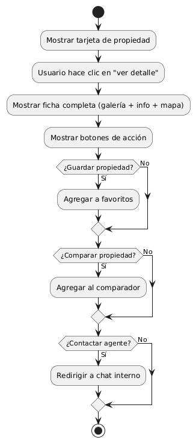
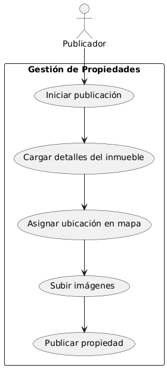
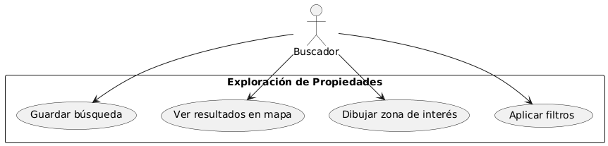
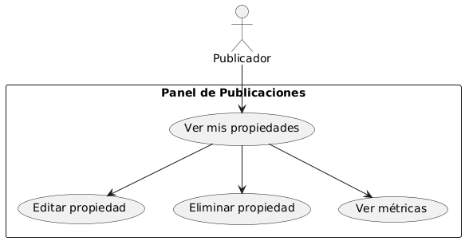

## Índice

0. [Ficha del proyecto](#0-ficha-del-proyecto)
1. [Descripción general del producto](#1-descripción-general-del-producto)
   - [1.1. Objetivo](#11-objetivo)
   - [1.2. Características y funcionalidades principales](#12-características-y-funcionalidades-principales)
   - [1.3. Diseño y experiencia de usuario](#13-diseño-y-experiencia-de-usuario)
     - [1.3.1. Flujo de Onboarding](#131-flujo-de-onboarding-registro--configuración-inicial)
     - [1.3.2. Flujo de Búsqueda de Propiedades](#132-flujo-de-búsqueda-de-propiedades)
     - [1.3.3. Flujo de Coincidencias y Notificaciones](#133-flujo-de-coincidencias-y-notificaciones-inteligentes)
     - [1.3.4. Flujo de Visualización de Propiedad](#134-flujo-de-visualización-de-propiedad)
     - [1.3.5. Flujo de Contacto y Chat](#135-flujo-de-contacto-y-chat)
   - [1.4. Flujo del Panel de Control](#14-flujo-del-panel-de-control-publicadores)
   - [1.5. Flujo de Favoritos y Comparación](#15-flujo-de-favoritos-y-comparación)
   - [1.6. Adaptación para Dispositivos Móviles](#16-adaptación-para-dispositivos-móviles)
   - [1.7. Principios de Diseño Centrado en el Usuario](#17-principios-de-diseño-centrado-en-el-usuario)
   - [1.8. Instrucciones de instalación](#18-instrucciones-de-instalación)
   - [1.9. Casos de Uso Principales del Sistema](#19-casos-de-uso-principales-del-sistema)
     - [1.9.1. Registrarse y configurar perfil](#caso-de-uso-191-registrarse-y-configurar-perfil)
     - [1.9.2. Publicar una propiedad](#caso-de-uso-192-publicar-una-propiedad-core)
     - [1.9.3. Buscar propiedades en el mapa](#caso-de-uso-193-buscar-propiedades-en-el-mapa-core)
     - [1.9.4. Generar coincidencias automáticas](#caso-de-uso-194-generar-coincidencias-automáticas-core)
     - [1.9.5. Contactar al publicador](#caso-de-uso-195-contactar-al-publicador-core)
     - [1.9.6. Administrar mis propiedades](#caso-de-uso-196-administrar-mis-propiedades)
     - [1.9.7. Guardar y comparar propiedades favoritas](#caso-de-uso-197-guardar-y-comparar-propiedades-favoritas)
     - [1.9.8. Recuperar contraseña](#caso-de-uso-198-recuperar-contraseña)
     - [1.9.9. Recibir notificaciones de coincidencias](#caso-de-uso-199-recibir-notificaciones-de-coincidencias)
     - [1.9.10. Cerrar sesión y limpiar sesión segura](#caso-de-uso-1910-cerrar-sesión-y-limpiar-sesión-segura)
2. [Arquitectura del sistema](#2-arquitectura-del-sistema)
3. [Modelo de datos](#3-modelo-de-datos)
4. [Especificación de la API](#4-especificación-de-la-api)
5. [Historias de usuario](#5-historias-de-usuario)
6. [Tickets de trabajo](#6-tickets-de-trabajo)
7. [Pull requests](#7-pull-requests)

---

## 0. Ficha del proyecto

### **0.1. Tu nombre completo:**
Antonio Alejandro Moreno Martinez

### **0.2. Nombre del proyecto:**
Zonmatch

### **0.3. Descripción breve del proyecto:**
Zonmatch revoluciona la forma en que se descubren propiedades inmobiliarias, resolviendo una de las principales fricciones del mercado: la ineficiencia en el emparejamiento entre oferta y demanda. En un entorno donde los portales tradicionales requieren búsquedas manuales extensas y carecen de retroalimentación proactiva, los usuarios se enfrentan a una experiencia fragmentada y poco personalizada.

### **0.4. URL del proyecto:**

> Puede ser pública o privada, en cuyo caso deberás compartir los accesos de manera segura. Puedes enviarlos a [alvaro@lidr.co](mailto:alvaro@lidr.co) usando algún servicio como [onetimesecret](https://onetimesecret.com/).

### 0.5. URL o archivo comprimido del repositorio

> Puedes tenerlo alojado en público o en privado, en cuyo caso deberás compartir los accesos de manera segura. Puedes enviarlos a [alvaro@lidr.co](mailto:alvaro@lidr.co) usando algún servicio como [onetimesecret](https://onetimesecret.com/). También puedes compartir por correo un archivo zip con el contenido


---

## 1. Descripción general del producto
Este sistema propone una solución tecnológica basada en una arquitectura moderna compuesta por ReactJS para una interfaz responsiva e intuitiva, Node.js y MySQL para una gestión robusta de datos, y un módulo de IA personalizado para matchmaking que analiza criterios y comportamientos para generar coincidencias automáticas entre inmuebles y buscadores. Los usuarios pueden definir zonas de interés mediante polígonos interactivos sobre el mapa, aplicar múltiples filtros (tipo de propiedad, amenidades, precio, etc.) y recibir notificaciones en tiempo real cuando una propiedad relevante aparece o se publica.

A diferencia de los portales tradicionales, Zonmatch no es solo una vitrina de propiedades, sino un sistema inteligente de conexión inmediata entre intereses complementarios, replicando la lógica de apps de emparejamiento social. Este enfoque dinámico y centrado en el usuario transforma el descubrimiento inmobiliario en una experiencia ágil, proactiva y placentera.

Diseñado para un público amplio y diverso, Zonmatch ofrece funcionalidades especializadas tanto para usuarios individuales que buscan su nuevo hogar, como para agentes, inmobiliarias y constructoras que desean posicionar sus propiedades de forma más eficiente. Todos los actores pueden beneficiarse de algoritmos de coincidencia inversa, sugerencias automatizadas y analíticas en tiempo real para tomar decisiones más rápidas y precisas.

### **1.1. Objetivo:**
Zonmatch tiene como propósito transformar radicalmente la forma en que personas y empresas descubren, ofertan y conectan con propiedades inmobiliarias, eliminando la necesidad de búsquedas manuales complejas, resultados irrelevantes o interacciones pasivas.

A diferencia de plataformas tradicionales, Zonmatch no se basa en mecánicas visuales tipo "swipe", sino que utiliza una lógica de coincidencia automatizada mediante inteligencia artificial. Los usuarios pueden definir filtros detallados (tipo de propiedad, amenidades, presupuesto, etc.) y delimitar zonas de interés dibujando polígonos en el mapa, lo que permite encontrar propiedades relevantes de forma proactiva, sin búsquedas constantes.

El sistema también genera coincidencias inversas: si un nuevo inmueble publicado coincide con los filtros de un buscador activo, el sistema lo notifica automáticamente. Esta doble vía de emparejamiento acelera la conexión entre oferta y demanda.

¿Qué valor aporta?
	•	Ahorro de tiempo en la búsqueda de inmuebles relevantes.
	•	Coincidencias más precisas, gracias a filtros combinados con geolocalización y IA.
	•	Notificaciones automáticas en tiempo real para nuevos matches.
	•	Herramientas inteligentes para empresas del sector que necesitan segmentar y posicionar su inventario de forma más efectiva.

¿Qué problema soluciona?
	•	El exceso de información irrelevante y la baja personalización en portales actuales.
	•	La falta de un sistema que detecte oportunidades inmobiliarias de forma automática y bidireccional.
	•	La ausencia de herramientas interactivas para definir zonas de interés reales por parte de los usuarios.

¿A quién está dirigido?
	•	Buscadores individuales (compradores o inquilinos) que quieren resultados precisos y sin esfuerzo.
	•	Agentes inmobiliarios que necesitan visibilidad y acceso a prospectos calificados.
	•	Inmobiliarias y constructoras que manejan carteras extensas y buscan inteligencia comercial.

### **1.2. Características y funcionalidades principales:**
A continuación se detallan las funcionalidades específicas de **Zonmatch**, diseñadas para responder a las necesidades de los distintos perfiles de usuario (buscadores, agentes, inmobiliarias, constructoras) y resolver los principales desafíos del mercado inmobiliario tradicional.

### Lean Canvas:**


---

### Funcionalidades Clave

#### 1. Publicación Inteligente de Propiedades
- **Usuarios:** Agentes, inmobiliarias, usuarios particulares.  
- **Descripción:**  
  - Formulario detallado con geolocalización y atributos del inmueble.
  - Categorización por tipo de operación (venta, renta, traspaso).
  - Subida de imágenes, etiquetas especiales (ej. pet-friendly, nuevo).
- **Valor que aporta:** Facilita una carga estructurada y optimizada de propiedades.

#### 2. Búsqueda Avanzada con Filtros Dinámicos
- **Usuarios:** Buscadores.  
- **Descripción:**  
  - Filtros por tipo de propiedad, habitaciones, precio, amenidades, etc.
  - Posibilidad de guardar búsquedas frecuentes.
- **Valor que aporta:** Permite resultados altamente relevantes sin búsquedas extensas.

#### 3. Selección Geográfica con Polígonos en Mapa
- **Usuarios:** Buscadores.  
- **Descripción:**  
  - Herramienta para dibujar zonas personalizadas directamente en el mapa.
  - Muestra propiedades dentro de zonas delimitadas.
- **Valor que aporta:** Búsqueda geográfica precisa basada en preferencias reales.

#### 4. Sistema de Match Automático
- **Usuarios:** Todos.  
- **Descripción:**  
  - Algoritmo que genera coincidencias automáticas si una propiedad cumple al menos el 50% de los filtros y está dentro del área definida.
- **Valor que aporta:** Encuentra coincidencias de forma proactiva, sin búsquedas manuales constantes.

#### 5. Match Inverso (Publicación → Buscador)
- **Usuarios:** Publicadores (agentes, inmobiliarias).  
- **Descripción:**  
  - Cuando se publica un nuevo inmueble, se verifica si coincide con filtros activos de otros usuarios y se les notifica automáticamente.
- **Valor que aporta:** Aumenta la exposición inmediata de nuevas propiedades a públicos interesados.

#### 6. Notificaciones Inteligentes
- **Usuarios:** Todos.  
- **Descripción:**  
  - Alertas en tiempo real por nuevos matches, ajustes de búsqueda y actividad relevante.
- **Valor que aporta:** Mantiene al usuario informado sin necesidad de monitoreo constante.

#### 7. Panel de Control Personalizado
- **Usuarios:** Agentes e inmobiliarias.  
- **Descripción:**  
  - Métricas de rendimiento por propiedad (vistas, clics, contactos).
  - Analítica por zona, tipo de inmueble y comportamiento de usuarios.
- **Valor que aporta:** Optimiza decisiones comerciales y de posicionamiento.

#### 8. Gestión de Favoritos y Seguimiento
- **Usuarios:** Buscadores.  
- **Descripción:**  
  - Guardado de favoritos, comparador de propiedades y visualización de historial de interacción.
- **Valor que aporta:** Facilita el análisis y comparación para tomar decisiones informadas.

#### 9. Sistema de Contacto y Chat Interno
- **Usuarios:** Todos.  
- **Descripción:**  
  - Contacto directo entre publicador y buscador.
  - Chat con historial de conversación dentro de la plataforma.
- **Valor que aporta:** Mejora la conversión al facilitar la comunicación inmediata.

#### 10. Interfaz Multidispositivo
- **Usuarios:** Todos.  
- **Descripción:**  
  - Diseño responsive para uso fluido en móviles, tablets y computadoras.
- **Valor que aporta:** Accesibilidad y comodidad desde cualquier lugar.

#### 11. Gestión de Seguridad y Autenticación de Usuarios
- **Usuarios:** Todos (buscadores, publicadores, agentes, administradores)  
- **Descripción:**  
  - Registro seguro con validación de identidad por correo.
  - Autenticación mediante email y contraseña cifrada.
  - Recuperación de contraseña con token temporal.
  - Control de sesión: expiración automática e invalidación manual.
  - Protección contra ataques de fuerza bruta mediante límites de intentos y bloqueo temporal.
  - Middleware de autorización basado en roles (`user`, `agent`, `admin`) para proteger rutas sensibles.
  - Cifrado de datos en tránsito (TLS/HTTPS) y en almacenamiento (hashing con bcrypt).
  - Posible integración futura con proveedores de identidad (OAuth 2.0: Google, Facebook).
- **Valor que aporta:**  
  Garantiza la seguridad, privacidad y control de acceso sobre la información sensible del usuario y las operaciones realizadas dentro de la plataforma.

---

### **1.3. Diseño y experiencia de usuario:**
# Flujos de Usuario Detallados – Zonmatch
Diseñados bajo principios de UX centrado en el usuario, accesibilidad y eficiencia. Cada flujo representa la experiencia ideal para web y móvil.

---

## 1.3.1. Flujo de Onboarding (Registro + Configuración Inicial)

### Objetivo:
Capturar el perfil del usuario e intenciones desde el primer uso.

### 1.3.1.1. Pantalla: Registro / Login (con manejo de seguridad)
**Componentes:**
- Tabs: [Iniciar sesión] | [Crear cuenta]
- Inputs:
  - Correo electrónico
  - Contraseña (con opción de mostrar/ocultar)
- Selector de rol al registrarse: [Buscador] | [Publicador]
- Botón: "Continuar"
- Enlace: "¿Olvidaste tu contraseña?"

**Interacciones:**
1. El usuario accede a la pantalla de login o registro.
2. En modo "Crear cuenta":
   - Completa datos y define su tipo de usuario.
   - Se almacena la contraseña con hashing (bcrypt).
   - El backend asigna el rol correspondiente y genera un token JWT al autenticarse.
3. En modo "Iniciar sesión":
   - El sistema valida las credenciales ingresadas.
   - Si son correctas:
     - Se genera un JWT con el rol del usuario.
     - Se almacena como cookie segura (`HttpOnly`, `Secure`).
     - Se redirige al dashboard que corresponda (`/panel`, `/explorar`, etc.).
   - Si son incorrectas:
     - Se incrementa el contador de intentos.
     - Tras 5 fallos, se bloquea el acceso temporalmente (con mensaje informativo).
4. Si el usuario hace clic en "¿Olvidaste tu contraseña?":
   - Se solicita su correo electrónico.
   - Se genera un token temporal con expiración de 15 minutos.
   - Se envía un correo con un enlace de recuperación.
   - Al hacer clic, accede a un formulario para definir una nueva contraseña.
   - Se actualiza la contraseña en el backend con un nuevo hash seguro.

**Seguridad Aplicada:**
- Contraseñas encriptadas con bcrypt.
- Prevención de ataques de fuerza bruta (limitación de intentos).
- Token JWT con control de expiración.
- Protección por rol: buscador, publicador, administrador.
- HTTPS obligatorio en todos los endpoints de autenticación.
- Cookie `HttpOnly` y `Secure` para evitar accesos vía JS.
- Enlace de recuperación con token temporal no reutilizable.


@startuml
start

:Usuario accede a pantalla de login;
:Ingresa correo y contraseña;

if (¿Credenciales válidas?) then (Sí)
:Validar hash (bcrypt);
:Generar token JWT con rol;
:Establecer cookie segura;
:Redirigir al panel correspondiente;
else (No)
:Incrementar contador de intentos;
if (¿Excedió el límite?) then (Sí)
    :Bloquear acceso temporalmente;
else (No)
    :Mostrar mensaje de error;
endif
endif

:¿Usuario olvidó contraseña?;
if (Sí) then
:Solicitar correo electrónico;
:Generar token temporal con expiración;
:Enviar enlace de recuperación;
:Usuario accede al enlace;
:Ingresa nueva contraseña;
:Actualizar contraseña cifrada;
endif

stop
@enduml

---

### 1.3.1.2. Pantalla: Configuración Inicial (para buscadores)
**Paso 1:** Tipo de propiedad + operación  
**Paso 2:** Rango de precio  
**Paso 3:** Amenidades prioritarias (checkboxes)  
**Paso 4:** Dibujo de zona de interés (mapa con herramienta de polígono)  
**Paso 5:** Confirmación del perfil

**IA aplicada:** Crea el perfil base para el sistema de coincidencias automáticas.


@startuml
start
:Mostrar pantalla de bienvenida;
if (¿Nuevo usuario?) then (Sí)
  :Mostrar formulario de registro;
  :Seleccionar tipo de usuario;
  if (¿Buscador?) then (Sí)
    :Mostrar wizard de configuración:
    :1. Tipo de propiedad;
    :2. Rango de precio;
    :3. Amenidades deseadas;
    :4. Zona de interés (polígono en mapa);
    :Guardar perfil;
  else (Publicador)
    :Redirigir a panel de publicaciones;
  endif
  :Redirigir al dashboard;
else (No)
  :Mostrar login;
  :Redirigir al dashboard;
endif
stop
@enduml

---

## 1.3.2. Flujo de Búsqueda de Propiedades

### Objetivo:
Permitir al usuario encontrar propiedades relevantes rápida y precisamente.

### 1.3.2.1. Pantalla: Buscador Principal (Home)
**Componentes:**
- Filtros rápidos en el encabezado
- CTA: "Ver propiedades en el mapa"

---

### 1.3.2.2. Pantalla: Búsqueda Avanzada + Mapa
**Componentes:**
- Mapa interactivo con opción de dibujar zona
- Filtros adicionales (habitaciones, amenidades, tipo)
- Botón: "Guardar esta búsqueda"

**Resultados:**
- Cards con nivel de match (%) y acciones rápidas

**IA aplicada:**
- Ordenamiento por relevancia
- Sugerencias si no hay resultados exactos


@startuml
start
:Mostrar buscador principal;
:Aplicar filtros rápidos;
:Ir a pantalla de mapa;
:Mostrar filtros avanzados;
:Usuario dibuja polígono;
:Aplicar todos los filtros;
:Mostrar propiedades coincidentes;
if (¿Guardar búsqueda?) then (Sí)
  :Guardar configuración de búsqueda;
endif
stop
@enduml

---

## 1.3.3. Flujo de Coincidencias y Notificaciones Inteligentes

### Objetivo:
Alertar automáticamente de oportunidades relevantes.

### 1.3.3.1. Match Automático (directo)
- Disparador: propiedad coincide con filtros del usuario
- Visualización: modal flotante + listado en dashboard

### 1.3.3.2. Match Inverso
- Disparador: búsqueda activa coincide con una nueva publicación
- Para el publicador: vista con detalles del perfil del buscador


@startuml
start
partition "Back-end" {
  :Publicación nueva o filtros actualizados;
  if (¿Coincide con búsqueda activa?) then (Sí)
    :Generar match;
    :Notificar a buscador y/o publicador;
  endif
}
partition "Frontend" {
  :Usuario visualiza match;
  :Explora la propiedad sugerida;
}
stop
@enduml

---

## 1.3.4. Flujo de Visualización de Propiedad

### Objetivo:
Presentar la propiedad clara y atractivamente.

### 1.3.4.1. Pantalla: Detalle de Inmueble
**Componentes:**
- Galería de imágenes
- Información estructurada
- Mapa con ubicación
- Botones: [Guardar], [Comparar], [Contactar]

**IA aplicada:**
- Propiedades similares al final del detalle



@startuml
start
:Mostrar tarjeta de propiedad;
:Usuario hace clic en "ver detalle";
:Mostrar ficha completa (galería + info + mapa);
:Mostrar botones de acción;

if (¿Guardar propiedad?) then (Sí)
  :Agregar a favoritos;
else (No)
endif

if (¿Comparar propiedad?) then (Sí)
  :Agregar al comparador;
else (No)
endif

if (¿Contactar agente?) then (Sí)
  :Redirigir a chat interno;
else (No)
endif

stop
@enduml

---

## 1.3.5. Flujo de Contacto y Chat

### Objetivo:
Facilitar la comunicación entre buscadores y publicadores, ofreciendo flexibilidad al usuario para elegir el canal de contacto más conveniente.

### 1.3.5.1. Chat Interno (In-App Messaging)

### Objetivo:
Mantener conversaciones dentro del entorno seguro de Zonmatch, vinculadas a una propiedad específica.

### 1.3.5.1.1. Pantalla: Chat In-App

**Componentes:**
- Lista de conversaciones previas (ordenadas por fecha)
- Vista activa del chat con:
  - Nombre y rol del interlocutor
  - Nombre + imagen de la propiedad asociada
  - Estado (en línea / última conexión)
- Zona de mensajes:
  - Campo de texto
  - Botón de envío
  - Adjuntos (opcional)
- Botón "Volver" o navegación lateral en escritorio

**Interacciones:**
1. El usuario presiona "Contactar" desde la propiedad.
2. Se abre un nuevo hilo o se continúa uno existente.
3. La conversación queda registrada y accesible desde la bandeja "Mensajes".
4. Mensajes se muestran con etiquetas de hora y estado ("leído", "entregado").

**Notificaciones:**
- Badge sobre el ícono de mensajes.
- (Opcional) Notificaciones push habilitadas.

**IA (futuro):**
- Sugerencias de respuestas rápidas.
- Alertas para seguimiento si no hay respuesta en X horas.

**Privacidad:**
- Datos protegidos; sin visibilidad de número telefónico.
- Capacidad de reportar o bloquear (futuro).

**Diseño Responsive:**
- Móvil: pantalla completa, navegación por swipe.
- Escritorio: vista dividida (sidebar + chat).

---

### 1.3.5.2 Contacto Externo vía WhatsApp

### Objetivo:
Ofrecer una vía directa de contacto fuera de la plataforma, aprovechando una app de mensajería ampliamente utilizada.

### 1.3.5.2.1. Pantalla: Modal de Contacto

**Componentes:**
- Modal o pantalla con selección de canal:
  - [Iniciar Chat Interno]
  - [Contactar por WhatsApp]
- Si se elige WhatsApp:
  - Redirección inmediata vía `wa.me`
  - Mensaje prellenado con datos relevantes:
    ```
    https://wa.me/52XXXXXXXXXX?text=Hola,%20vi%20tu%20propiedad%20en%20Zonmatch%20y%20me%20interesa%20más%20información
    ```

**Interacciones:**
1. El usuario presiona "Contactar".
2. Elige WhatsApp como canal.
3. El sistema abre la app (en móvil) o WhatsApp Web (en desktop).
4. La conversación continúa fuera del entorno Zonmatch.

**Consideraciones Técnicas:**
- Se registra solo el evento de salida (no los mensajes).
- El número del agente solo se muestra si ha activado la opción.

**Privacidad:**
- Se informa al usuario que este canal es externo.
- El número de teléfono se gestiona conforme a las preferencias del agente.

**Diseño Responsive:**
- En móvil, la app de WhatsApp se abre directamente.
- En escritorio, se abre WhatsApp Web en nueva pestaña.

---

### Interacciones del Usuario:
1. El usuario accede a la ficha de la propiedad.
2. Presiona el botón "Contactar".
3. Selecciona el canal preferido (chat interno o WhatsApp).
4. Se inicia la conversación en el medio elegido.

---

### IA en la Interfaz:
- Registro del canal de contacto utilizado por el usuario para estadísticas de conversión.
- (Futuro) Sugerencias automáticas de respuesta para agentes, según historial.

---

### 1.3.5.3. Pantalla: Chat Interno
**Componentes:**
- Lista de conversaciones
- Vista del mensaje + historial
- Campo de texto, botón de envío, y posibilidad de adjuntar archivos
---Diseño Responsive:
- En móvil: la opción de WhatsApp abre la app directamente (si está instalada).
- En escritorio: se abre WhatsApp Web.
- Layout mobile-first para chat interno: pantalla completa + botón de retroceso.

---

### Consideraciones de Privacidad:
- El número telefónico del agente solo será visible si habilitó la opción de contacto externo.
- Se informa al usuario que WhatsApp es un canal externo a Zonmatch, sin cifrado controlado por la plataforma.


@startuml
start
:Usuario accede a ficha de propiedad;
:Presiona botón "Contactar";

if (¿Selecciona canal de contacto?) then (Chat Interno)
  :Verifica si existe conversación previa;
  if (¿Existe?) then (Sí)
    :Mostrar conversación anterior;
  else (No)
    :Crear nuevo hilo de conversación;
    :Enviar mensaje inicial con contexto;
  endif
  :Intercambio de mensajes en tiempo real;
  :Notificaciones en bandeja de entrada;
else (WhatsApp)
  if (¿Agente tiene WhatsApp habilitado?) then (Sí)
    :Generar enlace con mensaje prellenado;
    :Redirigir a WhatsApp Web o App;
  else (No)
    :Mostrar mensaje: "Canal no disponible";
  endif
endif

stop
@enduml

---

## 1.4. Flujo del Panel de Control (Publicadores)

### Objetivo:
Gestionar publicaciones y evaluar rendimiento.

### 1.4.1. Pantalla: Dashboard de Publicaciones
**Componentes:**
- Cards con KPIs: vistas, matches, contactos
- Gráficos de rendimiento por zona
- Acciones: Editar / Archivar / Eliminar

**IA aplicada:**
- Alertas de búsqueda activa coincidente
- Recomendaciones para optimizar publicaciones


@startuml
start
:Mostrar dashboard;
:Listar propiedades del publicador;
repeat
  :Mostrar métricas por propiedad;
  :Permitir editar / archivar / eliminar;
repeat while (Más propiedades)
:Mostrar alertas de IA (matches inversos, bajo rendimiento);
:Mostrar sugerencias de mejora;
stop
@enduml

---

## 1.5. Flujo de Favoritos y Comparación

### Objetivo:
Organizar decisiones del usuario de forma clara.

### 1.5.1. Pantalla: Mis Favoritos
**Componentes:**
- Lista de propiedades guardadas
- Modo de comparación en tabla
- Botón: "¿Aún disponible?" para seguimiento


@startuml
start
:Usuario guarda propiedades;
:Accede a sección "Favoritos";
:Selecciona 2 o más para comparar;
:Mostrar tabla comparativa;
if (¿Enviar contacto?) then (Sí)
  :Enviar mensaje a publicador;
endif
stop
@enduml

---

## 1.6. Adaptación para Dispositivos Móviles

### Principios clave:
- Layout adaptativo con navegación inferior persistente
- Inputs táctiles y grandes
- Persistencia de filtros entre sesiones y dispositivos

---

## 1.7. Principios de Diseño Centrado en el Usuario

| Principio           | Aplicación en Zonmatch                                            |
|---------------------|-----------------------------------------------------------------|
| **Usabilidad**      | Flujo guiado, botones claros, feedback inmediato                |
| **Accesibilidad**   | Alto contraste, navegación por teclado, inputs legibles         |
| **Jerarquía Visual**| Elementos clave destacados: filtros, CTA, mapa                  |
| **Consistencia**    | Componentes reutilizables, navegación coherente                 |
| **Interactividad**  | Respuestas visuales lógicas a cada acción del usuario           |

---

### **1.8. Instrucciones de instalación:**
> Documenta de manera precisa las instrucciones para instalar y poner en marcha el proyecto en local (librerías, backend, frontend, servidor, base de datos, migraciones y semillas de datos, etc.)

---

## 1.9. Casos de Uso Principales del Sistema

### Caso de Uso 1.9.1: Registrarse y configurar perfil
**Actor:** Usuario (Buscador o Publicador)  
**Descripción:** Permite a un nuevo usuario registrarse en la plataforma y configurar su perfil según el rol.  
**Precondiciones:** El usuario no debe tener una cuenta activa.  
**Flujo principal:**
1. El usuario accede a la página de inicio.
2. Selecciona "Crear cuenta".
3. Ingresa correo, contraseña y selecciona su rol (buscador o publicador).
4. El sistema valida y crea la cuenta.
5. Si es buscador, se solicitan preferencias iniciales (tipo de propiedad, zona, filtros).
6. Se redirige al dashboard correspondiente.


@startuml
left to right direction
actor Usuario
rectangle Registro {
  (Registrarse) as R
  (Iniciar sesión) as L
  (Configurar preferencias de búsqueda) as P
}
Usuario --> R
Usuario --> L
L --> P : Si es buscador
@enduml

---

### Caso de Uso 1.9.2: Publicar una propiedad *(Core)*
**Actor:** Publicador (Agente, Inmobiliaria, Constructora)  
**Descripción:** El publicador registra un nuevo inmueble en la plataforma.  
**Precondiciones:** El usuario debe estar autenticado como publicador.  
**Flujo principal:**
1. El publicador accede a su panel de propiedades.
2. Hace clic en "Publicar nueva propiedad".
3. Ingresa información: tipo, precio, descripción, amenidades, ubicación, imágenes.
4. El sistema valida y guarda los datos.
5. Se activa el motor de coincidencias inversas.
6. La propiedad queda visible en el mapa para buscadores compatibles.



@startuml
actor Publicador
rectangle "Gestión de Propiedades" {
  (Iniciar publicación)
  (Cargar detalles del inmueble)
  (Asignar ubicación en mapa)
  (Subir imágenes)
  (Publicar propiedad)
}
Publicador --> (Iniciar publicación)
(Iniciar publicación) --> (Cargar detalles del inmueble)
(Cargar detalles del inmueble) --> (Asignar ubicación en mapa)
(Asignar ubicación en mapa) --> (Subir imágenes)
(Subir imágenes) --> (Publicar propiedad)
@enduml

---

### Caso de Uso 1.9.3: Buscar propiedades en el mapa *(Core)*
**Actor:** Buscador  
**Descripción:** El usuario explora propiedades según filtros y zonas de interés.  
**Precondiciones:** Ninguna (puede ejecutarse con o sin sesión iniciada).  
**Flujo principal:**
1. El usuario accede a la vista "Explorar".
2. Aplica filtros: tipo, precio, amenidades, etc.
3. Dibuja una o varias zonas en el mapa.
4. El sistema devuelve propiedades compatibles visualmente.
5. El usuario puede guardar la búsqueda o seleccionar una propiedad para ver más.



@startuml
actor Buscador
rectangle "Exploración de Propiedades" {
  (Aplicar filtros)
  (Dibujar zona de interés)
  (Ver resultados en mapa)
  (Guardar búsqueda)
}
Buscador --> (Aplicar filtros)
Buscador --> (Dibujar zona de interés)
Buscador --> (Ver resultados en mapa)
Buscador --> (Guardar búsqueda)
@enduml

---

### Caso de Uso 1.9.4: Generar coincidencias automáticas *(Core)*
**Actor:** Sistema  
**Descripción:** Detecta automáticamente coincidencias entre búsquedas activas y propiedades publicadas.  
**Precondiciones:** Debe existir al menos una propiedad y una búsqueda activa.  
**Flujo principal:**
1. Se publica una nueva propiedad o se actualiza una búsqueda.
2. El sistema ejecuta el algoritmo de coincidencia (>= 50% de match + intersección geográfica).
3. Si hay coincidencias:
   - Se registra un match.
   - Se notifica a las partes involucradas (buscador o publicador).
4. Se almacena el resultado para historial y visualización futura.


@startuml
actor Sistema
actor Usuario
rectangle "Notificaciones Inteligentes" {
  (Detectar coincidencia)
  (Generar alerta)
  Usuario <-- (Generar alerta)
}
Sistema --> (Detectar coincidencia)
(Detectar coincidencia) --> (Generar alerta)
@enduml

---

### Caso de Uso 1.9.5: Contactar al publicador *(Core)*
**Actor:** Buscador  
**Descripción:** El usuario interesado inicia una conversación con el agente o publicador, por chat o WhatsApp.  
**Precondiciones:** El usuario debe haber accedido a la ficha de una propiedad.  
**Flujo principal:**
1. El buscador selecciona una propiedad de interés.
2. Hace clic en "Contactar".
3. El sistema muestra dos opciones: Chat interno o WhatsApp.
4. Si elige chat:
   - Se abre un canal de conversación persistente.
   - El usuario envía su primer mensaje.
5. Si elige WhatsApp:
   - Se redirige a `wa.me` con un mensaje predefinido.
   - El agente recibe la notificación en su app de WhatsApp.


@startuml
actor Buscador
rectangle "Comunicación" {
  (Ver propiedad)
  (Seleccionar canal de contacto)
  (Iniciar chat interno)
  (Redirigir a WhatsApp)
}
Buscador --> (Ver propiedad)
(Ver propiedad) --> (Seleccionar canal de contacto)
(Seleccionar canal de contacto) --> (Iniciar chat interno)
(Seleccionar canal de contacto) --> (Redirigir a WhatsApp)
@enduml

---

### Caso de Uso 1.9.6: Administrar mis propiedades
**Actor:** Publicador  
**Descripción:** Permite a los publicadores gestionar su catálogo de inmuebles.  
**Precondiciones:** El usuario debe estar autenticado como publicador.  
**Flujo principal:**
1. El publicador accede al panel "Mis propiedades".
2. Visualiza el listado de publicaciones activas e inactivas.
3. Puede:
   - Editar datos de una propiedad.
   - Eliminar o desactivar una publicación.
   - Consultar métricas (vistas, contactos).
4. El sistema actualiza la base de datos y aplica validaciones.



@startuml
actor Publicador
rectangle "Panel de Publicaciones" {
  (Ver mis propiedades)
  (Editar propiedad)
  (Eliminar propiedad)
  (Ver métricas)
}
Publicador --> (Ver mis propiedades)
(Ver mis propiedades) --> (Editar propiedad)
(Ver mis propiedades) --> (Eliminar propiedad)
(Ver mis propiedades) --> (Ver métricas)
@enduml

---

### Caso de Uso 1.9.7: Guardar y comparar propiedades favoritas
**Actor:** Buscador  
**Descripción:** El usuario puede guardar propiedades y compararlas en su panel de favoritos.  
**Precondiciones:** El usuario debe tener una cuenta activa.  
**Flujo principal:**
1. Durante la exploración, el usuario hace clic en "Guardar".
2. La propiedad se añade a la lista de favoritos.
3. Desde su panel, el usuario accede a "Favoritos".
4. Selecciona múltiples propiedades y hace clic en "Comparar".
5. El sistema presenta una tabla comparativa de atributos.


@startuml
actor Buscador
rectangle "Gestión de Favoritos" {
  (Guardar propiedad)
  (Acceder a favoritos)
  (Comparar propiedades)
}
Buscador --> (Guardar propiedad)
Buscador --> (Acceder a favoritos)
(Acceder a favoritos) --> (Comparar propiedades)
@enduml

---

### Caso de Uso 1.9.8: Recuperar contraseña
**Actor:** Usuario  
**Descripción:** Permite recuperar el acceso si el usuario olvida su contraseña.  
**Precondiciones:** El correo electrónico debe estar registrado.  
**Flujo principal:**
1. El usuario hace clic en "¿Olvidaste tu contraseña?".
2. Ingresa su correo.
3. El sistema genera un token de recuperación válido por 15 minutos.
4. Se envía un correo con un enlace único.
5. El usuario accede al enlace y define una nueva contraseña.
6. El sistema actualiza el hash en la base de datos.


@startuml
actor Usuario
rectangle "Seguridad y Acceso" {
  (Solicitar recuperación)
  (Generar token temporal)
  (Enviar email con enlace)
  (Validar token)
  (Actualizar contraseña)
}
Usuario --> (Solicitar recuperación)
(Solicitar recuperación) --> (Generar token temporal)
(Generar token temporal) --> (Enviar email con enlace)
(Usuario) --> (Validar token)
(Validar token) --> (Actualizar contraseña)
@enduml

---

### Caso de Uso 1.9.9: Recibir notificaciones de coincidencias
**Actor:** Usuario (buscador o publicador)  
**Descripción:** El sistema informa sobre nuevos matches detectados automáticamente.  
**Precondiciones:** El usuario debe tener al menos una búsqueda o propiedad activa.  
**Flujo principal:**
1. Se detecta un nuevo match por el sistema.
2. Se crea un registro de coincidencia.
3. Se genera una notificación para el usuario.
4. La notificación aparece en el panel o se envía por correo/app.
5. El usuario puede acceder al detalle del match desde su historial.


@startuml
actor Sistema
actor Usuario
rectangle "Notificaciones Inteligentes" {
  (Detectar coincidencia)
  (Generar alerta)
  Usuario <-- (Generar alerta)
}
Sistema --> (Detectar coincidencia)
(Detectar coincidencia) --> (Generar alerta)
@enduml

---

### Caso de Uso 1.9.10: Cerrar sesión y limpiar sesión segura
**Actor:** Usuario  
**Descripción:** El usuario finaliza su sesión cerrando el acceso a su cuenta.  
**Precondiciones:** El usuario debe haber iniciado sesión previamente.  
**Flujo principal:**
1. El usuario accede al menú de usuario.
2. Hace clic en "Cerrar sesión".
3. El sistema invalida el token JWT activo.
4. El usuario es redirigido a la página de login.
5. Se eliminan cookies seguras y se cierra el contexto de sesión.


@startuml
actor Usuario
rectangle "Autenticación" {
  (Cerrar sesión)
  (Invalidar token)
  (Redirigir a login)
}
Usuario --> (Cerrar sesión)
(Cerrar sesión) --> (Invalidar token)
(Invalidar token) --> (Redirigir a login)
@enduml

---

## 2. Arquitectura del Sistema

### **2.1. Diagrama de arquitectura:**
> Usa el formato que consideres más adecuado para representar los componentes principales de la aplicación y las tecnologías utilizadas. Explica si sigue algún patrón predefinido, justifica por qué se ha elegido esta arquitectura, y destaca los beneficios principales que aportan al proyecto y justifican su uso, así como sacrificios o déficits que implica.


### **2.2. Descripción de componentes principales:**

> Describe los componentes más importantes, incluyendo la tecnología utilizada

### **2.3. Descripción de alto nivel del proyecto y estructura de ficheros**

> Representa la estructura del proyecto y explica brevemente el propósito de las carpetas principales, así como si obedece a algún patrón o arquitectura específica.

### **2.4. Infraestructura y despliegue**

> Detalla la infraestructura del proyecto, incluyendo un diagrama en el formato que creas conveniente, y explica el proceso de despliegue que se sigue

### **2.5. Seguridad**

> Enumera y describe las prácticas de seguridad principales que se han implementado en el proyecto, añadiendo ejemplos si procede

### **2.6. Tests**

> Describe brevemente algunos de los tests realizados

---

## 3. Modelo de Datos

### **3.1. Diagrama del modelo de datos:**

> Recomendamos usar mermaid para el modelo de datos, y utilizar todos los parámetros que permite la sintaxis para dar el máximo detalle, por ejemplo las claves primarias y foráneas.


### **3.2. Descripción de entidades principales:**

> Recuerda incluir el máximo detalle de cada entidad, como el nombre y tipo de cada atributo, descripción breve si procede, claves primarias y foráneas, relaciones y tipo de relación, restricciones (unique, not null…), etc.

---

## 4. Especificación de la API

> Si tu backend se comunica a través de API, describe los endpoints principales (máximo 3) en formato OpenAPI. Opcionalmente puedes añadir un ejemplo de petición y de respuesta para mayor claridad

---

## 5. Historias de Usuario

> Documenta 3 de las historias de usuario principales utilizadas durante el desarrollo, teniendo en cuenta las buenas prácticas de producto al respecto.

**Historia de Usuario 1**

**Historia de Usuario 2**

**Historia de Usuario 3**

---

## 6. Tickets de Trabajo

> Documenta 3 de los tickets de trabajo principales del desarrollo, uno de backend, uno de frontend, y uno de bases de datos. Da todo el detalle requerido para desarrollar la tarea de inicio a fin teniendo en cuenta las buenas prácticas al respecto. 

**Ticket 1**

**Ticket 2**

**Ticket 3**

---

## 7. Pull Requests

> Documenta 3 de las Pull Requests realizadas durante la ejecución del proyecto

**Pull Request 1**

**Pull Request 2**

**Pull Request 3**

