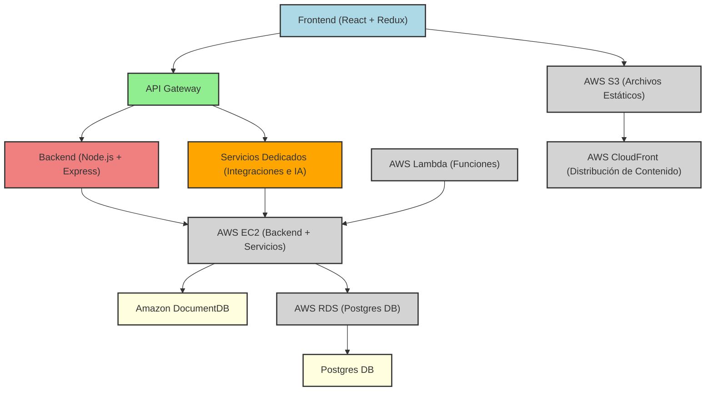
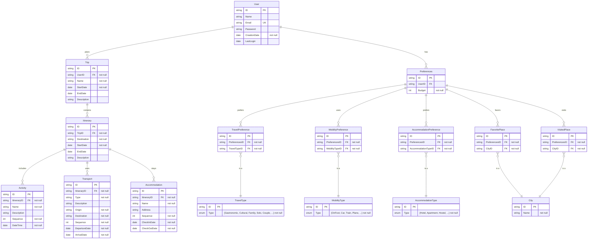

## Índice

0. [Ficha del proyecto](#0-ficha-del-proyecto)
1. [Descripción general del producto](#1-descripción-general-del-producto)
2. [Arquitectura del sistema](#2-arquitectura-del-sistema)
3. [Modelo de datos](#3-modelo-de-datos)
4. [Especificación de la API](#4-especificación-de-la-api)
5. [Historias de usuario](#5-historias-de-usuario)
6. [Tickets de trabajo](#6-tickets-de-trabajo)
7. [Pull requests](#7-pull-requests)

---

## 0. Ficha del proyecto

### **0.1. Tu nombre completo:**

María Pizarro Cuevas

### **0.2. Nombre del proyecto:**

### **0.3. Descripción breve del proyecto:**

IkiGoo tiene por objetivo simplificar y personalizar la planificación de viajes utilizando Inteligencia Artificial. Permitirá a los usuarios crear itinerarios de viaje adaptados a sus preferencias y necesidades específicas, desde la selección de destinos hasta la organización de actividades, transporte y alojamiento.

La IA actuará como un asistente personal de viaje, generando itinerarios optimizados basados en la información proporcionada por el usuario, como intereses, presupuesto y disponibilidad. Buscará ofrecer una experiencia de planificación eficiente, permitiendo a cualquier persona organizar sus viajes de manera rápida y sin complicaciones.

IkiGoo está pensada para ser una solución integral que facilita la creación de itinerarios únicos, asegurando que cada viaje sea una experiencia personalizada y acorde a las expectativas del usuario.

### **0.4. URL del proyecto:**

(WIP)

### 0.5. URL o archivo comprimido del repositorio

[Github Repository - AI4Devs-finalproject-MPC](https://github.com/Edain92/AI4Devs-finalproject-MPC)

---

## 1. Descripción general del producto

### **1.1. Objetivo:**

IkiGoo pretende transformar la planificación de viajes en una experiencia eficiente y altamente personalizada. Utilizando Inteligencia Artificial (IA), IkiGoo genera itinerarios de viaje optimizados que se adaptan a las preferencias y necesidades únicas de cada usuario. La IA de IkiGoo analiza una variedad de factores, como destinos, intereses, presupuesto y disponibilidad, para ofrecer un proceso de planificación fluido y completamente alineado con los deseos del viajero.

Esta aplicación actuará como un asistente personal de viaje, gestionando grandes volúmenes de datos y ofreciendo recomendaciones en tiempo real. A medida que el usuario interactúa con la aplicación, la IA ajustará sus sugerencias, mejorando continuamente la precisión y relevancia de los itinerarios. Esto asegura que cada viaje sea no solo bien organizado, sino también perfectamente ajustado a las expectativas del usuario.

**¿Qué Soluciona?**

Planificar un viaje puede ser un proceso complejo y estresante, que a menudo resulta en itinerarios genéricos que no reflejan lo que el viajero realmente desea. IkiGoo simplifica esta tarea, reuniendo toda la información necesaria en un solo lugar y generando itinerarios bien estructurados y personalizados con solo responder a unas pocas preguntas clave. De esta forma, el usuario ahorrará tiempo y reducirá el posible estrés asociado a la planificación, permitiendo que se concentre en disfrutar del viaje en lugar de preocuparse por los detalles logísticos.

**Público Objetivo**

IkiGoo está diseñado para cualquier persona interesada en viajar, independientemente de sus necesidades o el tipo de experiencia que busque. Desde viajeros solitarios y familias, hasta parejas, grupos de amigos y profesionales que viajan por negocios, IkiGoo ofrece una solución adaptable y eficiente para planificar todo tipo de itinerarios. La capacidad de la aplicación para ofrecer itinerarios personalizados asegura que cada usuario reciba una experiencia de viaje alineada con sus intereses y estilo de vida.

### **1.2. Características y funcionalidades principales:**

- **Interacción con la IA**: Los usuarios interactúan con la IA a través de un chat que les hace preguntas clave sobre sus preferencias y necesidades. La IA responde con itinerarios sugeridos que se pueden ajustar y personalizar aún más.
- **Acceso a Información en Tiempo Real**: La aplicación se conecta a diversas APIs para proporcionar datos actualizados sobre precios, disponibilidad de alojamiento, transporte y eventos.
- **Planificación de Itinerarios**: La aplicación permite a los usuarios crear, editar y guardar itinerarios de viaje personalizados. La IA sugiere opciones basadas en las respuestas del usuario y ajusta los planes en función de cambios en la disponibilidad o las preferencias del usuario.
- **Visualización de Itinerarios**: Los usuarios pueden ver un calendario de viajes que muestra sus itinerarios planificados, con la posibilidad de agregar y mover actividades según sus necesidades.
- **Revisión y Edición de Itinerarios**: Funcionalidad que permite a los usuarios revisar los itinerarios sugeridos, hacer modificaciones según sea necesario y recibir actualizaciones de la IA en tiempo real.
- **Personalización del Perfil**: Los usuarios pueden crear y modificar su perfil, donde especifican su información personal, preferencias de viaje, destinos favoritos y restricciones de presupuesto.

### **1.3. Diseño y experiencia de usuario:**

#### Login Page

#### Main Page

#### Calendar

### **1.4. Instrucciones de instalación:**

(WIP)

---

## 2. Arquitectura del Sistema

### **2.1. Diagrama de arquitectura**

La arquitectura del sistema de **IkiGoo** se ha diseñado para ser modular, escalable y eficiente, utilizando un enfoque de monolito modular. Esto facilita la implementación inicial del MVP, manteniendo la simplicidad y la cohesión, mientras se sientan las bases para una posible transición a un modelo de arquitectura más moderno en el futuro.

**Patrón Arquitectónico: Monolito Modular**

Se ha optado por un enfoque de monolito modular, donde el sistema está organizado en módulos independientes que manejan diferentes aspectos de la aplicación, pero que están unidos en una única base de código. Esta elección se ha dado por los siguientes motivos:
  - **Simplicidad y Rapidez de Desarrollo**: Para el **MVP**, un monolito modular permite un desarrollo más rápido y sencillo, sin la complejidad adicional que conlleva una arquitectura de microservicios.
  - **Cohesión y Facilidad de Mantenimiento**: Mantener toda la lógica del sistema en una base de código facilita la depuración y el mantenimiento en las primeras etapas del proyecto.
  - **Escalabilidad Futurible**: El diseño modular permite que, si el sistema crece en complejidad y demanda, se pueda descomponer en el futuro, por ejemplo, en microservicios, facilitando la transición sin grandes refactorizaciones.

**Desafíos**

- **Escalabilidad Limitada Inicialmente**: Un monolito modular puede volverse difícil de escalar a medida que crece el número de usuarios y la complejidad de las funciones, lo que podría requerir una refactorización significativa en el futuro.
- **Potencialmente Menor Resiliencia**: Si bien un monolito modular es más sencillo, también significa que todos los componentes están unidos; si una parte del sistema falla, podría impactar a todo el sistema.
- **Mayor Complejidad en la Transición**: Si se decide migrar a una arquitectura de microservicios, la transición podría requerir un esfuerzo considerable para dividir los módulos en servicios independientes.

A pesar de ello, este enfoque arquitectónico, junto con las tecnologías seleccionadas, permite a **IkiGoo** ofrecer una solución robusta y flexible, optimizada para un desarrollo rápido y eficaz del MVP, mientras que proporciona una base sólida para una evolución y escalabilidad futura.

### **2.2. Descripción de componentes principales:**

1. **Frontend (React + Redux)**: La interfaz de usuario será construida con React, biblioteca de JavaScript para construir interfaces de usuario de manera modular. Redux se utiliza para gestionar el estado global de la aplicación.
Estas herramientas proporcionan una experiencia interactiva y dinámica para los usuarios, permitiendo la planificación de itinerarios, gestión de perfiles y otras interacciones clave.
   - **Comunicación**: Interactuará con el API Gateway para enviar y recibir datos del backend.

2. **API Gateway**: Actuará como el único punto de entrada para todas las solicitudes desde el frontend hacia el backend. Su objetivo es controlar la autenticación, enrutamiento, y composición de respuestas, proporcionando una capa de seguridad y control de acceso centralizada.
   - **Comunicación**: Redirigirá las solicitudes al backend y a los servicios dedicados según corresponda.

3. **Backend (Node.js + Express)**: El núcleo del sistema será construido con Node.js, conocido entorno de ejecución de JavaScript que permite manejar múltiples conexiones simultáneas de manera eficiente. Express será el framework utilizado para manejar las rutas y la lógica de negocio.
   - **Comunicación**: Se conectará con las bases de datos (Postgres y Amazon DocumentDB) y con los servicios dedicados.

4. **Servicios Dedicados (Integraciones e IA)**: Servicios dentro del backend que gestionarán las integraciones con APIs externas (para obtener datos de vuelos, hoteles, eventos) y con la API de OpenAI para la generación de itinerarios personalizados mediante IA.
Serán los encargados de obtener, procesar y devolver datos en tiempo real, asegurando que la aplicación pueda ofrecer información precisa y recomendaciones personalizadas.
   - **Comunicación**: Se integrarán con el backend para procesar solicitudes específicas relacionadas con la obtención de datos y la personalización de itinerarios.

5. **Bases de Datos (Postgres + Amazon DocumentDB)**:
   - **Postgres**: Base de datos relacional utilizada para almacenar datos estructurados como usuarios e itinerarios. Esta garantiza la integridad referencial y maneja operaciones complejas de consulta y manipulación de datos.
     - **Comunicación**: Directamente con el backend para realizar operaciones CRUD.
   - **Amazon DocumentDB**: Base de datos NoSQL utilizada para almacenar datos no estructurados, como logs e historial de interacciones del usuario. Encargada de facilitar el almacenamiento y recuperación de datos semi-estructurados que no requieren una estructura rígida.
     - **Comunicación**: Gestionada directamente por el backend para operaciones que no requieren integridad referencial.

6. **Infraestructura en AWS**:
   - **EC2**: Hospedará el backend y los servicios dedicados en un entorno Dockerizado.
   - **Lambda**: Ejecutará funciones serverless para tareas específicas como la sincronización de datos.
   - **S3**: Almacenará archivos estáticos como imágenes y otros recursos necesarios para el frontend.
   - **RDS**: Administrará la base de datos relacional Postgres, facilitando su escalabilidad y gestión.
   - **CloudFront**: Acelerará la entrega de contenido estático a los usuarios finales.

### **2.3. Descripción de alto nivel del proyecto y estructura de ficheros**

> WIP: Representa la estructura del proyecto y explica brevemente el propósito de las carpetas principales, así como si obedece a algún patrón o arquitectura específica.

### **2.4. Infraestructura y despliegue**

> WIP: Detalla la infraestructura del proyecto, incluyendo un diagrama en el formato que creas conveniente, y explica el proceso de despliegue que se sigue

### **2.5. Seguridad**

> WIP: Enumera y describe las prácticas de seguridad principales que se han implementado en el proyecto, añadiendo ejemplos si procede

### **2.6. Tests**

> WIP: Describe brevemente algunos de los tests realizados

---

## 3. Modelo de Datos

### **3.1. Diagrama del modelo de datos:**

### **3.2. Descripción de entidades principales:**

**User**
- **Descripción**: Representa al usuario que utiliza la aplicación.
- **Atributos**:
  - `ID` (string, PK): Identificador único del usuario.
  - `Name` (string): Nombre del usuario.
  - `Email` (string, UK): Dirección de correo electrónico única del usuario.
  - `Password` (string): Contraseña cifrada del usuario.
  - `CreationDate` (date, not null): Fecha en la que se creó la cuenta del usuario.
  - `LastLogin` (date): Fecha de la última vez que el usuario inició sesión.
- **Relaciones**:
  - Relación uno a muchos con `Trip` (Un usuario puede planificar múltiples viajes).
  - Relación uno a uno con `Preferences` (Un usuario tiene un conjunto de preferencias).

**Preferences**
- **Descripción**: Contiene las preferencias del usuario, como tipos de viajes, movilidad, alojamiento, y lugares favoritos o visitados.
- **Atributos**:
  - `ID` (string, PK): Identificador único de las preferencias del usuario.
  - `UserID` (string, FK): Referencia al usuario asociado.
  - `Budget` (int, not null): Presupuesto máximo que el usuario desea gastar en sus viajes.
- **Relaciones**:
  - Relación uno a muchos con `TravelPreference`, `MobilityPreference`, `AccommodationPreference`, `FavoritePlace`, y `VisitedPlace`.

**Trip**
- **Descripción**: Representa un viaje planificado por el usuario, que puede contener múltiples itinerarios.
- **Atributos**:
  - `ID` (string, PK): Identificador único del viaje.
  - `UserID` (string, FK, not null): Referencia al usuario que planifica el viaje.
  - `Name` (string, not null): Nombre del viaje.
  - `StartDate` (date, not null): Fecha de inicio del viaje.
  - `EndDate` (date): Fecha de finalización del viaje.
  - `Description` (string): Descripción opcional del viaje.
- **Relaciones**:
  - Relación uno a muchos con `Itinerary` (Un viaje puede contener múltiples itinerarios).

**Itinerary**
- **Descripción**: Representa un itinerario dentro de un viaje, que incluye actividades, transportes y alojamientos específicos.
- **Atributos**:
  - `ID` (string, PK): Identificador único del itinerario.
  - `TripID` (string, FK, not null): Referencia al viaje asociado.
  - `Destination` (string, not null): Destino del itinerario.
  - `StartDate` (date, not null): Fecha de inicio del itinerario.
  - `EndDate` (date): Fecha de finalización del itinerario.
  - `Description` (string): Descripción opcional del itinerario.
- **Relaciones**:
  - Relación uno a muchos con `Activity`, `Transport`, y `Accommodation` (Un itinerario incluye múltiples actividades, transportes, y alojamientos).

**Activity**
- **Descripción**: Representa una actividad específica dentro de un itinerario, como visitas turísticas, eventos, etc.
- **Atributos**:
  - `ID` (string, PK): Identificador único de la actividad.
  - `ItineraryID` (string, FK, not null): Referencia al itinerario asociado.
  - `Name` (string, not null): Nombre de la actividad.
  - `Description` (string): Descripción opcional de la actividad.
  - `Sequence` (int, not null): Orden de ejecución de la actividad dentro del itinerario.
  - `DateTime` (date, not null): Fecha y hora en que se llevará a cabo la actividad.
- **Relaciones**:
  - Relación muchos a uno con `Itinerary` (Una actividad pertenece a un solo itinerario).

**Transport**
- **Descripción**: Representa un medio de transporte utilizado en un itinerario, como vuelos, trenes, etc.
- **Atributos**:
  - `ID` (string, PK): Identificador único del transporte.
  - `ItineraryID` (string, FK, not null): Referencia al itinerario asociado.
  - `Type` (string, not null): Tipo de transporte (ej., vuelo, tren, coche, etc.).
  - `Description` (string): Descripción opcional del transporte.
  - `Origin` (string, not null): Lugar de origen del transporte.
  - `Destination` (string, not null): Lugar de destino del transporte.
  - `Sequence` (int, not null): Orden de ejecución del transporte dentro del itinerario.
  - `DepartureDate` (date, not null): Fecha y hora de salida.
  - `ArrivalDate` (date, not null): Fecha y hora de llegada.
- **Relaciones**:
  - Relación muchos a uno con `Itinerary` (Un transporte pertenece a un solo itinerario).

**Accommodation**
- **Descripción**: Representa el alojamiento del usuario durante un itinerario, como un hotel o apartamento.
- **Atributos**:
  - `ID` (string, PK): Identificador único del alojamiento.
  - `ItineraryID` (string, FK, not null): Referencia al itinerario asociado.
  - `Name` (string, not null): Nombre del alojamiento.
  - `Address` (string): Dirección del alojamiento.
  - `Sequence` (int, not null): Orden de ejecución del alojamiento dentro del itinerario.
  - `CheckInDate` (date, not null): Fecha y hora de check-in.
  - `CheckOutDate` (date, not null): Fecha y hora de check-out.
- **Relaciones**:
  - Relación muchos a uno con `Itinerary` (Un alojamiento pertenece a un solo itinerario).

**City**
- **Descripción**: Representa una ciudad que puede ser favorita o visitada por el usuario.
- **Atributos**:
  - `ID` (string, PK): Identificador único de la ciudad.
  - `Name` (string, not null): Nombre de la ciudad.
- **Relaciones**:
  - Relación uno a muchos con `FavoritePlace` y `VisitedPlace` (Una ciudad puede ser favorita o visitada por múltiples usuarios).

**TravelPreference, MobilityPreference, AccommodationPreference, FavoritePlace, VisitedPlace**
- **Descripción**: Entidades que almacenan las preferencias del usuario relacionadas con tipos de viajes, movilidad, alojamiento, y lugares favoritos o visitados.
- **Atributos**:
  - `ID` (string, PK): Identificador único de la preferencia.
  - `PreferencesID` (string, FK, not null): Referencia a la entidad `Preferences`.
  - `TravelTypeID` / `MobilityTypeID` / `AccommodationTypeID` / `CityID` (string, FK, not null): Referencia a las entidades `TravelType`, `MobilityType`, `AccommodationType`, o `City`.
- **Relaciones**:
  - Relación muchos a uno con `Preferences` (Una preferencia pertenece a un solo conjunto de preferencias).
  - Relación uno a uno con `TravelType`, `MobilityType`, `AccommodationType`, o `City` (Una preferencia está relacionada con un solo tipo o ciudad).

---

## 4. Especificación de la API

> Si tu backend se comunica a través de API, describe los endpoints principales (máximo 3) en formato OpenAPI. Opcionalmente puedes añadir un ejemplo de petición y de respuesta para mayor claridad

---

## 5. Historias de Usuario

> Documenta 3 de las historias de usuario principales utilizadas durante el desarrollo, teniendo en cuenta las buenas prácticas de producto al respecto.

**Historia de Usuario 1**

**Historia de Usuario 2**

**Historia de Usuario 3**

---

## 6. Tickets de Trabajo

> Documenta 3 de los tickets de trabajo principales del desarrollo, uno de backend, uno de frontend, y uno de bases de datos. Da todo el detalle requerido para desarrollar la tarea de inicio a fin teniendo en cuenta las buenas prácticas al respecto. 

**Ticket 1**

**Ticket 2**

**Ticket 3**

---

## 7. Pull Requests

> Documenta 3 de las Pull Requests realizadas durante la ejecución del proyecto

**Pull Request 1**

**Pull Request 2**

**Pull Request 3**
