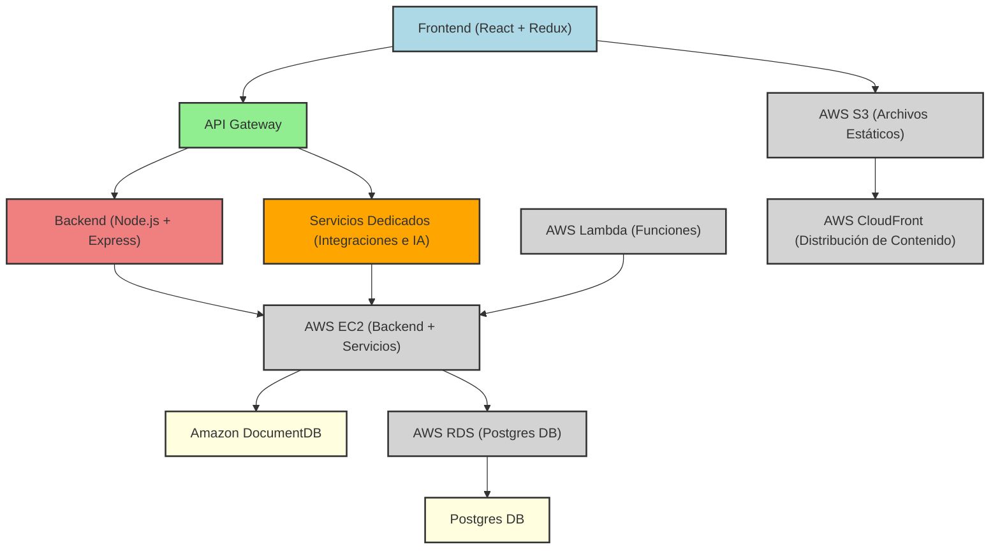
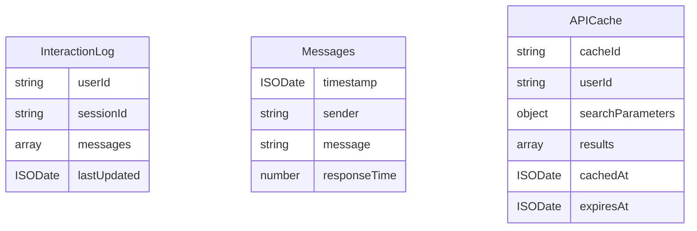

## Índice

0. [Ficha del proyecto](#0-ficha-del-proyecto)
1. [Descripción general del producto](#1-descripción-general-del-producto)
2. [Arquitectura del sistema](#2-arquitectura-del-sistema)
3. [Modelo de datos](#3-modelo-de-datos)
4. [Especificación de la API](#4-especificación-de-la-api)
5. [Historias de usuario](#5-historias-de-usuario)
6. [Tickets de trabajo](#6-tickets-de-trabajo)
7. [Pull requests](#7-pull-requests)

---

## 0. Ficha del proyecto

### **0.1. Tu nombre completo:**

María Pizarro Cuevas

### **0.2. Nombre del proyecto:**


### **0.3. Descripción breve del proyecto:**

IkiGoo tiene por objetivo simplificar y personalizar la planificación de viajes utilizando Inteligencia Artificial. Permitirá a los usuarios crear itinerarios de viaje adaptados a sus preferencias y necesidades específicas, desde la selección de destinos hasta la organización de actividades, transporte y alojamiento.

La IA actuará como un asistente personal de viaje, generando itinerarios optimizados basados en la información proporcionada por el usuario, como intereses, presupuesto y disponibilidad. Buscará ofrecer una experiencia de planificación eficiente, permitiendo a cualquier persona organizar sus viajes de manera rápida y sin complicaciones.

IkiGoo está pensada para ser una solución integral que facilita la creación de itinerarios únicos, asegurando que cada viaje sea una experiencia personalizada y acorde a las expectativas del usuario.

### **0.4. URL del proyecto:**

(WIP)

### 0.5. URL o archivo comprimido del repositorio

[Github Repository - AI4Devs-finalproject-MPC](https://github.com/Edain92/AI4Devs-finalproject-MPC)

---

## 1. Descripción general del producto

### **1.1. Objetivo:**

IkiGoo pretende transformar la planificación de viajes en una experiencia eficiente y altamente personalizada. Utilizando Inteligencia Artificial (IA), IkiGoo genera itinerarios de viaje optimizados que se adaptan a las preferencias y necesidades únicas de cada usuario. La IA de IkiGoo analiza una variedad de factores, como destinos, intereses, presupuesto y disponibilidad, para ofrecer un proceso de planificación fluido y completamente alineado con los deseos del viajero.

Esta aplicación actuará como un asistente personal de viaje, gestionando grandes volúmenes de datos y ofreciendo recomendaciones en tiempo real. A medida que el usuario interactúa con la aplicación, la IA ajustará sus sugerencias, mejorando continuamente la precisión y relevancia de los itinerarios. Esto asegura que cada viaje sea no solo bien organizado, sino también perfectamente ajustado a las expectativas del usuario.

**¿Qué Soluciona?**

Planificar un viaje puede ser un proceso complejo y estresante, que a menudo resulta en itinerarios genéricos que no reflejan lo que el viajero realmente desea. IkiGoo simplifica esta tarea, reuniendo toda la información necesaria en un solo lugar y generando itinerarios bien estructurados y personalizados con solo responder a unas pocas preguntas clave. De esta forma, el usuario ahorrará tiempo y reducirá el posible estrés asociado a la planificación, permitiendo que se concentre en disfrutar del viaje en lugar de preocuparse por los detalles logísticos.

**Público Objetivo**

IkiGoo está diseñado para cualquier persona interesada en viajar, independientemente de sus necesidades o el tipo de experiencia que busque. Desde viajeros solitarios y familias, hasta parejas, grupos de amigos y profesionales que viajan por negocios, IkiGoo ofrece una solución adaptable y eficiente para planificar todo tipo de itinerarios. La capacidad de la aplicación para ofrecer itinerarios personalizados asegura que cada usuario reciba una experiencia de viaje alineada con sus intereses y estilo de vida.

### **1.2. Características y funcionalidades principales:**

- **Interacción con la IA**: Los usuarios interactúan con la IA a través de un chat que les hace preguntas clave sobre sus preferencias y necesidades. La IA responde con itinerarios sugeridos que se pueden ajustar y personalizar aún más.
- **Acceso a Información en Tiempo Real**: La aplicación se conecta a diversas APIs para proporcionar datos actualizados sobre precios, disponibilidad de alojamiento, transporte y eventos.
- **Planificación de Itinerarios**: La aplicación permite a los usuarios crear, editar y guardar itinerarios de viaje personalizados. La IA sugiere opciones basadas en las respuestas del usuario y ajusta los planes en función de cambios en la disponibilidad o las preferencias del usuario.
- **Visualización de Itinerarios**: Los usuarios pueden ver un calendario de viajes que muestra sus itinerarios planificados, con la posibilidad de agregar y mover actividades según sus necesidades.
- **Revisión y Edición de Itinerarios**: Funcionalidad que permite a los usuarios revisar los itinerarios sugeridos, hacer modificaciones según sea necesario y recibir actualizaciones de la IA en tiempo real.
- **Personalización del Perfil**: Los usuarios pueden crear y modificar su perfil, donde especifican su información personal, preferencias de viaje, destinos favoritos y restricciones de presupuesto.

### **1.3. Diseño y experiencia de usuario:**

[Ver diseño completo](./docs/design.md)

### **1.4. Instrucciones de instalación:**

(WIP)

---

## 2. Arquitectura del Sistema

### **2.1. Diagrama de arquitectura**



La arquitectura del sistema de **IkiGoo** se ha diseñado para ser modular, escalable y eficiente, utilizando un enfoque de monolito modular. Esto facilita la implementación inicial del MVP, manteniendo la simplicidad y la cohesión, mientras se sientan las bases para una posible transición a un modelo de arquitectura más moderno en el futuro.

**Patrón Arquitectónico: Monolito Modular**

Se ha optado por un enfoque de monolito modular, donde el sistema está organizado en módulos independientes que manejan diferentes aspectos de la aplicación, pero que están unidos en una única base de código. Esta elección se ha dado por los siguientes motivos:
  - **Simplicidad y Rapidez de Desarrollo**: Para el **MVP**, un monolito modular permite un desarrollo más rápido y sencillo, sin la complejidad adicional que conlleva una arquitectura de microservicios.
  - **Cohesión y Facilidad de Mantenimiento**: Mantener toda la lógica del sistema en una base de código facilita la depuración y el mantenimiento en las primeras etapas del proyecto.
  - **Escalabilidad Futurible**: El diseño modular permite que, si el sistema crece en complejidad y demanda, se pueda descomponer en el futuro, por ejemplo, en microservicios, facilitando la transición sin grandes refactorizaciones.

**Desafíos**

- **Escalabilidad Limitada Inicialmente**: Un monolito modular puede volverse difícil de escalar a medida que crece el número de usuarios y la complejidad de las funciones, lo que podría requerir una refactorización significativa en el futuro.
- **Potencialmente Menor Resiliencia**: Si bien un monolito modular es más sencillo, también significa que todos los componentes están unidos; si una parte del sistema falla, podría impactar a todo el sistema.
- **Mayor Complejidad en la Transición**: Si se decide migrar a una arquitectura de microservicios, la transición podría requerir un esfuerzo considerable para dividir los módulos en servicios independientes.

A pesar de ello, este enfoque arquitectónico, junto con las tecnologías seleccionadas, permite a **IkiGoo** ofrecer una solución robusta y flexible, optimizada para un desarrollo rápido y eficaz del MVP, mientras que proporciona una base sólida para una evolución y escalabilidad futura.

### **2.2. Descripción de componentes principales:**

1. **Frontend (React + Redux)**: La interfaz de usuario será construida con React, biblioteca de JavaScript para construir interfaces de usuario de manera modular. Redux se utiliza para gestionar el estado global de la aplicación.
Estas herramientas proporcionan una experiencia interactiva y dinámica para los usuarios, permitiendo la planificación de itinerarios, gestión de perfiles y otras interacciones clave.
   - **Comunicación**: Interactuará con el API Gateway para enviar y recibir datos del backend.

2. **API Gateway**: Actuará como el único punto de entrada para todas las solicitudes desde el frontend hacia el backend. Su objetivo es controlar la autenticación, enrutamiento, y composición de respuestas, proporcionando una capa de seguridad y control de acceso centralizada.
   - **Comunicación**: Redirigirá las solicitudes al backend y a los servicios dedicados según corresponda.

3. **Backend (Node.js + Express)**: El núcleo del sistema será construido con Node.js, conocido entorno de ejecución de JavaScript que permite manejar múltiples conexiones simultáneas de manera eficiente. Express será el framework utilizado para manejar las rutas y la lógica de negocio.
   - **Comunicación**: Se conectará con las bases de datos (Postgres y Amazon DocumentDB) y con los servicios dedicados.

4. **Servicios Dedicados (Integraciones e IA)**: Servicios dentro del backend que gestionarán las integraciones con APIs externas (para obtener datos de vuelos, hoteles, eventos) y con la API de OpenAI para la generación de itinerarios personalizados mediante IA.
Serán los encargados de obtener, procesar y devolver datos en tiempo real, asegurando que la aplicación pueda ofrecer información precisa y recomendaciones personalizadas.
   - **Comunicación**: Se integrarán con el backend para procesar solicitudes específicas relacionadas con la obtención de datos y la personalización de itinerarios.

5. **Bases de Datos (Postgres + Amazon DocumentDB)**:
   - **Postgres**: Base de datos relacional utilizada para almacenar datos estructurados como usuarios e itinerarios. Esta garantiza la integridad referencial y maneja operaciones complejas de consulta y manipulación de datos.
     - **Comunicación**: Directamente con el backend para realizar operaciones CRUD.
   - **Amazon DocumentDB**: Base de datos NoSQL utilizada para almacenar datos no estructurados, como logs e historial de interacciones del usuario. Encargada de facilitar el almacenamiento y recuperación de datos semi-estructurados que no requieren una estructura rígida.
     - **Comunicación**: Gestionada directamente por el backend para operaciones que no requieren integridad referencial.

6. **Infraestructura en AWS**:
   - **EC2**: Hospedará el backend y los servicios dedicados en un entorno Dockerizado.
   - **Lambda**: Ejecutará funciones serverless para tareas específicas como la sincronización de datos.
   - **S3**: Almacenará archivos estáticos como imágenes y otros recursos necesarios para el frontend.
   - **RDS**: Administrará la base de datos relacional Postgres, facilitando su escalabilidad y gestión.
   - **CloudFront**: Acelerará la entrega de contenido estático a los usuarios finales.

### **2.3. Descripción de alto nivel del proyecto y estructura de ficheros**

> WIP: Representa la estructura del proyecto y explica brevemente el propósito de las carpetas principales, así como si obedece a algún patrón o arquitectura específica.

### **2.4. Infraestructura y despliegue**

> WIP: Detalla la infraestructura del proyecto, incluyendo un diagrama en el formato que creas conveniente, y explica el proceso de despliegue que se sigue

### **2.5. Seguridad**

> WIP: Enumera y describe las prácticas de seguridad principales que se han implementado en el proyecto, añadiendo ejemplos si procede

### **2.6. Tests**

> WIP: Describe brevemente algunos de los tests realizados

---

## 3. Modelo de Datos

### **3.1. Diagrama del modelo de datos:**

**Base de datos relacional: Postgres**


**Base de datos NoSQL: Amazon DocumentDB**



### **3.2. Descripción de entidades principales:**

**Base de datos relacional: Postgres**   

1. **User**: Representa al usuario que utiliza la aplicación.
    - **Atributos**:
        - `ID` (string, PK): Identificador único del usuario.
        - `Name` (string): Nombre del usuario.
        - `Email` (string, UK): Dirección de correo electrónico única del usuario.
        - `Password` (string): Contraseña cifrada del usuario.
        - `CreationDate` (date, not null): Fecha en la que se creó la cuenta del usuario.
        - `LastLogin` (date): Fecha de la última vez que el usuario inició sesión.
    - **Relaciones**:
        - Relación uno a muchos con `Trip` (Un usuario puede planificar múltiples viajes).
        - Relación uno a uno con `Preferences` (Un usuario tiene un conjunto de preferencias).

2. **Preferences**: Contiene las preferencias del usuario, como tipos de viajes, movilidad, alojamiento, y lugares favoritos o visitados.
    - **Atributos**:
        - `ID` (string, PK): Identificador único de las preferencias del usuario.
        - `UserID` (string, FK): Referencia al usuario asociado.
        - `Budget` (int, not null): Presupuesto máximo que el usuario desea gastar en sus viajes.
    - **Relaciones**:
        - Relación uno a muchos con `TravelPreference`, `MobilityPreference`, `AccommodationPreference`, `FavoritePlace`, y `VisitedPlace`.

3. **Trip**: Representa un viaje planificado por el usuario, que puede contener múltiples itinerarios.
    - **Atributos**:
        - `ID` (string, PK): Identificador único del viaje.
        - `UserID` (string, FK, not null): Referencia al usuario que planifica el viaje.
        - `Name` (string, not null): Nombre del viaje.
        - `StartDate` (date, not null): Fecha de inicio del viaje.
        - `EndDate` (date): Fecha de finalización del viaje.
        - `Description` (string): Descripción opcional del viaje.
    - **Relaciones**:
        - Relación uno a muchos con `Itinerary` (Un viaje puede contener múltiples itinerarios).

4. **Itinerary**: Representa un itinerario dentro de un viaje, que incluye actividades, transportes y alojamientos específicos.
    - **Atributos**:
        - `ID` (string, PK): Identificador único del itinerario.
        - `TripID` (string, FK, not null): Referencia al viaje asociado.
        - `Destination` (string, not null): Destino del itinerario.
        - `StartDate` (date, not null): Fecha de inicio del itinerario.
        - `EndDate` (date): Fecha de finalización del itinerario.
        - `Description` (string): Descripción opcional del itinerario.
    - **Relaciones**:
        - Relación uno a muchos con `Activity`, `Transport`, y `Accommodation` (Un itinerario incluye múltiples actividades, transportes, y alojamientos).

5. **Activity**: Representa una actividad específica dentro de un itinerario, como visitas turísticas, eventos, etc.
    - **Atributos**:
        - `ID` (string, PK): Identificador único de la actividad.
        - `ItineraryID` (string, FK, not null): Referencia al itinerario asociado.
        - `Name` (string, not null): Nombre de la actividad.
        - `Description` (string): Descripción opcional de la actividad.
        - `Sequence` (int, not null): Orden de ejecución de la actividad dentro del itinerario.
        - `DateTime` (date, not null): Fecha y hora en que se llevará a cabo la actividad.
    - **Relaciones**:
        - Relación muchos a uno con `Itinerary` (Una actividad pertenece a un solo itinerario).

6. **Transport**: Representa un medio de transporte utilizado en un itinerario, como vuelos, trenes, etc.
    - **Atributos**:
        - `ID` (string, PK): Identificador único del transporte.
        - `ItineraryID` (string, FK, not null): Referencia al itinerario asociado.
        - `Type` (string, not null): Tipo de transporte (ej., vuelo, tren, coche, etc.).
        - `Description` (string): Descripción opcional del transporte.
        - `Origin` (string, not null): Lugar de origen del transporte.
        - `Destination` (string, not null): Lugar de destino del transporte.
        - `Sequence` (int, not null): Orden de ejecución del transporte dentro del itinerario.
        - `DepartureDate` (date, not null): Fecha y hora de salida.
        - `ArrivalDate` (date, not null): Fecha y hora de llegada.
    - **Relaciones**:
        - Relación muchos a uno con `Itinerary` (Un transporte pertenece a un solo itinerario).

7. **Accommodation**: Representa el alojamiento del usuario durante un itinerario, como un hotel o apartamento.
    - **Atributos**:
        - `ID` (string, PK): Identificador único del alojamiento.
        - `ItineraryID` (string, FK, not null): Referencia al itinerario asociado.
        - `Name` (string, not null): Nombre del alojamiento.
        - `Address` (string): Dirección del alojamiento.
        - `Sequence` (int, not null): Orden de ejecución del alojamiento dentro del itinerario.
        - `CheckInDate` (date, not null): Fecha y hora de check-in.
        - `CheckOutDate` (date, not null): Fecha y hora de check-out.
    - **Relaciones**:
        - Relación muchos a uno con `Itinerary` (Un alojamiento pertenece a un solo itinerario).

8. **City**: Representa una ciudad que puede ser favorita o visitada por el usuario.
    - **Atributos**:
        - `ID` (string, PK): Identificador único de la ciudad.
        - `Name` (string, not null): Nombre de la ciudad.
    - **Relaciones**:
        - Relación uno a muchos con `FavoritePlace` y `VisitedPlace` (Una ciudad puede ser favorita o visitada por múltiples usuarios).

9. **TravelPreference, MobilityPreference, AccommodationPreference, FavoritePlace, VisitedPlace**: Entidades que almacenan las preferencias del usuario relacionadas con tipos de viajes, movilidad, alojamiento, y lugares favoritos o visitados.
    - **Atributos**:
        - `ID` (string, PK): Identificador único de la preferencia.
        - `PreferencesID` (string, FK, not null): Referencia a la entidad `Preferences`.
        - `TravelTypeID` / `MobilityTypeID` / `AccommodationTypeID` / `CityID` (string, FK, not null): Referencia a las entidades `TravelType`, `MobilityType`, `AccommodationType`, o `City`.
    - **Relaciones**:
        - Relación muchos a uno con `Preferences` (Una preferencia pertenece a un solo conjunto de preferencias).
        - Relación uno a uno con `TravelType`, `MobilityType`, `AccommodationType`, o `City` (Una preferencia está relacionada con un solo tipo o ciudad).

**Base de datos NoSQL: Amazon DocumentDB**   

1. **InteractionLog**: Entidad que almacena los registros de interacción del usuario con la IA, incluyendo el historial de mensajes intercambiados durante una sesión de chat.
    - **Atributos**:
        - `userId` (string): Identificador único del usuario que participó en la sesión de chat.
        - `sessionId` (string): Identificador único de la sesión de chat.
        - `messages` (array): Lista de mensajes intercambiados durante la sesión.
            - `timestamp` (ISODate): Fecha y hora en que se envió el mensaje.
            - `sender` (string): Identifica si el mensaje fue enviado por el usuario o por la IA.
            - `message` (string): Contenido textual del mensaje.
            - `responseTime` (number): Tiempo de respuesta de la IA en milisegundos.
        - `lastUpdated` (ISODate): Fecha y hora de la última actualización del registro.

2. **Messages**: Subdocumento dentro de la entidad `InteractionLog` que almacena los detalles de cada mensaje intercambiado durante una sesión de chat con la IA.
    - **Atributos**:
        - `timestamp` (ISODate): Fecha y hora en que se envió el mensaje.
        - `sender` (string): Identifica si el mensaje fue enviado por el usuario o por la IA.
        - `message` (string): Contenido textual del mensaje.
        - `responseTime` (number): Tiempo de respuesta de la IA en milisegundos.

3. **APICache**: Entidad que almacena temporalmente los resultados de las consultas realizadas a las APIs externas, optimizando el rendimiento y reduciendo la necesidad de hacer múltiples llamadas a la misma API.
    - **Atributos**:
        - `cacheId` (string): Identificador único del registro de caché.
        - `userId` (string): Identificador único del usuario que realizó la consulta.
        - `searchParameters` (object): Conjunto de parámetros utilizados en la consulta a la API.
        - `results` (array): Lista de resultados devueltos por la API.
        - `cachedAt` (ISODate): Fecha y hora en que los datos fueron almacenados en la caché.
        - `expiresAt` (ISODate): Fecha y hora en que los datos de la caché caducan y deben ser eliminados o actualizados.

---

## 4. Especificación de la API

### 1. **Creación de un Usuario y sus Preferencias**: `POST /users`

Este endpoint permite la creación de un nuevo usuario junto con sus preferencias.

```yaml
paths:
  /users:
    post:
      summary: "Create a new user with preferences"
      requestBody:
        description: "User data with preferences"
        required: true
        content:
          application/json:
            schema:
              type: object
              properties:
                name:
                  type: string
                  example: "John Doe"
                email:
                  type: string
                  format: email
                  example: "johndoe@example.com"
                password:
                  type: string
                  example: "password123"
                preferences:
                  type: object
                  properties:
                    budget:
                      type: integer
                      example: 1500
                    travelPreferences:
                      type: array
                      items:
                        type: string
                      example: ["Gastronomic", "Cultural"]
                    mobilityPreferences:
                      type: array
                      items:
                        type: string
                      example: ["Car", "Train"]
                    accommodationPreferences:
                      type: array
                      items:
                        type: string
                      example: ["Hotel", "Apartment"]
                    favoritePlaces:
                      type: array
                      items:
                        type: string
                      example: ["Paris", "New York"]
                    visitedPlaces:
                      type: array
                      items:
                        type: string
                      example: ["Berlin", "Tokyo"]
      responses:
        '201':
          description: "User created successfully"
          content:
            application/json:
              schema:
                type: object
                properties:
                  id:
                    type: string
                    example: "12345"
                  name:
                    type: string
                    example: "John Doe"
                  email:
                    type: string
                    format: email
                    example: "johndoe@example.com"
                  preferences:
                    type: object
                    properties:
                      budget:
                        type: integer
                        example: 1500
                      travelPreferences:
                        type: array
                        items:
                          type: string
                        example: ["Gastronomic", "Cultural"]
                      mobilityPreferences:
                        type: array
                        items:
                          type: string
                        example: ["Car", "Train"]
                      accommodationPreferences:
                        type: array
                        items:
                          type: string
                        example: ["Hotel", "Apartment"]
                      favoritePlaces:
                        type: array
                        items:
                          type: string
                        example: ["Paris", "New York"]
                      visitedPlaces:
                        type: array
                        items:
                          type: string
                        example: ["Berlin", "Tokyo"]
        '400':
          description: "Invalid input"
```

**Ejemplo de Petición:**
```json
{
  "name": "John Doe",
  "email": "johndoe@example.com",
  "password": "password123",
  "preferences": {
    "budget": 1500,
    "travelPreferences": ["Gastronomic", "Cultural"],
    "mobilityPreferences": ["Car", "Train"],
    "accommodationPreferences": ["Hotel", "Apartment"],
    "favoritePlaces": ["Paris", "New York"],
    "visitedPlaces": ["Berlin", "Tokyo"]
  }
}
```

**Ejemplo de Respuesta:**
```json
{
  "id": "12345",
  "name": "John Doe",
  "email": "johndoe@example.com",
  "preferences": {
    "budget": 1500,
    "travelPreferences": ["Gastronomic", "Cultural"],
    "mobilityPreferences": ["Car", "Train"],
    "accommodationPreferences": ["Hotel", "Apartment"],
    "favoritePlaces": ["Paris", "New York"],
    "visitedPlaces": ["Berlin", "Tokyo"]
  }
}
```

### 2. **Obtención de un Viaje Completo**: `GET /trips/{tripId}`

Este endpoint permite obtener la información completa de un viaje, incluyendo sus itinerarios y todos los detalles relacionados.

```yaml
paths:
  /trips/{tripId}:
    get:
      summary: "Get a complete trip with itineraries"
      parameters:
        - name: tripId
          in: path
          required: true
          description: "ID of the trip to retrieve"
          schema:
            type: string
            example: "12345"
      responses:
        '200':
          description: "Trip retrieved successfully"
          content:
            application/json:
              schema:
                type: object
                properties:
                  id:
                    type: string
                    example: "12345"
                  name:
                    type: string
                    example: "European Adventure"
                  startDate:
                    type: string
                    format: date
                    example: "2024-08-01"
                  endDate:
                    type: string
                    format: date
                    example: "2024-08-15"
                  description:
                    type: string
                    example: "A journey through Europe visiting multiple cities."
                  itineraries:
                    type: array
                    items:
                      type: object
                      properties:
                        id:
                          type: string
                          example: "123"
                        destination:
                          type: string
                          example: "Paris"
                        startDate:
                          type: string
                          format: date
                          example: "2024-08-01"
                        endDate:
                          type: string
                          format: date
                          example: "2024-08-03"
                        description:
                          type: string
                          example: "Visit to Paris including museums, a city tour, and more."
                        activities:
                          type: array
                          items:
                            type: object
                            properties:
                              id:
                                type: string
                                example: "1"
                              name:
                                type: string
                                example: "Louvre Museum Tour"
                              description:
                                type: string
                                example: "A guided tour through the Louvre."
                              dateTime:
                                type: string
                                format: date-time
                                example: "2024-08-01T10:00:00Z"
                        accommodations:
                          type: array
                          items:
                            type: object
                            properties:
                              id:
                                type: string
                                example: "1"
                              name:
                                type: string
                                example: "Hotel Paris"
                              address:
                                type: string
                                example: "123 Paris St, Paris, France"
                              checkInDate:
                                type: string
                                format: date-time
                                example: "2024-08-01T14:00:00Z"
                              checkOutDate:
                                type: string
                                format: date-time
                                example: "2024-08-03T11:00:00Z"
                        transports:
                          type: array
                          items:
                            type: object
                            properties:
                              id:
                                type: string
                                example: "1"
                              type:
                                type: string
                                example: "Flight"
                              description:
                                type: string
                                example: "Flight from Madrid to Paris"
                              origin:
                                type: string
                                example: "Madrid"
                              destination:
                                type: string
                                example: "Paris"
                              departureDate:
                                type: string
                                format: date-time
                                example: "2024-08-01T08:00:00Z"
                              arrivalDate:
                                type: string
                                format: date-time
                                example: "2024-08-01T10:00:00Z"
        '404':
          description: "Trip not found"
```

**Ejemplo de Petición:**
```http
GET /trips/12345
```

**Ejemplo de Respuesta:**
```json
{
  "id": "12345",
  "name": "European Adventure",
  "startDate": "2024-08-01",
  "endDate": "2024-08-15",
  "description": "A journey through Europe visiting multiple cities.",
  "itineraries": [
    {
      "id": "123",
      "destination": "Paris",
      "startDate": "2024-08-01",
      "endDate": "2024-08-03",
      "description": "Visit to Paris including museums, a city tour, and more.",
      "activities": [
        {
          "id": "1",
          "name": "Louvre Museum Tour",
          "description": "A guided tour through the Louvre.",
          "dateTime": "2024-08-01T10:00:00Z"
        }
      ],
      "accommodations": [
        {
          "id": "1",
          "name": "Hotel Paris",
          "address": "123 Paris St, Paris, France",
          "checkInDate": "2024-08-01T14:00:00Z",
          "checkOutDate": "2024-08-03T11:00:00Z"
        }
      ],
      "transports": [
        {
          "id": "1",
          "type": "Flight",
          "description": "Flight from Madrid to Paris",
          "origin": "Madrid",
          "destination": "Paris",
          "departureDate": "2024-08-01T08:00:00Z",
          "arrivalDate": "2024-08-01T10:00:00Z"
        }
      ]
    }
  ]
}
```

---

### 3. **Gestión de Itinerarios dentro de un Viaje**: `POST /trips/{tripId}/itineraries`

Este endpoint permite la creación de un nuevo itinerario dentro de un viaje existente.

```yaml
paths:
  /trips/{tripId}/itineraries:
    post:
      summary: "Create a new itinerary within a trip"
      parameters:
        - name: tripId
          in: path
          required: true
          description: "ID of the trip to which the itinerary will be added"
          schema:
            type: string
            example: "12345"
      requestBody:
        description: "Itinerary data"
        required: true
        content:
          application/json:
            schema:
              type: object
              properties:
                destination:
                  type: string
                  example: "Paris"
                startDate:
                  type: string
                  format: date
                  example: "2024-08-01"
                endDate:
                  type: string
                  format: date
                  example: "2024-08-03"
                description:
                  type: string
                  example: "Visit to Paris including museums, a city tour, and more."
      responses:
        '201':
          description: "Itinerary created successfully"
          content:
            application/json:
              schema:
                type: object
                properties:
                  id:
                    type: string
                    example: "123"
                  destination:
                    type: string
                    example: "Paris"
                  startDate:
                    type: string
                    format: date
                    example: "2024-08-01"
                  endDate:
                    type: string
                    format: date
                    example: "2024-08-03"
                  description:
                    type: string
                    example: "Visit to Paris including museums, a city tour, and more."
        '400':
          description: "Invalid input"
```

**Ejemplo de Petición:**
```http
POST /trips/12345/itineraries
```

```json
{
  "destination": "Paris",
  "startDate": "2024-08-01",
  "endDate": "2024-08-03",
  "description": "Visit to Paris including museums, a city tour, and more."
}
```

**Ejemplo de Respuesta:**
```json
{
  "id": "123",
  "destination": "Paris",
  "startDate": "2024-08-01",
  "endDate": "2024-08-03",
  "description": "Visit to Paris including museums, a city tour, and more."
}
```

---

## 5. Historias de Usuario

1. **Configuración del Proyecto y Arranque Inicial**
    - **Título:** Configuración del entorno de desarrollo, bases de datos y arranque del proyecto.
    - **Como:** Equipo de DevOps y equipo de desarrollo
    - **Quiero:** Configurar el entorno de desarrollo con las bases de datos necesarias, y asegurarme de que el proyecto se pueda arrancar correctamente.
    - **Para:** Que el equipo pueda empezar a desarrollar y probar funcionalidades sin problemas.

    **Criterios de Aceptación:**
      1. **Dado que** el repositorio ha sido clonado, **cuando** se ejecuta el script de inicialización, **entonces** el entorno debe configurarse correctamente incluyendo las variables de entorno en un archivo `.env`.
      2. **Dado que** las bases de datos están configuradas, **cuando** se ejecuta el script de arranque, **entonces** las migraciones en Postgres deben completarse sin errores y las conexiones a Amazon DocumentDB deben estar activas.
      3. **Dado que** el proyecto está configurado, **cuando** se arranca, **entonces** todas las conexiones a APIs externas deben estar disponibles.
      4. **Dado que** la documentación está disponible, **cuando** un nuevo desarrollador se une al equipo, **entonces** debe poder replicar el entorno y arrancar el proyecto siguiendo las instrucciones proporcionadas.

    **Estimación:** 12 horas

2. **Registro de Usuario**
    - **Título**: Registro de un nuevo usuario.
    - **Como**: Un usuario nuevo
    - **Quiero**: Poder registrarme en la aplicación.
    - **Para**: Poder usar la aplicación.

    **Criterios de Aceptación:**
      1. **Dado que** el usuario completa el formulario de registro, **cuando** se envía el formulario, **entonces** el sistema debe validar los campos obligatorios y mostrar errores en caso de datos faltantes.
      2. **Dado que** el registro es exitoso, **cuando** se guardan los datos en la base de datos, **entonces** se debe enviar un correo de confirmación al usuario.

    **Estimación:** 8 horas


3. **Creación de un Viaje**
    - **Título**: Creación de un nuevo viaje y almacenamiento de preferencias iniciales.
    - **Como**: Un usuario registrado
    - **Quiero**: Crear un nuevo viaje en la aplicación
    - **Para**: Planificar y organizar todas las etapas y detalles del próximo viaje, incluyendo las preferencias personales si es la primera interacción.

    **Criterios de Aceptación:**
      1. **Dado que** el usuario desea planificar un nuevo viaje, **cuando** accede a la opción de crear un viaje, **entonces** debe poder ingresar detalles como el nombre del viaje, fechas de inicio y fin, y una descripción general.
      2. **Dado que** es la primera interacción del usuario con la aplicación, **cuando** se inicie la creación del viaje, **entonces** el sistema debe hacer preguntas iniciales sobre las preferencias de viaje del usuario (como presupuesto, tipo de turismo, movilidad preferida) y almacenar estas preferencias en la base de datos.
      3. **Dado que** el usuario ha ingresado la información del viaje, **cuando** guarda el viaje, **entonces** el sistema debe validar los datos (por ejemplo, que las fechas de inicio y fin sean válidas) y almacenar la información en la base de datos.
      4. **Dado que** el viaje ha sido creado, **cuando** el usuario visualiza su lista de viajes, **entonces** el nuevo viaje debe aparecer en la lista con la opción de agregar itinerarios y detalles adicionales.

    **Estimación:** 10 horas.

4. **Creación de un Itinerario dentro de un Viaje**
    - **Título**: Creación de un itinerario personalizado dentro de un viaje existente.
    - **Como**: Un usuario registrado
    - **Quiero**: Poder crear un nuevo itinerario dentro de uno de mis viajes, definiendo las fechas, el destino, y las actividades planificadas.
    - **Para**: Organizar mejor mi viaje y asegurarme de que cada etapa esté bien planificada.

    **Criterios de Aceptación:**
    1. **Dado que** el usuario está creando un itinerario, **cuando** define las fechas y el destino, **entonces** el sistema debe validar la disponibilidad de esas fechas dentro del viaje.
    2. **Dado que** el itinerario incluye actividades, **cuando** se añaden, **entonces** estas deben estar ordenadas cronológicamente y permitir ajustes.
    3. **Dado que** el usuario guarda el itinerario, **cuando** lo visualiza posteriormente, **entonces** debe poder editar y actualizar la información sin perder datos previos.

    **Estimación:** 7 horas

---

## 6. Tickets de Trabajo

### **Ticket 1: Bases de Datos**

**Título:** Creación de la Estructura para Almacenar Usuarios y Preferencias

**Descripción:**
- **Propósito:** Diseñar y crear las tablas necesarias en Postgres para almacenar los datos de los usuarios y sus preferencias de viaje. Esto incluye la implementación de las relaciones y claves foráneas necesarias para asegurar la integridad referencial de los datos.
- **Detalles Específicos:** Se deben crear las tablas `Users`, `Preferences`, `TravelPreference`, `MobilityPreference`, `AccommodationPreference`, `FavoritePlace`, y `VisitedPlace`. Cada tabla de preferencias debe estar relacionada con la tabla `Users` a través de claves foráneas. Asegurar que las restricciones (como `NOT NULL`, `UNIQUE`) se implementen donde sea necesario.

**Criterios de Aceptación:**
1. **Dado que** el equipo de desarrollo necesita almacenar usuarios y sus preferencias, **cuando** se crean las tablas y las relaciones, **entonces** las claves foráneas deben estar correctamente implementadas y asegurar la integridad referencial.
2. **Dado que** las tablas han sido creadas, **cuando** se ejecutan las migraciones, **entonces** no deben producirse errores y las estructuras deben estar listas para manejar datos reales.
3. **Dado que** los datos de usuarios y preferencias se insertan, **cuando** se realizan consultas a la base de datos, **entonces** los datos deben ser accesibles y estar correctamente relacionados.

|  Prioridad | Estimación  | Asignado a | Etiquetas |
|---|---|---|---|
|  Alta | 7 horas | Equipo de Bases de Datos | Database, Postgres, Usuarios, Preferencias, Sprint 1 |

**Comentarios:**
- Asegurarse de que el modelo de datos relacional sigue las mejores prácticas y está optimizado para consultas frecuentes.
- Coordinar con los equipos de frontend y backend para validar los esquemas y relaciones de datos.

### **Ticket 2: Backend**

**Título:** Implementación de Autenticación y Autorización de Usuarios

**Descripción:**
- **Propósito:** Desarrollar los endpoints necesarios para la autenticación y autorización de usuarios en la aplicación. Esto incluye la implementación de login y logout, así como la gestión de sesiones mediante JWT (JSON Web Tokens) para asegurar que solo los usuarios autenticados puedan acceder a funcionalidades protegidas.
- **Detalles Específicos:** Crear un endpoint para el login que acepte el correo electrónico y la contraseña del usuario, validando estas credenciales y, si son correctas, devolviendo un JWT. También se debe implementar un endpoint de logout que invalide el token. Asegurar que todas las rutas protegidas del backend solo sean accesibles para usuarios autenticados.

**Criterios de Aceptación:**
1. **Dado que** un usuario intenta iniciar sesión, **cuando** envía sus credenciales a través del endpoint de login, **entonces** el sistema debe validar las credenciales y devolver un JWT si son correctas.
2. **Dado que** un usuario ha iniciado sesión correctamente, **cuando** intenta acceder a una ruta protegida, **entonces** el sistema debe verificar el JWT y permitir el acceso solo si el token es válido.
3. **Dado que** un usuario desea cerrar sesión, **cuando** envía una solicitud al endpoint de logout, **entonces** el sistema debe invalidar el JWT y revocar el acceso a rutas protegidas.

|  Prioridad | Estimación  | Asignado a | Etiquetas |
|---|---|---|---|
|  Alta | 8 horas | Equipo de Backend | Backend, Seguridad, Autenticación, Sprint 1 |

**Comentarios:**
- Considerar la implementación de una estrategia de refresh tokens para mantener la sesión activa.
- Revisar las mejores prácticas de seguridad para la gestión de JWT.

### **Ticket 3: Frontend**

**Título:** Implementación de la Interfaz de Registro de Usuario

**Descripción:**
- **Propósito:** Desarrollar el formulario de registro que permitirá a nuevos usuarios registrarse en la aplicación, incluyendo validaciones de campos obligatorios y mensajes de error en tiempo real. Este formulario debe estar vinculado con la API de registro para enviar los datos del usuario al backend.
- **Detalles Específicos:** El formulario debe incluir campos como nombre, correo electrónico, contraseña, y confirmación de contraseña. Se deben implementar validaciones en tiempo real para campos vacíos, formatos incorrectos, y contraseñas no coincidentes. Al enviar el formulario, se debe realizar una petición POST a la API para registrar al usuario.

**Criterios de Aceptación:**
1. **Dado que** un usuario accede a la página de registro, **cuando** completa el formulario de registro, **entonces** el sistema debe validar los campos obligatorios (nombre, correo electrónico, contraseña, confirmación de contraseña).
2. **Dado que** el usuario ingresa datos incorrectos (por ejemplo, un formato de correo electrónico inválido o contraseñas que no coinciden), **cuando** intenta enviar el formulario, **entonces** el sistema debe mostrar mensajes de error en tiempo real y evitar que se envíe la información hasta que se corrijan.
3. **Dado que** los datos del formulario son válidos, **cuando** el usuario envía el formulario, **entonces** el sistema debe realizar una petición POST a la API de registro y manejar la respuesta (mostrar mensajes de éxito o error según corresponda).

|  Prioridad | Estimación  | Asignado a | Etiquetas |
|---|---|---|---|
|  Alta | 6 horas | Equipo de Frontend | Frontend, UI, Registro, Sprint 1 |

**Comentarios:**
- Asegurarse de que el diseño del formulario sigue las guías de estilo del proyecto.
- Coordinar con el equipo de backend para asegurarse de que la API de registro esté lista y documentada.

---

## 7. Pull Requests

**Pull Request 1**

**Pull Request 2**

**Pull Request 3**
