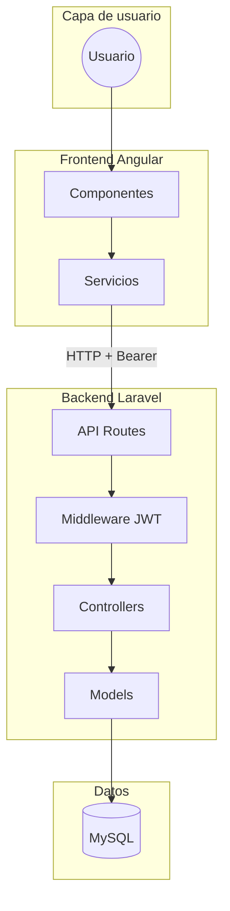
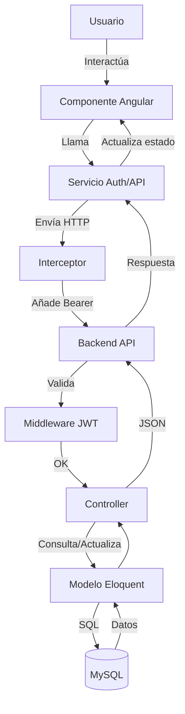
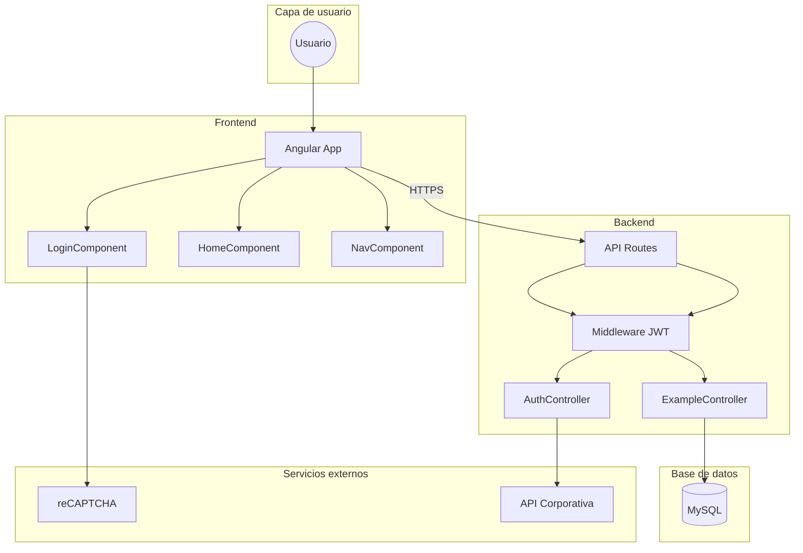
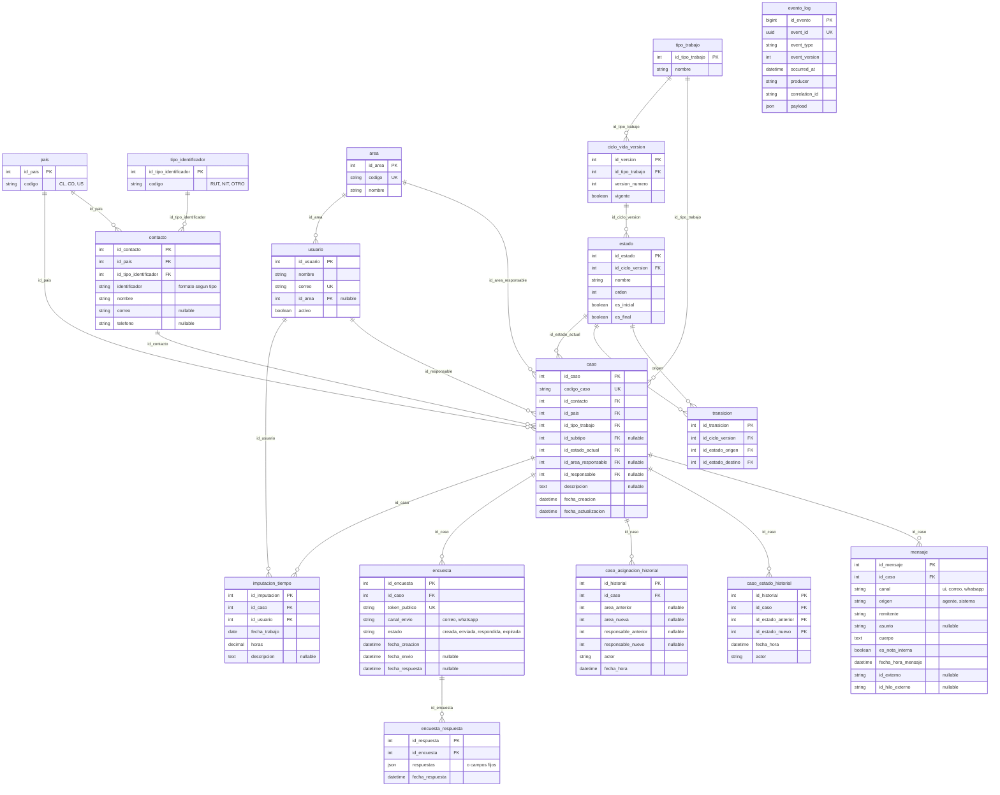

## Índice

0. [Ficha del proyecto](#0-ficha-del-proyecto)
1. [Descripción general del producto](#1-descripción-general-del-producto)
2. [Arquitectura del sistema](#2-arquitectura-del-sistema)
3. [Modelo de datos](#3-modelo-de-datos)
4. [Especificación de la API](#4-especificación-de-la-api)
5. [Historias de usuario](#5-historias-de-usuario)
6. [Tickets de trabajo](#6-tickets-de-trabajo)
7. [Pull requests](#7-pull-requests)

---

## 0. Ficha del proyecto

### **0.1. Tu nombre completo:**
José Miguel Padilla Mundaca

### **0.2. Nombre del proyecto:**
**TAKUMI**

*Siglas:* **T**icket, **A**ssignment, **K**nowledge base, **U**nified **M**anagement **I**nterface.

### **0.3. Descripción breve del proyecto:**
Sistema único e integrado que unifica la gestión de requerimientos, incidentes, proyectos y actividades internas (reemplazando Whaticket, OTRS/Znuny y SIHR), con imputación de tiempo, ciclos de vida configurables, SLA por hitos, encuestas post-cierre y trazabilidad completa para las áreas de Desarrollo (DII), Soporte TI y Procesos.

### **0.4. URL del proyecto:**
https://aplicaciones.kibernum.com/takumi

**Acceso demo (para evaluadores):**
- **Correo:** demo@lidr.com  
- **Contraseña:** lidrjp2026

### **0.5. URL o archivo comprimido del repositorio**
Archivo comprimido del código del proyecto (raíz del repositorio): [takumi-main.zip](takumi-main.zip).

> Cuando exista repositorio en línea, puede estar en público o en privado; comparte los accesos de forma segura o usa este zip con el contenido del proyecto.


---

## 1. Descripción general del producto

> Describe en detalle los siguientes aspectos del producto:

### **1.1. Objetivo:**

El producto tiene como propósito ofrecer un **sistema único e integrado** que permita gestionar requerimientos, incidentes, proyectos y actividades internas, junto con la imputación de horas, para las áreas de Desarrollo Informático (DII), Soporte TI y Procesos.
**Valor que aporta:** elimina la fragmentación de herramientas actuales (Whaticket, OTRS/Znuny, SIHR), asegura trazabilidad completa, auditoría confiable y soporte efectivo a la mejora continua, sin sobrecargar la operación diaria.
**Para quién:** usuarios internos de la organización (solicitantes, agentes, encargados de área, auditoría y administración).

### **1.2. Características y funcionalidades principales:**

- **Unificación del trabajo:** Un solo punto de ingreso; gestión del ciclo de vida completa y configurable por tipo de trabajo (Incidente, Solicitud de servicio, Contingencia, Requerimiento, Proyecto, Actividad de procesos).
- **Ciclos de vida:** Cada tipo tiene su propio ciclo de vida con estados y transiciones configurables (sin saltos ni retrocesos); reasignaciones sin cambiar estado.
- **Roles y permisos:** Usuario Solicitante, Agentes por área (Soporte TI, DII, Procesos), Encargado de Área, Jefe de Área, Jefa de Gobierno TI, Auditor, Administrador; administración centralizada, mínimo privilegio, auditoría obligatoria.
- **Canales de entrada:** Correo (creación automática de casos en MVP), mensajería interna, portal/formularios internos, creación interna por roles; todos con trazabilidad completa.
- **Comunicaciones:** Notificaciones por eventos; mensajes y notas internas asociadas al caso; distinción entre comunicación con solicitante y notas internas.
- **Asignaciones:** Asignación y reasignación de área responsable y de responsable (usuario), con historial inmutable.
- **SLA multi-hito:** SLA configurables por tipo/subtipo/área (desde ingreso, desde asignación a área, a responsable, desde primera acción); alertas por vencer e incumplimiento.
- **Imputación de tiempo:** Configurable por tipo de trabajo; asociada a caso, usuario y área; consolidación de esfuerzo.
- **Encuestas post-cierre:** CSAT por caso; disparador al cierre; envío por correo (MVP); respuesta sin login; reportería agregada.
- **Cierre automático por inactividad:** Regla configurable (ej. 14 días sin respuesta); cierre con motivo auditable.
- **Evidencia y auditoría:** Historial de estados y asignaciones; registro de acciones relevantes; evento_log para trazabilidad.
- **Métricas estándar:** Volumen (casos creados/cerrados, backlog), tiempos de ciclo, cumplimiento SLA, horas imputadas, calidad (encuestas, reaperturas), consolidados por área.

### **1.3. Diseño y experiencia de usuario:**
Pendiente (hasta disponer de versión desplegada con flujos principales).

### **1.4. Instrucciones de instalación:**

Las instrucciones de instalación detalladas están en el **README.md del proyecto** (el que viene dentro del zip con el código). Resumen:

**Cómo ejecutar (instalación y puesta en marcha)**

**Con Docker (recomendado)**

```bash
docker compose up -d
```

Frontend y backend quedan en los puertos definidos en `docker-compose.yml` (por defecto frontend 4200, backend 8000). Los puertos del proyecto se definen en `.project-config`.

**Sin Docker**

*Backend (Laravel):*

```bash
cd takumi-backend
cp .env.example .env
php artisan key:generate
# Configurar .env (DB_*, APP_URL, etc.)
composer install
php artisan db:create
php artisan migrate --seed
php artisan serve --host=0.0.0.0 --port=3232
```

*Frontend (Angular):*

```bash
cd takumi-frontend
npm install
npm start
```

Los puertos se definen en `.project-config` (ej. `FRONTEND_PORT=3131`, `BACKEND_PORT=3232`). Para acceso remoto: backend con `--host=0.0.0.0` y frontend con `ng serve --host 0.0.0.0 --disable-host-check --port=<FRONTEND_PORT>`.

**Permisos y propiedad del proyecto**

No ejecutar con sudo. Si hay archivos con propietario root:

```bash
sudo ./scripts/fix-project-ownership.sh
```

**Despliegue en producción**

```bash
docker compose -f docker-compose.prod.yml up -d --build
```

Guía detallada: `docs/guias/DESPLIEGUE_PRODUCCION.md` (dentro del zip del proyecto).

> **Nota:** Todo lo anterior está en el README.md del código del proyecto, sección «Cómo ejecutar» (aprox. líneas 399–430). El backend requiere configurar `.env` (BD, APP_URL, etc.) antes de `composer install` y migraciones.

---

## 2. Arquitectura del Sistema

> Esta sección refleja la **arquitectura actual** del proyecto TAKUMI (frontend Angular + API Laravel, autenticación JWT), según el README del código del proyecto.

---

### **2.1. Patrón arquitectónico**

Se utiliza una arquitectura en capas: cliente Angular consume la API REST de Laravel; las peticiones pasan por middleware (throttle, JWT); los controladores delegan en servicios y modelos; la persistencia está en MySQL.


```mermaid
graph TB
    subgraph Cliente["Capa de usuario"]
        User((Usuario))
    end
    subgraph Frontend["Frontend Angular"]
        UI[Componentes]
        SVC[Servicios]
        UI --> SVC
    end
    subgraph Backend["Backend Laravel"]
        API[API Routes]
        MW[Middleware JWT]
        CTRL[Controllers]
        MOD[Models]
        API --> MW --> CTRL --> MOD
    end
    subgraph Datos["Datos"]
        DB[(MySQL)]
    end
    User --> UI
    SVC -->|HTTP + Bearer| API
    MOD --> DB
```

---

### **2.2. Flujo de datos**

El flujo típico: el usuario interactúa con un componente Angular; el servicio llama al API mediante HTTP; el interceptor añade el token Bearer; el backend valida JWT, ejecuta el controlador y el modelo accede a la BD; la respuesta vuelve al frontend.


```mermaid
graph TD
    A[Usuario] -->|Interactúa| B[Componente Angular]
    B -->|Llama| C[Servicio Auth/API]
    C -->|Envía HTTP| D[Interceptor]
    D -->|Añade Bearer| E[Backend API]
    E -->|Valida| F[Middleware JWT]
    F -->|OK| G[Controller]
    G -->|Consulta/Actualiza| H[Modelo Eloquent]
    H -->|SQL| I[(MySQL)]
    I -->|Datos| H
    H --> G
    G -->|JSON| E
    E -->|Respuesta| C
    C -->|Actualiza estado| B
```

---

### **2.3. Arquitectura contextual completa**

Visión integrada: usuario, frontend, backend, base de datos y servicios externos (reCAPTCHA, API corporativa).


```mermaid
graph TB
    subgraph Usuario["Capa de usuario"]
        U((Usuario))
    end
    subgraph Frontend["Frontend"]
        A[Angular App]
        A1[LoginComponent]
        A2[HomeComponent]
        A3[NavComponent]
        A --> A1
        A --> A2
        A --> A3
    end
    subgraph Backend["Backend"]
        R[API Routes]
        M[Middleware JWT]
        C[AuthController]
        E[ExampleController]
        R --> M --> C
        R --> M --> E
    end
    subgraph BD["Base de datos"]
        MySQL[(MySQL)]
    end
    subgraph Externos["Servicios externos"]
        RC[reCAPTCHA]
        CORP[API Corporativa]
    end
    U --> A
    A -->|HTTPS| R
    C --> CORP
    A1 --> RC
    E --> MySQL
```

---

### **2.4. Gestión de estado**

- **Frontend:** estado de sesión (token, usuario, permisos) en `AuthService` y `sessionStorage`; señales para reactividad. No hay store global (NgRx) en el MVP.
- **Backend:** estado stateless; sesión vía JWT en cada petición.

---

## 3. Modelo de Datos

> **Nota:** El diagrama y las descripciones que siguen son **tentativos** y se basan en la documentación de las etapas 2, 3 y 5 y en los paquetes de la Etapa 6 (HU). Pueden refinarse al implementar las migraciones. En la Etapa 5 se mencionan además las entidades *evidencia*, *sugerencia_ia* y *evento_consumo*; no están dibujadas en el diagrama para no recargarlo, pero se consideran parte del modelo.

### **3.1. Diagrama del modelo de datos:**


```mermaid
erDiagram
    pais {
        int id_pais PK
        string codigo "CL, CO, US"
    }
    tipo_identificador {
        int id_tipo_identificador PK
        string codigo "RUT, NIT, OTRO"
    }
    tipo_trabajo {
        int id_tipo_trabajo PK
        string nombre
    }
    contacto {
        int id_contacto PK
        int id_pais FK
        int id_tipo_identificador FK
        string identificador "formato segun tipo"
        string nombre
        string correo "nullable"
        string telefono "nullable"
    }
    area {
        int id_area PK
        string codigo UK
        string nombre
    }
    usuario {
        int id_usuario PK
        string nombre
        string correo UK
        int id_area FK "nullable"
        boolean activo
    }
    ciclo_vida_version {
        int id_version PK
        int id_tipo_trabajo FK
        int version_numero
        boolean vigente
    }
    estado {
        int id_estado PK
        int id_ciclo_version FK
        string nombre
        int orden
        boolean es_inicial
        boolean es_final
    }
    transicion {
        int id_transicion PK
        int id_ciclo_version FK
        int id_estado_origen FK
        int id_estado_destino FK
    }
    caso {
        int id_caso PK
        string codigo_caso UK
        int id_contacto FK
        int id_pais FK
        int id_tipo_trabajo FK
        int id_subtipo FK "nullable"
        int id_estado_actual FK
        int id_area_responsable FK "nullable"
        int id_responsable FK "nullable"
        text descripcion "nullable"
        datetime fecha_creacion
        datetime fecha_actualizacion
    }
    mensaje {
        int id_mensaje PK
        int id_caso FK
        string canal "ui, correo, whatsapp"
        string origen "agente, sistema"
        string remitente
        string asunto "nullable"
        text cuerpo
        boolean es_nota_interna
        datetime fecha_hora_mensaje
        string id_externo "nullable"
        string id_hilo_externo "nullable"
    }
    caso_estado_historial {
        int id_historial PK
        int id_caso FK
        int id_estado_anterior FK
        int id_estado_nuevo FK
        datetime fecha_hora
        string actor
    }
    caso_asignacion_historial {
        int id_historial PK
        int id_caso FK
        int area_anterior "nullable"
        int area_nueva "nullable"
        int responsable_anterior "nullable"
        int responsable_nuevo "nullable"
        string actor
        datetime fecha_hora
    }
    evento_log {
        bigint id_evento PK
        uuid event_id UK
        string event_type
        int event_version
        datetime occurred_at
        string producer
        string correlation_id
        json payload
    }
    encuesta {
        int id_encuesta PK
        int id_caso FK
        string token_publico UK
        string canal_envio "correo, whatsapp"
        string estado "creada, enviada, respondida, expirada"
        datetime fecha_creacion
        datetime fecha_envio "nullable"
        datetime fecha_respuesta "nullable"
    }
    encuesta_respuesta {
        int id_respuesta PK
        int id_encuesta FK
        json respuestas "o campos fijos"
        datetime fecha_respuesta
    }
    imputacion_tiempo {
        int id_imputacion PK
        int id_caso FK
        int id_usuario FK
        date fecha_trabajo
        decimal horas
        text descripcion "nullable"
    }
    pais ||--o{ contacto : "id_pais"
    tipo_identificador ||--o{ contacto : "id_tipo_identificador"
    contacto ||--o{ caso : "id_contacto"
    pais ||--o{ caso : "id_pais"
    tipo_trabajo ||--o{ caso : "id_tipo_trabajo"
    tipo_trabajo ||--o{ ciclo_vida_version : "id_tipo_trabajo"
    ciclo_vida_version ||--o{ estado : "id_ciclo_version"
    estado ||--o{ transicion : "origen"
    estado ||--o{ transicion : "destino"
    estado ||--o{ caso : "id_estado_actual"
    area ||--o{ caso : "id_area_responsable"
    usuario ||--o{ caso : "id_responsable"
    area ||--o{ usuario : "id_area"
    caso ||--o{ mensaje : "id_caso"
    caso ||--o{ caso_estado_historial : "id_caso"
    caso ||--o{ caso_asignacion_historial : "id_caso"
    caso ||--o{ encuesta : "id_caso"
    encuesta ||--o{ encuesta_respuesta : "id_encuesta"
    caso ||--o{ imputacion_tiempo : "id_caso"
    usuario ||--o{ imputacion_tiempo : "id_usuario"
```

### **3.2. Descripción de entidades principales (tentativa):**

| Entidad | Descripción | Atributos principales | PK | Relaciones |
|--------|-------------|------------------------|----|------------|
| **pais** | Catálogo de países (CL, CO, US). | id_pais (PK), codigo (string). | id_pais | Contacto N:1, Caso N:1. |
| **tipo_identificador** | Tipo de documento del solicitante (RUT, NIT, OTRO). | id_tipo_identificador (PK), codigo. | id_tipo_identificador | Contacto N:1. |
| **tipo_trabajo** | Tipo de trabajo del caso (Incidente, Solicitud de servicio, Contingencia, Requerimiento, Proyecto, Actividad de procesos). | id_tipo_trabajo (PK), nombre. | id_tipo_trabajo | Caso N:1, Ciclo_vida_version 1:N. |
| **contacto** | Solicitante (sin login). Identificador único por (pais + tipo_identificador + identificador). | id_contacto (PK), id_pais (FK), id_tipo_identificador (FK), identificador (formato según tipo), nombre, correo (nullable), telefono (nullable). | id_contacto | Pais N:1, Tipo_identificador N:1, Caso 1:N. |
| **area** | Área responsable (DII, Soporte TI, Procesos). | id_area (PK), codigo (UNIQUE), nombre. | id_area | Caso N:1, Usuario N:1. |
| **usuario** | Usuario interno (agentes, encargados). | id_usuario (PK), nombre, correo (UNIQUE), id_area (FK nullable), activo (bool). | id_usuario | Area N:1, Caso (responsable) N:1, Imputacion_tiempo N:1. |
| **ciclo_vida_version** | Versión vigente del ciclo de vida por tipo de trabajo. | id_version (PK), id_tipo_trabajo (FK), version_numero, vigente (bool). | id_version | Tipo_trabajo N:1, Estado 1:N, Transicion 1:N. |
| **estado** | Estado dentro de un ciclo (Ingresado, Asignado a área, En trabajo, Cerrado, etc.). | id_estado (PK), id_ciclo_version (FK), nombre, orden, es_inicial, es_final (bool). | id_estado | Ciclo_vida_version N:1, Caso N:1, Caso_estado_historial N:1. |
| **transicion** | Transición permitida entre dos estados (origen → destino). | id_transicion (PK), id_ciclo_version (FK), id_estado_origen (FK), id_estado_destino (FK). UNIQUE(ciclo_version, origen, destino). | id_transicion | Ciclo_vida_version N:1, Estado (origen/destino) N:1. |
| **caso** | Entidad central: todo trabajo es un caso. | id_caso (PK), codigo_caso (UNIQUE), id_contacto (FK), id_pais (FK), id_tipo_trabajo (FK), id_subtipo (FK nullable), id_estado_actual (FK), id_area_responsable (FK nullable), id_responsable (FK nullable), descripcion (nullable), fecha_creacion, fecha_actualizacion. Regla: caso cerrado no se reabre. | id_caso | Contacto N:1, Pais N:1, Tipo_trabajo N:1, Estado N:1, Area N:1, Usuario N:1; 1:N con Mensaje, Caso_estado_historial, Caso_asignacion_historial, Encuesta, Imputacion_tiempo. |
| **mensaje** | Comunicación asociada al caso (externo o nota interna). | id_mensaje (PK), id_caso (FK), canal (ui/correo/whatsapp), origen (agente/sistema), remitente, asunto (nullable), cuerpo (text), es_nota_interna (bool), fecha_hora_mensaje, id_externo (nullable), id_hilo_externo (nullable). Índice (id_caso, fecha_hora_mensaje). | id_mensaje | Caso N:1. |
| **caso_estado_historial** | Historial de cambios de estado (inmutable). | id_historial (PK), id_caso (FK), id_estado_anterior (FK), id_estado_nuevo (FK), fecha_hora, actor. | id_historial | Caso N:1, Estado N:1. |
| **caso_asignacion_historial** | Historial de asignaciones de área y responsable. | id_historial (PK), id_caso (FK), area_anterior, area_nueva, responsable_anterior, responsable_nuevo, actor, fecha_hora. | id_historial | Caso N:1. |
| **evento_log** | Registro de eventos del sistema (CasoCreado, EstadoCambiado, etc.) para auditoría y trazabilidad. | id_evento (PK), event_id (UUID UNIQUE), event_type, event_version, occurred_at, producer, correlation_id, payload (JSON). | id_evento | — |
| **encuesta** | Encuesta de satisfacción asociada al cierre de un caso. Una por cierre. | id_encuesta (PK), id_caso (FK), token_publico (UNIQUE), canal_envio, estado, fecha_creacion, fecha_envio (nullable), fecha_respuesta (nullable). | id_encuesta | Caso N:1, Encuesta_respuesta 1:N. |
| **encuesta_respuesta** | Respuesta del solicitante a la encuesta (sin login). | id_respuesta (PK), id_encuesta (FK), respuestas (JSON o campos), fecha_respuesta. | id_respuesta | Encuesta N:1. |
| **imputacion_tiempo** | Horas imputadas a un caso por un usuario. | id_imputacion (PK), id_caso (FK), id_usuario (FK), fecha_trabajo (date), horas (decimal), descripcion (nullable). Restricciones por (id_caso, fecha_trabajo) y (id_usuario, fecha_trabajo) según diseño. | id_imputacion | Caso N:1, Usuario N:1. |

---

## 4. Especificación de la API

> Si tu backend se comunica a través de API, describe los endpoints principales (máximo 3) en formato OpenAPI. Opcionalmente puedes añadir un ejemplo de petición y de respuesta para mayor claridad.

Base URL: `{host}/api/v1`. Autenticación: Bearer JWT en header `Authorization` para todos los endpoints excepto login.

---

### **4.1. OpenAPI — Endpoints principales (máximo 3)**

```yaml
openapi: 3.0.3
info:
  title: API TAKUMI
  version: 1.0.0
  description: API REST del sistema TAKUMI (gestión de casos). Prefijo base /api/v1.

servers:
  - url: /api/v1
    description: API v1

components:
  securitySchemes:
    bearerAuth:
      type: http
      scheme: bearer
      bearerFormat: JWT
  schemas:
    LoginRequest:
      type: object
      required: [username, password, recaptcha_token]
      properties:
        username: { type: string, example: "demo@lidr.com" }
        password: { type: string, format: password }
        recaptcha_token: { type: string, description: "Token reCAPTCHA v3" }
    LoginResponse:
      type: object
      properties:
        access_token: { type: string }
        token_type: { type: string, example: "bearer" }
        user: { type: object }
        permissions: { type: array, items: { type: string } }
    CrearCasoRequest:
      type: object
      required: [id_pais, id_tipo_identificador, identificador, nombre, id_tipo_trabajo]
      properties:
        id_pais: { type: integer }
        id_tipo_identificador: { type: integer }
        identificador: { type: string }
        nombre: { type: string }
        correo: { type: string, nullable: true }
        telefono: { type: string, nullable: true }
        id_tipo_trabajo: { type: integer }
        id_subtipo: { type: integer, nullable: true }
        descripcion: { type: string, nullable: true }
    CrearCasoResponse:
      type: object
      properties:
        id_caso: { type: integer }
        codigo_caso: { type: string, example: "CASO-000001" }
    ListadoCasosResponse:
      type: object
      properties:
        data: { type: array, items: { $ref: "#/components/schemas/CasoResumen" } }
        meta: { type: object, description: "Paginación (current_page, total, per_page, etc.)" }
    CasoResumen:
      type: object
      properties:
        id: { type: integer }
        codigo_caso: { type: string }
        id_pais: { type: integer }
        id_tipo_trabajo: { type: integer }
        descripcion: { type: string, nullable: true }
        created_at: { type: string, format: date-time }
        contacto: { type: object, properties: { nombre: {}, identificador: {} } }

paths:
  /auth/login:
    post:
      summary: Login (obtener JWT)
      description: Autenticación con usuario, contraseña y reCAPTCHA. Ruta en whitelist (sin Bearer). Rate limit 10 req/min.
      security: []
      requestBody:
        required: true
        content:
          application/json:
            schema: { $ref: "#/components/schemas/LoginRequest" }
      responses:
        "200": { description: "OK", content: { application/json: { schema: { $ref: "#/components/schemas/LoginResponse" } } } }
        "401": { description: "Credenciales inválidas" }
        "422": { description: "Validación fallida (ej. reCAPTCHA)" }

  /casos:
    post:
      summary: Crear caso (CU-01, T6-004)
      description: Crea un caso; busca o crea el contacto por (id_pais, id_tipo_identificador, identificador). Valida RUT/cédula según tipo. Genera codigo_caso único.
      security: [{ bearerAuth: [] }]
      requestBody:
        required: true
        content:
          application/json:
            schema: { $ref: "#/components/schemas/CrearCasoRequest" }
      responses:
        "201": { description: "Caso creado", content: { application/json: { schema: { $ref: "#/components/schemas/CrearCasoResponse" } } } }
        "401": { description: "No autenticado" }
        "422": { description: "Validación fallida (RUT/NIT inválido, tipo inexistente, etc.)" }
    get:
      summary: Listado paginado de casos (T6-007)
      description: Devuelve lista de casos con filtros opcionales. Respuesta con CasoResumenResource.
      security: [{ bearerAuth: [] }]
      parameters:
        - name: page
          in: query
          schema: { type: integer, default: 1 }
        - name: page_size
          in: query
          schema: { type: integer }
        - name: codigo_caso
          in: query
          schema: { type: string }
        - name: id_pais
          in: query
          schema: { type: integer }
        - name: id_tipo_trabajo
          in: query
          schema: { type: integer }
        - name: fecha_creacion_desde
          in: query
          schema: { type: string, format: date }
        - name: fecha_creacion_hasta
          in: query
          schema: { type: string, format: date }
      responses:
        "200": { description: "OK", content: { application/json: { schema: { $ref: "#/components/schemas/ListadoCasosResponse" } } } }
        "401": { description: "No autenticado" }
        "422": { description: "Validación de parámetros fallida" }
```

---

### **4.2. Ejemplos de petición y respuesta**

**1. POST /api/v1/auth/login**

*Petición:*
```json
{
  "username": "demo@lidr.com",
  "password": "lidrjp2026",
  "recaptcha_token": "<token_reCAPTCHA_v3>"
}
```

*Respuesta 200:*
```json
{
  "access_token": "eyJ0eXAiOiJKV1QiLCJhbGc...",
  "token_type": "bearer",
  "user": { "id": 1, "name": "Demo", "email": "demo@lidr.com" },
  "permissions": ["menu.dashboard", "menu.listado-casos", "menu.crear-caso"]
}
```

---

**2. POST /api/v1/casos** (crear caso)

*Petición (Authorization: Bearer &lt;token&gt;):*
```json
{
  "id_pais": 1,
  "id_tipo_identificador": 1,
  "identificador": "12.345.678-9",
  "nombre": "Juan Pérez",
  "correo": "juan@ejemplo.com",
  "telefono": null,
  "id_tipo_trabajo": 1,
  "id_subtipo": null,
  "descripcion": "Solicitud de acceso al sistema X"
}
```

*Respuesta 201:*
```json
{
  "id_caso": 42,
  "codigo_caso": "CASO-000042"
}
```

*Respuesta 422 (ej. RUT inválido):*
```json
{
  "message": "El RUT ingresado no es válido.",
  "errors": { "identificador": ["El RUT ingresado no es válido."] }
}
```

---

**3. GET /api/v1/casos** (listado paginado)

*Petición (Authorization: Bearer &lt;token&gt;):*
```
GET /api/v1/casos?page=1&page_size=10&id_tipo_trabajo=1
```

*Respuesta 200:*
```json
{
  "data": [
    {
      "id": 42,
      "codigo_caso": "CASO-000042",
      "id_pais": 1,
      "id_tipo_trabajo": 1,
      "descripcion": "Solicitud de acceso al sistema X",
      "created_at": "2026-03-06T10:00:00.000000Z",
      "contacto": { "nombre": "Juan Pérez", "identificador": "12.345.678-9" }
    }
  ],
  "meta": {
    "current_page": 1,
    "total": 1,
    "per_page": 10
  }
}
```

---

## 5. Historias de Usuario

> Documenta 3 de las historias de usuario principales utilizadas durante el desarrollo, teniendo en cuenta las buenas prácticas de producto al respecto.
> El resto de historias (HU-03 a HU-16) están documentadas en `documentacion-sdd/06 - Etapa 6 (Ejecucion y Construccion)/HU/`, un paquete por caso de uso.

**Criterio de selección y buenas prácticas:** Las tres historias elegidas son las **principales** porque cubren el flujo core de valor: (1) crear el caso, (2) consultarlo y (3) asignarlo a área/responsable; sin ellas no hay operación diaria. Se ha seguido formato estándar *Como / Quiero / Para*, criterios de aceptación en *Given-When-Then*, prioridad explícita (alta) y alcance MVP acotado, alineado con la documentación de la Etapa 6.

**Historia de Usuario 1 — Crear caso desde UI**

- **Como** usuario interno
- **Quiero** crear un caso indicando país y datos básicos del solicitante
- **Para** registrar solicitudes recibidas por teléfono u otros medios.

*Criterios de aceptación (Given/When/Then):*
- Dado que estoy autenticado como usuario interno, cuando envío una solicitud de creación de caso con país, solicitante y descripción, entonces el sistema crea el contacto (si no existe) y crea el caso con un `codigo_caso` único.
- Dado un solicitante con RUT inválido, cuando intento crear el caso, entonces el sistema rechaza con error indicando identificador inválido.
- Dado un solicitante con NIT con caracteres no numéricos, cuando intento crear el caso, entonces el sistema rechaza con error indicando formato inválido.

---

**Historia de Usuario 2 — Ver listado y detalle de casos**

- **Como** usuario interno
- **Quiero** buscar y ver casos por filtros básicos
- **Para** gestionar mi carga de trabajo diaria y dar seguimiento.

*Filtros mínimos (MVP):* codigo_caso, país, tipo_trabajo, rango de fechas (creación), estado_actual, texto libre sobre contacto (opcional).

*Criterios de aceptación (Given/When/Then):*
- Dado que existen casos creados, cuando consulto el listado sin filtros, entonces obtengo una lista paginada ordenada por fecha_actualizacion desc.
- Dado un `codigo_caso`, cuando lo busco en el listado, entonces aparece el caso correspondiente.
- Dado un `id_caso`, cuando consulto el detalle, entonces veo los datos del caso y del contacto asociado.
- Dado un `id_caso` inexistente, cuando consulto el detalle, entonces recibo 404.

---

**Historia de Usuario 3 — Asignar caso a área y responsable**

- **Como** usuario interno
- **Quiero** asignar o reasignar un caso a un área y/o responsable
- **Para** que el trabajo llegue al equipo correcto sin cambiar el estado.

*Criterios de aceptación (Given/When/Then):*
- Dado un caso abierto, cuando asigno un área válida, entonces el caso actualiza su área, no cambia estado, registra historial y emite AreaAsignada.
- Dado un caso abierto, cuando asigno un responsable válido, entonces el caso actualiza responsable, no cambia estado, registra historial y emite ResponsableAsignado.
- Dado un caso cerrado, cuando intento asignar, entonces el sistema rechaza.

---

## 6. Tickets de Trabajo

> Documenta 3 de los tickets de trabajo principales del desarrollo, uno de backend, uno de frontend, y uno de bases de datos. Da todo el detalle requerido para desarrollar la tarea de inicio a fin teniendo en cuenta las buenas prácticas al respecto.
> El resto de tickets (T6-007 en adelante) están en los paquetes de `documentacion-sdd/06 - Etapa 6 (Ejecucion y Construccion)/HU/`.

**Buenas prácticas aplicadas:** Cada ticket incluye objetivo, alcance acotado (≤4 h), criterios de aceptación verificables, pruebas mínimas y dependencias; el orden de ejecución recomendado es T6-001 → T6-004 → T6-006 (catálogos → API → UI).

---

**Ticket 1 — Base de datos: Migraciones y seed de catálogos mínimos (T6-001)**

- **Objetivo:** Crear migraciones para `pais`, `tipo_identificador`, `tipo_trabajo` y seeds base para que el resto del flujo (Contacto, Caso) pueda persistir datos válidos.
- **Precondiciones / entorno:** Proyecto Laravel creado, MySQL configurado, `php artisan migrate` operativo.
- **Alcance (pasos):**
  1. Crear migración `pais`: al menos `id` (PK), `codigo` (string, único o índice). Seed: CL, CO, US.
  2. Crear migración `tipo_identificador`: `id` (PK), `codigo`. Seed: RUT, NIT, OTRO.
  3. Crear migración `tipo_trabajo`: `id` (PK), `nombre`. Seed: Incidente, Solicitud de servicio, Contingencia, Requerimiento, Proyecto, Actividad de procesos.
  4. Nombres y nombres de campos en español; comentarios en tablas/campos críticos.
  5. Seeders ejecutables con `php artisan db:seed` (o `migrate:fresh --seed`).
- **Criterios de aceptación:** (1) `php artisan migrate:fresh --seed` termina sin errores. (2) Las tablas existen y los catálogos se pueden consultar (por ejemplo desde tinker o un endpoint futuro).
- **Definition of done:** Migraciones versionadas en código; seeds idempotentes o ejecutables en entorno limpio; sin datos sensibles en seeds.
- **Pruebas mínimas:** Ejecutar `migrate:fresh --seed` en local y comprobar que las tres tablas tienen registros.

---

**Ticket 2 — Backend: Endpoint POST /api/casos (T6-004)**

- **Objetivo:** Exponer un endpoint que permita crear un caso según CU-01 (Crear Caso): resolver o crear contacto, crear caso con `codigo_caso` único, devolver `id_caso` y `codigo_caso`.
- **Precondiciones:** T6-001 completado (catálogos); modelos `Contacto` y `Caso` con validaciones de RUT/NIT (T6-002, T6-003) y generación de `codigo_caso` implementados; en caso de no existir aún, el estado inicial del caso puede ser un valor por defecto o placeholder.
- **Alcance (pasos):**
  1. Crear `CasosController` (o equivalente) con método `store`.
  2. Request (body): país, datos del solicitante (nombre, tipo_identificador, identificador, correo opcional, teléfono opcional), tipo_trabajo, descripción.
  3. Lógica en Service/acción: (a) Buscar o crear `Contacto` por (pais, tipo_identificador, identificador); (b) Crear `Caso` con FK a contacto, id_pais, id_tipo_trabajo, codigo_caso generado, estado inicial; (c) Persistir.
  4. Respuesta JSON 201: `{ "id_caso": ..., "codigo_caso": "CASO-000001" }`. Errores de validación 422 con mensaje claro (ej. identificador inválido).
- **Criterios de aceptación:** (1) Crear caso con datos válidos devuelve 201 y el caso existe en BD con contacto asociado. (2) RUT inválido → 422. (3) NIT con caracteres no numéricos → 422. (4) Tipo de trabajo inexistente → 422.
- **Definition of done:** Endpoint documentado o testeado; sin lógica de negocio duplicada en el controller (delegada a servicio/caso de uso).
- **Pruebas mínimas:** Feature tests (HTTP): un caso con RUT válido (201 y payload); RUT inválido (422); NIT inválido (422); NIT válido (201).

---

**Ticket 3 — Frontend: UI Angular formulario Crear Caso (T6-006)**

- **Objetivo:** Pantalla en Angular que permita a un usuario interno rellenar los datos de creación de caso, enviarlos a POST /api/casos y mostrar el `codigo_caso` devuelto (o mensaje de error).
- **Precondiciones:** Proyecto Angular creado; endpoint POST /api/casos disponible y probado (T6-004); CORS/configuración de API base en el frontend (URL del backend).
- **Alcance (pasos):**
  1. Crear componente/ruta para "Crear caso" (ej. `/casos/crear`).
  2. Formulario reactivo con campos: país (select; opciones CL, CO, US), nombre (texto), tipo_identificador (select: RUT, NIT), identificador (texto), correo (opcional), teléfono (opcional), tipo_trabajo (select; cargar desde API o estático para MVP), descripción (textarea).
  3. Validaciones básicas en frontend (campos requeridos según CU-01); mostrar errores de validación del backend si la API devuelve 422.
  4. Al enviar: POST /api/casos con el body en JSON; en éxito, mostrar `codigo_caso` (y opcionalmente id_caso); en error, mostrar mensaje amigable.
  5. Opcional: botón "Crear otro" que limpie el formulario.
- **Criterios de aceptación:** (1) El usuario puede crear un caso correctamente y ve el código generado. (2) Si la API rechaza (ej. RUT inválido), se muestra el error sin romper la pantalla.
- **Definition of done:** Formulario accesible desde la navegación; sin datos sensibles en consola; manejo de loading/error básico.
- **Pruebas mínimas:** Prueba manual guiada (flujo feliz + un caso de error); opcional test de componente o E2E.

---

## 7. Pull Requests

> Documenta 3 de las Pull Requests realizadas durante la ejecución del proyecto.

**Requisitos de cada PR:**
- **Título claro** que indique el tipo de cambio (ej. `docs:`, `feat:`, `fix:`) y el alcance.
- **Descripción detallada:** qué cambia, por qué y qué impacto tiene.
- **Referencia a la historia de usuario o ticket** correspondiente cuando aplique (ej. "Relacionado con HU Crear caso (CU-01)" o "Implementa Ticket T6-004").

---

**Pull Request 1 — Documentación inicial del proyecto (primera entrega)**

- **Título:** `docs: documentación inicial — ficha, producto, arquitectura, modelo de datos, HUs y tickets (Entrega 1)`
- **Descripción detallada:**
  - **Qué cambia:** Se añade o actualiza el `readme.md` con: (0) Ficha del proyecto (nombre TAKUMI, autor, descripción breve, URLs pendientes); (1) Objetivo y características/funcionalidades del producto; (2) Arquitectura tentativa (SPA + API, monolito modular, diagrama Mermaid de componentes y eventos, tecnologías); (3) Modelo de datos tentativo (diagrama Mermaid y tabla de entidades); (5) Tres historias de usuario con criterios de aceptación; (6) Tres tickets de trabajo con objetivo, alcance, criterios y pruebas; (7) Esta PR documentada. No se incluye código; solo documentación.
  - **Por qué:** Cumplir la primera entrega del proyecto: dejar establecida la visión del producto, la arquitectura objetivo y el alcance documentado (HUs y tickets) para que las siguientes PRs tengan una base clara y trazable.
  - **Impacto:** Permite al equipo y al revisor entender el sistema TAKUMI de un vistazo; las HUs y tickets sirven de contrato para el desarrollo posterior (backend, frontend, BD). No afecta a código existente ni a despliegue.
- **Referencia a HU / ticket:** Esta PR no implementa código; documenta el alcance que será implementado en PRs futuras. Relación documentada: **HU Crear caso (CU-01)** → Ticket 2 (POST /api/casos, T6-004) y Ticket 3 (UI Angular Crear Caso, T6-006); **HU Consultar caso** y **HU Asignar área/responsable** → referenciadas en sección 5; Ticket 1 (BD migraciones y seeds, T6-001) como base para los demás.
- **Criterios de revisión:** Lectura coherente del readme; HUs en formato Como/Quiero/Para con Given-When-Then; tickets con objetivo, alcance, criterios de aceptación y pruebas mínimas.
- **Estado:** Primera entrega (solo documentación).

---

**Pull Request 2 — Autenticación, backend (catálogos, casos, API), frontend (crear caso, listado, detalle) y layout**

- **Título (sugerido):** `feat: autenticación JWT, catálogos y casos (backend), UI crear/listado/detalle caso, layout y marca (T6-001 a T6-012)`
- **Descripción detallada:**
  - **Qué cambia:** Frontend: pantalla de login, AuthService, interceptor Bearer, authGuard, menús según permisos (T6-086, T6-087); layout con sidebar/topbar y marca (brand-assets); UI Crear caso con catálogos y ng-select (T6-006); UI Listado de casos con filtros y paginación (T6-011); UI Detalle de caso (T6-012). Backend: migraciones y seeds de catálogos (T6-001), modelo Contacto y validación RUT/CC (T6-002), modelo Caso y CodigoCasoService (T6-003), POST /casos y evento_log CasoCreado (T6-004, T6-005), GET /casos (listado), GET /casos/{id} y por-codigo (T6-007 a T6-010), Resources CasoResumen/CasoDetalle. Flujo, scripts, decisiones y documentación (log tiempos, pruebas, design system, decisiones 0005–0009).
  - **Por qué:** Implementar el flujo completo de autenticación, catálogos, creación de casos y consulta (listado y detalle) para cumplir el MVP documentado en la Etapa 6 y permitir uso real del sistema.
  - **Impacto:** El usuario puede iniciar sesión, ver menús según permisos, crear casos desde la UI, listar y filtrar casos y abrir el detalle; el backend persiste casos con código único y evento_log; base para siguientes PRs (SLA, comunicaciones, etc.).
- **Referencia a HU / ticket:** **HU Crear caso (CU-01)** → T6-004 (POST /casos), T6-006 (UI Crear caso); **HU Consultar caso** → T6-007 (GET /casos), T6-008/T6-009 (detalle), T6-011 (listado), T6-012 (detalle UI); T6-001 (BD/catálogos), T6-002 (Contacto), T6-003 (Caso), T6-005 (evento_log), T6-086/T6-087 (login y menús).

**Resumen de alcance del PR (detalle):**

<details>
<summary>Desplegar resumen completo del PR 2</summary>

## 1. Autenticación y sesión (frontend)

### T6-086 — Login Angular, guard e interceptor
- **Pantalla de login** (`/login`): formulario usuario/contraseña según mockup UI-05.
- **AuthService**: `login()`, `logout()`, `getToken()`, `isAuthenticated()`, token y usuario en signals + `sessionStorage`.
- **Interceptor HTTP**: cabecera `Authorization: Bearer <token>` en peticiones API (salvo login); ante 401 → logout y redirección a `/login`.
- **Guard de rutas** (`authGuard`): sin sesión → redirige a `/login`.
- **Rutas**: `/login` (pública), `/` y rutas hijas protegidas por `authGuard`.
- **Marca**: título "Takumi — Service Desk", favicon y logo desde `brand-assets/` (logo Kibernum en login, `logo_kib.png`).
- **Footer**: "Kibernum - Desarrollo Informático Interno (DII) 2026" (con lógica de año actual).
- **Login**: icono ojo para mostrar/ocultar contraseña; checkbox "Recordar sesión" (solo usuario en `localStorage`); "¿Olvidó su contraseña?" debajo del botón (orden de tabulación).

### T6-087 — Menús según permisos
- **AuthService**: persistencia y exposición de `permissions` (sessionStorage + signal).
- **PermissionService**: `hasPermission(permiso)`, `hasAnyPermission(permisos)`.
- **Menú dinámico**: configuración en `menu.config.ts` (Inicio, Crear caso, Dashboard, Mantenedores) con permiso opcional; **NavComponent** filtra ítems según permisos.
- **Backend**: usuarios demo/demo2 con permisos mock (`menu.dashboard`, `menu.mantenedores`) para probar el menú.

---

## 2. Backend — Base de datos y catálogos

### T6-001 — Migraciones y seed de catálogos
- **Migraciones**: tablas `paises`, `tipos_identificador`, `tipos_trabajo` (id, codigo, nombre, timestamps).
- **Seeders**: PaisSeeder (CL, CO, US), TipoIdentificadorSeeder (RUT, CC, OTRO), TipoTrabajoSeeder (Incidente, Solicitud, etc.); **DatabaseSeeder** los invoca.
- **Comando** `php artisan db:create`: crea la BD con datos de `.env` (conexión sin BD para `CREATE DATABASE`).
- **Script** `scripts/create-database.sh`: alternativa para crear la BD desde bash.

### T6-002 — Modelo Contacto y validación
- **Migración** `contactos`: id, id_pais, id_tipo_identificador, identificador, nombre, correo, telefono; índice único `(id_pais, id_tipo_identificador, identificador)`.
- **Modelos**: Pais, TipoIdentificador, Contacto (relaciones).
- **Reglas**: `RutValido` (Chile, módulo 11, formato xx.xxx.xxx-x), `CedulaCiudadaniaValida` (Colombia, solo dígitos, largo configurable).
- **Config** `identificadores.php` y mensajes en `lang/es/validation.php`.
- **Catálogo**: NIT sustituido por **CC (Cédula de ciudadanía)** en TipoIdentificadorSeeder.

---

## 3. Backend — Casos (modelo, creación, evento)

### T6-003 — Modelo Caso y código único
- **Migraciones**: `codigo_caso_secuencia` (next_value), `casos` (id, codigo_caso UNIQUE, id_contacto, id_pais, id_tipo_trabajo, id_subtipo nullable, descripcion, timestamps).
- **Modelos**: TipoTrabajo, Caso (relaciones con Contacto, Pais, TipoTrabajo).
- **CodigoCasoService**: `siguiente()` en transacción con lock, formato configurable (ej. CASO-000001).

### T6-004 — Endpoint POST /api/v1/casos
- **CrearCasoRequest**: validación según tipo identificador (RUT, CC, OTRO); campos requeridos/opcionales.
- **CrearCasoService**: findOrCreate contacto (RUT formateado), generación de codigo_caso, creación del caso; respuesta `{ id_caso, codigo_caso }`.
- **CasoController::store**: 201 con id_caso y codigo_caso; 422 por validación; ruta protegida por JWT.

### T6-005 — Evento CasoCreado (evento_log)
- **Migración** `evento_log`: id, event_type, correlation_id, payload (longText), id_caso nullable, created_at.
- **Modelo** EventoLog; escritura dentro de la misma transacción que crea el caso.
- **Payload**: caso_id, codigo_caso, canal_origen=ui, tipo_trabajo, solicitante (nombre, identificador, etc.).

---

## 4. Backend — API listado y detalle

### T6-007 — GET /api/v1/casos (listado paginado)
- **ListadoCasosRequest**: validación de query (page, page_size, codigo_caso, id_pais, id_tipo_trabajo, fecha_creacion_desde/hasta).
- **CasoController::index**: filtros, orden `updated_at` desc, paginación; respuesta `{ data, meta }` con ítems que incluyen contacto (nombre, correo).

### T6-008 — GET /api/v1/casos/{id}
- **CasoController::show**: detalle por ID (route model binding); caso + pais, tipo_trabajo, estado_actual (placeholder), contacto con pais.

### T6-009 — GET /api/v1/casos/por-codigo/{codigo_caso}
- **CasoController::showByCodigo**: mismo payload que detalle por ID; ruta registrada antes de `/casos/{caso}`.

### T6-010 — API Resources para Caso
- **CasoResumenResource**: serialización del ítem de listado (id, codigo_caso, id_pais, id_tipo_trabajo, descripcion, fechas, contacto nombre/correo).
- **CasoDetalleResource**: serialización del detalle (caso + pais, tipo_trabajo, estado_actual, contacto con pais).
- **CasoController**: refactor para usar ambos Resources; eliminado `buildDetallePayload`.

---

## 5. Frontend — UI Crear caso (T6-006)

- **Ruta** `/crear-caso` protegida por authGuard.
- **CatalogosController** (Laravel): GET `/api/v1/catalogos/paises`, `/tipos-identificador`, `/tipos-trabajo` (JWT).
- **CrearCasoComponent**: formulario reactivo en dos bloques (Datos del solicitante, Datos del caso); **ng-select** para país, tipo identificador y tipo trabajo (librería según design system).
- **CasoService**: `getPaises()`, `getTiposIdentificador()`, `getTiposTrabajo()`, `crearCaso(body)`.
- **Validación**: mensajes por campo (inline), aria-invalid/describedby; layout en 2 columnas en escritorio.
- **Alineación mockup UI-03**: breadcrumbs, título "Nueva solicitud de servicio", secciones con iconos numerados, barra de acciones fija (Cancelar, Crear caso).
- **Estilos globales** para ng-select (clase `.app-select`): una sola definición; borde, flecha, placeholder sin superposición.

---

## 6. Frontend — UI Listado y detalle (T6-011, T6-012)

### T6-011 — Listado de casos
- **Ruta** `/listado-casos`; ítem en menú "Listado de casos".
- **ListadoCasosComponent**: carga catálogos (países, tipos trabajo) y primera página de casos; **filtros** (código, país, tipo trabajo, fechas); **tabla** (Código, País con bandera, Tipo trabajo en pill, Contacto, Correo, Fecha actualización); **paginación** (page_size, anterior/siguiente, "Mostrando X–Y de Z").
- **Ruta** `/casos/:id` → DetalleCasoComponent (sustituye placeholder).
- **Topbar** (layout): Ayuda, Configuración, avatar con iniciales; checkbox "Incluir casos cerrados" (deshabilitado, tooltip "Próximamente").
- **Locale** es-CL registrado; formato fecha `dd-MM-yyyy HH:mm`.
- **Banderas**: librería **flag-icons** (CSS desde CDN) para mostrar país en listado y detalle.
- **Colores**: fondos con gradientes, pills para tipo trabajo, tabla con hover y acentos primary/info.

### T6-012 — Detalle de caso
- **CasoService.getCaso(id)** y modelo/interfaz CasoDetalle.
- **DetalleCasoComponent**: breadcrumbs (Inicio > Listado de casos > codigo_caso); **header** con código, pills (tipo trabajo, país con bandera, estado); **tabs** (Información activa; Comunicaciones/SLA placeholder); **card Información general** (campos + caja descripción); **card Datos del solicitante** (nombre, correo, teléfono, identificador, país con iconos); **card Comunicaciones** "Próximamente".
- **Estados**: loading, 404 ("Caso no encontrado"), error genérico, éxito.
- **Estilo**: cards con borde de color, pills, colores primary/info/success; bandera en pill de país (flag-icons).

---

## 7. Layout y marca (transversal)

- **Layout UI-00**: **MainLayoutComponent** con **sidebar** (logo Headset + Takumi + Service Desk, menú según permisos, botón colapsar) y **topbar** (título de página, búsqueda placeholder, notificaciones, usuario + Cerrar sesión).
- **Rutas**: rutas hijas bajo el layout (Inicio, Crear caso, Listado de casos, Dashboard, Mantenedores, Detalle caso).
- **Login**: cabecera con logo Kibernum (imagen grande), "Takumi", "Service Desk Corporate"; sin texto "KIBERNUM" duplicado; "¿Olvidó su contraseña?" debajo del botón.
- **Home**: solo "Bienvenido" (sin componente de ejemplo); opcionalmente cards de accesos rápidos.
- **Márgenes**: padding horizontal generoso en main y footer para no verse pegado a los bordes.
- **Brand**: todos los assets desde **brand-assets/** (raíz); script `copy-brand-assets` (prestart/prebuild) copia a `src/assets/brand/`.

---

## 8. Flujo, scripts y artefactos

- **Log de tiempos**: registro de **Fecha y hora inicio** al comenzar la issue; **Tiempo IA** y **Tiempo Humano** por segmentos (entregas y revisiones).
- **Cierre de iteración**: actualizar matriz (Estado Cerrado), log_tiempos, log_pruebas → **commit** → **push** → **crear MR** en GitLab (`glab mr create`).
- **Pruebas**: ejecución con `./scripts/run-tests-and-archive.sh` (unit front, unit back, E2E); resultados en **docs/artifacts/resultados-pruebas/** con subcarpetas `unit-front/`, `unit-back/`, `e2e/`; video y screenshot en E2E (obligatorio).
- **Nombre autor**: `scripts/get-author-name.sh` (campo raíz `name` del JSON de GitLab).
- **Cobertura**: Karma text-summary; script archiva cobertura en carpeta de resultados.
- **Playwright**: `PLAYWRIGHT_OUTPUT_DIR` y `PLAYWRIGHT_HTML_REPORT_DIR` por ejecución para que cada run tenga su reporte.
- **README**: actualización según `docs/plantillas/prompt_documentacion.md`; verificación de completitud al añadir pantallas/tickets/interfaces.
- **Mockups**: lectura obligatoria de `HU/docs/mockups/` al redactar requisito ampliado (sección "Mockup de referencia") y al diseñar/implementar pantallas.
- **Design system**: listas desplegables con **librería** (ng-select); estilos **globales** para componentes compartidos; iconografía (Lucide); validación visible por campo; uso del ancho en escritorio en todas las pantallas.
- **Comando** `php artisan casos:truncate`: trunca `evento_log` y `casos` y reinicia la secuencia de codigo_caso.
- **Docker**: nota en README §12 para limpiar imágenes antiguas (`sudo docker system prune -a -f`).

---

## 9. Decisiones registradas (docs/artifacts/decisiones/)

- 0005: Identificador Colombia → Cédula de ciudadanía (no NIT).
- 0006: T6-006 catálogos vía API y ruta `/crear-caso`.
- 0007: ng-select para listas desplegables (no componente propio).
- 0008: Iconografía con Lucide.
- 0009: Cierre de iteración incluye commit, push y creación de MR.

</details>

---

**Pull Request 3**

*(Pendiente de documentar.)*

