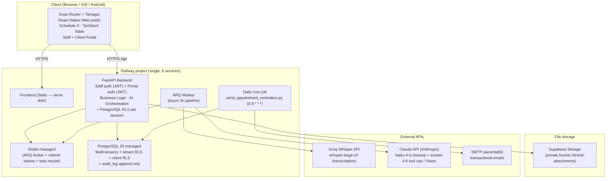
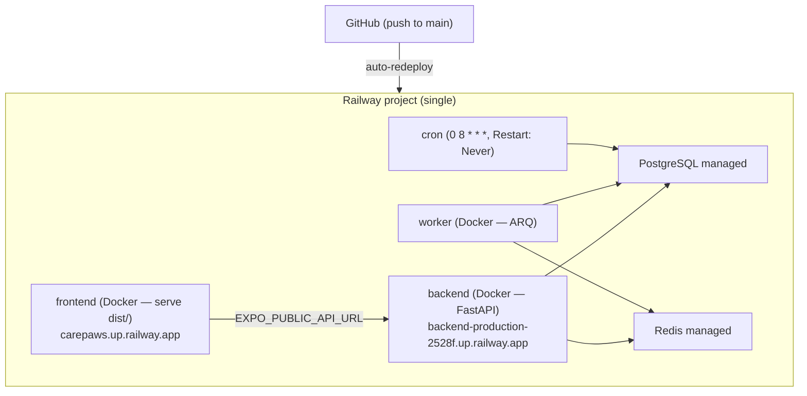
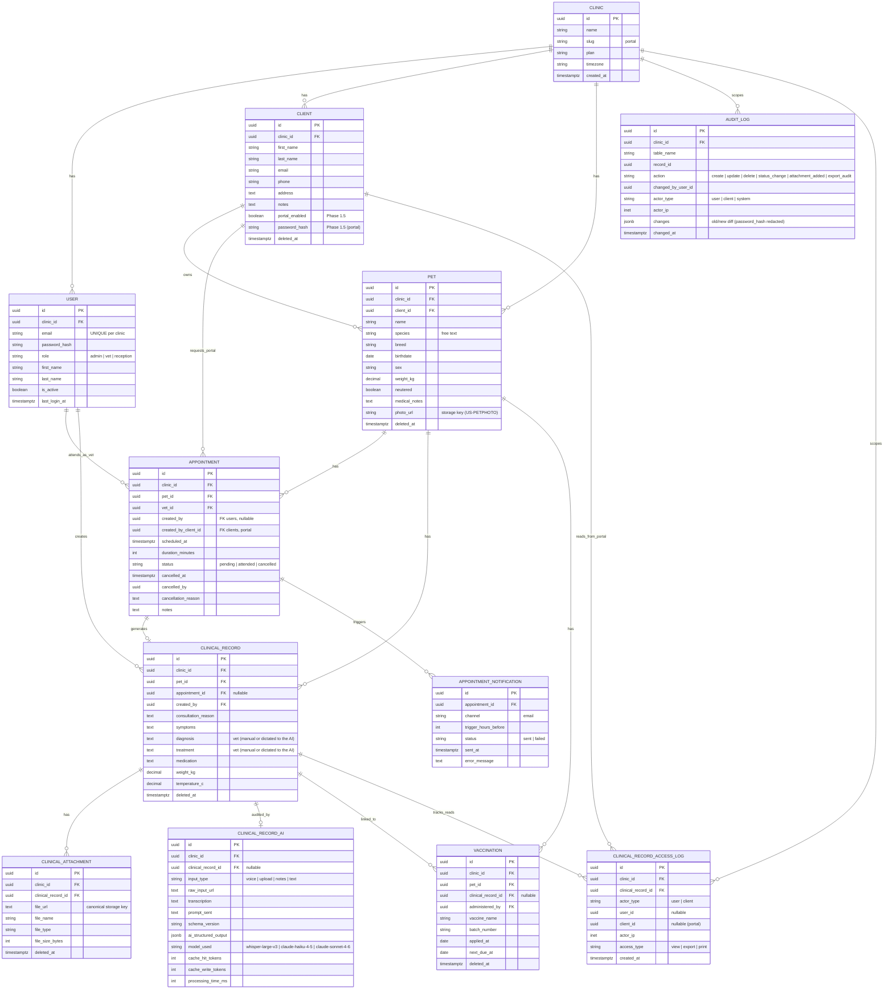

## Index

0. [Project sheet](#0-project-sheet)
1. [Product overview](#1-product-overview)
2. [System architecture](#2-system-architecture)
3. [Data model](#3-data-model)
4. [API specification](#4-api-specification)
5. [User stories](#5-user-stories)
6. [Work tickets](#6-work-tickets)
7. [Pull requests](#7-pull-requests)

---

## 0. Project sheet

### **0.1. Your full name:**

Franco Borgato, Mateo Costes

### **0.2. Project name:**

Veterinary Intelligence Platform

### **0.3. Short project description:**

Multi-tenant web SaaS platform for the comprehensive management of small veterinary clinics (1–5 veterinarians). The core differentiator is **AI assistance for structuring clinical records**: the veterinarian records a voice note (or uploads an audio file, or photographs handwritten notes) and the system transcribes and automatically fills in the predefined fields of the clinical record (reason, symptoms, weight, temperature, referred medication and —when the professional dictates them explicitly— diagnosis and treatment). The professional reviews and confirms before saving. **The AI never invents diagnoses or treatments**: it only structures what the veterinarian actually dictated.

The system also covers staff user management, clients and pets, a multi-veterinarian agenda with overlap detection (Schedule-X), the pet's complete clinical profile (with photo), clinical history with attachments (images/PDF), vaccination records with due-date alerts, automatic appointment reminders by email, operational reports with Excel export, and an immutable audit layer over clinical data changes and accesses with admin panels and export. In **Phase 1.5** it adds a **Client Portal** with independent authentication where the owner consults their pets' history, filters it by veterinarian and requests/cancels their own appointments.

> **Current status (July 2026):** the project moved from the documentation phase to a **functional MVP deployed to production**. There is a backend (FastAPI), frontend (Expo + Tamagui) and database (PostgreSQL 16 with RLS) implemented, tested and **running on Railway**. ~44 pull requests were completed onto the `dev` branch (Phase 1: US-001 to US-025, US-027 and US-DASH; Phase 1.5 — Client Portal: US-033 to US-041 and US-427; plus US-PROFILE, US-PETPHOTO and US-DESIGN). The differentiating AI flow (voice/image → clinical fields) is operational end-to-end. Alembic migrations `0001`–`0019` applied.

### **0.4. Project URL:**

The MVP is **deployed on Railway** (a single project with 6 services):

- **Frontend (staff):** https://carepaws.up.railway.app/login
- **Frontend (client portal):** https://carepaws.up.railway.app/portal/`<slug>`/login
- **Backend:** https://backend-production-2528f.up.railway.app (`/health` OK; `/docs` hidden in prod)

The database has seeded demo data (3 clinics, staff per role and portal clients). **To walk through the platform step by step per role (admin / veterinarian / reception / client), with the sample credentials and the route of each screen, see the usage guide: [`docs/guia-de-uso.md`](../docs/guia-de-uso.md).**

> It is also **runnable locally** with Docker Compose + the `backend/start.ps1` and `frontend/start.ps1` scripts (frontend at `http://localhost:8081`, backend at `http://localhost:8000`).

### 0.5. Repository URL or compressed file

https://github.com/mateocostes/Veterinary-Intelligence-Platform

Main branch: `main`, which is also the branch Railway tracks for deployment. Active MVP development was done on the **`dev`** branch (~44 merged PRs, `feat/us-XXX → dev`). The technical documentation lives in `docs/`.

---

## 1. Product overview

### **1.1. Objective:**

The product solves a quantifiable problem of small veterinary clinics: **manual clinical documentation takes ~10 minutes per consultation**, time the veterinarian cannot dedicate to the patient. The platform reduces that time by automatically structuring the clinical record from what the professional dictates.

**Value per stakeholder:**

- **Veterinarian:** records a voice note (or photographs their handwritten notes) while attending; receives the fields pre-filled with the transcribed information; reviews, edits what is needed and saves with one click. Reduces administrative friction.
- **Receptionist:** manages a multi-professional agenda without overlaps; the system triggers automatic appointment reminders without manual calls.
- **Administrator (clinic owner, who usually also practices as a veterinarian):** manages the clinic's staff; sees the complete clinical profile of each pet; audits changes and accesses to clinical records (panels + export); generates operational reports; controls who accessed what information (Law 25.326 compliance).
- **Pet owner:** receives automatic email reminders and, in the **Client Portal (Phase 1.5)**, accesses with their own authentication to consult their pets' history, filter it by veterinarian and request/cancel their appointments.

**For whom:** small Argentine veterinary clinics of 1–5 veterinarians, where the owner usually also practices as a clinical professional, with an eventual receptionist, and with stable internet access during consultations.

### **1.2. Main features and functionalities:**

| Feature | Status | Description |
|---|---|---|
| **Authentication and multi-tenancy** | ✅ Implemented | Clinic registration (atomically creates Clinic + admin User), login with JWT + refresh tokens in Redis, password recovery by email, staff user management (Admin/Vet/Reception) with RBAC, user profile and authenticated password change (US-PROFILE). Isolation between clinics with `clinic_id` + PostgreSQL Row-Level Security. |
| **AI-Assisted Clinical Record** | ✅ Implemented | Voice recording (web MediaRecorder), audio file upload **or photo of handwritten notes** (Claude Vision, US-015) → transcription with **Groq Whisper (`whisper-large-v3`)** → cleanup with **`claude-haiku-4-5`** → **structuring** into the predefined fields with **`claude-sonnet-4-6`** (tool use + Pydantic `ClinicalRecordExtraction` schema, **prompt caching** active). The AI extracts reason, symptoms, weight, temperature, referred medication and —only if the vet dictates them explicitly— diagnosis and treatment; **it never invents them**. Asynchronous pipeline via ARQ with polling and manual fallback. Every AI interaction is audited in `clinical_records_ai` (append-only), consultable by the admin (US-016). |
| **Client and Pet Management** | ✅ Implemented | CRUD for clients and pets. Unified clinical profile of the pet (basic data + photo + latest consultations + vaccines + upcoming appointments). Pet creation choosing the owner from the global list. Global search by pet or owner name with an enriched result. |
| **Agenda and Appointments** | ✅ Implemented | Daily and weekly view filterable by veterinarian (Schedule-X, Spanish, anchored to Monday). Overlap detection (HTTP 409). Reschedule / cancel (logical cancellation that frees the slot). Mark attended (`pending → attended`) and start/register the consultation from the appointment; view/edit the already loaded consultation (one per appointment). |
| **Clinical attachments** | ✅ Implemented | Upload of images/PDF (≤ 20 MB, max 10) to a consultation, validating the whole batch before uploading. Storage in **Supabase Storage** (private bucket `clinical-attachments`, short-lived signed URLs). Thumbnail grid, opening in a new tab and deletion (audited soft delete). |
| **Vaccination and alerts** | ✅ Implemented | Record of applied vaccines with the next due date, optionally linked to a consultation. List of vaccines about to expire with a configurable threshold (US-024) and proactive email notice to the owner (`POST /vaccinations/{id}/notify-owner`). |
| **Automatic Notifications** | ✅ Implemented | Appointment reminder by email via **SMTP (`aiosmtplib`)**, triggered by a **daily Railway cron (`0 8 * * *`)** that notifies tomorrow's appointments (one reminder, idempotent). Status of each send visible in the agenda for admin/reception. |
| **Reports** | ✅ Implemented | Consultations report per period (US-025) and applied-vaccines report (US-027): filter by date range and veterinarian, breakdowns by species/veterinarian, **Excel export** (`openpyxl`; PDF deferred → 422). |
| **Audit and Traceability** | ✅ Implemented | Automatic and immutable recording of mutations (`audit_log`, via SQLAlchemy `after_flush` event listener) and of individual accesses to clinical records (`clinical_record_access_log`, with IP). Admin panels: change history of a record with field-by-field diff (US-039), access log (US-040) and **activity-log export** of the clinic per period (US-041). Append-only enforced at the engine level (`REVOKE UPDATE, DELETE` on the `app_runtime` role). |
| **Client Portal (Phase 1.5)** | ✅ Implemented | Authentication **independent** from staff (email activation, US-033): the owner sees the list of their pets (US-034), each one's consultation history (US-035) filterable by veterinarian (US-036), and requests (US-037) / lists and cancels (US-038) their own appointments. Per-owner isolation reinforced with a **second client RLS layer** in the database (US-427). |
| **Design system and navigation shell** | ✅ Implemented | Fidelity audit against the "Clinical Serenity" design system (tokens as the only color source, CI guard test) + application shell with a **persistent sidebar** per role, topbar and rebranding to **CarePaws** (US-DESIGN, 9 FE tickets). |

> **Deferred features.**
> - **Offline Support (Phase 2):** Service Workers + IndexedDB with local cache and a mutation queue.
> - **AI-generated suggested diagnoses (Phase 2):** the MVP's AI only structures what is dictated; generating its own diagnoses requires independent clinical and regulatory validation.
> - **WhatsApp notifications, payments and inventory (Phase 2).**
> - **Full observability (Phase 2):** Sentry + Pydantic Logfire / OpenTelemetry + PostHog. The MVP relies on FastAPI structured logging.

### **1.3. Design and user experience:**

The interface is implemented over the **"Clinical Serenity"** design system (extracted from the Stitch project `VetCare Digital Hub`), codified as semantic brand tokens in `frontend/tamagui.config.ts` (`$brandPrimary` medical teal `#0d9488`, `$surface`, `$onSurface`, `$inputBorder`, `$radiusCard`…) and documented in `docs/design-system.md`. The app mounts `TamaguiProvider` with `defaultTheme="light"`. Each component consumes **only** these tokens (rule R11, now verified by a CI guard test that fails on any raw hex). The product was rebranded to **CarePaws** and the authenticated area lives inside a **shell** with a persistent per-role sidebar + topbar (US-DESIGN).

Main flows implemented:

- **Shell + per-role navigation:** persistent sidebar derived from the role matrix (with a collapsible "Reports" group), topbar, pressable user chip (profile / logout). The root redirects to `/agenda`.
- **AI consultation flow:** appointment → "Mark attended" → "Register consultation" → record/upload audio or note photo → processing indicator → form pre-filled with the extracted fields → edit → save (with the option to attach files).
- **Agenda flow:** Schedule-X day/week calendar → filter by veterinarian → "New appointment" (pet search + vet selection, overlap detection) → click a pending appointment to reschedule/cancel.
- **Pet profile:** avatar with photo + species banner, basic data + clinical history (paginated accordion) + vaccines + upcoming appointments + audit panels (admin).
- **Client Portal:** per-clinic landing → login → "My pets" → pet history (filterable by vet) → "Request appointment" / "My appointments" (cancel).

> **Screenshots and guided walkthrough:** the [`usage guide`](../docs/guia-de-uso.md) documents the complete per-role walkthrough using the seed data, with 📸 markers indicating what each screen shows and its route.

### **1.4. Installation instructions:**

**Local infrastructure (Docker):**
```powershell
docker-compose up -d postgres redis     # PostgreSQL 16 + Redis 7 (both healthy)
```

**Backend (FastAPI):**
```powershell
.\backend\start.ps1    # creates venv + installs deps + applies migrations + uvicorn (reads .env from the root)
# ARQ Worker (for the AI flow):
.\.venv\Scripts\python.exe -m arq app.worker.settings.WorkerSettings
```

**Frontend (Expo web):**
```powershell
.\frontend\start.ps1   # installs deps if missing + expo start --web (http://localhost:8081)
```

**Environment variables (`.env` in the root, see `.env.example`):** `DATABASE_URL` / `DATABASE_URL_SYNC`, `JWT_SECRET`, `SMTP_*` (host/port/user/password/from), `GROQ_API_KEY` (Whisper), `ANTHROPIC_API_KEY` (Claude), `SUPABASE_URL` / `SUPABASE_KEY` (attachments and pet photo). The migrations (Alembic `0001`–`0019`) create the schema, enable Row-Level Security (including the portal's client RLS) and apply the append-only GRANTs on `audit_log` / `clinical_record_access_log` / `clinical_records_ai`.

> **Deploy:** the complete runbook to reproduce the Railway deployment (6 services, startup order, variables and data seed) is in [`docs/deploy.md`](../docs/deploy.md).

**Tests:**
```powershell
# Backend
Set-Location backend; python -m pytest
# Frontend
Set-Location frontend; npx jest
# E2E
Set-Location e2e; npx playwright test --project=chromium
```

---

## 2. System Architecture

### **2.1. Architecture diagram:**

The architecture follows a pattern of three decoupled layers: frontend (Expo + React Native Web), REST API backend (FastAPI) and a relational database (PostgreSQL). The AI and email services are consumed as external APIs. File storage is independent of the database. **All services live in a single Railway project** to simplify operations and eliminate internal CORS.


```mermaid
flowchart TD
  subgraph Client["Client (Browser / iOS / Android)"]
    FE["Expo Router + Tamagui<br/>React Native Web (web)<br/>Schedule-X · TanStack Table<br/>Staff + Client Portal"]
  end

  subgraph Railway["Railway project (single, 6 services)"]
    STATIC["Frontend (Static — serve dist/)"]
    API["FastAPI Backend<br/>Staff auth (JWT) + Portal auth (JWT)<br/>Business Logic · AI Orchestration<br/>+ PostgreSQL RLS per session"]
    ARQ["ARQ Worker<br/>(async AI pipeline)"]
    CRON["Daily cron job<br/>send_appointment_reminders.py (0 8 * * *)"]
    RED["Redis managed<br/>(ARQ broker + refresh tokens + task results)"]
    PG["PostgreSQL 16 managed<br/>Multi-tenancy + tenant RLS + client RLS<br/>+ audit_log append-only"]
  end

  subgraph Storage["File storage"]
    S3["Supabase Storage<br/>(private bucket clinical-attachments)"]
  end

  subgraph External["External APIs"]
    WHISPER["Groq Whisper API<br/>whisper-large-v3 (transcription)"]
    CLAUDE["Claude API (Anthropic)<br/>haiku-4-5 cleanup + sonnet-4-6 tool use / Vision"]
    SMTP["SMTP (aiosmtplib)<br/>transactional emails"]
  end

  FE -->|HTTPS| STATIC
  FE -->|HTTPS /api| API
  API --> PG
  API --> S3
  API --> RED
  ARQ --> RED
  ARQ --> WHISPER
  ARQ --> CLAUDE
  CRON --> PG
  CRON --> SMTP
```

*Figure 1: General system architecture diagram*

**Chosen pattern:** Three-layer architecture (Presentation / Application / Data) with decoupled async orchestration (ARQ) for the AI pipeline and a daily Railway cron for reminders. Multi-tenancy with **defense in depth**: `clinic_id` filter in SQLAlchemy queries + PostgreSQL Row-Level Security as a second engine-level layer. The Client Portal adds a **third per-owner isolation layer** (client RLS, US-427).

**Justification:**
- **FastAPI + PostgreSQL** provide a typed, async-native, high-performance backend. Pydantic v2 makes the extraction schema (`ClinicalRecordExtraction`) serve simultaneously as the tool_use schema for Claude and as the shape of the JSONB in `clinical_records_ai`.
- **Expo (Expo Router + Tamagui)** with a web build via React Native Web shares the UI between web and mobile from the first component — the `services/` and `store/` layers port without a rewrite. The same bundle serves the staff area and the client portal.
- **ARQ** decouples the AI pipeline (Whisper's variable latency + 2 Claude calls) from the HTTP response. Async-native, the same Redis already used for refresh tokens — without adding Celery.
- **PostgreSQL Row-Level Security** on every table with `clinic_id`: if a query omits the filter, the engine returns zero rows instead of leaking between clinics. Cross-tenant clinical data leaks become impossible at the engine level.
- **Railway-only** removes the operational friction of two clouds (no CORS, no env duplication); the 6 services communicate over the internal private network.

**Trade-offs and implementation decisions:**
- **Groq Whisper instead of OpenAI `whisper-1`:** Groq was adopted (`whisper-large-v3`, via the OpenAI SDK with a `base_url` override) for its free tier without a card, enough for MVP development. Changing provider is config.
- **SMTP (`aiosmtplib`) instead of Resend:** migrated in US-004 to deliver to any recipient without verifying a domain (Gmail App Password in dev; SES/Mailgun/Brevo in prod). Config-only to change provider.
- **RLS adds setup complexity:** two DB users (`app_runtime` with forced RLS, `app_admin` with `BYPASSRLS` for Alembic) + `set_config('app.clinic_id', …, true)` per request. The portal additionally adds `set_config('app.client_id', …)`. On Railway the backend connects as `postgres` (superuser, bypasses RLS): isolation still holds via the application-layer `clinic_id` filter (RLS = defense-in-depth, not a functioning requirement; optional hardening documented in `docs/deploy.md`).
- **Offline support deferred to Phase 2:** the MVP assumes stable connectivity.

### **2.2. Description of the main components:**

| Component | Technology | Responsibility |
|---|---|---|
| **Frontend** | React 18 + TypeScript, Expo Router + Tamagui, Zustand, TanStack Query, axios | Web (and shared mobile) UI, per-role navigation shell, local/server state, audio recording (web MediaRecorder), client portal (separate axios client) |
| **Frontend — agenda** | Schedule-X v2 | Day/week view, week navigation (anchored to Monday), filter by veterinarian, click an appointment → reschedule/cancel |
| **Frontend — data grids** | TanStack Table v8 | Lists (users, clients, pets, vaccination alerts) with sorting, filtering and pagination |
| **Backend API** | Python 3.12, FastAPI, Pydantic v2 | REST API with validation, per-role RBAC (staff JWT), portal auth (JWT `role: client_portal`), AI service orchestration |
| **ORM / Migrations** | SQLAlchemy 2.0 (async), Alembic | Typed async access; migrations `0001`–`0019`. Migrations with `app_admin`; app queries with `app_runtime` (forced RLS) |
| **Async worker** | ARQ + Redis | AI pipeline (Groq Whisper → Haiku cleanup → Sonnet extraction / Vision → DB audit) without blocking the HTTP response. Creates its own session with `set_config` for RLS |
| **Scheduled task** | Daily Railway cron | `python -m app.jobs.send_appointment_reminders` (`0 8 * * *`); also invokable via an internal endpoint with an API key |
| **Database** | PostgreSQL 16 | Multi-tenancy `clinic_id` + tenant RLS + client RLS (portal), soft delete, JSONB for AI output, append-only audit tables |
| **Object Storage** | Supabase Storage (Strategy `supabase`\|`s3`) | Clinical attachments and pet photo in the private bucket `clinical-attachments` with signed URLs (≤ 1h). Injectable and mockable `StorageService` facade |
| **Transcription** | Groq (`whisper-large-v3`) | Audio → text, processed asynchronously via ARQ |
| **AI structuring** | Anthropic — `claude-haiku-4-5` (cleanup) + `claude-sonnet-4-6` (tool use + Vision) | Structuring of the clinical record from voice/audio/photo via tool use + Pydantic schema. Prompt caching (`cache_control: ephemeral`). Does not invent diagnoses |
| **Email** | SMTP via `aiosmtplib` | Appointment reminders, password recovery, portal activation and vaccine-due notice (multipart text+HTML, 30s timeout, swallowed failures for anti-enumeration) |

### **2.3. High-level description of the project and file structure**

Monorepo organization with frontend/backend separation:

```
/
├── frontend/                 # Expo + React Native Web
│   └── src/
│       ├── app/              # Router (Expo Router): (app) protected, (auth), portal/, public routes
│       ├── features/         # Domain modules (auth, users, clients, pets,
│       │                     #   clinical-records, appointments, vaccinations,
│       │                     #   ai-assistant, reports, audit, portal, dashboard, …)
│       ├── shared/           # Tamagui components, shell (sidebar/topbar), reusable hooks and utils
│       ├── theme/            # Resolved tokens, elevation, typography + guard test
│       ├── services/         # Per-module HTTP clients (axios + JWT/refresh interceptor; portalApiClient)
│       └── store/            # Zustand stores (staff auth + portal auth, web/native persist)
│
├── backend/                  # FastAPI application
│   └── app/
│       ├── core/             # Config, security, deps (set_config app.clinic_id / app.client_id)
│       ├── api/v1/endpoints/ # auth, users, clients, pets, appointments,
│       │                     #   clinical_records, vaccinations, search, ai,
│       │                     #   reports, audit, portal, internal
│       ├── models/           # SQLAlchemy 2.0 with Timestamp/SoftDelete/Tenant mixins
│       ├── schemas/          # Pydantic (request/response + ClinicalRecordExtraction + portal)
│       ├── crud/             # Database operations
│       ├── services/         # ai_service, notification_service, audit_logger, storage, report_export
│       ├── worker/           # ARQ worker (settings + AI pipeline tasks)
│       ├── jobs/             # send_appointment_reminders (daily cron)
│       ├── scripts/          # seed_testing_data.py (demo data)
│       └── alembic/          # Migrations 0001–0019
│
├── e2e/                      # Playwright (auth, agenda, AI flow)
├── docs/                     # Technical docs + changelog/US-XXX.md + prompts + guia-de-uso + deploy
├── entrega1/ · entrega2/ · entrega3/   # Course delivery artifacts
├── ia-agents/                # Custom agents/skills/rules for AI assistance
├── docker-compose.yml        # Local development environment
└── CLAUDE.md                 # Project context for AI assistants
```

Pattern: **feature-based** on the frontend, **layered** on the backend (api → services/crud → models). The `services/` and `store/` layers are shared directly between web and mobile thanks to Expo.

### **2.4. Infrastructure and deployment**

All services live in a single **Railway** project (6 services). The deploy is **active**: the repo services track the `main` branch and auto-redeploy on every push.


```mermaid
flowchart TD
  GH["GitHub (push to main)"]
  subgraph RAILWAY["Railway project (single)"]
    STATIC["frontend (Docker — serve dist/)<br/>carepaws.up.railway.app"]
    BACKEND["backend (Docker — FastAPI)<br/>backend-production-2528f.up.railway.app"]
    WORKER["worker (Docker — ARQ)"]
    CRON["cron (0 8 * * *, Restart: Never)"]
    PG["PostgreSQL managed"]
    REDIS["Redis managed"]
  end

  GH -->|auto-redeploy| RAILWAY
  STATIC -->|EXPO_PUBLIC_API_URL| BACKEND
  BACKEND --> PG
  BACKEND --> REDIS
  WORKER --> REDIS
  WORKER --> PG
  CRON --> PG
```

*Figure 2: Infrastructure and deployment on Railway (deployed)*

| Environment | Branch | Purpose |
|---|---|---|
| Development | `dev` | Active development (local Docker Compose) **and the deployed branch** on Railway |
| Production | `main` | Phase 1 closure / stable releases |

**Deploy process (summary; complete runbook in `docs/deploy.md`):** (1) project + managed Postgres + Redis; (2) `backend` (Root `backend`, pre-deploy `alembic upgrade head`, public domain); (3) `worker` (`arq app.worker.settings.WorkerSettings`); (4) `cron` (`python -m app.jobs.send_appointment_reminders`, schedule `0 8 * * *`, Restart `Never`); (5) `frontend` (`EXPO_PUBLIC_API_URL` baked at build, public domain); (6) close the loop with `CORS_ORIGINS`/`FRONTEND_URL` on the backend. Demo seed via `backend/scripts/seed_testing_data.py` against the Postgres public URL.

> **Note on the git/board flow:** each US is developed on `feat/us-XXX` from `dev`, with one commit per ticket (`feat(db|be|fe):`) and a PR to `dev` (`Closes #N`). The GitHub Project board goes Todo → In Progress → In Review → Done. Since the PR targets `dev` (not `main`, the default branch), `Closes #N` does not auto-close on merge to `dev`: the move to Done is manual.

**Estimated monthly cost (MVP with few users):** Railway Free Trial ($5 one-time credit) for the evaluation window; then Hobby (~$5/month) + per-second usage. Transcription uses Groq's free tier; Claude with prompt caching is marginal at this volume (AI usage is billed separately, with spend limits on Anthropic/OpenAI).

### **2.5. Security**

- **Mandatory HTTPS** (TLS managed by Railway in prod).
- **JWT authentication with refresh tokens:** short-lived HMAC-signed access token; refresh tokens in Redis with rotation. Staff payload: `{ user_id, clinic_id, role, exp }`. The **portal** uses its own JWT with `role: "client_portal"` (`client_id` + `clinic_id`), separated by dependency from the staff token (a staff token on a portal endpoint → 401, and vice versa). Reverse index `user_refresh:{user_id}` to revoke all of a user's sessions on password recovery/change.
- **Multi-tenancy with defense in depth:** `clinic_id` filter on every query **+ PostgreSQL Row-Level Security**. The session runs `SELECT set_config('app.clinic_id', :cid, true)` on open; policies filter by `current_setting('app.clinic_id')::uuid`.
- **Per-owner isolation in the Portal (US-427):** a **second client RLS layer** (`AS RESTRICTIVE`, migration `0015`) that ANDs with the tenant one and is a no-op for staff: direct on `pets` (`client_id = current_setting('app.client_id')::uuid`) and transitive on `clinical_records`/`vaccinations`/`appointments` (via `pet_id IN (SELECT … WHERE client_id = …)`). Belt-and-suspenders over the `client_id` filter derived **from the JWT** (never from query/body).
- **Anti-enumeration:** `forgot-password` always returns 200; login runs bcrypt against a dummy hash if the user does not exist (closes the timing oracle); cross-clinic (or, in the portal, cross-owner) resource accesses return 404, not 403.
- **Encryption at rest** (managed Postgres + Storage) and **signed file URLs** (≤ 1h) for attachments and pet photo.
- **Defensive upload validation:** magic bytes + size validated **before** uploading (an invalid photo/attachment → 422 without leaving orphan objects in the bucket).
- **Soft delete:** clinical records are never physically deleted. Exception: appointments are cancelled as a state change (`status='cancelled'` + associated fields), not with `deleted_at`, to free the slot.
- **Complete audit:**
  - `audit_log` records all mutations (create/update/delete/restore + explicit actions such as `status_change`, `attachment_added`, `export_audit`) on tenant-scoped tables, via a SQLAlchemy `after_flush` event listener. Old/new diff in JSONB. **Redaction of sensitive columns** (`password_hash` never enters the diff, US-PROFILE fix).
  - `clinical_record_access_log` records each individual read of a clinical record (staff via `user_id`; **portal clients via `client_id`**, with IP since US-040).
  - **Panels + export for the admin:** change history (US-039), access log (US-040) and activity-log export per period (US-041), all restricted to the `admin` role (other roles → 403).
  - **Append-only enforced in the DB:** `REVOKE UPDATE, DELETE … FROM app_runtime`.
- **AI audit:** every interaction with Whisper and Claude is stored in `clinical_records_ai` (input, transcription, full prompt, schema, structured output, model, cache tokens, time). Append-only table, consultable by the admin (US-016).

### **2.6. Tests**

| Type | Technology | Coverage |
|---|---|---|
| **Unit + integration (backend)** | pytest + pytest-asyncio (aiosqlite engine, per-test rollback, `AsyncClient`) | Endpoints, CRUD, tenant and client RLS, migrations, append-only, portal. Suite > 900 tests |
| **AI prompt snapshot** | syrupy | Blocks the merge if the system prompt or the schema sent to Claude changes without updating the snapshot |
| **Multi-tenant + client RLS + append-only isolation** | pytest (custom suite connecting as `app_runtime` with FORCE RLS) | Verifies isolation between clinics and per owner (the portal sees only the client's rows even without a SQL filter) and that `UPDATE`/`DELETE` on `audit_log` from `app_runtime` fails with a permission error |
| **Frontend** | Jest + React Native Testing Library (mock of Tamagui/Expo Router/Zustand/TanStack Query) | Components, hooks, forms, masks, shell, portal, token guard. Suite > 850 tests |
| **E2E of the critical flow** | Playwright (chromium) | Registration, login (role redirect + persistence), agenda (view/toggle/filter/create appointment), AI flow |

---

## 3. Data Model

### **3.1. Data model diagram:**

All entities are implemented via Alembic migrations `0001`–`0019`, with `clinic_id` + forced RLS on tenant-scoped tables and a second client RLS for the portal.


```mermaid
erDiagram
  CLINIC ||--o{ USER : has
  CLINIC ||--o{ CLIENT : has
  CLINIC ||--o{ PET : has
  CLIENT ||--o{ PET : owns
  CLIENT ||--o{ APPOINTMENT : requests_portal
  PET ||--o{ APPOINTMENT : has
  PET ||--o{ CLINICAL_RECORD : has
  PET ||--o{ VACCINATION : has
  USER ||--o{ APPOINTMENT : attends_as_vet
  USER ||--o{ CLINICAL_RECORD : creates
  APPOINTMENT ||--o| CLINICAL_RECORD : generates
  APPOINTMENT ||--o{ APPOINTMENT_NOTIFICATION : triggers
  CLINICAL_RECORD ||--o{ CLINICAL_ATTACHMENT : has
  CLINICAL_RECORD ||--o| CLINICAL_RECORD_AI : audited_by
  CLINICAL_RECORD ||--o{ VACCINATION : linked_to
  CLINIC ||--o{ AUDIT_LOG : scopes
  CLINIC ||--o{ CLINICAL_RECORD_ACCESS_LOG : scopes
  CLINICAL_RECORD ||--o{ CLINICAL_RECORD_ACCESS_LOG : tracks_reads
  CLIENT ||--o{ CLINICAL_RECORD_ACCESS_LOG : reads_from_portal

  CLINIC {
    uuid id PK
    string name
    string slug "portal"
    string plan
    string timezone
    timestamptz created_at
  }

  USER {
    uuid id PK
    uuid clinic_id FK
    string email "UNIQUE per clinic"
    string password_hash
    string role "admin | vet | reception"
    string first_name
    string last_name
    boolean is_active
    timestamptz last_login_at
  }

  CLIENT {
    uuid id PK
    uuid clinic_id FK
    string first_name
    string last_name
    string email
    string phone
    text address
    text notes
    boolean portal_enabled "Phase 1.5"
    string password_hash "Phase 1.5 (portal)"
    timestamptz deleted_at
  }

  PET {
    uuid id PK
    uuid clinic_id FK
    uuid client_id FK
    string name
    string species "free text"
    string breed
    date birthdate
    string sex
    decimal weight_kg
    boolean neutered
    text medical_notes
    string photo_url "storage key (US-PETPHOTO)"
    timestamptz deleted_at
  }

  APPOINTMENT {
    uuid id PK
    uuid clinic_id FK
    uuid pet_id FK
    uuid vet_id FK
    uuid created_by "FK users, nullable"
    uuid created_by_client_id "FK clients, portal"
    timestamptz scheduled_at
    int duration_minutes
    string status "pending | attended | cancelled"
    timestamptz cancelled_at
    uuid cancelled_by
    text cancellation_reason
    text notes
  }

  APPOINTMENT_NOTIFICATION {
    uuid id PK
    uuid appointment_id FK
    string channel "email"
    int trigger_hours_before
    string status "sent | failed"
    timestamptz sent_at
    text error_message
  }

  CLINICAL_RECORD {
    uuid id PK
    uuid clinic_id FK
    uuid pet_id FK
    uuid appointment_id FK "nullable"
    uuid created_by FK
    text consultation_reason
    text symptoms
    text diagnosis "vet (manual or dictated to the AI)"
    text treatment "vet (manual or dictated to the AI)"
    text medication
    decimal weight_kg
    decimal temperature_c
    timestamptz deleted_at
  }

  CLINICAL_ATTACHMENT {
    uuid id PK
    uuid clinic_id FK
    uuid clinical_record_id FK
    text file_url "canonical storage key"
    string file_name
    string file_type
    int file_size_bytes
    timestamptz deleted_at
  }

  CLINICAL_RECORD_AI {
    uuid id PK
    uuid clinic_id FK
    uuid clinical_record_id FK "nullable"
    string input_type "voice | upload | notes | text"
    text raw_input_url
    text transcription
    text prompt_sent
    string schema_version
    jsonb ai_structured_output
    string model_used "whisper-large-v3 | claude-haiku-4-5 | claude-sonnet-4-6"
    int cache_hit_tokens
    int cache_write_tokens
    int processing_time_ms
  }

  VACCINATION {
    uuid id PK
    uuid clinic_id FK
    uuid pet_id FK
    uuid clinical_record_id FK "nullable"
    uuid administered_by FK
    string vaccine_name
    string batch_number
    date applied_at
    date next_due_at
    timestamptz deleted_at
  }

  AUDIT_LOG {
    uuid id PK
    uuid clinic_id FK
    string table_name
    uuid record_id
    string action "create | update | delete | status_change | attachment_added | export_audit"
    uuid changed_by_user_id
    string actor_type "user | client | system"
    inet actor_ip
    jsonb changes "old/new diff (password_hash redacted)"
    timestamptz changed_at
  }

  CLINICAL_RECORD_ACCESS_LOG {
    uuid id PK
    uuid clinic_id FK
    uuid clinical_record_id FK
    string actor_type "user | client"
    uuid user_id "nullable"
    uuid client_id "nullable (portal)"
    inet actor_ip
    string access_type "view | export | print"
    timestamptz created_at
  }
```

*Figure 3: ER diagram of the implemented data model (Phase 1 + Client Portal Phase 1.5)*

### **3.2. Description of the main entities:**

**Global conventions:** UUID as PK; `created_at`/`updated_at` on all tables; soft delete with `deleted_at` on clinical and business models (except `appointments`, which uses a state change); `clinic_id` with RLS enabled on every tenant-scoped table.

- **`clinics`** — root entity of multi-tenancy. Includes `timezone` (IANA) to localize the reminder time and `slug` to identify the clinic in the portal.
- **`users`** — staff (Admin/Vet/Reception) with their own JWT; email unique per clinic; `last_login_at`.
- **`clients`** — pet owners. The Portal fields (`portal_enabled`, `password_hash`) **are active in Phase 1.5**: they support the portal's independent authentication (email activation, US-033).
- **`pets`** — patients; `species` is free text (selector with an "Other" option); `neutered` boolean; `photo_url` is the canonical storage key of the photo (US-PETPHOTO), never a signed URL.
- **`appointments`** — appointments; index for overlap detection; logical cancellation that frees the slot. `created_by`/`created_by_client_id` (CHECK: exactly one creator) distinguish whether it was created by staff or by the owner from the portal.
- **`clinical_records`** — core of the system; soft delete; editable (audited), one active record per appointment (409 guard).
- **`clinical_records_ai`** — append-only audit of the AI pipeline (voice/audio/photo input, transcription, prompt, schema, output, model, cache tokens, time).
- **`clinical_attachments`** — attachments (tenant-scoped + RLS); `file_url` is the canonical storage key; the signed URL is resolved per response.
- **`vaccinations`** — applied vaccines with the next date; optional link to a consultation; `administered_by` (treating veterinarian).
- **`appointment_notifications`** — without `clinic_id` (isolation via `appointment_id`); partial UNIQUE index `(appointment_id, trigger_hours_before) WHERE status='sent'` for idempotency.
- **`audit_log` / `clinical_record_access_log`** — append-only enforced at the engine level (`REVOKE UPDATE, DELETE`); `actor_type` distinguishes staff/client/system; the access log admits a `client_id` actor (portal) with a CHECK of exactly one actor. 7-year retention + anonymization on right-to-be-forgotten requests.

> **Phase 2 entities** (not implemented): `services`, `payments`, `inventory_items`.

---

## 4. API Specification

Implemented endpoints (representative selection). All require a JWT with `clinic_id` except the public ones (`/auth/*`, appointment landing) and the internal one (API key). The portal uses its own JWT (`role: client_portal`). Multi-tenancy reinforced with RLS.

**Authentication** — `POST /auth/register`, `POST /auth/login`, `POST /auth/refresh`, `POST /auth/logout`, `POST /auth/forgot-password`, `POST /auth/reset-password`, `GET /auth/me`, `POST /auth/change-password`.

**Staff / Clients / Pets** — `GET/POST/PATCH/DELETE /users`, `GET/POST/PUT/DELETE /clients`, `GET /pets`, `GET /pets/{id}` (aggregated profile), `POST /clients/{client_id}/pets`, `POST /pets/{id}/photo`, `GET /search?q=`.

**Agenda** — `GET /appointments?date=&view=day|week&vet_id=`, `POST /appointments` (409 on overlap), `PATCH /appointments/{id}` (reschedule), `DELETE /appointments/{id}` (logical cancel), `PATCH /appointments/{id}/status` (mark attended), `GET /appointments/{id}/notifications`.

**Clinical record** — `GET /pets/{id}/clinical-records` (paginated), `POST /clinical-records`, `GET/PATCH/DELETE /clinical-records/{id}`, `GET /clinical-records/by-appointment/{appointment_id}`, `POST/GET /clinical-records/{id}/attachments`, `GET /clinical-records/{id}/ai-audit`, `GET /clinical-records/{id}/history` (US-039), `GET /clinical-records/{id}/access-log` (US-040).

**Vaccination** — `POST/GET /pets/{pet_id}/vaccinations`, `GET /vaccinations/expiring?days=&species=&vet_id=`, `POST /vaccinations/{id}/notify-owner`.

**Reports** — `GET /reports/consultations?from=&to=&vet_id=` (+ `/export?format=excel`), `GET /reports/vaccinations?from=&to=&vet_id=` (+ export), `GET /audit/export?from=&to=&type=` (US-041).

**Client Portal** — `POST /portal/activate`, `POST /portal/login`, `GET /portal/pets`, `GET /portal/pets/{id}/clinical-records?vet_id=`, `GET /portal/vets`, `GET /portal/appointments/availability?vet_id=&date=`, `GET/POST /portal/appointments`, `DELETE /portal/appointments/{id}`.

**AI Assistant** (differentiating flow):

```yaml
openapi: 3.1.0
info:
  title: Veterinary Intelligence Platform API
  version: v1
paths:
  /ai/transcribe-voice:
    post:
      summary: Enqueue transcription of a voice recording
      description: |
        Receives the recorded audio, validates format/size (≤ 20 MB) and enqueues an ARQ
        task (Groq Whisper → Claude Haiku cleanup → Claude Sonnet tool use). Returns a task_id
        for polling. vet/admin role.
      security: [{ bearerAuth: [] }]
      responses:
        '202': { description: "Task enqueued — { task_id, status: pending }" }
        '413': { description: "Audio > 20 MB" }
        '403': { description: "Role other than vet or admin" }

  /ai/transcribe-notes:
    post:
      summary: Transcribe handwritten notes with Claude Vision (US-015)
      description: |
        Receives a photo of handwritten clinical notes and maps each annotation to the
        corresponding clinical field using the same ClinicalRecordExtraction schema (7 fields)
        via Claude Vision (sonnet-4-6). input_type="notes" in clinical_records_ai.
      security: [{ bearerAuth: [] }]
      responses:
        '202': { description: "Task enqueued" }
        '413': { description: "Image > 20 MB" }
        '422': { description: "Unsupported format / empty file / invalid pet_id" }

  /ai/tasks/{task_id}:
    get:
      summary: Poll the AI pipeline result
      security: [{ bearerAuth: [] }]
      responses:
        '200':
          description: Task status
          content:
            application/json:
              schema:
                type: object
                properties:
                  status: { type: string, enum: [pending, completed, failed] }
                  structured_output:
                    type: object
                    properties:
                      consultation_reason: { type: string, nullable: true }
                      symptoms: { type: string, nullable: true }
                      weight_kg: { type: number, nullable: true }
                      temperature_c: { type: number, nullable: true }
                      referred_medication: { type: string, nullable: true }
                      diagnosis: { type: string, nullable: true, description: "Only if the vet dictates it explicitly; never invented" }
                      treatment: { type: string, nullable: true, description: "Only if the vet dictates it explicitly; never invented" }
                  model_used: { type: string }
                  error: { type: string, nullable: true }

  /portal/appointments:
    post:
      summary: Request an appointment from the client portal (US-037)
      description: |
        The authenticated client (JWT role=client_portal) requests an appointment for one of
        their pets. Validates pet ownership, clears app.client_id to be able to see the vet's
        full agenda (avoid double-booking) and detects overlaps. Creates the appointment in
        'pending' state with created_by_client_id, audits as actor 'client' and sends a
        confirmation email (best-effort).
      security: [{ bearerAuth: [] }]
      responses:
        '201': { description: "Appointment created (pending)" }
        '403': { description: "Pet of another owner" }
        '404': { description: "Nonexistent/inactive veterinarian" }
        '409': { description: "Overlap with another appointment" }

components:
  securitySchemes:
    bearerAuth: { type: http, scheme: bearer, bearerFormat: JWT }
```

---

## 5. User Stories

**User Story 1 — AI-Assisted Clinical Record (US-013, implemented)**

As a Veterinarian, I want to record a voice note during or after the consultation and have the app **fill in the predefined fields of the clinical record** from what I dictated, to reduce administrative writing time.

**Acceptance criteria (verified):**
- I start/stop the recording from the app (web MediaRecorder); I see a processing indicator.
- I receive pre-filled: reason, symptoms, weight, temperature and referred medication.
- Diagnosis and treatment are filled in **only if I dictated them explicitly**; the AI never invents them (it distinguishes `referred_medication` —what the owner already gave— from `treatment` —what the vet indicates—).
- I can edit any field before saving; if processing fails (timeout > 30s) I fill in the form manually.
- The record and the AI interaction are audited in `clinical_records_ai`.

---

**User Story 2 — Request an appointment from the Client Portal (US-037, implemented · Phase 1.5)**

As a Pet owner, I want to request an appointment for one of my pets choosing veterinarian, date and available time, to manage my care autonomously without calling the clinic.

**Acceptance criteria (verified):**
- Authenticated in the portal (JWT `role: client_portal`), I choose one of **my** pets, a veterinarian, a date and an **available** time (the backend computes the free slots in the clinic's timezone).
- The system validates pet ownership (foreign pet → 403) and detects overlaps against the veterinarian's **full** agenda (even though the client RLS hides other owners' appointments); a clash → 409.
- The appointment is created in `pending` state, attributed to the client (`created_by_client_id`), audited as actor `client` and triggers a confirmation email (best-effort: an email failure never turns the created appointment into a 500).

---

**User Story 3 — Proactive alert for expiring vaccines (US-024, implemented)**

As a Veterinarian or Administrator, I want to see the list of vaccines about to expire and notify the owner by email, to keep the patients' vaccination schedule on track.

**Acceptance criteria (verified):**
- I see a paginated list of doses whose `next_due_at` falls in `[today, today+N]` (excludes overdue and soft-deleted), filterable by species and by professional.
- The default threshold `N` is 30 days; only an **admin** can override it with `?days=` (vet/reception silently use 30; out of range → 422).
- From each row, with one click, I send a notice to the owner by email (`POST /vaccinations/{id}/notify-owner`); the button is disabled if the owner has no email and is not shown for reception.

---

## 6. Work Tickets

Three representative Client Portal (Phase 1.5) tickets — one backend, one frontend and one database — with their real commits on `dev`.

---

### Ticket 1 — Backend · `US-037-BE` (#432) · Size: M · commit `a47dec6`

**Title:** Appointment request from the client portal (with controlled RLS isolation)

**Technical description:** three endpoints under `/portal` behind `get_current_portal_client`: `GET /portal/vets` (active vets, `{id, name}` without staff PII), `GET /portal/appointments/availability?vet_id=&date=` (free `HH:MM` slots) and `POST /portal/appointments` ({pet_id, vet_id, scheduled_at, reason?} → 201 `pending`). **Crux:** the client RLS (US-427) restricts a portal session's SELECTs to the client's own pets, which would hide an overlap with ANOTHER owner → double-booking. So availability and POST, after authenticating and validating pet ownership at the app layer, **clear `app.client_id`** (`SELECT set_config('app.client_id','',true)`) to see the vet's full agenda; the INSERT still passes the tenant `WITH CHECK` (`app.clinic_id` intact). `created_by` becomes nullable + `created_by_client_id` (migration `0017`); explicit audit as actor `client`; best-effort confirmation email after commit.

**Stack:** FastAPI · SQLAlchemy 2.0 async · PostgreSQL (RLS) · Pydantic v2 · SMTP `aiosmtplib` · pytest.

**Acceptance criteria (BDD):**
- *Happy path:* client picks their own pet + vet + free slot → 201 `pending`; email is sent; audit row with actor `client`.
- *Slot taken by another owner:* the overlap is detected anyway (client RLS cleared) → 409, without creating the appointment.
- *Foreign pet:* 403 before touching the agenda; *nonexistent/inactive vet:* 404.

**Real implementation notes:** the 09:00–18:00 working day is **wall-clock local to `clinics.timezone`** (not UTC): `compute_available_slots` builds the day in the clinic tz and converts each slot to its UTC instant (without this a 10:00 slot was stored as 10:00 UTC and shown at 07:00 local). The best-effort email was additionally wrapped in try/except at the endpoint (a failing notifier must not break an already-committed appointment).

**INVEST:** I✅ N✅ V✅ E✅ S✅ T✅ · Dependencies: US-427 (client RLS), US-033 (portal auth).

---

### Ticket 2 — Frontend · `US-035-FE` (#429) · Size: M · commit `d62ce23`

**Title:** Pet clinical history in the client portal

**Technical description:** route `/portal/{clinicSlug}/pets/{petId}/history` (`PortalPetHistoryScreen` + collapsible `PortalConsultationCard`) that consumes `GET /portal/pets/{id}/clinical-records` via `portalApiClient` (never the staff `apiClient`). Exposes **only** owner-facing fields (date, reason, diagnosis, treatment, medication, `vet_name`) — never internal notes, symptoms, weight nor anything from `clinical_records_ai`. Loading/empty/error+retry/404 states (the anti-enumeration 404 maps to an `isNotFound` flag). Portal navigation was completed here (backs profile → list → home + logout).

**Stack:** Expo Router · Tamagui (Clinical Serenity tokens) · TanStack Query · Zustand (`portalAuthStore`) · axios (`portalApiClient`).

**Acceptance criteria (BDD):**
- *Happy path:* the owner opens one of their pets → sees its consultations in chronological order (most recent first), each a collapsible card with the allowed fields.
- *Foreign/nonexistent pet:* 404 → "not found" screen, without leaking the existence of another clinic's/owner's resources.
- *No consultations:* explicit empty state (not an error).

**Real notes:** the placeholder `pets/[petId].tsx` was moved to `pets/[petId]/index.tsx` to be able to nest `history.tsx` (in Expo Router a file and a same-named directory collide).

**INVEST:** I✅ N✅ V✅ E✅ S✅ T✅ · Dependencies: US-034 (portal pets list), US-035-BE.

---

### Ticket 3 — Database · `US-427-DB` (#428) · Size: M · commit `03a4aa6`

**Title:** Client RLS for the portal (per-owner isolation in the database)

**Technical description:** migration `0015_client_rls_isolation` adding **4 `AS RESTRICTIVE` policies** that AND with the permissive tenant policies (`clinic_id`) and are a no-op for staff (when `app.client_id` is unset). Two shapes: **direct** on `pets` (`client_id = current_setting('app.client_id', true)::uuid`) and **transitive** on `clinical_records`/`vaccinations`/`appointments` (`pet_id IN (SELECT id FROM pets WHERE client_id = …)`). Each policy opens with `current_setting('app.client_id', true) IS NULL OR … = ''` (second arg `true` → NULL instead of error) to short-circuit the staff path. `USING` only (the portal is read-only except for the appointment request, whose INSERT uses the tenant `WITH CHECK`).

**Stack:** PostgreSQL 16 · Alembic · pytest (functional harness connecting as `app_runtime` with FORCE RLS).

**Acceptance criteria (BDD):**
- *Portal isolated:* with `app.client_id` set, a `SELECT * FROM pets` without `WHERE` returns **only** that owner's pets; likewise transitively for records/vaccines/appointments.
- *Staff intact:* without `app.client_id`, staff sees all rows of its clinic (no-op policy).
- *No error:* `current_setting('app.client_id', true)` unset does not raise.

**Real notes:** the test is proven by connecting as `app_runtime` (FORCE RLS, no bypass) and seeding with `app_admin`; policy introspection was added in `test_migrations.py` (`TestClientIsolationPolicies`).

**INVEST:** I✅ N✅ V✅ E✅ S✅ T✅ · Dependencies: tenant policies (US-001-DB), `pets` table (US-006-DB).

---

## 7. Pull Requests

Development was done with one PR per User Story onto the `dev` branch (~44 PRs, `feat/us-XXX → dev`, one commit per ticket). Below, three representative PRs from the most recent block (Client Portal + design system); the complete list is below.

**Pull Request 1 — US-037 Portal: request appointment (PR #432)**

- **Branch:** `feat/us-037` → `dev` *(merged)*
- **Content:** the portal's first **write**. BE (`GET /portal/vets`, `/availability`, `POST /portal/appointments` with controlled clearing of `app.client_id` to avoid double-booking), DB (migration `0017`: `created_by` nullable + `created_by_client_id` + single-creator CHECK), FE (`PortalAppointmentRequestScreen` + vet select + slot picker, 409 handling). Includes the timezone fix (slots in wall-clock local to `clinics.timezone`).

**Pull Request 2 — US-427 Client RLS for the portal (PR #428)**

- **Branch:** `feat/us-427` → `dev` *(merged)*
- **Content:** defense in depth for the portal. Migration `0015` with 4 `AS RESTRICTIVE` policies (direct on `pets`, transitive on `clinical_records`/`vaccinations`/`appointments`), no-op for staff. Functional harness that validates per-owner isolation by connecting as `app_runtime` (FORCE RLS) + introspection in `test_migrations.py`.

**Pull Request 3 — US-DESIGN design system fidelity + navigation shell (PR #454)**

- **Branch:** `feat/us-design` → `dev` *(merged)*
- **Content:** 9 FE tickets. Tokens as the only color source (`theme/resolvedColors.ts`, `theme/elevation.ts`, CI guard test that fails on raw hex), application shell (persistent per-role sidebar + topbar), rebranding to **CarePaws**, pet profile with avatar + species banner, `PortalScreenLayout` with brand band, and pet creation choosing the owner from the list.

---

**Complete list of PRs merged to `dev`:**

| PR | US | Feature |
|---|---|---|
| #388 | US-001 | Clinic registration (INFRA + DB + RLS + BE + FE) |
| #389 | US-002 | Login with JWT + role redirect |
| #390 | US-003 | Staff user management (RBAC) |
| #391 | US-005 | Register client |
| #392 | US-004 | Password recovery (Resend → SMTP `aiosmtplib` migration) |
| #393 | US-006 | Register pet |
| #394 | US-017 | Create appointment (overlap detection) |
| #395 | US-007 | Enriched global search |
| #396 | US-018 | Daily/weekly agenda (Schedule-X) |
| #397 | US-009 | Register consultation + automatic `audit_log` |
| #398 | US-023 | Register applied vaccine |
| #399 | US-019 | Reschedule / cancel appointment |
| #400 | US-008 | Complete clinical profile of the pet |
| #401 | US-011 | Paginated clinical history + `clinical_record_access_log` |
| #405 | US-020 | Mark appointment attended and start consultation |
| #406 | US-020b | View/edit an appointment's consultation (no duplicate, 409) |
| #407 | US-021 | Daily email reminder (cron + SMTP) |
| #408 | US-022 | Effective appointment notification status |
| #413 | US-DASH | Per-role dashboard + client/pet lists |
| #414 | US-010 | Clinical attachments (Supabase Storage) |
| #415 | US-013 | AI Assistant: voice → clinical fields |
| #416 | US-014 | External audio upload for AI pre-fill |
| #417 | US-012 | Edit/delete own consultation |
| #418 | — | Clinical attachments UX fix |
| #419 | US-027 | Applied-vaccines report (Excel) |
| #420 | US-024 | Expiring vaccines + owner email notice |
| #421 | US-033 | Portal: activate client access by email |
| #422 | US-015 | (v1) Objective description of a diagnostic image (Vision) |
| #423 | US-016 | Storage and audit of AI extractions |
| #424 | — | Client and pet management (improvements) |
| #425 | US-034 | Portal: client's pets list |
| #426 | US-025 | Consultations report per period (Excel) |
| #428 | US-427 | Client RLS for the portal (per-owner isolation) |
| #429 | US-035 | Portal: pet clinical history |
| #430 | US-036 | Portal: filter history by veterinarian |
| #431 | US-015 | (v2, modified) Handwritten-notes transcription (Vision) |
| #432 | US-037 | Portal: request appointment |
| #433 | US-039 | Clinical record change-history panel |
| #434 | US-038 | Portal: list and cancel own appointments |
| #440 | US-040 | Clinical record access-log panel |
| #441 | US-041 | Export clinic activity log |
| #454 | US-DESIGN | Design system fidelity + navigation shell (CarePaws) |
| #455 | US-PROFILE | User profile and password change |
| #456 | US-PETPHOTO | Pet photo in the profile |

> The move to Done on the board is manual: since the PRs target `dev` (not `main`, the default branch), `Closes #N` only auto-closes when integrating `dev → main`. The `dev` branch is also the one Railway tracks for deployment.
