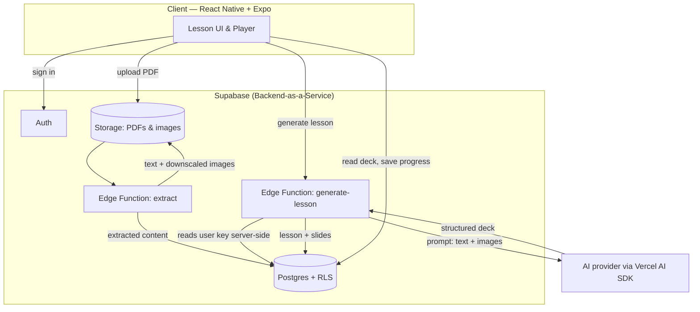
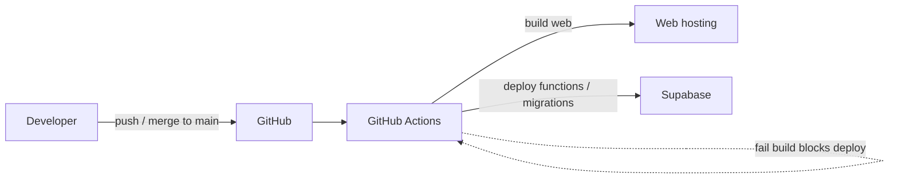
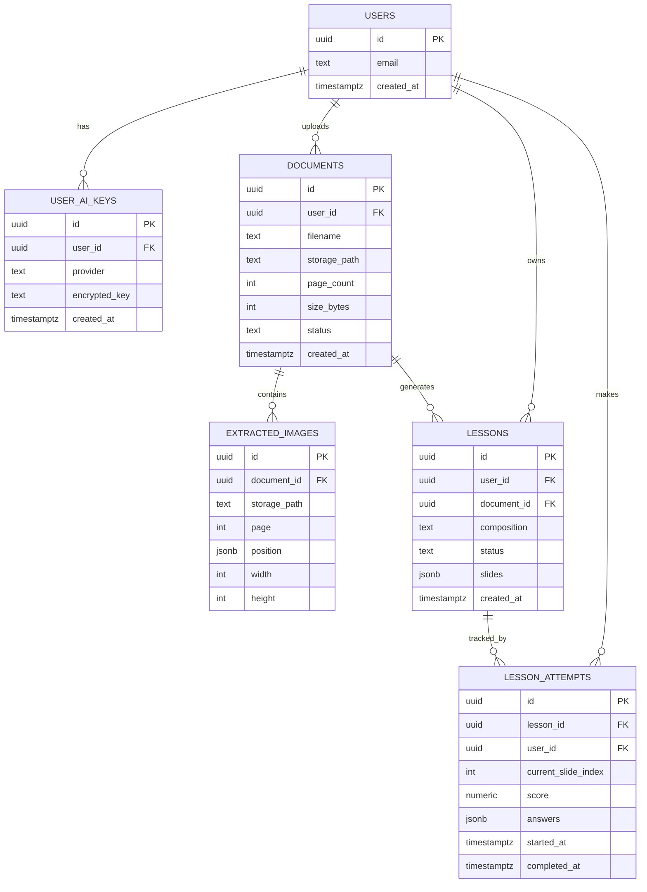

## Índice

0. [Ficha del proyecto](#0-ficha-del-proyecto)
1. [Descripción general del producto](#1-descripción-general-del-producto)
2. [Arquitectura del sistema](#2-arquitectura-del-sistema)
3. [Modelo de datos](#3-modelo-de-datos)
4. [Especificación de la API](#4-especificación-de-la-api)
5. [Historias de usuario](#5-historias-de-usuario)
6. [Tickets de trabajo](#6-tickets-de-trabajo)
7. [Pull requests](#7-pull-requests)

---

> Note: section titles are kept in Spanish to match the required deliverable template; all content is written in English as requested.

## 0. Ficha del proyecto

### **0.1. Tu nombre completo:**

Hernán Laura

### **0.2. Nombre del proyecto:**

AI Study Buddy

### **0.3. Descripción breve del proyecto:**

AI Study Buddy turns any PDF into an AI-generated lesson made of alternating instructional and activity slides, so a learner can both study the material and test themselves in one flow. The user uploads a PDF; the backend extracts its text and embedded images; an AI model generates a structured deck (instructional slides, plus activities such as multiple choice, fill-in-the-blank, flashcards, open-ended, and matching). The app runs on web, iOS, and Android from a single React Native + Expo codebase.

### **0.4. URL del proyecto:**

_Pending deployment (web target via GitHub Actions)._

### 0.5. URL o archivo comprimido del repositorio

_https://github.com/&lt;org-or-user&gt;/AI4Devs-finalproject (to be completed)._

---

## 1. Descripción general del producto

### **1.1. Objetivo:**

Anyone who needs to learn or be tested on the contents of a PDF — a student with a chapter assigned by their school or university, a professional working through a manual or report, someone preparing for an exam or certification — faces the same gap: reading the document passively rarely makes the material stick, and there is no fast way to both learn it and check whether you've actually understood it. Building study material by hand (slides, quizzes, flashcards) is tedious, so most people just re-read and hope. AI Study Buddy closes the gap between "I have this PDF" and "teach me this and check that I learned it."

The product serves anyone who needs to learn or assess themselves on a document, whatever the reason — students studying and self-testing on assigned material, professionals upskilling from manuals or papers, and people preparing for exams or certifications. The value is speed and learning effectiveness — one upload produces a ready-to-study lesson, and the core success bet is **learning gains**, measured by score improvement when a learner retakes a lesson's activities.

### **1.2. Características y funcionalidades principales:**

- **One-upload lesson generation.** Upload a PDF and receive a generated deck of instructional + activity slides with no manual authoring.
- **Lesson composition choice.** Before generating, the learner chooses instructional-only, activity-only, or both (default both).
- **Full-document extraction (text + images).** The backend processes every page, extracting selectable text and embedded images (figures, diagrams, charts). Relevant images are attached to the slides they illustrate.
- **Five activity types with immediate feedback.** Multiple choice, fill-in-the-blank, flashcards, open-ended/short answer, and matching (tap-to-select-two-items-to-pair; no drag-drop in v1).
- **Lesson player.** Move through slides one at a time on web and mobile; images scale to the viewport.
- **Resume mid-lesson.** The learner's position is persisted server-side and resumes at the exact slide across logout/login and devices.
- **Score & results summary.** End-of-lesson score on auto-gradable activities; retakes record new scores so improvement is visible. Instructional-only lessons show a completion state instead of a score.
- **Bring-your-own AI key.** Users supply their own AI API key; all AI calls are proxied server-side so the key never reaches the client at call time.
- **Cross-platform.** A single Expo codebase targets web (deployed), iOS, and Android.

### **1.3. Diseño y experiencia de usuario:**

The core user flow is: **sign up / log in → add AI API key → upload a PDF → choose lesson composition → watch generation progress → study the deck slide-by-slide (answering activities with immediate feedback) → see results / learning gain → resume or retake later.**

_Screenshots and a video walkthrough will be added once the UI is implemented._

### **1.4. Instrucciones de instalación:**

Prerequisites: Node.js LTS, npm or pnpm, the Expo CLI, the Supabase CLI, and Docker (for the local Supabase stack).

```bash
# 1. Clone and install
git clone <repo-url>
cd AI4Devs-finalproject
npm install

# 2. Start the local Supabase stack (Postgres, Auth, Storage, Edge Functions)
supabase start

# 3. Apply database migrations and seeds
supabase db reset   # runs migrations + seed.sql

# 4. Configure environment variables
cp .env.example .env
#   EXPO_PUBLIC_SUPABASE_URL=...
#   EXPO_PUBLIC_SUPABASE_ANON_KEY=...
#   (the user's AI API key is added in-app and stored server-side, not in .env)

# 5. Serve the Edge Functions locally (extraction + generation)
supabase functions serve

# 6. Run the app
npx expo start          # choose web / iOS / Android
```

---

## 2. Arquitectura del Sistema

### **2.1. Diagrama de arquitectura:**


```mermaid
flowchart TD
    subgraph Client["Client — React Native + Expo"]
        UI[Lesson UI & Player]
    end

    subgraph Supabase["Supabase (Backend-as-a-Service)"]
        Auth[Auth]
        DB[(Postgres + RLS)]
        Storage[(Storage: PDFs & images)]
        EF1[Edge Function: extract]
        EF2[Edge Function: generate-lesson]
    end

    AI[AI provider via Vercel AI SDK]

    UI -->|sign in| Auth
    UI -->|upload PDF| Storage
    Storage --> EF1
    EF1 -->|text + downscaled images| Storage
    EF1 -->|extracted content| DB
    UI -->|generate lesson| EF2
    EF2 -->|reads user key server-side| DB
    EF2 -->|prompt: text + images| AI
    AI -->|structured deck| EF2
    EF2 -->|lesson + slides| DB
    UI -->|read deck, save progress| DB
```

The architecture follows a **client + Backend-as-a-Service (BaaS)** pattern built on Supabase, with security-sensitive and platform-dependent logic pushed into **Edge Functions** rather than the client.

This was chosen because it is a portfolio MVP that must be shippable quickly while still demonstrating real architecture: Supabase provides Auth, Postgres (with row-level security), Storage, and serverless functions out of the box, removing the need to build and host a custom backend. Pushing PDF extraction and AI calls into Edge Functions keeps two concerns server-side: the AI key never reaches the client, and parsing behaves identically across web/iOS/Android.

Benefits: fast to build, low operational overhead, secure key handling, one codebase for three platforms. Trade-offs: dependence on Supabase's Deno runtime (constrains library choices for PDF parsing — the main technical risk), Edge Function execution limits for large PDFs, and BaaS lock-in.

### **2.2. Descripción de componentes principales:**

- **Mobile/web client — React Native + Expo (TypeScript).** UI, lesson player, slide rendering and activity interactions. Runs on web via react-native-web and natively on iOS/Android.
- **Supabase Auth.** Email/password accounts and session management.
- **Supabase Postgres.** Stores documents, extracted-image metadata, lessons (with the slide deck held in a `slides` JSON column), lesson attempts (with responses in an `answers` JSON column), and the user's secured AI key. Row-level security isolates each user's data.
- **Supabase Storage.** Stores uploaded PDFs and the extracted (downscaled/recompressed) images.
- **Edge Function `extract`.** Server-side PDF content extraction (text + images with page/position). Highest technical risk; candidate library [liteparse](https://github.com/run-llama/liteparse) pending a research spike.
- **Edge Function `generate-lesson`.** Reads the user's key server-side and calls the AI through the **Vercel AI SDK** (provider-agnostic), returning a structured, typed deck.
- **CI/CD — GitHub Actions.** Builds and deploys the web target on merge to main (native builds validated locally, not released in v1).

### **2.3. Descripción de alto nivel del proyecto y estructura de ficheros**

```
AI4Devs-finalproject/
├─ app/                  # Expo Router screens (auth, upload, lesson player, results)
├─ src/
│  ├─ components/        # UI components (slide renderers, activity widgets, player controls)
│  ├─ features/          # lesson, document, auth feature modules
│  ├─ lib/               # Supabase client, API hooks, types
│  └─ utils/
├─ supabase/
│  ├─ functions/
│  │  ├─ extract/        # PDF text + image extraction Edge Function
│  │  └─ generate-lesson/# AI generation Edge Function (Vercel AI SDK)
│  ├─ migrations/        # SQL schema + RLS policies
│  └─ seed.sql
├─ .github/workflows/    # GitHub Actions: build + deploy web
├─ PRD.md                # product requirements document
└─ readme.md
```

The structure separates the cross-platform client (`app/`, `src/`) from the backend (`supabase/`), keeping extraction decoupled from generation so future ingest formats can be added without touching generation.

### **2.4. Infraestructura y despliegue**

The web app is built and deployed by **GitHub Actions** on merge to `main`. Supabase hosts the database, auth, storage, and Edge Functions; migrations are applied via the Supabase CLI. Native (iOS/Android) builds are produced via Expo and validated locally but are not published to stores in v1.


```mermaid
flowchart LR
    Dev[Developer] -->|push / merge to main| GH[GitHub]
    GH --> GA[GitHub Actions]
    GA -->|build web| Web[Web hosting]
    GA -->|deploy functions / migrations| SB[Supabase]
    GA -.->|fail build blocks deploy| GA
```

### **2.5. Seguridad**

- **AI key never on the client at call time.** Keys are stored server-side, scoped to the user, never returned after save, and never logged; all AI calls run inside the `generate-lesson` Edge Function.
- **Row-level security (RLS).** Postgres policies ensure a user can only read/write their own documents, lessons, and attempts.
- **Server-side extraction.** The client never parses PDFs, avoiding untrusted parsing on the device and keeping behavior consistent.
- **Auth-gated access.** All data operations require an authenticated Supabase session.
- **Input limits.** PDF size/page caps and rejection of unsupported/scanned files reduce abuse and cost exposure.

### **2.6. Tests**

Planned coverage: unit tests for activity grading (e.g. case-insensitive fill-in-the-blank, matching correctness), Edge Function tests for the extraction and generation contracts (typed deck shape, composition honored, graceful image fallback), and end-to-end tests of the core loop (upload → generate → study → score → resume). A research-spike test set of varied real PDFs (text-only, text+image, scanned) validates R1 extraction and scanned-PDF detection.

---

## 3. Modelo de Datos

### **3.1. Diagrama del modelo de datos:**


```mermaid
erDiagram
    USERS ||--o{ USER_AI_KEYS : has
    USERS ||--o{ DOCUMENTS : uploads
    USERS ||--o{ LESSONS : owns
    USERS ||--o{ LESSON_ATTEMPTS : makes
    DOCUMENTS ||--o{ EXTRACTED_IMAGES : contains
    DOCUMENTS ||--o{ LESSONS : generates
    LESSONS ||--o{ LESSON_ATTEMPTS : tracked_by

    USERS {
        uuid id PK
        text email
        timestamptz created_at
    }
    USER_AI_KEYS {
        uuid id PK
        uuid user_id FK
        text provider
        text encrypted_key
        timestamptz created_at
    }
    DOCUMENTS {
        uuid id PK
        uuid user_id FK
        text filename
        text storage_path
        int page_count
        int size_bytes
        text status
        timestamptz created_at
    }
    EXTRACTED_IMAGES {
        uuid id PK
        uuid document_id FK
        text storage_path
        int page
        jsonb position
        int width
        int height
    }
    LESSONS {
        uuid id PK
        uuid user_id FK
        uuid document_id FK
        text composition
        text status
        jsonb slides
        timestamptz created_at
    }
    LESSON_ATTEMPTS {
        uuid id PK
        uuid lesson_id FK
        uuid user_id FK
        int current_slide_index
        numeric score
        jsonb answers
        timestamptz started_at
        timestamptz completed_at
    }
```

### **3.2. Descripción de entidades principales:**

- **users** — backed by Supabase `auth.users`. `id` (PK, uuid). Owns documents, lessons, attempts, and AI keys.
- **user_ai_keys** — the user's stored AI key. `encrypted_key` is secured server-side, `provider` indicates which provider/model (used via the Vercel AI SDK). FK `user_id` → users; unique per (user, provider). Never returned to the client.
- **documents** — an uploaded PDF. `storage_path` points to Supabase Storage; `status` ∈ {uploaded, extracting, extracted, failed}; `page_count`/`size_bytes` enforce caps. FK `user_id` → users.
- **extracted_images** — images pulled from a PDF (downscaled/recompressed) and uploaded to Storage; each row exposes a public `url` referenced from the slides JSON. `page` + `position` (jsonb) record where the image appeared so generation can place it. FK `document_id` → documents.
- **lessons** — a generated deck. `composition` ∈ {instructional, activity, both}; `status` ∈ {generating, ready, failed}. **`slides` (jsonb)** holds the entire ordered deck as a single JSON document — each slide object carries `id`, `order_index`, `type` ∈ {instructional, activity}, `activity_type` ∈ {multiple_choice, fill_blank, flashcard, open_ended, matching} (null for instructional), `content`, an `image_url` (nullable, points to an extracted_images URL), and `correct_answer`/`explanation` for grading. No separate slides table. FK `user_id` → users, `document_id` → documents.
- **lesson_attempts** — one run through a lesson. `current_slide_index` enables resume; `score` set on completion; **`answers` (jsonb)** records the learner's responses for the attempt, keyed by slide `id`, each with the submitted response and `is_correct`. FK `lesson_id` → lessons, `user_id` → users.

All user-owned tables enforce row-level security (`user_id = auth.uid()`).

---

## 4. Especificación de la API

Three core endpoints (implemented as Supabase Edge Functions / PostgREST), shown in OpenAPI.

```yaml
openapi: 3.0.0
info:
  title: AI Study Buddy API
  version: 0.1.0
paths:
  /functions/v1/extract:
    post:
      summary: Upload a PDF and extract its text + images (server-side)
      requestBody:
        required: true
        content:
          multipart/form-data:
            schema:
              type: object
              properties:
                file: { type: string, format: binary }
      responses:
        "202":
          description: Accepted; extraction started
          content:
            application/json:
              schema:
                type: object
                properties:
                  document_id: { type: string, format: uuid }
                  status: { type: string, example: extracting }
        "400": { description: Unsupported/scanned PDF or file too large }

  /functions/v1/generate-lesson:
    post:
      summary: Generate a typed slide deck from an extracted document
      requestBody:
        required: true
        content:
          application/json:
            schema:
              type: object
              required: [document_id, composition]
              properties:
                document_id: { type: string, format: uuid }
                composition:
                  type: string
                  enum: [instructional, activity, both]
      responses:
        "201":
          description: Lesson generated
          content:
            application/json:
              schema:
                type: object
                properties:
                  lesson_id: { type: string, format: uuid }
                  slides:
                    type: array
                    items:
                      type: object
                      properties:
                        id: { type: string, format: uuid }
                        order_index: { type: integer }
                        type: { type: string, enum: [instructional, activity] }
                        activity_type:
                          type: string
                          enum: [multiple_choice, fill_blank, flashcard, open_ended, matching]
                        content: { type: object }
                        image_url: { type: string, nullable: true }
        "402": { description: No AI key configured }

  /rest/v1/lesson_attempts:
    patch:
      summary: Save progress / resume position for an attempt
      parameters:
        - in: query
          name: id
          required: true
          schema: { type: string, format: uuid }
      requestBody:
        content:
          application/json:
            schema:
              type: object
              properties:
                current_slide_index: { type: integer }
                score: { type: number, nullable: true }
                completed_at: { type: string, format: date-time, nullable: true }
      responses:
        "200": { description: Attempt updated }
```

Example request — generate a lesson:

```json
POST /functions/v1/generate-lesson
{ "document_id": "f3a1...", "composition": "both" }
```

Example response (truncated):

```json
{
  "lesson_id": "9c22...",
  "slides": [
    { "id": "s1", "order_index": 0, "type": "instructional", "content": { "title": "Photosynthesis", "body": "..." }, "image_url": "https://.../fig1.webp" },
    { "id": "s2", "order_index": 1, "type": "activity", "activity_type": "multiple_choice", "content": { "question": "...", "options": ["A","B","C"] } }
  ]
}
```

---

## 5. Historias de Usuario

**Historia de Usuario 1 — Authentication**

As a user, I want to sign up, log in, and log out securely, so that my documents and lessons are private to me and available whenever I return.
Acceptance: a user can create an account (email/password) and log in and out via Supabase Auth; a session persists across app restarts until logout; while logged in the user sees only their own data (enforced by row-level security) and a logged-out user cannot access any account data; invalid credentials show a clear error.

**Historia de Usuario 2 — Generate a lesson from a PDF**

As a learner, I want to upload a PDF, choose whether the lesson is instructional-only, activity-only, or both, and have the app generate a lesson, so that I can start studying without any manual prep.
Acceptance: a text+image PDF produces an ordered deck of typed slides honoring the chosen composition; generation progress is shown; a clear error appears if the PDF can't be parsed.

**Historia de Usuario 3 — Study and self-test with immediate feedback**

As a learner, I want to move through slides one at a time and answer activities (multiple choice, fill-in-the-blank, flashcards, open-ended, matching) with immediate feedback, so that I learn the material and know whether I understood it.
Acceptance: each activity type renders and grades correctly; relevant extracted images render alongside slides; an end-of-lesson score is shown for auto-gradable activities.

**Historia de Usuario 4 — Resume and retake to measure learning gain**

As a learner, I want to leave a lesson partway through and return to the exact slide I left off, and later retake it, so that I never lose my place and can see my improvement.
Acceptance: position is persisted server-side and resumes across logout/login and devices; answered activities retain state; a retake records a new score so improvement (learning gain) is visible.

---

## 6. Tickets de Trabajo

**Ticket 1 — Authentication: sign up / log in / log out (R5)**

Implement authentication with Supabase Auth across the Expo client (web + native): account creation (email/password), login, logout, and a persisted session, plus the auth-gated routing that protects the rest of the app.
Tasks: configure Supabase Auth; build sign-up / login / logout screens; persist and restore the session on app start; protect authenticated routes and redirect unauthenticated users; surface clear errors for invalid credentials. Establish the `auth.uid()` foundation that later RLS policies (Ticket 4) build on.
Acceptance: a user can sign up, log in, and log out; the session survives an app restart until logout; unauthenticated users cannot reach account screens; invalid credentials show a clear error. Definition of done: works on web and mobile viewport, with tests for the auth flow.

**Ticket 2 — Backend: PDF content extraction Edge Function (R1, Phase 0)**

Implement a Supabase Edge Function (Deno) that, given an uploaded PDF in Storage, extracts all selectable text and embedded images across every page, downscales/recompresses the images, persists them to Storage, and writes text + image metadata (page, position) to the database.
Tasks: research spike comparing liteparse vs. alternatives for text+image+position and scanned-PDF detection; implement extraction; image downscaling; populate `documents`/`extracted_images`; error paths for scanned/oversized PDFs.
Acceptance: matches R1 criteria (whole-document, mixed pages in order, graceful errors). Definition of done: function deployed, unit + sample-PDF tests passing.

**Ticket 3 — Frontend: Lesson player with activities and image rendering (R3/R4)**

Build the cross-platform lesson player in React Native + Expo: slide-by-slide navigation, visible progress, responsive image rendering, and the five activity widgets with immediate feedback and grading.
Tasks: player shell + navigation; instructional slide renderer; activity widgets (multiple choice, fill-blank, flashcard, open-ended, matching via tap-to-select-two); image scaling; results summary (score / completion state).
Acceptance: works on web and mobile viewport; matching uses tap-to-select-two (no drag-drop); image-less slides render text-only.

**Ticket 4 — Database: schema, RLS, and progress/resume (R5/R7/R9)**

Create migrations for `documents`, `extracted_images`, `lessons` (with `slides` jsonb), `lesson_attempts` (with `answers` jsonb), and `user_ai_keys`, with row-level security so each user only accesses their own rows; support resume via `current_slide_index` and scoring via the `answers` JSON.
Tasks: SQL migrations; RLS policies (`user_id = auth.uid()`); indexes; seed data; verify resume + retake flows persist correctly.
Acceptance: a logged-out user cannot read another user's lessons; resume returns to the exact slide; retake records a new score.

---

## 7. Pull Requests

_To be completed during development. Planned PRs map to the tickets above:_

**Pull Request 1** — Authentication: sign up / log in / log out (Ticket 1).

**Pull Request 2** — Backend: PDF content extraction Edge Function (Ticket 2).

**Pull Request 3** — Frontend: lesson player with activities and image rendering (Ticket 3).

**Pull Request 4** — Database schema, RLS, and progress/resume (Ticket 4).
