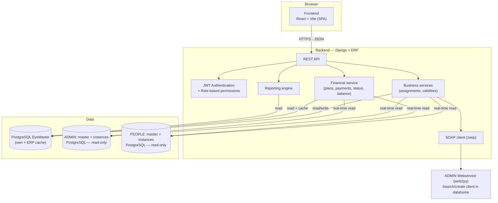
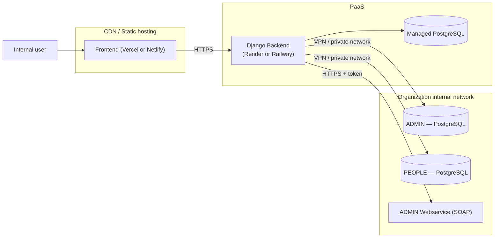
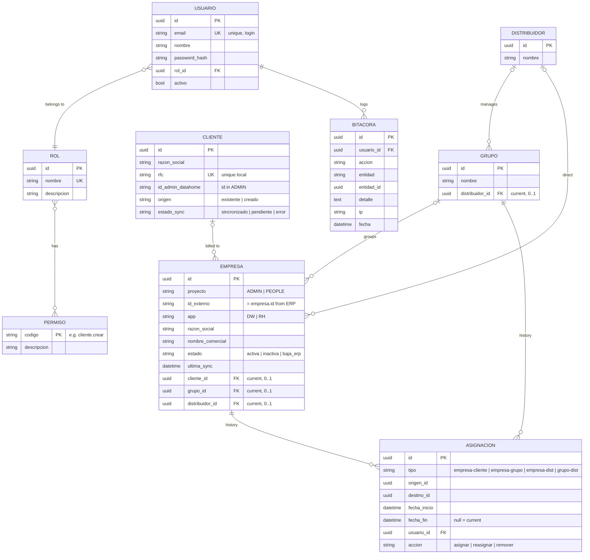
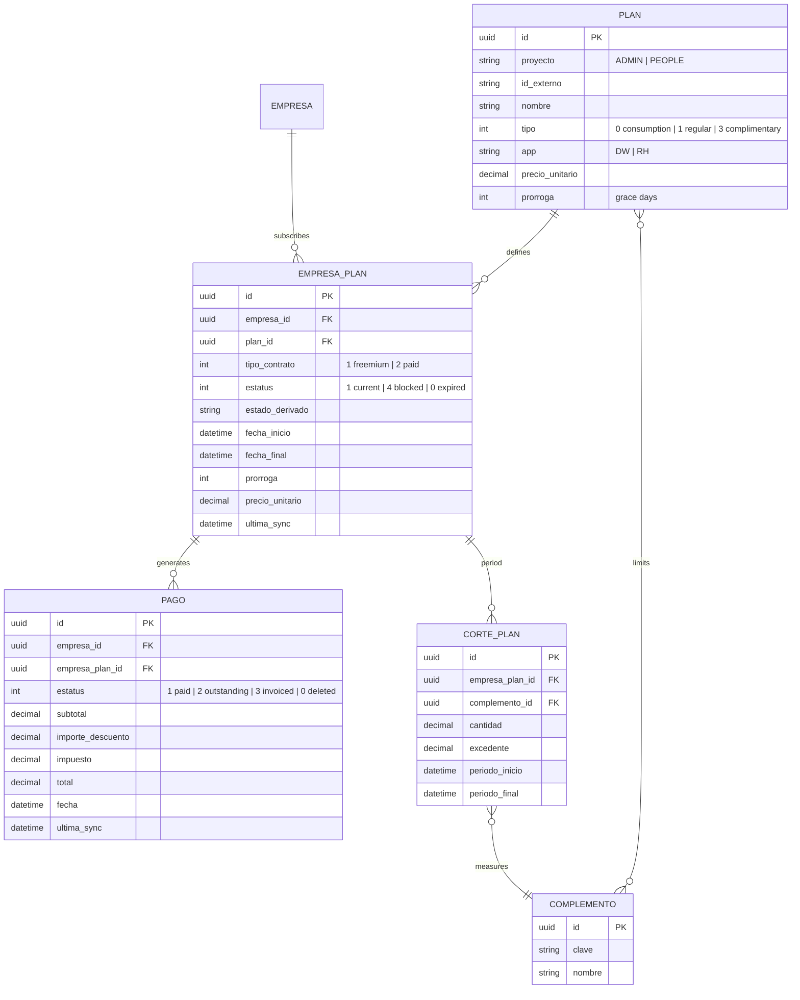

# EyeMaster V2 — Delivery 1 (documentation)

> This document follows the **official delivery template** of the Master.
> For the expanded functional documentation (glossary, detailed modules, open items, improvements, etc.) see `documentacion-funcional.md` in the repository root.

## Index

0. [Project details](#0-project-details)
1. [General product description](#1-general-product-description)
2. [System architecture](#2-system-architecture)
3. [Data model](#3-data-model)
4. [API specification](#4-api-specification)
5. [User stories](#5-user-stories)
6. [Work tickets](#6-work-tickets)
7. [Pull requests](#7-pull-requests)

---

## 0. Project details

### 0.1. Full name
Jairo Alberto Sánchez Suárez

### 0.2. Project name
**EyeMaster V2**

### 0.3. Brief project description
Internal administrative system that **centralizes** the commercial and financial operation of companies registered in two external ERPs (**ADMIN** and **PEOPLE**). EyeMaster does not replace the ERPs: it reads them in real time (read-only), locally manages commercial relationships (billable client, group, and distributor) with historical traceability, and exposes a reports module that combines both sources.

### 0.4. Project URL
Not applicable in this delivery. Delivery 1 corresponds only to the technical documentation of the product; no application is deployed yet.

### 0.5. Repository URL
https://github.com/jairosanchez90/AI4Devs-finalproject.git

---

## 1. General product description

### 1.1. Objective

**Purpose.** Provide a single source of truth for the commercial and financial operation of companies that already live in two independent ERPs (ADMIN and PEOPLE).

**Value.** Answers, in one place and with historical traceability, questions that today require manual reconciliation:
- *Which companies does this distributor handle?*
- *Which client is invoiced for this company?*
- *How much does group X, distributor Y, company Z owe?*
- *Which companies are about to expire? Which are blocked?*
- *What are the monthly revenues by project and commercial suite?*

**Who benefits.** Internal teams: commercial management (consolidated view), administration (daily management), executives (queries and reports). Not a product aimed at the external end user.

### 1.2. Main features and functionalities

| Block | Functionality |
|---|---|
| **Access and security** | JWT authentication, role and permission control configurable from the system, audit log of sensitive actions. |
| **Clients** | Validated registration against ADMIN's `datahome` catalog (searches by RFC; creates if not found via SOAP webservice); retry if the service does not respond. |
| **Companies** | Real-time search and "retrieval" of companies from ADMIN or PEOPLE (read-only); EyeMaster never creates them. |
| **Commercial structure** | Assignment of client, group, and distributor to each company, with validity (`from / until`), exclusivity validations, and distributor inheritance from the group. |
| **Plans and subscriptions** | Query of plan catalog, active plan per company, and its operational status (current, expired, blocked). |
| **Payments and outstanding balance** | Payment query per company and outstanding balance calculation aggregatable by client, group, or distributor. |
| **Reports** | Reporting engine with a flexible engine (`measure × dimensions × filters × as_of_date`) and a predefined report catalog. |
| **Audit** | Consultable append-only audit log. |

**What it does NOT do (explicit delimitation).**

- Does not create companies in the ERPs.
- Does not generate charges or invoices.
- Does not write to ADMIN or PEOPLE (sole exception: client registration via SOAP to `datahome`).
- Does not process online payments.

### 1.3. Design and user experience

**Not applicable in this delivery.** Delivery 1 corresponds to the technical documentation of the product. Screens and the video tutorial will be included in subsequent deliveries, when the React SPA implementation exists.

### 1.4. Installation instructions

**Not applicable in this delivery.** The project is in the documentation phase; there is no executable code. The installation guide (backend and frontend dependencies, environment variables, migrations, seed data, and local startup) will be delivered alongside the first functional version of the product.

For reference for subsequent deliveries, the planned stack is:

| Component | Technology |
|---|---|
| Backend | Django + Django REST Framework, `djangorestframework-simplejwt`, `zeep` (SOAP) |
| Frontend | React + Vite (decoupled SPA) |
| Database | PostgreSQL (EyeMaster local) |
| Integrations | Two external PostgreSQL databases (ADMIN, PEOPLE) read-only + ADMIN SOAP webservice |

---

## 2. System Architecture

### 2.1. Architecture diagram


```mermaid
flowchart TB
    subgraph NAV["Browser"]
        SPA["Frontend<br/>React + Vite (SPA)"]
    end
    subgraph BACK["Backend — Django + DRF"]
        API["REST API"]
        AUTH["JWT Authentication<br/>+ Role-based permissions"]
        BIZ["Business services<br/>(assignments, validities)"]
        FIN["Financial service<br/>(plans, payments, status, balance)"]
        REP["Reporting engine"]
        SOAP["SOAP client (zeep)"]
    end
    subgraph DB["Data"]
        LOCAL[("PostgreSQL EyeMaster<br/>(own + ERP cache)")]
        ADB[("ADMIN: master + instances<br/>PostgreSQL — read-only")]
        PDB[("PEOPLE: master + instances<br/>PostgreSQL — read-only")]
    end
    WS["ADMIN Webservice (web2py)<br/>Search/create client in datahome"]

    SPA -->|"HTTPS · JSON"| API
    API --> AUTH
    API --> BIZ
    API --> FIN
    API --> REP
    BIZ -->|"read/write"| LOCAL
    FIN -->|"read + cache"| LOCAL
    REP -->|"read"| LOCAL
    BIZ -->|"real-time read"| ADB
    BIZ -->|"real-time read"| PDB
    FIN -->|"real-time read"| ADB
    FIN -->|"real-time read"| PDB
    BIZ --> SOAP
    SOAP --> WS
```

**Pattern.** **Hybrid decoupled architecture** combining a **consolidation layer (data hub) pattern** with a stateless **SPA frontend + REST API**.

**Justification.** The organization already has two production ERPs that cannot be modified in their billing flow. EyeMaster needs to:

1. **Read and combine** both without risk of corrupting them → **read-only** connections + local cache.
2. **Locally manage** information that no ERP stores (client-group-distributor relationships with history).
3. **Serve fast queries** on aggregated data → financial cache with `ultima_sync`.
4. **Enable consolidated reports** → flexible engine on a star model.

**Main benefits.**

| Benefit | Detail |
|---|---|
| ERP isolation | Django routers with limited permissions guarantee that a bug in EyeMaster cannot write to ADMIN or PEOPLE. |
| Independent evolution | Frontend and backend are deployed separately; the team can iterate UI without touching the API. |
| Consolidated reports | The star model allows crossing both ERPs with uniform dimensions (Project, App, Time, Client, Group, Distributor). |
| Temporal traceability | Assignments with validity (`fecha_inicio / fecha_fin`) enable "as of date" queries without additional structure. |
| Low ERP coupling | Only depends on existing tables; an ERP schema change affects EyeMaster at a single point: the `ERPFinanceService`. |

**Trade-offs and deficits.**

| Trade-off | Detail |
|---|---|
| Latency and freshness | The local cache serves fast queries but introduces a delay relative to the ERP (defining acceptable `ultima_sync` is a pending decision). |
| Temporary dual source of truth | If the cache fails, information may become stale; mitigated by always showing `ultima_sync` and allowing on-demand refresh. |
| Multi-tenant complexity | Resolving master → instance per company in two ERPs duplicates the connection logic. |
| Composite identity | With two databases where IDs can collide, every company reference requires `(proyecto, id_externo)`, not just the external id. |
| Not the financial source of truth | EyeMaster reads billing but does not originate it; any discrepancy with the ERP is resolved in favor of the ERP. |

### 2.2. Description of main components

| Component | Technology | Responsibility |
|---|---|---|
| **Frontend (SPA)** | React + Vite | User interface; consumes the REST API with JWT. |
| **REST API** | Django REST Framework | Exposes endpoints; orchestrates services; applies permissions. |
| **Authentication and permissions** | `djangorestframework-simplejwt` + Django auth | Issues JWT, verifies tokens, validates permissions by code (own RBAC on Django engine). |
| **Business service** | Django (services) | Assignment validations, inheritance, validities, and audit log. |
| **Financial service (`ERPFinanceService`)** | Django (services) + PostgreSQL drivers | Reads `plan`, `empresa_plan`, `pago`, `corte_plan` from the ERPs and maintains the local cache. |
| **Reporting engine** | Django + SQL | Flexible engine that resolves `measure × dimensions × filters × as_of_date` on the star model. |
| **SOAP client** | `zeep` | Consumes ADMIN's webservice (`search` and `create` client in `datahome`) with access token. |
| **PostgreSQL EyeMaster** | PostgreSQL | Stores own data (users, assignments, audit log) and the financial cache (`cache_plan`, `cache_pago`...). |
| **ADMIN / PEOPLE (DB)** | External PostgreSQL | Source databases; **read-only** access via dedicated Django routers. |
| **ADMIN Webservice** | SOAP over web2py | Only point where EyeMaster writes to an external system (client registration in `datahome`). |

### 2.3. High-level project description and file structure

**Not applicable in this delivery.** The file structure will be defined when implementation begins. The planned structure, aligned with Django + React best practices, will be:

```
eyemaster/
├── backend/
│   ├── apps/
│   │   ├── accounts/        # Users, roles, permissions
│   │   ├── clientes/        # Client catalog + SOAP
│   │   ├── empresas/        # Retrieval and mirrors
│   │   ├── comercial/       # Groups, distributors, assignments
│   │   ├── financiero/      # Cache plan, empresa_plan, pago
│   │   ├── reportes/        # Flexible engine + catalog
│   │   └── auditoria/       # Audit log
│   ├── core/                # Settings, routers, middleware
│   ├── services/            # ERPService, AdminSoapService, EstatusPlanService, AdeudoService
│   └── manage.py
├── frontend/
│   ├── src/
│   │   ├── pages/
│   │   ├── components/
│   │   ├── services/        # HTTP clients, JWT
│   │   └── App.tsx
│   └── vite.config.ts
├── docs/
│   ├── readme.md                    # Official delivery document (Master template)
│   ├── documentacion-funcional.md   # Expanded functional analysis
│   ├── prompts.md
│   ├── reglas_cobranza.md
│   └── tickets.md
└── README.md
```

Planned pattern: **Django apps by domain** (not by technical layer), following the *bounded context* principle of lightweight DDD. Cross-cutting services (`ERPFinanceService`, `AsignacionService`, `EstatusPlanService`) live outside the apps to avoid circular coupling.

### 2.4. Infrastructure and deployment

**Not fully applicable in this delivery** (no deployed artifacts). The planned infrastructure is described below:


```mermaid
flowchart LR
    subgraph CDN["CDN / Static hosting"]
        FE["Frontend (Vercel or Netlify)"]
    end
    subgraph PAAS["PaaS"]
        BE["Django Backend<br/>(Render or Railway)"]
        DB[("Managed PostgreSQL")]
    end
    subgraph ORG["Organization internal network"]
        ADMIN[("ADMIN — PostgreSQL")]
        PEOPLE[("PEOPLE — PostgreSQL")]
        WS["ADMIN Webservice (SOAP)"]
    end

    USER["Internal user"] --> FE
    FE -->|"HTTPS"| BE
    BE --> DB
    BE -->|"VPN / private network"| ADMIN
    BE -->|"VPN / private network"| PEOPLE
    BE -->|"HTTPS + token"| WS
```

**Planned deployment process:**

1. **Backend.** Docker image built in CI from `backend/Dockerfile`; deployed on Render or Railway with environment variables (`SECRET_KEY`, `DATABASE_URL`, ADMIN and PEOPLE credentials, SOAP token).
2. **Frontend.** Static build (`npm run build`) on Vercel or Netlify; `VITE_API_URL` points to the backend.
3. **Migrations.** `python manage.py migrate` on each backend deploy.
4. **Financial cache.** Scheduled job (Celery beat or PaaS equivalent) that invokes `SyncService` with the agreed periodicity (pending, see `documentacion-funcional.md` PD-10).
5. **Secrets.** Managed as PaaS environment variables; never in the repository.

### 2.5. Security

Planned practices and why:

| Practice | Implementation | Example |
|---|---|---|
| **JWT authentication** | Signed tokens, short life + refresh. | Login → `POST /api/auth/login` returns `access` and `refresh`; frontend includes `Authorization: Bearer <jwt>` in each request. |
| **Role-based access control (RBAC)** | Each endpoint validates a permission by code. Permissions per role are configured from the system. | The endpoint `POST /api/clientes` requires permission `cliente.crear`; without it, responds `403`. |
| **Password hashing** | Django mechanism (PBKDF2 by default). | Passwords are never stored or logged in plain text. |
| **Read-only connections to the ERPs** | Django routers with PostgreSQL user with `SELECT` privileges only. | Even if a bug attempts an `INSERT` on ADMIN, PostgreSQL rejects the operation at the engine level. |
| **Append-only audit** | `Bitacora` table without allowed `UPDATE` or `DELETE`. | Login, client registration, assignments, and permission changes are traced; only administrators can query it. |
| **RFC and duplicate validation** | Client registration verifies RFC locally before invoking SOAP. | Prevents propagating duplicates to `datahome`. |
| **Error messages without information leakage** | Invalid credentials return generic `401`. | Does not indicate whether the issue is the user or the password. |
| **CORS configured** | Only the frontend domain authorized. | Blocks requests from other origins. |
| **Secrets outside the code** | Environment variables; never in the repository. | `DATABASE_URL`, SOAP token, JWT keys live in the PaaS. |
| **Partial unique constraint in DB** | Engine-level guarantee that a current assignment is unique. | Even if two concurrent sessions try to assign the same group, PostgreSQL rejects the second. |

### 2.6. Tests

**Not applicable in this delivery.** The testing strategy is defined for subsequent deliveries:

| Level | Planned tool | Focus |
|---|---|---|
| Backend unit | `pytest` + `pytest-django` | Validations, inheritance, outstanding balance calculation, validity close and open. |
| Integration | `pytest` with test database | Complete REST endpoints, authentication cycle, search-or-create client registration. |
| Frontend unit | Vitest + React Testing Library | Selector components, status badges, forms. |
| E2E | Playwright | Critical flows: login, retrieve company, assign group, query report. |
| ERP contract | Tests with mirror databases or mocks | That SQL queries to ADMIN and PEOPLE continue working on model changes. |

---

## 3. Data Model

### 3.1. Data model diagram

#### Own data — commercial structure


```mermaid
erDiagram
    USUARIO }o--|| ROL : "belongs to"
    ROL }o--o{ PERMISO : "has"
    CLIENTE |o--o{ EMPRESA : "billed to"
    GRUPO |o--o{ EMPRESA : "groups"
    DISTRIBUIDOR |o--o{ GRUPO : "manages"
    DISTRIBUIDOR |o--o{ EMPRESA : "direct"
    EMPRESA ||--o{ ASIGNACION : "history"
    GRUPO ||--o{ ASIGNACION : "history"
    USUARIO ||--o{ BITACORA : "logs"

    USUARIO {
        uuid id PK
        string email UK "unique, login"
        string nombre
        string password_hash
        uuid rol_id FK
        bool activo
    }
    ROL {
        uuid id PK
        string nombre UK
        string descripcion
    }
    PERMISO {
        string codigo PK "e.g. cliente.crear"
        string descripcion
    }
    CLIENTE {
        uuid id PK
        string razon_social
        string rfc UK "unique local"
        string id_admin_datahome "id in ADMIN"
        string origen "existente | creado"
        string estado_sync "sincronizado | pendiente | error"
    }
    EMPRESA {
        uuid id PK
        string proyecto "ADMIN | PEOPLE"
        string id_externo "= empresa.id from ERP"
        string app "DW | RH"
        string razon_social
        string nombre_comercial
        string estado "activa | inactiva | baja_erp"
        datetime ultima_sync
        uuid cliente_id FK "current, 0..1"
        uuid grupo_id FK "current, 0..1"
        uuid distribuidor_id FK "current, 0..1"
    }
    GRUPO {
        uuid id PK
        string nombre
        uuid distribuidor_id FK "current, 0..1"
    }
    DISTRIBUIDOR {
        uuid id PK
        string nombre
    }
    ASIGNACION {
        uuid id PK
        string tipo "empresa-cliente | empresa-grupo | empresa-dist | grupo-dist"
        uuid origen_id
        uuid destino_id
        datetime fecha_inicio
        datetime fecha_fin "null = current"
        uuid usuario_id FK
        string accion "asignar | reasignar | remover"
    }
    BITACORA {
        uuid id PK
        uuid usuario_id FK
        string accion
        string entidad
        uuid entidad_id
        text detalle
        string ip
        datetime fecha
    }
```

#### ERP cache — financial model (read-only from ERP)


```mermaid
erDiagram
    EMPRESA ||--o{ EMPRESA_PLAN : "subscribes"
    PLAN ||--o{ EMPRESA_PLAN : "defines"
    PLAN }o--o{ COMPLEMENTO : "limits"
    EMPRESA_PLAN ||--o{ PAGO : "generates"
    EMPRESA_PLAN ||--o{ CORTE_PLAN : "period"
    CORTE_PLAN }o--|| COMPLEMENTO : "measures"

    PLAN {
        uuid id PK
        string proyecto "ADMIN | PEOPLE"
        string id_externo
        string nombre
        int tipo "0 consumption | 1 regular | 3 complimentary"
        string app "DW | RH"
        decimal precio_unitario
        int prorroga "grace days"
    }
    EMPRESA_PLAN {
        uuid id PK
        uuid empresa_id FK
        uuid plan_id FK
        int tipo_contrato "1 freemium | 2 paid"
        int estatus "1 current | 4 blocked | 0 expired"
        string estado_derivado
        datetime fecha_inicio
        datetime fecha_final
        int prorroga
        decimal precio_unitario
        datetime ultima_sync
    }
    PAGO {
        uuid id PK
        uuid empresa_id FK
        uuid empresa_plan_id FK
        int estatus "1 paid | 2 outstanding | 3 invoiced | 0 deleted"
        decimal subtotal
        decimal importe_descuento
        decimal impuesto
        decimal total
        datetime fecha
        datetime ultima_sync
    }
    CORTE_PLAN {
        uuid id PK
        uuid empresa_plan_id FK
        uuid complemento_id FK
        decimal cantidad
        decimal excedente
        datetime periodo_inicio
        datetime periodo_final
    }
    COMPLEMENTO {
        uuid id PK
        string clave
        string nombre
    }
```

### 3.2. Description of main entities

**USUARIO** — internal system users.

| Attribute | Type | Constraints | Description |
|---|---|---|---|
| `id` | UUID | PK | Unique identifier. |
| `email` | string | UNIQUE, NOT NULL | Used as login. |
| `nombre` | string | NOT NULL | User name. |
| `password_hash` | string | NOT NULL | Django hash (PBKDF2). |
| `rol_id` | UUID | FK → ROL, NOT NULL | Assigned role. |
| `activo` | bool | NOT NULL, default true | If false, cannot log in. |

**ROL / PERMISO** — own RBAC model. N:M relationship between `ROL` and `PERMISO`. Permissions identified by code (`cliente.crear`, `empresa.asignar_grupo`...).

**CLIENTE** — local catalog of billable clients.

| Attribute | Type | Constraints | Description |
|---|---|---|---|
| `id` | UUID | PK | |
| `rfc` | string | UNIQUE, NOT NULL | Mexican RFC unique in EyeMaster. |
| `razon_social` | string | NOT NULL | |
| `id_admin_datahome` | string | NULL if pending | Identifier in `datahome` (ADMIN). |
| `origen` | enum | `existente \| creado` | Whether linked to an existing one or created via SOAP. |
| `estado_sync` | enum | `sincronizado \| pendiente \| error` | Synchronization status with ADMIN. |

**EMPRESA** — local mirror of companies that live in the ERPs.

| Attribute | Type | Constraints | Description |
|---|---|---|---|
| `id` | UUID | PK | |
| `proyecto` | enum | NOT NULL | `ADMIN` or `PEOPLE`. |
| `id_externo` | string | NOT NULL | `empresa.id` from the corresponding ERP. |
| `app` | enum | | `DW` (Datawork) or `RH` (RH-Cloud). Reporting dimension. |
| `razon_social` | string | NOT NULL | ERP mirror. |
| `nombre_comercial` | string | | ERP mirror. |
| `estado` | enum | NOT NULL | `activa \| inactiva \| baja_erp`. |
| `ultima_sync` | datetime | NOT NULL | Last time refreshed from the ERP. |
| `cliente_id` | UUID | FK → CLIENTE, NULL | Current client (0..1). |
| `grupo_id` | UUID | FK → GRUPO, NULL | Current group (0..1). |
| `distribuidor_id` | UUID | FK → DISTRIBUIDOR, NULL | Current distributor (0..1). |

**Identity constraint:** `UNIQUE (proyecto, id_externo)`. ERP IDs can overlap between ADMIN and PEOPLE; the combination disambiguates them.

**GRUPO** — groups companies commercially. Has current `distribuidor_id` (0..1).

**DISTRIBUIDOR** — commercial account manager. Handles companies directly or via groups.

**ASIGNACION** — time-bounded relationship between two entities. It is the central entity of the history.

| Attribute | Type | Constraints | Description |
|---|---|---|---|
| `id` | UUID | PK | |
| `tipo` | enum | NOT NULL | `empresa-cliente \| empresa-grupo \| empresa-dist \| grupo-dist`. |
| `origen_id` | UUID | NOT NULL | Source entity (company or group). |
| `destino_id` | UUID | NOT NULL | Target entity. |
| `fecha_inicio` | datetime | NOT NULL | |
| `fecha_fin` | datetime | NULL | `NULL` = current. |
| `usuario_id` | UUID | FK → USUARIO, NOT NULL | Who made the change. |
| `accion` | enum | NOT NULL | `asignar \| reasignar \| remover`. |

**Critical constraint:** partial unique index on `(origen_id, tipo) WHERE fecha_fin IS NULL`. Guarantees, at the engine level, that only one current assignment per (entity, type) exists. Prevents race conditions between concurrent sessions.

**BITACORA** — append-only record of sensitive actions.

**EMPRESA_PLAN (cache)** — a company's subscription to a plan.

| Attribute | Type | Constraints | Description |
|---|---|---|---|
| `estatus` | int | NOT NULL | `1` current, `4` blocked, `0` expired. |
| `estado_derivado` | enum | | Calculated: current / expired / blocked from status + fecha_final + grace periods. |
| `fecha_final` | datetime | NOT NULL | End of period. |
| `prorroga` | int | NOT NULL, default 0 | Remaining grace days. |
| `tipo_contrato` | int | NOT NULL | `1` freemium / `2` paid. |
| `ultima_sync` | datetime | NOT NULL | |

**PAGO (cache)** — ERP-generated charge at the company level.

| Attribute | Type | Constraints | Description |
|---|---|---|---|
| `estatus` | int | NOT NULL | `1` paid, `2` outstanding, `3` invoiced, `0` deleted. |
| `subtotal` | decimal | NOT NULL | Net, without VAT. |
| `importe_descuento` | decimal | NOT NULL, default 0 | |
| `impuesto` | decimal | NOT NULL | VAT 16%, calculated on top of subtotal. |
| `total` | decimal | NOT NULL | `subtotal − discount + tax`. ERP source of truth. |
| `ultima_sync` | datetime | NOT NULL | |

> The four amount columns are stored **itemized**; never calculated on the fly. A **company's outstanding balance** = `Σ pago.total WHERE estatus = 2 AND empresa_id = X`, VAT included.

---

## 4. API Specification

Three representative endpoints documented in **OpenAPI 3.0** format. The complete API (≈ 30 endpoints) is detailed in `documentacion-funcional.md` §8.

```yaml
openapi: 3.0.3
info:
  title: EyeMaster V2 API
  version: 0.1.0
  description: EyeMaster internal REST API. JWT authentication on all endpoints.

servers:
  - url: https://api.eyemaster.local/api
    description: Production (pending)

security:
  - bearerAuth: []

components:
  securitySchemes:
    bearerAuth:
      type: http
      scheme: bearer
      bearerFormat: JWT

paths:

  /clientes:
    post:
      summary: Client registration (search or create in ADMIN)
      description: |
        Searches RFC in ADMIN's `datahome` catalog via SOAP.
        - If found → link local (`origen=existente`).
        - If not found → create in ADMIN and link (`origen=creado`).
        - If ADMIN does not respond → save local with `estado_sync=pendiente`.
      requestBody:
        required: true
        content:
          application/json:
            schema:
              type: object
              required: [rfc, razon_social]
              properties:
                rfc: { type: string, example: "XAXX010101000" }
                razon_social: { type: string, example: "Comercializadora Demo SA de CV" }
      responses:
        "201":
          description: Created or linked successfully
          content:
            application/json:
              schema:
                type: object
                properties:
                  id: { type: string, format: uuid }
                  rfc: { type: string }
                  razon_social: { type: string }
                  id_admin_datahome: { type: string }
                  origen: { type: string, enum: [existente, creado] }
                  estado_sync: { type: string, enum: [sincronizado] }
        "202":
          description: ADMIN did not respond; client saved as pending
        "409":
          description: RFC already registered in EyeMaster

  /empresas/{id}/grupo:
    put:
      summary: Assign group to a company
      description: |
        Assigns a current group to the company.
        - If already belongs to another current group → `409`.
        - If has a direct distributor different from the group's → `409`.
        - Every assignment closes the previous validity and opens a new one.
      parameters:
        - in: path
          name: id
          required: true
          schema: { type: string, format: uuid }
      requestBody:
        required: true
        content:
          application/json:
            schema:
              type: object
              required: [grupo_id]
              properties:
                grupo_id: { type: string, format: uuid }
      responses:
        "200":
          description: Assignment created
        "404":
          description: Company or group not found
        "409":
          description: Validation conflict

  /reportes/consulta:
    post:
      summary: Flexible reporting engine query
      description: |
        Flexible engine: `measure × dimensions × filters × as_of_date`.
        "As of date" queries reconstruct assignments that were current at that time.
      requestBody:
        required: true
        content:
          application/json:
            schema:
              type: object
              required: [medida, dimensiones]
              properties:
                medida:
                  type: string
                  enum: [adeudo, pagado, ingreso_total, ingreso_neto, conteo_planes, consumo, excedente]
                dimensiones:
                  type: array
                  items:
                    type: string
                    enum: [cliente, grupo, distribuidor, empresa, plan, complemento, mes, proyecto, app, tipo_contrato]
                filtros:
                  type: object
                  additionalProperties: true
                a_fecha:
                  type: string
                  format: date
            example:
              medida: adeudo
              dimensiones: [distribuidor, empresa]
              filtros: { proyecto: ADMIN, adeudo_min: 0.01 }
              a_fecha: "2026-06-30"
      responses:
        "200":
          description: Query result
          content:
            application/json:
              example:
                medida: adeudo
                a_fecha: "2026-06-30"
                total: 152340.50
                filas:
                  - { distribuidor: "Distribuidor Norte", empresa: "Empresa A", adeudo: 12500.00 }
                  - { distribuidor: "Distribuidor Norte", empresa: "Empresa B", adeudo: 8400.50 }
        "400":
          description: Invalid measure × dimension combination, or malformed filters
```

---

## 5. User Stories

### User Story 1 — HU-02 — Client registration with search or creation in ADMIN

**As** an Administrative operator,
**I want** to register a client by searching first in ADMIN by RFC,
**so that** I avoid duplicates and maintain consistency between EyeMaster and the ERP.

**Acceptance criteria (Gherkin).**

```gherkin
Feature: Validated client registration against ADMIN

  Scenario: RFC exists in ADMIN
    Given a valid RFC that already exists in datahome
    When the operator sends POST /api/clientes
    Then it is linked to the existing client
    And the response is 201 with origen="existente" and estado_sync="sincronizado"

  Scenario: RFC does not exist in ADMIN
    Given a valid RFC that does NOT exist in datahome
    When the operator sends POST /api/clientes
    Then the client is created in ADMIN via SOAP
    And the response is 201 with origen="creado" and estado_sync="sincronizado"

  Scenario: ADMIN does not respond
    Given a valid RFC
    And the ADMIN SOAP webservice is down
    When the operator sends POST /api/clientes
    Then it is saved locally with estado_sync="pendiente"
    And the response is 202

  Scenario: Local duplicate RFC
    Given an RFC already registered in EyeMaster
    When the operator sends POST /api/clientes
    Then the response is 409
```

**Priority:** Must-have.
**Notes:** all successful registrations are recorded in the audit log (sensitive action).

---

### User Story 2 — HU-05 — Assignment to group and/or distributor with validations

**As** an Administrative operator,
**I want** to assign a company to a group and/or distributor with validations,
**so that** I maintain a coherent and traceable commercial structure.

**Acceptance criteria (Gherkin).**

```gherkin
Feature: Assignment with validity and inheritance

  Scenario: Assign group when company is free
    Given the company has NO current group
    When the operator sends PUT /api/empresas/{id}/grupo with a valid group
    Then a current assignment is created
    And the response is 200

  Scenario: Reassign to another group
    Given the company belongs to a current group
    When the operator sends PUT with another group
    Then the previous assignment is closed (fecha_fin=now)
    And a new one is created (fecha_inicio=now, fecha_fin=null)
    And the previous assignment is never physically deleted

  Scenario: Inherit distributor from group
    Given the group has a current distributor
    When the company is assigned to that group
    Then the company automatically inherits the group's distributor

  Scenario: Conflict when assigning direct distributor
    Given the company belongs to a group
    When the operator tries to assign a distributor different from the group's
    Then the response is 409 with message "distributor inherited from group"
```

**Priority:** Must-have.

---

### User Story 3 — HU-11 — Reporting engine (flexible queries and catalog)

**As** an Executive,
**I want** to generate flexible and predefined reports on companies, plans, payments, and outstanding balances,
**so that** I can answer any commercial operation question without manually reconciling between the two ERPs.

**Acceptance criteria.**

- The UI allows selecting **measure**, one or more **dimensions**, optional **filters**, and a **cut-off date** (`a_fecha`).
- "As of date" queries use the state of **assignments** that were current at that time (not the current state).
- Aggregates by **client, group, and distributor** are calculated from companies currently linked to them.
- **Complimentary and trial plans** (`tipo_empresa = 3`) are reported **separately** from paid sales.
- The predefined catalog includes at least: *client/group/distributor → companies and outstanding balance*, *which companies owe me?*, *how much does X owe?*, *companies about to expire*, *outstanding balance aging*, *best-selling plan*, *top companies by revenue*, *revenue by period*, *consumption vs. limit by add-on*.
- Results are exportable (format and limit pending).

**Priority:** Must-have.

---

## 6. Work Tickets

### Ticket 1 — Backend — `TK-08-02` `AdeudoService`: outstanding balance calculation per company and aggregations

**Type:** Backend
**Related story:** HU-10, HU-11
**Layer:** Business services
**Estimate:** 5 points

**Description.**
Build the service that calculates a company's outstanding balance (direct query to `Pago` cache) and aggregations by client, group, and distributor. The service must use **current** relationships between companies and their commercial counterparts to sum correctly.

**Objectives / acceptance criteria.**

- Function `adeudo_por_empresa(empresa_id)` → `Decimal` returning `Σ pago.total WHERE estatus = 2 AND empresa_id = X` (with VAT).
- Function `adeudo_por_cliente(cliente_id)` → sum of outstanding balance of companies with current `cliente_id` in EyeMaster.
- Analogous functions `adeudo_por_grupo` and `adeudo_por_distribuidor` (the latter includes direct companies + inherited companies via group).
- Result rounded to 2 decimal places (MXN).
- Unit test coverage ≥ 90% on the service.
- "As of date" variant: accepts an optional `a_fecha` parameter and, if provided, uses assignments that were current at that date instead of the current ones.

**Technical tasks.**

1. Define the service's public interface in `backend/services/adeudo_service.py`.
2. Implement `Pago` query with index on `(empresa_id, estatus)` for performance.
3. Implement company resolution by client/group/distributor reusing `AsignacionService`.
4. Implement "as of date" variant using `Asignacion` table (filtering `fecha_inicio ≤ a_fecha AND (fecha_fin IS NULL OR fecha_fin > a_fecha)`).
5. Expose endpoints `/api/empresas/{id}/adeudo`, `/api/clientes/{id}/adeudo`, `/api/grupos/{id}/adeudo`, `/api/distribuidores/{id}/adeudo`.
6. Unit tests covering:
   - company with no payments → 0;
   - company with multiple payments in different statuses;
   - aggregation crossing two ERPs;
   - "as of date" aggregation with distributor change.

**Dependencies.**
- Cache models (`TK-07-02`) must exist.
- `AsignacionService` (`TK-05-02`) must be implemented.

**Technical notes.**
- VAT is already included in `pago.total`; it should not be added again.
- Use `Decimal`, **not** `float`, to avoid rounding errors.
- Handle the case of a company with both `distribuidor_id` direct AND `grupo_id` (should not occur due to R-EST-04; if detected, log an alert).

**Definition of done.**
- Tests pass in CI.
- Endpoints documented in OpenAPI.
- Code review approved.
- Performance: outstanding balance query for a distributor with 1000 companies < 500 ms in test environment.

---

### Ticket 2 — Frontend — `TK-09-04` Reporting engine UI (selector, tables, and export)

**Type:** Frontend
**Related story:** HU-11
**Layer:** React (SPA)
**Estimate:** 8 points

**Description.**
Build the Reporting engine screen, which is the visible face of the flexible engine (`POST /api/reportes/consulta`). It must offer two modes: predefined catalog (shortcuts) and free query.

**Objectives / acceptance criteria.**

- Single view at `/reportes` with three zones: **report selector** (catalog or "custom"), **filters**, **results**.
- In catalog mode, show 9–11 shortcuts with label and short description.
- In custom mode, allow selecting **measure** (single combo), **dimensions** (orderable multi-select), **filters** (proyecto, app, tipo_contrato, adeudo_min, plan, etc.), and **as of date**.
- Results table with dynamic columns per dimensions and measure; total at the bottom.
- "Export" button (format pending, see `documentacion-funcional.md` PD-12).
- Loading, error, and empty states clearly differentiated.
- Client validation: invalid measure × dimension combinations blocked before sending.
- Basic accessibility: ARIA labels, keyboard navigation.

**Technical tasks.**

1. Create `src/pages/Reportes/ReportesPage.tsx` with its subcomponents:
   - `SelectorMedida.tsx`, `SelectorDimensiones.tsx`, `FiltrosBuilder.tsx`, `TablaResultados.tsx`.
2. Create `src/services/reportesService.ts` with `consultar(payload)` and `catalogo()`.
3. Local state with `useReducer` (or `zustand`) to build the query payload.
4. Conditional render based on `medida.length` and `dimensiones.length`.
5. Simple cache by payload (no repeat of identical query < 30 s).
6. Tests with Vitest + React Testing Library:
   - render selector with catalog;
   - valid payload construction;
   - error 400 handling (invalid combination).

**Dependencies.**
- Endpoints `/api/reportes` and `/api/reportes/consulta` operational (`TK-09-02`, `TK-09-03`).
- Design system / base components (button, select, table) defined.

**UX notes.**
- Dimensions should be reorderable via drag-and-drop (better reading of hierarchical grouping).
- "Total" always visible even with many rows; horizontal scroll for wide tables should keep first columns fixed (Distributor/Group/Client).
- Show `a_fecha` above the result when used, to avoid confusion with current state.

**Definition of done.**
- Tests pass.
- View reviewed in design against mockups.
- No console warnings.
- Works in Chrome and Firefox.

---

### Ticket 3 — Database — `TK-04-01` `Asignacion` model with validities and partial uniqueness

**Type:** Database
**Related story:** HU-04, HU-05
**Layer:** Data model + migration
**Estimate:** 5 points

**Description.**
Create the `Asignacion` entity that centralizes the relationship history (company↔client, company↔group, company↔distributor, group↔distributor), guaranteeing at the **PostgreSQL engine level** that only one current assignment per `(origen_id, tipo)` exists.

**Objectives / acceptance criteria.**

- `asignacion` table created with the model fields (§3.2).
- **Partial unique index** in PostgreSQL: `CREATE UNIQUE INDEX asignacion_vigente_unica ON asignacion (origen_id, tipo) WHERE fecha_fin IS NULL;`.
- CHECK constraint: `fecha_fin IS NULL OR fecha_fin > fecha_inicio`.
- Correct foreign keys to `usuario` (`usuario_id`), no direct FK to source/target entities (polymorphic per `tipo`).
- Secondary indexes on `(origen_id, tipo, fecha_inicio DESC)` and on `(usuario_id)` for audit queries.
- Django migration generated in `backend/apps/comercial/migrations/`.
- Integration test: in a scenario with two concurrent transactions trying to create a current assignment of the same `(origen, tipo)`, **one of the two** must fail with `IntegrityError`.

**Technical tasks.**

1. Define the `Asignacion` model in `backend/apps/comercial/models.py`.
2. Add `class Meta` with Django `constraints` and `indexes`; use `UniqueConstraint(condition=Q(fecha_fin__isnull=True))` for the partial index.
3. Generate migration with `makemigrations`.
4. Verify the generated SQL and that `WHERE fecha_fin IS NULL` appears in the `CREATE INDEX`.
5. Tests:
   - normal assignment insertion;
   - close current assignment and open the next;
   - attempt at double validity → fails;
   - date check constraint.

**Dependencies.**
- User model (`TK-01-01`) must be ready (FK).
- `comercial` app must exist.

**Technical notes.**
- In Django 4.2+, `UniqueConstraint(condition=...)` correctly translates to partial index in PostgreSQL. In earlier versions, `RunSQL` is needed to create the index.
- Source/target entities are polymorphic (sometimes company, sometimes group); no formal FK is used. This is a trade-off: simplifies the model at the cost of no referential integrity in DB for `origen_id` and `destino_id`. Integrity is guaranteed by the service.
- Consider adding a trigger or additional constraint that validates coherence between `tipo` and the nature of `origen_id` / `destino_id` (optional, pending).

**Definition of done.**
- Migration applied in development environment.
- Concurrency test passes (with `pytest-django` and `--reuse-db`).
- Rollback plan documented.

---

## 7. Pull Requests

### Pull Request 1 — Initial project documentation (Delivery 1)

**Branch:** `docs/entrega-1` → `main`
**Type:** Documentation
**Status:** merged

**Description.**
Incorporates all technical documentation for Delivery 1: project details, functional description, architecture with decision justification (benefits and trade-offs), data model (commercial structure and ERP financial cache), OpenAPI specification of main endpoints, user stories in Gherkin, detailed tickets (BE/FE/DB), and the expanded functional analysis document.

**Included files:**

| File | Purpose |
|---|---|
| `readme.md` | Official delivery document, following the Master template. |
| `documentacion-funcional.md` | Expanded functional analysis: glossary, 8 detailed modules, numbered business rules (`R-SEG-`, `R-CLI-`, `R-EMP-`, etc.), integrity rules (`RI-`), open items (`PD-01..PD-20`), and improvement proposals. |
| `reglas_cobranza.md` | Financial rules verified against the ERP source code, with file and line citations. |
| `planes_pagos_diseno.md` | Walkthrough of the ERP's original billing model. |
| `prompts.md` | Relevant prompts used with the AI assistant during documentation preparation. |

**Main checks:**

- Valid Markdown in all documents.
- Mermaid diagrams render correctly (architecture, ER, flows).
- All points of the Master template are covered; what does not apply in this delivery is explicitly justified.
- Business rules are numbered and linkable.
- Open items are consolidated in a dedicated section.

---

### Future pull requests (subsequent deliveries)

Subsequent deliveries will include at least two additional PRs, representative of each implementation layer. They will be documented when executed:

- **PR — Backend.** Endpoint and service for a specific functional story (e.g., `AdeudoService` covering HU-10, described in Ticket 1 of §6).
- **PR — Frontend.** Screen and associated components (e.g., Reporting engine UI for HU-11, described in Ticket 2 of §6).
- **PR — Database.** `Asignacion` model with partial unique constraint and migration (described in Ticket 3 of §6).
