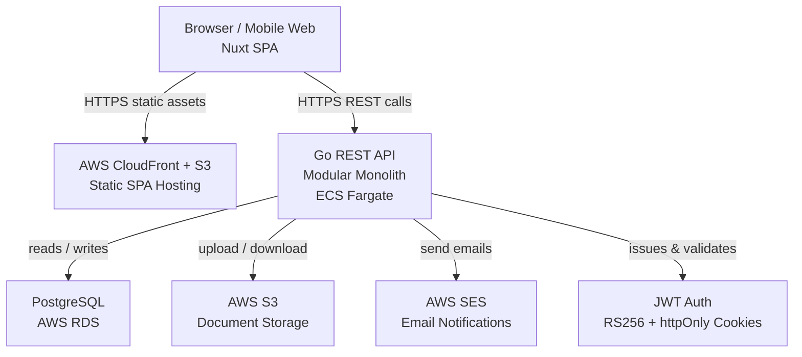
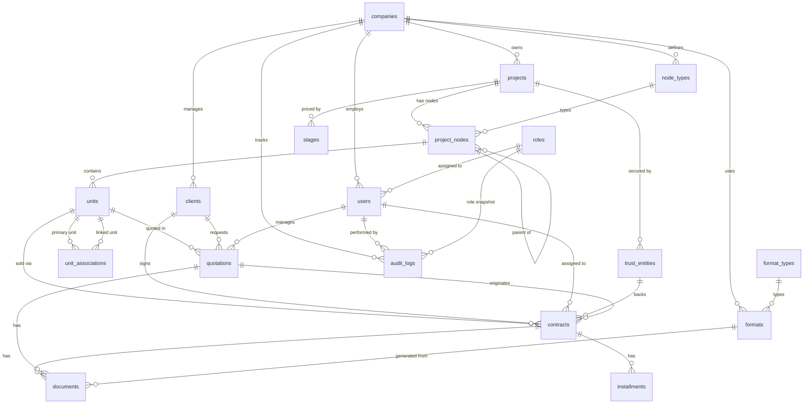

## Índice

0. [Ficha del proyecto](#0-ficha-del-proyecto)
1. [Descripción general del producto](#1-descripción-general-del-producto)
2. [Arquitectura del sistema](#2-arquitectura-del-sistema)
3. [Modelo de datos](#3-modelo-de-datos)
4. [Especificación de la API](#4-especificación-de-la-api)
5. [Historias de usuario](#5-historias-de-usuario)
6. [Tickets de trabajo](#6-tickets-de-trabajo)
7. [Pull requests](#7-pull-requests)

---

## 0. Ficha del proyecto

### **0.1. Tu nombre completo:**

Jonatan Camilo Bonilla Malaver

### **0.2. Nombre del proyecto:**

ConstructFlow

### **0.3. Descripción breve del proyecto:**

ConstructFlow is a web-based CRM and workflow management platform built for construction companies. It streamlines the entire lifecycle of a real estate project — from configuring projects and buildings, to managing buyers, tracking documentation, and handing over keys. Internal users are company employees (admins, sales agents); external users are the buyers.

### **0.4. URL del proyecto:**

> Puede ser pública o privada, en cuyo caso deberás compartir los accesos de manera segura. Puedes enviarlos a [alvaro@lidr.co](mailto:alvaro@lidr.co) usando algún servicio como [onetimesecret](https://onetimesecret.com/).

### 0.5. URL o archivo comprimido del repositorio

- Backend (Go): https://github.com/brolyssjl/constructflow-api
- Frontend (Nuxt): https://github.com/brolyssjl/constructflow-web

---

## 1. Descripción general del producto

> Describe en detalle los siguientes aspectos del producto:

### **1.1. Objetivo:**

ConstructFlow solves the operational fragmentation that construction sales teams face: client data scattered across spreadsheets, documents tracked manually, and no single view of a project's commercial pipeline. The platform provides a centralised CRM and workflow engine covering the full lifecycle — from initial project configuration to signed contracts, payment tracking, and key handover — reducing admin overhead and eliminating manual errors for construction companies and their buyers.

### **1.2. Características y funcionalidades principales:**

**1. User & Access Management** — employee accounts with RBAC (Admin, Seller, Staff), secure authentication and session management.

**2. Buyer Account Management** — buyer profiles linked to projects and units, interaction history tracking.

**3. Project Configuration** — project metadata, flexible building hierarchy (towers, blocks, floors), unit-level availability, and commercial stages with automatic per-m² price calculation.

**4. Documentation Tracking** — quotations and contracts lifecycle, installment schedules, document templates via Google Drive, and a configurable status flow (Pending → In Review → Approved → Completed). Append-only audit log for all operations.

**Future roadmap:** RAG Document Assistant (contract Q&A and compliance review), push/email notifications, native mobile apps, multi-tenant white-labelling.

### **1.3. Diseño y experiencia de usuario:**

> Proporciona imágenes y/o videotutorial mostrando la experiencia del usuario desde que aterriza en la aplicación, pasando por todas las funcionalidades principales.

### **1.4. Instrucciones de instalación:**
> Documenta de manera precisa las instrucciones para instalar y poner en marcha el proyecto en local (librerías, backend, frontend, servidor, base de datos, migraciones y semillas de datos, etc.)

---

## 2. Arquitectura del Sistema

### **2.1. Diagrama de arquitectura:**

ConstructFlow is a **modular monolith** — one Go REST API with clean domain boundaries, a Nuxt SPA served via CloudFront, and PostgreSQL on managed RDS. Documents live in S3; email notifications go through SES; authentication uses JWT RS256 with httpOnly cookies.


```mermaid
graph TD
    Browser["Browser / Mobile Web\nNuxt SPA"]
    CF["AWS CloudFront + S3\nStatic SPA Hosting"]
    API["Go REST API\nModular Monolith\nECS Fargate"]
    DB["PostgreSQL\nAWS RDS"]
    S3["AWS S3\nDocument Storage"]
    SES["AWS SES\nEmail Notifications"]
    Auth["JWT Auth\nRS256 + httpOnly Cookies"]

    Browser -->|"HTTPS static assets"| CF
    Browser -->|"HTTPS REST calls"| API
    API -->|"reads / writes"| DB
    API -->|"upload / download"| S3
    API -->|"send emails"| SES
    API -->|"issues & validates"| Auth
```

> Full component breakdown, infrastructure and security details → [docs/architecture.md](docs/architecture.md)

### **2.2. Descripción de componentes principales:**

| Component | Technology |
|-----------|-----------|
| Frontend SPA | Vue.js + Nuxt (static build, served via CloudFront) |
| Backend API | Go — modular monolith on ECS Fargate |
| Database | PostgreSQL on AWS RDS (`pgvector` enabled for future RAG) |
| Document storage | AWS S3 — private bucket, pre-signed URL access |
| Email | AWS SES — transactional notifications |
| Auth | JWT RS256 — private key in AWS Secrets Manager, httpOnly cookies |

### **2.3. Descripción de alto nivel del proyecto y estructura de ficheros**

> Representa la estructura del proyecto y explica brevemente el propósito de las carpetas principales, así como si obedece a algún patrón o arquitectura específica.

### **2.4. Infraestructura y despliegue**

> Ver detalle completo en [docs/architecture.md](docs/architecture.md)

| Component | AWS Service | Config |
|-----------|------------|--------|
| SPA hosting | S3 + CloudFront | Static Nuxt build |
| Go API | ECS Fargate | 0.5 vCPU / 1 GB RAM (dev) |
| Database | RDS PostgreSQL | db.t3.micro (dev) |
| Document storage | S3 | Private bucket, pre-signed URLs |
| Email | SES | Verified domain |
| Auth keys | AWS Secrets Manager | RS256 key pair |
| Container registry | ECR | Go API image via CI/CD |

### **2.5. Seguridad**

- **Auth:** JWT RS256 via httpOnly cookies — prevents XSS token theft
- **Secrets:** RS256 private key exclusively in AWS Secrets Manager
- **Authorisation:** RBAC middleware per role (admin / seller / employee)
- **Documents:** Pre-signed S3 URLs — no direct public bucket access
- **Audit:** Append-only `audit_logs` with role snapshot at time of action

### **2.6. Tests**

> Describe brevemente algunos de los tests realizados

---

## 3. Modelo de Datos

### **3.1. Diagrama del modelo de datos:**


```mermaid
erDiagram
    companies ||--o{ users : "employs"
    companies ||--o{ projects : "owns"
    companies ||--o{ clients : "manages"
    companies ||--o{ node_types : "defines"
    companies ||--o{ formats : "uses"
    roles ||--o{ users : "assigned to"
    projects ||--o{ project_nodes : "has nodes"
    projects ||--o{ stages : "priced by"
    projects ||--o{ trust_entities : "secured by"
    node_types ||--o{ project_nodes : "types"
    project_nodes ||--o{ project_nodes : "parent of"
    project_nodes ||--o{ units : "contains"
    units ||--o{ unit_associations : "primary unit"
    units ||--o{ unit_associations : "linked unit"
    units ||--o{ quotations : "quoted in"
    units ||--o{ contracts : "sold via"
    clients ||--o{ quotations : "requests"
    clients ||--o{ contracts : "signs"
    users ||--o{ quotations : "manages"
    users ||--o{ contracts : "assigned to"
    trust_entities ||--o{ contracts : "backs"
    quotations ||--o{ contracts : "originates"
    contracts ||--o{ installments : "has"
    contracts ||--o{ documents : "has"
    quotations ||--o{ documents : "has"
    format_types ||--o{ formats : "types"
    formats ||--o{ documents : "generated from"
    companies ||--o{ audit_logs : "tracks"
    users ||--o{ audit_logs : "performed by"
    roles ||--o{ audit_logs : "role snapshot"
```

> Full entity descriptions and DBML schema → [docs/data-model.md](docs/data-model.md)

### **3.2. Descripción de entidades principales:**

> Ver detalle completo en [docs/data-model.md](docs/data-model.md)

The schema is relational (PostgreSQL) with `company_id` on every tenant-scoped table for multi-tenancy. Primary keys use UUID v7 except high-volume lookup tables (SMALLSERIAL) and `audit_logs` (BIGSERIAL). Key domain entities: `companies`, `users`, `projects`, `project_nodes`, `units`, `clients`, `quotations`, `contracts`, `installments`, `documents`, `formats`, `audit_logs`.

---

## 4. Especificación de la API

The full OpenAPI 3.1 specification is maintained in the backend repository: [constructflow-api](https://github.com/brolyssjl/constructflow-api). Below are 3 representative endpoints covering authentication, core resource creation, and a business state transition.

**Base URL:** `/api/v1`  
**Auth:** All endpoints except `/auth/*` require `Authorization: Bearer <token>` (JWT RS256, 15-min TTL). Refresh token via httpOnly cookie (7-day TTL).  
**Response envelope:** `{ "data": ... }` for success, `{ "error": { "code", "message", "details" } }` for errors.

---

### POST /api/v1/auth/login

```yaml
post:
  summary: Authenticate a user
  tags: [Auth]
  security: []
  requestBody:
    required: true
    content:
      application/json:
        schema:
          type: object
          required: [email, password]
          properties:
            email:
              type: string
              example: jonatan@empresa.com
            password:
              type: string
              example: secret123
  responses:
    '200':
      description: Access token returned; httpOnly refresh cookie set
      content:
        application/json:
          example:
            data:
              access_token: eyJ...
              expires_in: 900
              user:
                id: uuid
                first_name: Jonatan
                last_name: Bonilla
                email: jonatan@empresa.com
                role: admin
    '401':
      description: Wrong credentials
```

---

### POST /api/v1/projects

```yaml
post:
  summary: Create a new project
  tags: [Projects]
  security:
    - bearerAuth: []
  x-roles: [admin]
  requestBody:
    required: true
    content:
      application/json:
        schema:
          type: object
          required: [name, status]
          properties:
            name:
              type: string
              example: Torres del Sol
            city:
              type: string
              example: Bogotá
            country:
              type: string
              example: CO
            start_date:
              type: string
              format: date
              example: '2025-01-01'
            estimated_end_date:
              type: string
              format: date
              example: '2027-06-30'
            status:
              type: string
              enum: [planning, active, completed, cancelled]
              example: planning
  responses:
    '201':
      description: Project created
      content:
        application/json:
          example:
            data:
              id: uuid
              name: Torres del Sol
              city: Bogotá
              country: CO
              status: planning
              start_date: '2025-01-01'
              estimated_end_date: '2027-06-30'
```

---

### POST /api/v1/contracts/{id}/confirm-reservation

```yaml
post:
  summary: Confirm reservation payment — transitions contract to active and unit to reserved
  tags: [Contracts]
  security:
    - bearerAuth: []
  x-roles: [admin, seller]
  parameters:
    - name: id
      in: path
      required: true
      schema:
        type: string
        format: uuid
  requestBody:
    content:
      application/json:
        schema:
          type: object
          properties:
            reservation_paid_at:
              type: string
              format: date-time
              description: Defaults to current timestamp if omitted
              example: '2026-03-05T14:30:00Z'
  responses:
    '200':
      description: Contract status updated to active; unit status updated to reserved
      content:
        application/json:
          example:
            data:
              id: uuid
              status: active
              reservation_paid_at: '2026-03-05T14:30:00Z'
    '409':
      description: Reservation already confirmed
```

---

## 5. Historias de Usuario

> Documenta 3 de las historias de usuario principales utilizadas durante el desarrollo, teniendo en cuenta las buenas prácticas de producto al respecto.

---

**Historia de Usuario 1 — US-AUTH-1: Log in with email and password**

> As a user (admin, seller, or employee), I want to log in with my email and password, so that I can access ConstructFlow with my assigned role and permissions.

**Acceptance Criteria**
- **Scenario 1 (Happy path):** Given a registered user exists with valid credentials / When the login form is submitted / Then a JWT access token and httpOnly refresh cookie are issued and the user is redirected to their role dashboard
- **Scenario 2 (Edge case):** Given valid credentials but the account is deactivated / When login is attempted / Then "Your account has been deactivated. Contact your administrator." is shown — no token issued
- **Scenario 3 (Validation):** Given any incorrect email or password / When the form is submitted / Then a generic "Invalid email or password" is displayed without revealing which field failed

**Size:** S | **MoSCoW:** Must Have — no user can reach any platform feature without authentication.

**DoD:** Successful login returns a 15-min access token in the response body and a 7-day refresh token as httpOnly cookie; role is encoded in JWT claims and verified on subsequent API requests.

---

**Historia de Usuario 2 — US-QTN-1: Create a new quotation**

> As a seller, I want to create a quotation linked to a client and a unit, so that I can formally present pricing and scope for a construction sale.

**Acceptance Criteria**
- **Scenario 1 (Happy path):** Given the seller fills in client, unit, and total amount / When saved / Then a Draft quotation is created and linked to the selected client
- **Scenario 2 (Edge case):** Given the seller selects a project with no available units / When they try to pick a unit / Then "No units available for this project" is shown and selection is blocked
- **Scenario 3 (Validation):** Given the client field is left empty / When submitted / Then "Client is required" is shown and nothing is saved

**Size:** M | **MoSCoW:** Must Have — quotations are the gateway to contracts and revenue.

**DoD:** Quotation is created with status = "Draft"; the selected unit's availability is verified at save time against the units table.

---

**Historia de Usuario 3 — US-CON-3: Record reservation payment**

> As a seller, I want to log the reservation payment amount, method, and date, so that the company can confirm the client's financial commitment.

**Acceptance Criteria**
- **Scenario 1 (Happy path):** Given an Active contract / When the seller enters reservation_amount, payment_method, and reservation_paid_at / Then the contract is updated and a confirmation is shown
- **Scenario 2 (Edge case):** Given the payment method is "loan" / When saved / Then a trust_entity_id field becomes required and an inline prompt appears
- **Scenario 3 (Validation):** Given a reservation amount of zero is entered / When submitted / Then "Reservation amount must be greater than zero" is shown

**Size:** M | **MoSCoW:** Must Have — reservation payment is the trigger to definitively block the unit for other buyers.

**DoD:** reservation_paid_at and reservation_amount are written to the contracts table; for loan payments, trust_entity_id FK is required and validated.

---

## 6. Tickets de Trabajo

> Documenta 3 de los tickets de trabajo principales del desarrollo, uno de backend, uno de frontend, y uno de bases de datos. Da todo el detalle requerido para desarrollar la tarea de inicio a fin teniendo en cuenta las buenas prácticas al respecto. 

**Ticket 1**

**Ticket 2**

**Ticket 3**

---

## 7. Pull Requests

> Documenta 3 de las Pull Requests realizadas durante la ejecución del proyecto

**Pull Request 1**

**Pull Request 2**

**Pull Request 3**
