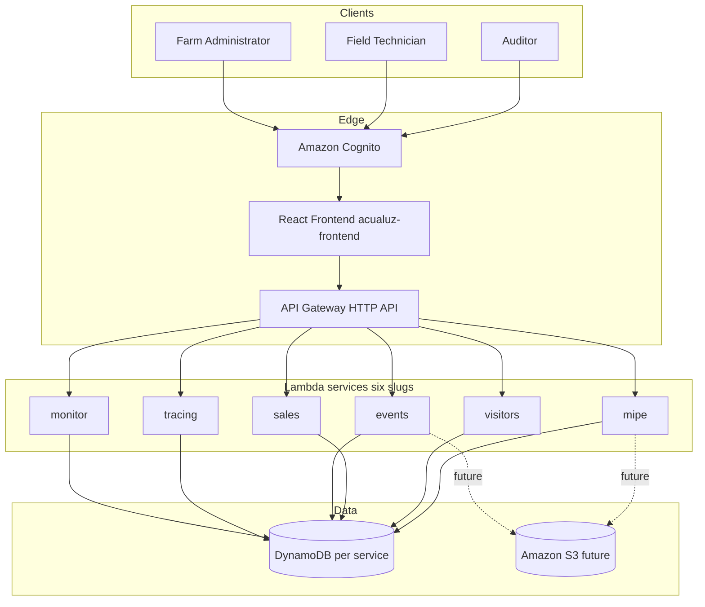
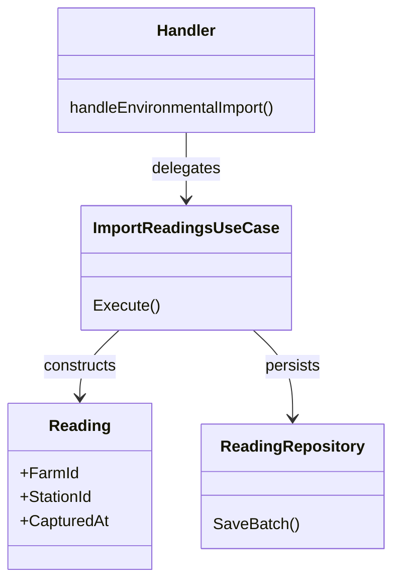
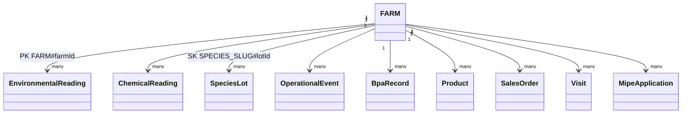

# Project Summary

Status: Approved  
Last updated: 2026-07-19  

## Summary

Consolidated project delivery summary derived from imported `docs/` artifacts, delivery summaries, service README files, JIRA, and merged pull requests across the Acualuz repositories.

> Source of truth: facts below are taken from imported `docs/` artifacts ([acualuz-c4](https://github.com/icsanabriar/acualuz-c4)), committed README files in each `acualuz-<slug>` repository (authoritative install workflow: [acualuz-monitor README](https://github.com/icsanabriar/acualuz-monitor/blob/main/README.md)), JIRA project **acualuz-tech** (`SCRUM`), and merged pull requests in the Acualuz GitHub organization. Sections without supporting information are marked **Not documented.**

## Index

| Section | Link |
|---|---|
| 0. Project Information | [0. Project Information](#0-project-information) |
| 0.1 Full Name | [0.1. Full Name](#01-full-name) |
| 0.2 Project Name | [0.2. Project Name](#02-project-name) |
| 0.3 Project Description | [0.3. Project Description](#03-project-description) |
| 0.4 Project URLs | [0.4. Project URLs](#04-project-urls) |
| 0.5 Tools Used | [0.5. Tools Used](#05-tools-used) |
| 1. Product Overview | [1. Product Overview](#1-product-overview) |
| 1.1 Objective | [1.1. Objective](#11-objective) |
| 1.2 Main Features | [1.2. Main Features and Functionalities](#12-main-features-and-functionalities) |
| 1.3 UX/UI | [1.3. User Experience Design](#13-user-experience-design) |
| 1.4 Installation | [1.4. Installation Instructions](#14-installation-instructions) |
| 2. System Architecture | [2. System Architecture](#2-system-architecture) |
| 2.1 Diagram | [2.1. Architecture Diagram](#21-architecture-diagram) |
| 2.2 Components | [2.2. Description of Main Components](#22-description-of-main-components) |
| 2.3 File Structure | [2.3. High-Level Project Description and File Structure](#23-high-level-project-description-and-file-structure) |
| 2.4 Infrastructure | [2.4. Infrastructure & Deployment](#24-infrastructure--deployment) |
| 2.5 Security | [2.5. Security](#25-security) |
| 2.6 Testing | [2.6. Testing](#26-testing) |
| 3. Data Model | [3. Data Model](#3-data-model) |
| 3.1 Diagram | [3.1. Data Model Diagram](#31-data-model-diagram) |
| 3.2 Entities | [3.2. Description of Main Entities](#32-description-of-main-entities) |
| 4. API Specification | [4. API Specification](#4-api-specification) |
| 5. User Stories | [5. User Stories](#5-user-stories) |
| 6. Work Tickets | [6. Work Tickets](#6-work-tickets) |
| 7. Pull Requests | [7. Pull Requests](#7-pull-requests) |

---

## 0. Project Information

### 0.1. Full Name

Iván Camilo Sanabria Rincón

### 0.2. Project Name

**Acualuz** — Online Aquaponic Farm Management Platform

Source: 
- [docs/product/prd.md](https://github.com/icsanabriar/acualuz-c4/blob/main/docs/product/prd.md)
- [docs/architecture/current-state.md](https://github.com/icsanabriar/acualuz-c4/blob/main/docs/architecture/current-state.md)

### 0.3. Project Description

Acualuz v1 is an online aquaponic farm management platform for Colombia that unifies monitoring, traceability, operational events, sales, visitors, and MIPE under Cognito-authenticated React experiences and a shared HTTP API Gateway. The MVP spans nine use cases (`UC-001`–`UC-009`) and sixteen backend tickets (`T-001`–`T-016`) across six Lambda-backed services plus one React frontend with 4 frontend tickets (`T-017`–`T-020`). Architecture contracts live in [acualuz-c4](https://github.com/icsanabriar/acualuz-c4); operator UI implementation lives in [acualuz-frontend](https://github.com/icsanabriar/acualuz-frontend).

Source: 
- [docs/product/prd.md](https://github.com/icsanabriar/acualuz-c4/blob/main/docs/product/prd.md)
- [docs/architecture/repo-boundaries.md](https://github.com/icsanabriar/acualuz-c4/blob/main/docs/architecture/repo-boundaries.md)

### 0.4. Project URLs

| Resource | URL | Progress |
|---|---|---|
| Architecture repository (`acualuz-c4`) | https://github.com/icsanabriar/acualuz-c4 | 100% |
| Frontend repository (`acualuz-frontend`) | https://github.com/icsanabriar/acualuz-frontend | 62.9% |
| Backend `monitor` | https://github.com/icsanabriar/acualuz-monitor | 100% |
| Backend `tracing` | https://github.com/icsanabriar/acualuz-tracing | 77% |
| Backend `events` | https://github.com/icsanabriar/acualuz-events | 100% |
| Backend `sales` | https://github.com/icsanabriar/acualuz-sales | 0% |
| Backend `visitors` | https://github.com/icsanabriar/acualuz-visitors | 100% |
| Backend `mipe` | Referenced by name in `@docs`; GitHub remote URL **Not documented.** | 0% |
| PRD | https://github.com/icsanabriar/acualuz-c4/blob/main/docs/product/prd.md | 100% |
| MVP use cases | https://github.com/icsanabriar/acualuz-c4/blob/main/docs/product/mvp-use-cases.md | 77% |
| MVP tickets | https://github.com/icsanabriar/acualuz-c4/blob/main/docs/product/mvp-tickets.md | 88% |
| Backend design | https://github.com/icsanabriar/acualuz-c4/blob/main/docs/architecture/backend-design.md | 77% |
| Frontend design | https://github.com/icsanabriar/acualuz-c4/blob/main/docs/architecture/frontend-design.md | 77% |
| Data model | https://github.com/icsanabriar/acualuz-c4/blob/main/docs/data/data-model.md | 100% |
| AWS cost estimate | https://github.com/icsanabriar/acualuz-c4/blob/main/docs/architecture/aws-cost.md | 100% |
| Repository boundaries | https://github.com/icsanabriar/acualuz-c4/blob/main/docs/architecture/repo-boundaries.md | 100% |
| C4 Structurizr DSL | https://github.com/icsanabriar/acualuz-c4/blob/main/docs/dsl/architecture.dsl | 100% |
| ADR registry | https://github.com/icsanabriar/acualuz-c4/blob/main/docs/adr/decisions.md | 100% |
| JIRA traceability | https://github.com/icsanabriar/acualuz-c4/blob/main/docs/product/jira-traceability.md | 100% |
| JIRA board | https://acualuz.atlassian.net/jira/software/projects/SCRUM/boards/1 | - |

Source: 
- [docs/architecture/repo-boundaries.md](https://github.com/icsanabriar/acualuz-c4/blob/main/docs/architecture/repo-boundaries.md)
- [docs/product/jira-traceability.md](https://github.com/icsanabriar/acualuz-c4/blob/main/docs/product/jira-traceability.md)

### 0.5. Tools Used

| Layer | Technology / Service | Source |
|---|---|---|
| Authentication | Amazon Cognito (User Pool, JWT per Lambda) | [target-architecture.md](https://github.com/icsanabriar/acualuz-c4/blob/main/docs/architecture/target-architecture.md), [backend-design.md](https://github.com/icsanabriar/acualuz-c4/blob/main/docs/architecture/backend-design.md) |
| API edge | Amazon API Gateway (HTTP API) | [target-architecture.md](https://github.com/icsanabriar/acualuz-c4/blob/main/docs/architecture/target-architecture.md) |
| Backend compute | AWS Lambda — 22 Go functions, 128 MB, 10 s timeout | [backend-design.md](https://github.com/icsanabriar/acualuz-c4/blob/main/docs/architecture/backend-design.md) |
| Database | Amazon DynamoDB (single-table per service, on-demand) | [data-model.md](https://github.com/icsanabriar/acualuz-c4/blob/main/docs/data/data-model.md) |
| Object storage | Amazon S3 (MVP placeholder for attachments / ICA exports) | [data-strategy.md](https://github.com/icsanabriar/acualuz-c4/blob/main/docs/data/data-strategy.md) |
| Observability | Amazon CloudWatch; Sentry (frontend, optional) | [aws-cost.md](https://github.com/icsanabriar/acualuz-c4/blob/main/docs/architecture/aws-cost.md), [frontend/.env.example](https://github.com/icsanabriar/acualuz-frontend/blob/main/frontend/.env.example) |
| Frontend runtime | React 19, TypeScript, Vite 8 | [frontend/package.json](https://github.com/icsanabriar/acualuz-frontend/blob/main/frontend/package.json) |
| Frontend server cache | TanStack React Query v5 | [frontend-design.md](https://github.com/icsanabriar/acualuz-c4/blob/main/docs/architecture/frontend-design.md), [frontend/package.json](https://github.com/icsanabriar/acualuz-frontend/blob/main/frontend/package.json) |
| Frontend UI state | Zustand | [frontend-design.md](https://github.com/icsanabriar/acualuz-c4/blob/main/docs/architecture/frontend-design.md) |
| Forms / validation | React Hook Form + Zod | [frontend/package.json](https://github.com/icsanabriar/acualuz-frontend/blob/main/frontend/package.json) |
| Auth SDK | AWS Amplify Auth | [frontend/package.json](https://github.com/icsanabriar/acualuz-frontend/blob/main/frontend/package.json) |
| i18n | i18next + react-i18next (`es-CO` operator copy) | [frontend-design.md](https://github.com/icsanabriar/acualuz-c4/blob/main/docs/architecture/frontend-design.md) |
| Unit / integration tests | Vitest, React Testing Library, MSW | [testing-strategy.md](https://github.com/icsanabriar/acualuz-c4/blob/main/docs/architecture/testing-strategy.md), [frontend/package.json](https://github.com/icsanabriar/acualuz-frontend/blob/main/frontend/package.json) |
| E2E tests | Playwright | [testing-strategy.md](https://github.com/icsanabriar/acualuz-c4/blob/main/docs/architecture/testing-strategy.md) |
| Architecture modeling | C4 / Structurizr DSL | [architecture.dsl](https://github.com/icsanabriar/acualuz-c4/blob/main/docs/dsl/architecture.dsl) |
| Project tracking | JIRA (`SCRUM` / acualuz-tech) | [jira-traceability.md](https://github.com/icsanabriar/acualuz-c4/blob/main/docs/product/jira-traceability.md) |
| CI/CD | GitHub Actions (`ci.yml`, `deploy.yml`) | [.github/workflows/ci.yml](https://github.com/icsanabriar/acualuz-frontend/blob/main/.github/workflows/ci.yml), [.github/workflows/deploy.yml](https://github.com/icsanabriar/acualuz-frontend/blob/main/.github/workflows/deploy.yml) |

---

## 1. Product Overview

### 1.1. Objective

Help Colombian aquaponic and fish farms digitize water-quality telemetry, multi-species lot traceability (fish, plant, and land-animal lots on a consolidated `SpeciesLot` entity), ICA-oriented operational evidence, visitor biosecurity, gate sales, and MIPE applications without bespoke infrastructure—under a single Cognito-authenticated React UI and one HTTP API Gateway, with AWS spend aligned to the approved low-cost stack (~USD 5.87/month pilot estimate).

Source: 
- [docs/product/prd.md](https://github.com/icsanabriar/acualuz-c4/blob/main/docs/product/prd.md)
- [docs/product/lean-canvas.md](https://github.com/icsanabriar/acualuz-c4/blob/main/docs/product/lean-canvas.md)

### 1.2. Main Features and Functionalities

| # | Function | Service domain | Use cases | Description |
|---|----------|----------------|-----------|-------------|
| 1 | Environmental + chemical ingestion | `monitor` | UC-001 | CSV/API environmental capture, manual KIT chemistry, integrity alerts |
| 2 | Multi-species lot lifecycle + KPIs | `tracing` | UC-002, UC-007–UC-009 | Fish/plant/animal lots on `SpeciesLot`; stage advances; cross-species KPI dashboard |
| 3 | Operational + BPA logging | `events` | UC-003 | Daily operational events with optional ICA BPA evidence rows |
| 4 | Catalog + orders | `sales` | UC-004 | Product catalog maintenance and on-farm order capture |
| 5 | Visitor registration + audit trail | `visitors` | UC-005 | Visitor identity/purpose capture and auditor history |
| 6 | MIPE applications + schedule | `mipe` | UC-006 | Biopreparat application logging and upcoming-task schedule |
| 7 | Shared authentication | Platform | All | Cognito JWT on every product route |
| 8 | API routing fabric | Platform | All | 22 documented MVP routes via HTTP API Gateway |

**Implementation coverage (JIRA stories marked *Finalizada* as of 2026-07-19):** backend routes for `monitor`, `tracing` (partial—animal lot stories still open), `events`, and `visitors` have merged PRs; frontend modules for `monitor`, `tracing`, `events`, and `visitors` are merged in `acualuz-frontend`; `sales` and `mipe` backend stories and frontend modules remain open in JIRA.

Source: 
- [docs/product/prd.md](https://github.com/icsanabriar/acualuz-c4/blob/main/docs/product/prd.md)
- [docs/product/mvp-use-cases.md](https://github.com/icsanabriar/acualuz-c4/blob/main/docs/product/mvp-use-cases.md)
- JIRA `SCRUM` project (queried 2026-07-19).

### 1.3. User Experience Design

Documented UX principles from [frontend-design.md](https://github.com/icsanabriar/acualuz-c4/blob/main/docs/architecture/frontend-design.md):

- **Language:** Spanish (`es-CO`) for operator-facing copy; English for structural code and engineering docs.
- **Form factor:** Mobile-first / small-screen-first (360×640 Android baseline).
- **Accessibility:** Visible labels on every form field; logical focus order; kiosk-friendly visitor registration.
- **Auth:** Cognito-hosted UI / Amplify SDK; access token in memory only; protected routes on all six modules.
- **State:** React Query for server cache; Zustand for cross-component filters (e.g., species + lifecycle stage on the tracing dashboard); optimistic updates only on plant/animal stage PATCH (rollback on HTTP 422).
- **Modules implemented in `acualuz-frontend`:** `monitor`, `tracing` (`fish/`, `plant/`, `animal/`, `kpi/`), `events`, `visitors`; placeholder shells exist for `sales` and `mipe`.
- **Sample Spanish screens:** "Importar lecturas ambientales", "Registrar química del agua", "Alertas de integridad", "Registrar evento operativo", "Evidencia BPA", "Registrar visita", "Historial de visitas", "Producción por especie".

Stitch design references for implemented modules: 
- Monitor ([SCRUM-35](https://acualuz.atlassian.net/browse/SCRUM-35))
- Tracing ([SCRUM-36](https://acualuz.atlassian.net/browse/SCRUM-36))
- Events ([SCRUM-37](https://acualuz.atlassian.net/browse/SCRUM-37))
- Visitors ([SCRUM-38](https://acualuz.atlassian.net/browse/SCRUM-38))

Source: 
- [docs/architecture/frontend-design.md](https://github.com/icsanabriar/acualuz-c4/blob/main/docs/architecture/frontend-design.md)
- [frontend/src/modules/](https://github.com/icsanabriar/acualuz-frontend/tree/main/frontend/src/modules)

### 1.4. Installation Instructions

#### Architecture documentation bootstrap (`acualuz-c4` / local `docs/`)

1. Clone [acualuz-c4](https://github.com/icsanabriar/acualuz-c4).
2. Copy the full `docs/` tree into the working repository so paths like `docs/architecture/frontend-design.md` resolve.
3. Do **not** commit or modify files under `docs/` in implementation repos (imported read-only).

Source: 
- [README.md](https://github.com/icsanabriar/acualuz-frontend/blob/main/README.md) § Imported documentation bootstrap

#### Frontend operator application (`acualuz-frontend`)

Documented prerequisites and commands:

| Step | Command / action | Notes |
|---|---|---|
| Prerequisites | Node.js ≥ 20 (LTS), npm | [frontend/package.json](https://github.com/icsanabriar/acualuz-frontend/blob/main/frontend/package.json) `engines` |
| Install dependencies | `cd frontend && npm ci` | Application root is `frontend/` |
| Configure environment | `cp .env.example .env.local` (from `frontend/` after install) | Fill public `VITE_*` identifiers only (Cognito, per-service API Gateway URLs) |
| Development server | `npm run dev` (from `frontend/`) | Optional LAN testing: `HOST=0.0.0.0 npm run dev` per workspace rules |
| Build | `npm run build` | Type-check + Vite production bundle |
| Tests | `npm run test:unit -- --coverage`, `npm run test:e2e`, `npm run lint`, `npm run typecheck` | Coverage target ≥ 95% per [testing-strategy.md](https://github.com/icsanabriar/acualuz-c4/blob/main/docs/architecture/testing-strategy.md) |

Source: 
- [README.md](https://github.com/icsanabriar/acualuz-frontend/blob/main/README.md)
- [frontend/package.json](https://github.com/icsanabriar/acualuz-frontend/blob/main/frontend/package.json)

#### Backend services (`acualuz-<slug>`)

Each implemented canonical backend repository (`acualuz-monitor`, `acualuz-tracing`, `acualuz-events`, `acualuz-visitors`) ships Go Lambdas behind API Gateway HTTP API using Serverless Framework v3, a root `Makefile`, and DynamoDB Local in Docker for integration tests. The steps below are documented for [acualuz-monitor](https://github.com/icsanabriar/acualuz-monitor); run the same targets from the root of the sibling service repo you are working on.

| Step | Command / action | Notes |
|---|---|---|
| Prerequisites | Go 1.26.4+; Node.js 20+; Docker; AWS deploy permissions (GitHub OIDC in CI, named profile locally) | Serverless CLI via `npm install` at repo root; optional `gitleaks`, `govulncheck`, `go-licenses`, `newman`, `openapi-to-postmanv2` |
| Bootstrapped `docs/` | Import full tree from [acualuz-c4](https://github.com/icsanabriar/acualuz-c4) | `rsync -a ../acualuz-c4/docs/ ./docs/` then `make docs-check` and `make install-hooks` |
| Install Node tooling | `npm install` | Installs `serverless@3.40.0` and plugins at service repo root |
| Go modules | `cd src && go mod tidy && cd ..` | Go module root is `src/` |
| Build | `make build` | Lambda binaries under `bin/` |
| Unit tests | `make unit-test` | ≥ 95% coverage floors per service Makefile |
| Integration tests | `docker run -d --rm -p 8000:8000 --name dynamodb-local amazon/dynamodb-local` then `DYNAMODB_ENDPOINT=http://localhost:8000 make integration-test` then `docker stop dynamodb-local` | DynamoDB Local |
| Security | `make security-scan` | Local pre-merge gates |
| License Check | `make license-check` | Local pre-merge gates |
| Deploy (local) | `make deploy STAGE=production` | Requires AWS credentials and Cognito env vars (`COGNITO_USER_POOL_ID`, `COGNITO_CLIENT_ID`; CI uses GitHub OIDC via `deploy.yml` |
| Environment file | Copy `.env.example` → `.env` | Schema only; see [backend-design.md § Environment variables](https://github.com/icsanabriar/acualuz-c4/blob/main/docs/architecture/backend-design.md) |

> Production CloudFront distribution URL and GitHub environment variable values for the frontend and backend: **Not documented.**

---

## 2. System Architecture

### 2.1. Architecture Diagram

High-level C4 container view (from PRD / target architecture):


```mermaid
flowchart TB
  subgraph Clients
    Admin[Farm Administrator]
    Tech[Field Technician]
    Auditor[Auditor]
  end
  subgraph Edge
    Cognito[Amazon Cognito]
    FE[React Frontend acualuz-frontend]
    APIGW[API Gateway HTTP API]
  end
  subgraph Services["Lambda services six slugs"]
    Monitor[monitor]
    Tracing[tracing]
    EventsSvc[events]
    Sales[sales]
    Visitors[visitors]
    Mipe[mipe]
  end
  subgraph Data
    DDB[(DynamoDB per service)]
    S3[(Amazon S3 future)]
  end
  Admin --> Cognito
  Tech --> Cognito
  Auditor --> Cognito
  Cognito --> FE
  FE --> APIGW
  APIGW --> Monitor
  APIGW --> Tracing
  APIGW --> EventsSvc
  APIGW --> Sales
  APIGW --> Visitors
  APIGW --> Mipe
  Monitor --> DDB
  Tracing --> DDB
  EventsSvc --> DDB
  Sales --> DDB
  Visitors --> DDB
  Mipe --> DDB
  EventsSvc -. future .-> S3
  Mipe -. future .-> S3
```

Clean-architecture layering example (`monitor-environmental-import`, UC-001):


```mermaid
classDiagram
  class Handler {
    handleEnvironmentalImport()
  }
  class ImportReadingsUseCase {
    Execute()
  }
  class Reading {
    +FarmId
    +StationId
    +CapturedAt
  }
  class ReadingRepository {
    SaveBatch()
  }
  Handler --> ImportReadingsUseCase : delegates
  ImportReadingsUseCase --> Reading : constructs
  ImportReadingsUseCase --> ReadingRepository : persists
```

Source: 
- [docs/product/prd.md](https://github.com/icsanabriar/acualuz-c4/blob/main/docs/product/prd.md)
- [docs/architecture/target-architecture.md](https://github.com/icsanabriar/acualuz-c4/blob/main/docs/architecture/target-architecture.md)
- [docs/dsl/architecture.dsl](https://github.com/icsanabriar/acualuz-c4/blob/main/docs/dsl/architecture.dsl)

### 2.2. Description of Main Components

| Container | Service slug | Technology | Documented status | Notes |
|-----------|-------------|------------|-------------------|-------|
| Authentication Service | — | Amazon Cognito | Planned in C4 docs | All product routes require JWT |
| Frontend Web/App | — | React (`acualuz-frontend`) | Implemented (partial modules) | Talks to Cognito + API Gateway only |
| API Gateway | — | HTTP API | Planned in C4 docs | Single ingress for farm traffic |
| Monitoring Functions | `monitor` | AWS Lambda (Go) | Backend + frontend merged | UC-001 |
| Traceability Functions | `tracing` | AWS Lambda (Go) | Backend partial + frontend merged | UC-002, UC-007–UC-009; `SpeciesLot` entity |
| Operational Events Functions | `events` | AWS Lambda (Go) | Backend + frontend merged | UC-003 |
| Sales Functions | `sales` | AWS Lambda (Go) | Not closed in JIRA | UC-004 |
| Visitor Management Functions | `visitors` | AWS Lambda (Go) | Backend + frontend merged | UC-005 |
| Integrated Pest Management Functions | `mipe` | AWS Lambda (Go) | Not closed in JIRA | UC-006 |
| Database | — | DynamoDB | Planned | One logical table per service |
| File Storage | — | Amazon S3 | Planned (no MVP buckets) | BPA/MIPE attachments deferred |

Key design decisions: single API Gateway ingress; multi-species tracing stays in one `acualuz-tracing` repo; three registration Lambdas plus one `performance` KPI Lambda after iteration-3 `SpeciesLot` consolidation ([ADR-007](https://github.com/icsanabriar/acualuz-c4/blob/main/docs/adr/007-species-lot-consolidation.md)).

Source: 
- [docs/architecture/current-state.md](https://github.com/icsanabriar/acualuz-c4/blob/main/docs/architecture/current-state.md)
- [docs/architecture/target-architecture.md](https://github.com/icsanabriar/acualuz-c4/blob/main/docs/architecture/target-architecture.md)

### 2.3. High-Level Project Description and File Structure

Eight-repository layout per [repo-boundaries.md](https://github.com/icsanabriar/acualuz-c4/blob/main/docs/architecture/repo-boundaries.md):

| Service slug | Repository | API prefix |
|---|---|---|
| `monitor` | [acualuz-monitor](https://github.com/icsanabriar/acualuz-monitor) | `/api/monitor/` |
| `tracing` | [acualuz-tracing](https://github.com/icsanabriar/acualuz-tracing) | `/api/tracing/` |
| `events` | [acualuz-events](https://github.com/icsanabriar/acualuz-events) | `/api/events/` |
| `sales` | [acualuz-sales](https://github.com/icsanabriar/acualuz-sales) | `/api/sales/` |
| `visitors` | [acualuz-visitors](https://github.com/icsanabriar/acualuz-visitors) | `/api/visitors/` |
| `mipe` | `acualuz-mipe` (name only in `@docs`) | `/api/mipe/` |
| Architecture | [acualuz-c4](https://github.com/icsanabriar/acualuz-c4) | — |
| Frontend | [acualuz-frontend](https://github.com/icsanabriar/acualuz-frontend) | — |

**Documented frontend layout** ([frontend-design.md](https://github.com/icsanabriar/acualuz-c4/blob/main/docs/architecture/frontend-design.md)):

```text
acualuz-frontend/frontend/
├── src/
│   ├── modules/          monitor, tracing/, events, sales, visitors, mipe
│   ├── api/              monitor.ts, tracing.ts, events.ts, sales.ts,
│   │                     visitors.ts, mipe.ts, httpClient.ts
│   ├── auth/
│   ├── components/
│   ├── router/
│   └── i18n/
├── public/
├── .env.example
└── package.json
```

**Documented backend Go layout** (one `cmd/<lambda>/` per route):

```text
acualuz-<service>/
├── cmd/<lambda-name>/
└── internal/{handler,usecase,domain,repository}
```

Source: 
- [docs/architecture/repo-boundaries.md](https://github.com/icsanabriar/acualuz-c4/blob/main/docs/architecture/repo-boundaries.md)
- [docs/architecture/backend-design.md](https://github.com/icsanabriar/acualuz-c4/blob/main/docs/architecture/backend-design.md)
- [docs/architecture/frontend-design.md](https://github.com/icsanabriar/acualuz-c4/blob/main/docs/architecture/frontend-design.md)

### 2.4. Infrastructure & Deployment

**Target platform (from `@docs`):**

- 22 Go Lambdas (128 MB, 10 s, ≤ 15 MB artifact) behind one HTTP API Gateway.
- DynamoDB on-demand, one table per service; `SpeciesLot` in `tracing` table.
- S3 reserved for future attachments; **no operational S3 buckets in MVP**.
- Estimated pilot cost ~**USD 5.87/month** ([aws-cost.md](https://github.com/icsanabriar/acualuz-c4/blob/main/docs/architecture/aws-cost.md)).

**Frontend deployment (implemented in `acualuz-frontend`):**

| Aspect | Documented / implemented detail | Source |
|---|---|---|
| Stage | `production` (single stage) | [.github/workflows/deploy.yml](https://github.com/icsanabriar/acualuz-frontend/blob/main/.github/workflows/deploy.yml) |
| Hosting | S3 static assets + CloudFront invalidation | [deploy.yml](https://github.com/icsanabriar/acualuz-frontend/blob/main/.github/workflows/deploy.yml), [80-ci-cd.mdc](https://github.com/icsanabriar/acualuz-frontend/blob/main/.cursor/rules/80-ci-cd.mdc) |
| Trigger | Push to `main` (path-gated) or `workflow_dispatch` | [deploy.yml](https://github.com/icsanabriar/acualuz-frontend/blob/main/.github/workflows/deploy.yml) |
| AWS auth | GitHub OIDC (no long-lived keys) | [80-ci-cd.mdc](https://github.com/icsanabriar/acualuz-frontend/blob/main/.cursor/rules/80-ci-cd.mdc) |
| Build env | Per-service `VITE_API_BASE_URL_*` injected at build | [PR #14](https://github.com/icsanabriar/acualuz-frontend/pull/14), [frontend/.env.example](https://github.com/icsanabriar/acualuz-frontend/blob/main/frontend/.env.example) |
| Post-deploy smoke | Fetch deployed `index.html`; assert HTTP 200 + `app-version` marker | [80-ci-cd.mdc](https://github.com/icsanabriar/acualuz-frontend/blob/main/.cursor/rules/80-ci-cd.mdc) |

### 2.5. Security

| Control | Detail | Source |
|---|---|---|
| Authentication | Cognito JWT on every product route (`Auth = Yes` for all 22 MVP routes) | [backend-design.md](https://github.com/icsanabriar/acualuz-c4/blob/main/docs/architecture/backend-design.md) |
| Public farm-data routes | None in MVP | [frontend-design.md](https://github.com/icsanabriar/acualuz-c4/blob/main/docs/architecture/frontend-design.md) |
| Frontend token storage | Access token in memory; refresh via httpOnly Secure SameSite cookie preferred | [frontend-design.md](https://github.com/icsanabriar/acualuz-c4/blob/main/docs/architecture/frontend-design.md) |
| Route guards | All module routes wrapped; redirect to Cognito on missing/expired token | [frontend-design.md](https://github.com/icsanabriar/acualuz-c4/blob/main/docs/architecture/frontend-design.md) |
| Cross-service isolation | No direct Lambda-to-Lambda or cross-table reads | [repo-boundaries.md](https://github.com/icsanabriar/acualuz-c4/blob/main/docs/architecture/repo-boundaries.md) |
| PII fields | `visitorName`, `visitorDocHash`, `customerId`, `createdBy`, `hostUserId`, `stageHistoryJson.actorId` — privacy rules in data strategy | [data-strategy.md](https://github.com/icsanabriar/acualuz-c4/blob/main/docs/data/data-strategy.md) |
| Transport | HTTPS-only for production API and CloudFront | [30-security.mdc](https://github.com/icsanabriar/acualuz-frontend/blob/main/.cursor/rules/30-security.mdc) |
| CSP / HSTS | CloudFront response-headers policy (infra-owned) | [30-security.mdc](https://github.com/icsanabriar/acualuz-frontend/blob/main/.cursor/rules/30-security.mdc) |

### 2.6. Testing

Supplementary strategy: [testing-strategy.md](https://github.com/icsanabriar/acualuz-c4/blob/main/docs/architecture/testing-strategy.md) (Approved).

| Layer | Tools / approach | Target |
|---|---|---|
| Frontend unit / integration | Vitest, React Testing Library, MSW | ≥ 95% coverage on touched paths |
| Frontend E2E | Playwright (UC-001–UC-003 happy paths + auth guard) | [testing-strategy.md](https://github.com/icsanabriar/acualuz-c4/blob/main/docs/architecture/testing-strategy.md) |
| Accessibility | vitest-axe / jsx-a11y | Zero violations on rendered routes |
| Backend | Go unit tests per Lambda (recommended) | ≥ 95% aspirational |
| Contract | JSON Schema identifiers from backend-design | MSW fixtures mirror DTO names |
| CI gates (frontend) | lint, typecheck, unit+coverage, e2e (path-gated), bundle size, security audit, license check | [.github/workflows/ci.yml](https://github.com/icsanabriar/acualuz-frontend/blob/main/.github/workflows/ci.yml) |

BDD/Gherkin scenarios for all 18 MVP tickets are enumerated in [testing-strategy.md](https://github.com/icsanabriar/acualuz-c4/blob/main/docs/architecture/testing-strategy.md). Twenty-one documented testing gaps (IaC templates, Cognito clock-skew, idempotency contracts, etc.) remain open per that document.

---

## 3. Data Model

### 3.1. Data Model Diagram

Farm-partitioned entities ([data-model.md](https://github.com/icsanabriar/acualuz-c4/blob/main/docs/data/data-model.md)):


```mermaid
classDiagram
  FARM "1" --> "many" EnvironmentalReading : PK FARM#farmId
  FARM "1" --> "many" ChemicalReading
  FARM "1" --> "many" SpeciesLot : SK SPECIES_SLUG#lotId
  FARM "1" --> "many" OperationalEvent
  FARM "1" --> "many" BpaRecord
  FARM "1" --> "many" Product
  FARM "1" --> "many" SalesOrder
  FARM "1" --> "many" Visit
  FARM "1" --> "many" MipeApplication
```

### 3.2. Description of Main Entities

Nine DynamoDB entities across six service tables; iteration 3 consolidates fish/plant/animal lots into **`SpeciesLot`** (`SK = <SPECIES_SLUG>#<lotId>`, slug ∈ `{FISH, PLANT, ANIMAL}`).

| Entity | Service | PK | SK (pattern) | Primary use cases |
|---|---|---|---|---|
| `EnvironmentalReading` | `monitor` | `FARM#<farmId>` | `ENV#<readingId>` | UC-001 |
| `ChemicalReading` | `monitor` | `FARM#<farmId>` | `CHEM#<readingId>` | UC-001 |
| `SpeciesLot` | `tracing` | `FARM#<farmId>` | `<SPECIES_SLUG>#<lotId>` | UC-002, UC-007–UC-009 |
| `OperationalEvent` | `events` | `FARM#<farmId>` | `EVENT#<eventId>` | UC-003 |
| `BpaRecord` | `events` | `FARM#<farmId>` | `BPA#<recordId>` | UC-003 |
| `Visit` | `visitors` | `FARM#<farmId>` | `VISIT#<visitId>` | UC-005 |
| `Product` | `sales` | `FARM#<farmId>` | `PRODUCT#<productId>` | UC-004 |
| `SalesOrder` | `sales` | `FARM#<farmId>` | `ORDER#<orderId>` | UC-004 |
| `MipeApplication` | `mipe` | `FARM#<farmId>` | `MIPE#<applicationId>` | UC-006 |

**Lifecycle vocabulary (English codes persisted; Spanish labels UI-only):**

| `speciesType` | Stage 1 | Stage 2 | Stage 3 |
|---|---|---|---|
| `FISH` | `stocking` | `grow-out` | `harvest` |
| `PLANT` | `sowing` | `growth` | `harvest` |
| `ANIMAL` | `breeding` | `fattening` | `slaughter` |

**Constraints documented:** tenant isolation via `FARM#<farmId>`; closed `<SPECIES_SLUG>` set (ADR required to extend); `speciesType` must match SK prefix; invalid stage transitions return HTTP 422; plant rows reject top-level `mortalityCount` / `feedKg` writes.

Source: 
- [docs/data/data-model.md](https://github.com/icsanabriar/acualuz-c4/blob/main/docs/data/data-model.md)
- [docs/data/data-strategy.md](https://github.com/icsanabriar/acualuz-c4/blob/main/docs/data/data-strategy.md)
- [docs/data/events.md](https://github.com/icsanabriar/acualuz-c4/blob/main/docs/data/events.md)

---

## 4. API Specification

Twenty-two Cognito-protected routes ([backend-design.md](https://github.com/icsanabriar/acualuz-c4/blob/main/docs/architecture/backend-design.md) `## API routes`). Paths omit trailing slashes.

| Method | Endpoint | Description | Request | Response | Auth | Source |
|---|---|---|---|---|---|---|
| POST | `/api/monitor/readings/environmental` | Ingest environmental sensor batch | `EnvironmentalIngestRequest` | `EnvironmentalIngestResponse` | Yes | [backend-design.md](https://github.com/icsanabriar/acualuz-c4/blob/main/docs/architecture/backend-design.md) |
| POST | `/api/monitor/readings/chemical` | Persist manual chemistry reading | `ChemicalReadingRequest` | `ChemicalReadingResponse` | Yes | [backend-design.md](https://github.com/icsanabriar/acualuz-c4/blob/main/docs/architecture/backend-design.md) |
| GET | `/api/monitor/alerts` | List integrity alerts | `EmptyBody` | `MonitorAlertListResponse` | Yes | [backend-design.md](https://github.com/icsanabriar/acualuz-c4/blob/main/docs/architecture/backend-design.md) |
| POST | `/api/tracing/fish-lots` | Register fish lot (`SpeciesLot`, SK `FISH#`) | `CreateFishLotRequest` | `FishLotResponse` | Yes | [backend-design.md](https://github.com/icsanabriar/acualuz-c4/blob/main/docs/architecture/backend-design.md) |
| GET | `/api/tracing/kpis` | Aggregate fish-lot KPIs | `EmptyBody` | `TracingKpiResponse` | Yes | [backend-design.md](https://github.com/icsanabriar/acualuz-c4/blob/main/docs/architecture/backend-design.md) |
| POST | `/api/tracing/plant-lots` | Register plant lot (`PLANT#`) | `CreatePlantLotRequest` | `PlantLotResponse` | Yes | [backend-design.md](https://github.com/icsanabriar/acualuz-c4/blob/main/docs/architecture/backend-design.md) |
| PATCH | `/api/tracing/plant-lots/{lotId}/stage` | Advance plant lifecycle | `AdvancePlantLotStageRequest` | `PlantLotResponse` | Yes | [backend-design.md](https://github.com/icsanabriar/acualuz-c4/blob/main/docs/architecture/backend-design.md) |
| GET | `/api/tracing/plant-lots/{lotId}/kpis` | Plant lot KPI read | `EmptyBody` | `PlantLotKpiResponse` | Yes | [backend-design.md](https://github.com/icsanabriar/acualuz-c4/blob/main/docs/architecture/backend-design.md) |
| POST | `/api/tracing/animal-lots` | Register animal lot (`ANIMAL#`) | `CreateAnimalLotRequest` | `AnimalLotResponse` | Yes | [backend-design.md](https://github.com/icsanabriar/acualuz-c4/blob/main/docs/architecture/backend-design.md) |
| PATCH | `/api/tracing/animal-lots/{lotId}/stage` | Advance animal lifecycle | `AdvanceAnimalLotStageRequest` | `AnimalLotResponse` | Yes | [backend-design.md](https://github.com/icsanabriar/acualuz-c4/blob/main/docs/architecture/backend-design.md) |
| GET | `/api/tracing/animal-lots/{lotId}/kpis` | Animal lot KPI read | `EmptyBody` | `AnimalLotKpiResponse` | Yes | [backend-design.md](https://github.com/icsanabriar/acualuz-c4/blob/main/docs/architecture/backend-design.md) |
| GET | `/api/tracing/kpis/production` | Cross-species KPI aggregator | `EmptyBody` | `ProductionKpiResponse` | Yes | [backend-design.md](https://github.com/icsanabriar/acualuz-c4/blob/main/docs/architecture/backend-design.md) |
| GET | `/api/tracing/lots` | Paginated lot list with filters | `EmptyBody` | `LotListResponse` | Yes | [backend-design.md](https://github.com/icsanabriar/acualuz-c4/blob/main/docs/architecture/backend-design.md) |
| POST | `/api/events/operational` | Record operational event | `OperationalEventRequest` | `OperationalEventResponse` | Yes | [backend-design.md](https://github.com/icsanabriar/acualuz-c4/blob/main/docs/architecture/backend-design.md) |
| POST | `/api/events/bpa` | Store BPA evidence row | `BpaRecordRequest` | `BpaRecordResponse` | Yes | [backend-design.md](https://github.com/icsanabriar/acualuz-c4/blob/main/docs/architecture/backend-design.md) |
| GET | `/api/sales/products` | Paginated catalog | `EmptyBody` | `ProductListResponse` | Yes | [backend-design.md](https://github.com/icsanabriar/acualuz-c4/blob/main/docs/architecture/backend-design.md) |
| POST | `/api/sales/products` | Upsert catalog item | `UpsertProductRequest` | `ProductResponse` | Yes | [backend-design.md](https://github.com/icsanabriar/acualuz-c4/blob/main/docs/architecture/backend-design.md) |
| POST | `/api/sales/orders` | Capture customer order | `CreateOrderRequest` | `OrderResponse` | Yes | [backend-design.md](https://github.com/icsanabriar/acualuz-c4/blob/main/docs/architecture/backend-design.md) |
| POST | `/api/visitors/visits` | Register visitor entry | `RegisterVisitRequest` | `VisitResponse` | Yes | [backend-design.md](https://github.com/icsanabriar/acualuz-c4/blob/main/docs/architecture/backend-design.md) |
| GET | `/api/visitors/visits` | Audit visit history | `EmptyBody` | `VisitListResponse` | Yes | [backend-design.md](https://github.com/icsanabriar/acualuz-c4/blob/main/docs/architecture/backend-design.md) |
| POST | `/api/mipe/applications` | Log MIPE application | `MipeApplicationRequest` | `MipeApplicationResponse` | Yes | [backend-design.md](https://github.com/icsanabriar/acualuz-c4/blob/main/docs/architecture/backend-design.md) |
| GET | `/api/mipe/schedule` | Upcoming MIPE schedule | `EmptyBody` | `MipeScheduleResponse` | Yes | [backend-design.md](https://github.com/icsanabriar/acualuz-c4/blob/main/docs/architecture/backend-design.md) |

---

## 5. User Stories

Nine MVP use cases from [mvp-use-cases.md](https://github.com/icsanabriar/acualuz-c4/blob/main/docs/product/mvp-use-cases.md). Acceptance criteria at ticket granularity in [mvp-tickets.md](https://github.com/icsanabriar/acualuz-c4/blob/main/docs/product/mvp-tickets.md) and frontend JIRA stories [SCRUM-35](https://acualuz.atlassian.net/browse/SCRUM-35)–[SCRUM-38](https://acualuz.atlassian.net/browse/SCRUM-38).

| ID | User Story | Acceptance Criteria | Priority | Source |
|---|---|---|---|---|
| UC-001 | As a **Field Technician** (`monitor`), I want to import environmental sensor batches and manual KIT chemistry readings so administrators can detect water-quality anomalies quickly. | CSV/API batch upload + manual ammonia/nitrite/nitrate form; administrator reviews integrity alerts. Ticket AC: T-001, T-002. Frontend AC: [SCRUM-35](https://acualuz.atlassian.net/browse/SCRUM-35). | Impact H × Effort M | [mvp-use-cases.md](https://github.com/icsanabriar/acualuz-c4/blob/main/docs/product/mvp-use-cases.md) |
| UC-002 | As a **Farm Administrator** (`tracing`), I want to register fish lots and review FCR, mortality, and biomass KPIs for regulatory-ready records. | Stocking/mortality/feeding stored; KPI dashboard with multi-lot filter. Ticket AC: T-003, T-004. | Impact H × Effort M | [mvp-use-cases.md](https://github.com/icsanabriar/acualuz-c4/blob/main/docs/product/mvp-use-cases.md) |
| UC-003 | As a **Field Technician** (`events`), I want to log operational work and ICA BPA evidence in one place for audit preparation. | Operational event + optional BPA row; auditor queries by zone. Ticket AC: T-005, T-006. Frontend AC: [SCRUM-37](https://acualuz.atlassian.net/browse/SCRUM-37). | Impact H × Effort M | [mvp-use-cases.md](https://github.com/icsanabriar/acualuz-c4/blob/main/docs/product/mvp-use-cases.md) |
| UC-004 | As a **Farm Administrator** (`sales`), I want to publish a catalog and capture customer orders at the farm gate. | Catalog SKUs; order with line items and payment method; order status history. Ticket AC: T-007, T-008. | Impact H × Effort M | [mvp-use-cases.md](https://github.com/icsanabriar/acualuz-c4/blob/main/docs/product/mvp-use-cases.md) |
| UC-005 | As a **Visitor** (front-desk flow owned by Farm Administrator) (`visitors`), I want to register at the kiosk for biosecurity compliance. | Document + purpose captured; timestamp and host user stored; auditor cross-checks with events. Ticket AC: T-009, T-010. Frontend AC: [SCRUM-38](https://acualuz.atlassian.net/browse/SCRUM-38). | Impact M × Effort S | [mvp-use-cases.md](https://github.com/icsanabriar/acualuz-c4/blob/main/docs/product/mvp-use-cases.md) |
| UC-006 | As a **Field Technician** (`mipe`), I want to log biopreparat applications with dose, operator, and target zone for integrated pest management. | Application recorded with dose/product/component; administrator exports ICA report when requested. Ticket AC: T-011, T-012. | Impact M × Effort M | [mvp-use-cases.md](https://github.com/icsanabriar/acualuz-c4/blob/main/docs/product/mvp-use-cases.md) |
| UC-007 | As a **Farm Administrator** (`tracing`), I want to register plant lots and advance lifecycle (`sowing` → `growth` → `harvest`) to review yield performance. | Plant lot creation; stage advances; per-lot yield KPIs. Ticket AC: T-013, T-014. | Impact H × Effort M | [mvp-use-cases.md](https://github.com/icsanabriar/acualuz-c4/blob/main/docs/product/mvp-use-cases.md) |
| UC-008 | As a **Farm Administrator** (`tracing`), I want to register land-animal lots and track feed-conversion, mortality, and weight-gain KPIs. | Animal lot creation; stage advances; per-lot KPI dashboard. Ticket AC: T-015, T-016. | Impact M × Effort M | [mvp-use-cases.md](https://github.com/icsanabriar/acualuz-c4/blob/main/docs/product/mvp-use-cases.md) |
| UC-009 | As a **Farm Administrator** (`tracing`), I want a unified cross-species production dashboard with species and lifecycle filters. | Filters by species/stage; uniform KPI cards; drill-down to lot detail. Ticket AC: T-017, T-018. Frontend AC: [SCRUM-36](https://acualuz.atlassian.net/browse/SCRUM-36). | Impact H × Effort M | [mvp-use-cases.md](https://github.com/icsanabriar/acualuz-c4/blob/main/docs/product/mvp-use-cases.md) |

---

## 6. Work Tickets

### MVP backend tickets (`T-001`–`T-018`)

JIRA status from project **SCRUM** queried 2026-07-19. Related implementation files are in service repositories (not in `@docs`).

| Ticket | Title | Description (summary) | JIRA status | Related files (architecture) | Source |
|---|---|---|---|---|---|
| T-001 | Environmental batch ingestion API | `POST /api/monitor/readings/environmental`; partial success envelope | **Finalizada** ([SCRUM-6](https://acualuz.atlassian.net/browse/SCRUM-6)) | [backend-design.md](https://github.com/icsanabriar/acualuz-c4/blob/main/docs/architecture/backend-design.md), [data-model.md](https://github.com/icsanabriar/acualuz-c4/blob/main/docs/data/data-model.md) | [mvp-tickets.md](https://github.com/icsanabriar/acualuz-c4/blob/main/docs/product/mvp-tickets.md) |
| T-002 | Chemical reading + alerts | `POST .../chemical`, `GET .../alerts` | **Finalizada** ([SCRUM-12](https://acualuz.atlassian.net/browse/SCRUM-12)) | [backend-design.md](https://github.com/icsanabriar/acualuz-c4/blob/main/docs/architecture/backend-design.md) | [mvp-tickets.md](https://github.com/icsanabriar/acualuz-c4/blob/main/docs/product/mvp-tickets.md) |
| T-003 | Fish lot registration | `POST /api/tracing/fish-lots` | **Finalizada** ([SCRUM-13](https://acualuz.atlassian.net/browse/SCRUM-13)) | [data-model.md](https://github.com/icsanabriar/acualuz-c4/blob/main/docs/data/data-model.md) § `SpeciesLot` | [mvp-tickets.md](https://github.com/icsanabriar/acualuz-c4/blob/main/docs/product/mvp-tickets.md) |
| T-004 | Fish KPI aggregation | `GET /api/tracing/kpis` | **Finalizada** ([SCRUM-14](https://acualuz.atlassian.net/browse/SCRUM-14)) | [backend-design.md](https://github.com/icsanabriar/acualuz-c4/blob/main/docs/architecture/backend-design.md) | [mvp-tickets.md](https://github.com/icsanabriar/acualuz-c4/blob/main/docs/product/mvp-tickets.md) |
| T-005 | Operational event registration | `POST /api/events/operational` | **Finalizada** ([SCRUM-15](https://acualuz.atlassian.net/browse/SCRUM-15)) | [data-model.md](https://github.com/icsanabriar/acualuz-c4/blob/main/docs/data/data-model.md) | [mvp-tickets.md](https://github.com/icsanabriar/acualuz-c4/blob/main/docs/product/mvp-tickets.md) |
| T-006 | BPA evidence API | `POST /api/events/bpa` | **Finalizada** ([SCRUM-16](https://acualuz.atlassian.net/browse/SCRUM-16)) | [data-strategy.md](https://github.com/icsanabriar/acualuz-c4/blob/main/docs/data/data-strategy.md) | [mvp-tickets.md](https://github.com/icsanabriar/acualuz-c4/blob/main/docs/product/mvp-tickets.md) |
| T-007 | Product catalog endpoints | `GET/POST /api/sales/products` | **En curso** ([SCRUM-17](https://acualuz.atlassian.net/browse/SCRUM-17)) | [backend-design.md](https://github.com/icsanabriar/acualuz-c4/blob/main/docs/architecture/backend-design.md) | [mvp-tickets.md](https://github.com/icsanabriar/acualuz-c4/blob/main/docs/product/mvp-tickets.md) |
| T-008 | Order capture | `POST /api/sales/orders` | **En curso** ([SCRUM-18](https://acualuz.atlassian.net/browse/SCRUM-18)) | [backend-design.md](https://github.com/icsanabriar/acualuz-c4/blob/main/docs/architecture/backend-design.md) | [mvp-tickets.md](https://github.com/icsanabriar/acualuz-c4/blob/main/docs/product/mvp-tickets.md) |
| T-009 | Visitor registration backend | `POST /api/visitors/visits` | **Finalizada** ([SCRUM-19](https://acualuz.atlassian.net/browse/SCRUM-19)) | [data-strategy.md](https://github.com/icsanabriar/acualuz-c4/blob/main/docs/data/data-strategy.md) | [mvp-tickets.md](https://github.com/icsanabriar/acualuz-c4/blob/main/docs/product/mvp-tickets.md) |
| T-010 | Visit history query | `GET /api/visitors/visits` | **Finalizada** ([SCRUM-21](https://acualuz.atlassian.net/browse/SCRUM-21)) | [backend-design.md](https://github.com/icsanabriar/acualuz-c4/blob/main/docs/architecture/backend-design.md) | [mvp-tickets.md](https://github.com/icsanabriar/acualuz-c4/blob/main/docs/product/mvp-tickets.md) |
| T-011 | MIPE application logging | `POST /api/mipe/applications` | **En curso** ([SCRUM-20](https://acualuz.atlassian.net/browse/SCRUM-20)) | [backend-design.md](https://github.com/icsanabriar/acualuz-c4/blob/main/docs/architecture/backend-design.md) | [mvp-tickets.md](https://github.com/icsanabriar/acualuz-c4/blob/main/docs/product/mvp-tickets.md) |
| T-012 | MIPE schedule read | `GET /api/mipe/schedule` | **En curso** ([SCRUM-22](https://acualuz.atlassian.net/browse/SCRUM-22)) | [backend-design.md](https://github.com/icsanabriar/acualuz-c4/blob/main/docs/architecture/backend-design.md) | [mvp-tickets.md](https://github.com/icsanabriar/acualuz-c4/blob/main/docs/product/mvp-tickets.md) |
| T-013 | Plant lot registration | `POST /api/tracing/plant-lots` | **Finalizada** ([SCRUM-23](https://acualuz.atlassian.net/browse/SCRUM-23)) | [data-model.md](https://github.com/icsanabriar/acualuz-c4/blob/main/docs/data/data-model.md) | [mvp-tickets.md](https://github.com/icsanabriar/acualuz-c4/blob/main/docs/product/mvp-tickets.md) |
| T-014 | Plant lot stage + KPIs | `PATCH/GET .../plant-lots/...` | **Finalizada** ([SCRUM-24](https://acualuz.atlassian.net/browse/SCRUM-24)) | [backend-design.md](https://github.com/icsanabriar/acualuz-c4/blob/main/docs/architecture/backend-design.md) | [mvp-tickets.md](https://github.com/icsanabriar/acualuz-c4/blob/main/docs/product/mvp-tickets.md) |
| T-015 | Animal lot registration | `POST /api/tracing/animal-lots` | **En curso** ([SCRUM-27](https://acualuz.atlassian.net/browse/SCRUM-27)) | [data-model.md](https://github.com/icsanabriar/acualuz-c4/blob/main/docs/data/data-model.md) | [mvp-tickets.md](https://github.com/icsanabriar/acualuz-c4/blob/main/docs/product/mvp-tickets.md) |
| T-016 | Animal lot stage + KPIs | `PATCH/GET .../animal-lots/...` | **En curso** ([SCRUM-28](https://acualuz.atlassian.net/browse/SCRUM-28)) | [backend-design.md](https://github.com/icsanabriar/acualuz-c4/blob/main/docs/architecture/backend-design.md) | [mvp-tickets.md](https://github.com/icsanabriar/acualuz-c4/blob/main/docs/product/mvp-tickets.md) |
| T-017 | Cross-species KPI aggregator | `GET /api/tracing/kpis/production` | **Finalizada** ([SCRUM-25](https://acualuz.atlassian.net/browse/SCRUM-25)) | [backend-design.md](https://github.com/icsanabriar/acualuz-c4/blob/main/docs/architecture/backend-design.md) | [mvp-tickets.md](https://github.com/icsanabriar/acualuz-c4/blob/main/docs/product/mvp-tickets.md) |
| T-018 | Cross-species lot list | `GET /api/tracing/lots` | **Finalizada** ([SCRUM-26](https://acualuz.atlassian.net/browse/SCRUM-26)) | [backend-design.md](https://github.com/icsanabriar/acualuz-c4/blob/main/docs/architecture/backend-design.md) | [mvp-tickets.md](https://github.com/icsanabriar/acualuz-c4/blob/main/docs/product/mvp-tickets.md) |

### Frontend implementation stories (JIRA; not numbered in `mvp-tickets.md`)

| Ticket | Title | JIRA status | Module | Source |
|---|---|---|---|---|
| SCRUM-35 | Implement frontend for monitor use cases (UC-001) | **Finalizada** | `monitor` | [SCRUM-35](https://acualuz.atlassian.net/browse/SCRUM-35) |
| SCRUM-36 | Implement frontend for tracing use cases (UC-002, UC-007–UC-009) | **Finalizada** | `tracing` | [SCRUM-36](https://acualuz.atlassian.net/browse/SCRUM-36) |
| SCRUM-37 | Implement frontend for events use cases (UC-003) | **Finalizada** | `events` | [SCRUM-37](https://acualuz.atlassian.net/browse/SCRUM-37) |
| SCRUM-38 | Implement frontend for visitors use cases (UC-005) | **Finalizada** | `visitors` | [SCRUM-38](https://acualuz.atlassian.net/browse/SCRUM-38) |

Epic grouping: [jira-traceability.md](https://github.com/icsanabriar/acualuz-c4/blob/main/docs/product/jira-traceability.md) (SCRUM-5 monitor, SCRUM-7 tracing, SCRUM-8 events, SCRUM-9 sales, SCRUM-10 visitors, SCRUM-11 mipe).

---

## 7. Pull Requests

Merged pull requests extracted from GitHub history (2026-07-19). Feature and delivery PRs listed; Dependabot-only bumps omitted for brevity.

### `acualuz-frontend`

| PR | Title | Description | Status | Related work | Source |
|---|---|---|---|---|---|
| [#14](https://github.com/icsanabriar/acualuz-frontend/pull/14) | ci(deploy): Inject per-service API base URL vars at build | Injects `VITE_API_BASE_URL_*` GitHub vars into production Vite build | Merged | Platform deploy fix | https://github.com/icsanabriar/acualuz-frontend/pull/14 |
| [#13](https://github.com/icsanabriar/acualuz-frontend/pull/13) | feat(visitors): Implement UC-005 visitors module UI | Visitors dashboard, register visit, history, PII-safe hooks | Merged | UC-005, SCRUM-38 | https://github.com/icsanabriar/acualuz-frontend/pull/13 |
| [#12](https://github.com/icsanabriar/acualuz-frontend/pull/12) | feat(events): Implement UC-003 events module UI | Operational + BPA forms, Stitch-aligned shell | Merged | UC-003, SCRUM-37 | https://github.com/icsanabriar/acualuz-frontend/pull/12 |
| [#11](https://github.com/icsanabriar/acualuz-frontend/pull/11) | feat(tracing): Implement SCRUM-36 tracing module UI | Fish/plant/animal/kpi sub-modules | Merged | UC-002, UC-007–UC-009, SCRUM-36 | https://github.com/icsanabriar/acualuz-frontend/pull/11 |
| [#10](https://github.com/icsanabriar/acualuz-frontend/pull/10) | fix(auth): Restore Cognito login for farm-scoped groups | OAuth / farm selection fix | Merged | Auth platform | https://github.com/icsanabriar/acualuz-frontend/pull/10 |
| [#9](https://github.com/icsanabriar/acualuz-frontend/pull/9) | feat(monitor): Align monitor UI with Stitch and wire Cognito OAuth | Monitor module UC-001 screens | Merged | UC-001, SCRUM-35 | https://github.com/icsanabriar/acualuz-frontend/pull/9 |
| [#5](https://github.com/icsanabriar/acualuz-frontend/pull/5) | feat(monitor): Add UC-001 monitor module under frontend | Initial monitor module scaffolding | Merged | UC-001 | https://github.com/icsanabriar/acualuz-frontend/pull/5 |
| [#2](https://github.com/icsanabriar/acualuz-frontend/pull/2) | chore(governance): Implement audit upgrade and CI scaffolding | CI/CD + governance bootstrap | Merged | Platform | https://github.com/icsanabriar/acualuz-frontend/pull/2 |

### `acualuz-monitor`

| PR | Title | Status | Related work | Source |
|---|---|---|---|---|
| [#5](https://github.com/icsanabriar/acualuz-monitor/pull/5) | feat(SCRUM-6): Environmental batch import handler | Merged | T-001, UC-001 | https://github.com/icsanabriar/acualuz-monitor/pull/5 |
| [#6](https://github.com/icsanabriar/acualuz-monitor/pull/6) | feat(SCRUM-12): Chemical import and alerts handlers | Merged | T-002, UC-001 | https://github.com/icsanabriar/acualuz-monitor/pull/6 |

### `acualuz-tracing`

| PR | Title | Status | Related work | Source |
|---|---|---|---|---|
| [#6](https://github.com/icsanabriar/acualuz-tracing/pull/6) | feat(tracing): Add fish lot registration API | Merged | T-003, UC-002 | https://github.com/icsanabriar/acualuz-tracing/pull/6 |
| [#7](https://github.com/icsanabriar/acualuz-tracing/pull/7) | feat(tracing): Add fish KPI aggregation API (SCRUM-14) | Merged | T-004, UC-002 | https://github.com/icsanabriar/acualuz-tracing/pull/7 |
| [#13](https://github.com/icsanabriar/acualuz-tracing/pull/13) | feat(tracing): Implement POST /api/tracing/plant-lots for UC-007 | Merged | T-013, UC-007 | https://github.com/icsanabriar/acualuz-tracing/pull/13 |
| [#14](https://github.com/icsanabriar/acualuz-tracing/pull/14) | feat(tracing): Plant lot stage advance and KPI routes (SCRUM-24) | Merged | T-014, UC-007 | https://github.com/icsanabriar/acualuz-tracing/pull/14 |
| [#15](https://github.com/icsanabriar/acualuz-tracing/pull/15) | feat(tracing): Cross-species production KPI endpoint (SCRUM-25) | Merged | T-017, UC-009 | https://github.com/icsanabriar/acualuz-tracing/pull/15 |
| [#16](https://github.com/icsanabriar/acualuz-tracing/pull/16) | feat(tracing): Add cross-species lot listing endpoint (SCRUM-26) | Merged | T-018, UC-009 | https://github.com/icsanabriar/acualuz-tracing/pull/16 |

### `acualuz-events`

| PR | Title | Status | Related work | Source |
|---|---|---|---|---|
| [#6](https://github.com/icsanabriar/acualuz-events/pull/6) | feat(events): Add operational event registration (SCRUM-15) | Merged | T-005, UC-003 | https://github.com/icsanabriar/acualuz-events/pull/6 |
| [#12](https://github.com/icsanabriar/acualuz-events/pull/12) | feat(events): BPA evidence record API (POST /api/events/bpa) | Merged | T-006, UC-003 | https://github.com/icsanabriar/acualuz-events/pull/12 |

### `acualuz-visitors`

| PR | Title | Status | Related work | Source |
|---|---|---|---|---|
| [#6](https://github.com/icsanabriar/acualuz-visitors/pull/6) | feat(visitors): Add visitor registration backend (UC-005 / SCRUM-19) | Merged | T-009, UC-005 | https://github.com/icsanabriar/acualuz-visitors/pull/6 |
| [#9](https://github.com/icsanabriar/acualuz-visitors/pull/9) | feat(visitors): Implement visit history list endpoint (SCRUM-21 / T-010) | Merged | T-010, UC-005 | https://github.com/icsanabriar/acualuz-visitors/pull/9 |

### `acualuz-sales`

| PR | Title | Status | Related work | Source |
|---|---|---|---|---|
| [#2](https://github.com/icsanabriar/acualuz-sales/pull/2) | feat(specs): Add agent development plans | Merged | Governance only (not MVP API) | https://github.com/icsanabriar/acualuz-sales/pull/2 |

MVP API PRs for `acualuz-sales` and `acualuz-mipe`: **Not documented** in merged GitHub history reviewed above.

### `acualuz-c4`

| PR | Title | Status | Related work | Source |
|---|---|---|---|---|
| [#7](https://github.com/icsanabriar/acualuz-c4/pull/7) | chore(docs): Align project indexes with ADR-008 scope | Merged | Documentation governance | https://github.com/icsanabriar/acualuz-c4/pull/7 |
| [#6](https://github.com/icsanabriar/acualuz-c4/pull/6) | feat(docs-audit): Mechanize Cursor setup governance | Merged | Documentation / testing strategy | https://github.com/icsanabriar/acualuz-c4/pull/6 |

---

## 8. Demonstration(s)

This section contains additional artifacts to show the progress made on the acualuz platform development, especially on `acualuz-frontend`, `acualuz-monitor`, `acualuz-tracing`, `acualuz-events`, `acualuz-visitors` backend service(s).

- [Artifacts](https://drive.google.com/drive/folders/1MhBljKvan5xsZpCzaS2We4d0diSL0dO8?usp=drive_link)

---

*Generated: 2026-07-19 | Repository: https://github.com/icsanabriar/acualuz-frontend | Version: 0.1.0*
