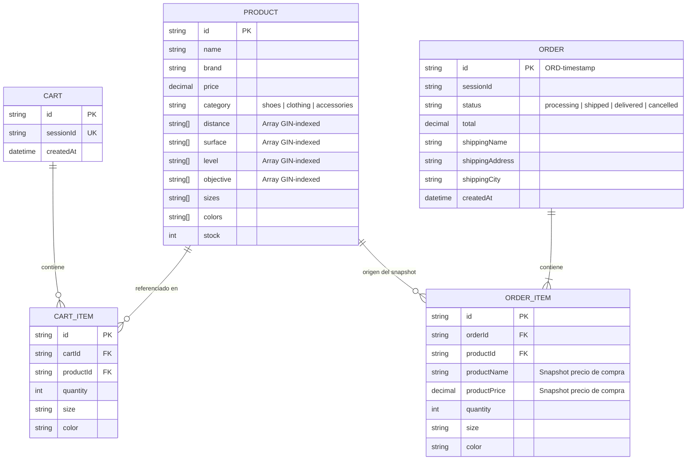

## Índice

0. [Ficha del proyecto](#0-ficha-del-proyecto)
1. [Descripción general del producto](#1-descripción-general-del-producto)
2. [Arquitectura del sistema](#2-arquitectura-del-sistema)
3. [Modelo de datos](#3-modelo-de-datos)
4. [Especificación de la API](#4-especificación-de-la-api)
5. [Historias de usuario](#5-historias-de-usuario)
6. [Tickets de trabajo](#6-tickets-de-trabajo)
7. [Pull requests](#7-pull-requests)

---

## 0. Ficha del proyecto

### **0.1. Tu nombre completo:**

Xavier Venteo

### **0.2. Nombre del proyecto:**

RunMarket

### **0.3. Descripción breve del proyecto:**

Ecommerce especializado en productos deportivos para running. Permite a corredores principiantes, populares y avanzados encontrar zapatillas, ropa técnica y accesorios adaptados a su perfil mediante filtros propios de la disciplina: distancia objetivo, tipo de superficie, nivel del corredor y objetivo de entrenamiento.

### **0.4. URL del proyecto:**

> Pendiente de documentar.

### 0.5. URL o archivo comprimido del repositorio

[xavierventeo/AI4Devs-finalproject](https://github.com/xavierventeo/AI4Devs-finalproject/tree/feature-entrega1-XVB)


---

## 1. Descripción general del producto

### **1.1. Objetivo:**

**RunMarket** es un ecommerce especializado en productos deportivos para running. Permite a corredores principiantes, populares y avanzados encontrar zapatillas, ropa técnica y accesorios adaptados a su perfil mediante filtros propios de la disciplina: distancia objetivo, tipo de superficie, nivel del corredor y objetivo de entrenamiento.

El problema que resuelve es de orientación y relevancia: los ecommerce generalistas no ofrecen filtros específicos de running, lo que obliga al corredor a navegar catálogos irrelevantes sin criterios técnicos. RunMarket reduce esa fricción colocando al corredor y su perfil en el centro del catálogo.

**Propuesta de valor:** el único ecommerce donde el catálogo se adapta al corredor, no al revés.

> Documentación completa de producto (Lean Canvas, casos de uso, decisiones de diseño): [docs/PRD.md](docs/PRD.md)

### **1.2. Características y funcionalidades principales:**

El MVP cubre el ciclo completo de descubrimiento y compra:

1. **Catálogo de productos** — zapatillas, ropa técnica y accesorios para running
2. **Búsqueda y filtrado multidimensional** — por categoría, distancia, superficie, nivel y objetivo de entrenamiento; filtros combinables con actualización dinámica
3. **Ficha de producto** — descripción técnica, atributos running como etiquetas de color, selector de talla/color, stepper de cantidad y trust signals (envío, devolución, garantía)
4. **Gestión de carrito** — añadir, modificar cantidad y eliminar; resumen con subtotal, envío y total; persiste en sesión
5. **Checkout simulado** — flujo en 2 pasos (datos de envío + método de pago); sin procesamiento real de pagos ni autenticación requerida
6. **Confirmación de pedido** — número de pedido generado y resumen de compra
7. **Gestión básica de pedidos** — historial con estados: pendiente, procesando, enviado, entregado

> Casos de uso detallados con diagramas de flujo: [docs/PRD.md#casos-de-uso-principales](docs/PRD.md)

### **1.3. Diseño y experiencia de usuario:**

Prototipo interactivo: [Ecommerce para productos deportivos — Figma Make](https://www.figma.com/make/0wtedXb5138odnAOgHlMiA/Ecommerce-para-productos-deportivos)

Las capturas de pantalla se encuentran en [`docs/prototypes/`](docs/prototypes/).

---

**Home — Catálogo con filtros** · *Caso de uso 1*


Catálogo con panel lateral de filtros running. Punto de entrada y diferencial principal del producto.

---

**Ficha de producto** · *Caso de uso 2*


Detalle técnico del producto con atributos running, selector de talla/color y botón de añadir al carrito.

---

**Carrito** · *Caso de uso 3*


Resumen de selección con subtotal, envío y acceso al checkout.

---

**Checkout — Datos de envío** · *Caso de uso 3*


Formulario de envío, paso 1 del proceso de compra simulado.

---

**Checkout — Método de pago** · *Caso de uso 3*


Formulario de tarjeta simulada, paso 2 del proceso de compra.

---

**Confirmación de pedido** · *Caso de uso 3*


Pantalla de éxito con número de pedido generado.

---

**Mis pedidos**


Historial de pedidos con estado y detalle de productos.

### **1.4. Instrucciones de instalación:**

> Pendiente de documentar.

---

## 2. Arquitectura del Sistema

> Documentación completa de arquitectura: [docs/ARCHITECTURE.md](docs/ARCHITECTURE.md)

### **2.1. Diagrama de arquitectura:**

RunMarket sigue una arquitectura de **frontend SSR desacoplado + API REST + base de datos relacional**. La separación en tres capas independientes permite testing unitario aislado en cada nivel y escala natural en versiones posteriores.


```mermaid
graph TB
    subgraph Browser["Cliente — Navegador"]
        UI["React · componentes hidratados"]
    end

    subgraph FE["Frontend — Next.js 14 SSR · :3000"]
        SC["Server Components · SSR + SEO"]
        CC["Client Components · Interactividad"]
        APICL["API Client · fetch tipado"]
    end

    subgraph BE["Backend — Express REST API · :4000"]
        ROUTER["Routers · /api/products /api/orders /api/cart /api/checkout"]
        SVC["Domain Services · CatalogService · CartService · CheckoutService · OrderService"]
        REPO["Repositories · abstracción de datos"]
    end

    subgraph DATA["Datos"]
        ORM["Prisma ORM"]
        PG[("PostgreSQL · :5432")]
    end

    UI <-->|HTTPS| SC
    SC --- CC
    SC --> APICL
    CC --> APICL
    APICL <-->|"REST JSON"| ROUTER
    ROUTER --> SVC
    SVC --> REPO
    REPO --> ORM
    ORM --> PG
```

**Patrón:** [Layered Architecture](https://martinfowler.com/bliki/PresentationDomainDataLayering.html) con Repository Pattern en el backend (Router → Controller → Service → Repository). SSR selectivo en el frontend: solo catálogo y ficha de producto se renderizan en servidor (valor SEO); carrito, checkout y pedidos son Client Components.

### **2.2. Descripción de componentes principales:**

| Componente | Tecnología | Responsabilidad |
|---|---|---|
| **Frontend** | Next.js 14 · React 18 · TypeScript · Tailwind CSS · shadcn/ui | Renderizado SSR de catálogo y fichas de producto; interactividad client-side para carrito y checkout |
| **Backend API** | Node.js 20 · Express 4 · TypeScript · Zod | API REST con lógica de negocio organizada en Services; validación de entrada con Zod |
| **ORM** | Prisma 5 | Abstracción type-safe de acceso a PostgreSQL; gestión de migraciones y seeds |
| **Base de datos** | PostgreSQL 16 | Persistencia relacional del catálogo, pedidos e ítems de pedido |
| **Tests unitarios** | Vitest + RTL (FE) · Jest + Supertest (BE) | Cobertura de componentes, services y endpoints de forma aislada |
| **Tests E2E** | Playwright | Validación de flujos completos: filtrado → ficha → carrito → checkout → confirmación |

### **2.3. Descripción de alto nivel del proyecto y estructura de ficheros**

El proyecto se organiza como **monorepo con npm workspaces** en tres paquetes independientes:

```
runmarket/
├── frontend/          ← Next.js 14 (SSR · puerto 3000)
│   └── src/
│       ├── app/       ← App Router: rutas SSR y Client pages
│       ├── components/← Catálogo, Producto, Carrito, Checkout
│       ├── lib/       ← API client tipado hacia el backend
│       └── types/     ← Tipos compartidos (Product, Order, CartItem)
│
├── backend/           ← Express REST API (puerto 4000)
│   ├── src/
│   │   ├── routes/    ← Definición de endpoints REST
│   │   ├── controllers/← Capa HTTP: validación y respuesta
│   │   ├── services/  ← Lógica de negocio (CatalogService, OrderService…)
│   │   ├── repositories/← Acceso a datos via Prisma
│   │   └── middleware/← CORS, error handler, logger
│   └── prisma/        ← Schema, migraciones y seed de datos
│
└── e2e/               ← Playwright E2E tests
    └── tests/         ← catalog.spec · product.spec · purchase.spec
```

El backend sigue el patrón **Repository + Service Layer**: los Services contienen la lógica de negocio pura (sin dependencias HTTP ni de base de datos directas), lo que permite testearlos de forma aislada con mocks de Repository.

### **2.4. Infraestructura y despliegue**

> Pendiente de documentar.

### **2.5. Seguridad**

> Pendiente de documentar.

### **2.6. Tests**

> Pendiente de documentar.

---

## 3. Modelo de Datos

> Documentación completa del modelo de datos, decisiones de diseño y esquema Prisma: [docs/DATA-MODEL.md](docs/DATA-MODEL.md)

### **3.1. Diagrama del modelo de datos:**

El modelo cubre las cinco entidades del MVP: catálogo de productos, carrito de sesión y ciclo de pedido. Los atributos de filtrado running (`distance`, `surface`, `level`, `objective`) se modelan como **arrays nativos de PostgreSQL** indexados con GIN, evitando cuatro tablas de junction innecesarias para un conjunto de valores pequeño y cerrado.


```mermaid
erDiagram
    PRODUCT {
        string   id          PK
        string   name
        string   brand
        decimal  price
        string   category       "shoes | clothing | accessories"
        string[] distance       "Array GIN-indexed"
        string[] surface        "Array GIN-indexed"
        string[] level          "Array GIN-indexed"
        string[] objective      "Array GIN-indexed"
        string[] sizes
        string[] colors
        int      stock
    }

    CART {
        string   id          PK
        string   sessionId   UK
        datetime createdAt
    }

    CART_ITEM {
        string   id          PK
        string   cartId      FK
        string   productId   FK
        int      quantity
        string   size
        string   color
    }

    ORDER {
        string   id          PK  "ORD-timestamp"
        string   sessionId
        string   status          "processing | shipped | delivered | cancelled"
        decimal  total
        string   shippingName
        string   shippingAddress
        string   shippingCity
        datetime createdAt
    }

    ORDER_ITEM {
        string   id           PK
        string   orderId      FK
        string   productId    FK
        string   productName     "Snapshot precio de compra"
        decimal  productPrice    "Snapshot precio de compra"
        int      quantity
        string   size
        string   color
    }

    CART        ||--o{ CART_ITEM  : "contiene"
    PRODUCT     ||--o{ CART_ITEM  : "referenciado en"
    ORDER       ||--|{ ORDER_ITEM : "contiene"
    PRODUCT     ||--o{ ORDER_ITEM : "origen del snapshot"
```

### **3.2. Descripción de entidades principales:**

| Entidad | Rol | Restricciones clave |
|---|---|---|
| **PRODUCT** | Catálogo de productos de running. Atributos de filtrado como arrays GIN-indexed para consultas eficientes. | `price` como `Decimal` (no Float); `stock ≥ 0`; `category` enum cerrado |
| **CART** | Carrito activo de una sesión de navegador. Se vacía al completar el checkout. | `sessionId` unique — un carrito por sesión |
| **CART_ITEM** | Línea de ítem del carrito. Usa precio actual del producto (no snapshot). | Unique constraint por `(cartId, productId, size, color)` |
| **ORDER** | Pedido generado tras checkout. Almacena dirección de envío como campos planos (sin entidad ADDRESS en MVP). | `subtotal + shipping = total`; `id` formato `ORD-{timestamp}` |
| **ORDER_ITEM** | Línea de ítem del pedido con **snapshot** de nombre, marca y precio del producto en el momento de compra. Garantiza inmutabilidad del historial. | `productPrice` fijado en checkout; no se actualiza si cambia el producto |

---

## 4. Especificación de la API

> Si tu backend se comunica a través de API, describe los endpoints principales (máximo 3) en formato OpenAPI. Opcionalmente puedes añadir un ejemplo de petición y de respuesta para mayor claridad

---

## 5. Historias de Usuario

> Documenta 3 de las historias de usuario principales utilizadas durante el desarrollo, teniendo en cuenta las buenas prácticas de producto al respecto.

**Historia de Usuario 1**

**Historia de Usuario 2**

**Historia de Usuario 3**

---

## 6. Tickets de Trabajo

> Documenta 3 de los tickets de trabajo principales del desarrollo, uno de backend, uno de frontend, y uno de bases de datos. Da todo el detalle requerido para desarrollar la tarea de inicio a fin teniendo en cuenta las buenas prácticas al respecto. 

**Ticket 1**

**Ticket 2**

**Ticket 3**

---

## 7. Pull Requests

> Documenta 3 de las Pull Requests realizadas durante la ejecución del proyecto

**Pull Request 1**

**Pull Request 2**

**Pull Request 3**
