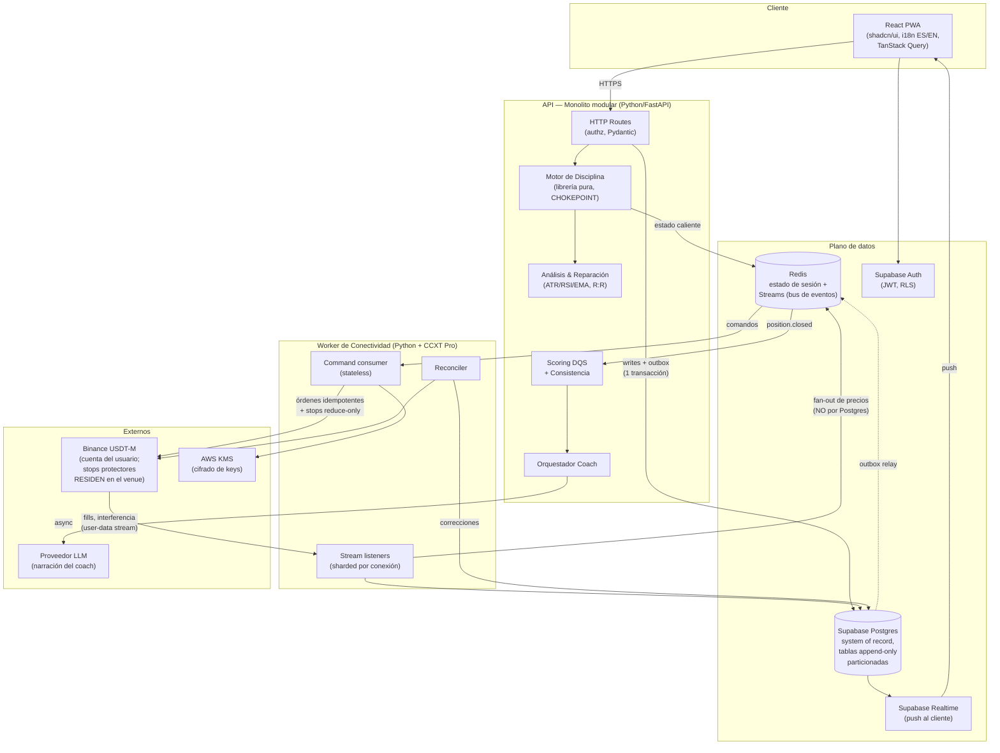
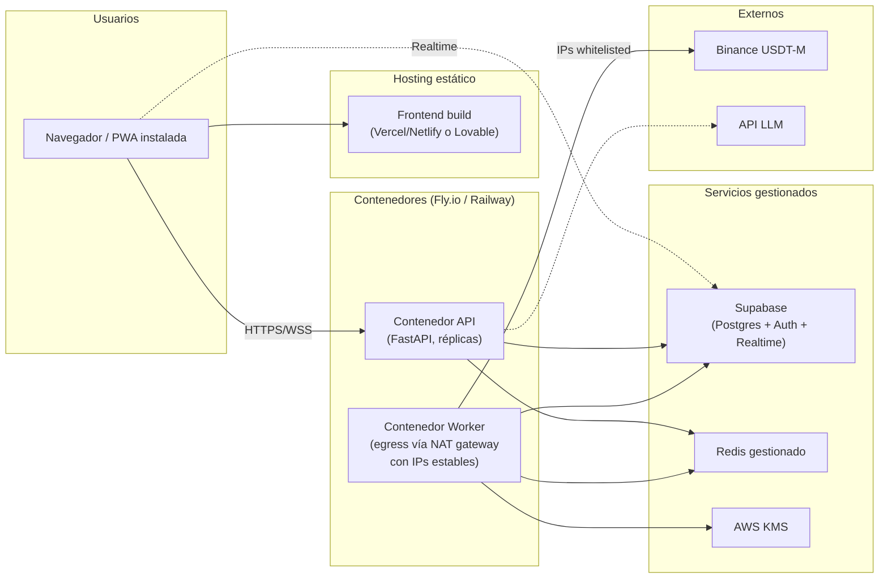

# LongX — Plataforma de Trading Disciplinado

> **"La primera plataforma de trading diseñada para ayudarte a operar mejor — no más."**
> *Trading should be boring. Boring builds wealth.*

---

## Índice

0. [Ficha del proyecto](#0-ficha-del-proyecto)
1. [Descripción general del producto](#1-descripción-general-del-producto)
2. [Arquitectura del sistema](#2-arquitectura-del-sistema)
3. [Modelo de datos](#3-modelo-de-datos)
4. [Especificación de la API](#4-especificación-de-la-api)
5. [Historias de usuario](#5-historias-de-usuario)
6. [Tickets de trabajo](#6-tickets-de-trabajo)
7. [Pull requests](#7-pull-requests)

---

## 0. Ficha del proyecto

### **0.1. Tu nombre completo:**
Roberto Traber

### **0.2. Nombre del proyecto:**
**LongX** — gateway de trading disciplinado no-custodial sobre Binance

### **0.3. Descripción breve del proyecto:**
LongX es una plataforma de trading de criptomonedas construida sobre una tesis contraria a la industria: el problema central del trader retail no es el análisis, es la **disciplina**. LongX opera como un gateway no-custodial sobre la cuenta de Binance del propio usuario, donde cada trade pasa por un motor determinista de disciplina que impone stop loss inamovibles, sizing calculado por riesgo, límites de apalancamiento por tier y circuit breakers de sesión. Un **AI Trade Coach** (conductual, nunca direccional) repara trades defectuosos y explica cada violación de reglas, y cada trade cerrado recibe un **Decision-Quality Score (DQS)** que califica la calidad de la decisión independientemente del resultado. Mobile-first, español-primero y totalmente bilingüe ES/EN, orientado al trader retail de Latinoamérica.

### **0.4. URL del proyecto:**
*[URL de la aplicación desplegada — completar]*
> Si el acceso es privado, las credenciales se comparten de forma segura vía [onetimesecret](https://onetimesecret.com/) a alvaro@lidr.co.

### **0.5. URL o archivo comprimido del repositorio:**
https://github.com/robertotraber/AI4Devs-finalproject/tree/finalproject-RT (rama de entrega: `finalproject-RT`)
> Si el repositorio es privado, los accesos se comparten de forma segura vía [onetimesecret](https://onetimesecret.com/) a alvaro@lidr.co.

**Documentación complementaria del repositorio:**
| Documento | Contenido |
|---|---|
| `LONGX.md` | PRD completo: tesis, Lean Canvas, casos de uso, modelo de datos, diseño de sistema, C4, screen map |
| `LONGX_IMPLEMENTATION.md` | Historias de usuario (12 US + 7 AD), backlog WSJF, tickets, estimaciones y las 3 políticas de calidad (TDD §8, Backend/Refactor §9, QA/E2E/IA §10) |
| `longx_use_case_diagram.puml`, `longx_system_architecture.puml`, `longx_erd.mmd` | Diagramas fuente |

---

## 1. Descripción general del producto

### **1.1. Objetivo**

**El problema.** Los traders retail no destruyen sus cuentas por no saber leer un gráfico: las destruyen moviendo el stop loss, promediando posiciones perdedoras, sobre-apalancándose y haciendo revenge-trading tras una pérdida. Los exchanges tradicionales son estructuralmente incapaces de resolver esto porque **monetizan exactamente esos comportamientos**: volumen, apalancamiento y sobre-operación son su modelo de ingresos.

**La solución.** LongX invierte el modelo: es un gateway de disciplina sobre la cuenta de Binance del propio usuario (los fondos nunca salen de su exchange; LongX solo posee API keys de trade con retiro deshabilitado). Todo trade pasa por un chokepoint determinista que hace cumplir las reglas del propio usuario, y el éxito se mide en **consistencia**, no en PnL.

**Para quién.** Tres personas del mercado LatAm de cripto:
- **Martín** (~50%, core) — talentoso pero indisciplinado: sabe leer el mercado pero no respeta su propio plan.
- **Lucas** (~30%) — trader quemado en recuperación: quiere volver bajo reglas que literalmente no pueda romper.
- **Diego** (~20%) — pro retail: busca un entorno estructurado que no le permita desviarse de sus setups probados.

**El valor diferencial.** La asimetría de incentivos es el foso competitivo: Binance no puede lanzar "te impedimos operar" sin canibalizar su facturación. LongX monetiza consistencia y retención (suscripción + fee plano), por lo que gana cuando sus usuarios sobreviven a largo plazo — el resultado exacto que el producto está diseñado para producir.

### **1.2. Características y funcionalidades principales**

**Motor de disciplina (el chokepoint):**
1. **Validación pre-trade obligatoria** — todo trade nace como una intención declarada (activo, dirección, zona de entrada, stop, target, tesis, estilo) validada dos veces (submit + confirm, la segunda autoritativa) contra el perfil de riesgo efectivo y el estado de sesión. Ninguna orden llega a Binance por otro camino.
2. **Position sizing automático por riesgo** — el tamaño es un *output* de la validación (riesgo % fijo ÷ distancia al stop), nunca un input del usuario.
3. **Stop loss inamovible (tighten-only)** — el stop puede ajustarse solo en dirección de menor riesgo; los intentos de ampliarlo se bloquean y se registran como señal conductual.
4. **Filtro de R:R mínimo y prohibición de promediar en pérdida** — expectativa positiva y supervivencia impuestas estructuralmente.
5. **Circuit breakers y cooldowns** — límite de trades/día, pérdida máxima diaria, pérdidas consecutivas y cooldown post-pérdida; al dispararse, la sesión se bloquea de forma autoritativa (sobrevive logout y acceso directo por API).
6. **Contratos de Ulises** — endurecer límites aplica al instante; aflojarlos se demora 24–72 h (y se rechaza durante un lockout). El usuario no puede desarmar sus protecciones en caliente.
7. **Onboarding restrictivo por defecto** — todo usuario arranca en el tier más estricto y *gana* flexibilidad demostrando consistencia; conexión a Binance con verificación de permisos (retiro OFF, margen aislado, one-way).

**Capa conductual (la diferenciación):**
8. **Decision-Quality Score (DQS)** — cada trade cerrado se califica 0–100 por la calidad de la decisión, independiente del resultado: un trade perdedor que siguió el plan puntúa alto; uno ganador e imprudente puntúa bajo. Transparente por componentes y versionado. El **Consistency Score** (agregado móvil del DQS) es la métrica principal del usuario, por encima del PnL.
9. **AI Trade Coach — conductual, nunca direccional** — narra hechos computados (grades, patrones, violaciones); nunca emite opinión de mercado. Si el trade propuesto no pasa las reglas, el coach propone una **reparación en el mismo estilo del usuario** (mismo activo, dirección y estilo; solo ajusta la geometría de riesgo). Con fallback a plantillas si el LLM no está disponible.
10. **Registro de interferencia externa** — si el usuario elude a LongX operando directo en Binance, el stream de datos del exchange lo revela: se registra, impacta el DQS y el coach lo confronta. Observar y educar, no combatir: LongX es el gimnasio, no el carcelero.
11. **Journaling y reporte contrafactual** — "si hubieras seguido tus reglas": curva de equity real vs. curva con las violaciones eliminadas — el artefacto de retención más persuasivo del producto.

**Capa social:**
12. **Feed de traders con copy-trading disciplinado** — traders publican calls (zona de entrada, SL, TP); al copiar, el trade se valida contra el perfil del *copiador* y se dimensiona para *su* cuenta: un call de un trader que arriesga 5% se ejecuta al 0.75% del copiador.

**Operación:** panel de administración (traders, calls, activos, catálogo de tiers) y documentación de reglas del sistema.

### **1.3. Diseño y experiencia de usuario**

> *[Espacio reservado para capturas de pantalla y/o videotutorial del recorrido completo — añadir al empaquetar la entrega]*

Aplicación **PWA mobile-first** (instalable, display standalone) con navegación inferior de 4 ítems (Home, Trade, Hub, Perfil) que en desktop se convierte en sidebar. **Español por defecto, bilingüe ES/EN** con switch en caliente. Modo oscuro.

Recorrido principal del usuario:
1. **Onboarding** (`/`): splash → registro/login → conexión de cuenta Binance con verificación de permisos → asignación del tier más restrictivo → primer trade guiado a través del ciclo completo intención → validación → confirmación.
2. **Home** (`/home`): score de consistencia como métrica hero, balance y PnL (secundarios), barra de riesgo diario usado, trades del día, posiciones activas, y el banner de bloqueo con cuenta regresiva cuando un circuit breaker se dispara.
3. **Trade / AI Coach** (`/trade`): formulario de trade (activo, dirección, scalp/swing, entrada, SL, TP, riesgo) → evaluación técnica con gates y score 0–100 → decisión Aprobado / Con Ajustes / No Recomendado → si procede, propuesta de trade reparado en el mismo estilo → ejecución vía chokepoint.
4. **Hub** (`/traders`): lista de traders auditados con follow/unfollow, calls activos e historial; ejecución de un call abre el modal de copy con el sizing calculado para el usuario.
5. **Detalle de trade** (`/profile/trade/:id`): precio en vivo, gráfico 24h con líneas de Entrada/SL/TP, control de stop tighten-only con su audit trail, y al cierre la pantalla de grade con el **DQS como número hero** y su desglose por componentes.
6. **Perfil** (`/profile`): consistencia y DQS promedio como stats principales, tabs de trades activos e historial, journaling post-cierre y reporte contrafactual.

### **1.4. Instrucciones de instalación**

El proyecto tiene dos partes: el **frontend + Supabase** (operativo hoy) y el **backend Python** (API + worker, en migración según el plan M0–M5 de `LONGX_IMPLEMENTATION.md` §7).

**Requisitos previos:** Node.js 18+, npm, cuenta/CLI de Supabase; para el backend: Python 3.12+, Docker (Redis y Postgres efímeros de test).

**Frontend + Supabase (estado actual):**
```bash
# 1. Clonar e instalar dependencias
git clone <url-del-repo> && cd longx
npm install

# 2. Variables de entorno (.env en la raíz)
#    Los valores salen del dashboard de Supabase (Settings → API)
VITE_SUPABASE_URL=<url-del-proyecto>
VITE_SUPABASE_ANON_KEY=<anon-key>

# 3. Base de datos: aplicar migraciones (carpeta supabase/migrations/)
npx supabase link --project-ref <project-ref>
npx supabase db push

# 4. Datos semilla (traders, activos y calls de ejemplo para el feed)
#    Ejecutar el seed SQL incluido, o crear datos desde /admin:
npx supabase db execute --file supabase/seed.sql   # si existe seed
#    Alternativa: levantar la app y usar el panel /admin para crear
#    traders, activos (valida el ID contra CoinGecko) y calls.

# 5. Edge functions (Deno) — se despliegan a Supabase:
npx supabase functions deploy evaluate-trade monitor-calls get-price-history translate-explanation validate-coingecko

# 6. Levantar el dev server (puerto 8080)
npm run dev
```

**Comandos de desarrollo:** `npm run build` (build de producción), `npm run lint`, `npm test` (Vitest + Testing Library; `npm run test:watch` en modo watch).

**Backend Python (API + worker — objetivo de la migración M1+):**
```bash
# 1. Entorno
cd backend && python -m venv .venv && source .venv/bin/activate
pip install -r requirements.txt        # FastAPI, ccxt, redis, pydantic, pytest, hypothesis

# 2. Configuración (.env del backend)
DATABASE_URL=postgresql://...          # el MISMO Postgres de Supabase
REDIS_URL=redis://localhost:6379
KMS_KEY_ID=<clave-envelope>            # AWS KMS para cifrado de API keys

# 3. Infra local de desarrollo/test
docker compose up -d redis             # Redis local; Postgres de test vía testcontainers

# 4. Levantar API y worker
uvicorn app.main:app --reload          # API (monolito modular)
python -m worker.main                  # worker de conectividad (consumer + listeners + reconciler)

# 5. Suite de tests (política §8–§10 de LONGX_IMPLEMENTATION.md)
pytest                                 # unit + integración (testcontainers)
```

> **Nota importante de seguridad para la puesta en marcha:** las API keys de Binance usadas en desarrollo deben ser de **testnet** o keys de cuenta real con permiso de retiro **deshabilitado**; el sistema verifica y rechaza keys con retiro habilitado por diseño.

---
## 2. Arquitectura del Sistema

### **2.1. Diagrama de arquitectura**

**Patrón: monolito modular + worker dedicado (Ports & Adapters / arquitectura hexagonal), con Supabase como capa gestionada de datos/auth.** Cuatro piezas de runtime:


```mermaid
flowchart TB
    subgraph CLIENT["Cliente"]
        PWA["React PWA<br/>(shadcn/ui, i18n ES/EN,<br/>TanStack Query)"]
    end

    subgraph API["API — Monolito modular (Python/FastAPI)"]
        ROUTES["HTTP Routes<br/>(authz, Pydantic)"]
        ENGINE["Motor de Disciplina<br/>(librería pura, CHOKEPOINT)"]
        ANALYSIS["Análisis & Reparación<br/>(ATR/RSI/EMA, R:R)"]
        SCORING["Scoring DQS<br/>+ Consistencia"]
        COACH["Orquestador Coach"]
    end

    subgraph WORKER["Worker de Conectividad (Python + CCXT Pro)"]
        CMD["Command consumer<br/>(stateless)"]
        LIS["Stream listeners<br/>(sharded por conexión)"]
        REC["Reconciler"]
    end

    subgraph DATA["Plano de datos"]
        PG[("Supabase Postgres<br/>system of record,<br/>tablas append-only<br/>particionadas")]
        REDIS[("Redis<br/>estado de sesión +<br/>Streams (bus de eventos)")]
        AUTH["Supabase Auth<br/>(JWT, RLS)"]
        RT["Supabase Realtime<br/>(push al cliente)"]
    end

    subgraph EXT["Externos"]
        BIN["Binance USDT-M<br/>(cuenta del usuario;<br/>stops protectores<br/>RESIDEN en el venue)"]
        KMS["AWS KMS<br/>(cifrado de keys)"]
        LLM["Proveedor LLM<br/>(narración del coach)"]
    end

    PWA -->|HTTPS| ROUTES
    PWA --> AUTH
    RT -->|push| PWA
    ROUTES --> ENGINE
    ENGINE --> ANALYSIS
    SCORING --> COACH
    COACH -->|async| LLM
    ROUTES -->|"writes + outbox<br/>(1 transacción)"| PG
    ENGINE -->|estado caliente| REDIS
    PG -.->|outbox relay| REDIS
    REDIS -->|comandos| CMD
    REDIS -->|position.closed| SCORING
    CMD --> KMS
    CMD -->|"órdenes idempotentes<br/>+ stops reduce-only"| BIN
    BIN -->|"fills, interferencia<br/>(user-data stream)"| LIS
    LIS --> PG
    LIS -->|"fan-out de precios<br/>(NO por Postgres)"| REDIS
    REC --> BIN
    REC -->|correcciones| PG
    PG --> RT
```

**Justificación de la elección** (evaluada contra 2 alternativas en `LONGX.md` §7.2):
- **vs. serverless Supabase-céntrico:** los websockets persistentes (streams de Binance) no caben en serverless, y el código más delicado (motor de reglas + ejecución) quedaría repartido entre dos runtimes (Deno + Python). La versión actual del proyecto *es* esa arquitectura y ya exhibe sus modos de fallo (estados que solo avanzan con una pestaña de admin abierta; guardrails solo en cliente).
- **vs. microservicios:** inyectaría particiones de red en el camino intención → validación → orden — el único lugar donde "las reglas no aplicaron por un blip de red" es un bug existencial — y su coste operativo es inasumible para el tamaño de equipo del MVP.

**Beneficios que justifican el patrón elegido:** un solo lenguaje (Python) para el código crítico; el chokepoint es *físicamente* un único code path; el perímetro de seguridad es un único proceso pequeño (solo el worker ve keys descifradas); dos contenedores de ops; y la evolución es aditiva — los módulos ya se comunican por eventos, así que extraer servicios después (si la escala lo exige) sigue costuras ya dibujadas.

**Sacrificios asumidos (honestos):** los límites entre módulos del monolito se mantienen por disciplina (import-linter en CI, no por proceso); stack mixto durante la migración (frontend TS + backend Python conviviendo con las edge functions Deno hasta retirarlas); Redis como pieza load-bearing (mitigado: el estado de sesión se reconstruye síncronamente desde Postgres); y el worker es un singleton con estado — el punto real de escalado futuro, mitigado con diseño shard-aware desde el día uno.

**Propiedad de diseño clave:** los stops protectores viven **en Binance** como órdenes reduce-only — si LongX se cae, toda posición abierta sigue protegida por el venue. La caída de LongX degrada coaching y nuevas entradas, nunca la protección. Eso compra un presupuesto de disponibilidad honesto (99.5%) para un equipo pequeño.

### **2.2. Descripción de componentes principales**

| Componente | Tecnología | Responsabilidad |
|---|---|---|
| **React PWA** | Vite 5, React 18, TypeScript 5, Tailwind + shadcn/ui (Radix), TanStack React Query, react-hook-form + Zod, vite-plugin-pwa | UI mobile-first bilingüe; espejo optimista del estado del servidor — **no impone ninguna regla** |
| **API — monolito modular** | Python 3.12, FastAPI, Pydantic | Rutas HTTP + los módulos de dominio en paquetes con fronteras verificadas por CI |
| **Motor de Disciplina** | Librería Python pura (cero imports de I/O, verificado con import-linter) | El chokepoint: valida toda intención (submit + confirm), computa el sizing, evalúa reglas de sesión. Determinista y testeable por tablas/propiedades |
| **Análisis & Reparación** | Python puro (portado de la edge function `evaluate-trade`) | ATR, RSI, EMA 50/200, S/R, Fibonacci; score de calidad; algoritmo de reparación (mismo activo/dirección/estilo, solo geometría de riesgo) |
| **Scoring DQS** | Python, consumer de Redis Streams | Ensambla el audit bundle al cierre y computa el grade 0–100 versionado y transparente por componentes; agrega el Consistency Score |
| **Coach** | Python + LLM (Claude API), fallback a plantillas | Narra hechos computados en ES/EN; jamás opinión direccional; asíncrono, nunca en el camino de la orden |
| **Worker de conectividad** | Python, CCXT Pro, asyncio (3 tareas: consumer, listeners, reconciler) | Único proceso que descifra keys (KMS, solo en memoria); coloca órdenes idempotentes y stops en el venue; escucha fills e interferencia; reconcilia contra la verdad de Binance |
| **Supabase** | Postgres (system of record), Auth (JWT+RLS), Realtime (push) | Persistencia con outbox transaccional; tablas de auditoría append-only particionadas por mes |
| **Redis** | Redis Streams + KV | Estado caliente de sesión (rebuild síncrono desde Postgres en miss) y bus de comandos/eventos con consumer groups |
| **Edge Functions (legado en retirada)** | Deno | `evaluate-trade`, `monitor-calls`, etc. — se retiran a medida que su lógica se porta (plan AD-03/AD-04) |

### **2.3. Descripción de alto nivel del proyecto y estructura de ficheros**

Estructura por **dominio, nunca por capa técnica** (regla R15 de la política de arquitectura — `utils/` y `helpers/` están prohibidos por lint):

```
longx/
├── src/                          # Frontend React PWA (TypeScript)
│   ├── pages/                    # Componentes de ruta (Home, TradeCoach, TraderFeed, ...)
│   ├── components/<feature>/     # Componentes por feature (trade/, home/, admin/, layout/)
│   ├── components/ui/            # Primitivas shadcn/ui (no editar a mano)
│   ├── context/AppContext.tsx    # Estado global (espejo optimista, NO enforcement)
│   ├── hooks/                    # useLivePrices (Realtime), use-mobile, use-toast
│   ├── i18n/                     # useT() — bilingüe ES/EN
│   └── integrations/supabase/    # Cliente tipado + types.ts generado
├── supabase/
│   ├── migrations/               # Esquema SQL versionado (única vía de cambio de schema)
│   └── functions/                # Edge functions Deno (legado, en retirada)
├── backend/                      # Monolito modular Python (FastAPI)
│   └── app/
│       ├── discipline/           # Motor de reglas puro (el chokepoint)
│       ├── analysis/             # Indicadores + algoritmo de reparación
│       ├── scoring/              # DQS + consistencia
│       ├── coach/                # Orquestación LLM + plantillas fallback
│       ├── accounts/             # Usuarios, tiers, workflow Ulysses, conexiones
│       ├── execution/            # Ports del gateway (interfaces venue-agnósticas)
│       └── api/                  # Rutas FastAPI (orquestación fina, sin lógica de negocio)
├── worker/                       # Worker de conectividad (proceso separado)
│   ├── consumer/                 # Ejecución de comandos (órdenes idempotentes)
│   ├── listeners/                # User-data + market streams (sharded)
│   └── reconciler/               # Sincronización periódica contra Binance
├── tests/
│   └── prompts/                  # Prompts de generación de tests, versionados (política §10 R31)
├── LONGX.md                      # PRD completo
├── LONGX_IMPLEMENTATION.md       # Historias, backlog, tickets, políticas de calidad
└── README.md
```

El patrón es **hexagonal**: `discipline/`, `analysis/` y `scoring/` son núcleo puro sin imports de infraestructura; `execution/` define los *ports* (`ExchangeGateway`, `KeyVault`, `Clock`, repositorios) y los *adapters* concretos (Binance/CCXT, KMS, Postgres) viven en el borde y se inyectan desde el composition root.

### **2.4. Infraestructura y despliegue**


```mermaid
flowchart LR
    subgraph USERS["Usuarios"]
        U["Navegador / PWA instalada"]
    end
    subgraph EDGE["Hosting estático"]
        FE["Frontend build<br/>(Vercel/Netlify o Lovable)"]
    end
    subgraph COMPUTE["Contenedores (Fly.io / Railway)"]
        APIC["Contenedor API<br/>(FastAPI, réplicas)"]
        WKC["Contenedor Worker<br/>(egress vía NAT gateway<br/>con IPs estables)"]
    end
    subgraph MANAGED["Servicios gestionados"]
        SB["Supabase<br/>(Postgres + Auth + Realtime)"]
        RD["Redis gestionado"]
        KMSS["AWS KMS"]
    end
    subgraph EXT2["Externos"]
        BN["Binance USDT-M"]
        LLMP["API LLM"]
    end
    U --> FE
    U -->|HTTPS/WSS| APIC
    U -.->|Realtime| SB
    APIC --> SB
    APIC --> RD
    APIC -.-> LLMP
    WKC --> RD
    WKC --> SB
    WKC --> KMSS
    WKC -->|IPs whitelisted| BN
```

**Decisiones de infraestructura:** el frontend se sirve como build estático; API y worker son dos contenedores en una plataforma gestionada (Fly.io/Railway) para velocidad de MVP; **KMS vive en AWS desde el día uno** para que la pieza crítica de seguridad nunca migre; el worker sale a Internet por un **NAT gateway con IPs de egreso estables** — imprescindible porque las API keys de los usuarios se whitelistean por IP y los rate limits de Binance son parcialmente por IP.

**Proceso de despliegue:** trunk-based con CI en cada push — lint + análisis estático (mypy/ruff/TS strict) + import-linter + suite completa (unit + integración con testcontainers) → build de imágenes → deploy del contenedor API (rolling, réplicas) y del worker (recreación con drain de streams) → migraciones de BD siempre **antes** del deploy de código y siempre backward-compatible (expand/contract), vía `supabase/migrations/`. Los tests E2E (Playwright, 3 flujos críticos) corren contra un entorno de preview antes de promover. La caída temporal del worker no desprotege posiciones (los stops residen en Binance).

### **2.5. Seguridad**

1. **No-custodial por construcción:** los fondos nunca tocan LongX; las API keys son de **solo trade con retiro deshabilitado**, y el sistema verifica ese permiso al conectar **y periódicamente** — si el usuario rehabilita el retiro, la conexión se suspende.
2. **Custodia de keys minimizada y nombrable:** cifrado envelope con AWS KMS; descifrado **solo en memoria del worker** (único proceso con acceso); nunca en logs, nunca al cliente; keys whitelisteadas a las IPs de egreso del NAT.
3. **Autenticación y aislamiento de datos:** Supabase Auth (JWT) + políticas RLS por usuario en todas las tablas (el proyecto original usaba políticas allow-all de demo; su reemplazo es la historia AD-01, precondición de cualquier dinero real).
4. **Enforcement server-side inviolable:** las reglas de disciplina se imponen en el chokepoint del backend; un insert directo por PostgREST no puede saltárselas (RLS + sin write-path directo a trades). El cliente solo espeja.
5. **Idempotencia y auditoría:** órdenes con `client_order_id` derivado de la intención (un retry no puede duplicar un fill); tablas de auditoría append-only (validaciones, fills, ajustes de stop, eventos conductuales) que hacen el DQS verificable.
6. **Threat model documentado:** el peor caso con keys robadas no es retiro (imposible) sino trading hostil — mitigado con whitelist de IP, alertas sobre órdenes no originadas por LongX (el listener de interferencia ya observa esto) y blast radius limitado por beta cerrada.
7. **Postura frente a IA:** el coach jamás recibe instrucciones del usuario que alteren reglas (narra hechos computados); y por política de QA (§10), **nunca** se envían datos de producción, emails, metadata de keys ni historiales reales a proveedores de IA externos.
8. **Higiene de secretos:** configuración por variables de entorno; nada de secretos en el repo; SAST y escaneo de dependencias en CI.

### **2.6. Tests**

La estrategia completa está en `LONGX_IMPLEMENTATION.md` §8–§10 (TDD con IA, testing trophy, reglas de integración/E2E/BDD). Ejemplos representativos de tests realizados/definidos:

- **Unit paramétrico (motor de disciplina):** tabla de la matriz de reglas — R:R exactamente en el piso del tier pasa, un tick por debajo rechaza con `rr_floor` en `rule_outcomes`; el 4º trade del día con cap de 3 rechaza con `trade_cap`; stop del lado incorrecto para un short muere en el constructor del Value Object.
- **Property-based (hypothesis):** para cualquier combinación válida de equity/riesgo%/distancia de stop, el sizing computado nunca arriesga más del % elegido.
- **Parity suite (migración AD-03):** los indicadores portados a Python producen, sobre un set fijo de fixtures OHLC, los mismos valores (con tolerancia) y los mismos veredictos de gate que la edge function Deno original — la suite se escribió **antes** de portar y es la especificación ejecutable del legado.
- **Integración (testcontainers, Postgres+Redis reales):** intención → doble validación → fila de outbox en una transacción; **intento de bypass** por PostgREST directo bloqueado; el lockout de sesión sobrevive logout y acceso por API; rebuild síncrono del estado de sesión al perder Redis.
- **Integración worker (fake exchange):** doble entrega del mismo comando no duplica el fill (idempotencia por `client_order_id`); al fill de entrada se coloca el stop reduce-only; el reconciler corrige drift inyectado tomando a Binance como verdad.
- **DQS determinista:** fixtures de trades → grades exactos y reproducibles; el caso "ganó pero rompió reglas puntúa bajo / perdió pero disciplinado puntúa alto"; **mutation testing** (mutmut) sobre motor y scorers — un mutante superviviente equivale a un caso de test faltante.
- **Coach (LLM mockeado):** la narración solo referencia hechos suministrados (grounding); el guard de contenido no-direccional; fallback a plantillas cuando el LLM falla.
- **E2E (Playwright, selectores semánticos, locale es-AR):** los 3 flujos críticos — onboarding + conexión Binance con verificación de permisos; la espina intención → validación → ejecución → grade → coach; y el circuit breaker cuyo banner de bloqueo persiste tras recargar y re-loguear.

---
## 3. Modelo de Datos

### **3.1. Diagrama del modelo de datos**

Veinte entidades en tres dominios (gobernanza de riesgo, conectividad/ejecución, capa conductual). Principio rector: **dos fuentes de verdad explícitamente separadas** — Binance es autoritativo para posiciones, fills y balances; LongX es autoritativo para intenciones, reglas, grades e historial conductual. El reconciler cierra la brecha continuamente.


```mermaid
erDiagram
  USERS ||--|| RISK_PROFILES : has
  RISK_TIERS ||--o{ RISK_PROFILES : bounds
  USERS ||--o{ GUARDRAIL_CHANGES : requests
  USERS ||--o{ SESSION_STATES : "tracked per session day"
  USERS ||--o{ EXCHANGE_CONNECTIONS : connects
  EXCHANGE_CONNECTIONS ||--o{ ACCOUNT_SNAPSHOTS : "observes equity"
  USERS ||--o{ TRADE_INTENTS : submits
  TRADE_INTENTS ||--o{ VALIDATION_RESULTS : "validated at submit + confirm"
  TRADE_INTENTS ||--o| POSITIONS : opens
  TRADE_INTENTS |o--o{ TRADE_INTENTS : "repaired as (parent_intent_id)"
  TRADERS ||--o{ TRADER_CALLS : publishes
  TRADER_CALLS |o--o{ TRADE_INTENTS : "copied as (source_call_id)"
  USERS ||--o{ USER_FOLLOWS : follows
  TRADERS ||--o{ USER_FOLLOWS : "followed by"
  EXCHANGE_CONNECTIONS ||--o{ POSITIONS : "executed via"
  POSITIONS ||--o{ EXCHANGE_ORDERS : places
  EXCHANGE_ORDERS ||--o{ ORDER_FILLS : "filled by"
  POSITIONS ||--o{ STOP_ADJUSTMENTS : logs
  POSITIONS ||--o| TRADE_GRADES : "graded as"
  POSITIONS ||--o{ JOURNAL_ENTRIES : "reflected in"
  USERS ||--o{ BEHAVIORAL_EVENTS : emits
  POSITIONS |o--o{ BEHAVIORAL_EVENTS : "may reference"
  USERS ||--o{ COACH_MESSAGES : receives

  USERS {
    uuid id PK
    string email UK "not null"
    string status "active | suspended"
    timestamp created_at "not null"
  }
  RISK_TIERS {
    int id PK
    string name UK
    numeric min_risk_pct "not null"
    numeric max_risk_pct "not null"
    numeric max_leverage "not null"
    int max_trades_per_day "not null"
    numeric max_daily_loss_pct "not null"
    numeric min_rr_ratio "not null"
    int cooldown_minutes "not null"
    int loosen_delay_hours "delay Ulysses"
  }
  RISK_PROFILES {
    uuid id PK
    uuid user_id FK "not null"
    int tier_id FK "not null"
    numeric chosen_risk_pct "CHECK dentro de banda del tier"
    numeric chosen_leverage "CHECK dentro de banda del tier"
    timestamp effective_from "resuelto as-of now()"
  }
  GUARDRAIL_CHANGES {
    uuid id PK
    uuid user_id FK
    string direction "tighten | loosen"
    jsonb requested_values
    timestamp applies_at "now() si tighten, demorado si loosen"
    string status "pending | applied | cancelled | rejected"
  }
  SESSION_STATES {
    uuid id PK
    uuid user_id FK
    date session_date "UK (user_id, session_date)"
    int trades_count "default 0"
    numeric realized_loss "default 0"
    int consecutive_losses "default 0"
    timestamp locked_until "nullable"
    string lock_reason "nullable"
  }
  EXCHANGE_CONNECTIONS {
    uuid id PK
    uuid user_id FK
    string venue "binance_usdm (MVP)"
    string encrypted_key_ref "referencia KMS, nunca la key"
    jsonb permissions_snapshot "withdraw debe ser OFF"
    string margin_mode "isolated (enforced)"
    string position_mode "one_way (enforced)"
    string status "active | suspended | revoked"
    timestamp last_sync_at
  }
  ACCOUNT_SNAPSHOTS {
    uuid id PK
    uuid connection_id FK
    numeric balance
    numeric equity
    timestamp captured_at "append-only, particionada"
  }
  TRADE_INTENTS {
    uuid id PK
    uuid user_id FK "not null"
    uuid parent_intent_id FK "nullable, linaje de reparacion"
    uuid source_call_id FK "nullable, call copiado"
    string origin "user | coach_repair | trader_call"
    string symbol "not null"
    string side "long | short"
    string style "scalp | swing"
    numeric entry_price_min "not null"
    numeric entry_price_max "CHECK >= entry_price_min"
    numeric stop_price "not null, lado validado en dominio"
    numeric target_price "not null"
    text thesis
    string status "pending | approved | rejected | executed | expired"
    timestamp submitted_at "not null"
  }
  VALIDATION_RESULTS {
    uuid id PK
    uuid intent_id FK "not null"
    string stage "submit | confirm (autoritativo)"
    boolean passed "not null"
    numeric computed_size "el sizing es OUTPUT"
    jsonb rule_outcomes "veredicto por regla"
    timestamp validated_at "append-only"
  }
  POSITIONS {
    uuid id PK
    uuid intent_id FK "not null"
    uuid connection_id FK "not null"
    string venue "not null"
    string symbol
    string side
    numeric size
    numeric leverage
    numeric avg_entry "recomputado desde fills"
    numeric exit_price "nullable"
    numeric realized_pnl "nullable"
    string status "open | closed | liquidated"
    timestamp opened_at
    timestamp closed_at "nullable"
  }
  EXCHANGE_ORDERS {
    uuid id PK
    uuid position_id FK
    string purpose "entry | protective_stop | target | manual_close"
    string client_order_id UK "clave de idempotencia"
    string exchange_order_id "asignado por Binance"
    string order_type "market | limit | stop_market_reduce_only"
    numeric qty
    numeric price
    string status "new | partially_filled | filled | cancelled | rejected"
    timestamp last_update_at
  }
  ORDER_FILLS {
    uuid id PK
    uuid order_id FK
    numeric qty
    numeric price
    numeric fee
    timestamp filled_at "append-only, particionada"
  }
  STOP_ADJUSTMENTS {
    uuid id PK
    uuid position_id FK
    numeric old_stop
    numeric new_stop
    string source "longx | external (interferencia)"
    timestamp adjusted_at "append-only"
  }
  TRADE_GRADES {
    uuid id PK
    uuid position_id FK "UK (1 grade por posicion)"
    int dqs "0-100, metrica hero"
    jsonb components "sub-scores + razones"
    string grading_version "not null, comparabilidad historica"
    timestamp graded_at "append-only"
  }
  JOURNAL_ENTRIES {
    uuid id PK
    uuid position_id FK
    text content
    timestamp created_at
  }
  BEHAVIORAL_EVENTS {
    uuid id PK
    uuid user_id FK "not null"
    uuid position_id FK "nullable"
    string event_type "intent_rejected | stop_widen_attempt | external_stop_cancel | repair_declined | lock_override_attempt | ..."
    jsonb context
    timestamp occurred_at "append-only, particionada"
  }
  COACH_MESSAGES {
    uuid id PK
    uuid user_id FK
    string trigger_type "grade | rejection_pattern | interference | onboarding | session_lock"
    uuid source_event_id "procedencia"
    text content
    timestamp sent_at
  }
  TRADERS {
    uuid id PK
    string name
    numeric win_rate
    numeric max_drawdown
    int followers_count "default 0"
    boolean verified "default false"
    string style
  }
  TRADER_CALLS {
    uuid id PK
    uuid trader_id FK
    string symbol
    string side
    numeric entry_price_min
    numeric entry_price_max
    numeric stop_loss
    numeric take_profit
    string status
  }
  USER_FOLLOWS {
    uuid id PK
    uuid user_id FK "UK (user_id, trader_id)"
    uuid trader_id FK
    timestamp followed_at
  }
```

### **3.2. Descripción de entidades principales**

**`TRADE_INTENTS` — la intención declarada (qué quiso hacer el trader).**
PK `id uuid`. FKs: `user_id → USERS` (not null), `parent_intent_id → TRADE_INTENTS` (self-FK nullable — linaje de reparación del coach), `source_call_id → TRADER_CALLS` (nullable — copy-trading). `origin` (`user | coach_repair | trader_call`) traza toda operación a su origen humano. Zona de entrada como rango (`entry_price_min/max`, con CHECK `max ≥ min`); `stop_price` con el invariante de lado (por debajo de la entrada en longs, por encima en shorts) validado **en el objeto de dominio en construcción**, no en capas posteriores. `status` es el único campo mutable. Relación 1—N con `VALIDATION_RESULTS` y 1—0..1 con `POSITIONS` (solo las aprobadas abren posición). Es registro inmutable incluso al ser rechazada — las intenciones rechazadas son el insumo principal del coaching.

**`VALIDATION_RESULTS` — el veredicto del chokepoint (append-only).**
PK `id`, FK `intent_id` (not null). `stage` (`submit | confirm`) materializa la doble validación — la de confirm es la autoritativa. `computed_size` hace explícito el principio de que **el tamaño es un output de la validación, nunca un input del usuario**. `rule_outcomes jsonb` guarda el veredicto por regla (trazabilidad total de por qué pasó o falló). Cardinalidad 1—N desde la intención (mínimo dos filas por intención ejecutada).

**`POSITIONS` + `EXCHANGE_ORDERS` + `ORDER_FILLS` — las tres verdades de la ejecución.**
`POSITIONS` (FK `intent_id`, `connection_id`) es la vista de dominio de LongX; `EXCHANGE_ORDERS` es la vista de Binance, con `client_order_id` **UNIQUE** derivado de la intención — la clave de idempotencia que hace imposible el doble fill en retries — y `purpose` distinguiendo entrada, stop protector (`stop_market_reduce_only` que reside en el venue), target y cierre manual; `ORDER_FILLS` (append-only, particionada) registra cada fill parcial con su fee. `avg_entry`/`realized_pnl` en `POSITIONS` son agregados denormalizados que el reconciler recomputa desde los fills (nunca confía en incrementos).

**`SESSION_STATES` — el estado autoritativo de los circuit breakers.**
UNIQUE `(user_id, session_date)` — una fila por usuario por día de sesión, leída en **cada** validación (copia caliente en Redis, reconstruida síncronamente desde esta tabla en cache miss: el enforcement jamás pasa con estado ausente). `locked_until` + `lock_reason` hacen que el lockout sobreviva logout, reinstalación y acceso directo por API.

**`TRADE_GRADES` — el Decision-Quality Score (append-only).**
FK `position_id` UNIQUE (un grade por posición cerrada). `dqs int` 0–100; `components jsonb` con el desglose por dimensión (adherencia al plan, sizing, R:R en entrada, conducta del stop, contexto de sesión) — el requisito de transparencia hecho dato; `grading_version` (not null) permite afinar la fórmula sin corromper la comparabilidad histórica. El Consistency Score **no es una tabla**: es un agregado móvil computado sobre esta entidad.

**`BEHAVIORAL_EVENTS` — la tabla estratégicamente más importante del esquema (append-only, particionada).**
FK `user_id` (not null) y `position_id` **nullable** — deliberadamente, porque los eventos más valiosos (intención rechazada, intento de aflojar durante lockout) no tienen posición: son los trades que *no* ocurrieron. `event_type` + `context jsonb` en formato event-sourced genérico: rechazos, intentos de ampliar stop, cancelaciones externas de stop (interferencia detectada por el stream de Binance), reparaciones declinadas. Es la materia prima del coach hoy y del tilt-detection (P2) mañana.

**`RISK_TIERS` / `RISK_PROFILES` / `GUARDRAIL_CHANGES` — la gobernanza Ulysses.**
Los tiers definen bandas inamovibles (CHECK en `RISK_PROFILES` de que los valores elegidos caen dentro de la banda); el perfil efectivo se resuelve *as-of now()* sobre `effective_from`, y `GUARDRAIL_CHANGES.applies_at` codifica la asimetría en el dato: `tighten → now()`, `loosen → now() + loosen_delay_hours` del tier — sin lógica especial dispersa.

**`EXCHANGE_CONNECTIONS` — la custodia mínima de keys.**
`encrypted_key_ref` es una **referencia** al envelope de KMS (la key nunca se persiste en claro); `permissions_snapshot jsonb` registra la verificación de retiro-OFF; `margin_mode`/`position_mode` documentan los settings impuestos en el venue (isolated, one-way). 1—N con `ACCOUNT_SNAPSHOTS` (observaciones periódicas de equity — Binance es autoritativo para balances).

**Índices de camino caliente:** `SESSION_STATES (user_id, session_date)` UNIQUE; `RISK_PROFILES (user_id, effective_from DESC)`; `EXCHANGE_ORDERS (client_order_id)` UNIQUE; `BEHAVIORAL_EVENTS (user_id, occurred_at)`; `POSITIONS (connection_id, status)`.

---

## 4. Especificación de la API

Los tres endpoints principales del chokepoint, en formato OpenAPI 3:

```yaml
openapi: 3.0.3
info:
  title: LongX API — Disciplined Trading Gateway
  version: 1.0.0
paths:
  /intents:
    post:
      summary: Enviar una intención de trade para validación (stage submit)
      description: >
        Crea la intención y ejecuta la validación de submit contra el perfil de
        riesgo efectivo y el estado de sesión. El sizing es computado por el
        motor — nunca lo envía el cliente. No ejecuta nada.
      security: [{ bearerAuth: [] }]
      requestBody:
        required: true
        content:
          application/json:
            schema:
              type: object
              required: [symbol, side, style, entry_price_min, entry_price_max, stop_price, target_price]
              properties:
                symbol:          { type: string, example: "BTCUSDT" }
                side:            { type: string, enum: [long, short] }
                style:           { type: string, enum: [scalp, swing] }
                entry_price_min: { type: string, format: decimal, example: "64100.00" }
                entry_price_max: { type: string, format: decimal, example: "64350.00" }
                stop_price:      { type: string, format: decimal, example: "63400.00" }
                target_price:    { type: string, format: decimal, example: "66200.00" }
                thesis:          { type: string, maxLength: 2000 }
                source_call_id:  { type: string, format: uuid, nullable: true, description: "Solo en copy-trading" }
      responses:
        "201":
          description: Intención creada y validada (passed true o false — el rechazo NO es un error HTTP)
          content:
            application/json:
              schema:
                type: object
                properties:
                  intent_id: { type: string, format: uuid }
                  validation:
                    type: object
                    properties:
                      stage:         { type: string, enum: [submit] }
                      passed:        { type: boolean }
                      computed_size: { type: string, format: decimal, nullable: true }
                      rule_outcomes:
                        type: array
                        items:
                          type: object
                          properties:
                            rule:   { type: string, example: "rr_floor" }
                            passed: { type: boolean }
                            detail: { type: string, example: "R:R 2.1 >= 1.5 (tier floor)" }
                  repair_suggestion:
                    type: object
                    nullable: true
                    description: Reparación del coach (mismo activo/dirección/estilo) si la intención falló o puntuó bajo
        "401": { description: No autenticado }
        "422": { description: Payload malformado (invariantes de dominio: stop del lado incorrecto, entry_min > entry_max) }

  /intents/{intent_id}/confirm:
    post:
      summary: Confirmar una intención (stage confirm, autoritativo) y encolar la ejecución
      description: >
        Re-valida en el momento de la confirmación (el estado de sesión o el precio
        pueden haber cambiado). Si pasa, marca la intención aprobada y escribe el
        comando de ejecución vía outbox transaccional. Idempotente por intent_id.
      security: [{ bearerAuth: [] }]
      parameters:
        - { name: intent_id, in: path, required: true, schema: { type: string, format: uuid } }
      responses:
        "200":
          description: Resultado del confirm
          content:
            application/json:
              schema:
                type: object
                properties:
                  status:     { type: string, enum: [executing, rejected] }
                  validation: { $ref: "#/components/schemas/ValidationResult" }
        "404": { description: Intención inexistente o de otro usuario (RLS) }
        "409": { description: Intención ya ejecutada o expirada }

  /positions/{position_id}/stop:
    patch:
      summary: Ajustar el stop de una posición abierta (tighten-only)
      description: >
        Aplica el cambio solo si reduce el riesgo dado el lado de la posición.
        Un intento de ampliar/quitar el stop se bloquea, se explica y se registra
        como evento conductual. El tightening está permitido incluso con la sesión
        bloqueada (la reducción de riesgo nunca se bloquea).
      security: [{ bearerAuth: [] }]
      parameters:
        - { name: position_id, in: path, required: true, schema: { type: string, format: uuid } }
      requestBody:
        required: true
        content:
          application/json:
            schema:
              type: object
              required: [new_stop]
              properties:
                new_stop: { type: string, format: decimal, example: "63900.00" }
      responses:
        "200":
          description: Stop ajustado (tighten aplicado en el venue vía worker)
        "403":
          description: Cambio bloqueado por aumentar riesgo (widen) — registrado como stop_widen_attempt
          content:
            application/json:
              schema:
                type: object
                properties:
                  blocked_rule: { type: string, example: "tighten_only" }
                  explanation:  { type: string, example: "El nuevo stop (62800) amplía el riesgo de tu posición long. Solo puede moverse hacia la entrada." }
components:
  securitySchemes:
    bearerAuth: { type: http, scheme: bearer, bearerFormat: JWT }
```

**Ejemplo de petición y respuesta** (`POST /intents`, caso de rechazo con reparación):

```json
// Request
{ "symbol": "ETHUSDT", "side": "long", "style": "swing",
  "entry_price_min": "3120.00", "entry_price_max": "3150.00",
  "stop_price": "3095.00", "target_price": "3180.00",
  "thesis": "Rebote en soporte 4H con RSI saliendo de sobreventa" }

// Response 201 — la validación falla por R:R, el coach propone reparación
{ "intent_id": "8f4c2a10-...",
  "validation": {
    "stage": "submit", "passed": false, "computed_size": null,
    "rule_outcomes": [
      { "rule": "stop_side",  "passed": true,  "detail": "stop 3095 < entry para long" },
      { "rule": "atr_distance","passed": true,  "detail": "distancia 0.9×ATR >= 0.8×ATR" },
      { "rule": "rr_floor",   "passed": false, "detail": "R:R 1.09 < 1.5 (piso del tier)" },
      { "rule": "session",    "passed": true,  "detail": "2/3 trades hoy, sin lock activo" } ] },
  "repair_suggestion": {
    "entry_price_min": "3118.00", "entry_price_max": "3132.00",
    "stop_price": "3096.00", "target_price": "3186.00",
    "resulting_rr": "2.05",
    "explanation": "Misma tesis y dirección: ajustando la zona de entrada y el objetivo, tu trade alcanza un R:R de 2.05 sin cambiar tu idea." } }
```

---

## 5. Historias de Usuario

Las 12 historias completas (más 7 de adaptación del codebase existente) están en `LONGX_IMPLEMENTATION.md`. Las tres principales:

### Historia de Usuario 1 — Validación obligatoria en el chokepoint (US-01)

**Como** trader disciplinado (Martín),
**quiero** que cada trade que envío sea validado contra mis reglas de riesgo antes de poder ejecutarse,
**para** no poder colocar un trade que rompa mi propio plan, ni siquiera en un momento de impulso.

**Criterios de aceptación (BDD):**
- **Dado** que envié una intención con stop válido del lado correcto y R:R por encima del piso de mi tier, **cuando** el motor la valida, **entonces** devuelve `passed = true` con el tamaño de posición computado y puedo confirmar.
- **Dado** que mi intención viola alguna regla (p. ej. R:R bajo el mínimo del tier), **cuando** corre la validación, **entonces** devuelve `passed = false` con la(s) regla(s) específica(s) que fallan y no se crea ninguna orden.
- **Dado** que mi intención pasó al enviarla, **cuando** confirmo segundos después pero la sesión se bloqueó en el ínterin, **entonces** la validación de confirmación (autoritativa) bloquea la ejecución y explica por qué.

**Complejidad:** L · **Trazabilidad:** UC-01; `TRADE_INTENTS`, `VALIDATION_RESULTS`, `RISK_PROFILES`, `SESSION_STATES` · **INVEST:** ✅ Independiente (librería autocontenida) · ✅ Negociable (reglas/umbrales configurables) · ✅ Valiosa (es la garantía central del producto) · ✅ Estimable · ⚠️ Small (grande pero acotada; divisible por stage) · ✅ Testeable (determinista, por tablas).

### Historia de Usuario 2 — Ejecución real con stop protector residiendo en el venue (US-03)

**Como** trader ejecutando un trade validado,
**quiero** que mi orden se coloque en mi propia cuenta de Binance con el stop loss residiendo en el exchange,
**para** que mi posición esté protegida incluso si LongX se cae.

**Criterios de aceptación (BDD):**
- **Dado** una intención aprobada, **cuando** el worker coloca la orden de entrada, **entonces** usa un `client_order_id` idempotente derivado de la intención, de modo que un retry jamás duplica un fill.
- **Dado** que mi orden de entrada se llena, **cuando** el fill se observa en el user-data stream, **entonces** el worker coloca inmediatamente en Binance un stop-market reduce-only a mi precio de stop.
- **Dado** que el backend de LongX no está disponible, **cuando** el precio alcanza mi stop, **entonces** el stop se ejecuta en Binance con total independencia de LongX.

**Complejidad:** L · **Trazabilidad:** UC-03; `POSITIONS`, `EXCHANGE_ORDERS`, `ORDER_FILLS`, `EXCHANGE_CONNECTIONS` · **INVEST:** ✅ Independiente (aislada en el worker tras una interfaz de comandos) · ✅ Negociable (tipos de orden/política de slippage) · ✅ Valiosa (convierte el producto de simulador a gateway real) · ✅ Estimable (con incógnitas de integración) · ⚠️ Small (divisible: entrada vs stop) · ✅ Testeable (testnet de Binance).

### Historia de Usuario 3 — Decision-Quality Score en cada trade cerrado (US-06)

**Como** trader que intenta mejorar,
**quiero** que cada trade cerrado se califique por la calidad de mi decisión y no por si ganó,
**para** aprender a valorar el buen proceso por encima de los resultados afortunados.

**Criterios de aceptación (BDD):**
- **Dado** que una posición cierra, **cuando** corre el servicio de scoring, **entonces** se crea una fila en `TRADE_GRADES` con un DQS 0–100 y un desglose transparente por componentes.
- **Dado** un trade que perdió dinero pero siguió todas las reglas, **cuando** se califica, **entonces** su DQS es alto; **y dado** un trade que ganó rompiendo reglas, **entonces** su DQS es bajo.
- **Dado** que veo la pantalla de cierre del trade, **cuando** se renderiza, **entonces** el DQS es la cifra hero y el PnL es visualmente secundario.

**Complejidad:** L · **Trazabilidad:** UC-06; `TRADE_GRADES` + lectura del audit bundle completo · **INVEST:** ✅ Independiente (disparada por `position.closed`) · ✅ Negociable (fórmula explícitamente versionada) · ✅ Valiosa (el núcleo psicológico del producto) · ✅ Estimable · ⚠️ Small (divisible por dimensión) · ✅ Testeable (fixtures → grades deterministas).

---

## 6. Tickets de Trabajo

Tres tickets representativos (el detalle completo de los ~90 tickets está en `LONGX_IMPLEMENTATION.md` §4 y §7.5).

### Ticket 1 — Backend: **BE-01.2 — Librería de reglas del Motor de Disciplina**

| Campo | Detalle |
|---|---|
| **Historia** | US-01 (chokepoint) · Caso de uso UC-01 |
| **Tipo / Capa** | Backend (Python, paquete `discipline/`) |
| **Estimación** | 8 puntos (Fibonacci) |
| **Dependencias** | DATA-01.1 (migración de `TRADE_INTENTS`/`VALIDATION_RESULTS`), AD-02 (scaffolding del monolito) |

**Descripción:** Implementar el conjunto de reglas del motor de disciplina como librería Python **pura** (sin ningún import de I/O — verificado por import-linter en CI): sesión no bloqueada, cap de trades diarios, stop presente y del lado correcto según `side`, distancia del stop ≥ 0.8×ATR, R:R ≥ piso del tier, apalancamiento dentro de la banda elegida, prohibición de añadir a posición perdedora. Cada regla es una unidad independiente (SRP — `TradeCapRule`, `RrFloorRule`, `NoAddsRule`…) compuesta por el motor; añadir la regla N+1 debe costar "una unidad nueva + una línea de registro" (regla de cierre R19).

**Especificación técnica:** entrada `(TradeIntent, RiskProfile efectivo, SessionState, MarketContext)` → salida `ValidationResult(passed, computed_size, rule_outcomes[])`. Los invariantes de dominio (lado del stop, `entry_min ≤ entry_max`) viven en los objetos de dominio (`TradeIntent`, VO `StopPrice`) y fallan **en construcción**, no en el motor. `Decimal` para todo precio/dinero, nunca `float`. El sizing (BE-01.3) se integra como output. Sin estado, sin red, sin reloj de pared (Clock inyectado).

**Criterios de aceptación:** (1) matriz de reglas cubierta por tests paramétricos con casos normales, de borde exacto (R:R == piso pasa; un tick por debajo falla) y de excepción; (2) property test (`hypothesis`): el tamaño computado jamás arriesga más del % elegido para ninguna combinación válida de inputs; (3) `rule_outcomes` identifica la regla exacta y el detalle legible de cada veredicto; (4) mutation testing (mutmut) sin mutantes supervivientes en el paquete.

**Definition of Done:** política §8.9 completa — tests en Rojo antes de implementar, suite completa en verde, checklists §9 (dominio/hexagonal) y §10 aplicables, análisis estático (mypy --strict, ruff, import-linter) en verde, revisión humana del diff.

### Ticket 2 — Frontend: **FE-01.6 — Trade ticket conectado al flujo validar → confirmar**

| Campo | Detalle |
|---|---|
| **Historia** | US-01 · Casos de uso UC-01 / UC-02 |
| **Tipo / Capa** | Frontend (React PWA, `src/components/trade/`) |
| **Estimación** | 5 puntos (Fibonacci) |
| **Dependencias** | BE-01.4 (endpoints `/intents` y `/confirm`), FE existente del TradeCoach (se adapta, no se reescribe) |

**Descripción:** Adaptar el formulario de trade existente (`/trade`) para operar contra el chokepoint: submit → `POST /intents` → renderizar el resultado (tamaño computado + resumen de reglas con veredicto por regla) → confirmación explícita → `POST /intents/{id}/confirm` → estado "ejecutando". En rechazo, pantalla de explicación específica (regla + razón en lenguaje llano, p. ej. *"Bloqueado: 4º trade del día, tu límite es 3 — se desbloquea mañana 09:00"*), nunca un error genérico.

**Especificación técnica:** react-hook-form + Zod (el schema Zod espeja los invariantes de dominio *solo como UX* — el enforcement es del servidor); precios como strings en el estado del form (parseo al enviar); mutaciones con TanStack Query e invalidación de `['session-state']` y `['intents']`; el tamaño computado se muestra como **solo lectura** (jamás editable — principio "el sizing es output"); estados del máquina: `editing → validating → review(passed|rejected) → confirming → executing`; toda copy nueva bilingüe vía `useT()`; accesibilidad: controles con roles/labels semánticos (los E2E seleccionan por rol — política §10 R5).

**Criterios de aceptación:** (1) intención válida muestra tamaño computado y resumen de reglas antes de confirmar; (2) intención rechazada muestra la regla específica y su explicación, sin crear orden; (3) si la sesión se bloquea entre submit y confirm, el confirm falla con la explicación del lock (el resultado autoritativo gobierna); (4) el usuario no puede editar el tamaño en ningún estado.

**Definition of Done:** §8.9 — tests de componente (Testing Library + MSW interceptando en red, no mocks de funciones), copy ES/EN, selectores semánticos verificados, suite completa verde, revisión humana.

### Ticket 3 — Base de datos: **DATA-AD6.1 — Migración `user_calls` → `TRADE_INTENTS` + `POSITIONS`**

| Campo | Detalle |
|---|---|
| **Historia** | AD-06 (evolución del esquema legado al modelo del PRD) |
| **Tipo / Capa** | Base de datos (Supabase Postgres, `supabase/migrations/`) |
| **Estimación** | 8 puntos (Fibonacci) |
| **Dependencias** | AD-01 (auth/RLS aplicadas), DATA-01.1 (tablas destino creadas) |

**Descripción:** Migrar los datos vivos de `user_calls` (trades en papel del sistema legado) al modelo destino, separando la intención de la posición: cada `user_call` genera (a) una fila en `TRADE_INTENTS` con `origin` (`trader_call` si tiene `source_call_id`, `user` si nació del coach form), `entry_price_min/max`, `stop_price`, `target_price`, `style` y `status` mapeado, y (b) si estaba `Filled/Win/Loss`, una fila en `POSITIONS` (venue `paper`) con sus precios y `realized_pnl`. Migración **expand/contract**: las tablas legadas no se eliminan en esta migración; se retiran en una migración posterior tras el cutover verificado.

**Especificación técnica:** SQL en `supabase/migrations/` (única vía de cambio de esquema); mapeo de estados legados → destino (`Live→approved`, `Filled→executed+open`, `Win/Loss→executed+closed`, `Expired→expired`); preservación de FKs lógicas (`source_call_id → TRADER_CALLS`); backfill de `submitted_at` desde `created_at`; las nuevas tablas append-only del modelo (creadas en DATA-AD6.3) nacen **particionadas por mes**; regenerar `types.ts` y actualizar los usos del cliente tipado; script idempotente y re-ejecutable (upsert por id de origen).

**Criterios de aceptación:** (1) migración up y down ejecutan limpias sobre un contenedor efímero con seed con forma de producción; (2) **cero pérdida de datos**: `count(user_calls) == count(intents migradas)` y cada posición migrada reconcilia sus precios/PnL con el registro origen (suite de aserciones de integridad); (3) la app legada sigue funcionando durante la ventana expand (las vistas/lecturas no rompen); (4) `types.ts` regenerado y compilación TS verde.

**Definition of Done:** §8.9 — tests de migración en contenedor con versión de Postgres fijada igual a producción (§10 R2), revisión humana obligatoria (toca frontera de esquema — §9 R3, sin excepciones), suite completa verde.

---

## 7. Pull Requests

### Pull Request 1 — Entrega 1: documentación de producto y diseño de sistema de LongX

- **PR:** https://github.com/LIDR-academy/AI4Devs-finalproject/pull/292
- **Branch:** `feature-entrega1-RT` → `LIDR-academy/AI4Devs-finalproject:main`
- **Alcance:** primera entrega del proyecto final. Incluye el `readme.md` completo con la estructura del template AI4Devs (ficha, descripción del producto, arquitectura, modelo de datos, API, historias de usuario y tickets), el registro de prompts de la sesión de diseño (`prompts.md`) y la documentación de referencia: `LONGX.md` (PRD completo), `LONGX_IMPLEMENTATION.md` (historias, backlog WSJF, tickets y políticas de calidad §8–§10) y los diagramas fuente (`longx_use_case_diagram.puml`, `longx_system_architecture.puml`, `longx_erd.mmd`).
- **Proceso:** toda la documentación se produjo en una sesión de trabajo asistida por IA, por fases con checkpoints humanos; los prompts relevantes quedaron registrados verbatim en `prompts.md`.

### Pull Request 2

*[Pendiente — entrega 2]*

### Pull Request 3

*[Pendiente — entrega 3]*

---

*Documentación generada como parte del proyecto final — el detalle completo vive en `LONGX.md` (PRD) y `LONGX_IMPLEMENTATION.md` (implementación y políticas de calidad).*
