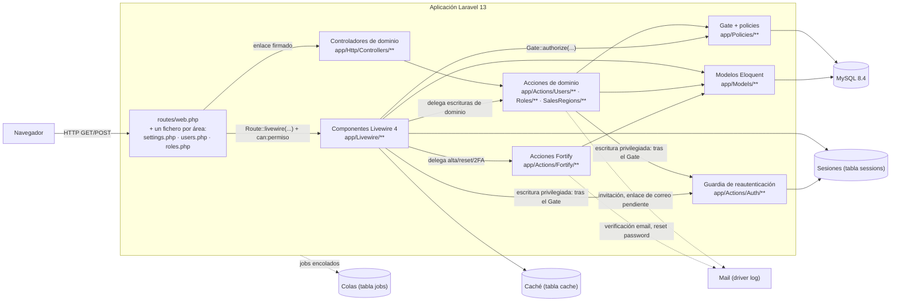
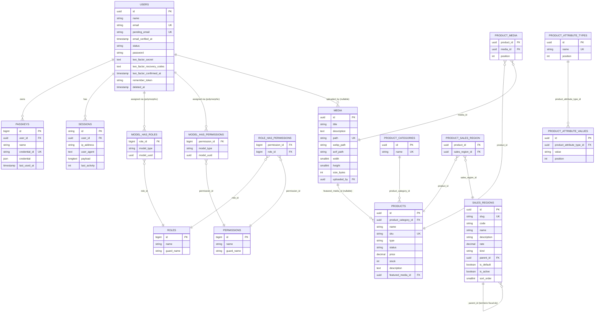

## Índice

0. [Ficha del proyecto](#0-ficha-del-proyecto)
1. [Descripción general del producto](#1-descripción-general-del-producto)
2. [Arquitectura del sistema](#2-arquitectura-del-sistema)
3. [Modelo de datos](#3-modelo-de-datos)
4. [Especificación de la API](#4-especificación-de-la-api)
5. [Historias de usuario](#5-historias-de-usuario)
6. [Tickets de trabajo](#6-tickets-de-trabajo)
7. [Pull requests](#7-pull-requests)

---

## 0. Ficha del proyecto

### **0.1. Tu nombre completo:**
Angel Rosso Pellisso

### **0.2. Nombre del proyecto:**
Arospe

### **0.3. Descripción breve del proyecto:**
Arospe es un dashboard de administración que centraliza la gestión de un ecommerce: usuarios, publicaciones del blog, productos y pedidos, todo desde un solo panel intuitivo

### **0.4. URL del proyecto:**

> Puede ser pública o privada, en cuyo caso deberás compartir los accesos de manera segura. Puedes enviarlos a [alvaro@lidr.co](mailto:alvaro@lidr.co) usando algún servicio como [onetimesecret](https://onetimesecret.com/).

### 0.5. URL o archivo comprimido del repositorio

> Puedes tenerlo alojado en público o en privado, en cuyo caso deberás compartir los accesos de manera segura. Puedes enviarlos a [alvaro@lidr.co](mailto:alvaro@lidr.co) usando algún servicio como [onetimesecret](https://onetimesecret.com/). También puedes compartir por correo un archivo zip con el contenido


---

## 1. Descripción general del producto

> Describe en detalle los siguientes aspectos del producto:

### **1.1. Objetivo:**

Arospe es un **backoffice de administración** para una operación de ecommerce: el panel interno desde el que un equipo gestiona los datos sobre los que corre una tienda (usuarios y sus permisos, un blog, el catálogo de productos, impuestos por región fiscal, transportistas y tarifas de envío, y clientes/pedidos), todo desde un único dashboard.

**Alcance deliberado — solo backoffice.** Arospe no incluye tienda pública, carrito ni checkout. Gestiona los datos que una tienda pública (futura y separada) consumiría; cuando el PRD menciona "el checkout" o "un cliente", lo hace para explicar *por qué* existe un dato administrativo, no porque esa pantalla forme parte de este proyecto.

**A quién va dirigido:** al equipo interno (administradores/editores) que necesita un panel único para dar de alta usuarios y roles, mantener el catálogo y sus reglas fiscales/logísticas, publicar contenido de blog y hacer seguimiento de clientes y pedidos, sin depender de acceso directo a la base de datos.

**Valor que aporta:** centraliza en una sola herramienta tareas que de otro modo estarían dispersas (gestión de usuarios, contenido, catálogo, fiscalidad, logística), con permisos granulares por módulo (vía roles dinámicos) en lugar de accesos todo-o-nada.

### **1.2. Características y funcionalidades principales:**

> Estado actual: en el código están implementadas la capa de autenticación (Fortify: registro, login, verificación de email, 2FA, passkeys), la **capa de backend/infraestructura** de Usuarios, Roles y Permisos (`RolePermissionSeeder` siembra 2 roles —`Super Admin` y `Administrator`— y un catálogo de 42 permisos, los middleware `role`/`permission`/`role_or_permission` están registrados en `bootstrap/app.php` —aunque, conviene precisarlo, **ninguna de las cinco rutas de módulo protegidas los consume**: usan el alias `can:` que trae el framework por defecto, por el motivo de Livewire explicado en [2.5](#25-seguridad)—, y el `Super Admin` dispone de un bypass de permisos vía `Gate::before`) y el **ciclo de vida de la cuenta**: la columna `users.status` (`activo`/`inactivo`/`suspendido`, vía el enum `App\Enums\UserStatus`), la invariante de **no autoactivación** (ninguna cuenta llega a `activo` por su propia acción sin probar su email: registro, invitación y confirmación de cambio de correo convergen en un único listener `ActivateVerifiedUser`) y el mecanismo de **cambio de email pendiente** (un cambio de dirección nunca reescribe `users.email` en el momento: se aparca en `users.pending_email` y solo se aplica al usar el enlace firmado de 60 minutos enviado a la nueva dirección).
>
> A eso se suma ya el **backend completo de la pantalla de Usuarios**: la ruta `/users` es la **primera protegida por un permiso del catálogo** (`can:users.view`), el componente Livewire `App\Livewire\Users\Index` lista los usuarios con su rol y estado y resuelve el alta, la edición y el borrado, y `App\Policies\UserPolicy` —la primera *policy* de la aplicación— decide quién puede hacer qué sobre cada cuenta (incluida la regla de que promover, degradar, borrar, suspender o cambiarle el email a un `Administrator` exige el permiso `roles.manage-administrators`). Un usuario creado por un administrador nace con contraseña aleatoria inutilizable y recibe una **invitación** para fijar la suya; al completarla queda verificado y activo por el mismo listener de siempre.
>
> Se suma también el **borrado lógico** de usuarios: borrar una cuenta ya no destruye la fila, la marca como borrada (`users.deleted_at`, vía el trait `SoftDeletes`), de modo que se conservan sus referencias históricas — passkeys, sesiones y asignaciones de rol siguen físicamente ahí. En la misma operación, y dentro de una única transacción, el correo se ofusca a un marcador determinista (`deleted+{id}@deleted.invalid`, sobre el TLD reservado `.invalid`), se limpian `email_verified_at` y `pending_email`, y se revocan los tokens de `password_reset_tokens` ligados a la dirección real anterior. Así la dirección queda **inmediatamente libre** para un alta nueva sin arrastrar enlaces vivos del titular anterior. La cuenta borrada desaparece de las consultas por defecto —listado, *route-model binding* y, sobre todo, **todas** las vías de inicio de sesión (contraseña, sesión en curso, cookie de "recuérdame", enlace de reseteo y passkey)—, y `UserPolicy::delete()` rechaza volver a borrar una cuenta ya borrada, para que el marcador no pueda reescribirse.
>
> La pantalla de Usuarios tiene ya su **interfaz real** (`resources/views/livewire/users.blade.php`), y no un marcador de posición: cabecera con el recuento en vivo (total y activos) y botón primario "Nuevo usuario"; tabla de usuarios con avatar de iniciales, nombre sobre correo, aviso discreto cuando hay un **cambio de correo pendiente**, rol (o un guion cuando la cuenta no tiene ninguno) y **badge de estado** con color propio (`Activo`/`Inactivo`/`Suspendido`); acciones de editar y borrar por fila, que aparecen **deshabilitadas —con su explicación al pasar el ratón— cuando la `UserPolicy` no permite esa acción sobre esa cuenta concreta**, en lugar de fallar al pulsarlas; modal de alta/edición con nombre, correo, selector de rol —que nunca ofrece `Super Admin`— y selector de estado, con los errores de validación en línea; modal de confirmación de borrado que nombra la cuenta afectada; y un estado vacío explícito. Todo con Flux UI + Tailwind v4, en modo claro y oscuro, con los textos en inglés vía `__()` a la espera del selector de idioma de la Epic 5. La entrada "Usuarios" del menú lateral nació **estática y visible para cualquier usuario autenticado** —una fuga cosmética, no de acceso, porque la ruta seguía exigiendo `can:users.view` y el componente reautorizaba en cada acción—; esa brecha la cierra la historia del menú lateral que se describe más abajo.
>
> Con la última historia cerrada, `users.status` deja de ser una etiqueta descriptiva y pasa a ser un **control de autenticación**: una cuenta `inactiva` o `suspendida` ya **no obtiene sesión por ninguna vía**, y se le dice únicamente que la cuenta no está activa, sin revelar nunca *cuál* de los dos estados aplica. Como no existe un único punto por el que pasen todas las formas de iniciar sesión, la comprobación vive en **tres** sitios complementarios: `Fortify::authenticateUsing()` (`App\Actions\Fortify\AuthenticateUser`) cubre correo+contraseña **y** las cuentas con 2FA —a las que rechaza *antes* de ofrecerles siquiera el paso del código, sin dejar ningún reto pendiente en sesión—; `Passkeys::authorizeLoginUsing()` cubre el acceso por passkey, que tiene su propio controlador y no pasa por la tubería de Fortify; y el listener `RejectNonActiveUserLogin`, registrado sobre los eventos `Login` **y** `Authenticated`, cubre la cookie de "recuérdame" y el caso de una cuenta suspendida *entre* el paso de contraseña y el del código 2FA. Devolver el estado a `activo` restaura el acceso en el **siguiente intento**, sin ningún paso administrativo adicional ni caché que limpiar. Dos límites deliberados: una sesión ya abierta **no** se corta, y un usuario recién registrado sigue entrando aunque nazca `inactivo`, porque registrarse no es iniciar sesión.
>
> Las dos últimas historias endurecen la **identidad de los dos niveles de privilegio**. El rol `Super Admin` deja de ser una fila ordinaria de `roles` y pasa a ser un **punto fijo del sistema**: categóricamente no se puede borrar, renombrar, repermisionar ni asignar desde ninguna pantalla, y no aparece en ningún listado de roles. Todo ello vive en `App\Models\Role` —el único modelo de rol que el código de aplicación puede usar, verificado por un test de arquitectura— en tres capas complementarias: guardias sobre los eventos del modelo, sobrescrituras de los métodos que tocan las tablas pivote (que no disparan ningún evento) y una `RolePolicy` para las pantallas que aún están por construir. En paralelo, la pregunta "¿es este el rol `Administrator`?" —que antes se respondía con la cadena literal `'Administrator'` escrita en **cinco** sitios distintos— pasa a tener **una sola** respuesta: `App\Models\Role::isAdministratorRole()`, que compara de forma exacta y sensible a mayúsculas contra el único literal, alojado en `App\Enums\RoleName`. A diferencia del nombre del `Super Admin`, el del `Administrator` **no es configurable, y es a propósito**: está fijado por decisión de producto, así que el enum *es* la fuente de verdad y añadir una clave de configuración crearía justo la vía de override que esa decisión descarta.
>
> Y, sobre todo, **la autorización de nivel `Administrator` deja de vivir en la pantalla y pasa a vivir en la acción**: `App\Actions\Users\CreateUser` y `UpdateUser` autorizan la operación completa por su cuenta, antes de cualquier escritura. Hasta ahora la regla era una propiedad de *un* llamador —el componente Livewire—, de modo que cualquier futuro endpoint de API, comando de consola o job en cola habría quedado **sin ninguna protección**. `UpdateUser`, además, deduce internamente el guardia de autoedición en lugar de aceptarlo como parámetro (un booleano que aporta quien llama no es un guardia: es un bypass de un solo argumento) y **rechaza de forma tajante** cualquier modificación de un usuario que ostente el rol `Super Admin`, con un `throw` directo y no a través del `Gate` —porque el bypass `Gate::before` del propio `Super Admin` decide *antes* que cualquier policy y anularía la regla justo para el actor al que debe atar—. Dos consecuencias asumidas y documentadas: un `Super Admin` que antes podía editar a otro `Super Admin` desde el panel ahora recibe un rechazo, y la ruta de **borrado** no recibió entonces el guardia equivalente —una historia posterior le añade el suyo, pero solo para la fila **propia**: borrar a *otro* titular de `Super Admin` sigue dependiendo únicamente de la policy, que el bypass atraviesa—. Detalle completo en [`arospe/docs/architecture/authorization.md`](arospe/docs/architecture/authorization.md).
>
> La historia inmediatamente anterior cierra el **lado rol** de ese mismo nivel de privilegio y añade una categoría de autorización que hasta ahora no existía: **quién puede *conceder* un permiso**, que no es lo mismo que quién puede ejercerlo. `RolePolicy` pasa a exigir el permiso `roles.manage-administrators` —y no el general `roles.manage`— para editar o borrar el rol `Administrator` sembrado, con el rechazo categórico del rol `Super Admin` corriendo siempre **primero** e incondicionalmente; y estrena una tercera habilidad, `grantAdministratorPermission`, que es cierta **solo** para el `Super Admin`: ostentar un permiso nunca da derecho a repartirlo. La aplicación real de esa meta-regla vive en `App\Actions\Roles\EnforceAdministratorPermissionGrant`, y su diseño responde a un hallazgo de auditoría que merece contarse: como `syncPermissions()` **reemplaza el conjunto entero** de permisos de un rol y el interruptor de ese permiso **nunca se le pinta** a quien no es `Super Admin`, un administrador amplio que editara cualquier otro campo de un rol que sí lo tenía enviaba un formulario que lo **omitía** —y eso habría revocado en silencio una concesión del `Super Admin`—. La acción compara por tanto el estado **anterior** (leído por ella misma del modelo, nunca aceptado del llamador) contra el enviado, y autoriza cada sentido por separado: solo una concesión *nueva* exige ser `Super Admin`, mientras que una omisión de algo ya concedido se **preserva** en lugar de interpretarse como una revocación —salvo que quien edita sí pueda revocarlo—. Esa elección entre *preservar* y *denegar* fue una **decisión de producto tomada por una persona** durante la auditoría, no una deducción técnica, y queda registrada como tal. Quedaba una limitación aceptada y explícita —la acción devuelve la lista a sincronizar en lugar de escribir ella misma— y la historia siguiente, la que construye el primer llamador real, la **ha resuelto decidiéndola**: se mantiene la separación (reabrir una clase ya cerrada y auditada en tres rondas para ahorrar una sentencia no compensaba), a cambio de dos reglas de implementación sobre quien llama —el valor de retorno se reasigna siempre, y la instancia de rol autorizada es exactamente la misma que después se sincroniza, nunca una segunda recuperada aparte—.
>
> **Las dos historias más recientes completan la pantalla de Roles y Permisos**, primero su backend y después su interfaz. Del backend llegan tres cosas que no existían. `App\Livewire\Roles\Index` da de alta, renombra y borra roles personalizados y sincroniza sus permisos por módulo; la ruta `/roles` es la **segunda** protegida por un permiso del catálogo (`can:roles.manage`), y `RolePolicy` —que llevaba dos historias existiendo sin que nada la invocara— estrena por fin su primer llamador real, con dos habilidades nuevas (`viewAny` y `create`, que no reciben rol porque todavía no hay fila que juzgar). Borrar un rol que aún tiene titulares está **bloqueado sin salida**: no hay camino de confirmar-y-seguir, el mensaje dice el número exacto de titulares, y los titulares borrados lógicamente **cuentan** —si no, la cascada de la clave ajena destruiría su asignación sin error alguno—.
>
> Su auditoría de seguridad encontró dos escaladas de privilegio reales, ambas verificadas en ejecución y ambas resueltas por **decisión humana**. La primera es la consecuencia directa de que ahora exista una pantalla capaz de escribir en `roles.name`: quien tuviera `roles.manage-administrators` podía **renombrar** el rol `Administrator` sembrado —lo que degradaba en silencio todas las comprobaciones de nivel `Administrator` de la aplicación, porque la identidad del nivel se resuelve comparando ese nombre— o **borrarlo** una vez sin titulares. El rol `Administrator` pasa por tanto a ser inmutable en nombre e imborrable, pero **deliberadamente menos protegido que el `Super Admin`**: su conjunto de permisos sigue siendo editable, que es justo lo que la historia anterior existe para permitir. La segunda: `roles.manage` autoriza *gestionar roles*, y nada impedía que su titular reescribiera cualquier rol —incluido el suyo— con el catálogo completo de 42 permisos. Lo cierra `App\Actions\Roles\EnforceGrantorPermissionScope`, que rechaza conceder un permiso que quien edita no ostenta. Una asimetría se acepta a conciencia: la regla limita *conceder*, no *revocar*, porque quitar permisos es consolidación y no ganancia de privilegio, y un `Super Admin` siempre puede repararlo; lo que sí se protege aparte es que nadie se cierre la puerta a sí mismo quitando `roles.manage` de un rol que ostenta.
>
> **La interfaz de esa misma pantalla es la historia que la cierra**, y `GET /roles` ya se pinta de principio a fin: un listado con recuento en vivo y estado vacío explícito, un modal de alta/edición con el nombre del rol y sus permisos **agrupados por módulo**, y un modal de borrado que, mientras el rol tenga titulares, no llega siquiera a pintar el botón destructivo. Tres decisiones de esa vista merecen contarse, porque las tres son de seguridad y no de maquetación. **La agrupación por módulo se deriva, nunca se escribe a mano**: la vista agrupa el catálogo por el segmento anterior al primer punto del nombre de cada permiso, así que un módulo nuevo sembrado mañana aparece sin tocar la plantilla, y los dos permisos no CRUD caen solos en un pseudo-módulo `roles` que ninguna lista escrita a mano habría contenido. **El catálogo se pinta entero**, con **una única** excepción deliberada: el permiso `roles.manage-administrators` se retira del DOM —no se deshabilita— para quien no es `Super Admin`, y eso es seguro *solo* porque es justamente el permiso cuya acción guardiana preserva una omisión; retirar cualquier otro convertiría esa omisión en una revocación silenciosa. La retirada se aplica además **una sola vez, antes** de agrupar, y no como una condición por elemento dentro del bucle: así ningún módulo puede quedar pintado con su título y el cuerpo vacío, que sería la misma filtración por vía estructural. Y **cada acción de fila se pinta deshabilitada cuando el actor no puede ejercerla**, consultando por fila la misma *policy* que autoriza el clic —la misma ayuda de interfaz que ya usa la pantalla de Usuarios, con su misma advertencia: no es una capa de seguridad—. Queda una desviación conocida y aceptada, en el mismo sentido que la de Usuarios (habilitado y luego rechazado, nunca al revés): un `Super Admin` ve habilitado el borrado de la fila del rol `Administrator`, porque el bypass del `Gate` solo cede el paso cuando el objetivo es el rol `Super Admin`; al pulsar, el guardia del modelo lo rechaza igualmente.
>
> **El menú lateral deja de ofrecer módulos que el usuario no puede abrir.** Hasta ahora las entradas "Usuarios" y "Roles y permisos" se pintaban para **cualquier** usuario autenticado: una fuga cosmética, porque las rutas ya denegaban por su cuenta, pero también un menú que prometía pantallas que respondían 403. Ahora cada entrada se pinta solo si el `Gate` concede su permiso, y el mecanismo importa más que las dos entradas de hoy, porque es el que heredarán todos los módulos de las épicas siguientes: la navegación se declara en un **registro** (`config/modules.php`) que un componente Blade único lee, filtra y agrupa, de modo que dar de alta un módulo nuevo es **añadir una entrada** —nunca tocar la plantilla ni escribir un `@can` más—. Cuatro decisiones de ese diseño tienen consecuencias reales. El permiso de cada entrada debe ser **exactamente** el que exige el `can:` de su propia ruta, y un test lo comprueba de forma mecánica contra el middleware real: así el menú no puede anunciar un enlace que la ruta después rechazaría, ni quedarse desincronizado cuando alguien cambie uno de los dos lados. La visibilidad se resuelve por el `Gate` (`Gate::any()`) y **nunca** con `hasAnyPermission()`, y esto no es una preferencia de estilo sino una bifurcación de corrección: el `Super Admin` no ostenta **ninguna** fila de permisos —pasa por el bypass—, así que un menú construido sobre el trait le habría mostrado un menú **vacío**, justo lo contrario de lo que se pide. Se **filtra antes de agrupar**, de manera que un grupo cuyas entradas desaparecen todas no llega siquiera a existir: su encabezado no se pinta vacío, es que no se pinta —ahí está el grupo "Ajustes", cuya única entrada es hoy "Roles y permisos"—. Y "sin permiso" se expresa como lista de permisos **vacía**, que es el punto delicado: `empty()` no distingue "declarado sin puerta" de "se olvidó la clave", así que un test mantiene una **lista blanca explícita** de las entradas que pueden ir sin permiso —hoy solo "Panel de control"—, y ninguna entrada nueva puede colarse en ella por omisión. Conviene subrayar el límite: ocultar un enlace es **presentación**, no control de acceso; quien escriba la URL a mano sigue topándose con el `can:` de la ruta, que es la historia anterior y la que de verdad deniega.
>
> **La penúltima historia cerrada no añade pantalla ni ruta: endurece la que ya había.** Es el seguimiento consolidado de los diez hallazgos no bloqueantes que la auditoría de la pantalla de Usuarios había dejado aparcados, y cambia cinco cosas que conviene contar. **Abrir un formulario también se autoriza.** Los tres métodos que abren los modales (alta, edición y confirmación de borrado) no comprobaban **nada**: bastaba con poder ver el listado para pedirle al servidor los datos de cualquier otra cuenta, incluido su estado y su cambio de correo pendiente. Ahora cada uno exige su permiso, y el de edición exige el **más fuerte** de todos —el mismo que protege el estado y el correo—, porque el modal divulga esos dos campos *antes* de que nadie haya decidido cambiar nada; la única excepción es la fila de uno mismo, que es una comprobación de **identidad** y no de rol —los datos propios ya se ven en el perfil—. Consecuencia visible y deliberada: quien tenga `users.edit` pero no `roles.manage-administrators` ya no puede ni siquiera abrir la ficha de un `Administrator`, y por tanto tampoco renombrarlo, cosa que antes sí podía. **Nadie puede borrarse a sí mismo desde esta pantalla**, ni siquiera un `Super Admin`, y el guardia vive fuera del `Gate` precisamente porque el bypass del `Super Admin` anularía cualquier regla que pasara por él. **Ningún administrador puede ya consumir el cupo de otro:** el límite de cambios de correo se calculaba por usuario **destino**, lo que era correcto mientras solo lo llamaba la pantalla de perfil y dejó de serlo en cuanto un administrador pudo pedirlo sobre una cuenta ajena; ahora son dos límites —uno por pareja (destino, actor) y otro agregado por destino, este último **exento** cuando quien pide es el propio interesado, para que la actividad administrativa no le cierre la puerta a cambiar su propia dirección—. **El token de invitación deja de pasar por la cola:** la notificación se enviaba en diferido con el token en claro serializado en la tabla `jobs`; ahora se envía de forma síncrona. Y **cada alta, edición y borrado deja una línea de auditoría estructurada** (actor, destino, rol y estado antes y después), replicando la forma que ya usaba la pantalla de Roles: esta aplicación no tiene tabla de auditoría, y una línea de log es el rastro mínimo. Queda registrado como decisión, no como olvido, lo que **no** entra: registrar también los intentos *rechazados* —el mismo hueco existe en la pantalla de Roles, y taparlo solo aquí lo dejaría abierto allí—.
>
> **La última historia cerrada añade una capa de autorización que hasta ahora no existía: la *reautenticación por escalado* (step-up).** Las dos capas que ya había responden preguntas sobre la **cuenta** —¿está autenticada y ostenta el permiso?, ¿puede hacerle esto a *este* registro?—, y ninguna de las dos responde la pregunta que importa cuando una sesión ha sido secuestrada, prestada o simplemente dejada abierta en un portátil sin bloquear: **¿sigue siendo el titular quien está al teclado?** A partir de ahora cinco operaciones de la pantalla de Usuarios exigen además una contraseña **confirmada recientemente**: cambiar el rol, el estado o el correo de **otra** persona, borrar una cuenta y crear una cuenta de nivel `Administrator`. Deliberadamente **no** la exigen editar solo el nombre, ninguna edición de la propia fila (incluido cambiarse uno mismo el correo) ni crear un usuario con rol ordinario — bloquear de más no es "más seguro": es enseñar al administrador a pulsar sin leer, que es exactamente cómo se degrada un control de este tipo.
>
> Tres decisiones de diseño explican por qué está donde está. **Se reutiliza el mecanismo que la aplicación ya tenía, sin añadir un segundo**: se lee la misma clave de sesión y el mismo tiempo de caducidad (`auth.password_timeout`, 3 horas) que ya protegía la pantalla de 2FA y passkeys, y la reconfirmación ocurre en la pantalla que Fortify ya trae — **no hay ningún campo de contraseña dentro de los modales de Usuarios**, porque un segundo formulario sería un segundo flujo con su propia limitación de intentos y sus propios modos de fallo. **La comprobación vive dentro del método, no en el middleware de la ruta**, y no por gusto: el middleware `password.confirm` no figura en la lista blanca de Livewire, así que ponerlo en la ruta habría protegido la carga inicial de `/users` y habría dejado sin guardia **todas** las acciones —que es donde se guarda y se borra— además de bloquear la edición de solo el nombre que la regla exime. Y **no es una habilidad de la *policy***, por tres motivos independientes: el bypass del `Super Admin` la anularía justo para el actor más privilegiado de la aplicación (por eso el rechazo es un `throw` directo, como las demás reglas que deben atarle); la frescura de la contraseña es una propiedad de la **sesión** y no de la pareja actor-objetivo; y un 403 sería indistinguible de "no tienes permiso", cuando aquí el actor **sí** lo tiene — el rechazo es un **423 Locked**, que es el mismo código que devuelve el propio middleware de Laravel para esta condición.
>
> El orden es parte del guardia y no un detalle de implementación: la comprobación corre **después** de todas las de permiso y antes de la primera escritura, de modo que a quien no puede realizar la acción se le rechaza por permiso y nunca se le pide la contraseña — pedírsela sería a la vez una superficie de credenciales innecesaria y una filtración (probaría que el registro objetivo existe y que todas las comprobaciones anteriores pasaron). En la interfaz, los modales de edición, borrado y alta **avisan antes** de que el administrador rellene nada, leyendo el mismo predicado que usa el guardia para que el aviso no pueda desincronizarse de la regla; el aviso de alta solo aparece cuando el rol seleccionado es de nivel `Administrator`. La auditoría de esta historia añadió tres cosas por **decisión humana**, no por deducción: gatear también el **alta** de administradores (una sesión secuestrada que no podía *promover* sí podía **crear** una cuenta de administrador nueva con la invitación enviada a una dirección elegida por el atacante — una escalada *duradera*, que sobrevive incluso a que la víctima cambie su contraseña); gatear también el cambio de correo **de otra persona** (la propia *policy* ya calificaba reescribir un correo como equivalente a una toma de control de la cuenta, y el enlace de verificación se envía **solo** a la dirección nueva: el titular actual no recibe ninguna señal); y **limitar los intentos** de la pantalla de reconfirmación a 5 por minuto, porque Fortify no trae ninguno para esa ruta y esta historia la convierte en la única barrera delante de las cinco operaciones. Cada rechazo deja además una línea de registro estructurada: es la señal más fuerte disponible de una sesión secuestrada. Quedan dos puertas abiertas, anotadas como tales y no resueltas aquí: la pantalla de 2FA/passkeys sigue confiando solo en el middleware de ruta, y `settings/profile` permite cambiarse el correo propio **sin ninguna** reconfirmación.
>
> **La Epic 2 ya ha empezado, y por su cimiento: las Regiones de venta.** Primero llegó el **catálogo** —la tabla `sales_regions`, su modelo, su enum y su *seeder*—, la primera entidad de dominio del proyecto que nace ya con clave primaria UUID v7: unas 254 filas (los países ISO 3166-1, más los cinco territorios fiscales de España colgando de la fila "España" mediante un `parent_id` que forma un árbol de **exactamente un nivel**), de las cuales solo seis quedan activas y **una sola** marcada como tarifa por defecto. La propiedad que gobierna esa tabla es que sus columnas se parten en dos conjuntos de comportamiento **opuesto** al volver a sembrar: las del *seeder* (`slug`, `name`, `parent_id`, `kind`, `sort_order`) se refrescan siempre —así una corrección de nombre canónico llega a una instalación ya desplegada—, mientras que las que configura el administrador (`code`, `description`, `rate`, `is_active`, `is_default`) se escriben **solo al insertar** y no se tocan jamás al actualizar; por eso el `upsert()` reflejo de "un *seeder* idempotente" es justo la forma equivocada aquí. El tipo impositivo es un `DECIMAL(6,3)` y nunca un `float` —alimenta aritmética de pedidos, y el binario no representa `21.00` de forma exacta—, con `NULL` ("sin configurar") y `0.000` (un 0 % legítimo) como valores deliberadamente distintos.
>
> **La historia siguiente hace ese catálogo configurable**, y es el **backend** de la pantalla: la ruta `/taxes/sales-regions` (`sales-regions.index`) es la **tercera** protegida por un permiso del catálogo (`can:sales-regions.view`), `App\Livewire\SalesRegions\Index` configura el tipo, la descripción y el código de una entrada, la activa o desactiva y mueve la marca de "por defecto", y `App\Policies\SalesRegionPolicy` es la **tercera** *policy*. Casi nada de esto estrena patrón, y ese es el punto: el fichero de ruta es el de Roles con tres cadenas cambiadas, las tres acciones de dominio (`UpdateSalesRegion`, `SetDefaultSalesRegion`, `SetSalesRegionActive`) se autorizan a sí mismas desde su primera sentencia —la regla que en la pantalla de Usuarios hubo que **corregir** en una auditoría, aquí se aplicó desde el diseño— y cada rechazo deja la misma línea de registro estructurada que las otras dos pantallas. Lo que **sí** es nuevo es una categoría de guardia que la aplicación no tenía: una **invariante de dominio**. No responde "¿puede este actor?", sino "¿seguirían siendo válidos los datos?" — el catálogo debe conservar **exactamente una** entrada por defecto, y esa entrada debe estar **activa**. De ahí salen dos rechazos que no son 403 sino errores de validación en el propio formulario: marcar como predeterminada una entrada inactiva, y desactivar la predeterminada actual sin nombrar a la vez una sustituta activa —esto último es **una sola operación atómica**, no dos guardados seguidos: entre dos guardados el catálogo se quedaría sin ninguna por defecto, y una caída en esa ventana lo dejaría así de forma permanente—. Que sea una invariante y no una regla de permisos tiene una consecuencia concreta: **no puede vivir en una *policy***, porque un `Super Admin` es exactamente igual de capaz que cualquiera de dejar el catálogo sin predeterminada, y el bypass del `Gate` anularía la regla justo para él.
>
> Esa invariante costó **dos rondas de auditoría** y dejó una regla que merece contarse, porque generaliza mucho más allá de esta pantalla: **una instancia de modelo que llega como parámetro es entrada no confiable por los dos lados**. Por el lado de la lectura, un guardia colocado correctamente *dentro* de la transacción seguía sin poder sostenerse, porque el valor que comprobaba se había leído **antes** de que esa transacción existiera —bastaban dos administradores actuando en el mismo segundo, sin ningún dato falseado, para dejar inactiva la única entrada por defecto—. Por el lado de la escritura, `save()` persiste **todo el conjunto de atributos sucios** de la instancia, no solo las claves que la acción nombra en su `fill()`: quien llamara podía ensuciar `is_default` antes de invocar la acción y llegar a dos predeterminadas sin que la clase encargada de impedirlo llegase siquiera a ejecutarse. Un mismo remedio cierra ambos lados: cada acción vuelve a leer bajo bloqueo, dentro de su propia transacción, las filas que le pertenecen, y lee y escribe **solo** a través de esa copia fresca. La primera versión de ese arreglo introdujo a su vez un interbloqueo real —confirmado con dos sesiones MySQL en vivo— al pedir dos conjuntos de bloqueos en consultas separadas, y la segunda ronda lo cerró unificándolos en una única consulta ordenada por clave primaria. Detalle completo en [`arospe/docs/security/model-instance-trust.md`](arospe/docs/security/model-instance-trust.md).
>
> **La última historia cerrada pinta esa pantalla**, y con ella `/taxes/sales-regions` deja de ser un marcador de posición: la interfaz y la entrada del menú lateral que la historia anterior dejaba pendientes ya existen. La lista se organiza en **dos tablas**, porque el catálogo tiene 254 filas de las que solo seis interesan: arriba las entradas activas, con los cinco territorios fiscales de España **anidados y plegables** bajo la fila "España" (puro Alpine, sin ida y vuelta al servidor: las filas hijas ya están en la página); y debajo, una sección **"Show all countries" cerrada al pintar**, con un filtro de texto por nombre o código, donde viven los ~248 países sembrados e inactivos. Activar uno desde ahí lo mueve a la tabla de arriba en el siguiente pintado —el movimiento *es* la confirmación de que el clic surtió efecto— sin que la sección se cierre ni el filtro pierda lo tecleado. El modal de edición expone exactamente `code`, `description` y `rate`; el nombre, el `slug` y el tipo aparecen como **contexto de solo lectura, sin control de formulario alguno**, que es la forma estructural —y no una validación— de cumplir que el catálogo no permite inventar países ni renombrarlos.
>
> Cinco detalles de esa pantalla merecen contarse porque ninguno es maquetación. El campo del tipo impositivo es `type="text" inputmode="decimal"` y **nunca** `type="number"`: un campo numérico nativo hace su propio análisis en el cliente y la **coma decimal** española jamás llegaría al servidor para que el componente la normalice; solo un test de navegador real puede detectar esa regresión, porque escribir la propiedad desde un test de componente se salta el campo por completo. El tipo se pinta con manipulación de cadenas y **sin ningún casteo a `float`**, para que "sin configurar" (un guion) y un 0 % legítimo (`0%`) sigan siendo distinguibles. La invariante de la entrada por defecto se refleja en la interfaz tal cual: el interruptor de la fila **predeterminada** se pinta deshabilitado con un aviso que **encamina** al administrador a su formulario de edición —donde el desplegable de sustituta ya está en pantalla— en vez de limitarse a negarle el paso, y el rechazo que puede llegar sin ningún campo delante (si otra persona movió la marca entre el pintado y el clic) tiene su propio hueco de mensaje encima de la tabla, visible **solo** mientras el modal está cerrado para que nunca se pinte dos veces. La auditoría encontró además un fallo real de severidad media, reproducido en ejecución y no teórico: desactivar la fila "España" hacía **desaparecer de las dos tablas** todo su grupo de territorios fiscales —incluido el que ostenta la marca de por defecto y todos los tipos ya configurados—, porque la partición activa/inactiva miraba solo la bandera de la propia fila; ahora una fila con hijos permanece en la tabla agrupada con independencia de su propio estado. Y **la entrada del menú lateral costó exactamente lo que el registro de módulos prometía**: dos literales de array en `config/modules.php` (un grupo "Impuestos" nuevo y la entrada de Regiones de venta) más una clave de traducción por idioma, **sin tocar el componente que lo lee** — la primera prueba real de que dar de alta un módulo es añadir *datos*, no editar plantilla.
>
> Queda anotada como trabajo futuro la red de seguridad a nivel de base de datos para la invariante (una columna generada `STORED` más un índice único, que en MySQL 8.4 la impone de verdad porque los índices únicos ignoran los `NULL`): la transacción con bloqueo de fila es correcta por sí sola, y su orden de escritura —limpiar la antigua antes de marcar la nueva— ya es exactamente el que esa restricción exigiría, así que la historia que la añada añadirá una restricción y no una reescritura.
>
> **La Epic 2 sigue avanzando por el catálogo de productos**, con el backend ya completo aunque todavía sin pantalla propia hasta la última historia cerrada. Primero llegó `product_categories`, una tabla de catálogo mínima (un único campo `name`, único e insensible a mayúsculas y acentos gracias al mismo normalizador compartido que ya usa el buscador multiselección) sin ninguna relación —ni entrante ni saliente— en el momento de nacer; después `products` le dio una, con una clave foránea obligatoria hacia la categoría y otra opcional hacia la galería de medios compartida, más una tabla pivote `product_media` para la galería propia de cada producto (posición explícita, nunca deducida). Ambas tablas nacieron con sus tres acciones de dominio (`Create`/`Rename`/`Delete` para categorías; `Create`/`Update`/`Delete` para productos) y sus respectivas *policies* —`ProductCategoryPolicy` y `ProductPolicy`, la quinta y sexta de la aplicación—, pero con una asimetría deliberada al principio: las acciones de productos se autorizaban a sí mismas desde el primer día, mientras que las de categorías se dejaron **sin ninguna autorización propia**, a la espera de la pantalla que las invocara. Dos historias adicionales cerraron sendos huecos: una sanitiza en el servidor el HTML de la descripción de un producto (`App\Actions\Products\SanitizeProductDescription`, contra una lista blanca de etiquetas fija en `config/html-sanitizer.php`, aplicada *antes* de validar) para que el editor de texto enriquecido compartido —que renderiza su contenido sin escapar, por diseño— nunca reciba una cadena sin desinfectar; y otra bloquea de forma dura el borrado de una categoría todavía referenciada por algún producto, con un mensaje que nombra el número exacto («esta categoría la usan 12 productos»), idéntico para cualquier nivel de privilegio incluido el `Super Admin`, porque es una invariante de datos y no una regla de permisos.
>
> **La última historia cerrada pinta esa pantalla de categorías**, y con ella `ProductCategoryPolicy` deja de tener cero llamadores: `App\Livewire\ProductCategories\Index` es su primer y único invocador, para las **cuatro** habilidades a la vez. La ruta `/product-categories` (`can:products.view`) es la **cuarta** protegida por un permiso del catálogo, y las tres acciones de categorías se reescribieron para autorizarse a sí mismas como su propia primera sentencia —descargando el aplazamiento que había dejado la historia del backend—, con el componente reautorizando además en los cinco métodos que modifican o divulgan algo, como capa de refuerzo. En `DeleteProductCategory` el orden importa: el guardia de permiso corre **antes** que el recuento de productos en uso, para que un actor sin `products.delete` nunca llegue a conocer esa cifra por la vía de un mensaje de negocio. La pantalla en sí es deliberadamente pequeña —lista, modal de alta/edición con un único campo `name`, y modal de borrado— y dos decisiones de producto merecen contarse: el recuento de productos por categoría se muestra siempre, pero **nunca** se usa para deshabilitar el botón de borrar (mezclar esa señal con la de permisos confundiría una invariante de datos con una autorización), y la pantalla no ofrece ningún camino de "eliminar de todos modos": la propia acción de borrado no acepta ningún parámetro para forzarlo, así que la garantía es estructural y no solo de interfaz. Queda como hallazgo abierto, y así se ha dejado constancia en la documentación: la propia historia que blindó el borrado bloqueado pidió explícitamente que el rechazo por invariante quedase también registrado en el log de auditoría, y esa parte concreta no llegó a implementarse — el simple rechazo de permiso sí queda registrado, el bloqueo por "categoría en uso" no.
>
> **La historia siguiente añade tejido, no pantalla: un producto puede asignarse a las regiones de venta que le apliquen, y una nueva pieza responde a «¿qué tipo impositivo se aplica a este producto en este destino?».** La tabla pivote `product_sales_region` es la más escueta del esquema hasta ahora —ni siquiera lleva la posición que sí tiene la galería de un producto—: clave primaria compuesta sobre las dos claves foráneas, sin ninguna columna que no sea esa pareja, y **deliberadamente sin ningún tipo impositivo por asignación**: la tarifa vive solo en `sales_regions.rate`, nunca en dos sitios a la vez. `App\Actions\Products\ResolveProductTaxRate` resuelve la pregunta en **exactamente dos niveles, sin ningún tercero** (las agrupaciones supranacionales que el catálogo llegó a plantear se retiraron del todo antes de esta historia): si el destino coincide con una entrada que el producto tiene asignada, gana esa entrada; si no, gana la entrada marcada por defecto. Un tipo del `0%` se respeta como un tipo real, y una entrada sin tipo configurado —ya sea la asignada o la predeterminada— responde «sin tipo» y se nombra a sí misma, en vez de heredar en silencio el número de la otra.
>
> Dos decisiones merecen contarse porque no son obvias. **Ninguna de las dos acciones nuevas se autoriza a sí misma**, y no es un descuido: `SyncProductSalesRegions` —el único escritor de la tabla pivote— es un colaborador que solo se invocará desde dentro de una transacción ya autorizada por la pantalla que lo componga (la historia siguiente, todavía sin construir), la **cuarta** instancia de ese patrón en la aplicación; el resolver, por su parte, lee datos que ya son visibles para cualquiera con el permiso de ver productos o regiones, y podrá invocarse algún día desde un pedido sin ningún usuario detrás. **Un identificador que el formulario no puede confirmar rechaza el envío entero, nunca una parte de él**: si entre las regiones enviadas hay una que ya no existe, la asignación completa se rechaza con un mensaje que la nombra, en vez de guardar en silencio las que sí eran válidas — perder una asignación fiscal sin ningún aviso es exactamente el tipo de fallo que esta regla existe para impedir. Y una región ya asignada que después se desactiva **conserva su asignación**: solo una región recién elegida debe estar activa y no ser una cabecera como "España"; una ya asignada solo tiene que seguir existiendo en el catálogo, para que desactivarla nunca deje un producto sin poder guardarse por un campo que nadie tocó. Esta historia es **backend puro**: sin ruta, sin componente Livewire, sin pantalla — la pantalla y el selector de regiones son la historia siguiente.
>
> **La pantalla de productos y la taxonomía de variantes llegaron después, y el catálogo de productos ya tiene interfaz propia.** La ruta `/products` (listado, con paginación real y las mismas tres columnas explícitas que cualquier otra lista de este backoffice) y `/products/create` + `/products/{producto}/edit` (un único componente `App\Livewire\Products\Editor`, el primero de la aplicación que responde a dos nombres de ruta a la vez) dan por fin llamador real a `ProductPolicy` en sus cuatro habilidades y reutilizan de golpe los tres componentes compartidos que el catálogo llevaba meses esperando: la galería de medios modal (dos instancias, una para la imagen destacada y otra para la galería secundaria), el editor de texto enriquecido para la descripción, y el selector multiselección con búsqueda para las regiones de venta. Justo después llegó la taxonomía de atributos de variante — dos tablas nuevas, `product_attribute_types` y `product_attribute_values`, definidas por el administrador (a diferencia del catálogo *sembrado* de regiones fiscales): "Talla" → 38, 39, 40. La edición del listado de valores de un tipo es un **diff**, nunca un borrar-y-recrear, precisamente para que el id de un valor sobreviva a un guardado que solo cambia el nombre del tipo — la garantía de la que pasaría a depender directamente la siguiente pieza.
>
> **Esa siguiente pieza es la que cierra el subdominio: la combinación de variante en sí, con su propio SKU derivado y su propio candado contra duplicados.** Dos tablas nuevas, `product_variants` y `product_variant_values` — la segunda con un nombre deliberadamente más corto que cualquier alternativa "más descriptiva", porque las dos alternativas probadas generan un nombre de restricción de clave foránea que supera el límite de 64 caracteres de MySQL y la migración falla en seco. `product_variants.sku` **no es un campo que el administrador escriba**: se deriva de la SKU del producto padre más un segmento por cada valor de atributo de la combinación, en un orden fijo, y esa fórmula tiene que volver a aplicarse — con las mismas dos comprobaciones que el creador de la variante ya hace (que ningún segmento quede vacío, que el resultado no supere el límite de longitud) — cada vez que cambia algo de lo que depende: la propia SKU del producto, o el nombre de un valor de atributo que alguna variante use. Ambos casos son retoques a acciones de historias anteriores, no a esta, y ambos comparten ahora un único punto de entrada para no poder saltarse ninguna de las dos comprobaciones. Un segundo candado, `combination_hash`, impide que dos variantes del mismo producto compartan la misma combinación de atributos con independencia del orden en que se enviaron — calculado siempre a partir de los valores **ya guardados en base de datos**, nunca de lo que llegó en el formulario, porque la base de datos compara sin distinguir mayúsculas de forma que un valor escrito de dos formas distintas produciría dos combinaciones que en realidad son la misma.
>
> **No existe ninguna *policy* de variante.** Las tres acciones de dominio (crear, actualizar, borrar una variante) se autorizan a sí mismas contra el **producto padre**, reutilizando la misma `ProductPolicy` que ya gobierna el resto del catálogo — una variante es un sub-recurso del producto, y no hay ninguna distinción entre dos variantes del mismo producto que justifique una regla propia. Merece contarse porque es una marcha atrás real sobre el plan inicial: la propuesta de la mesa de planificación había descartado explícitamente que las acciones se autorizaran a sí mismas, citando como precedente la forma que tenían las acciones de usuarios — un precedente que ya era falso para entonces, porque una historia muy anterior había movido esa autorización precisamente al revés (de la pantalla a la acción) para que un llamador que no fuera el propio panel también quedara protegido. La revisión posterior detectó la cita obsoleta y corrigió el plan antes de escribir el código.
>
> **Y una auditoría de seguridad encontró un fallo de una clase completamente distinta, en el propio mecanismo de reintento de transacciones.** Una de las acciones nuevas se marcó para reintentarse automáticamente ante un bloqueo de base de datos, y esa misma marca se copió por analogía a una acción de una historia anterior que actualiza un producto — pero esa segunda acción muta un objeto que se creó **fuera** de la transacción, así que un reintento tras un bloqueo real volvía a ejecutar el cierre sin repetir la escritura: el objeto en memoria ya "recordaba" el cambio del primer intento, la sentencia SQL no volvía a emitirse, y la acción devolvía éxito sin haber escrito nada. Se cerró quitando el reintento de esa transacción en concreto, no reescribiéndola, y la regla general quedó documentada para toda futura marca de reintento de este tipo: solo es segura si cada objeto que la transacción modifica se crea o se vuelve a leer **dentro** de ella, en cada intento.
>
> Lo que **todavía no existe**: un flujo de **restauración** de cuentas borradas (`restore()` existe en el modelo, pero ninguna pantalla lo invoca todavía y una cuenta restaurada conservaría el correo ofuscado), el cierre inmediato de las sesiones ya abiertas de un usuario al que se desactiva o suspende, el bloqueo de borrado de un tipo o valor de atributo todavía en uso por alguna variante (la tabla ya lo impide a nivel de base de datos con `restrictOnDelete()`; falta el mensaje de aplicación), y la propia pantalla de edición de variantes — de momento esta pieza es backend puro, sin ruta ni componente Livewire. El resto de funcionalidades descritas a continuación son el alcance funcional definido en el PRD (`docs/PRD/PRD.md`) y constituyen la hoja de ruta del backoffice.

- **Usuarios, Roles y Permisos** — CRUD completo de roles personalizados con permisos granulares por módulo (vía `spatie/laravel-permission`, ya instalado), sustituyendo el desplegable de rol fijo del prototipo. Es la base de la que dependen el resto de épicas.
- **Catálogo de Productos** — productos con categorías propias (CRUD completo, taxonomía distinta a la del blog) y **variantes configurables**: tipos de atributo (Talla, Color, Material…) definidos por el administrador, cada combinación con su propio SKU, precio, stock e imagen destacada opcional.
- **Regiones de venta e Impuestos** — un catálogo de regiones fiscales (país, y para España sus territorios especiales: Península, Baleares, Canarias, Ceuta, Melilla) donde cada entrada *es* a la vez la regla fiscal (tipo, descripción, código), con exactamente una región marcada como tarifa por defecto.
- **Envíos** — transportistas con activar/desactivar y reglas de tarifa por transportista según zona de envío + rango de peso + precio + plazo estimado (configuración manual, sin integración con API de transportista real).
- **Galería de medios compartida** — cada imagen subida se conserva en su formato original (`.png`/`.jpg`/`.jpeg`) y además genera variantes `.webp` y `.avif`, en almacenamiento local (`storage/app/public`).
- **Clientes y Pedidos** — entidades gestionadas desde el backoffice, independientes del sistema de Usuarios/Roles (los clientes no acceden al dashboard).
- **Blog** — categorías (CRUD) y etiquetas (CRUD + alta rápida desde el propio editor del post); un post tiene una categoría y varias etiquetas.
- **Internacionalización** — dos capas independientes: selector de idioma de la interfaz de administración (ES/EN) y "idiomas de tienda" gestionables por el admin, que aparecen como pestañas para traducir campos de contenido (producto, post, slugs/SEO, nombres de categoría/etiqueta).
- **Búsqueda global y notificaciones** — búsqueda funcional sobre usuarios, productos y posts; notificaciones para stock bajo/agotado, nuevo cliente, nuevo pedido y publicación de posts.

### **1.3. Diseño y experiencia de usuario:**

> Proporciona imágenes y/o videotutorial mostrando la experiencia del usuario desde que aterriza en la aplicación, pasando por todas las funcionalidades principales.

### **1.4. Instrucciones de instalación:**

**Prerrequisitos**

- PHP 8.3+ (solo si se ejecuta tooling fuera de Docker; Sail ya provee PHP)
- Composer
- Docker (Docker Desktop) — el entorno local corre sobre Laravel Sail
- Windows: **WSL2 obligatorio**; todos los comandos se ejecutan desde la shell de WSL2 (Ubuntu), no desde PowerShell/CMD. Docker Desktop debe estar iniciado y con la integración WSL2 habilitada para la distro usada.

**1. Clonar el repositorio**

```bash
git clone <repository-url>
cd arospe
```

**2. Crear el fichero `.env`**

Hay un `.env.example` en el repo que muestra las claves existentes, pero los valores reales (credenciales de base de datos, ajustes de app, etc.) deben solicitarse de forma privada — no inventar ni reutilizar valores de otro entorno.

**3. Instalar dependencias PHP**

```bash
composer install
```

**4. Levantar los servicios con Sail**

```bash
./vendor/bin/sail up -d
```

Esto arranca, según `compose.yaml`:

| Servicio | Imagen | Propósito |
| --- | --- | --- |
| `laravel.test` | `sail-8.5/app` (build de `docker/8.5`) | Contenedor de la app, PHP 8.5. Sirve la app (puerto `80`) y el servidor de desarrollo de Vite (puerto `5173`). |
| `mysql` | `mysql:8.4` | Base de datos principal (puerto `3306`). También aprovisiona una base de datos de test vía `docker/mysql/create-testing-database.sh`. |
| `redis` | `redis:alpine` | Redis (puerto `6379`) para caché, sesiones y colas. |

**5. Frontend**

```bash
./vendor/bin/sail npm install
./vendor/bin/sail npm run dev      # servidor Vite con hot reload
./vendor/bin/sail npm run build    # build de producción
```

**6. Base de datos: migraciones y semillas**

```bash
./vendor/bin/sail artisan migrate
./vendor/bin/sail artisan migrate --seed
./vendor/bin/sail artisan db:seed
```

Para reconstruir la base de datos desde cero:

```bash
./vendor/bin/sail artisan migrate:fresh --seed
```

**El seed no es opcional.** `database/seeders/RolePermissionSeeder.php` es la **única** fuente de los roles y del catálogo de permisos contra los que autoriza la aplicación: sin él la app no funciona correctamente (ver la nota de despliegue en [`arospe/docs/architecture/overview.md`](arospe/docs/architecture/overview.md)). En cualquier despliegue —producción incluida— es un paso **obligatorio**, y conviene usar la forma explícita en lugar de un `db:seed` genérico, para que ningún seeder de fixtures añadido después pueda llegar a producción:

```bash
./vendor/bin/sail artisan db:seed --class=RolePermissionSeeder
```

El seeder es idempotente: re-ejecutarlo no duplica nada y restaura permisos revocados manualmente al rol `Administrator`.

**Variable de entorno opcional `SUPER_ADMIN_EMAIL`.** Define el email del usuario al que `RolePermissionSeeder` asigna el rol `Super Admin` (ver `.env.example` para la descripción completa). Si se deja sin definir, el rol se siembra sin asignar a nadie. Si coincide con un usuario existente **verificado**, ese usuario recibe el rol. Si no coincide con ningún usuario, el seeder **aprovisiona** una cuenta nueva con contraseña aleatoria y envía un enlace de reseteo para que el operador la reclame vía "He olvidado mi contraseña". Si coincide con un usuario existente **sin verificar**, o si el valor no es una dirección de email bien formada, el seeder **aborta** ese bootstrap de forma ruidosa y no concede el rol a nadie (el resto del seed sí continúa). El valor se normaliza a minúsculas, así que `Admin@Example.com` y `admin@example.com` son la misma dirección.

**7. Ejecutar los tests**

```bash
./vendor/bin/sail artisan test
```

También existe un script de Composer que limpia config, comprueba formato, ejecuta análisis estático y luego el test suite:

```bash
composer test
```

Los tests de navegador (Pest browser plugin + Playwright) requieren, la primera vez, descargar los binarios de navegador (no se versionan en el repo):

```bash
npx playwright install
```

**8. Calidad de código**

```bash
./vendor/bin/sail composer lint          # formatea con Pint
./vendor/bin/sail composer lint:check    # comprueba estilo sin modificar
./vendor/bin/sail composer types:check   # análisis estático con Larastan
```

**9. Parar el entorno**

```bash
./vendor/bin/sail down
```

---

## 2. Arquitectura del Sistema

### **2.1. Diagrama de arquitectura:**

Arospe es un **monolito Laravel 13 + Livewire 4**, construido sobre el starter kit oficial de Livewire (`laravel/livewire-starter-kit`). No hay SPA independiente ni API REST: los componentes Livewire renderizan UI server-driven directamente sobre el request lifecycle de Laravel.


```mermaid
flowchart LR
    Browser["Navegador"]

    subgraph Laravel["Aplicación Laravel 13"]
        Routes["routes/web.php\n+ un fichero por área:\nsettings.php · users.php · roles.php"]
        Livewire["Componentes Livewire 4\napp/Livewire/**"]
        Controllers["Controladores de dominio\napp/Http/Controllers/**"]
        Gate["Gate + policies\napp/Policies/**"]
        StepUp["Guardia de reautenticación\napp/Actions/Auth/**"]
        Fortify["Acciones Fortify\napp/Actions/Fortify/**"]
        Actions["Acciones de dominio\napp/Actions/Users/** · Roles/** · SalesRegions/**"]
        Models["Modelos Eloquent\napp/Models/**"]
    end

    DB[("MySQL 8.4")]
    Queue[("Colas (tabla jobs)")]
    Session[("Sesiones (tabla sessions)")]
    Cache[("Caché (tabla cache)")]
    Mail["Mail (driver log)"]

    Browser -->|"HTTP GET/POST"| Routes
    Routes -->|"Route::livewire(...) + can:permiso"| Livewire
    Routes -->|"enlace firmado"| Controllers
    Livewire -->|"Gate::authorize(...)"| Gate
    Livewire -->|"delega alta/reset/2FA"| Fortify
    Livewire -->|"delega escrituras de dominio"| Actions
    Livewire -->|"escritura privilegiada: tras el Gate"| StepUp
    Actions -->|"escritura privilegiada: tras el Gate"| StepUp
    Actions --> Gate
    Controllers --> Actions
    StepUp --> Session
    Fortify --> Models
    Actions --> Models
    Livewire --> Models
    Models --> DB
    Gate --> DB
    Livewire --> Session
    Livewire --> Cache
    Fortify -.->|"verificación email, reset password"| Mail
    Actions -.->|"invitación, enlace de correo pendiente"| Mail
    Laravel -.->|"jobs encolados"| Queue
```

**Patrón:** MVC clásico de Laravel, con Livewire sustituyendo la capa de "controlador + vista JS" por componentes de servidor con estado (full-stack reactivo sin escribir una API ni JavaScript de cliente para la lógica de negocio). Sesión, caché y colas usan el driver `database` (no hay servicios externos configurados todavía salvo el propio MySQL).

**Por qué esta arquitectura:** el proyecto es un backoffice interno (no una app pública de alto tráfico ni con necesidad de un cliente desacoplado), por lo que un monolito server-rendered reduce la complejidad operativa —no hay que versionar ni sincronizar un contrato de API entre backend y frontend— y acelera el desarrollo de CRUDs de administración, que es el grueso del alcance (ver [1.2](#12-características-y-funcionalidades-principales)).

**Beneficios:** menos piezas móviles (un solo repositorio, un solo despliegue), estado siempre en servidor (más fácil de validar/autorizar de forma centralizada), y reutilización directa de Eloquent/Blade/Livewire sin duplicar lógica de validación en un frontend separado.

**Costes/déficits:** no hay una API pública reutilizable por otros clientes (por ejemplo, una futura tienda pública tendría que construirse aparte o forzar la creación posterior de una API); la interactividad depende de round-trips al servidor por cada acción Livewire, lo que puede ser menos fluido que una SPA para interacciones muy ricas en cliente; y el acoplamiento UI-servidor dificulta escalar el frontend independientemente del backend.

### **2.2. Descripción de componentes principales:**

- **Rutas (`routes/web.php` + un fichero por área: `settings.php`, `roles.php`, `users.php`, `sales-regions.php`)** — puntos de entrada HTTP. No existe `routes/api.php` todavía. La convención es **un fichero por área funcional**, requerido desde `web.php`, cada uno con su propio grupo `auth` + `verified`; una pantalla de módulo nueva estrena su propio `routes/<área>.php` en lugar de añadir otro bloque a `web.php`. Todas las rutas de `settings/*` cuelgan de un grupo `auth`, salvo una excepción deliberada: `email-change.confirm`, cuya lista completa de middleware es `signed` + `throttle:6,1` (lo que prueba el enlace es el control del buzón, no una sesión iniciada). `users.index` (`GET /users`, `can:users.view`), `roles.index` (`GET /roles`, `can:roles.manage`), `sales-regions.index` (`GET /taxes/sales-regions`, `can:sales-regions.view`) y `product-categories.index` (`GET /product-categories`, `can:products.view`) son las cuatro rutas protegidas por un permiso, y las cuatro usan `can:` —no el `permission:` de Spatie— por un motivo técnico explicado en [2.5](#25-seguridad). Esas rutas dejan de ser casos sueltos y pasan a ser el **patrón copiable** que heredarán los módulos de los épicas siguientes (Productos, Blog, Impuestos, Envíos): un único `can:<permiso>` **por ruta**, escrito como cadena de alias, encadenado dentro del grupo `auth` + `verified` que ya tiene el fichero de área. No hace falta registrar ningún alias (`can` es un alias por defecto del framework, y Spatie publica cada permiso sembrado como habilidad del `Gate`) ni añadir un caso especial para el `Super Admin` (su bypass corre antes de la comprobación). Se descartaron tres alternativas, y quedan documentadas para no reabrirlas módulo a módulo: el `permission:` de Spatie —que no sobrevive a los round-trips de Livewire—, un gate **a nivel de grupo** —cada módulo exige una habilidad distinta, así que obligaría a subdividir el grupo por habilidad y alejaría el requisito de la declaración de su propia ruta— y el azúcar sintáctico `->can()` de Laravel, que compone exactamente la misma cadena `can:…` y solo aportaría una segunda sintaxis para lo mismo. Un detalle con consecuencias prácticas: un nombre de habilidad **mal escrito deniega en silencio** (Spatie captura `PermissionDoesNotExist` y devuelve `false`), indistinguible de un rechazo legítimo, así que cada puerta necesita también su test positivo de 200 y no solo el de 403. Ese patrón tiene además **una segunda mitad**: una ruta protegida no basta si el menú lateral sigue anunciándola, así que publicar una pantalla de módulo significa declarar su ruta **y** añadir su entrada al registro `config/modules.php` nombrando exactamente el mismo permiso; un test comprueba mecánicamente que ambas mitades coinciden.
- **Componentes Livewire (`app/Livewire/**`)** — lógica de UI con estado, en clases PHP + vista Blade emparejada (convención *class-based*, no single-file component), agrupados por área (`Settings/`, `Users/`, `Roles/`, `SalesRegions/`, `Actions/`...).
- **Acciones (`app/Actions/**`)** — una carpeta por concern: `Fortify/` implementa los contratos de `laravel/fortify` (registro, reseteo de contraseña) y aloja además `AuthenticateUser`, el *callback* de `Fortify::authenticateUsing()` que sustituye a `$guard->attempt()` para comprobar el estado de la cuenta; `Auth/` —la primera carpeta que **no** es un área de módulo, sino un *concern* transversal— aloja `EnsureRecentPasswordConfirmation`, el guardia de reautenticación por escalado que llaman tres sitios de dos áreas distintas (y que deliberadamente no va en `Fortify/`, reservada a clases que implementan un contrato de Fortify: esta solo *lee* la clave de sesión que escribe el controlador de Fortify); `Users/` contiene las acciones de dominio propias (`RequestEmailChange`, `ConfirmEmailChange`, `CreateUser`, `UpdateUser`) `Roles/` las dos meta-reglas de concesión de permisos (`EnforceAdministratorPermissionGrant`, `EnforceGrantorPermissionScope`), que son transformadores puros sobre la carga enviada —inspeccionan y lanzan, nunca escriben—, `SalesRegions/` las tres que configuran el catálogo fiscal (`UpdateSalesRegion`, `SetDefaultSalesRegion`, `SetSalesRegionActive`), cada una **escritora única** de las columnas que le pertenecen, y `ProductCategories/` las tres del catálogo de categorías de producto (`CreateProductCategory`, `RenameProductCategory`, `DeleteProductCategory`), que desde la última historia se autorizan también a sí mismas, como todas las demás. Son clases invocables de un solo propósito, inyectadas por método en el componente o controlador que las usa, y son las que poseen la lógica de escritura: el componente Livewire valida y delega, la acción autoriza y persiste. Esa última parte es una regla del proyecto y no un detalle: **una regla de autorización pertenece a la acción, no a uno de sus llamadores**. `CreateUser` y `UpdateUser` autorizan la operación completa antes de la primera escritura, de modo que un futuro endpoint de API, comando de consola o job en cola hereda la protección en lugar de tener que recordarla; y las tres de `SalesRegions/` son la primera vez que esa regla no costó nada, por aplicarse desde el diseño en lugar de descubrirse en una auditoría — incluida su versión de **fila**: `SetSalesRegionActive` autoriza también la entrada **sustituta** que promueve, y no solo la que su nombre menciona. El componente sigue autorizando también, pero como defensa en profundidad, nunca como única capa — y nunca como una **segunda implementación** de la misma regla.
- **Controladores (`app/Http/Controllers/**`)** — `ConfirmEmailChangeController` es el primer controlador de dominio del repo. La convención que fija: un controlador solo aparece cuando hay una preocupación específica de HTTP (binding de parámetros de ruta, construir la respuesta de redirección) delante de una acción de `app/Actions/`; la lógica de dominio se queda en la acción.
- **Policies (`app/Policies/`)** — `UserPolicy` es la primera *policy* de la aplicación y responde a la pregunta que un permiso no puede: no "¿puede este actor editar usuarios?" sino "¿puede editar **a este** usuario?". `RolePolicy` es la segunda, y ya tiene pantalla que la invoque: se construyó dos historias por delante de su consumidor para que el rechazo del rol `Super Admin` fuese efectivo allí desde el primer día. Sus **cinco** habilidades son `viewAny`, `create`, `update`, `delete` y `grantAdministratorPermission` (esta última, cierta solo para el `Super Admin`, es el contrato que la interfaz de roles ya consume —se consulta una vez al montar el componente y viaja a la vista como una propiedad bloqueada— para decidir si pinta siquiera el interruptor de ese permiso). `viewAny` y `create` no reciben rol —no hay fila todavía—, y por eso el componente ramifica en lugar de reutilizar `update`. `update` exige `roles.manage-administrators` para el rol `Administrator` sembrado; `delete` lo rechaza de forma **categórica**, porque ese rol no es borrable en absoluto: la divergencia entre ambos métodos es deliberada. `SalesRegionPolicy` es la tercera y la más pequeña —solo `viewAny` y `update`—, y casi todo lo que **no** hace es una decisión registrada: no define `create` ni `delete` aunque ambos permisos estén sembrados (el catálogo es fijo, no hay alta ni baja de entradas), un único nivel de permiso (`sales-regions.edit`) gobierna toda mutación incluida la de mover la marca de "por defecto" —no hay una segunda cadena candidata en el catálogo sembrado, así que inventarla sería un cambio del *seeder* y no un detalle de pantalla—, y su `update` **no mira la fila** en absoluto, porque en este dominio no hay ninguna intocable. Esa última propiedad tiene una consecuencia agradable y frágil a la vez: es la primera pantalla cuya ayuda de interfaz por fila **no se desvía nunca** de lo que hace el clic, precisamente porque la regla no lee nada del objetivo; el día que se le añada una rama que sí lo lea, deberá evaluarse sobre una fila releída, y así queda anotado en el propio *docblock* del método. Con el catálogo de productos llegan tres más, siempre sobre los mismos permisos `products.*`: `MediaPolicy` (la galería de medios compartida, sin ruta propia — es un modal que se incrusta en Productos y Blog), `ProductCategoryPolicy` y `ProductPolicy`, seis en total. Las dos últimas comparten módulo de permisos a propósito —una categoría es un sub-recurso de producto— pero tienen historias de invocación distintas: `ProductPolicy` recibió invocador desde el primer día para tres de sus cuatro habilidades (las tres acciones de productos se autorizan a sí mismas), mientras que `viewAny` sigue sin invocador a la espera de la futura pantalla de listado de productos; `ProductCategoryPolicy`, en cambio, nació sin ningún invocador y solo lo estrenó con la pantalla de categorías, que la invoca para sus **cuatro** habilidades a la vez. Laravel 13 las descubre automáticamente por nombre (`App\Policies\UserPolicy` ↔ `App\Models\User`), así que no hay `AuthServiceProvider` ni registro manual.
- **Enums, listeners y notificaciones (`app/Enums/`, `app/Listeners/`, `app/Notifications/`)** — `UserStatus` (estado de cuenta), `ActivateVerifiedUser` (único punto de activación, registrado en `AppServiceProvider`), `RejectNonActiveUserLogin` (rechazo de sesión para cuentas no activas, registrado sobre los eventos `Login` y `Authenticated`), `PendingEmailVerification` (el correo con el enlace firmado) y `UserInvitation` (la invitación a un usuario creado por un administrador).
- **Registro declarativo de módulos (`config/modules.php`)** — el único fichero de `config/` que no es de Laravel ni de un paquete: declara los grupos y las entradas del menú lateral (grupo, clave de traducción, icono, nombre de ruta y **permisos exigidos**), y un componente Blade anónimo —`resources/views/components/sidebar-nav.blade.php`, el único que lo lee— filtra por el `Gate`, agrupa lo que sobrevive y pinta el menú. Publicar un módulo de una épica futura es **añadir una entrada**, no editar la plantilla — y eso ha dejado de ser una promesa: la pantalla de Regiones de venta es el primer módulo dado de alta después de escribirse el registro, y su alta entera fueron **dos literales de array** (un grupo "Impuestos" nuevo más su entrada) y una clave de traducción por idioma, **sin una sola línea tocada** en el componente que lo lee ni en la plantilla del menú. Ahí se decidió además lo que las tres entradas anteriores no llegaron a plantear, por ser todas una palabra suelta: la clave de una entrada de **varias palabras** va en `snake_case` (`sales_regions`), porque ese mismo identificador es a la vez la clave del registro, la hoja del fichero de traducciones y el gancho `data-test` que selecciona un test — los tres se mueven juntos. Dos restricciones lo acompañan: **ningún closure** en el fichero (`config:cache` serializa con `var_export()` y fallaría, tumbando un despliegue que cachee configuración), y se guardan **claves** de traducción, nunca texto —una cadena en inglés dentro de `config/` sería inalcanzable desde `lang/es/`—.
- **Traducciones (`lang/en/`, `lang/es/`)** — copia de la aplicación separada del código: etiquetas de estado de usuario, mensaje de rechazo de inicio de sesión por estado (`users.login.not_active`), textos del flujo de cambio de correo, resumen de la pantalla de usuarios, copia de la invitación, los rótulos del menú lateral (`navigation.php`, cuyas claves **reflejan una a una** las del registro de módulos, de modo que un mismo identificador es a la vez la entrada de configuración, la hoja de traducción y el `data-test` que usan los tests) y toda la copia de la pantalla de roles —sus dos rechazos, los textos de la pantalla, y las etiquetas de los permisos, que se **componen** a partir de dos listas (una etiqueta por módulo y otra por acción) en lugar de escribir una clave por cada uno de los 42 permisos: así un módulo nuevo del catálogo necesita exactamente una clave nueva—. Un mensaje que depende de un número se escribe como **una** clave con su forma plural separada por `|` y se resuelve con `trans_choice()`, nunca como dos claves ni con una condición en PHP: así una lengua con reglas de plural distintas puede expresarlas sin tocar código. Esa regla vale igual dentro de una plantilla Blade que dentro de una clase PHP: un plural escrito a mano en la vista es texto al que el fichero de traducciones en español nunca llega.
- **Modelos Eloquent (`app/Models/**`)** — capa de datos; usan atributos PHP 8 (`#[Fillable]`, `#[Hidden]`) y un método `casts()` en vez de las propiedades clásicas `$fillable`/`$hidden`/`$casts`. La *omisión* de una columna en `#[Fillable]` es la propia protección contra asignación masiva: `status` y `pending_email` solo se escriben con `forceFill()` desde una acción concreta. Junto a `User` viven ya `SalesRegion`, `Media`, `ProductCategory`, `Product`, `ProductAttributeType`, `ProductAttributeValue` y `ProductVariant` (los siete modelos del catálogo de la Epic 2, todos con PK UUID v7 desde su creación), más `Role`, subclase del modelo de rol de `spatie/laravel-permission` sobre la **misma** tabla `roles` (sin migración ni columna nueva): es el único modelo de rol que el código de aplicación puede usar, porque es el que lleva las invariantes del `Super Admin` y la identidad centralizada del nivel `Administrator`.
- **Autenticación — `laravel/fortify` (^1.37)**: registro, login, reset de contraseña, verificación de email y 2FA.
- **Passkeys — `@laravel/passkeys` / `laravel/passkeys`**: soporte WebAuthn, consumido desde `App\Livewire\Settings\Security`.
- **Autorización — `spatie/laravel-permission` (^8.3)**: roles y permisos; el trait `HasRoles` está adjunto a `User` y la base de autorización **ya está operativa y en uso real**: `database/seeders/RolePermissionSeeder.php` siembra 2 roles (`Super Admin` y `Administrator`, guard `web`) y un catálogo de 42 permisos (10 módulos × 4 acciones CRUD, más `roles.manage` y `roles.manage-administrators`); los middleware `role`, `permission` y `role_or_permission` están registrados como alias en `bootstrap/app.php`; `App\Providers\AppServiceProvider` instala el bypass del `Super Admin` vía `Gate::before`; y sobre esa base ya existen **cuatro** rutas protegidas por permiso (`users.index`, `roles.index`, `sales-regions.index`, `product-categories.index`) y **seis** *policies* (`UserPolicy`, `RolePolicy`, `SalesRegionPolicy`, `MediaPolicy`, `ProductCategoryPolicy`, `ProductPolicy`). Detalle completo en [`arospe/docs/architecture/authorization.md`](arospe/docs/architecture/authorization.md).
- **Base de datos — MySQL 8.4** (contenedor `mysql` en `compose.yaml`), también backend de sesiones, caché y colas (driver `database` para los tres).
- **Frontend — Vite ^8 + Tailwind CSS v4** (vía `@tailwindcss/vite`) + **Flux UI (Livewire Flux, free)** como librería de componentes visuales.
- **Entorno de desarrollo — Laravel Sail**, que orquesta los contenedores `laravel.test` (PHP 8.5 + Vite dev server), `mysql` y `redis` vía Docker Compose.
- **Calidad — Laravel Pint** (formateo), **Larastan** (análisis estático, nivel 7), **Pest 4** (+ plugin browser sobre Playwright) para tests.

### **2.3. Descripción de alto nivel del proyecto y estructura de ficheros**

Estructura real de `arospe/`, siguiendo la convención estándar de un proyecto Laravel:

```
app/
  Actions/Fortify/    Implementaciones de contratos de Fortify (CreateNewUser, ResetUserPassword...)
  Actions/Roles/      Acciones de dominio de Roles (EnforceAdministratorPermissionGrant, EnforceGrantorPermissionScope)
  Actions/Users/      Acciones de dominio de Usuarios (RequestEmailChange, ConfirmEmailChange, CreateUser, UpdateUser)
  Actions/SalesRegions/  Acciones del catálogo fiscal (UpdateSalesRegion, SetDefaultSalesRegion, SetSalesRegionActive)
  Actions/Media/      Acciones de la galería de medios compartida (StoreUploadedImage, GenerateImageConversions, UpdateMediaDetails)
  Actions/ProductCategories/ Acciones de categorías de producto (CreateProductCategory, RenameProductCategory, DeleteProductCategory)
  Actions/Products/   Acciones de productos (CreateProduct, UpdateProduct, DeleteProduct, SyncProductGallery, SanitizeProductDescription)
  Concerns/           Traits compartidos (p. ej. conjuntos de reglas de validación)
  Console/Commands/   Comandos Artisan
  Enums/              Enums respaldados por string (UserStatus, SalesRegionKind, ProductType, ProductStatus...)
  Http/Controllers/   Controlador base abstracto + controladores de dominio (frontera HTTP ante una acción)
  Listeners/          Listeners de eventos (ActivateVerifiedUser)
  Livewire/           Componentes Livewire, agrupados por área (Settings/, Users/, Roles/, SalesRegions/, Media/, ProductCategories/, Components/, Actions/...)
  Models/             Modelos Eloquent (User, SalesRegion, Media, ProductCategory, Product; Role, subclase del modelo de rol del paquete)
  Notifications/      Notificaciones (PendingEmailVerification, UserInvitation)
  Policies/           Policies de modelo (UserPolicy, RolePolicy, SalesRegionPolicy, MediaPolicy, ProductCategoryPolicy, ProductPolicy), autodescubiertas por nombre
  Providers/          Service providers (AppServiceProvider, FortifyServiceProvider)
config/               Configuración de Laravel y paquetes (fortify.php, permission.php...), más modules.php, el registro declarativo del menú lateral
database/
  factories/
  migrations/
  seeders/          DatabaseSeeder + RolePermissionSeeder (roles, catálogo de permisos, bootstrap del Super Admin)
lang/                 Ficheros de traducción, una carpeta por idioma (en/, es/)
resources/
  views/
    components/       Componentes Blade
    layouts/          Shells de layout (auth/app)
    livewire/         Vistas de componentes Livewire y vistas Blade planas de auth
    partials/
routes/                web.php + un fichero por área (settings.php, roles.php, users.php,
                       sales-regions.php, product-categories.php) — sin api.php todavía
tests/
  Feature/             Espeja la estructura de app/ (Auth/, Settings/, Models/, Authorization/, Seeders/, Policies/, Users/, SalesRegions/, Media/, ProductCategories/, Products/)
  Unit/                También espeja app/ (Enums/, Listeners/, Models/, Concerns/)
docker/                Assets de Docker para Sail (p. ej. aprovisionamiento de BD de test)
docs/                  Documentación del proyecto (arquitectura, BD, convenciones, decisiones)
```

El proyecto sigue estrictamente la organización por capas de Laravel (no hay estructura por módulo/dominio todavía); la convención explícita del equipo es no crear carpetas base nuevas sin aprobación. El detalle de convenciones por carpeta está en `docs/conventions/base-standards.md`.

### **2.4. Infraestructura y despliegue**

> Detalla la infraestructura del proyecto, incluyendo un diagrama en el formato que creas conveniente, y explica el proceso de despliegue que se sigue

### **2.5. Seguridad**

**Autenticación (`laravel/fortify`).** Registro, login, verificación de email y reseteo de contraseña delegados en Fortify, con acciones propias en `app/Actions/Fortify/` y reglas de validación centralizadas en traits (`app/Concerns/PasswordValidationRules.php`, `ProfileValidationRules.php`) para que ninguna ruta de entrada se quede con una política más laxa que las demás. Sobre esa base:

- **2FA (TOTP)** con confirmación explícita: el usuario no queda protegido hasta enviar un código válido; si el flujo se abandona a medias, `App\Livewire\Settings\Security::mount()` limpia proactivamente el estado semi-activado. Los códigos de recuperación viven encriptados en la BD (`two_factor_secret` y `two_factor_recovery_codes` son `Hidden` y encriptados).
- **Passkeys (WebAuthn)** vía `laravel/passkeys`, gestionadas desde el mismo componente `Security`.
- **Reconfirmación de contraseña** (`password.confirm`) obligatoria en la pantalla que gestiona 2FA y passkeys, además de `auth` y `verified`. Desde la última historia ese mismo flujo tiene un **segundo consumidor fuera de las pantallas de autenticación**: la reautenticación por escalado de la pantalla de Usuarios (ver "Reautenticación por escalado" más abajo), que lee la misma clave de sesión y el mismo `auth.password_timeout` — sin un segundo tiempo de caducidad ni un segundo flujo. Como consecuencia, la ruta `POST /user/confirm-password` pasa a estar **limitada a 5 intentos por minuto** por la propia aplicación: Fortify no consulta ninguna clave de configuración de limitadores para esa ruta —a diferencia de `login`, `two-factor` y `passkeys`—, así que no había nada que configurar y el limitador se añade sobre la ruta ya registrada desde un *callback* `booted()`.
- **Emails canónicamente en minúsculas**, en tres capas: `lowercase_usernames` en `config/fortify.php`, normalización *antes* de `validate()` en `App\Livewire\Settings\Profile` (para que la regla de unicidad vea el valor que realmente se va a guardar) y normalización como primera sentencia de `App\Actions\Users\RequestEmailChange`. `User` expone además un accessor de solo lectura que devuelve el email en minúsculas.
- **Política de contraseñas endurecida solo en producción** (`AppServiceProvider`: mínimo 12 caracteres, mayúsculas/minúsculas, números, símbolos y comprobación `uncompromised()` contra filtraciones conocidas).

**El estado de la cuenta como control de acceso.** `users.status` no es una etiqueta: una cuenta que no esté `activa` no obtiene sesión. Y como ninguna comprobación única alcanza todas las vías de acceso, el bloqueo se implementa en **tres** puntos —`Fortify::authenticateUsing()` para contraseña y 2FA, `Passkeys::authorizeLoginUsing()` para passkeys, y el listener `RejectNonActiveUserLogin` sobre `Login` y `Authenticated` para la cookie de "recuérdame" y la suspensión a mitad del reto 2FA—. Tres decisiones de diseño lo sostienen:

- **Primero las credenciales, después el estado.** Una contraseña incorrecta toma la ruta de fallo genérica de Fortify sin tocar, con el mismo mensaje byte a byte que produciría una cuenta activa. El mensaje "la cuenta no está activa" solo lo ve quien ya ha demostrado tener credenciales válidas, y **nunca dice cuál** de los dos estados no activos aplica: `users.login.not_active` es una sola clave para `inactivo` y `suspendido`. La divulgación es deliberada y está exigida por el PRD; estas dos propiedades son lo que la mantiene acotada.
- **El *callback* pasa por el `UserProvider` del guard, no por un `User::where()` propio.** Sustituir `$guard->attempt()` traslada al *callback* todo lo que `attempt()` hacía de camino al usuario, y dos de esas cosas son controles de seguridad: el rehasheo de la contraseña al iniciar sesión, y —sobre todo— el scope de borrado lógico, que vive íntegramente en la consulta del proveedor. Una búsqueda escrita a mano habría seguido pasando todos los tests de estado mientras readmitía en silencio a las cuentas borradas.
- **Rechazar en el evento `Login` por sí solo no funciona.** `SessionGuard::login()` dispara `Login` y en la línea siguiente llama a `setUser()`, que resucita la sesión que el *listener* acababa de cerrar. Por eso el listener está registrado también sobre `Authenticated`, que se dispara ya *dentro* de `setUser()`: el primer manejador marca la petición y el segundo ejecuta el cierre que sí persiste. Ese segundo enganche es justamente el que cubre a un usuario suspendido *entre* el paso de contraseña y el del código 2FA, porque el controlador del reto resuelve al usuario desde la sesión y no vuelve a consultar el *callback*.

**Ciclo de vida de la cuenta y cambio de correo verificado.** Ninguna cuenta llega a `activo` **por su propia acción** sin probar el control de su buzón: el registro parte de `inactivo` (valor por defecto de la columna) y la única transición automática a `activo` ocurre en un solo sitio, `App\Listeners\ActivateVerifiedUser`, al que llegan por igual la verificación de email de Fortify, el flujo de invitación/reset y la confirmación de un cambio de correo. Ese listener nunca reactiva una cuenta `suspendida`, y —desde que `inactivo` deniega el acceso— tampoco reactiva a quien un administrador haya desactivado: solo promueve a `activo` a quien **nunca** había verificado su correo antes. Sobre esa base, un cambio de dirección de correo —propio o hecho por un administrador sobre otra cuenta— **nunca reescribe `users.email` en el momento**:

- La nueva dirección se aparca en `users.pending_email` y se envía un enlace **firmado, ligado a esa dirección concreta (`sha1`), de un solo uso y con 60 minutos de caducidad**, solo a la dirección nueva; jamás a la antigua.
- Solo al usar el enlace se escribe `users.email` y se marca `email_verified_at`. Reproducir, manipular, caducar, sustituir o cancelar un enlace deja la cuenta exactamente como estaba.
- La solicitud está limitada por **dos** contadores dentro de la propia acción (`RateLimiter`), compartidos por la pantalla de perfil y por el editor de administración: **3 por hora y pareja (destino, actor)** —comprobado primero— y **10 por hora y destino en agregado**, este segundo **omitido** cuando quien pide el cambio es el propio interesado. Antes era un único contador por usuario **destino**, correcto mientras el perfil era su único llamador y convertido en un arma en cuanto un administrador pudo pedirlo sobre una cuenta ajena: podía agotar el cupo de la víctima y dejarla sin poder cambiar su propia dirección durante una hora. Ninguna de las dos mitades del arreglo basta por separado —la clave compuesta sola elimina el techo de correo hacia un mismo buzón; el contador agregado solo no devuelve a la víctima su cupo—. La ruta de confirmación lleva además su propio `throttle:6,1`.
- `bootstrap/app.php` reordena globalmente el middleware para que `ValidateSignature` se ejecute **antes** que `SubstituteBindings`: sin eso, manipular el segmento `{user}` daría 404 (fallo de binding) mientras que manipular cualquier otro daría 403, lo que sería un oráculo para averiguar si un identificador de usuario existe.
- Todas las ramas de rechazo muestran **exactamente el mismo mensaje**, para no revelar *cuál* comprobación falló (en particular, que la dirección ya pertenece a otra cuenta).

Esto cierra la vía de suplantación registrada en `docs/errors-log.md`: hasta esta tarea, cualquier usuario autenticado podía apuntar su cuenta a una dirección que no controlaba. Ahora **`users.email` junto con un `email_verified_at` no nulo** sí prueba el control del buzón, que es exactamente el par del que depende la búsqueda del bootstrap del `Super Admin`.

**Modelo de autorización (`spatie/laravel-permission`).** Roles y permisos sembrados por `RolePermissionSeeder` con una convención de nombres canónica `<módulo>.<acción>`; el rol `Administrator` recibe 41 de los 42 permisos (todos menos `roles.manage-administrators`) y el rol `Super Admin` recibe **cero** permisos explícitos: autoriza exclusivamente por el bypass `Gate::before` instalado en `AppServiceProvider`. Ese bypass tiene un alcance deliberadamente acotado y documentado:

- La closure devuelve `true` o `null`, **nunca `false`**, para no denegar en bloque a los demás usuarios antes de consultar sus permisos reales.
- Comprueba el rol con el guard `web` explícito, de modo que un rol homónimo creado en otro guard no puede conceder el bypass.
- Solo cubre las comprobaciones que pasan por el Gate (`can()`, `authorize()`, `@can`, middleware `permission:` y `role_or_permission:`). **No** cubre `hasRole()`, `hasPermissionTo()` ni el middleware `role:`, que consultan el modelo directamente. De ahí la convención dura del proyecto: **gatear siempre por permiso, nunca por nombre de rol**.

**Autorización por registro concreto (`UserPolicy`).** Un permiso responde "¿puede este actor editar usuarios?"; hay decisiones que exigen responder "¿puede editar **a este** usuario?". `App\Policies\UserPolicy` es la primera *policy* del proyecto y concentra esas reglas: un usuario con el rol `Super Admin` no es editable ni borrable por nadie desde la pantalla; una cuenta ya borrada no puede volver a borrarse (para que la ofuscación no reescriba el marcador); y promover a `Administrator`, degradar a un `Administrator`, borrarlo, suspenderlo o cambiarle el correo exigen además el permiso `roles.manage-administrators` (que ningún rol posee: solo lo ejerce el `Super Admin` por el bypass). La autorización queda así en tres capas complementarias: el middleware de la ruta comprueba el **permiso** de página (`can:users.view`); dentro del componente, un `Gate::authorize()` —primera sentencia de cada método que modifica **y de cada uno que divulga**, incluidos los tres que abren los modales— consulta la **policy** sobre el registro concreto; y la propia **acción** vuelve a autorizar la operación completa, de modo que la protección no depende de que el llamador sea el panel. Ninguna de las tres sobra, por el motivo que explica el punto siguiente. Y desde la última historia hay una cuarta comprobación que **no** es de permiso y que corre después de todas ellas: la reautenticación por escalado, descrita más abajo. Al pintar el listado, el componente consulta además esa **misma** policy por fila para deshabilitar las acciones que el actor no puede ejercer: es una ayuda de interfaz, nunca una capa de seguridad más —los métodos que modifican siguen reautorizando por su cuenta—. La regla es que la ayuda reproduzca **la llamada que el clic dispara**, no la escritura posterior: por eso el borrado consulta `Gate::allows('delete', $usuario)` y la edición consulta, desde la última historia, la misma habilidad reforzada (y la misma exención de la fila propia) que exige abrir el modal, y no ya el `update` que autoriza el guardado.

Esa coincidencia tiene hoy **dos excepciones conocidas y aceptadas**, y ambas por el mismo motivo estructural: una ayuda construida sobre `Gate::allows()` es ciega a cualquier regla que viva a propósito **fuera** del `Gate`. La primera: para un actor `Super Admin` que mira a un usuario que también ostenta `Super Admin`, la fila se pinta habilitada (el bypass `Gate::before` concede el permiso) mientras que `UpdateUser` rechaza el guardado con su `throw` directo. La segunda, desde la última historia: a quien la policy permite borrar, su **propia** fila se le pinta habilitada, pero el guardia de autoborrado convierte la confirmación en una operación vacía —que sí cierra el modal, para que el clic no parezca colgado—. Las dos desviaciones van siempre en el sentido *habilitado y luego rechazado*, nunca al revés, así que cuestan un clic confuso pero no filtran ninguna acción. Cerrarlas exigiría enseñar a la ayuda de interfaz reglas que a propósito no pasan por el `Gate`.

**Doble capa de autorización en Livewire, por necesidad y no por celo.** Cada acción de un componente Livewire (`save()`, `deleteUser()`…) viaja como `POST /livewire/update`, **no** como una petición a la ruta del componente, y Livewire solo vuelve a aplicar los middleware de ruta que figuran en una lista blanca fija (`PersistentMiddleware`). Esa lista incluye el `Authorize` de Laravel (`can:`) pero **no** el `permission:` de Spatie —ni `verified`, ni `password.confirm`, ni `throttle:`—. Por eso `/users` se protege con `can:users.view` y no con `permission:users.view`: escribirlo del modo aparentemente equivalente dejaría cada guardado sin autorizar en la capa de ruta. Y por eso, además, el componente reautoriza por su cuenta en cada método: la ruta protege la carga de la página, no las acciones. Ese mismo hueco de la lista blanca es el que fuerza la forma de la capa siguiente.

**Reautenticación por escalado (*step-up*): ostentar el permiso deja de bastar.** Las capas anteriores responden preguntas sobre la **cuenta**; ninguna responde si **sigue siendo el titular quien está al teclado**, que es justo lo que una sesión secuestrada, prestada o dejada abierta atraviesa sin esfuerzo. `App\Actions\Auth\EnsureRecentPasswordConfirmation` exige una contraseña **confirmada recientemente** —misma clave de sesión, mismo `auth.password_timeout` de 3 horas y la misma comparación exacta que usa el middleware de Laravel; ni un segundo tiempo de caducidad ni un segundo flujo— antes de cinco operaciones: cambiar el rol, el estado o el correo de **otra** persona, borrar una cuenta y crear una cuenta de nivel `Administrator`. Cinco propiedades hacen que la capa sea correcta y no un simple bloqueo:

- **Está dentro del método, no en el middleware de la ruta, y no por preferencia.** `password.confirm` es precisamente uno de los middleware que la lista blanca de Livewire deja caer, así que en la ruta habría protegido la carga inicial de `/users` y habría dejado sin guardia cada `save()` y `deleteUser()` — además de bloquear la edición de solo el nombre, que la regla exime a propósito. Ni `routes/users.php` ni `UserPolicy` cambian una línea por esta historia.
- **No es una habilidad de la *policy***, por tres motivos independientes: el bypass `Gate::before` del `Super Admin` la anularía justo para el actor al que más falta hace atar (por eso el rechazo es un `throw` directo, la misma técnica que ya usan las reglas de nivel `Super Admin`); la frescura de una confirmación es una propiedad de la **sesión**, idéntica para cualquier objetivo, y una *policy* responde siempre sobre la pareja actor-objetivo; y un 403 sería indistinguible de "no tienes permiso" cuando la premisa entera del rechazo es que el actor **sí** lo tiene.
- **El rechazo es un `423 Locked`**, que no es un código inventado para esta aplicación: es el que devuelve el propio middleware de Laravel para esta misma condición. Convive con las otras dos excepciones de dominio que se renderizan solas (`ImmutableRoleException` → 403, `RoleInUseException` → 409). Quien llama desde el panel no lo ve: ahí la excepción se captura, se registra en el log y se redirige a la pantalla de reconfirmación, volviendo después a `/users`.
- **El orden es parte del guardia.** Corre **después** de todas las comprobaciones de permiso de su rama y **antes** de la primera escritura. Invertirlo produce lo contrario de lo que la capa persigue: pedirle la contraseña a quien iba a ser rechazado de todos modos es a la vez una superficie de credenciales innecesaria y una filtración —probaría que el registro objetivo se resolvió y que todo lo anterior pasó—. Y que una rama no tenga ninguna comprobación de permiso delante **no la exime**: cambiar un rol ordinario por otro ordinario no dispara ninguna, y aun así el rol cambió.
- **Bloquear de más también es un fallo.** La exención de la edición propia es **estructural**, no una segunda condición: la acción solo llega a ese bloque cuando el objetivo no es el actor. Los avisos de los modales leen **el mismo predicado** que el guardia, para que la advertencia no pueda desincronizarse de la regla, y ninguno de ellos añade un campo de contraseña — la reconfirmación ocurre en la pantalla de Fortify.

Quedan **dos puertas abiertas**, registradas como tales: la pantalla de 2FA/passkeys sigue confiando únicamente en el middleware de ruta —de modo que sus propias acciones de Livewire no se revalidan—, y `settings/profile` permite cambiarse el correo propio sin ninguna reconfirmación. Ambas son anteriores a esta historia y cada una es candidata a la suya.

**Un registro que expresa "sin puerta" por ausencia falla en abierto, y en silencio.** `config/modules.php` es el primer registro declarativo de permisos del proyecto, y está pensado para que cada épica futura le añada entradas: por eso lo que importa a largo plazo no son sus tres entradas de hoy, sino la forma de su valor por defecto. "Sin permiso" se expresa como lista vacía y el componente la lee con `empty()`, que es la única construcción de PHP que lee una clave inexistente **sin emitir aviso**: una clave omitida, una clave mal escrita o un `null` pintan la entrada para todo el mundo, sin excepción, sin log y sin nada visible en el *diff*. La asimetría es lo que lo hace digno de recordar: los errores de aspecto peligroso —un texto en lugar de un array, un grupo inexistente, un permiso que no está sembrado— fallan todos **en cerrado**, y los silenciosos son los que abren. No es explotable por sí solo (la ruta sigue denegando), pero contradice el criterio de la propia historia —nunca anunciar un enlace que la ruta rechazaría— y lo hace justo en la dirección en la que un registro tiende a degradarse, porque el fallo es una omisión y las omisiones no se ven al revisar. Se cierra con una **lista blanca explícita** en un test: una entrada solo puede ir sin permiso si alguien escribe su nombre en esa línea. Un segundo test ata los permisos de cada entrada al `can:` real de su ruta, para que las dos mitades no se separen sin que nada falle.

**Una puerta con forma `.view` deja huecos de configuración, y conviene saberlo antes de sembrar el próximo módulo.** `users.index` se protege con `users.view`, así que un rol al que se concedan `users.create`, `users.edit` y `users.delete` **sin** `users.view` recibe un 403 en `/users` y no ve advertencia alguna: sus tres permisos quedan inalcanzables, porque en esta aplicación no hay forma de entrar a un módulo sin pasar por su pantalla de listado. El rechazo es *fail-closed* —deniega, no concede—, de modo que no es una vulnerabilidad, y la auditoría de la última historia lo registró como nota informativa y no como hallazgo; pero es la mala configuración más probable que producirá la matriz de permisos de la pantalla de Roles, que presenta las cuatro acciones CRUD como cuatro casillas independientes sin nada que las acople. `roles.manage` no tiene esa forma: es una sola habilidad que cubre su pantalla entera. Hoy nada valida la combinación; avisar de ella sería el trabajo de una historia propia, dueña tanto de la regla como del sitio donde se avisa. Desde la historia del menú lateral esa mala configuración es además **silenciosa también en la navegación**: como la entrada de Usuarios se pinta con el mismo `users.view` que exige la ruta, ese rol ya ni siquiera ve el enlace. Es el comportamiento correcto —el menú no debe anunciar lo que la ruta rechazaría—, pero conviene tenerlo presente al diagnosticar: los tres permisos concedidos no fallan al pulsar, es que el módulo sencillamente no aparece.

**Prácticas derivadas del proceso de auditoría.** El flujo de trabajo del proyecto incluye una fase de auditoría de seguridad (`appsec-auditor`) cuyos hallazgos con valor duradero se convierten en reglas escritas en [`arospe/docs/security/README.md`](arospe/docs/security/README.md). Algunas de las que ya están aplicadas en el código:

- **Exigir `email_verified_at` antes de conceder un rol privilegiado por email configurado.** Como el registro es abierto y cualquier usuario autenticado puede cambiar su email desde su perfil, la mera existencia de una fila con la dirección de `SUPER_ADMIN_EMAIL` no prueba nada: alguien podría *ocupar* esa dirección por adelantado y recibir el rol en el siguiente seed. La verificación forma parte de la propia condición de búsqueda (`->whereNotNull('email_verified_at')`), y si la dirección está ocupada por una cuenta sin verificar el bootstrap aborta sin conceder el rol a nadie.
- **Aislamiento por entorno de los datos de fixture.** `DatabaseSeeder` crea la cuenta `test@example.com` solo bajo una **lista blanca** explícita de entornos (`app()->environment(['local', 'testing'])`), no bajo un "todo lo que no sea producción": `db:seed` sí se ejecuta en producción (no está entre los comandos que bloquea `DB::prohibitDestructiveCommands`), y entornos como `staging`, `demo` o `qa` suelen ser alcanzables desde internet.
- **Flush explícito de la caché de permisos, y también *después* del commit.** El seeder corre bajo `WithoutModelEvents`, que suprime el flush automático de Spatie; además, la caché de permisos vive en el store `database` compartido por todos los workers con un TTL de 24 h, así que un flush hecho solo *dentro* de la transacción deja una ventana en la que otro worker puede cachear el estado previo al commit. Por eso hay dos llamadas a `forgetCachedPermissions()` y ninguna sustituye a la otra. La última auditoría amplía la regla con el motivo por el que se incumplió, que es el más difícil de ver en una revisión: **el flush que se desplaza suele ser uno que nadie escribió**. Los dos métodos de escritura de la pantalla de Roles no contienen ningún flush propio —lo dispara Spatie desde dentro de `syncPermissions()` y el evento `deleted` del modelo—, y ambos eran correctos hasta que una historia anterior los envolvió en `DB::transaction()` por un motivo de atomicidad ajeno a la caché: ese envoltorio movió el flush al lado equivocado del commit **sin que apareciese, desapareciese ni se moviese una sola línea de flush en el diff**. De ahí la regla general: envolver código existente en una transacción es un cambio en **todos** los efectos secundarios que ese código ya producía, incluidos los de las llamadas de terceros —un flush de caché, un evento, un job encolado, un envío de correo—, y cada uno tiene su propio lado correcto del commit.
- **Abortar sin lanzar excepción dentro de la transacción**: un bootstrap de privilegio que falla degrada a "sin concesión", nunca a "sin catálogo de permisos".
- **Trazabilidad de la concesión de privilegios**: toda concesión, aprovisionamiento o rechazo del rol `Super Admin` se escribe en el log de aplicación (con `email`, `user_id` y un `outcome` legible por máquina), no solo por consola — y nunca incluye la contraseña generada, que jamás se imprime, registra ni almacena en claro.
- **Normalizar antes de firmar/hashear, nunca después.** Cuando un enlace queda ligado a un valor mediante `sha1()`, el valor persistido y el hasheado deben ser la misma cadena normalizada; hacerlo al revés no lanza ninguna excepción: simplemente todos los enlaces de una petición con mayúsculas quedan silenciosamente rechazados.
- **Una comprobación previa no es una protección contra carreras.** `ConfirmEmailChange` bloquea la fila (`lockForUpdate()`), revalida la disponibilidad de la dirección y, aun así, deja la última palabra al índice único de la base de datos (SQLSTATE `23000`), porque dos usuarios confirmando a la vez bloquean filas *distintas* y ninguno frena al otro.
- **Un permiso debe cubrir todo atributo que logre su efecto, no solo la operación que le da nombre.** La auditoría de la pantalla de Usuarios encontró que el guardia de nivel `Administrator` protegía únicamente el cambio de *rol*, mientras que `status` y `email` alcanzaban el mismo resultado sin pasar por ningún guardia: un administrador sin `roles.manage-administrators` podía suspender a otro `Administrator` —dejándolo fuera igual que si lo hubiera borrado— o apoderarse de su cuenta apuntando su correo a una dirección propia. Se cerró con la habilidad `UserPolicy::updateSensitiveAttributes()`, que exige el mismo permiso que promover, degradar o borrar.
- **Una regla que debe atar también al `Super Admin` no puede pasar por el `Gate`.** El bypass `Gate::before` decide **antes** que cualquier método de policy, así que una comprobación escrita como `Gate::authorize()` es, para ese actor, una concesión garantizada — precisamente para el actor al que una invariante categórica suele existir para atar. Por eso los dos rechazos del nivel `Super Admin` dentro de `CreateUser` / `UpdateUser` son un `throw new AuthorizationException(...)` directo. El error simétrico, encontrado en la misma auditoría, es comprobar solo el valor **que se envía** y nunca el estado **actual** del objetivo: `UpdateUser` rechazaba asignar el rol `Super Admin` pero permitía *quitárselo* a quien ya lo tenía, y como `syncRoles()` reemplaza el conjunto entero de roles, eso era un bloqueo irrecuperable de la plataforma.
- **La autorización que consulta una relación debe recargarla *por encima* de la primera comprobación que la lee.** `hasRole()` lee la colección de roles ya cargada en la instancia si la hay, así que el estado de hidratación que trae el llamador es entrada influida por el atacante: pasar una instancia hidratada con un `->with('roles')` obsoleto evadía la exclusión de objetivos `Super Admin` de la policy. `$user->load('roles')` es hoy la primera sentencia literal de `UpdateUser::__invoke()`, por encima incluso del `Gate::authorize()`. El camino obsoleto falla **en abierto** y en silencio: un rol ausente es indistinguible de un rol que el objetivo realmente no tiene.
- **Identificadores que el servidor deriva viajan bloqueados (`#[Locked]`).** El usuario que se está editando o borrando se guarda en propiedades marcadas `#[Locked]`, de modo que el cliente no puede intercambiar el objetivo entre el momento en que se abre el modal y el momento en que se actúa: sin eso, la identidad autorizada y la identidad escrita podrían no ser la misma.
- **La normalización del correo ocurre antes de validar, no dentro de la acción.** Si solo se normalizara al persistir, la regla de unicidad vería `MARTA@X.COM` mientras se guarda `marta@x.com`; en la conexión SQLite de los tests son valores distintos y un duplicado con otra caja de letras se colaría.
- **Liberar un identificador nunca es una operación de una sola tabla.** Al borrar un usuario se ofusca su correo para que la dirección vuelva a estar disponible, pero `password_reset_tokens` se indexa por la **cadena** del correo y sin clave foránea: el enlace de reseteo del titular anterior seguía validando para quien registrase esa dirección después, dentro de la ventana de 60 minutos — una toma de control de la cuenta nueva. Se cerró revocando esos tokens en la misma transacción que ofusca, y con la caja de letras normalizada **explícitamente** en la consulta en lugar de confiar en la *collation* de la conexión (un control de seguridad no puede depender de un valor por defecto de configuración). Registrado en `arospe/docs/errors-log.md`.
- **`{{ }}` escapa HTML, no JavaScript: dentro de una directiva `wire:` hay que usar `@js()`.** El valor de un `wire:click` se reescribe a `x-on:click` y acaba compilado con `new AsyncFunction`, y el navegador decodifica las entidades del atributo antes de que Livewire lo lea — así que el `&#039;` que produce Blade vuelve a ser una comilla capaz de cerrar el literal y ejecutar código. Las acciones por fila de la pantalla de Usuarios pasan sus argumentos por `@js(...)`, que codifica las comillas como `\uXXXX` dentro del literal JS. La regla es incondicional: nunca poner comillas propias alrededor de un valor interpolado en un atributo `wire:*`/`x-*`, ni siquiera cuando hoy sea un UUID generado por el servidor.
- **Una propiedad pública sin `wire:model` sigue siendo escribible por el cliente si no lleva `#[Locked]`.** El *payload* de actualización de Livewire puede fijar cualquier propiedad pública no bloqueada, sin que exista ningún enlace en el DOM. Por eso el nombre que muestra el modal de borrado (`$deletingUserName`) y la dirección pendiente que muestra el modal de edición (`$editingPendingEmail`) están bloqueados y se leen del modelo (`User::findOrFail()`), no de la lista `$users` que renderiza la tabla.
- **El scope global de `SoftDeletes` es, por sí solo, el rechazo de inicio de sesión.** Ninguna línea de `app/` comprueba si una cuenta está borrada: el rechazo lo produce `EloquentUserProvider` al resolver toda credencial por `newQuery()`, que aplica el scope. De ahí la regla: quitar ese scope para un `User` (`withTrashed()`, un *provider* propio, una vía de login que no pase por el proveedor de usuarios) es escribir un bypass de autenticación salvo que se reponga la comprobación a mano.
- **Cuando una columna deja de ser descriptiva y empieza a denegar acceso, hay que reauditar como concesión de privilegio toda escritura sobre ella** —incluidas las que ya se revisaron y aprobaron cuando era cosmética—. Al convertir `users.status` en control de autenticación, el listener que promueve `inactivo` → `activo` pasó a ser el único código capaz de levantar el bloqueo de un administrador, y su guardia resultó estar escrita contra la mitad equivocada del problema: cubría `suspendido`, pero para `inactivo` no era un guardia sino el disparador. Como el evento que lo activa se dispara desde una ruta deliberadamente sin sesión (la confirmación de cambio de correo), un usuario desactivado podía reactivarse a sí mismo con solo un enlace pendiente aún vigente. La regla derivada: preguntar qué **deniega** un estado y quién puede deshacerlo, no cómo se llama; un mismo valor de enum que significa dos cosas ("nunca probó su buzón" y "un administrador lo apagó") no se puede guardar comprobando solo el valor.
- **En un *listener* que corre después de `save()`, el valor previo es `getPrevious()`, nunca `getOriginal()`.** `Model::save()` termina en `finishSave()`, que llama a `syncOriginal()` tras **cada** guardado con éxito, así que para cuando el listener corre `getOriginal()` ya contiene el valor recién escrito. La primera corrección propuesta en la auditoría usaba `getOriginal()` y solo se descubrió errónea al ejecutar los tests: falla cerrada, es decir, habría desactivado en silencio todas las activaciones legítimas. Registrado en `arospe/docs/errors-log.md`.

- **Una identidad derivada de una columna mutable hay que blindarla en cuanto exista código capaz de mutarla.** La identidad del nivel `Administrator` se resuelve comparando `roles.name`, lo cual era seguro mientras nada pudiera escribir esa columna. La pantalla de gestión de roles es ese algo: renombrar el rol `Administrator` no daba ningún error, pero dejaba de responder a la comprobación de identidad y con ello desaparecían **todas** las protecciones de ese nivel en la aplicación —el rol conservaba sus 37 permisos y sus titulares su acceso; lo único que se esfumaba era la protección—. La regla derivada no es sobre esa columna concreta: la pregunta de revisión, al abrir una pantalla nueva, no es "¿autoriza bien?" sino "**¿qué invariantes ya existentes alcanza ahora su superficie de escritura?**". Y el blindaje debe cubrir exactamente la identidad y no la fila entera: aquí se bloquean el nombre y el borrado, pero el conjunto de permisos sigue siendo editable a propósito.
- **Los dos guardias que transforman una misma carga tienen que estar de acuerdo en qué significa una omisión.** En el guardado de un rol corren dos acciones sobre la misma lista de permisos enviada, y tratan una omisión de forma **opuesta**: una la preserva, la otra deja que la sincronización revoque. Ambas son correctas para su propia regla, y la combinación solo es segura por una propiedad que no vive en ninguna de las dos: el formulario pinta el catálogo de permisos **sin filtrar**, así que nada que un rol tenga puede faltar invisiblemente. Filtrar ese catálogo convertiría la segunda en una revocación silenciosa. Está anotado como advertencia en la documentación de seguridad precisamente porque la condición que lo invalida está en otro fichero — y ese otro fichero, la vista, ya existe: retira **exactamente un** permiso del DOM, y es seguro solo porque es justamente aquel cuya acción guardiana preserva una omisión. Un control que se omite del DOM es seguro únicamente para ese valor; cualquier segundo candidato exige primero darle a la otra acción la misma rama de preservación.
- **Las dos verificaciones por cambio de este proyecto están acotadas por defecto, y ambas dan "pasa".** `vendor/bin/pint --dirty` solo mira ficheros con cambios **sin confirmar**, así que se vuelve inocuo en cuanto el árbol está confirmado —está inversamente acoplado a la disciplina de commits—, y `php artisan test --filter=…` no puede observar el efecto de un cambio sobre el resto de la suite. Ninguna de las dos distingue en su salida "he mirado y no hay nada" de "casi no he mirado". Ambas se saltaron problemas reales en esta historia; la regla es ejecutarlas también **sin acotar** antes de dar el trabajo por terminado, y tener presente que una historia que registra un evento de modelo, un observer, un scope global o un middleware tiene por construcción un radio de impacto de suite entera. Registrado en `arospe/docs/errors-log.md`.

- **Una instancia de modelo que llega como parámetro es entrada no confiable por los dos lados.** Todas las reglas anteriores de "deriva el estado, nunca lo aceptes" hablan de un *parámetro junto* al modelo (un booleano, una lista, una relación hidratada); esta es la misma clase de fallo un nivel más abajo, donde la entrada no confiable **es** el modelo. Del lado de la **lectura**: un guardia colocado correctamente dentro de su transacción sigue sin poder sostenerse si el valor que comprueba se leyó de un atributo en memoria **antes** de que esa transacción existiera — y el `lockForUpdate()` no lo arregla, porque un bloqueo impide que una fila cambie pero no puede refrescar un valor que ya está en una variable de PHP. Del lado de la **escritura**: `save()` persiste **todo el conjunto de atributos sucios** de la instancia, no las claves que la acción nombró en su `fill()`, así que "esta clase es la escritora única de esta columna" es una convención entre llamadores y no una imposición — quien llame puede ensuciar la columna protegida antes de invocar la acción. Un mismo remedio cierra ambos: releer bajo bloqueo, dentro de la propia transacción de la acción, las filas que le pertenecen, y leer y escribir solo a través de esa copia fresca (cuyo conjunto sucio empieza vacío). Y una regla sobre las pruebas que se deriva de ello: un test que entrega a la acción un modelo recién recuperado y limpio **no puede fallar** ante ninguno de los dos defectos, que es exactamente por qué los 110 tests de la historia estaban en verde con ambos abiertos; hay que ensuciar la instancia —o mover la fila por detrás— **entre** la hidratación y la llamada.
- **Y un aviso sobre el remedio, no sobre el defecto: una corrección de seguridad es código nuevo y hay que auditarla como tal.** La primera versión de ese arreglo pidió sus bloqueos en **dos consultas separadas** y con ello introdujo un interbloqueo real —dos administradores promoviendo regiones distintas a la vez—, confirmado con dos sesiones MySQL en vivo y cerrado en la segunda ronda unificándolos en una sola consulta ordenada por clave primaria; y su propio comentario justificaba el orden de bloqueo contra un escenario que la invariante de la historia hace imposible. Es la tercera historia seguida en la que una ronda de auditoría encuentra el fallo de la ronda anterior.
- **Un candado de reintento sobre una transacción es un cambio en el contrato del *closure*, no un simple interruptor.** La historia de variantes de producto añadió `attempts: 3` a tres transacciones para que el orden fijo de bloqueos que necesitan convergiera ante un interbloqueo real en vez de fallar con un 500. Una de las tres —la que actualiza un producto ya existente— muta un objeto Eloquent **creado fuera** del *closure*, y `save()` marca su propio estado de "sucio" como sincronizado tras cada guardado con éxito: un reintento después de una espera de bloqueo agotada volvía a comprobar ese objeto ya "limpio" en memoria, no emitía ninguna sentencia SQL y devolvía éxito sin haber escrito nada ni recalculado el SKU derivado de las variantes del producto — una pérdida de escritura silenciosa, encontrada auditando el propio arreglo como código nuevo. Se cerró quitando el reintento de esa transacción en concreto, no reescribiéndola: la regla que queda es que `attempts: N` solo es segura cuando cada modelo que el *closure* modifica se crea o se vuelve a leer **dentro** de él, en cada intento — construir la fila con `forceCreate()` dentro del propio *closure* es el caso seguro; mutar una instancia recibida por parámetro no lo es.

El detalle completo de cada regla, con el razonamiento y los ejemplos ✅/❌ extraídos del código real, está en [`arospe/docs/security/README.md`](arospe/docs/security/README.md).

### **2.6. Tests**

Suite de test basada en **Pest 4** (`pestphp/pest` + `pest-plugin-laravel`), organizada en `tests/Feature/` (mayoría de los tests, espejando `app/`) y `tests/Unit/`.

- **Tests de backend (Feature/Unit)** — cubren, hoy, el flujo de autenticación de Fortify (registro, login, verificación de email, reset de contraseña, 2FA) y los componentes Livewire de `Settings`. Usan factories (`database/factories/`) en lugar de crear modelos a mano.
- **Suite del ciclo de vida de la cuenta** — `tests/Feature/Settings/EmailChangeTest.php` recorre el cambio de correo pendiente de punta a punta: mecánica del enlace firmado (reproducción, manipulación, caducidad, sustitución, cancelación), el *throttle* por usuario, las colisiones de unicidad en las dos columnas, la carrera resuelta dentro de la transacción de confirmación y los avisos mostrados al volver al perfil. `tests/Unit/Enums/` y `tests/Unit/Listeners/` fijan el enum de estado y las ramas del listener de activación: inactivo **nunca verificado** → activo, inactivo **ya verificado antes** (desactivación administrativa) intacto, suspendido intacto y activo sin efecto.
- **Suite del bloqueo de inicio de sesión por estado** — reparte la cobertura por vía de acceso, porque cada una entra por un punto de aplicación distinto. `tests/Feature/Auth/AuthenticationTest.php` cubre correo+contraseña (rechazo con credenciales correctas para `inactivo` y `suspendido`, comprobando que **no queda fila en `sessions`**; restauración del acceso al volver a `activo`; el mensaje de contraseña incorrecta idéntico byte a byte cualquiera que sea el estado; el conteo de los intentos bloqueados en el limitador; y la conservación del rehasheo de contraseña). `tests/Feature/Auth/TwoFactorChallengeTest.php` comprueba que una cuenta no activa se rechaza **antes** del reto —con `assertSessionMissing('login.id')`, que es la aserción que prueba realmente el orden— y que un código válido tampoco sirve si el estado cambió a mitad. `tests/Feature/Auth/PasskeyAuthenticationTest.php` ejercita el *callback* `authorizeLoginUsing` registrado, en lugar de fabricar una ceremonia WebAuthn falsa. Y el nuevo `tests/Feature/Auth/RememberMeAuthenticationTest.php` captura la cookie de "recuérdame", vacía la sesión de servidor, suspende la cuenta y comprueba que volver con solo esa cookie no concede acceso.
- **Suites de la base de autorización** — `tests/Feature/Seeders/` verifica el sembrado (2 roles, 42 permisos, guard `web`, idempotencia del re-seed, doble flush de caché y las cinco ramas del bootstrap de `SUPER_ADMIN_EMAIL`: no-op, formato inválido, cuenta verificada, ocupante sin verificar y aprovisionamiento). `tests/Feature/Authorization/` fija el comportamiento del bypass del `Super Admin` y de los middleware: qué comprobaciones llegan al Gate y cuáles no, que la closure devuelve `null` (no `false`) para el resto de usuarios, y que un rol homónimo en otro guard no concede el bypass.
- **Suites de la pantalla de Usuarios** — `tests/Feature/Policies/UserPolicyTest.php` prueba cada habilidad de `UserPolicy` por separado, en ambos sentidos (permitida y denegada) y también invocando `promoteToAdministrator` a nivel de clase, que es la forma que usa el alta y la única que detectaría una firma no anulable. `tests/Feature/Users/` cubre el componente: el listado y su orden determinista, los contadores por consulta, el alta con invitación, la unicidad del correo ignorando **el registro editado** (y no al actor), el cambio de correo que solo aparca la dirección, el guardia de autoedición que impide el autobloqueo, y —desde la historia de endurecimiento— cinco ficheros nuevos que fijan lo que esa historia cambió: la autorización de los tres métodos que abren modales (incluida la exención de la fila propia y la comprobación de que el rechazo ocurre **antes** de copiar el estado y el correo pendiente al componente), el no-op de autoborrado en sus tres variantes de actor, los dos limitadores de cambio de correo (incluido que un actor no consume el cupo agregado de otro, y que el interesado sigue teniendo tope propio), el envío síncrono de la invitación (ningún job encolado, ningún token en la tabla `jobs`) y las tres líneas de auditoría con sus valores **anteriores** a la escritura. Y la autorización comprobada por las **dos** vías —`Livewire::test()`, que salta el middleware de ruta, y una petición HTTP real a `route('users.index')`, que lo ejerce—, porque ninguna de las dos prueba lo que prueba la otra. La historia de reautenticación por escalado añade cuatro ficheros más y una exigencia de diseño de pruebas que no tenían las anteriores: junto a cada rechazo hay que fijar también las **exenciones** (editar solo el nombre, la fila propia, el alta con rol ordinario), porque en esta capa bloquear de más es tan defecto como bloquear de menos y ninguna prueba de `Gate` lo detectaría; que un rechazo por **permiso** gana siempre a uno por reconfirmación cuando ambos aplicarían; y el límite de caducidad por **los dos lados** —exactamente `password_timeout` sigue siendo válido y un segundo más no—, porque la comparación del framework es `>` y no `>=` y una frontera comprobada por un solo lado no distingue una de otra. Las 29 pruebas anteriores que esta historia tocó lo hicieron todas con la misma línea —sembrar la confirmación en sesión— y están enumeradas una a una en el fichero de la historia: ninguna aserción se debilitó para que pasara.
- **Suite del borrado lógico** — `tests/Feature/Models/UserSoftDeleteTest.php` fija la mecánica completa: la fila sobrevive y `withTrashed()` la recupera, el nombre y los roles quedan intactos, el correo queda ofuscado y su dirección (y la pendiente) vuelven a estar disponibles para un alta nueva, las passkeys no se borran en cascada, los `password_reset_tokens` de la dirección anterior se revocan, y borrar una instancia **no persistida** no inserta ninguna fila fantasma. `tests/Feature/Auth/AuthenticationTest.php` prueba que una cuenta borrada no inicia sesión con sus credenciales anteriores y el nuevo `tests/Feature/Auth/PasskeyAuthenticationTest.php` que su passkey ya no resuelve titular —la relación exacta de la que depende el login por passkey—, y `tests/Feature/Models/UserRouteBindingTest.php` que su identificador da 404.
- **Suite de renderizado de la pantalla de Usuarios** — `tests/Feature/Users/IndexRenderingTest.php` cubre lo que aporta la vista: el listado con nombre, correo, rol y estado; el recuento en vivo de la cabecera; la etiqueta de cada *badge* de estado (con dataset por cada caso del enum); el estado vacío; la fila de un usuario **sin rol**; el marcador de correo pendiente en sus **dos** sentidos (presente cuando lo hay y ausente cuando no, porque un marcador incondicional aprobaría solo el caso positivo); el aviso explicativo del modal de edición; el selector de rol omitiendo `Super Admin`; y los mensajes de validación en línea con el modal abierto.
- **Suite de renderizado de la pantalla de Regiones de venta** — `tests/Feature/SalesRegions/IndexRenderingTest.php` fija lo que aporta la vista, con dos aserciones que merecen mención porque nacieron de fallos reales. La distinción entre "sin configurar" y un 0 % legítimo se comprueba **en los dos sentidos** —un solo sentido aprobaría la implementación rota— y **acotada a la celda de esa fila** mediante un `data-test` propio, porque un `assertSee('0%')` sobre la página entera casa también dentro de `10%` o `100%`. Y una invariante general en vez de un caso: **cada identificador presente en el estado del componente debe pintar exactamente un control de edición**, comprobado sobre un árbol deliberadamente mixto (un padre inactivo con una hija activa que ostenta la marca por defecto, una hermana inactiva, y dos países sueltos); esa única prueba cierra toda la clase de fallos de partición o agrupación que hacen desaparecer una fila, en lugar de reproducir una segunda vez el caso concreto que la auditoría encontró.
- **Tests de navegador (`tests/Browser/`)** — vía **Pest Browser Plugin** (`pest-plugin-browser` ^4.3), que dirige **Playwright** (^1.61) para pruebas end-to-end reales sobre navegador. El flujo de trabajo documentado va de historia de usuario → escenario Gherkin → test Pest (ver `docs/testing/frontend/`), con ejemplos ya escritos para login, borrado de passkeys y el reto de 2FA. La suite **ya está conectada**: `phpunit.xml` declara el conjunto `Browser`, `tests/Pest.php` le aplica `RefreshDatabase` igual que a `Feature`, las capturas de pantalla quedan fuera del repositorio, y ya contiene tres ficheros reales: `tests/Browser/Auth/LoginSmokeTest.php`; `tests/Browser/UsersIndexTest.php`, que cubre lo que solo el navegador puede probar de la pantalla de Usuarios —que la acción de editar abre el modal **con los datos de esa fila** (el fallo silencioso más caro), que cancelar el alta no crea ningún usuario, que confirmar el borrado quita la fila y descartarlo la mantiene, y que ni la carga ni ninguna apertura/cierre de modal produce errores de JavaScript—; y `tests/Browser/SalesRegionsIndexTest.php`, la pantalla cuyo diseño **exige** este nivel de prueba más que ninguna otra: la coma decimal escrita en el campo real (invisible para cualquier test de componente, que escribe la propiedad y se salta el campo), el cambio atómico de entrada por defecto a través del desplegable real, el plegado y desplegado de los territorios de España, y que la sección de países se mantenga abierta con su filtro intacto tras activar una fila. CI la ejecuta en cada push/PR, **solo sobre Chromium**; la cobertura multinavegador sigue pendiente (ver `docs/testing/frontend/playwright-setup.md`).
- **Dos reglas de espera propias de este repositorio, aprendidas a base de perder horas** (`docs/testing/frontend/playwright-setup.md`): `->waitForEvent('networkidle')` está **prohibido** —en este entorno no se estabiliza nunca y cuelga más de quince minutos; una sesión de depuración con varias esperas así dejó ~60 procesos `playwright run-server` huérfanos y el contenedor de MySQL muerto por falta de memoria—, y una espera **breve y acotada** con su comentario explicando qué compensa es la única mitigación aceptada. Debajo de ambas hay una lección más general: cuando un test de navegador se porta mal, lo barato es **leer la verdad del propio DOM** (el atributo `wire:snapshot`, que es literalmente lo que enviará la siguiente petición) y no esperar más tiempo — "el clic no se registró" y "el clic se registró pero la propiedad no se sincronizó" son indistinguibles desde un test en rojo. Un síntoma que parecía exactamente flakiness asíncrona resultó ser un error de compilación de Blade que dejaba un `wire:click` sin efecto: una espera más larga lo habría ocultado para siempre.
- **Filosofía de testing** — documentada en `docs/testing/philosophy.md` y `docs/testing/qa/` (pensamiento de riesgo, qué no testear, checklist de cobertura), pensada para evitar tests frágiles o redundantes.
- **Puertas de calidad, en este orden, antes de dar un cambio por terminado:**
  1. `php artisan test --compact --filter=<Nombre>` — el test más específico relacionado con el cambio.
  2. `vendor/bin/pint --dirty --format agent` — formateo automático (preset `laravel`).

  Los dos primeros son las formas de **iteración**: ambos aceptan un ámbito y ambos informan "correcto" en lugar de "no comprobado", así que antes de dar el trabajo por terminado hay que repetirlos **sin acotar** (`php artisan test` y `vendor/bin/pint --format agent`). `--dirty` deja de ver nada en cuanto el trabajo está confirmado en un commit, y `--filter` nunca observa el efecto del cambio sobre el resto de la suite.
  3. Larastan nivel 7 (`phpstan.neon`) sobre `app/`, `bootstrap/app.php`, `config/`, `database/`, `routes/`.

  Y una lección de proceso sobre esa tercera puerta, aprendida a base de saltársela: **un registro de verificación que enumera dos de las tres puertas es el registro de dos puertas, no de tres.** En la historia del backend de Regiones de venta, tres pasadas de verificación consecutivas dejaron por escrito el resultado del test y el de Pint —con su recuento exacto de pruebas y aserciones, que es justo lo que impide preguntarse qué *no* aparece— y ninguna llegó a ejecutar Larastan; lo ejecutó la revisión de código, tres fases después, y encontró dos errores reales en el método central de la historia. Las dos puertas que sí se ejecutaron son las que tienen realimentación inmediata y por fichero, es decir, las que uno abre igualmente mientras itera; la que falta es la única que nada te recuerda. La regla derivada no es sobre estos tres comandos: **una omisión es invisible en un registro de positivos**, así que la lista de comprobación la enumera la lista, nunca el informe. Registrado en `arospe/docs/errors-log.md`.
- **Comando agregado:** `composer test` limpia config, comprueba formato, corre análisis estático y ejecuta el test suite completo, en ese orden.

---

## 3. Modelo de Datos

### **3.1. Diagrama del modelo de datos:**

> El dominio de ecommerce del PRD está implementado en base de datos **en varias piezas ya**, aunque no en todas: además de autenticación, autorización y ciclo de vida de la cuenta (`users.status`, `users.pending_email`, `users.deleted_at`), existen ya `sales_regions` (el catálogo de regiones fiscales), `media` (la galería de medios compartida), `product_categories`, `products` (con su tabla pivote `product_media` para la galería de cada producto), `product_sales_region` (la asignación de un producto a las regiones de venta que le aplican), `product_attribute_types` + `product_attribute_values` (la taxonomía de atributos de variante que un administrador define — p. ej. "Talla" → 38, 39, 40) y, desde la última historia, `product_variants` + `product_variant_values` (la combinación de variante en sí, con su propio SKU derivado y su propia clave de combinación) — las **diez** tablas de dominio de la Epic 2 construidas hasta ahora, todas creadas de cero con PK UUID v7. Pedidos, blog y envíos siguen sin existir en base de datos. Este diagrama se ampliará conforme se construyan esos módulos.


```mermaid
erDiagram
    USERS ||--o{ PASSKEYS : owns
    USERS ||--o{ SESSIONS : has
    USERS ||--o{ MODEL_HAS_ROLES : "assigned via (polymorphic)"
    USERS ||--o{ MODEL_HAS_PERMISSIONS : "assigned via (polymorphic)"
    MODEL_HAS_ROLES }o--|| ROLES : role_id
    MODEL_HAS_PERMISSIONS }o--|| PERMISSIONS : permission_id
    ROLE_HAS_PERMISSIONS }o--|| ROLES : role_id
    ROLE_HAS_PERMISSIONS }o--|| PERMISSIONS : permission_id
    SALES_REGIONS ||--o{ SALES_REGIONS : "parent_id (territorio fiscal de)"
    USERS ||--o{ MEDIA : "uploaded_by (nullable)"
    PRODUCT_CATEGORIES ||--o{ PRODUCTS : product_category_id
    MEDIA ||--o{ PRODUCTS : "featured_media_id (nullable)"
    PRODUCT_MEDIA }o--|| PRODUCTS : product_id
    PRODUCT_MEDIA }o--|| MEDIA : media_id
    PRODUCT_SALES_REGION }o--|| PRODUCTS : product_id
    PRODUCT_SALES_REGION }o--|| SALES_REGIONS : sales_region_id
    PRODUCT_ATTRIBUTE_TYPES ||--o{ PRODUCT_ATTRIBUTE_VALUES : product_attribute_type_id

    USERS {
        uuid id PK
        string name
        string email UK
        string pending_email UK
        timestamp email_verified_at
        string status
        string password
        text two_factor_secret
        text two_factor_recovery_codes
        timestamp two_factor_confirmed_at
        string remember_token
        timestamp deleted_at
    }
    PASSKEYS {
        bigint id PK
        uuid user_id FK
        string name
        string credential_id UK
        json credential
        timestamp last_used_at
    }
    SESSIONS {
        string id PK
        uuid user_id FK
        string ip_address
        text user_agent
        longtext payload
        int last_activity
    }
    ROLES {
        bigint id PK
        string name
        string guard_name
    }
    PERMISSIONS {
        bigint id PK
        string name
        string guard_name
    }
    MODEL_HAS_ROLES {
        bigint role_id FK
        string model_type
        uuid model_uuid
    }
    MODEL_HAS_PERMISSIONS {
        bigint permission_id FK
        string model_type
        uuid model_uuid
    }
    ROLE_HAS_PERMISSIONS {
        bigint permission_id FK
        bigint role_id FK
    }
    SALES_REGIONS {
        uuid id PK
        string slug UK
        string code
        string name
        string description
        decimal rate
        string kind
        uuid parent_id FK
        boolean is_default
        boolean is_active
        smallint sort_order
    }
    MEDIA {
        uuid id PK
        string title
        text description
        string path UK
        string webp_path
        string avif_path
        smallint width
        smallint height
        int size_bytes
        uuid uploaded_by FK
    }
    PRODUCT_CATEGORIES {
        uuid id PK
        string name UK
    }
    PRODUCTS {
        uuid id PK
        uuid product_category_id FK
        string name
        string sku UK
        string type
        string status
        decimal price
        int stock
        text description
        uuid featured_media_id FK
    }
    PRODUCT_MEDIA {
        uuid product_id FK
        uuid media_id FK
        int position
    }
    PRODUCT_SALES_REGION {
        uuid product_id FK
        uuid sales_region_id FK
    }
    PRODUCT_ATTRIBUTE_TYPES {
        uuid id PK
        string name UK
        int position
    }
    PRODUCT_ATTRIBUTE_VALUES {
        uuid id PK
        uuid product_attribute_type_id FK
        string value
        int position
    }
```

Las relaciones de `MODEL_HAS_ROLES`/`MODEL_HAS_PERMISSIONS` con `USERS` son **polimórficas** (`model_type` + `model_uuid`, provistas por `spatie/laravel-permission`) — `User` es hoy el único modelo morfable de la aplicación. La columna de la clave morfológica es `model_uuid` (tipada como `uuid`), renombrada desde el `model_id` (bigint) por defecto del paquete al pasar `users.id` a UUID.

Tablas de infraestructura sin claves foráneas (no aparecen en el diagrama): `password_reset_tokens`, `cache`, `jobs`.

> **Ya implementado ([ADR 0001](arospe/docs/decisions/0001-uuid-primary-keys.md)):** `users.id` **ya es** un **UUID v7** (vía el trait nativo `HasUuids` de Laravel 13), migrado desde el `bigint` autoincremental original durante la Epic 1. Fue una migración de ruptura con backfill de datos, resuelta en 5 migraciones de alteración (`2026_07_22_100001..100005_*.php`) que arrastraron en cascada a `passkeys.user_id`, `sessions.user_id` (retipados a `uuid`) y a la clave polimórfica `model_id` de `model_has_roles`/`model_has_permissions` (renombrada a `model_uuid` y retipada a `uuid`). El diagrama de arriba refleja ese estado **real actual**.
>
> **Sigue pendiente:** de las siete entidades con PK UUID que nombra el ADR 0001, ya han llegado `products`, `product_categories` y, desde la última historia, las variantes de producto (`product_variants`) — ninguna necesitó enmienda alguna, por estar ya nombradas en el ADR desde el principio; quedan **tres** todavía sin código — categorías, etiquetas y posts de blog (Epic 4). Nacerán directamente con PK UUID, sin la complejidad de migración anterior por ser tablas nuevas.
>
> **Más allá de las siete del ADR:** `sales_regions`, `media` y, desde la última historia, `product_attribute_types`/`product_attribute_values` **ya existen** y también tienen PK UUID v7, aunque el ADR 0001 no las enumera. Se crearon bajo una política de proyecto confirmada que generaliza el ADR ([enmienda 1](arospe/docs/decisions/0001-uuid-primary-keys.md#amendment-1-2026-08-27--the-scope-is-the-policy-not-the-list-of-seven): UUID v7 para toda entidad de negocio nueva de la Epic 2, con las tablas internas de geografía de alto volumen exceptuadas y dejadas en `bigint`), sin que cada nueva tabla necesite una enmienda propia — que es precisamente el motivo de que esa enmienda exista. Con honestidad: el motivo declarado del ADR es evitar la enumeración de identificadores, y un catálogo público y fijo de países no tiene nada que enumerar, así que en `sales_regions` la clave es por **coherencia** y no por ese razonamiento (un dominio con claves mixtas es peor que una clave sobredimensionada sobre 254 filas) — mientras que `product_attribute_types`/`product_attribute_values` sí encajan directamente en el motivo declarado, con sus IDs consultados y listados en pantallas de 10¹–10² filas definidas por el administrador. `product_media` y `product_sales_region` quedan fuera de esta cuenta por completo, en ambos sentidos: son tablas pivote sin clave primaria propia —una pareja compuesta de claves foráneas, ya UUID por herencia—, la misma forma que ya usan las tablas pivote de `spatie/laravel-permission`, así que no hay ningún "identificador de entidad" al que aplicarle la política del ADR.

### **3.2. Descripción de entidades principales:**

**`users`**

| Columna | Tipo | Notas |
| --- | --- | --- |
| `id` | uuid (v7), PK | `CHAR(36)`, generado por `HasUuids` — ver [ADR 0001](arospe/docs/decisions/0001-uuid-primary-keys.md) |
| `name` | string | |
| `email` | string | **unique**; canónicamente en minúsculas. Un *cambio* de esta columna solo se aplica al usar su enlace de verificación |
| `pending_email` | string, nullable | **unique**; dirección a la espera de confirmación. **No** es asignable en masa: solo se escribe con `forceFill()` desde `RequestEmailChange`/`ConfirmEmailChange` |
| `email_verified_at` | timestamp, nullable | prueba del control del buzón. **Ya no** se pone a `null` al cambiar el email: la dirección no se mueve hasta estar verificada |
| `status` | `VARCHAR(20)`, por defecto `inactive` | casteado a `App\Enums\UserStatus` (`active`/`inactive`/`suspended`). **No** es asignable en masa. Es un **control de autenticación**: solo `active` obtiene sesión, por cualquier vía (ver [2.5](#25-seguridad)). Sin índice: la tabla es de 10²–10³ filas y un índice costaría una escritura en cada alta/edición; el bloqueo de acceso no lo cambia, porque lee `status` de una fila ya recuperada por el índice único de `email` |
| `password` | string | hasheado (`cast`), oculto en serialización (`Hidden`) |
| `two_factor_secret` | text, nullable | encriptado, `Hidden` |
| `two_factor_recovery_codes` | text, nullable | JSON encriptado, `Hidden` |
| `two_factor_confirmed_at` | timestamp, nullable | |
| `remember_token` | string, nullable | `Hidden` |
| `deleted_at` | timestamp, nullable | marca de **borrado lógico** (`SoftDeletes`), añadida `after('updated_at')`. Sin índice: `deleted_at IS NULL` casa con la mayoría de las filas, así que el optimizador haría *scan* igualmente y el índice solo costaría escrituras; si algún día hace falta, la forma correcta es el compuesto `(deleted_at, status)`, nunca `deleted_at` a secas |

Relaciones: `hasMany` → `passkeys` (vía `PasskeyAuthenticatable`); `hasMany` → `sessions` (informal, por `user_id`); `morphToMany` polimórfico → `roles`/`permissions` vía `HasRoles` (**ya adjunto** a `User`, con roles y permisos sembrados y en uso real — ver [`arospe/docs/architecture/authorization.md`](arospe/docs/architecture/authorization.md)).

`users.pending_email` es `unique` y nullable a propósito: tanto MySQL como SQLite permiten `NULL`s ilimitados en un índice único, así que la restricción solo ata a las filas que realmente tienen un cambio en curso, convirtiendo "dos cuentas no pueden esperar la misma dirección" en una invariante de base de datos y no solo de validación.

**Borrado lógico.** `User` es hoy el único modelo con `SoftDeletes`: borrar emite un `UPDATE` que sella `deleted_at`, nunca un `DELETE`, así que la FK `cascadeOnDelete()` de `passkeys` no llega a dispararse y las filas de `model_has_roles` tampoco se desasignan. `App\Models\User::delete()` está sobrescrito para, en la misma transacción, ofuscar el correo a `deleted+{id}@deleted.invalid`, poner a `null` `email_verified_at` y `pending_email`, y borrar los `password_reset_tokens` de la dirección real anterior — esa tabla se indexa por la **cadena** del correo y no tiene FK a `users`, así que liberar la dirección sin revocar el token le habría regalado un enlace de reseteo válido a quien registrase después esa dirección. Dos decisiones deliberadas de esquema: no se indexa `deleted_at` (ver la tabla) y **no se toca el índice único de `email`** — un compuesto `(email, deleted_at)` se descartó por inseguro en MySQL, donde `NULL <> NULL` a efectos de unicidad dejaría de restringir precisamente a los usuarios activos. Como el proyecto no tiene tabla de auditoría, la dirección original se pierde de forma irreversible: liberarla para reutilización se eligió conscientemente frente a conservarla.

> **Deuda cerrada:** `users` arrastró durante un tiempo un índice `users_uuid_unique` **redundante** sobre `id`, heredado de la conversión a UUID — la migración que renombró la columna a `id` y la promovió a PRIMARY no llegó a eliminar el índice único que la columna transitoria tenía. No rompía nada, pero costaba una escritura de índice `CHAR(36)` en cada alta. Lo elimina `database/migrations/2026_08_17_132646_drop_redundant_uuid_unique_index_from_users_table.php`, así que `users.id` tiene hoy un único índice `PRIMARY` (reverificado con `php artisan db:table users`). La lección —en una conversión de columna por pasos, la migración final es la dueña de limpiar todo índice que crearon los pasos intermedios— queda registrada en `arospe/docs/errors-log.md`.

**`passkeys`** — provista por `laravel/passkeys`

| Columna | Tipo | Notas |
| --- | --- | --- |
| `id` | bigint, PK | la PK propia de la passkey sigue siendo `bigint`; solo cambió la FK |
| `user_id` | uuid, **FK → `users.id`** | `CHAR(36)`, `cascadeOnDelete()` |
| `name` | string | etiqueta elegida por el usuario |
| `credential_id` | string | **unique**, ID de credencial WebAuthn |
| `credential` | json | payload completo de la credencial WebAuthn |
| `last_used_at` | timestamp, nullable | |

**`sessions`**

| Columna | Tipo | Notas |
| --- | --- | --- |
| `id` | string, PK | |
| `user_id` | uuid, FK → `users.id` | `CHAR(36)` |
| `ip_address` | string | |
| `user_agent` | text | |
| `payload` | longtext | |
| `last_activity` | int | |

**`roles` / `permissions`** (`spatie/laravel-permission`)

| Columna | Tipo | Notas |
| --- | --- | --- |
| `id` | bigint, PK | |
| `name` | string | |
| `guard_name` | string | |

**`sales_regions`** — el catálogo de regiones fiscales de la Epic 2 (una entrada *es* a la vez la regla fiscal; no hay tabla de impuestos aparte)

| Columna | Tipo | Notas |
| --- | --- | --- |
| `id` | uuid (v7), PK | `CHAR(36)`, generado por `HasUuids`. No es una de las siete entidades del ADR 0001 — ver la nota del diagrama |
| `slug` | `VARCHAR(64)` | **unique**; la clave de identidad **inmutable** que usa el *seeder*, nunca `code`. No es asignable en masa |
| `code` | `VARCHAR(10)`, nullable | distintivo fiscal editable por el administrador (`ES`, `ES-CN`). Con longitud acotada a propósito: un `string()` pelado sería `VARCHAR(255)` para un token de 2–6 caracteres |
| `name` | `VARCHAR(150)` | nombre canónico, en español. Propiedad del *seeder*, **no** asignable en masa |
| `description` | `VARCHAR(255)`, nullable | editable por el administrador |
| `rate` | `DECIMAL(6,3)`, nullable | **nunca `float`**: alimenta aritmética de impuestos y el binario no representa `21.00` de forma exacta. `NULL` significa *sin configurar*; `0.000` es un 0 % legítimo, así que ambos no pueden compartir representación. Rechazar valores negativos es trabajo de la validación, no de la columna |
| `kind` | `VARCHAR(20)`, **sin valor por defecto** | casteado a `App\Enums\SalesRegionKind` (`country`/`fiscal_territory`). Sin defecto a propósito: toda fila se escribe de forma explícita, y un defecto dejaría pasar como país una fila mal sembrada |
| `parent_id` | uuid, FK → `sales_regions.id`, nullable | autorreferencial, `restrictOnDelete()` — una cascada destruiría en silencio las tarifas que un administrador configuró bajo "España" |
| `is_default` | boolean, por defecto `false` | exactamente una fila lo lleva; **ninguna restricción de base de datos lo impone todavía** (ver más abajo) |
| `is_active` | boolean, por defecto `false` | el estado "blando" del catálogo: las entradas se desactivan, nunca se borran |
| `sort_order` | `SMALLINT UNSIGNED`, por defecto `0` | los territorios de España se listan en orden **fiscal** (Península, Baleares, Canarias, Ceuta, Melilla), que no es alfabético ni deducible de ninguna otra columna |

**Sin `SoftDeletes`, a propósito:** `is_active` *es* el estado blando, y un `deleted_at` pelearía con el *seeder* — una fila en la papelera es invisible para su búsqueda, así que la siguiente siembra insertaría un duplicado. El árbol de `parent_id` tiene **exactamente un nivel** por definición del dominio (unos 249 países ISO en el nivel superior, y bajo la fila "España" sus cinco territorios fiscales), con la invariante `kind === fiscal_territory` ⟺ `parent_id IS NOT NULL` sostenida por el *seeder* y no por la base de datos. Índices: exactamente tres, y es la lista pretendida —`PRIMARY` sobre `id`, el único de `slug` y el de la clave foránea `parent_id`—; ese último **no** se declara a mano, porque InnoDB ya crea uno para toda FK y declararlo produciría dos índices sobre la misma columna, que es justo la deuda del `users_uuid_unique` de más arriba.

> ⚠️ **Nada en la base de datos impone hoy que haya como mucho una `is_default`.** MySQL 8.4 no tiene índices parciales, pero una columna generada `STORED` (`CASE WHEN is_default THEN 1 END`) más un índice único sí lo impondría, porque los índices únicos ignoran los `NULL`. Se descartó deliberadamente para esta historia —obligaría a un orden estricto en la actualización "limpiar la antigua, marcar la nueva"— y queda para la historia que añada esa red de seguridad. Hoy la propiedad se sostiene porque la escritura de `is_default` tiene **una única clase escritora** (`SetDefaultSalesRegion`, dentro de una transacción con bloqueo de fila) y la columna no es asignable en masa.

**`media`** — la galería de medios compartida ([PRD §2.3](arospe/docs/PRD/PRD.md)): cada imagen subida conserva su original y genera dos variantes obligatorias, `webp_path` y `avif_path` (columnas `NOT NULL`, la forma en que el esquema exige que ninguna imagen quede sin sus dos formatos), más `width`/`height`/`size_bytes` capturados en el momento de subida. `uploaded_by` es una FK opcional a `users.id` con `nullOnDelete()` que en la práctica casi nunca se dispara, porque `users` usa borrado lógico y un borrado ahí es un `UPDATE`, no un `DELETE`. Sin `deleted_at`: el borrado de una imagen queda pendiente hasta que existan las tablas que podrían referenciarla.

**`product_categories`** — el catálogo de categorías de producto ([PRD §2.2](arospe/docs/PRD/PRD.md)), la tabla más pequeña de las cuatro: un único campo mutable, `name` (`VARCHAR(255)`, **unique**), sin `SoftDeletes` (una fila borrada no debe poder seguir ocupando su nombre) y sin filas sembradas — la única forma de que exista una fila es a través de la pantalla que la gestiona. La unicidad se garantiza en dos capas: una comparación normalizada en PHP (insensible a mayúsculas y a acentos, con el mismo normalizador que usa el buscador compartido) como guardia principal, y el índice `UNIQUE` de la base de datos como respaldo puramente ante una carrera entre dos altas concurrentes. Desde la última historia, `products.product_category_id` le da a esta tabla su primera y única relación (antes no tenía ninguna, ni entrante ni saliente).

**`products`** — el producto ([PRD §2.2](arospe/docs/PRD/PRD.md)): FK obligatoria hacia `product_categories`, FK opcional hacia `media` (la imagen destacada), `sku` único y canonicalizado (mayúsculas, sin espacios) antes de guardarse, `price` como `DECIMAL(10,2)` — nunca `float` — y `status` con únicamente dos valores persistidos (`active`/`draft`); "agotado" es un tercer estado, pero se **calcula** a partir de `stock` en el momento de lectura y nunca se almacena, para que ningún futuro descuento de inventario tenga que mantener sincronizadas dos columnas.

**`product_media`** — tabla pivote de la galería de cada producto: sin clave primaria propia (compuesta por `product_id` + `media_id`, como las tablas pivote de `spatie/laravel-permission`), con una columna `position` explícita que reescribe siempre el llamador — nunca un contador que solo incrementa — para que reordenar la galería sea un guardado ordinario.

**`product_sales_region`** — la tabla pivote más escueta del esquema: solo `product_id` + `sales_region_id` como clave primaria compuesta, sin ninguna otra columna (ni `position`, ni un tipo impositivo propio — el tipo vive solo en `sales_regions.rate`). `product_id` borra en cascada; `sales_region_id` rechaza el borrado de una región en uso, aunque hoy esa rama es inalcanzable porque el catálogo de regiones no tiene ningún camino de borrado. Responde solo a "¿a qué regiones está asignado este producto?" — la pregunta de "¿qué tipo se le aplica en tal destino?" la resuelve por separado `App\Actions\Products\ResolveProductTaxRate`, en exactamente dos niveles (la región asignada si coincide con el destino, o la región por defecto si no).

**`product_attribute_types`** / **`product_attribute_values`** — la taxonomía de atributos de variante, definida por el administrador (a diferencia del catálogo *sembrado* de `sales_regions`): la raíz del subdominio de variantes ([PRD §2.2](arospe/docs/PRD/PRD.md)). `product_attribute_types.name` es único a nivel global (`VARCHAR(100)`); `product_attribute_values.value` es único solo **dentro de su tipo** (`UNIQUE(product_attribute_type_id, value)`), a propósito — "Negro" debe poder ser tanto un valor de Color como de Material — que es también el motivo de que el dominio use dos tablas relacionadas por una FK normal en vez de una única tabla autorreferencial con discriminador: esa segunda forma habría hecho la unicidad global de `name` **silenciosamente inaplicable** (`UNIQUE(parent_id, name)` con `parent_id IS NULL` en las filas de tipo — MySQL permite `NULL`s ilimitados en un índice único). `product_attribute_type_id` borra en cascada — un valor no puede sobrevivir a su tipo. Ambas tablas llevan una columna `position`, pero solo la de `product_attribute_values` se escribe hoy: cada guardado reescribe la posición de **todas** las filas supervivientes como su índice 0-based en el array enviado, nunca un contador que solo incrementa, lo que es lo que permite que reordenar sea un guardado ordinario. La edición del listado de valores de un tipo es un **diff**, nunca un borrar-y-recrear: `App\Actions\Products\SyncProductAttributeValues` reescribe en el sitio las filas cuyo id sigue perteneciendo al tipo, trata cualquier id no reconocido como una fila nueva y borra los ids ausentes de lo enviado — así ningún guardado (incluido uno que solo cambia el nombre del tipo) vuelve a asignar el id de un valor que no se tocó, la garantía de la que dependerá la futura tabla de combinaciones de variante.

**`product_variants`** / **`product_variant_values`** — la combinación de variante en sí: una fila de `product_variants` es un producto padre más un conjunto concreto de valores de atributo, con su propio precio, su propio stock y una imagen destacada opcional que, si no se define, **hereda la del producto padre en el momento de leerse** (nunca se copia al crearse, así que un cambio posterior en la imagen del producto sigue propagándose a toda variante que no eligió una propia). `product_variant_values` es la tabla pivote de esa combinación — nombrada así, más corta que cualquier alternativa "más descriptiva", porque ambas alternativas probadas generan un nombre de restricción de clave foránea que supera el límite de 64 caracteres de MySQL. `product_variants.sku` **no lo escribe el administrador**: se deriva de la SKU del producto más un segmento por cada valor de la combinación, en un orden fijo, y se recalcula automáticamente si cambia la SKU del producto o el nombre de un valor de atributo que alguna variante use. `product_variants.combination_hash` es la segunda pieza derivada: un hash de los ids de valores de la combinación, insensible al orden en que se enviaron y calculado siempre a partir de lo que hay en base de datos —nunca de lo que llegó en el formulario—, que es lo que impide que dos variantes del mismo producto puedan compartir la misma combinación. Sin `SoftDeletes`: una variante en la papelera seguiría bloqueando para siempre su propia SKU y su propia combinación.

**`model_has_roles` / `model_has_permissions`** — tablas pivote polimórficas: `role_id`/`permission_id` (FK) + `model_type` + `model_uuid` (identifican el modelo asignado, hoy solo `User`; renombrada desde el `model_id` por defecto del paquete y retipada a `uuid`).

**`role_has_permissions`** — tabla pivote con clave primaria compuesta: `permission_id` (FK) + `role_id` (FK).

Instaladas, migradas, con `HasRoles` **ya conectado** al modelo `User` y **ya sembradas**: [`database/seeders/RolePermissionSeeder.php`](arospe/database/seeders/RolePermissionSeeder.php) crea 2 roles (`Super Admin` y `Administrator`, ambos en el guard `web`) y un catálogo de 42 permisos (10 módulos × 4 acciones CRUD, más `roles.manage` y `roles.manage-administrators`; 38 hasta que la historia de la Galería de Medios añadió el décimo módulo). Los middleware `role`, `permission` y `role_or_permission` de Spatie están registrados como alias en `bootstrap/app.php`. Desde el backend de la pantalla de Roles, esas dos filas sembradas conviven con los **roles personalizados** que un administrador cree desde el panel: el seeder no los toca, y ninguna de las dos filas sembradas es renombrable ni borrable. El detalle completo — catálogo de permisos, reparto de grants por rol, bypass del `Super Admin` vía `Gate::before` y bootstrap por `SUPER_ADMIN_EMAIL` — está en [`arospe/docs/architecture/authorization.md`](arospe/docs/architecture/authorization.md).

---

## 4. Especificación de la API

> Si tu backend se comunica a través de API, describe los endpoints principales (máximo 3) en formato OpenAPI. Opcionalmente puedes añadir un ejemplo de petición y de respuesta para mayor claridad

---

## 5. Historias de Usuario

> Documenta 3 de las historias de usuario principales utilizadas durante el desarrollo, teniendo en cuenta las buenas prácticas de producto al respecto.

**Historia de Usuario 1**

**Historia de Usuario 2**

**Historia de Usuario 3**

---

## 6. Tickets de Trabajo

> Documenta 3 de los tickets de trabajo principales del desarrollo, uno de backend, uno de frontend, y uno de bases de datos. Da todo el detalle requerido para desarrollar la tarea de inicio a fin teniendo en cuenta las buenas prácticas al respecto. 

**Ticket 1**

**Ticket 2**

**Ticket 3**

---

## 7. Pull Requests

> Documenta 3 de las Pull Requests realizadas durante la ejecución del proyecto

**Pull Request 1**

[#269](https://github.com/LIDR-academy/AI4Devs-finalproject/pull/269)

**Pull Request 2**
[#314](https://github.com/LIDR-academy/AI4Devs-finalproject/pull/314)

**Pull Request 3**

